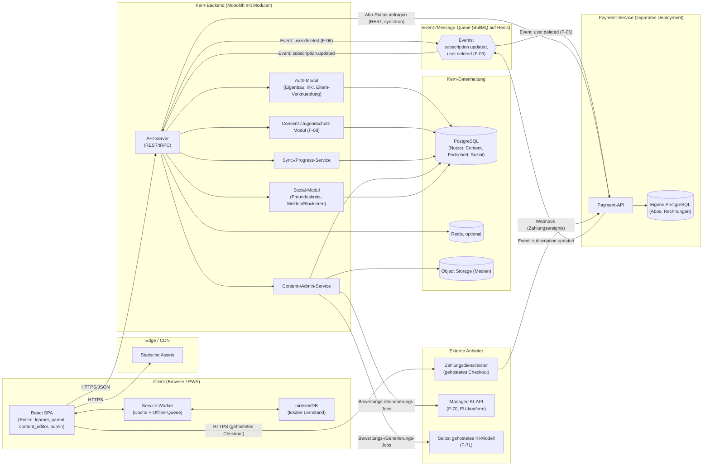
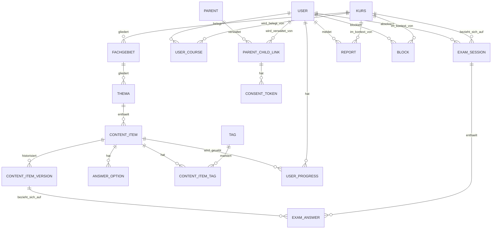

# Architekturplanung: edukedo — Lernplattform für Prüfungsvorbereitung & Wissenserwerb

Version 0.6 · Stand 12.09.2026 · Entwurf zur Abstimmung

> **Update (Version 0.6):** Ergebnis eines Entwickler-Reviews von Architekturplanung und Entwicklungsplan. Vier konkrete Schärfungen am Datenmodell/Konzept: (1) **`exam_answer`** referenziert jetzt `content_item_version_id` statt `content_item_id` — analog zum Duell (F-61) zeigt eine Prüfungsauswertung damit immer exakt den Wortlaut, der tatsächlich gestellt wurde, auch wenn der Content-Editor die Frage später korrigiert. Voraussetzung dafür: **`content_item_version`** wird ab sofort ausdrücklich bereits bei der *Erstellung* eines `content_item` angelegt (Version 1), nicht erst bei der ersten Bearbeitung. (2) **`answer_option`** erhält ein neues `side`-Feld (nur für `zuordnung`), das explizit macht, welcher der beiden Paar-Partner die „linke" bzw. „rechte" Seite ist — vorher trug nur `group_key` die Paar-Zugehörigkeit, ohne die Seite festzulegen. (3) Klargestellt: Die Selbstlöschung des eigenen Kontos (F-06) ist unabhängig vom Payment-Service bereits ab den ersten echten Nutzerkonten nötig, nicht erst mit Phase 4 (siehe Abschnitt 8). (4) Redaktionelle Klarstellung zu `report`/`block`: Diese gehören bewusst in dieselbe erste Migrations-Charge wie das übrige Phase-1-Schema (siehe Abschnitt 4.4, „Nächste Schritte").
>
> **Update (Version 0.5):** Abschnitt 4 (Datenmodell) grundlegend vertieft — von einer knappen ERD-Skizze zu einem soliden, flexiblen Schema mit tatsächlicher SQL-Schreibweise, expliziten Constraints/Indizes und dokumentiertem Löschverhalten je Tabelle. Wichtigste neue Elemente (alle am 12.09.2026 entschieden): **`content_item_version`** führt eine echte Versionshistorie statt einer reinen Versionsnummer ein (Grundlage für exakte Duell-Snapshots in Phase 4); **`content_item.payload`** (JSONB, typspezifisch) ergänzt die bisher nur für Multiple-Choice passende `answer_option`-Tabelle um Lückentext, Kurzantwort und Fallaufgaben, ohne für jeden Fragetyp eine eigene Tabelle zu benötigen; ein neues, kursübergreifendes **`tag`/`content_item_tag`**-System ergänzt die hierarchische Einordnung um freies Verschlagworten (F-13/F-14); `kurs.locale` bereitet F-52 vor, ohne jetzt schon eine Übersetzungstabelle zu bauen; fehlende Unique-Constraints (u. a. keine doppelte Kursbelegung, genau ein Fortschritts-Datensatz je Content-Item) wurden ergänzt; das kaskadierende Löschverhalten für F-06 ist jetzt je Tabelle explizit festgelegt statt nur allgemein beschrieben.
>
> **Update (Version 0.4):** Namensübernahme: Die Plattform heißt **edukedo** (siehe Anforderungskatalog Abschnitt 1, Version 0.19); rein redaktionelle Änderung ohne architektonische Konsequenz. Referenz auf den Anforderungskatalog von Version 0.17 auf die aktuelle Version 0.19 aktualisiert.
>
> **Update (Version 0.3):** Die verbliebenen offenen Architekturentscheidungen aus Abschnitt 13 (v0.2) wurden geklärt: (1) Die Kern-API nutzt **tRPC**. (2) Die Karteikarten-Logik (F-20) implementiert **direkt FSRS** statt mit SM-2 zu starten — das Datenmodell für `USER_PROGRESS` wurde entsprechend auf FSRS-Felder umgestellt. (3) Die konkrete Infrastruktur für das selbst gehostete KI-Modell (F-71/F-72) wird bewusst zurückgestellt und erst kurz vor Phase 4 entschieden. (4) Die Kommunikation zwischen Kern-Backend und Payment-Service wird um eine **Event-/Message-Queue** ergänzt (zusätzlich zu synchronen Statusabfragen und dem Zahlungsdienstleister-Webhook), damit Statusänderungen ohne Polling ankommen. (5) Der Payment-Service bleibt **im Monorepo** als eigenes App-Paket. (6) Der Melde-Workflow (F-68, Phase 4) wird als **einfache Zusatzansicht im bestehenden Admin-/Redaktionsbereich** umgesetzt, nicht als eigene Moderationsoberfläche.
>
> **Update (Version 0.2):** Grundlegend überarbeitet, um dem inzwischen stark erweiterten Anforderungskatalog (Version 0.17) zu entsprechen — insbesondere der strategischen Neuausrichtung als generische Multi-Kurs-Plattform (statt reiner Fachwirt-App), der Mehrfach-Kursbelegung (F-09), den Alters-/Jugendschutz- und Eltern-Anforderungen (F-08, F-90, F-53), der Isolierung des Zahlungsmoduls (N-11) sowie der neuen Melde-/Blockierfunktion (F-68). Wichtigste architektonische Entscheidungen dieser Version (alle am 12.09.2026 getroffen): Payment wird als vollständig separater Service mit eigener Datenbank betrieben — stärkere Isolation als ursprünglich vorgesehen; Auth wird komplett selbst gebaut statt Managed Auth zu nutzen, um die Eltern-Kind-Verknüpfung sauber abzubilden; das Eltern-Dashboard erhält einen eigenen, vollwertigen Account-Typ; das Datenmodell für Melden/Blockieren (F-68) wird bereits in Phase 1 mitgebaut, obwohl die Funktion selbst erst in Phase 4 aktiv wird.

Basiert auf dem Anforderungskatalog Version 0.19 (siehe separates Dokument, insbesondere Abschnitt 4 für das generische Content-Modell und Abschnitt 10 für alle „für die Architekturplanung" markierten Entscheidungen). Rahmenbedingungen: Web-App mit PWA-Fähigkeit, Backend mit Nutzerkonten und geräteübergreifender Synchronisierung, generisches Multi-Kurs-Modell von Anfang an, gestaffelter statt vollständiger Content-Umfang zum Start, zwei parallel startende Kurse (Fachwirt-Pilot + Schulfach-Kurs), Solo-/Kleinprojekt mit Wunsch nach niedrigen Betriebskosten und späterer Skalierbarkeit.

## 1. Leitprinzipien für die Architektur

- **Einfachheit vor Vollständigkeit, mit einer bewussten Ausnahme:** Der Kernbereich (Auth, Content, Sync/Progress, Sozial-/Gamification-Funktionen) bleibt ein Monolith mit klarer innerer Modulstruktur — weniger Betriebsaufwand, schnellere Entwicklung für eine Einzelperson. **Payment weicht davon ab und wird von Anfang an als eigener, vollständig getrennter Service mit eigener Datenbank betrieben** (siehe Abschnitt 8): Die stärkere Isolation wiegt hier den zusätzlichen Betriebsaufwand auf, weil ein Sicherheitsvorfall im Kernsystem so nicht automatisch auch Zahlungsdaten betrifft.
- **Content ist Daten, nicht Code — jetzt für beliebige Kurse:** Das generische Content-Modell (Kurs → Fachgebiet → Thema → Lerneinheit, siehe Anforderungskatalog Abschnitt 4) bedeutet, dass sowohl der Fachwirt-Pilot als auch der neue Schulfach-Kurs über dieselben Tabellen abgebildet werden, ohne Schemaänderung (siehe Abschnitt 4 dieses Dokuments).
- **Offline-first, wo es zählt:** Die individuellen Lernmodi (Karteikarten, Quiz, Übungssets) müssen auch mit wackliger Verbindung funktionieren; die sozialen Features (Duelle, Highscore, Lernpartner-Vermittlung) setzen ausdrücklich eine Online-Verbindung voraus (siehe F-42).
- **Datenmodell für Vertrauen/Jugendschutz früh anlegen, Funktion später aktivieren:** Analog zum bereits im Anforderungskatalog verankerten Vorgehen bei F-08 wird auch das Datenmodell für die Melde-/Blockierfunktion (F-68) schon in Phase 1 mitgebaut, obwohl die Funktion selbst erst mit den sozialen Features in Phase 4 live geht — vermeidet eine Schema-Änderung an einer dann bereits produktiven Datenbank mit echten Nutzerdaten.
- **Niedrige Einstiegskosten, klarer Wachstumspfad:** Start auf Hobby-/Free-Tiers, aber ohne Architekturentscheidungen, die einen späteren Umzug erzwingen.

## 2. Technologie-Empfehlung im Überblick

| Bereich | Empfehlung | Begründung |
|---|---|---|
| Frontend | React + TypeScript, Vite als Build-Tool | Größtes Ökosystem, gute PWA-Unterstützung, gut geeignet für interaktive Quiz-/Karteikarten-UI sowie für die neuen rollenbasierten Ansichten (learner, parent, content_editor, admin) |
| Styling/UI | Tailwind CSS + shadcn/ui-Komponenten | Schnelles, konsistentes UI ohne viel Custom-CSS |
| State/Data-Fetching | TanStack Query | Sauberes Caching und Sync von Server-Daten, wichtig für Offline/Sync-Logik |
| PWA/Offline | Vite PWA Plugin (Workbox) + IndexedDB (über Dexie.js) | Service-Worker-Caching für Assets, IndexedDB für Offline-Lernstand-Queue |
| Kern-Backend | **Node.js + TypeScript, Fastify** (entschieden am 12.09.2026, siehe Abschnitt 13) | Eine Sprache im gesamten Stack senkt Kontextwechsel-Kosten für eine Einzelperson; Fastify hat einen offiziellen tRPC-Adapter und weniger Boilerplate als NestJS für eine Einzelperson |
| Auth | **Eigenbau, im Kern-Backend, nach dem Lucia-Pattern** (entschieden am 12.09.2026, siehe Abschnitt 13) | Volle Kontrolle über Altersabfrage, Eltern-Verknüpfung (F-08) und einen eigenen Eltern-Account-Typ (F-90) — Managed-Auth-Anbieter (Supabase Auth/Clerk) unterstützen diese Eltern-Kind-Beziehung nicht nativ. Argon2id-Hashing plus signierte, httpOnly-Session-Cookies nach dem Lucia-Pattern (Sessions-Tabelle mit gehashtem Token, siehe Abschnitt 13) — Lucia selbst ist als Bibliothek inzwischen archiviert/deprecated, daher wird nur das Pattern übernommen, nicht die Bibliothek als Dependency eingebunden |
| Payment-Service | **Eigener Service, eigene Datenbank, eigenes Deployment** (entschieden am 12.09.2026) | Vollständige Isolation von Zahlungsdaten gegenüber dem Kernsystem (siehe Abschnitt 8); kommuniziert mit dem Kern-Backend nur über eine schmale, versionierte REST-API |
| API-Stil (Kern) | **tRPC** (entschieden am 12.09.2026) | Spart Boilerplate bei TS-Frontend+Backend im selben Monorepo; native Apps/Drittanbieter-Clients sind laut Anforderungskatalog ohnehin out of scope (Abschnitt 8) |
| API-Stil (Kern ↔ Payment) | REST/HTTPS für synchrone Statusabfragen, **plus Event-/Message-Queue** für asynchrone Statusänderungen (entschieden am 12.09.2026); Zahlungsdienstleister → Payment-Service weiterhin per Webhook | Zwei getrennte Services kommunizieren über einen stabilen, sprachunabhängigen Vertrag statt über TS-spezifische RPC-Mechanismen; die Queue liefert Statusänderungen (z. B. Premium-Freischaltung) ohne Polling an den Kern |
| Datenbank (Kern) | PostgreSQL (verwaltet, z. B. Neon oder Supabase) | Relational passt gut zu den strukturierten Beziehungen des generischen Content-Modells (Kurs → Fachgebiet → Thema → Content-Item → Fortschritt) |
| Datenbank (Payment) | Eigene PostgreSQL-Instanz (separates Neon-/Supabase-Projekt oder eigener Anbieter) | Physische statt nur logischer Trennung — konsistent mit der Entscheidung für einen vollständig separaten Service |
| ORM | **Drizzle ORM** (für den Kern entschieden am 12.09.2026, siehe Abschnitt 13; für Payment weiterhin unabhängig wählbar) | Typsichere Queries, SQL-nahe Migrationsverwaltung, die sich direkt am bereits als reinem SQL-DDL dokumentierten Schema (Abschnitt 4.3) orientiert; Kern und Payment teilen sich bewusst keine ORM-Modelle |
| Caching/Sessions | Redis (optional, erst bei Bedarf) | Session-Storage, Rate-Limiting (u. a. für Login und Einladungscodes, F-63); für MVP ggf. verzichtbar |
| Message-Queue (Kern ↔ Payment) | **BullMQ auf Redis** (empfohlen, konsistent mit dem ohnehin vorgesehenen Redis) | Kein zusätzlicher Infrastruktur-Anbieter nötig; deckt den entschiedenen Bedarf an asynchronen Statusänderungen ab. Alternative (z. B. ein Cloud-Messaging-Dienst wie SNS/SQS) bleibt möglich, falls Redis aus anderen Gründen entfällt |
| Objekt-/Medienspeicher | S3-kompatibel (z. B. Cloudflare R2) | Für Bilder/Diagramme in Lerninhalten |
| Hosting Frontend | Vercel oder Cloudflare Pages | Kostengünstiger Einstieg, automatisches Deployment aus Git, CDN inklusive |
| Hosting Kern-Backend + DB | Railway, Render oder Fly.io (+ Neon/Supabase für DB) | Einfaches Deployment, günstige Einstiegstarife |
| Hosting Payment-Service + DB | Eigenes, vom Kernsystem getrenntes Projekt/Environment beim selben oder einem anderen Anbieter | Eigene Zugriffskontrolle, eigene Umgebungsvariablen/Secrets — organisatorisch und physisch getrennt vom Kernsystem |
| Monorepo-Tooling | pnpm Workspaces + Turborepo, Payment-Service als eigenes App-Paket | Weiterhin ein Repository für einfachere Entwicklung als Solo-Person, aber unabhängig deploybar und ohne gemeinsamen DB-Zugriff |
| CI/CD | GitHub Actions, getrennte Deploy-Pipelines für Kern und Payment | Kostenlos für kleine Projekte; getrennte Pipelines verhindern, dass ein Fehler im einen Bereich versehentlich den anderen mit deployt |

**Alternative, falls du lieber mit Python arbeitest:** Backend mit FastAPI + SQLAlchemy statt Node/TypeScript; das restliche Konzept (PostgreSQL, REST/OpenAPI, Hosting, getrennter Payment-Service) bleibt gültig.

## 3. Systemarchitektur (Überblick)



Der Kern-Backend-„Monolith" bleibt intern modular (Auth, Consent, Content, Sync/Progress, Sozial als getrennte Module/Ordner), damit einzelne Teile bei Bedarf später als eigene Services herausgelöst werden können. Payment ist die eine bewusste Ausnahme von diesem Monolith-Prinzip (siehe Abschnitt 1, 8): Frontend und Nutzer:innen interagieren dort, wo möglich, direkt mit dem gehosteten Checkout des Zahlungsdienstleisters, damit möglichst wenig Zahlungsdaten überhaupt die eigene Infrastruktur berühren (siehe F-81). **Kern und Payment-Service kommunizieren über zwei Kanäle (entschieden am 12.09.2026):** synchrone REST-Statusabfragen für den unmittelbaren Bedarf (z. B. beim Login prüfen, ob Premium aktiv ist) und eine Event-/Message-Queue für asynchrone Statusänderungen (z. B. eine neue Zahlung schaltet Premium frei, ohne dass der Kern dafür pollen müsste) sowie für die umgekehrte Richtung (der Kern meldet eine Konto-Löschung nach F-06 an den Payment-Service, damit dieser seine eigenen Daten ebenfalls bereinigt).

## 4. Datenmodell (Kernentitäten, Stand Phase 1)

**Überarbeitet und deutlich vertieft am 12.09.2026** (vorherige Fassung: knappe ERD-Skizze; siehe Abschnitt 13 für die dabei getroffenen Entscheidungen). Ziel dieser Überarbeitung: ein Schema, das sowohl **solide** ist (referenzielle Integrität, sinnvolle Constraints/Indizes, sauberer Umgang mit Löschungen und Versionierung) als auch **flexibel** bleibt (neue Kurstypen, Content-Formate und Sprachen ohne Breaking-Change am Schema).

### 4.1 Designprinzipien

- **Hybrid relational/JSONB, je nach Vorhersagbarkeit der Struktur:** Wo die Struktur stabil und häufig strukturiert abgefragt wird (Kurs-Hierarchie, Multiple-Choice-Optionen, Fortschritt), bleibt das Modell relational mit echten Spalten/Fremdschlüsseln. Wo die Struktur je nach Content-Typ oder Kurstyp variiert (Lückentext-Lücken, Fallaufgaben-Teilschritte, kurstypspezifische Zusatzattribute), übernimmt ein `payload`/`metadata`-JSONB-Feld die Flexibilität — validiert nicht durch die Datenbank, sondern per Zod-Schema auf Anwendungsebene (siehe Abschnitt 7), pro `type`-Wert unterschiedlich. Das vermeidet sowohl ein „JSONB für alles" (nichts mehr abfragbar/indexierbar) als auch ein „eigene Tabelle pro Content-Typ" (Schema-Änderung bei jedem neuen Fragetyp, widerspricht N-05).
- **Versionierung statt Hard-Delete bei Content:** `CONTENT_ITEM` wird bei Bearbeitung nicht überschrieben, sondern über `CONTENT_ITEM_VERSION` historisiert (setzt F-12 konkret um). Das ist zugleich die solide Grundlage für den beim Duell (F-61, Phase 4) geforderten Content-Snapshot sowie — seit Version 0.6 — für Prüfungsantworten (`EXAM_ANSWER`, siehe unten): Beide referenzieren eine konkrete `content_item_version_id`, nicht nur eine veränderliche Versionsnummer. **Wichtig:** `CONTENT_ITEM_VERSION` wird deshalb nicht erst bei der ersten Bearbeitung angelegt, sondern bereits beim Erstellen eines `CONTENT_ITEM` (Version 1) — sonst gäbe es für ein brandneues Content-Item keine Version, auf die eine frühe Prüfungsantwort oder ein frühes Duell verweisen könnte.
- **Explizite Unique-Constraints gegen unmögliche Zustände:** z. B. genau ein `USER_PROGRESS`-Datensatz je (`user_id`, `content_item_id`), keine doppelte Kursbelegung in `USER_COURSE` — im Vorgängerentwurf nicht explizit, hier nachgezogen.
- **Löschverhalten pro Tabelle bewusst festgelegt statt nur in Prosa beschrieben:** F-06 (Konto-/Datenlöschung) verlangt kaskadierendes Löschen; welche Fremdschlüssel `CASCADE`, `SET NULL` oder `RESTRICT` auslösen, ist unten je Tabelle vermerkt statt nur allgemein postuliert. Die **Selbstlöschung des eigenen Kontos ist dabei unabhängig vom Payment-Service** bereits ab den allerersten echten Nutzerkonten nötig (nicht erst mit Phase 4/Payment) — siehe Abschnitt 8.
- **Freies Verschlagworten quer zur Kurs-Hierarchie:** Eine neue `TAG`/`CONTENT_ITEM_TAG`-Verknüpfung ergänzt F-13/F-14 um kursübergreifende, frei vergebbare Schlagworte (z. B. „Prüfungsrelevant", „Wiederholung empfohlen") — unabhängig von Kurs/Fachgebiet/Thema und damit flexibler als eine rein hierarchische Einordnung.
- **Eindeutige Seitenzuordnung bei Zuordnungs-Paaren:** `ANSWER_OPTION` erhält (seit Version 0.6) neben `group_key` ein `side`-Feld, das bei `type = 'zuordnung'` explizit festlegt, ob eine Option die linke oder rechte Seite eines Paares ist — vorher war das nur implizit über Anwendungskonvention lösbar.
- **Mehrsprachigkeit vorbereitet, ohne sie jetzt zu bauen (F-52):** `KURS.locale` (Default `de`) hält fest, in welcher Sprache ein Kurs geführt wird. Weitere Sprachen kämen additiv über eine spätere `CONTENT_ITEM_TRANSLATION`-Tabelle hinzu, ohne bestehende Spalten zu verändern — im Phase-1-Schema bewusst noch nicht angelegt (kein aktueller Bedarf, siehe F-52 Priorität „Kann").

### 4.2 ER-Diagramm (Überblick, Phase 1)



### 4.3 Tabellenschema (Phase 1)

Tabellen-/Spaltennamen hier bereits in der tatsächlichen SQL-Schreibweise (`snake_case`), passend zu Drizzle/Prisma. `references(...)` zeigt jeweils den Fremdschlüssel samt Lösch-/Änderungsverhalten.

**Content-Hierarchie**

```sql
kurs (
  id            uuid primary key default gen_random_uuid(),
  slug          text not null unique,                 -- z.B. "fachwirt-buero-projektorganisation", "mathematik-9-bundeslandneutral"
  type          text not null,                          -- "fachwirt" | "schulfach" | ... (offen für weitere Typen, F-13/N-05)
  title         text not null,
  locale        char(5) not null default 'de',          -- Vorbereitung F-52, siehe 4.1
  metadata      jsonb not null default '{}',             -- z.B. Klassenstufe, Bundesland-Ansatz (F-13)
  target_mode   text not null default 'einzeltermin',   -- "einzeltermin" | "wochenziel" (F-35)
  is_published  boolean not null default false,
  created_at    timestamptz not null default now(),
  updated_at    timestamptz not null default now()
);

fachgebiet (
  id          uuid primary key default gen_random_uuid(),
  kurs_id     uuid not null references kurs(id) on delete cascade,
  code        text not null,                            -- z.B. "HB1", "algebra"
  title       text not null,
  sort_order  int not null default 0,
  metadata    jsonb not null default '{}',
  unique (kurs_id, code)
);
create index on fachgebiet (kurs_id, sort_order);

thema (
  id             uuid primary key default gen_random_uuid(),
  fachgebiet_id  uuid not null references fachgebiet(id) on delete cascade,
  title          text not null,
  sort_order     int not null default 0
);
create index on thema (fachgebiet_id, sort_order);
```

**Content-Items — relational, wo stabil, JSONB, wo variabel**

```sql
content_item (
  id               uuid primary key default gen_random_uuid(),
  thema_id         uuid not null references thema(id) on delete cascade,
  type             text not null,          -- "theorie" | "karteikarte" | "quiz_mc" | "zuordnung" | "luecken" | "kurzantwort" | "fallaufgabe"
  prompt           text not null,           -- Frage/Vorderseite/Aufgabentext, je nach type
  explanation      text,                    -- Erklärung/Rückseite/Musterlösung, je nach type
  payload          jsonb not null default '{}', -- typspezifische Struktur, siehe unten
  difficulty       text not null default 'mittel', -- "leicht" | "mittel" | "schwer"
  is_premium       boolean not null default false,   -- F-80
  is_active        boolean not null default true,    -- Soft-Delete statt Hard-Delete: alte Fortschritts-/Prüfungsdaten bleiben referenzierbar
  current_version  int not null default 1,
  created_by       uuid references "user"(id) on delete set null,
  created_at       timestamptz not null default now(),
  updated_at       timestamptz not null default now()
);
create index on content_item (thema_id) where is_active;

-- Historie zu jeder inhaltlichen Änderung (F-12), Grundlage für Duell- (F-61) und Pruefungs-Snapshots (EXAM_ANSWER).
-- Wird bereits beim Erstellen eines content_item als Version 1 angelegt, nicht erst bei der ersten Bearbeitung (siehe 4.1).
content_item_version (
  id               uuid primary key default gen_random_uuid(),
  content_item_id  uuid not null references content_item(id) on delete cascade,
  version_number   int not null,
  prompt           text not null,
  explanation      text,
  payload          jsonb not null,
  changed_by       uuid references "user"(id) on delete set null,
  change_note      text,
  created_at       timestamptz not null default now(),
  unique (content_item_id, version_number)
);

-- Nur für type IN ('quiz_mc', 'zuordnung'). Bei quiz_mc bleiben group_key/side leer, is_correct traegt die Bewertung.
-- Bei zuordnung tragen genau zwei Zeilen denselben group_key mit unterschiedlichem side-Wert ("links"/"rechts") -
-- side macht explizit, welcher Paar-Partner auf welcher Seite der Zuordnungs-UI erscheint (seit Version 0.6).
answer_option (
  id                uuid primary key default gen_random_uuid(),
  content_item_id   uuid not null references content_item(id) on delete cascade,
  group_key         text,               -- nur Zuordnung: verknüpft zusammengehörige Paare
  side              text,               -- nur Zuordnung: "links" | "rechts"
  text              text not null,
  is_correct        boolean not null default false,
  sort_order        int not null default 0
);
create index on answer_option (content_item_id);

-- Freies, kursübergreifendes Verschlagworten (F-13/F-14), unabhängig von der Kurs-Hierarchie
tag (
  id    uuid primary key default gen_random_uuid(),
  name  text not null unique
);

content_item_tag (
  content_item_id  uuid not null references content_item(id) on delete cascade,
  tag_id           uuid not null references tag(id) on delete cascade,
  primary key (content_item_id, tag_id)
);
```

**Payload-Struktur je `content_item.type` (auf Anwendungsebene per Zod validiert, nicht in der DB erzwungen):**

| `type` | `payload`-Inhalt (Beispiel) |
|---|---|
| `theorie` | `{ "body_markdown": "...", "images": ["..."] }` |
| `karteikarte` | `{}` (Vorder-/Rückseite genügen `prompt`/`explanation`) |
| `quiz_mc` | `{}` (Optionen liegen in `answer_option`) |
| `zuordnung` | `{}` (Paare liegen in `answer_option` über `group_key`/`side`) |
| `luecken` | `{ "text_with_blanks": "...", "blanks": [{"id": "1", "accepted": ["..."]}] }` |
| `kurzantwort` | `{ "accepted_answers": ["..."], "match_mode": "exact\|contains" }` |
| `fallaufgabe` | `{ "parts": [{"prompt": "...", "points": 5}] }` |

**Nutzerkonten & Kursbelegung**

```sql
"user" (
  id                 uuid primary key default gen_random_uuid(),
  email              citext not null unique,           -- benoetigt Postgres-Extension "citext", siehe Abschnitt 9
  password_hash      text not null,
  birth_date         date,
  is_minor           boolean not null,   -- bei Registrierung aus birth_date abgeleitet und persistiert (F-08, N-13)
  email_verified_at  timestamptz,
  created_at         timestamptz not null default now(),
  updated_at         timestamptz not null default now()
);

-- n:m Nutzerkonto <-> Kurs (F-09), von Anfang an eigene Verknüpfungstabelle
user_course (
  id               uuid primary key default gen_random_uuid(),
  user_id          uuid not null references "user"(id) on delete cascade,
  kurs_id          uuid not null references kurs(id) on delete cascade,
  target_date      date,
  plan_start_date  date,
  joined_at        timestamptz not null default now(),
  unique (user_id, kurs_id)   -- verhindert Doppel-Belegung desselben Kurses
);
```

**Fortschritt & Prüfungssimulation**

```sql
user_progress (
  id               uuid primary key default gen_random_uuid(),
  user_id          uuid not null references "user"(id) on delete cascade,
  content_item_id  uuid not null references content_item(id) on delete cascade,
  difficulty       real not null,        -- FSRS-Parameter
  stability        real not null,        -- FSRS-Parameter
  state            text not null,        -- "new" | "learning" | "review" | "relearning"
  due_at           timestamptz not null,
  last_reviewed_at timestamptz,
  last_result      text,                 -- "gewusst" | "unsicher" | "nicht_gewusst"
  reps             int not null default 0,
  lapses           int not null default 0,
  unique (user_id, content_item_id)      -- genau ein Fortschritts-Datensatz je Nutzer:in und Content-Item
);
create index on user_progress (user_id, due_at);   -- zentrale Abfrage für F-20/F-27: "welche Karten sind fällig"

exam_session (
  id           uuid primary key default gen_random_uuid(),
  user_id      uuid not null references "user"(id) on delete cascade,
  kurs_id      uuid not null references kurs(id) on delete cascade,
  mode         text not null,     -- "quiz" | "schriftliche_simulation" | "praesentation" | "fachgespraech"
  started_at   timestamptz not null default now(),
  finished_at  timestamptz,
  score        real
);
create index on exam_session (user_id, kurs_id);

-- Seit Version 0.6: referenziert content_item_version_id statt content_item_id, analog zum Duell (F-61) -
-- eine Pruefungsauswertung zeigt damit immer den Wortlaut, der zum Pruefungszeitpunkt tatsaechlich galt,
-- auch wenn die Frage danach redaktionell korrigiert wurde.
exam_answer (
  id                       uuid primary key default gen_random_uuid(),
  exam_session_id          uuid not null references exam_session(id) on delete cascade,
  content_item_version_id  uuid not null references content_item_version(id) on delete restrict, -- Pruefungsantworten bleiben auch bei (seltenem) Content-Hard-Delete auswertbar
  given_answer             jsonb not null,   -- Struktur variiert wie beim payload je nach content_item.type
  is_correct               boolean,
  points                   real
);
create index on exam_answer (exam_session_id);
```

**Eltern-/Jugendschutz (F-08, F-90)**

```sql
parent (
  id             uuid primary key default gen_random_uuid(),
  email          citext not null unique,
  password_hash  text not null,
  created_at     timestamptz not null default now()
);

parent_child_link (
  id              uuid primary key default gen_random_uuid(),
  parent_id       uuid not null references parent(id) on delete cascade,
  user_id         uuid not null references "user"(id) on delete cascade,
  consent_status  text not null default 'pending',  -- "pending" | "confirmed" | "revoked"
  consented_at    timestamptz,
  revoked_at      timestamptz,
  unique (parent_id, user_id)
);

consent_token (
  id                     uuid primary key default gen_random_uuid(),
  parent_child_link_id   uuid not null references parent_child_link(id) on delete cascade,
  token_hash             text not null unique,
  expires_at             timestamptz not null,
  used_at                timestamptz,
  reminder_sent_count    int not null default 0
);
create index on consent_token (expires_at);  -- für Erinnerungs-/Aufräum-Jobs
```

**Melden/Blockieren (F-68, Datenmodell bereits in der ersten Migrations-Charge von Phase 1, UI erst Phase 4)**

```sql
report (
  id                 uuid primary key default gen_random_uuid(),
  reporter_user_id   uuid references "user"(id) on delete set null,  -- Meldung bleibt für Moderation bestehen, auch wenn meldende Person das Konto löscht
  reported_user_id   uuid references "user"(id) on delete cascade,   -- betrifft die gemeldete Person direkt -> mit ihr löschen
  kurs_id            uuid not null references kurs(id) on delete cascade,
  reason             text not null,
  status             text not null default 'offen',  -- "offen" | "geprueft" | "abgelehnt"
  created_at         timestamptz not null default now()
);

block (
  id                uuid primary key default gen_random_uuid(),
  user_id           uuid not null references "user"(id) on delete cascade,
  blocked_user_id   uuid not null references "user"(id) on delete cascade,
  kurs_id           uuid not null references kurs(id) on delete cascade,
  created_at        timestamptz not null default now(),
  unique (user_id, blocked_user_id, kurs_id)
);
```

### 4.4 Hinweise

- **KURS/FACHGEBIET/THEMA/CONTENT_ITEM** ersetzen die frühere, fachwirt-spezifische `HANDLUNGSBEREICH`-Tabelle durch das generische Content-Modell aus Anforderungskatalog Abschnitt 4. Der Fachwirt-Pilot und der Schulfach-Kurs sind beides einfach Zeilen in `kurs`, ohne Schemaunterschied — konsistent mit dem dortigen Architektur-Check.
- **`kurs.metadata` (JSONB)** setzt die Entscheidung zu kursspezifischen Zusatzattributen (F-13) um — z. B. Klassenstufe/Bundesland beim Schulfach-Kurs — ohne kurstypspezifische Spalten/Tabellen. `kurs.locale` bereitet F-52 vor, ohne jetzt schon eine Übersetzungstabelle anzulegen. `kurs.is_published` ist zugleich der Schalter, mit dem ein Kurs (z. B. der Mathe-Kurs, siehe Abschnitt 8) erst dann für echte Nutzer:innen sichtbar wird, wenn die dafür nötige Schutzinfrastruktur steht.
- **`user_course`** realisiert die n:m-Beziehung Nutzerkonto↔Kurs (F-09) als eigene Verknüpfungstabelle von Anfang an; der `unique`-Constraint auf (`user_id`, `kurs_id`) verhindert eine versehentliche Doppel-Belegung, die im Vorgängerentwurf nicht ausgeschlossen war.
- **`user.is_minor`** wird bei Registrierung aus `birth_date` abgeleitet und persistiert (statt bei jeder Anfrage neu berechnet), damit Berechtigungsprüfungen (F-66, N-13) und der Ausschluss von Profiling/personalisierter Werbung für Minderjährige (N-01) einfach und konsistent auf dieses eine Feld referenzieren können.
- **`content_item.payload` (JSONB) + `answer_option` (relational)** lösen gemeinsam ab, was im Vorgängerentwurf nur für Multiple-Choice sauber passte: Multiple-Choice und Zuordnung bleiben relational und damit abfragbar/auswertbar (z. B. „welche falsche Antwortoption wird am häufigsten gewählt", relevant für F-16); Lückentext, Kurzantwort und Fallaufgaben nutzen `payload`, weil ihre Struktur zu unterschiedlich ist, um sinnvoll in eigene Spalten/Tabellen zu pressen. Bei Zuordnung macht das neue `side`-Feld (seit Version 0.6) explizit, welche zwei Zeilen mit gleichem `group_key` jeweils die linke bzw. rechte Seite eines Paares sind.
- **`content_item_version`** ist neu (entschieden am 12.09.2026) und macht aus der bisher nur als Zahl geführten Versionierung (F-12) eine echte Historie: Jede inhaltliche Änderung erzeugt einen neuen Versionsdatensatz, statt die alte Fassung zu überschreiben — inklusive Version 1 bereits beim Erstellen des Content-Items (siehe 4.1). Das ist die Voraussetzung dafür, dass sowohl ein Duell (F-61, Phase 4) als auch — seit Version 0.6 — eine abgelegte Prüfungsantwort (`exam_answer`) exakt auf eine bestimmte Content-Fassung verweisen können (`content_item_version_id`) statt nur auf eine veränderliche Versionsnummer.
- **`content_item.is_active`** ersetzt einen harten Löschvorgang für Content: Damit bleiben referenzierte `user_progress`- und `exam_answer`-Datensätze auch dann noch sinnvoll auswertbar, wenn ein Content-Item redaktionell zurückgezogen wird.
- **`tag`/`content_item_tag`** sind neu (entschieden am 12.09.2026) und ergänzen F-13/F-14 um freies, kursübergreifendes Verschlagworten, das nicht an die Kurs-Hierarchie gebunden ist — z. B. ein Tag „Prüfungsrelevant", das sowohl im Fachwirt- als auch im Mathematik-Kurs verwendet werden kann.
- **`parent`, `parent_child_link`, `consent_token`** setzen F-08 und F-90 um: `parent` ist ein eigener, vollwertiger Account-Typ (wie entschieden); `parent_child_link.consent_status` trägt den Einwilligungsstatus inkl. Widerruf (F-90); `consent_token` speichert nur den Hash des Bestätigungslinks (nicht im Klartext) mit Ablaufdatum und einem Zähler für die automatischen Erinnerungsmails.
- **Der Vorschau-Modus (F-08)** ist bewusst nicht Teil dieses Datenmodells: Er wird zustandslos aus dem öffentlichen Content-Bestand bedient, ohne einen `user`-Datensatz oder `user_progress`-Einträge anzulegen — konsistent mit der Vorgabe „keine Speicherung von Fortschritt oder personenbezogenen Daten".
- **`report`/`block`** gehören von Anfang an in dieselbe erste Migrations-Charge wie das übrige Phase-1-Schema (klargestellt in Version 0.6 — vorher stand nur „bereits in Phase 1", ohne den Zeitpunkt innerhalb von Phase 1 eindeutig festzulegen), obwohl die zugehörige Funktion (F-68) erst in Phase 4 zusammen mit den sozialen Features aktiv genutzt wird. Bewusst asymmetrisches Löschverhalten: Löscht die meldende Person ihr Konto, bleibt die Meldung selbst (mit `reporter_user_id = null`) für die Moderationshistorie erhalten; löscht dagegen die gemeldete Person ihr Konto, verliert die Meldung mit ihr ihren Gegenstand und wird mitgelöscht.
- **Löschverhalten (F-06) im Überblick:** Löscht sich ein `user`, kaskadiert das automatisch über `user_course`, `user_progress`, `exam_session` (und darüber `exam_answer`), `parent_child_link` (als Kind) sowie `block`/`report.reported_user_id`; `report.reporter_user_id` wird stattdessen auf `null` gesetzt (siehe oben). `content_item`-Löschungen sind durch `is_active` ohnehin die Ausnahme; falls doch einmal ein Content-Item hart gelöscht wird (was über `content_item_version` kaskadiert), bleiben Prüfungsantworten (`exam_answer`) dank `on delete restrict` auf `content_item_version` geschützt — ein Hard-Delete einer Content-Version mit vorhandenen Prüfungsantworten wird von der Datenbank verweigert, statt still Daten zu verlieren.
- Zahlungsdaten (Abos, Rechnungen) liegen bewusst **nicht** in diesem Datenmodell, sondern in der eigenen Datenbank des Payment-Service (siehe Abschnitt 3, 8) und werden hier nur als Referenz (`user_id`) von außen adressiert.

### 4.5 Phase-4-Erweiterung (Skizze, noch nicht Teil der Phase-1-Migrationen)

Sobald die sozialen Features (F-60–F-65) sowie die Kohorten-/Dozenten-Funktion (F-07, F-64, F-65) gebaut werden, kommen u. a. folgende Tabellen hinzu: `friend_circle_link` (kursbezogen, F-63), `invite_code` (F-63, mit Ablaufdatum/Rate-Limiting), `duel`/`duel_answer` (F-61 — referenziert dank `content_item_version` jetzt sauber eine konkrete Content-Fassung statt nur einer Versionsnummer, analog zu `exam_answer`), `highscore_entry` (F-60), `achievement` (F-67) sowie `cohort`/`cohort_member` (F-64/F-65). `report` und `block` existieren dann bereits und müssen nur noch mit der neuen UI verdrahtet werden.

## 5. Offline-/PWA-Strategie

1. **App-Shell & Assets:** Service Worker cached das UI-Bundle beim ersten Besuch (Workbox „precache").
2. **Content-Vorabladung:** Beim Login bzw. auf Wunsch werden die Lerninhalte des gewählten Kurses/Fachgebiets (statt wie zuvor nur eines Handlungsbereichs) in IndexedDB gespiegelt, sodass Karteikarten/Quiz auch offline funktionieren — unabhängig davon, ob es sich um den Fachwirt-Piloten oder den Schulfach-Kurs handelt.
3. **Offline-Antworten:** Beantwortete Fragen/Karteikarten-Bewertungen werden bei fehlender Verbindung lokal in einer Warteschlange (IndexedDB) gespeichert.
4. **Sync bei Wiederverbindung:** Ein Sync-Service im Kern-Backend nimmt die gepufferten Ereignisse entgegen, wendet sie serverseitig auf `USER_PROGRESS` an und löst Konflikte nach „last write wins" pro Content-Item.
5. **Statusanzeige:** Die UI zeigt sichtbar an, ob gerade offline gearbeitet wird und ob noch nicht synchronisierte Änderungen bestehen.
6. **Ausdrücklich ausgenommen:** Die sozialen Features (Highscore, Duelle, Lernpartner-Vermittlung, Melden/Blockieren) setzen wie entschieden (F-42) eine Online-Verbindung voraus und werden nicht offline gepuffert.

## 6. Spaced-Repetition-Algorithmus

**Entschieden am 12.09.2026: FSRS (Free Spaced Repetition Scheduler)** wird direkt implementiert, statt zunächst mit dem einfacheren SM-2 zu starten. FSRS sagt optimale Wiederholungsintervalle genauer voraus (u. a. in Anki seit 2023 Standard), erfordert dafür aber von Anfang an die FSRS-spezifischen Parameter im Datenmodell (`difficulty`, `stability`, `state`, siehe Abschnitt 4) statt des einfacheren SM-2-Modells (`ease_factor`/`interval_days`). Empfohlene Umsetzung: die etablierte Bibliothek **ts-fsrs** (TypeScript-Referenzimplementierung des Algorithmus) statt einer Eigenimplementierung, um Implementierungsfehler bei der Parameter-Optimierung zu vermeiden.

## 7. API-Design-Grundsätze

- **Kern-API:** Klare Trennung nach Modulen: `/auth/*`, `/consent/*` (Eltern-Einwilligungs-Flow, F-08), `/parent/*` (Eltern-Dashboard, F-90), `/courses/*`, `/content/*` (lesend, für Lernende), `/admin/content/*` (schreibend, nur Redaktion/Admin-Rolle), `/progress/*`, `/exam-sessions/*`, `/reports/*` und `/blocks/*` (F-68, Backend ab Phase 1 vorhanden, UI erst Phase 4).
- Konsequente Eingabevalidierung mit Zod-Schemas, die zwischen Frontend und Kern-Backend geteilt werden (Monorepo-Vorteil) — **bewusst nicht** mit dem Payment-Service geteilt, um dessen Isolation nicht über gemeinsame Typen/Verträge aufzuweichen.
- Autorisierung rollenbasiert: `learner`, `parent`, `content_editor`, `admin` (später ergänzt um `dozent`, siehe F-07).
- Versionierung der API von Anfang an einplanen (`/api/v1/...`).
- **Payment-API (separater Service):** Eigene, schmale REST-Schnittstelle, die dem Kern-Backend nur das Nötigste preisgibt (z. B. „ist Nutzer:in X aktuell Premium, bis wann"), plus ein Webhook-Endpunkt für Ereignisse des Zahlungsdienstleisters. Wo immer möglich, interagiert das Frontend direkt mit dem gehosteten Checkout des Zahlungsdienstleisters statt über eine eigene API, um Zahlungsdaten aus der eigenen Infrastruktur herauszuhalten (F-81).

## 8. Sicherheits- und Datenschutzkonzept

- Passwort-Hashing mit Argon2id (gilt jetzt für Auth **und** für den separaten Payment-Service, jeweils eigenständig implementiert).
- HTTPS erzwingen (HSTS), sichere Cookie-Flags (`HttpOnly`, `Secure`, `SameSite=Lax`) bei Session-/Refresh-Token.
- Rate-Limiting auf Login/Registrierung sowie auf Einladungscodes (F-63, zeitlich befristet und rate-limitiert).
- Serverstandort EU für Kern- **und** Payment-Infrastruktur; Auftragsverarbeitungsverträge (AVV) getrennt mit dem Zahlungsdienstleister und mit dem Managed-KI-API-Anbieter (F-72) abschließen.
- **Payment-Isolation (entschieden am 12.09.2026):** Der Payment-Service läuft als eigenständiges Deployment mit eigener Datenbank, eigenen Zugriffsberechtigungen und eigenen Secrets. Ein Sicherheitsvorfall im Kernsystem (z. B. eine kompromittierte Kern-Datenbank) betrifft dadurch keine Zahlungsdaten, und umgekehrt. Kartendaten selbst werden ohnehin nie in der eigenen Infrastruktur gespeichert — die Zahlungsabwicklung läuft über das gehostete Checkout eines PCI-DSS-konformen Anbieters (siehe F-81).
- **Datensparsamkeit bei Minderjährigen (N-01, N-13):** `USER.is_minor` steuert, dass für diese Konten keine Profilbildung/personalisierte Werbung erfolgt und Analytics-Ereignisse (siehe N-08) ohne marketingfähige Tracking-IDs erfasst werden — reine aggregierte Nutzungsmetriken (aktive Nutzer:innen, Abschlussquote) bleiben davon unberührt.
- **Eltern-Consent-Flow (F-08):** `CONSENT_TOKEN` speichert nur einen Hash des Bestätigungslinks (nicht im Klartext), mit Ablaufdatum; ein Zähler (`reminder_sent_count`) steuert die automatischen Erinnerungsmails. Ein Widerruf setzt `PARENT_CHILD_LINK.consent_status` auf `revoked` und sperrt/löscht das Kindeskonto (F-90) über denselben kaskadierenden Löschprozess wie F-06. **Ein Kurs mit überwiegend minderjähriger Zielgruppe (z. B. der Mathe-Kurs) darf erst dann für echte Nutzer:innen veröffentlicht werden (`kurs.is_published = true`), wenn dieser Flow produktiv steht** — siehe dazu auch den Entwicklungsplan, dessen Iterationsreihenfolge das seit dem Entwickler-Review vom 12.09.2026 explizit abbildet.
- **Vorschau-Modus (F-08):** Technisch bewusst ohne Personenbezug umgesetzt — zustandslos aus dem öffentlichen Content-Bestand bedient, kein Datenbank-Schreibzugriff, keine Cookies/IDs, die eine spätere Zuordnung ermöglichen würden.
- **Lösch- und Auskunftsprozess (F-06):** Account-Löschung → kaskadierendes Löschen aller personenbezogenen Daten inkl. `USER_PROGRESS`, `EXAM_SESSION`, `USER_COURSE`, `PARENT_CHILD_LINK` technisch vorbereiten. **Klarstellung (Version 0.6):** Die Selbstlöschung des eigenen Kontos ist eine Grundfunktion, die unabhängig vom Payment-Service benötigt wird, sobald überhaupt reale Nutzerkonten existieren — sie darf nicht erst mit der Payment-Service-Anbindung (Phase 4) kommen, auch wenn die Event-basierte Benachrichtigung des Payment-Service über gelöschte Konten (siehe Abschnitt 3) naturgemäß erst greift, sobald dieser existiert.
- **Event-/Message-Queue Kern ↔ Payment (entschieden am 12.09.2026):** Events werden mit eindeutiger ID versehen und idempotent verarbeitet (ein doppelt zugestelltes `subscription.updated`-Event darf nicht doppelt Premium verlängern); beide Seiten protokollieren verarbeitete Event-IDs, um Wiederholungen sicher zu erkennen.
- **Offener Punkt, keine architektonische Konsequenz bisher:** Ob der Jugendmedienschutz-Staatsvertrag (JMStV) eine Pflicht zur Benennung einer/eines Jugendschutzbeauftragten auslöst, ist laut Anforderungskatalog (Abschnitt 7, 10) noch offen und getrennt von der DSGVO-Prüfung zu klären. Architektonisch ist dafür bereits vorgesorgt: Das Report/Block-Datenmodell (Abschnitt 4) existiert unabhängig vom Ausgang dieser Prüfung.

## 9. Deployment & CI/CD

- **Umgebungen:** `local` (Docker Compose für Postgres/Redis lokal, für Kern **und** Payment getrennt) → `staging` → `production`.
- **CI (GitHub Actions):** Lint, Typecheck, Unit-/Integrationstests, Build bei jedem Pull Request; automatisches Deploy nach `main` auf Staging, manuelles Promote auf Production.
- **Zwei getrennte Deploy-Pipelines:** Kern-Backend/Frontend und Payment-Service werden unabhängig voneinander deployt, mit eigenen Secrets und eigenen Umgebungsvariablen — ein Deployment-Fehler im einen Bereich löst kein versehentliches Deployment im anderen aus.
- **Migrationen:** über Drizzle/Prisma-Migrationsdateien, je Service in dessen eigenem Repository-Ordner versioniert, automatisiert bei dessen Deployment ausgeführt. Die erste Kern-Migration muss die benötigten Postgres-Extensions mit aktivieren (`citext` für `"user".email`/`parent.email`, `pgcrypto` bzw. die entsprechende Extension für `gen_random_uuid()`, je nach Anbieter ggf. bereits vorinstalliert).
- **Secrets:** über die Umgebungsvariablen-Verwaltung des jeweiligen Hosting-Anbieters, nie im Repo; Kern- und Payment-Secrets sind strikt getrennt.
- **Message-Queue-Infrastruktur:** Redis-Instanz für BullMQ wird als dritte, gemeinsam von Kern und Payment-Service erreichbare Komponente bereitgestellt (z. B. eine verwaltete Redis-Instanz); Zugriff beidseitig über eigene Credentials, keine gemeinsame Datenbank-Verbindung.

## 10. Testkonzept

| Ebene | Werkzeug | Fokus |
|---|---|---|
| Unit-Tests | Vitest | Spaced-Repetition-Logik, Auswertungsfunktionen, Validierung, `is_minor`-Ableitung |
| Integrationstests | Vitest + Testcontainers (Postgres) | API-Endpunkte gegen echte Test-DB, getrennt für Kern und Payment |
| Kontrakttests Kern ↔ Payment | z. B. einfache HTTP-Mocks/Contract-Tests | Stellt sicher, dass beide Services trotz getrennter Codebasen/Deployments kompatibel bleiben |
| Event-/Queue-Tests Kern ↔ Payment | Vitest + Test-Redis-Instanz | Idempotenz-Verhalten bei doppelt zugestellten Events (z. B. `subscription.updated`), Verhalten bei Queue-Ausfall |
| End-to-End | Playwright | Kernflows: Registrierung, Karteikarten-Session, Quiz, Offline→Online-Sync, **sowie neu:** Eltern-Consent-Flow (Registrierung Minderjährige:r → Eltern-Mail → Bestätigungslink → Kontoaktivierung → Widerruf über Eltern-Dashboard) |
| Backend-Tests Report/Block | Vitest + Testcontainers | Bereits ab Phase 1 testbar, auch ohne zugehörige UI (F-68) |
| Manuelle Prüfung | — | Barrierefreiheit (Screenreader-Stichprobe), Content-Korrektheit |

## 11. Repository-/Projektstruktur (Vorschlag)

```
/apps
  /web        → React-PWA-Frontend (Rollen: learner, parent, content_editor, admin)
  /api        → Kern-Backend (Fastify/NestJS) — Auth, Consent, Content, Sync, Sozial
  /payment    → Eigenständiger Payment-Service, eigenes Deployment, eigene DB-Verbindung
/packages
  /shared     → geteilte Zod-Schemas/Typen für Kern (Frontend+API) — bewusst nicht mit /payment geteilt
  /ui         → wiederverwendbare UI-Komponenten (optional, ab mittlerer Größe sinnvoll)
/infra        → IaC/Deployment-Konfiguration (z. B. Docker, GitHub Actions Workflows, getrennt je Service)
```

## 12. Skalierungs- und Weiterentwicklungspfad

- **Nutzerwachstum:** PostgreSQL vertikal skalieren, Lesereplikate bei Bedarf, Redis-Caching für häufige Content-Abfragen ergänzen — gilt unabhängig für Kern- und Payment-Datenbank.
- **Weitere Kurse:** Das Datenmodell ist bereits generisch (`KURS`/`FACHGEBIET`/`THEMA`) — der Schulfach-Kurs, weitere Fachwirt-Qualifikationen oder künftige Kurse (Abschnitt 9 im Anforderungskatalog, Phase 5) werden als zusätzliche `KURS`-Zeilen ergänzt, ohne Schemawechsel. Bei regionaler/Klassenstufen-Varianz (z. B. beim Schulfach-Kurs) werden zusätzliche, granularere `KURS`-Instanzen angelegt statt die Hierarchie zu erweitern (siehe Anforderungskatalog Abschnitt 4).
- **Payment-Service:** Kann unabhängig vom Kernsystem skaliert, gewartet und ggf. sogar von einer anderen Person betreut werden, gerade weil er von Anfang an getrennt ist.
- **Native Apps:** Da die Kern-API von Anfang an unabhängig vom Web-Frontend gestaltet ist, kann später eine native App (z. B. React Native/Expo) dieselbe API nutzen.
- **KI-Unterstützung (F-70–F-72):** Erfordert ein eigenes Warteschlangen-Subsystem für die asynchrone Bewertung (F-70) — kann dieselbe BullMQ/Redis-Infrastruktur nutzen, die bereits für die Kern↔Payment-Kommunikation aufgebaut wird — sowie eine Fallback-Logik auf die Managed API bei Überlastung des selbst gehosteten Modells (F-72). Konkrete Infrastruktur für das selbst gehostete Modell wird bewusst erst kurz vor Phase 4 festgelegt (entschieden am 12.09.2026, siehe Abschnitt 13), da sich die Hosting-Landschaft für KI-Modelle schnell ändert.

## 13. Architekturentscheidungen (für spätere ADRs)

### Entschieden am 12.09.2026

- ~~Managed Auth (z. B. Supabase Auth) vs. Eigenbau~~ — **Eigenbau**, siehe Abschnitt 1, 2.
- ~~tRPC vs. REST+OpenAPI für die Kern-API~~ — **tRPC**, siehe Abschnitt 2. Native Apps/Drittanbieter-Clients sind laut Anforderungskatalog ohnehin out of scope, der Hauptgrund für REST+OpenAPI entfällt damit.
- ~~SM-2 vs. FSRS für Spaced Repetition~~ — **FSRS direkt implementieren**, siehe Abschnitt 4, 6. Datenmodell entsprechend auf `difficulty`/`stability`/`state` umgestellt; empfohlene Bibliothek: `ts-fsrs`.
- ~~Feingranularität der Kommunikation Kern ↔ Payment-Service~~ — **synchrone REST-Statusabfragen plus Event-/Message-Queue** (BullMQ auf Redis), siehe Abschnitt 2, 3, 8. Ermöglicht sofortige Reaktion auf Statusänderungen ohne Polling.
- ~~Monorepo mit separatem Payment-App-Paket vs. eigenes Repository~~ — **im Monorepo bleiben**, siehe Abschnitt 11. Einfacher für die Solo-Entwicklung; Deployment und Datenbank bleiben trotzdem vollständig getrennt.
- ~~Konkrete Ausgestaltung des Melde-Workflows (F-68) in Phase 4~~ — **einfache Zusatzansicht im bestehenden Admin-/Redaktionsbereich (F-11)**, siehe Abschnitt 4. Passt zum bereits dokumentierten Single-Point-of-Failure-Risiko (dieselbe Einzelperson sichtet Reports); keine eigene Moderationsoberfläche.
- **Konkrete Infrastruktur für das selbst gehostete KI-Modell (F-72, N-10):** bewusst zurückgestellt statt jetzt festgelegt — die Hosting-/Hardware-Landschaft für selbst gehostete KI-Modelle ändert sich schnell, eine heutige Festlegung wäre bis Phase 4 voraussichtlich überholt. Wird kurz vor Phase 4 neu bewertet.
- ~~Content-Versionierung: reine Versionsnummer vs. echte Historie~~ — **echte Historie über `content_item_version`**, siehe Abschnitt 4. Notwendig, damit ein Duell (F-61, Phase 4) exakt auf eine konkrete Content-Fassung verweisen kann, statt sich auf eine veränderliche Zahl zu verlassen.
- ~~Flexible Fragetypen (Lückentext, Kurzantwort, Fallaufgabe): eigene Tabelle je Typ vs. generisches Feld~~ — **generisches `payload`-JSONB-Feld auf Anwendungsebene validiert (Zod)**, siehe Abschnitt 4.1, 4.3. Multiple-Choice und Zuordnung bleiben dagegen relational (`answer_option`), weil dort strukturierte Auswertung (z. B. Distraktoren-Qualität, F-16) einen echten Mehrwert bietet.
- **Freies, kursübergreifendes Verschlagworten (F-13/F-14):** neues `tag`/`content_item_tag`-Modell ergänzt die starre Kurs-Hierarchie, siehe Abschnitt 4.1, 4.3.
- **Löschverhalten (F-06) je Tabelle explizit festgelegt:** siehe Abschnitt 4.4 — insbesondere das bewusst asymmetrische Verhalten bei `report` (meldende Person: `SET NULL`, gemeldete Person: `CASCADE`) und der Schutz von `exam_answer` vor Content-Hard-Deletes (`ON DELETE RESTRICT`).
- ~~exam_answer: Referenz auf content_item vs. content_item_version~~ — **Referenz auf `content_item_version_id`**, siehe Abschnitt 4.1, 4.3. Ergebnis des Entwickler-Reviews: Ohne diese Umstellung hätte eine nachträgliche Content-Korrektur den historischen Wortlaut einer bereits abgelegten Prüfung verändert. Voraussetzung: `content_item_version` wird ab sofort schon bei Erstellung eines Content-Items (Version 1) angelegt, nicht erst bei der ersten Bearbeitung.
- ~~Zuordnungs-Paare: Seiten-Zuordnung über Konvention vs. explizites Feld~~ — **explizites `side`-Feld auf `answer_option`**, siehe Abschnitt 4.1, 4.3. Vermeidet stille Fehler bei manueller Content-Erstellung im Zwischenformat.
- **Konto-Selbstlöschung (F-06) unabhängig vom Payment-Service:** klargestellt, dass diese Grundfunktion bereits ab den ersten echten Nutzerkonten benötigt wird, siehe Abschnitt 8. Im Entwicklungsplan entsprechend auf Iteration 1 vorgezogen.
- **Reihenfolge Consent-Flow vs. Mathe-Kurs-Live-Gang:** Ergebnis des Entwickler-Reviews: Der vollständige Eltern-Consent-Flow (F-08/F-90) muss produktiv stehen, **bevor** der Mathe-Kurs für echte Nutzer:innen veröffentlicht wird (`kurs.is_published = true`). Der Entwicklungsplan wurde entsprechend umsortiert (siehe dortige Iteration 2/3).

### Entschieden am 12.09.2026 (Umsetzung Iteration 0)

- ~~Drizzle vs. Prisma (ORM Kern-Backend)~~ — **Drizzle**, siehe Abschnitt 2. SQL-nahe Migrationsverwaltung passt direkt zum bereits als reinem SQL-DDL dokumentierten Schema (Abschnitt 4.3); kein Codegen-Schritt nötig.
- ~~Fastify vs. NestJS (Kern-Backend-Framework)~~ — **Fastify**, siehe Abschnitt 2. Offizieller tRPC-Adapter, weniger Boilerplate für die Solo-Entwicklung.
- ~~Volles Auth-Eigenbau vs. Aufbau auf einer Session-Bibliothek~~ — **Nach dem Lucia-Pattern implementiert, ohne die Bibliothek selbst als Dependency** (Lucia ist inzwischen archiviert/deprecated), siehe Abschnitt 2. Argon2id-Hashing plus eine eigene `session`-Tabelle, deren `id`-Spalte nur den SHA-256-Hash des Session-Tokens trägt (Klartext-Token nur im signierten httpOnly-Cookie) — analog zum bereits bestehenden `consent_token.token_hash`-Muster.
- **Neue Tabelle `session` (nicht im ursprünglichen Schema aus Abschnitt 4.3):** Grundlage des Session-/Cookie-Auth. Trägt `user_id` ODER `parent_id` (nie beide, nie keines — per `CHECK (num_nonnulls(user_id, parent_id) = 1)`), weil `user` und `parent` bewusst getrennte Konto-Tabellen sind (Abschnitt 4.4) und sich beide Konto-Typen einloggen können.
- **Neue Spalte `user.role` (nicht im ursprünglichen Schema aus Abschnitt 4.3):** Abschnitt 7 verlangt rollenbasierte Autorisierung (`learner`, `parent`, `content_editor`, `admin`), das Schema in Abschnitt 4.3 hatte dafür aber kein Feld vorgesehen. `role text not null default 'learner'` mit `CHECK (role in ('learner', 'content_editor', 'admin'))` auf der `user`-Tabelle schließt diese Lücke. **`parent` ist bewusst kein möglicher Wert dieser Spalte**, sondern bleibt der bereits bestehende eigene Account-Typ (eigene Tabelle `parent`) — eine Parent-Session hat `session.parent_id` gesetzt statt `session.user_id`.
- **Lokale Entwicklungsdatenbank:** `docker-compose.yml` im Repo-Root startet Postgres 16 + Redis 7 lokal (siehe Abschnitt 9). Die tatsächliche verwaltete Cloud-Instanz (Neon/Supabase) für Staging/Produktion ist davon unabhängig und noch offen (Konto-/Vertragsabschluss, siehe Entwicklungsplan Iteration 0, Organisatorisches).

### Entschieden am 13.09.2026 (Umsetzung Iteration 1, Karteikarten-Modus)

- **Abbildung der Selbsteinschätzung (F-20: „gewusst"/„unsicher"/„nicht gewusst") auf FSRS-Grades:** `ts-fsrs` kennt vier Stufen (Again/Hard/Good/Easy). Da die UI bewusst nur drei Buttons anbietet (Anforderungskatalog F-20), bleibt „Easy" ungenutzt: `nicht_gewusst → Again`, `unsicher → Hard`, `gewusst → Good` (siehe `apps/api/src/fsrs/scheduler.ts`). Ein gängiges Vorgehen bei Lern-Apps ohne eigenes „trivial leicht"-Feedback.
- **`elapsed_days`/`scheduled_days` aus dem ts-fsrs-`Card`-Typ werden nicht persistiert:** Die Bibliothek berechnet beide bei jedem `next()`-Aufruf aus `due`/`last_review`/`now` neu — das bereits in Abschnitt 4.3 festgelegte `user_progress`-Schema (ohne diese beiden Felder) war also bereits richtig dimensioniert.
- **Minimaler Kurs-Beitritt (`courses.list`/`courses.enroll`) vorgezogen:** Der Karteikarten-Modus setzt eine Kurseinschreibung (`user_course`, F-09) voraus. Statt die vollständige Kursauswahl-/Wechsel-UI aus Iteration 3 vorwegzunehmen, gibt es nur einen einfachen „Beitreten"-Button je veröffentlichtem Kurs — bewusst minimal, kein Ersatz für die dortige Aufgabe.
- **Technischer Platzhalter-Content statt echtem Fachwirt-/Mathematik-Content:** `apps/api/src/db/seed.ts` legt einen klar als Demo gekennzeichneten Kurs mit generischen Allgemeinwissens-Karteikarten an, um den Karteikarten-Modus durchspielen zu können — bewusst keine Vorwegnahme der separaten Content-Erstellungsaufgabe (Entwicklungsplan Iteration 0/1, „Content").

### Entschieden am 13.09.2026 (Umsetzung Iteration 1, Quiz-Modus)

- **`quiz.quizItems` liefert nie die Lösung mit — für alle drei Formate:** Bei `quiz_mc` fehlt `is_correct`, bei `zuordnung` liefert der Server links/rechts unabhängig gemischt ohne `group_key` (die Zuordnung selbst wäre sonst aus den IDs ablesbar), bei `luecken` fehlt `payload.blanks[].accepted`. Die jeweilige Prüfung (`submitAnswer`/`submitMatching`/`submitBlanks`) erfolgt ausschließlich serverseitig (siehe `apps/api/src/trpc/routers/quiz.ts`) — sonst ließe sich die Lösung im Browser-Devtools-Netzwerktab vor dem Beantworten auslesen.
- **Quiz-Antworten schreiben (noch) nicht in `user_progress`:** F-21 (Sofort-Feedback) ist von F-20 (Spaced-Repetition-Fälligkeit) unabhängig; eine Verknüpfung (z. B. falsch beantwortete Fragen automatisch in ein Wiederholungsset übernehmen) ist explizit F-26 und damit eine spätere, eigene Aufgabe.
- **Zuordnung — Antwortformat als Paar-Liste statt fester Struktur:** Das Frontend reicht die vom Lernenden gebildeten Paare (`{leftOptionId, rightOptionId}[]`) ein, statt z. B. ein Array in fester Reihenfolge zu erwarten — robuster gegenüber unvollständig/in beliebiger Reihenfolge gebildeten Paaren. Bewertung: pro eingereichtem Paar wird verglichen, ob `group_key` von linker und rechter Option übereinstimmt.
- **Lückentext — Vergleich case-insensitive nach Trim, keine Mehrfachschreibweisen nötig:** `submitBlanks` vergleicht `answer.trim().toLowerCase()` gegen `blank.accepted[].trim().toLowerCase()`, sodass z. B. „Berlin“/„berlin“ beide als richtig zählen, ohne dass der Content jede Schreibvariante einzeln in `accepted` auflisten muss.
- **Ein Quiz-Item gilt in der Gesamt-Score-Anzeige nur als „richtig“, wenn alle Teile richtig sind:** Bei Zuordnung/Lückentext mit mehreren Paaren/Lücken zählt der Abschluss-Score („X von Y richtig“) ein Item nur dann als Treffer, wenn `correctCount === total` — konsistent mit der binären gewusst/nicht-gewusst-Bewertung bei Multiple Choice und Karteikarten, statt Teilpunkte zu vergeben.

### Entschieden am 13.09.2026 (Umsetzung Iteration 1, Fortschrittsanzeige F-30)

- **Definition von „beherrscht" (F-30): `user_progress.state = 'review'`.** F-30 verlangt eine Prozentanzeige „beherrscht", legt aber nicht fest, wie das aus den FSRS-Feldern abzuleiten ist. `review` bedeutet, dass eine Karteikarte die anfängliche (Re-)Lernphase verlassen hat und im FSRS-Langzeit-Wiederholungsplan steckt — ein Rückfall (`relearning`) gilt bewusst nicht mehr als „beherrscht", auch wenn die Karte vorher schon einmal `review` erreicht hatte, weil das der intuitiven Bedeutung von „gerade nicht mehr sicher gewusst" entspricht. Siehe `apps/api/src/trpc/routers/progress.ts` (`overview`).
- **Scope aktuell nur Karteikarten (`type = 'karteikarte'`):** Nur der Karteikarten-Modus schreibt `user_progress` (siehe Quiz-Entscheidung oben). Fachgebiete/Themen, die ausschließlich Quiz-Content enthalten, tauchen in der Fortschrittsanzeige aktuell gar nicht auf, statt fälschlich mit 0 % geführt zu werden — konsistenter, als Content ohne jede Fortschritts-Tracking-Möglichkeit einzubeziehen.
- **Aggregation applikationsseitig statt per SQL GROUP BY:** Die Fachgebiet-/Thema-Hierarchie mit verschachtelten Prozentwerten wird nach einer flachen Abfrage in JavaScript aggregiert (Map über Fachgebiet-/Thema-ID) — bei den hier relevanten Datenmengen (Fachgebiete/Themen/Karteikarten pro Kurs) unproblematisch und deutlich lesbarer als eine verschachtelte SQL-Aggregation.

### Entschieden am 13.09.2026 (Umsetzung Iteration 1, Konto-Selbstlöschung F-06)

- **Erneute Passworteingabe als Bestätigung, nicht in F-06 explizit gefordert, aber bewusst ergänzt:** Eine unumkehrbare, kaskadierend datenvernichtende Aktion verdient eine stärkere Bestätigung als einen einzelnen Klick. Der Endpunkt `auth.deleteAccount` verlangt daher das aktuelle Passwort, geprüft wie beim Login über `verifyPassword` gegen den bestehenden `password_hash` — kein neues Passwort, keine zusätzliche Policy-Prüfung (siehe `deleteAccountInputSchema`).
- **Löschung selbst ist ein einzelnes `DELETE FROM "user"`, keine anwendungsseitige Kaskadenlogik:** Die in Abschnitt 4.3/4.4 bereits festgelegten `ON DELETE CASCADE`/`SET NULL`-Fremdschlüsselregeln erledigen das kaskadierende Aufräumen (user_course, user_progress, exam_session/exam_answer, session, parent_child_link als Kind, block, report.reported_user_id kaskadiert, report.reporter_user_id auf null) vollständig auf Datenbankebene — die Sorgfalt beim ursprünglichen Schema-Entwurf zahlt sich hier aus. Per Testcontainers-Integrationstest gegen echtes Postgres verifiziert (`apps/api/test/db.integration.test.ts`).
- **Session-Cookie wird explizit gelöscht, nicht nur die DB-Zeile:** Die aktuelle Session des Kontos wird durch die Kaskade ohnehin aus der `session`-Tabelle entfernt, aber das httpOnly-Cookie im Browser bliebe ohne `clearCookie`-Aufruf bestehen (zeigt dann nur noch auf eine nicht mehr existierende Session) — analog zum bestehenden `auth.logout`.

### Entschieden am 13.09.2026 (Umsetzung Iteration 1, PWA-Grundgerüst F-40/F-41)

- **`vite-plugin-pwa` statt manuell verwaltetem Workbox-Setup:** Generiert Web-App-Manifest und Service-Worker-Precaching (App-Shell) automatisch aus der Vite-Build-Konfiguration (siehe Abschnitt 2, „Vite PWA Plugin (Workbox)"). `registerType: "autoUpdate"` reicht für dieses Grundgerüst; eine eigene "Update verfügbar"-UI ist kein Bestandteil von F-40/F-41 und bleibt offen.
- **Scope bewusst nur F-40/F-41, nicht F-42:** Nur App-Shell-Precaching + Installierbarkeit. Die volle Offline-Synchronisierung (Content-Vorabladung in IndexedDB, Offline-Antwort-Warteschlange, Sync-Service, siehe Abschnitt 5, Punkte 2–5) bleibt eine eigene, spätere Aufgabe — das PWA-Grundgerüst allein macht Karteikarten/Quiz noch nicht offline nutzbar.
- **Platzhalter-App-Icons, kein echtes Branding:** `apps/web/public/icons/icon-{180,192,512}.png` sind einfache, per Skript erzeugte Icons (dunkler Hintergrund, heller Kreis mit maskable-tauglichem Sicherheitsabstand) — konsistent mit dem bereits an anderer Stelle verwendeten Muster „technischer Platzhalter statt echtem Ergebnis", bis echtes Branding existiert.
- **`preview.proxy` ergänzt, analog zu `server.proxy`:** Vite übernimmt die Proxy-Konfiguration für `vite dev` nicht automatisch für `vite preview` (Prod-Build lokal testen); ohne die Ergänzung wäre der Prod-Build nicht sinnvoll gegen das Backend zu testen gewesen.
- **Service-Worker-Aktivierung in der Browser-Sandbox dieser Session nicht live vorführbar:** `navigator.serviceWorker.register()` schlägt in der hier verwendeten Browser-Vorschau-Sandbox generisch fehl ("An unknown error occurred when fetching the script") — reproduzierbar auch mit einer trivialen, nachweislich korrekt ausgelieferten Test-Datei, also eine Umgebungseinschränkung dieser Sandbox und kein Konfigurationsfehler. Manifest und generiertes `sw.js` wurden stattdessen direkt geprüft (gültiges JSON, korrekte Icons/Theme-Farbe, `sw.js` per `fetch()` erreichbar, 7 vorab gecachte Einträge laut Build-Log). Eine echte Installierbarkeitsprüfung (Chrome-Lighthouse-Audit oder „Zum Startbildschirm hinzufügen") sollte einmal in einem normalen Browser nachgeholt werden.

### Weiterhin offen

1. Genaue Wahl der Message-Queue-Technologie im Detail — BullMQ auf Redis ist die aktuelle Empfehlung (konsistent mit dem ohnehin für Sessions/Rate-Limiting vorgesehenen Redis), eine abschließende Festlegung (vs. z. B. eines Cloud-Messaging-Diensts) kann bei Bedarf noch erfolgen.
2. Genaue technische Ausgestaltung der Idempotenz-/Fehlerbehandlung der Event-Queue (Retry-Strategie, Dead-Letter-Handling) — bei Implementierung von Abschnitt 3/8 zu spezifizieren.

## Nächste Schritte

1. Auth-Eigenbau-Grundgerüst aufsetzen (Argon2id, Sessions, Rollenmodell inkl. `parent`), tRPC-Router-Struktur für die Kern-API anlegen.
2. Generisches Kurs-Datenmodell migrieren/aufsetzen (`kurs`/`fachgebiet`/`thema`/`content_item`/`content_item_version`/`answer_option`/`tag`/`content_item_tag` + `user_course` + `report`/`block`, siehe Abschnitt 4.3, alles in derselben ersten Migrations-Charge), Karteikarten-Logik mit `ts-fsrs` und den entsprechenden `user_progress`-Feldern (`difficulty`/`stability`/`state`) umsetzen. Dabei die benötigten Postgres-Extensions (`citext`, ggf. `pgcrypto`) aktivieren.
3. Konto-Selbstlöschung (F-06) für Kern-Nutzerkonten umsetzen, sobald echte Konten existieren — unabhängig vom (später hinzukommenden) Payment-Service.
4. Consent-/Eltern-Flow (F-08/F-90) inkl. `consent_token`-Tabelle und Erinnerungsmails umsetzen — **vor** Live-Gang (`is_published = true`) des Schulfach-Kurses.
5. Payment-Service als eigenständigen Bauplan festlegen (Repo-Struktur, DB-Schema-Entwurf) inkl. BullMQ/Redis-Anbindung für die Event-Queue zum Kern; ein produktives Deployment kann bis kurz vor der Phase-4-Aktivierung von F-81 warten.
6. Ersten vertikalen Slice umsetzen: Login (inkl. Altersabfrage) → Fachwirt-Pilot mit HB3 als erstem Fachgebiet → Karteikarten → Fortschrittsanzeige; parallel dazu einen minimalen Schulfach-Kurs-Datensatz anlegen (unveröffentlicht), sobald das konkrete Fach/die Klassenstufe feststehen (siehe Anforderungskatalog Abschnitt 10).
