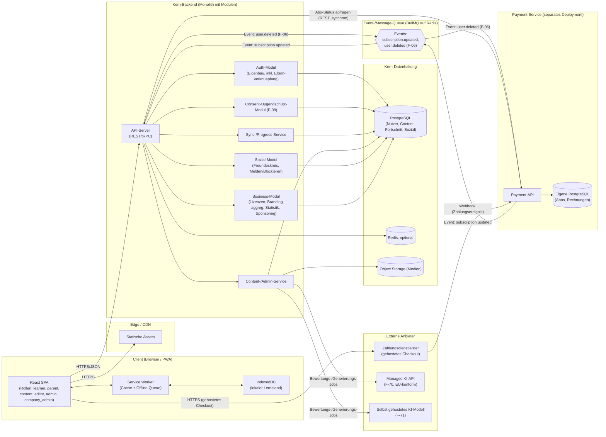
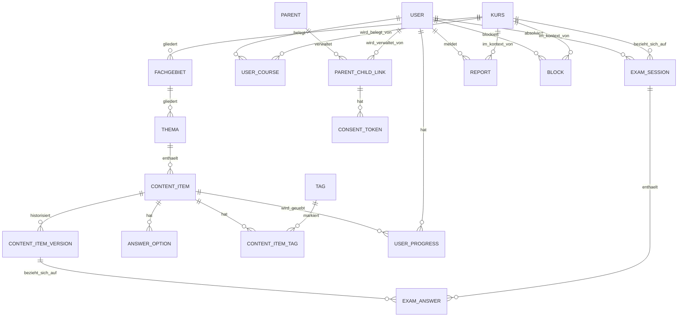

# Architekturplanung: edukedo — Lernplattform für Prüfungsvorbereitung & Wissenserwerb

Version 0.8 · Stand 14.09.2026 · Entwurf zur Abstimmung

> **Update (Version 0.8):** Architektonische Umsetzung der im Anforderungskatalog (Version 0.20, Abschnitt 5.12) neu ergänzten Business-Lizenzen & Sponsoring (F-91–F-94). Zentrale Entscheidung: Die Lizenz koppelt bewusst **nicht** an Premium-Funktionen (F-80/F-81) — ihr einziger Mehrwert ist visuelles Branding (F-92) und aggregierte Statistik (F-93), damit die Investitionshürde für Unternehmen so klein wie möglich bleibt. Dadurch bleibt das Feature **vollständig im Kern-Backend** und benötigt **keine Anbindung an den isolierten Payment-Service** (siehe Abschnitt 1, 8) — ein bewusster Unterschied zum bestehenden B2C-Premium-Modell. Die Abrechnung selbst (geringer, meist pauschaler Betrag) läuft manuell über Rechnung/Überweisung außerhalb des Systems; ein Admin schaltet das Lizenzkontingent danach frei (siehe Abschnitt 4.5, 7, 13). Neu im Datenmodell (Phase-4-Erweiterung, siehe Abschnitt 4.5): `company_account` als eigener Account-Typ analog zu `parent`, `company_invite_code` zur Lizenzvergabe, `user_company_membership` zur Branding-/Statistik-Zuordnung sowie eine vom Lizenzmodell bewusst getrennte `sponsor`-Tabelle für F-94. Entsprechend ergänzt: Abschnitt 3 (Rolle `company_admin`), Abschnitt 7 (neue `/company/*`-Endpunkte, Zugriffskontrolle für aggregierte Statistik), Abschnitt 13 (neue Entscheidungen vom 14.09.2026).
>
> **Update (Version 0.7):** Ergänzung eines Plattform-Hinweises zur Offline-/PWA-Strategie: iOS/Safari weicht in zwei Punkten von Android/Chrome ab — (1) die PWA-Installation läuft ausschließlich manuell über das Safari-Teilen-Menü, es gibt keinen automatischen Installations-Prompt; (2) Safaris Speicherbereinigung (Intelligent Tracking Prevention) kann lokal zwischengespeicherte Daten — inklusive der für den Offline-Modus (F-42) heruntergeladenen Lerninhalte — nach einer gewissen Zeit ohne Nutzung löschen. Da „auch offline zuverlässig verfügbar" ein Kernversprechen von edukedo ist, wird dies als expliziter Test- und Beobachtungspunkt in Abschnitt 5 und Abschnitt 10 aufgenommen, mit einer möglichen Re-Sync-/Warnmechanik als Mitigation; noch keine abschließende architektonische Entscheidung, siehe Abschnitt 13.
>
> **Update (Version 0.6):** Ergebnis eines Entwickler-Reviews von Architekturplanung und Entwicklungsplan. Vier konkrete Schärfungen am Datenmodell/Konzept: (1) **`exam_answer`** referenziert jetzt `content_item_version_id` statt `content_item_id` — analog zum Duell (F-61) zeigt eine Prüfungsauswertung damit immer exakt den Wortlaut, der tatsächlich gestellt wurde, auch wenn der Content-Editor die Frage später korrigiert. Voraussetzung dafür: **`content_item_version`** wird ab sofort ausdrücklich bereits bei der *Erstellung* eines `content_item` angelegt (Version 1), nicht erst bei der ersten Bearbeitung. (2) **`answer_option`** erhält ein neues `side`-Feld (nur für `zuordnung`), das explizit macht, welcher der beiden Paar-Partner die „linke" bzw. „rechte" Seite ist — vorher trug nur `group_key` die Paar-Zugehörigkeit, ohne die Seite festzulegen. (3) Klargestellt: Die Selbstlöschung des eigenen Kontos (F-06) ist unabhängig vom Payment-Service bereits ab den ersten echten Nutzerkonten nötig, nicht erst mit Phase 4 (siehe Abschnitt 8). (4) Redaktionelle Klarstellung zu `report`/`block`: Diese gehören bewusst in dieselbe erste Migrations-Charge wie das übrige Phase-1-Schema (siehe Abschnitt 4.4, „Nächste Schritte").
>
> **Update (Version 0.5):** Abschnitt 4 (Datenmodell) grundlegend vertieft — von einer knappen ERD-Skizze zu einem soliden, flexiblen Schema mit tatsächlicher SQL-Schreibweise, expliziten Constraints/Indizes und dokumentiertem Löschverhalten je Tabelle. Wichtigste neue Elemente (alle am 12.09.2026 entschieden): **`content_item_version`** führt eine echte Versionshistorie statt einer reinen Versionsnummer ein (Grundlage für exakte Duell-Snapshots in Phase 4); **`content_item.payload`** (JSONB, typspezifisch) ergänzt die bisher nur für Multiple-Choice passende `answer_option`-Tabelle um Lückentext, Kurzantwort und Fallaufgaben, ohne für jeden Fragetyp eine eigene Tabelle zu benötigen; ein neues, kursübergreifendes **`tag`/`content_item_tag`**-System ergänzt die hierarchische Einordnung um freies Verschlagworten (F-13/F-14); `kurs.locale` bereitet F-52 vor, ohne jetzt schon eine Übersetzungstabelle zu bauen; fehlende Unique-Constraints (u. a. keine doppelte Kursbelegung, genau ein Fortschritts-Datensatz je Content-Item) wurden ergänzt; das kaskadierende Löschverhalten für F-06 ist jetzt je Tabelle explizit festgelegt statt nur allgemein beschrieben.
>
> **Update (Version 0.4):** Namensübernahme: Die Plattform heißt **edukedo** (siehe Anforderungskatalog Abschnitt 1, Version 0.19); rein redaktionelle Änderung ohne architektonische Konsequenz. Referenz auf den Anforderungskatalog von Version 0.17 auf die aktuelle Version 0.19 aktualisiert.
>
> **Update (Version 0.3):** Die verbliebenen offenen Architekturentscheidungen aus Abschnitt 13 (v0.2) wurden geklärt: (1) Die Kern-API nutzt **tRPC**. (2) Die Karteikarten-Logik (F-20) implementiert **direkt FSRS** statt mit SM-2 zu starten — das Datenmodell für `USER_PROGRESS` wurde entsprechend auf FSRS-Felder umgestellt. (3) Die konkrete Infrastruktur für das selbst gehostete KI-Modell (F-71/F-72) wird bewusst zurückgestellt und erst kurz vor Phase 4 entschieden. (4) Die Kommunikation zwischen Kern-Backend und Payment-Service wird um eine **Event-/Message-Queue** ergänzt (zusätzlich zu synchronen Statusabfragen und dem Zahlungsdienstleister-Webhook), damit Statusänderungen ohne Polling ankommen. (5) Der Payment-Service bleibt **im Monorepo** als eigenes App-Paket. (6) Der Melde-Workflow (F-68, Phase 4) wird als **einfache Zusatzansicht im bestehenden Admin-/Redaktionsbereich** umgesetzt, nicht als eigene Moderationsoberfläche.
>
> **Update (Version 0.2):** Grundlegend überarbeitet, um dem inzwischen stark erweiterten Anforderungskatalog (Version 0.17) zu entsprechen — insbesondere der strategischen Neuausrichtung als generische Multi-Kurs-Plattform (statt reiner Fachwirt-App), der Mehrfach-Kursbelegung (F-09), den Alters-/Jugendschutz- und Eltern-Anforderungen (F-08, F-90, F-53), der Isolierung des Zahlungsmoduls (N-11) sowie der neuen Melde-/Blockierfunktion (F-68). Wichtigste architektonische Entscheidungen dieser Version (alle am 12.09.2026 getroffen): Payment wird als vollständig separater Service mit eigener Datenbank betrieben — stärkere Isolation als ursprünglich vorgesehen; Auth wird komplett selbst gebaut statt Managed Auth zu nutzen, um die Eltern-Kind-Verknüpfung sauber abzubilden; das Eltern-Dashboard erhält einen eigenen, vollwertigen Account-Typ; das Datenmodell für Melden/Blockieren (F-68) wird bereits in Phase 1 mitgebaut, obwohl die Funktion selbst erst in Phase 4 aktiv wird.

Basiert auf dem Anforderungskatalog Version 0.19 (siehe separates Dokument, insbesondere Abschnitt 4 für das generische Content-Modell und Abschnitt 10 für alle „für die Architekturplanung" markierten Entscheidungen). Rahmenbedingungen: Web-App mit PWA-Fähigkeit, Backend mit Nutzerkonten und geräteübergreifender Synchronisierung, generisches Multi-Kurs-Modell von Anfang an, gestaffelter statt vollständiger Content-Umfang zum Start, zwei parallel startende Kurse (Fachwirt-Pilot + Schulfach-Kurs), Solo-/Kleinprojekt mit Wunsch nach niedrigen Betriebskosten und späterer Skalierbarkeit.

## 1. Leitprinzipien für die Architektur

- **Einfachheit vor Vollständigkeit, mit einer bewussten Ausnahme:** Der Kernbereich (Auth, Content, Sync/Progress, Sozial-/Gamification-Funktionen) bleibt ein Monolith mit klarer innerer Modulstruktur — weniger Betriebsaufwand, schnellere Entwicklung für eine Einzelperson. **Payment weicht davon ab und wird von Anfang an als eigener, vollständig getrennter Service mit eigener Datenbank betrieben** (siehe Abschnitt 8): Die stärkere Isolation wiegt hier den zusätzlichen Betriebsaufwand auf, weil ein Sicherheitsvorfall im Kernsystem so nicht automatisch auch Zahlungsdaten betrifft.
- **Content ist Daten, nicht Code — jetzt für beliebige Kurse:** Das generische Content-Modell (Kurs → Fachgebiet → Thema → Lerneinheit, siehe Anforderungskatalog Abschnitt 4) bedeutet, dass sowohl der Fachwirt-Pilot als auch der neue Schulfach-Kurs über dieselben Tabellen abgebildet werden, ohne Schemaänderung (siehe Abschnitt 4 dieses Dokuments).
- **Offline-first, wo es zählt:** Die individuellen Lernmodi (Karteikarten, Quiz, Übungssets) müssen auch mit wackliger Verbindung funktionieren; die sozialen Features (Duelle, Highscore, Lernpartner-Vermittlung) setzen ausdrücklich eine Online-Verbindung voraus (siehe F-42).
- **Datenmodell für Vertrauen/Jugendschutz früh anlegen, Funktion später aktivieren:** Analog zum bereits im Anforderungskatalog verankerten Vorgehen bei F-08 wird auch das Datenmodell für die Melde-/Blockierfunktion (F-68) schon in Phase 1 mitgebaut, obwohl die Funktion selbst erst mit den sozialen Features in Phase 4 live geht — vermeidet eine Schema-Änderung an einer dann bereits produktiven Datenbank mit echten Nutzerdaten.
- **Niedrige Einstiegskosten, klarer Wachstumspfad:** Start auf Hobby-/Free-Tiers, aber ohne Architekturentscheidungen, die einen späteren Umzug erzwingen.

## 2. Technologie-Empfehlung im Überblick

| Bereich | Empfehlung | Begründung |
|---|---|---|
| Frontend | React + TypeScript, Vite als Build-Tool | Größtes Ökosystem, gute PWA-Unterstützung, gut geeignet für interaktive Quiz-/Karteikarten-UI sowie für die rollenbasierten Ansichten (learner, parent, content_editor, admin, **company_admin**, ergänzt 14.09.2026) |
| Styling/UI | Tailwind CSS + shadcn/ui-Komponenten | Schnelles, konsistentes UI ohne viel Custom-CSS |
| State/Data-Fetching | TanStack Query | Sauberes Caching und Sync von Server-Daten, wichtig für Offline/Sync-Logik |
| PWA/Offline | Vite PWA Plugin (Workbox) + IndexedDB (über Dexie.js) | Service-Worker-Caching für Assets, IndexedDB für Offline-Lernstand-Queue |
| Kern-Backend | **Node.js + TypeScript, Fastify** (entschieden am 12.09.2026, siehe Abschnitt 13) | Eine Sprache im gesamten Stack senkt Kontextwechsel-Kosten für eine Einzelperson; Fastify hat einen offiziellen tRPC-Adapter und weniger Boilerplate als NestJS für eine Einzelperson |
| Auth | **Eigenbau, im Kern-Backend, nach dem Lucia-Pattern** (entschieden am 12.09.2026, siehe Abschnitt 13) | Volle Kontrolle über Altersabfrage, Eltern-Verknüpfung (F-08) und einen eigenen Eltern-Account-Typ (F-90) — Managed-Auth-Anbieter (Supabase Auth/Clerk) unterstützen diese Eltern-Kind-Beziehung nicht nativ. Argon2id-Hashing plus signierte, httpOnly-Session-Cookies nach dem Lucia-Pattern (Sessions-Tabelle mit gehashtem Token, siehe Abschnitt 13) — Lucia selbst ist als Bibliothek inzwischen archiviert/deprecated, daher wird nur das Pattern übernommen, nicht die Bibliothek als Dependency eingebunden |
| Payment-Service | **Eigener Service, eigene Datenbank, eigenes Deployment** (entschieden am 12.09.2026) | Vollständige Isolation von Zahlungsdaten gegenüber dem Kernsystem (siehe Abschnitt 8); kommuniziert mit dem Kern-Backend nur über eine schmale, versionierte REST-API |
| API-Stil (Kern) | **tRPC** (entschieden am 12.09.2026) | Spart Boilerplate bei TS-Frontend+Backend im selben Monorepo; native Apps/Drittanbieter-Clients sind laut Anforderungskatalog ohnehin out of scope (Abschnitt 8) |
| API-Stil (Kern ↔ Payment) | REST/HTTPS für synchrone Statusabfragen, **plus Event-/Message-Queue** für asynchrone Statusänderungen (entschieden am 12.09.2026); Zahlungsdienstleister → Payment-Service weiterhin per Webhook | Zwei getrennte Services kommunizieren über einen stabilen, sprachunabhängigen Vertrag statt über TS-spezifische RPC-Mechanismen; die Queue liefert Statusänderungen (z. B. Premium-Freischaltung) ohne Polling an den Kern |
| Datenbank (Kern) | PostgreSQL (verwaltet, z. B. Neon oder Supabase) | Relational passt gut zu den strukturierten Beziehungen des generischen Content-Modells (Kurs → Fachgebiet → Thema → Content-Item → Fortschritt) |
| Datenbank (Payment) | Eigene PostgreSQL-Instanz (separates Neon-/Supabase-Projekt oder eigener Anbieter) | Physische statt nur logischer Trennung — konsistent mit der Entscheidung für einen vollständig separaten Service |
| ORM | **Drizzle ORM** (für den Kern entschieden am 12.09.2026, siehe Abschnitt 13; für Payment weiterhin unabhängig wählbar) | Typsichere Queries, SQL-nahe Migrationsverwaltung, die sich direkt am bereits als reinem SQL-DDL dokumentierten Schema (Abschnitt 4.3) orientiert; Kern und Payment teilen sich bewusst keine ORM-Modelle |
| Caching/Sessions | Redis (optional, erst bei Bedarf) | Session-Storage, Rate-Limiting (u. a. für Login und Einladungscodes, F-63); für MVP ggf. verzichtbar |
| Message-Queue (Kern ↔ Payment) | **BullMQ auf Redis** (empfohlen, konsistent mit dem ohnehin vorgesehenen Redis) | Kein zusätzlicher Infrastruktur-Anbieter nötig; deckt den entschiedenen Bedarf an asynchronen Statusänderungen ab. Alternative (z. B. ein Cloud-Messaging-Dienst wie SNS/SQS) bleibt möglich, falls Redis aus anderen Gründen entfällt |
| Objekt-/Medienspeicher | S3-kompatibel (z. B. Cloudflare R2) | Für Bilder/Diagramme in Lerninhalten |
| Hosting Frontend | Vercel oder Cloudflare Pages | Kostengünstiger Einstieg, automatisches Deployment aus Git, CDN inklusive |
| Hosting Kern-Backend + DB | Railway, Render oder Fly.io (+ Neon/Supabase für DB) | Einfaches Deployment, günstige Einstiegstarife |
| Hosting Payment-Service + DB | Eigenes, vom Kernsystem getrenntes Projekt/Environment beim selben oder einem anderen Anbieter | Eigene Zugriffskontrolle, eigene Umgebungsvariablen/Secrets — organisatorisch und physisch getrennt vom Kernsystem |
| Monorepo-Tooling | pnpm Workspaces + Turborepo, Payment-Service als eigenes App-Paket | Weiterhin ein Repository für einfachere Entwicklung als Solo-Person, aber unabhängig deploybar und ohne gemeinsamen DB-Zugriff |
| CI/CD | GitHub Actions, getrennte Deploy-Pipelines für Kern und Payment | Kostenlos für kleine Projekte; getrennte Pipelines verhindern, dass ein Fehler im einen Bereich versehentlich den anderen mit deployt |

**Alternative, falls du lieber mit Python arbeitest:** Backend mit FastAPI + SQLAlchemy statt Node/TypeScript; das restliche Konzept (PostgreSQL, REST/OpenAPI, Hosting, getrennter Payment-Service) bleibt gültig.

## 3. Systemarchitektur (Überblick)



Der Kern-Backend-„Monolith" bleibt intern modular (Auth, Consent, Content, Sync/Progress, Sozial, **Business (Lizenzen/Branding/Sponsoring, ergänzt 14.09.2026)** als getrennte Module/Ordner), damit einzelne Teile bei Bedarf später als eigene Services herausgelöst werden können. Das neue Business-Modul (F-91–F-94) ist bewusst ein gewöhnliches Kern-Modul wie die übrigen — **kein** Anschluss an den separaten Payment-Service, weil die Lizenz keine Premium-Freischaltung auslöst (siehe Update Version 0.8, Abschnitt 13). Payment ist die eine bewusste Ausnahme von diesem Monolith-Prinzip (siehe Abschnitt 1, 8): Frontend und Nutzer:innen interagieren dort, wo möglich, direkt mit dem gehosteten Checkout des Zahlungsdienstleisters, damit möglichst wenig Zahlungsdaten überhaupt die eigene Infrastruktur berühren (siehe F-81). **Kern und Payment-Service kommunizieren über zwei Kanäle (entschieden am 12.09.2026):** synchrone REST-Statusabfragen für den unmittelbaren Bedarf (z. B. beim Login prüfen, ob Premium aktiv ist) und eine Event-/Message-Queue für asynchrone Statusänderungen (z. B. eine neue Zahlung schaltet Premium frei, ohne dass der Kern dafür pollen müsste) sowie für die umgekehrte Richtung (der Kern meldet eine Konto-Löschung nach F-06 an den Payment-Service, damit dieser seine eigenen Daten ebenfalls bereinigt).

## 4. Datenmodell (Kernentitäten, Stand Phase 1)

**Überarbeitet und deutlich vertieft am 12.09.2026** (vorherige Fassung: knappe ERD-Skizze; siehe Abschnitt 13 für die dabei getroffenen Entscheidungen). Ziel dieser Überarbeitung: ein Schema, das sowohl **solide** ist (referenzielle Integrität, sinnvolle Constraints/Indizes, sauberer Umgang mit Löschungen und Versionierung) als auch **flexibel** bleibt (neue Kurstypen, Content-Formate und Sprachen ohne Breaking-Change am Schema).

### 4.1 Designprinzipien

- **Hybrid relational/JSONB, je nach Vorhersagbarkeit der Struktur:** Wo die Struktur stabil und häufig strukturiert abgefragt wird (Kurs-Hierarchie, Multiple-Choice-Optionen, Fortschritt), bleibt das Modell relational mit echten Spalten/Fremdschlüsseln. Wo die Struktur je nach Content-Typ oder Kurstyp variiert (Lückentext-Lücken, Fallaufgaben-Teilschritte, kurstypspezifische Zusatzattribute), übernimmt ein `payload`/`metadata`-JSONB-Feld die Flexibilität — validiert nicht durch die Datenbank, sondern per Zod-Schema auf Anwendungsebene (siehe Abschnitt 7), pro `type`-Wert unterschiedlich. Das vermeidet sowohl ein „JSONB für alles" (nichts mehr abfragbar/indexierbar) als auch ein „eigene Tabelle pro Content-Typ" (Schema-Änderung bei jedem neuen Fragetyp, widerspricht N-05).
- **Versionierung statt Hard-Delete bei Content:** `CONTENT_ITEM` wird bei Bearbeitung nicht überschrieben, sondern über `CONTENT_ITEM_VERSION` historisiert (setzt F-12 konkret um). Das ist zugleich die solide Grundlage für den beim Duell (F-61, Phase 4) geforderten Content-Snapshot sowie — seit Version 0.6 — für Prüfungsantworten (`EXAM_ANSWER`, siehe unten): Beide referenzieren eine konkrete `content_item_version_id`, nicht nur eine veränderliche Versionsnummer. **Wichtig:** `CONTENT_ITEM_VERSION` wird deshalb nicht erst bei der ersten Bearbeitung angelegt, sondern bereits beim Erstellen eines `CONTENT_ITEM` (Version 1) — sonst gäbe es für ein brandneues Content-Item keine Version, auf die eine frühe Prüfungsantwort oder ein frühes Duell verweisen könnte.
- **Explizite Unique-Constraints gegen unmögliche Zustände:** z. B. genau ein `USER_PROGRESS`-Datensatz je (`user_id`, `content_item_id`), keine doppelte Kursbelegung in `USER_COURSE` — im Vorgängerentwurf nicht explizit, hier nachgezogen.
- **Löschverhalten pro Tabelle bewusst festgelegt statt nur in Prosa beschrieben:** F-06 (Konto-/Datenlöschung) verlangt kaskadierendes Löschen; welche Fremdschlüssel `CASCADE`, `SET NULL` oder `RESTRICT` auslösen, ist unten je Tabelle vermerkt statt nur allgemein postuliert. Die **Selbstlöschung des eigenen Kontos ist dabei unabhängig vom Payment-Service** bereits ab den allerersten echten Nutzerkonten nötig (nicht erst mit Phase 4/Payment) — siehe Abschnitt 8.
- **Freies Verschlagworten quer zur Kurs-Hierarchie:** Eine neue `TAG`/`CONTENT_ITEM_TAG`-Verknüpfung ergänzt F-13/F-14 um kursübergreifende, frei vergebbare Schlagworte (z. B. „Prüfungsrelevant", „Wiederholung empfohlen") — unabhängig von Kurs/Fachgebiet/Thema und damit flexibler als eine rein hierarchische Einordnung.
- **Eindeutige Seitenzuordnung bei Zuordnungs-Paaren:** `ANSWER_OPTION` erhält (seit Version 0.6) neben `group_key` ein `side`-Feld, das bei `type = 'zuordnung'` explizit festlegt, ob eine Option die linke oder rechte Seite eines Paares ist — vorher war das nur implizit über Anwendungskonvention lösbar.
- **Mehrsprachigkeit vorbereitet, ohne sie jetzt zu bauen (F-52):** `KURS.locale` (Default `de`) hält fest, in welcher Sprache ein Kurs geführt wird. Weitere Sprachen kämen additiv über eine spätere `CONTENT_ITEM_TRANSLATION`-Tabelle hinzu, ohne bestehende Spalten zu verändern — im Phase-1-Schema bewusst noch nicht angelegt (kein aktueller Bedarf, siehe F-52 Priorität „Kann").

### 4.2 ER-Diagramm (Überblick, Phase 1)



### 4.3 Tabellenschema (Phase 1)

Tabellen-/Spaltennamen hier bereits in der tatsächlichen SQL-Schreibweise (`snake_case`), passend zu Drizzle/Prisma. `references(...)` zeigt jeweils den Fremdschlüssel samt Lösch-/Änderungsverhalten.

**Content-Hierarchie**

```sql
kurs (
  id            uuid primary key default gen_random_uuid(),
  slug          text not null unique,                 -- z.B. "fachwirt-buero-projektorganisation", "mathematik-9-bundeslandneutral"
  type          text not null,                          -- "fachwirt" | "schulfach" | ... (offen für weitere Typen, F-13/N-05)
  title         text not null,
  locale        char(5) not null default 'de',          -- Vorbereitung F-52, siehe 4.1
  metadata      jsonb not null default '{}',             -- z.B. Klassenstufe, Bundesland-Ansatz (F-13)
  target_mode   text not null default 'einzeltermin',   -- "einzeltermin" | "wochenziel" (F-35)
  is_published  boolean not null default false,
  created_at    timestamptz not null default now(),
  updated_at    timestamptz not null default now()
);

fachgebiet (
  id          uuid primary key default gen_random_uuid(),
  kurs_id     uuid not null references kurs(id) on delete cascade,
  code        text not null,                            -- z.B. "HB1", "algebra"
  title       text not null,
  sort_order  int not null default 0,
  metadata    jsonb not null default '{}',
  unique (kurs_id, code)
);
create index on fachgebiet (kurs_id, sort_order);

thema (
  id             uuid primary key default gen_random_uuid(),
  fachgebiet_id  uuid not null references fachgebiet(id) on delete cascade,
  title          text not null,
  sort_order     int not null default 0
);
create index on thema (fachgebiet_id, sort_order);
```

**Content-Items — relational, wo stabil, JSONB, wo variabel**

```sql
content_item (
  id               uuid primary key default gen_random_uuid(),
  thema_id         uuid not null references thema(id) on delete cascade,
  type             text not null,          -- "theorie" | "karteikarte" | "quiz_mc" | "zuordnung" | "luecken" | "kurzantwort" | "fallaufgabe"
  prompt           text not null,           -- Frage/Vorderseite/Aufgabentext, je nach type
  explanation      text,                    -- Erklärung/Rückseite/Musterlösung, je nach type
  payload          jsonb not null default '{}', -- typspezifische Struktur, siehe unten
  difficulty       text not null default 'mittel', -- "leicht" | "mittel" | "schwer"
  is_premium       boolean not null default false,   -- F-80
  is_active        boolean not null default true,    -- Soft-Delete statt Hard-Delete: alte Fortschritts-/Prüfungsdaten bleiben referenzierbar
  current_version  int not null default 1,
  created_by       uuid references "user"(id) on delete set null,
  created_at       timestamptz not null default now(),
  updated_at       timestamptz not null default now()
);
create index on content_item (thema_id) where is_active;

-- Historie zu jeder inhaltlichen Änderung (F-12), Grundlage für Duell- (F-61) und Pruefungs-Snapshots (EXAM_ANSWER).
-- Wird bereits beim Erstellen eines content_item als Version 1 angelegt, nicht erst bei der ersten Bearbeitung (siehe 4.1).
content_item_version (
  id               uuid primary key default gen_random_uuid(),
  content_item_id  uuid not null references content_item(id) on delete cascade,
  version_number   int not null,
  prompt           text not null,
  explanation      text,
  payload          jsonb not null,
  changed_by       uuid references "user"(id) on delete set null,
  change_note      text,
  created_at       timestamptz not null default now(),
  unique (content_item_id, version_number)
);

-- Nur für type IN ('quiz_mc', 'zuordnung'). Bei quiz_mc bleiben group_key/side leer, is_correct traegt die Bewertung.
-- Bei zuordnung tragen genau zwei Zeilen denselben group_key mit unterschiedlichem side-Wert ("links"/"rechts") -
-- side macht explizit, welcher Paar-Partner auf welcher Seite der Zuordnungs-UI erscheint (seit Version 0.6).
answer_option (
  id                uuid primary key default gen_random_uuid(),
  content_item_id   uuid not null references content_item(id) on delete cascade,
  group_key         text,               -- nur Zuordnung: verknüpft zusammengehörige Paare
  side              text,               -- nur Zuordnung: "links" | "rechts"
  text              text not null,
  is_correct        boolean not null default false,
  sort_order        int not null default 0
);
create index on answer_option (content_item_id);

-- Freies, kursübergreifendes Verschlagworten (F-13/F-14), unabhängig von der Kurs-Hierarchie
tag (
  id    uuid primary key default gen_random_uuid(),
  name  text not null unique
);

content_item_tag (
  content_item_id  uuid not null references content_item(id) on delete cascade,
  tag_id           uuid not null references tag(id) on delete cascade,
  primary key (content_item_id, tag_id)
);
```

**Payload-Struktur je `content_item.type` (auf Anwendungsebene per Zod validiert, nicht in der DB erzwungen):**

| `type` | `payload`-Inhalt (Beispiel) |
|---|---|
| `theorie` | `{ "body_markdown": "...", "images": ["..."] }` |
| `karteikarte` | `{}` (Vorder-/Rückseite genügen `prompt`/`explanation`) |
| `quiz_mc` | `{}` (Optionen liegen in `answer_option`) |
| `zuordnung` | `{}` (Paare liegen in `answer_option` über `group_key`/`side`) |
| `luecken` | `{ "text_with_blanks": "...", "blanks": [{"id": "1", "accepted": ["..."]}] }` |
| `kurzantwort` | `{ "accepted_answers": ["..."], "match_mode": "exact\|contains" }` |
| `fallaufgabe` | `{ "parts": [{"prompt": "...", "points": 5}] }` |

**Nutzerkonten & Kursbelegung**

```sql
"user" (
  id                 uuid primary key default gen_random_uuid(),
  email              citext not null unique,           -- benoetigt Postgres-Extension "citext", siehe Abschnitt 9
  password_hash      text not null,
  birth_date         date,
  is_minor           boolean not null,   -- bei Registrierung aus birth_date abgeleitet und persistiert (F-08, N-13)
  email_verified_at  timestamptz,
  created_at         timestamptz not null default now(),
  updated_at         timestamptz not null default now()
);

-- n:m Nutzerkonto <-> Kurs (F-09), von Anfang an eigene Verknüpfungstabelle
user_course (
  id               uuid primary key default gen_random_uuid(),
  user_id          uuid not null references "user"(id) on delete cascade,
  kurs_id          uuid not null references kurs(id) on delete cascade,
  target_date      date,
  plan_start_date  date,
  joined_at        timestamptz not null default now(),
  unique (user_id, kurs_id)   -- verhindert Doppel-Belegung desselben Kurses
);
```

**Fortschritt & Prüfungssimulation**

```sql
user_progress (
  id               uuid primary key default gen_random_uuid(),
  user_id          uuid not null references "user"(id) on delete cascade,
  content_item_id  uuid not null references content_item(id) on delete cascade,
  difficulty       real not null,        -- FSRS-Parameter
  stability        real not null,        -- FSRS-Parameter
  state            text not null,        -- "new" | "learning" | "review" | "relearning"
  due_at           timestamptz not null,
  last_reviewed_at timestamptz,
  last_result      text,                 -- "gewusst" | "unsicher" | "nicht_gewusst"
  reps             int not null default 0,
  lapses           int not null default 0,
  unique (user_id, content_item_id)      -- genau ein Fortschritts-Datensatz je Nutzer:in und Content-Item
);
create index on user_progress (user_id, due_at);   -- zentrale Abfrage für F-20/F-27: "welche Karten sind fällig"

exam_session (
  id           uuid primary key default gen_random_uuid(),
  user_id      uuid not null references "user"(id) on delete cascade,
  kurs_id      uuid not null references kurs(id) on delete cascade,
  mode         text not null,     -- "quiz" | "schriftliche_simulation" | "praesentation" | "fachgespraech"
  started_at   timestamptz not null default now(),
  finished_at  timestamptz,
  score        real
);
create index on exam_session (user_id, kurs_id);

-- Seit Version 0.6: referenziert content_item_version_id statt content_item_id, analog zum Duell (F-61) -
-- eine Pruefungsauswertung zeigt damit immer den Wortlaut, der zum Pruefungszeitpunkt tatsaechlich galt,
-- auch wenn die Frage danach redaktionell korrigiert wurde.
exam_answer (
  id                       uuid primary key default gen_random_uuid(),
  exam_session_id          uuid not null references exam_session(id) on delete cascade,
  content_item_version_id  uuid not null references content_item_version(id) on delete restrict, -- Pruefungsantworten bleiben auch bei (seltenem) Content-Hard-Delete auswertbar
  given_answer             jsonb not null,   -- Struktur variiert wie beim payload je nach content_item.type
  is_correct               boolean,
  points                   real
);
create index on exam_answer (exam_session_id);
```

**Eltern-/Jugendschutz (F-08, F-90)**

```sql
parent (
  id             uuid primary key default gen_random_uuid(),
  email          citext not null unique,
  password_hash  text not null,
  created_at     timestamptz not null default now()
);

parent_child_link (
  id              uuid primary key default gen_random_uuid(),
  parent_id       uuid not null references parent(id) on delete cascade,
  user_id         uuid not null references "user"(id) on delete cascade,
  consent_status  text not null default 'pending',  -- "pending" | "confirmed" | "revoked"
  consented_at    timestamptz,
  revoked_at      timestamptz,
  unique (parent_id, user_id)
);

consent_token (
  id                     uuid primary key default gen_random_uuid(),
  parent_child_link_id   uuid not null references parent_child_link(id) on delete cascade,
  token_hash             text not null unique,
  expires_at             timestamptz not null,
  used_at                timestamptz,
  reminder_sent_count    int not null default 0
);
create index on consent_token (expires_at);  -- für Erinnerungs-/Aufräum-Jobs
```

**Melden/Blockieren (F-68, Datenmodell bereits in der ersten Migrations-Charge von Phase 1, UI erst Phase 4)**

```sql
report (
  id                 uuid primary key default gen_random_uuid(),
  reporter_user_id   uuid references "user"(id) on delete set null,  -- Meldung bleibt für Moderation bestehen, auch wenn meldende Person das Konto löscht
  reported_user_id   uuid references "user"(id) on delete cascade,   -- betrifft die gemeldete Person direkt -> mit ihr löschen
  kurs_id            uuid not null references kurs(id) on delete cascade,
  reason             text not null,
  status             text not null default 'offen',  -- "offen" | "geprueft" | "abgelehnt"
  created_at         timestamptz not null default now()
);

block (
  id                uuid primary key default gen_random_uuid(),
  user_id           uuid not null references "user"(id) on delete cascade,
  blocked_user_id   uuid not null references "user"(id) on delete cascade,
  kurs_id           uuid not null references kurs(id) on delete cascade,
  created_at        timestamptz not null default now(),
  unique (user_id, blocked_user_id, kurs_id)
);
```

### 4.4 Hinweise

- **KURS/FACHGEBIET/THEMA/CONTENT_ITEM** ersetzen die frühere, fachwirt-spezifische `HANDLUNGSBEREICH`-Tabelle durch das generische Content-Modell aus Anforderungskatalog Abschnitt 4. Der Fachwirt-Pilot und der Schulfach-Kurs sind beides einfach Zeilen in `kurs`, ohne Schemaunterschied — konsistent mit dem dortigen Architektur-Check.
- **`kurs.metadata` (JSONB)** setzt die Entscheidung zu kursspezifischen Zusatzattributen (F-13) um — z. B. Klassenstufe/Bundesland beim Schulfach-Kurs — ohne kurstypspezifische Spalten/Tabellen. `kurs.locale` bereitet F-52 vor, ohne jetzt schon eine Übersetzungstabelle anzulegen. `kurs.is_published` ist zugleich der Schalter, mit dem ein Kurs (z. B. der Mathe-Kurs, siehe Abschnitt 8) erst dann für echte Nutzer:innen sichtbar wird, wenn die dafür nötige Schutzinfrastruktur steht.
- **`user_course`** realisiert die n:m-Beziehung Nutzerkonto↔Kurs (F-09) als eigene Verknüpfungstabelle von Anfang an; der `unique`-Constraint auf (`user_id`, `kurs_id`) verhindert eine versehentliche Doppel-Belegung, die im Vorgängerentwurf nicht ausgeschlossen war.
- **`user.is_minor`** wird bei Registrierung aus `birth_date` abgeleitet und persistiert (statt bei jeder Anfrage neu berechnet), damit Berechtigungsprüfungen (F-66, N-13) und der Ausschluss von Profiling/personalisierter Werbung für Minderjährige (N-01) einfach und konsistent auf dieses eine Feld referenzieren können.
- **`content_item.payload` (JSONB) + `answer_option` (relational)** lösen gemeinsam ab, was im Vorgängerentwurf nur für Multiple-Choice sauber passte: Multiple-Choice und Zuordnung bleiben relational und damit abfragbar/auswertbar (z. B. „welche falsche Antwortoption wird am häufigsten gewählt", relevant für F-16); Lückentext, Kurzantwort und Fallaufgaben nutzen `payload`, weil ihre Struktur zu unterschiedlich ist, um sinnvoll in eigene Spalten/Tabellen zu pressen. Bei Zuordnung macht das neue `side`-Feld (seit Version 0.6) explizit, welche zwei Zeilen mit gleichem `group_key` jeweils die linke bzw. rechte Seite eines Paares sind.
- **`content_item_version`** ist neu (entschieden am 12.09.2026) und macht aus der bisher nur als Zahl geführten Versionierung (F-12) eine echte Historie: Jede inhaltliche Änderung erzeugt einen neuen Versionsdatensatz, statt die alte Fassung zu überschreiben — inklusive Version 1 bereits beim Erstellen des Content-Items (siehe 4.1). Das ist die Voraussetzung dafür, dass sowohl ein Duell (F-61, Phase 4) als auch — seit Version 0.6 — eine abgelegte Prüfungsantwort (`exam_answer`) exakt auf eine bestimmte Content-Fassung verweisen können (`content_item_version_id`) statt nur auf eine veränderliche Versionsnummer.
- **`content_item.is_active`** ersetzt einen harten Löschvorgang für Content: Damit bleiben referenzierte `user_progress`- und `exam_answer`-Datensätze auch dann noch sinnvoll auswertbar, wenn ein Content-Item redaktionell zurückgezogen wird.
- **`tag`/`content_item_tag`** sind neu (entschieden am 12.09.2026) und ergänzen F-13/F-14 um freies, kursübergreifendes Verschlagworten, das nicht an die Kurs-Hierarchie gebunden ist — z. B. ein Tag „Prüfungsrelevant", das sowohl im Fachwirt- als auch im Mathematik-Kurs verwendet werden kann.
- **`parent`, `parent_child_link`, `consent_token`** setzen F-08 und F-90 um: `parent` ist ein eigener, vollwertiger Account-Typ (wie entschieden); `parent_child_link.consent_status` trägt den Einwilligungsstatus inkl. Widerruf (F-90); `consent_token` speichert nur den Hash des Bestätigungslinks (nicht im Klartext) mit Ablaufdatum und einem Zähler für die automatischen Erinnerungsmails.
- **Der Vorschau-Modus (F-08)** ist bewusst nicht Teil dieses Datenmodells: Er wird zustandslos aus dem öffentlichen Content-Bestand bedient, ohne einen `user`-Datensatz oder `user_progress`-Einträge anzulegen — konsistent mit der Vorgabe „keine Speicherung von Fortschritt oder personenbezogenen Daten".
- **`report`/`block`** gehören von Anfang an in dieselbe erste Migrations-Charge wie das übrige Phase-1-Schema (klargestellt in Version 0.6 — vorher stand nur „bereits in Phase 1", ohne den Zeitpunkt innerhalb von Phase 1 eindeutig festzulegen), obwohl die zugehörige Funktion (F-68) erst in Phase 4 zusammen mit den sozialen Features aktiv genutzt wird. Bewusst asymmetrisches Löschverhalten: Löscht die meldende Person ihr Konto, bleibt die Meldung selbst (mit `reporter_user_id = null`) für die Moderationshistorie erhalten; löscht dagegen die gemeldete Person ihr Konto, verliert die Meldung mit ihr ihren Gegenstand und wird mitgelöscht.
- **Löschverhalten (F-06) im Überblick:** Löscht sich ein `user`, kaskadiert das automatisch über `user_course`, `user_progress`, `exam_session` (und darüber `exam_answer`), `parent_child_link` (als Kind) sowie `block`/`report.reported_user_id`; `report.reporter_user_id` wird stattdessen auf `null` gesetzt (siehe oben). `content_item`-Löschungen sind durch `is_active` ohnehin die Ausnahme; falls doch einmal ein Content-Item hart gelöscht wird (was über `content_item_version` kaskadiert), bleiben Prüfungsantworten (`exam_answer`) dank `on delete restrict` auf `content_item_version` geschützt — ein Hard-Delete einer Content-Version mit vorhandenen Prüfungsantworten wird von der Datenbank verweigert, statt still Daten zu verlieren.
- Zahlungsdaten (Abos, Rechnungen) liegen bewusst **nicht** in diesem Datenmodell, sondern in der eigenen Datenbank des Payment-Service (siehe Abschnitt 3, 8) und werden hier nur als Referenz (`user_id`) von außen adressiert.

### 4.5 Phase-4-Erweiterung (Skizze, noch nicht Teil der Phase-1-Migrationen)

Sobald die sozialen Features (F-60–F-65) sowie die Kohorten-/Dozenten-Funktion (F-07, F-64, F-65) gebaut werden, kommen u. a. folgende Tabellen hinzu: `friend_circle_link` (kursbezogen, F-63), `invite_code` (F-63, mit Ablaufdatum/Rate-Limiting), `duel`/`duel_answer` (F-61 — referenziert dank `content_item_version` jetzt sauber eine konkrete Content-Fassung statt nur einer Versionsnummer, analog zu `exam_answer`), `highscore_entry` (F-60), `achievement` (F-67) sowie `cohort`/`cohort_member` (F-64/F-65). `report` und `block` existieren dann bereits und müssen nur noch mit der neuen UI verdrahtet werden.

**Business-Lizenzen & Sponsoring (F-91–F-94, ergänzt 14.09.2026)** — ebenfalls Phase 4 (siehe Anforderungskatalog Abschnitt 9), architektonisch aber bewusst unabhängig vom Payment-Service (siehe Update Version 0.8):

```sql
-- Eigener Account-Typ analog zu "parent" (F-91) — eigenes Login, nicht Teil des "user"-Rollenmodells.
company_account (
  id                 uuid primary key default gen_random_uuid(),
  name               text not null,
  contact_email      citext not null unique,
  password_hash      text not null,
  seat_limit         int not null default 0,        -- Größe des erworbenen Lizenzkontingents
  billing_status     text not null default 'pending', -- "pending" | "active" | "expired" -- manuell durch Admin gepflegt, siehe 4.1-Hinweis unten
  branding_logo_url  text,                            -- F-92: rein visuelles Branding
  branding_color     text,
  branding_headline  text,                            -- z.B. "Ermöglicht durch <Unternehmen>"
  created_at         timestamptz not null default now()
);

-- Lizenzvergabe per Einladungscode (F-91), analog zum invite_code-Konzept für Freundeskreise (F-63).
company_invite_code (
  id                 uuid primary key default gen_random_uuid(),
  company_account_id uuid not null references company_account(id) on delete cascade,
  code               text not null unique,
  expires_at         timestamptz,
  created_at         timestamptz not null default now()
);

-- Verknüpft eine Nutzerin/einen Nutzer mit genau einem Unternehmen (Branding-/Statistik-Zugehörigkeit).
-- Bewusst 1:1 (unique auf user_id) statt n:m, um Branding-Anzeige eindeutig zu halten.
user_company_membership (
  id                 uuid primary key default gen_random_uuid(),
  user_id            uuid not null references "user"(id) on delete cascade,
  company_account_id uuid not null references company_account(id) on delete cascade,
  joined_at          timestamptz not null default now(),
  unique (user_id)
);
create index on user_company_membership (company_account_id);  -- für Sitzplatz-Auslastung (belegt/frei, F-91) und aggregierte Statistik (F-93)

-- Sponsoring (F-94) ist bewusst vom Lizenzmodell getrennt: reine, statische Markenplatzierung ohne
-- Nutzer-Verknüpfung/Tracking (kompatibel mit N-01/N-13 auch im Schulfach-Kurs, siehe Anforderungskatalog 5.12).
sponsor (
  id               uuid primary key default gen_random_uuid(),
  name             text not null,
  logo_url         text,
  attribution_text text not null,          -- z.B. "Ermöglicht durch Unterstützung von XY"
  kurs_id          uuid references kurs(id) on delete cascade,  -- null = plattformweite Platzierung
  is_active        boolean not null default true,
  starts_at        timestamptz,
  ends_at          timestamptz,
  created_at       timestamptz not null default now()
);
```

Hinweise dazu: **Aggregierte Statistik (F-93)** wird bewusst **nicht** als eigene persistente Tabelle geführt, sondern als Query-Ebene über `user_company_membership` (join auf `user_progress`/`exam_session`, gefiltert auf `company_account_id`, ausschließlich aggregiert zurückgegeben — Durchschnittswerte, Prozentanteile). Die entscheidende Absicherung liegt auf API-Ebene (siehe Abschnitt 7): Der `/company/*`-Endpunkt für Statistik darf technisch keine Einzel-Datensätze je Nutzer:in zurückgeben können, aus Beschäftigtendatenschutz-Gründen (§ 26 BDSG, siehe Anforderungskatalog Abschnitt 7). **Löschverhalten:** Löscht sich ein `user`, kaskadiert `user_company_membership` automatisch mit (F-06 bleibt uneingeschränkt gültig, unabhängig vom Unternehmens-Status); löscht sich ein `company_account`, verlieren betroffene Nutzer:innen nur ihre Branding-/Statistik-Zuordnung, nicht ihr eigenes Konto oder ihren Lernfortschritt. **Abrechnung:** `company_account.billing_status` wird manuell von einem Admin gepflegt (Rechnung/Überweisung außerhalb des Systems, siehe Update Version 0.8) — bewusst kein eigenes Rechnungs-/Buchungsmodell, da das Volumen zu Beginn gering und die Abwicklung nicht automatisiert vorgesehen ist.

## 5. Offline-/PWA-Strategie

1. **App-Shell & Assets:** Service Worker cached das UI-Bundle beim ersten Besuch (Workbox „precache").
2. **Content-Vorabladung:** Beim Login bzw. auf Wunsch werden die Lerninhalte des gewählten Kurses/Fachgebiets (statt wie zuvor nur eines Handlungsbereichs) in IndexedDB gespiegelt, sodass Karteikarten/Quiz auch offline funktionieren — unabhängig davon, ob es sich um den Fachwirt-Piloten oder den Schulfach-Kurs handelt.
3. **Offline-Antworten:** Beantwortete Fragen/Karteikarten-Bewertungen werden bei fehlender Verbindung lokal in einer Warteschlange (IndexedDB) gespeichert.
4. **Sync bei Wiederverbindung:** Ein Sync-Service im Kern-Backend nimmt die gepufferten Ereignisse entgegen, wendet sie serverseitig auf `USER_PROGRESS` an und löst Konflikte nach „last write wins" pro Content-Item.
5. **Statusanzeige:** Die UI zeigt sichtbar an, ob gerade offline gearbeitet wird und ob noch nicht synchronisierte Änderungen bestehen.
6. **Ausdrücklich ausgenommen:** Die sozialen Features (Highscore, Duelle, Lernpartner-Vermittlung, Melden/Blockieren) setzen wie entschieden (F-42) eine Online-Verbindung voraus und werden nicht offline gepuffert.
7. **Plattform-Einschränkung iOS/Safari (ergänzt 13.09.2026, noch offener Prüfpunkt):** Anders als Android/Chrome bietet Safari keinen automatischen Installations-Prompt für die PWA — Nutzer:innen müssen die App manuell über „Zum Home-Bildschirm hinzufügen" im Teilen-Menü installieren, was in der Onboarding-Kommunikation berücksichtigt werden sollte. Gravierender: Safaris Speicherbereinigung (Intelligent Tracking Prevention) kann Service-Worker-Cache und IndexedDB-Daten — also genau die für den Offline-Modus vorab geladenen Lerninhalte — löschen, wenn die App über einen gewissen Zeitraum nicht geöffnet wurde. Das muss vor dem Launch auf echten iOS-Geräten verifiziert werden (siehe Abschnitt 10); als Mitigation kommt ein automatischer Re-Sync-Hinweis beim nächsten Online-Öffnen in Frage, falls zwischenzeitlich Inhalte entfernt wurden, statt dass Nutzer:innen unbemerkt mit einer leeren Offline-Kopie dastehen.

## 6. Spaced-Repetition-Algorithmus

**Entschieden am 12.09.2026: FSRS (Free Spaced Repetition Scheduler)** wird direkt implementiert, statt zunächst mit dem einfacheren SM-2 zu starten. FSRS sagt optimale Wiederholungsintervalle genauer voraus (u. a. in Anki seit 2023 Standard), erfordert dafür aber von Anfang an die FSRS-spezifischen Parameter im Datenmodell (`difficulty`, `stability`, `state`, siehe Abschnitt 4) statt des einfacheren SM-2-Modells (`ease_factor`/`interval_days`). Empfohlene Umsetzung: die etablierte Bibliothek **ts-fsrs** (TypeScript-Referenzimplementierung des Algorithmus) statt einer Eigenimplementierung, um Implementierungsfehler bei der Parameter-Optimierung zu vermeiden.

## 7. API-Design-Grundsätze

- **Kern-API:** Klare Trennung nach Modulen: `/auth/*`, `/consent/*` (Eltern-Einwilligungs-Flow, F-08), `/parent/*` (Eltern-Dashboard, F-90), `/courses/*`, `/content/*` (lesend, für Lernende), `/admin/content/*` (schreibend, nur Redaktion/Admin-Rolle), `/progress/*`, `/exam-sessions/*`, `/reports/*` und `/blocks/*` (F-68, Backend ab Phase 1 vorhanden, UI erst Phase 4), sowie neu (Phase 4, ergänzt 14.09.2026) `/company/*` (F-91–F-94: eigenes Login/Session für `company_admin`, Lizenzkontingent-Übersicht inkl. Einladungscodes, Branding-Einstellungen, **ausschließlich aggregierte** Statistik-Endpunkte — bewusst kein Endpunkt, der Einzel-Nutzer-Datensätze je Unternehmen zurückgeben kann, siehe Abschnitt 4.5, 8) und `/sponsors/*` (F-94, lesend für alle Clients, schreibend nur Admin-Rolle).
- Konsequente Eingabevalidierung mit Zod-Schemas, die zwischen Frontend und Kern-Backend geteilt werden (Monorepo-Vorteil) — **bewusst nicht** mit dem Payment-Service geteilt, um dessen Isolation nicht über gemeinsame Typen/Verträge aufzuweichen.
- Autorisierung rollenbasiert: `learner`, `parent`, `content_editor`, `admin`, **`company_admin`** (F-91, ergänzt 14.09.2026 — eigener, von `parent` unabhängiger Account-Typ, siehe Abschnitt 4.5) (später ergänzt um `dozent`, siehe F-07).
- Versionierung der API von Anfang an einplanen (`/api/v1/...`).
- **Payment-API (separater Service):** Eigene, schmale REST-Schnittstelle, die dem Kern-Backend nur das Nötigste preisgibt (z. B. „ist Nutzer:in X aktuell Premium, bis wann"), plus ein Webhook-Endpunkt für Ereignisse des Zahlungsdienstleisters. Wo immer möglich, interagiert das Frontend direkt mit dem gehosteten Checkout des Zahlungsdienstleisters statt über eine eigene API, um Zahlungsdaten aus der eigenen Infrastruktur herauszuhalten (F-81).

## 8. Sicherheits- und Datenschutzkonzept

- Passwort-Hashing mit Argon2id (gilt jetzt für Auth **und** für den separaten Payment-Service, jeweils eigenständig implementiert).
- HTTPS erzwingen (HSTS), sichere Cookie-Flags (`HttpOnly`, `Secure`, `SameSite=Lax`) bei Session-/Refresh-Token.
- Rate-Limiting auf Login/Registrierung sowie auf Einladungscodes (F-63, zeitlich befristet und rate-limitiert).
- Serverstandort EU für Kern- **und** Payment-Infrastruktur; Auftragsverarbeitungsverträge (AVV) getrennt mit dem Zahlungsdienstleister und mit dem Managed-KI-API-Anbieter (F-72) abschließen.
- **Payment-Isolation (entschieden am 12.09.2026):** Der Payment-Service läuft als eigenständiges Deployment mit eigener Datenbank, eigenen Zugriffsberechtigungen und eigenen Secrets. Ein Sicherheitsvorfall im Kernsystem (z. B. eine kompromittierte Kern-Datenbank) betrifft dadurch keine Zahlungsdaten, und umgekehrt. Kartendaten selbst werden ohnehin nie in der eigenen Infrastruktur gespeichert — die Zahlungsabwicklung läuft über das gehostete Checkout eines PCI-DSS-konformen Anbieters (siehe F-81).
- **Datensparsamkeit bei Minderjährigen (N-01, N-13):** `USER.is_minor` steuert, dass für diese Konten keine Profilbildung/personalisierte Werbung erfolgt und Analytics-Ereignisse (siehe N-08) ohne marketingfähige Tracking-IDs erfasst werden — reine aggregierte Nutzungsmetriken (aktive Nutzer:innen, Abschlussquote) bleiben davon unberührt.
- **Eltern-Consent-Flow (F-08):** `CONSENT_TOKEN` speichert nur einen Hash des Bestätigungslinks (nicht im Klartext), mit Ablaufdatum; ein Zähler (`reminder_sent_count`) steuert die automatischen Erinnerungsmails. Ein Widerruf setzt `PARENT_CHILD_LINK.consent_status` auf `revoked` und sperrt/löscht das Kindeskonto (F-90) über denselben kaskadierenden Löschprozess wie F-06. **Ein Kurs mit überwiegend minderjähriger Zielgruppe (z. B. der Mathe-Kurs) darf erst dann für echte Nutzer:innen veröffentlicht werden (`kurs.is_published = true`), wenn dieser Flow produktiv steht** — siehe dazu auch den Entwicklungsplan, dessen Iterationsreihenfolge das seit dem Entwickler-Review vom 12.09.2026 explizit abbildet.
- **Vorschau-Modus (F-08):** Technisch bewusst ohne Personenbezug umgesetzt — zustandslos aus dem öffentlichen Content-Bestand bedient, kein Datenbank-Schreibzugriff, keine Cookies/IDs, die eine spätere Zuordnung ermöglichen würden.
- **Lösch- und Auskunftsprozess (F-06):** Account-Löschung → kaskadierendes Löschen aller personenbezogenen Daten inkl. `USER_PROGRESS`, `EXAM_SESSION`, `USER_COURSE`, `PARENT_CHILD_LINK` technisch vorbereiten. **Klarstellung (Version 0.6):** Die Selbstlöschung des eigenen Kontos ist eine Grundfunktion, die unabhängig vom Payment-Service benötigt wird, sobald überhaupt reale Nutzerkonten existieren — sie darf nicht erst mit der Payment-Service-Anbindung (Phase 4) kommen, auch wenn die Event-basierte Benachrichtigung des Payment-Service über gelöschte Konten (siehe Abschnitt 3) naturgemäß erst greift, sobald dieser existiert.
- **Event-/Message-Queue Kern ↔ Payment (entschieden am 12.09.2026):** Events werden mit eindeutiger ID versehen und idempotent verarbeitet (ein doppelt zugestelltes `subscription.updated`-Event darf nicht doppelt Premium verlängern); beide Seiten protokollieren verarbeitete Event-IDs, um Wiederholungen sicher zu erkennen.
- **Beschäftigtendatenschutz bei Business-Lizenzen (F-91–F-94, ergänzt 14.09.2026):** Der `company_admin`-Zugang (Abschnitt 4.5, 7) darf technisch keine personenbezogene Einzeleinsicht in Lern-/Prüfungsleistungen erhalten — nur aggregierte Kennzahlen über `user_company_membership`. Diese Grenze wird auf API-Ebene erzwungen (kein Endpunkt liefert Einzeldatensätze mit `company_admin`-Berechtigung), nicht nur durch UI-Verzicht, konsistent mit § 26 BDSG (siehe Anforderungskatalog Abschnitt 7).
- **Offener Punkt, keine architektonische Konsequenz bisher:** Ob der Jugendmedienschutz-Staatsvertrag (JMStV) eine Pflicht zur Benennung einer/eines Jugendschutzbeauftragten auslöst, ist laut Anforderungskatalog (Abschnitt 7, 10) noch offen und getrennt von der DSGVO-Prüfung zu klären. Architektonisch ist dafür bereits vorgesorgt: Das Report/Block-Datenmodell (Abschnitt 4) existiert unabhängig vom Ausgang dieser Prüfung.

## 9. Deployment & CI/CD

- **Umgebungen:** `local` (Docker Compose für Postgres/Redis lokal, für Kern **und** Payment getrennt) → `staging` → `production`.
- **CI (GitHub Actions):** Lint, Typecheck, Unit-/Integrationstests, Build bei jedem Pull Request; automatisches Deploy nach `main` auf Staging, manuelles Promote auf Production.
- **Zwei getrennte Deploy-Pipelines:** Kern-Backend/Frontend und Payment-Service werden unabhängig voneinander deployt, mit eigenen Secrets und eigenen Umgebungsvariablen — ein Deployment-Fehler im einen Bereich löst kein versehentliches Deployment im anderen aus.
- **Migrationen:** über Drizzle/Prisma-Migrationsdateien, je Service in dessen eigenem Repository-Ordner versioniert, automatisiert bei dessen Deployment ausgeführt. Die erste Kern-Migration muss die benötigten Postgres-Extensions mit aktivieren (`citext` für `"user".email`/`parent.email`, `pgcrypto` bzw. die entsprechende Extension für `gen_random_uuid()`, je nach Anbieter ggf. bereits vorinstalliert).
- **Secrets:** über die Umgebungsvariablen-Verwaltung des jeweiligen Hosting-Anbieters, nie im Repo; Kern- und Payment-Secrets sind strikt getrennt.
- **Message-Queue-Infrastruktur:** Redis-Instanz für BullMQ wird als dritte, gemeinsam von Kern und Payment-Service erreichbare Komponente bereitgestellt (z. B. eine verwaltete Redis-Instanz); Zugriff beidseitig über eigene Credentials, keine gemeinsame Datenbank-Verbindung.

## 10. Testkonzept

| Ebene | Werkzeug | Fokus |
|---|---|---|
| Unit-Tests | Vitest | Spaced-Repetition-Logik, Auswertungsfunktionen, Validierung, `is_minor`-Ableitung |
| Integrationstests | Vitest + Testcontainers (Postgres) | API-Endpunkte gegen echte Test-DB, getrennt für Kern und Payment |
| Kontrakttests Kern ↔ Payment | z. B. einfache HTTP-Mocks/Contract-Tests | Stellt sicher, dass beide Services trotz getrennter Codebasen/Deployments kompatibel bleiben |
| Event-/Queue-Tests Kern ↔ Payment | Vitest + Test-Redis-Instanz | Idempotenz-Verhalten bei doppelt zugestellten Events (z. B. `subscription.updated`), Verhalten bei Queue-Ausfall |
| End-to-End | Playwright | Kernflows: Registrierung, Karteikarten-Session, Quiz, Offline→Online-Sync, **sowie neu:** Eltern-Consent-Flow (Registrierung Minderjährige:r → Eltern-Mail → Bestätigungslink → Kontoaktivierung → Widerruf über Eltern-Dashboard) |
| Backend-Tests Report/Block | Vitest + Testcontainers | Bereits ab Phase 1 testbar, auch ohne zugehörige UI (F-68) |
| Offline-/PWA-Verhalten auf iOS (ergänzt 13.09.2026) | Manuelle Prüfung auf echten iOS-Geräten (kein Simulator, da PWA-Installations- und Speicherverhalten dort abweicht) | Installationsablauf über das Safari-Teilen-Menü; Persistenz von Service-Worker-Cache/IndexedDB nach mehrtägiger Nichtnutzung (Safari ITP, siehe Abschnitt 5) |
| Manuelle Prüfung | — | Barrierefreiheit (Screenreader-Stichprobe), Content-Korrektheit |

## 11. Repository-/Projektstruktur (Vorschlag)

```
/apps
  /web        → React-PWA-Frontend (Rollen: learner, parent, content_editor, admin)
  /api        → Kern-Backend (Fastify/NestJS) — Auth, Consent, Content, Sync, Sozial
  /payment    → Eigenständiger Payment-Service, eigenes Deployment, eigene DB-Verbindung
/packages
  /shared     → geteilte Zod-Schemas/Typen für Kern (Frontend+API) — bewusst nicht mit /payment geteilt
  /ui         → wiederverwendbare UI-Komponenten (optional, ab mittlerer Größe sinnvoll)
/infra        → IaC/Deployment-Konfiguration (z. B. Docker, GitHub Actions Workflows, getrennt je Service)
```

## 12. Skalierungs- und Weiterentwicklungspfad

- **Nutzerwachstum:** PostgreSQL vertikal skalieren, Lesereplikate bei Bedarf, Redis-Caching für häufige Content-Abfragen ergänzen — gilt unabhängig für Kern- und Payment-Datenbank.
- **Weitere Kurse:** Das Datenmodell ist bereits generisch (`KURS`/`FACHGEBIET`/`THEMA`) — der Schulfach-Kurs, weitere Fachwirt-Qualifikationen oder künftige Kurse (Abschnitt 9 im Anforderungskatalog, Phase 5) werden als zusätzliche `KURS`-Zeilen ergänzt, ohne Schemawechsel. Bei regionaler/Klassenstufen-Varianz (z. B. beim Schulfach-Kurs) werden zusätzliche, granularere `KURS`-Instanzen angelegt statt die Hierarchie zu erweitern (siehe Anforderungskatalog Abschnitt 4).
- **Payment-Service:** Kann unabhängig vom Kernsystem skaliert, gewartet und ggf. sogar von einer anderen Person betreut werden, gerade weil er von Anfang an getrennt ist.
- **Native Apps:** Da die Kern-API von Anfang an unabhängig vom Web-Frontend gestaltet ist, kann später eine native App (z. B. React Native/Expo) dieselbe API nutzen.
- **KI-Unterstützung (F-70–F-72):** Erfordert ein eigenes Warteschlangen-Subsystem für die asynchrone Bewertung (F-70) — kann dieselbe BullMQ/Redis-Infrastruktur nutzen, die bereits für die Kern↔Payment-Kommunikation aufgebaut wird — sowie eine Fallback-Logik auf die Managed API bei Überlastung des selbst gehosteten Modells (F-72). Konkrete Infrastruktur für das selbst gehostete Modell wird bewusst erst kurz vor Phase 4 festgelegt (entschieden am 12.09.2026, siehe Abschnitt 13), da sich die Hosting-Landschaft für KI-Modelle schnell ändert.

## 13. Architekturentscheidungen (für spätere ADRs)

### Entschieden am 16.09.2026 (F-23 Prüfungssimulation, Content-Typ `fallaufgabe` erstmals importiert)

- **`fallaufgaben.md`/`uebungsaufgaben.md` erstmals importiert** — beide lagen laut `content/README.md` bereits vollständig im Zwischenformat vor (`content_item.type = "fallaufgabe"` war seit Version 0.5 im Schema und in `@edukedo/shared` als `fallaufgabePayloadSchema` bereits vorbereitet), wurden aber bewusst übersprungen, solange das Feature nicht existierte (siehe bisheriger Kommentar in `import-content.ts`). `fachgespraech.md` bleibt weiterhin ausgeschlossen, da F-25 noch nicht gebaut ist.
- **Neue Parser-Funktion `extractFieldToEnd` statt der bestehenden `extractField`** für "Musterlösungshinweise": Die Fachwirt-Fallaufgaben schreiben sie einzeilig, die Mathematik-Übungsaufgaben dagegen als mehrzeilige Aufzählung (echter, beim Gegencheck der realen Dateien entdeckter Formatunterschied, nicht nur ein hypothetischer Fall) — `extractField` (nur erste Zeile) hätte bei Mathematik einen leeren String geliefert. Nur für das jeweils letzte Feld eines Blocks anwendbar, siehe Doc-Kommentar in `content-parser.ts`.
- **`bloom` je Teilaufgabe (`payload.parts[].bloom`) statt am `content_item` selbst:** Eine Fallaufgabe deckt typischerweise mehrere kognitive Anforderungsstufen gleichzeitig ab (siehe content/README.md) — eine einzelne Stufe für die ganze Aufgabe hätte das nicht abbilden können. Optional/nullable, da nur bei Fachwirt-Fallaufgaben verbindlich, nicht bei Mathematik-Übungsaufgaben.
- **F-17-Serialisierung/-Export/-Scaffold für `fallaufgabe` bewusst NICHT mitgezogen:** `export-content.ts` überspringt unbekannte Typen ohnehin schon defensiv mit einer Warnung (war bereits vor diesem Import für genau diesen Fall vorgesehen) statt hart abzubrechen — ein Re-Export würde frisch importierte Fallaufgaben also nur stillschweigend auslassen, nicht crashen. Nachziehen als eigene, spätere Aufgabe, falls Redaktion regelmäßig mit Fallaufgaben über den Export-Pfad arbeiten möchte.
- **Zeitbegrenzung rein clientseitig, nicht in `exam_session` persistiert:** Ein Selbstlern-Werkzeug ohne Aufsicht — die serverseitige Erzwingung einer Prüfungszeit hätte keinen echten Zweck (eine entschlossene Person könnte den Timer ohnehin umgehen) und hätte nur eine weitere Spalte/Migration gekostet. Der Countdown in `apps/web/src/Exam.tsx` läuft frei weiter, auch nach Ablauf — es gibt bewusst kein Zwangs-Einreichen.
- **Score bezieht sich nur auf tatsächlich eingereichte Fallaufgaben dieser Sitzung, nicht auf ursprünglich zugeteilte, aber übersprungene:** Bewusster Verzicht auf eine zusätzliche Zuordnungstabelle (z. B. `exam_session_item`), die festhält, welche Fallaufgaben einer Sitzung ursprünglich zugewiesen wurden — der Score berechnet sich stattdessen ausschließlich aus den vorhandenen `exam_answer`-Zeilen (erreichte Punkte ÷ deren Maximalpunktzahl). Das Frontend erzwingt aktuell ohnehin eine sequenzielle Bearbeitung ohne Überspringen-Möglichkeit; sollte später ein "Fallaufgabe überspringen"-Button hinzukommen, müsste diese Entscheidung revidiert werden (übersprungene Aufgaben würden dann fälschlich gar nicht in den Nenner einfließen, statt mit 0 Punkten zu zählen).
- **`examAnswer` wird bei erneuter Einreichung derselben Fallaufgabe ersetzt (Delete-Then-Insert), nicht zusätzlich addiert** — verhindert Doppelzählung bei einer (im aktuellen Frontend nicht vorgesehenen, aber am API-Contract nicht verhinderten) Zurück-Navigation.
- **Selbsteinschätzung serverseitig auf die tatsächlich mögliche Punktzahl je Teilaufgabe begrenzt** (`Math.min` in `exam.submitAnswer`) — verhindert eine zu hohe Eingabe unabhängig vom Frontend-Zustand, analog zum sonstigen Grundsatz "Prüfung/Berechnung serverseitig, nicht nur im Client" dieses Projekts.
- Live gegen echte Postgres-Instanz verifiziert: vollständiger Prüfungsdurchlauf über 4 Fallaufgaben (Fachwirt-Kurs, je eine pro Handlungsbereich), Score-Berechnung exakt nachgerechnet (60 von 80 Punkten = 75 %); 3-Fachgebiete-Fall bei Mathematik-9 (kein `bloom`-Tag je Teilaufgabe, korrekt ohne Anzeige); Leerfall „keine Fallaufgaben verfügbar" beim Demo-Kurs ohne Absturz.

### Entschieden am 16.09.2026 (F-27 "Weiter lernen"-Einstieg, Thema-Filter für Karteikarten/Quiz)

- **Ranking-Formel für die Kombination aus Fälligkeit und Schwachstelle:** Weder Anforderungs- noch Architekturkatalog geben eine konkrete Gewichtung vor — 50/50 zwischen normalisierter maximaler Überfälligkeit (in Tagen, je Thema) und normalisierter Schwäche (100 % − Trefferquote, nur ab derselben `MIN_ATTEMPTS_FOR_WEAK_SPOT = 3`-Schwelle wie bei F-32) gewählt, dokumentiert statt stillschweigend festgelegt, damit eine spätere Anpassung bewusst getroffen wird statt zufällig überschrieben zu werden. Ein Thema erscheint nur, wenn tatsächlich etwas Konkretes ansteht (fällige Karten ODER genug Quiz-Antworten für eine belastbare Quote) — sonst gäbe es nichts, das der Klick sinnvoll "startet".
- **Vorgeschlagener Modus je Thema:** Bei vorhandenem Karteikarten-Rückstand immer `flashcards` (konkret abarbeitbar), sonst `quiz` (setzt voraus, dass `weakPercent` gesetzt ist, siehe Filter oben) — ein Thema kann in beiden Signalen auffällig sein, dann gewinnt der unmittelbar handlungsfähige Rückstand.
- **"Ein-Klick startbar" wörtlich umgesetzt, nicht nur als Tab-Sprung:** `content.dueCards`/`quiz.quizItems` erhalten einen neuen optionalen `themaId`-Parameter (`themaFilterableKursInputSchema`, rückwärtskompatibel), der Klick auf einen Vorschlag filtert die jeweilige Lernrunde also tatsächlich auf das betroffene Thema, statt nur den Tab zu wechseln (das wäre ohne diese Funktion bereits einen Klick entfernt gewesen und hätte dem Feature keinen echten Mehrwert gegeben). Der Filter ist über ein sichtbares `ThemaFilterBadge` jederzeit aufhebbar (zurück zur kursweiten Auswahl) und wird beim Kurswechsel automatisch zurückgesetzt, damit er nicht in einen anderen Kurs durchsickert.
- **Dabei gefunden und behoben: vorbestehender Flaky-Test in `core-learning-flow.integration.test.ts`.** Der Test verglich `progress.overview`-`mastered` nur für Fachgebiet-Index 0 vor/nach einer zufällig gezogenen Quiz-Antwort — die Zufallsfrage (`quiz.quizItems`, `orderBy(sql\`random()\`)`) gehört aber nicht zuverlässig zum ersten, nach `sort_order` sortierten Fachgebiet. Reproduziert unabhängig von den F-27-Änderungen (vor deren Anwendung isoliert nachgestellt), also kein durch diese Arbeit eingeführter Regressionsfehler, sondern ein latenter, zufallsabhängiger Bug im Test selbst. Behoben durch Summenbildung über alle Fachgebiete statt Index-0-Vergleich.

### Entschieden am 16.09.2026 (F-31/F-32 Lernstatistiken/Schwachstellenanalyse, `learning_event`/`learning_session` neu)

- **Befund vor der Umsetzung: `user_progress` reicht für F-31/F-32 nicht aus.** Die Tabelle speichert nur den aktuellen FSRS-/Beherrschungs-Zustand je (Nutzer, Content-Item), keine Historie — `submitReview` überschreibt den Zeilenstand, und `recordQuizAttempt` (F-26) schreibt für Quiz-Zeilen sogar dauerhaft `reps = 0`/`lapses = 0`. Weder "Trefferquote im Zeitverlauf" noch eine Schwachstellenanalyse für Quiz-Antworten wären daraus berechenbar gewesen. Dem Nutzer vor der Umsetzung transparent gemacht statt die Lücke stillschweigend mit einer Notlösung (z. B. Hochrechnung aus `reps`/`lapses`) zu überdecken.
- **Neue Tabelle `learning_event`** (append-only: `userId`, `contentItemId`, `isCorrect`, `occurredAt`) wird aus `submitReview` (Karteikarten: `isCorrect = result !== "nicht_gewusst"`, exakt dieselbe Schwelle wie beim bestehenden `lapses`-Zähler) und `recordQuizAttempt` (Quiz: tatsächliches Richtig/Falsch) befüllt. Trägt sowohl F-31 (Trefferquote/Anzahl/Zeitverlauf, gruppiert nach UTC-Kalendertag) als auch F-32 (Schwachstellen je Thema, Mindestschwelle 3 Antworten gegen Einzelfall-Rauschen, Top 5 aufsteigend nach Trefferquote).
- **Lernzeit-Erfassung: explizites Start/Heartbeat/Ende statt Zeitstempel-Heuristik aus `learning_event`** — dem Nutzer als Alternative vorgelegt (Zeitstempel-Lücken-Heuristik ohne Frontend-Änderung vs. exaktes Tracking mit mehr Aufwand) und bewusst zugunsten der Genauigkeit entschieden. Neue Tabelle `learning_session` (`userId`, `kursId`, `startedAt`, `lastPingAt`, `endedAt`). Frontend-Hook `apps/web/src/useLearningSession.ts` startet eine Sitzung, sobald der Karteikarten- oder Quiz-Tab aktiv UND der Browser-Tab sichtbar ist (kombiniert `learningMode` aus `App.tsx` mit der `visibilitychange`-API), sendet danach alle 45 s einen Heartbeat und beendet die Sitzung beim Verlassen (Tab-Wechsel, Sichtbarkeitswechsel oder Unmount). Bewusst `visibilitychange` statt `beforeunload`/`sendBeacon`: Feuert zuverlässig auch beim bloßen Tab-Wechsel (dem weit häufigeren Fall als ein tatsächliches Schließen), nicht nur beim Verlassen der Seite.
- **`lastPingAt` als konservativer Fallback für `endedAt`:** Bricht die Verbindung ab (Absturz, Netzausfall), bevor der explizite Ende-Aufruf ankommt, zählt die Sitzungsdauer nur bis zum letzten bekannten Heartbeat, nicht bis zum tatsächlichen (unbekannten) Sitzungsende — im Zweifel wird also eher zu wenig als zu viel Lernzeit ausgewiesen. Bewusst in Kauf genommen: Mehrere gleichzeitig geöffnete Tabs erzeugen unabhängige Sitzungen und können echte Lernzeit theoretisch doppelt zählen — bei der erwarteten Nutzung (ein Gerät, ein Tab) ein vernachlässigbarer Randfall, keine eigene Dedup-Logik dafür.
- **`progress.stats` als neue, von `progress.overview` getrennte Abfrage** (eigene Datenquelle: `learning_event`/`learning_session` statt `user_progress`, eigener Ladezustand) — Ergebnis wird im bestehenden "Fortschritt"-Tab unterhalb der F-30-Anzeige dargestellt statt in einem eigenen fünften Tab, da beide Anzeigen inhaltlich zum selben "wie steht es um meinen Lernfortschritt"-Bereich gehören. Aggregation bewusst in TypeScript nach einer einzelnen SQL-Abfrage je Datenquelle (analog zu `progress.overview`), nicht über mehrere GROUP-BY-Abfragen — die Datenmenge je Nutzer:in ist dafür klein genug.
- Live gegen echte Postgres-Instanz verifiziert: Registrierung, mehrere Karteikarten-Bewertungen und Quiz-Antworten (Multiple-Choice, Kurzantwort) erzeugen die erwarteten `learning_event`-Zeilen; Tab-Wechsel weg von Karteikarten/Quiz sowie ein simulierter `visibilitychange`-Wechsel auf `hidden` beenden die laufende `learning_session` jeweils korrekt (`endedAt` gesetzt); Statistik- und Schwachstellen-Anzeige im Fortschritt-Tab mit den tatsächlich erzeugten Daten geprüft.

### Entschieden am 15.09.2026 (HB1/HB2/HB4-Content importiert, `content_item.bloom` neu)

- **HB1, HB2 und HB4 wurden direkt im Hauptcheckout erstellt (außerhalb dieser Worktree-Session) und beim nächsten Blick ins Repo entdeckt, nicht von mir angefragt oder erzeugt.** Vor jeder weiteren Arbeit erst gesichtet und ins Worktree gemerged (etablierte Routine dieses Repos) — dabei fiel auf, dass `content/README.md` zeitgleich um zwei neue Format-Elemente erweitert wurde, die der bestehende Parser/Import noch nicht kannte (siehe unten). Import erst nach Rücksprache und Schema-Erweiterung durchgeführt, nicht blind auf den unbekannten Formatstand losgelassen.
- **`content_item.bloom` als neue, nullable Textspalte ergänzt** (Migration `0003_dusty_blockbuster.sql`, Check-Constraint auf die sechs Stufen der Bloom'schen Taxonomie) statt eines Felds mit Default-Wert wie bei `difficulty`: Älterer Content (HB3, Mathematik-9, Demo) wurde nie danach klassifiziert — ein Default hätte eine tatsächlich erfolgte Einstufung vorgetäuscht. `content_item_version` bewusst NICHT um `bloom` erweitert, analog zu `difficulty`, das dort ebenfalls nicht versioniert wird (siehe bestehendes Schema) — beides sind Klassifikationsmetadaten des aktuellen Stands, keine inhaltlichen Änderungen, die eine neue Version rechtfertigen.
- **`qualifikationsinhalte` (neues Frontmatter-Feld, YAML-Liste je Thema) bewusst NICHT in der Datenbank persistiert** — bleibt rein dokumentarisch in der Quelldatei. Der bestehende zeilenbasierte Frontmatter-Parser ignoriert mehrzeilige YAML-Listen ohnehin robust (kein Crash, nur der leere Key wird erfasst, siehe content-parser.test.ts), ein Schema-/Code-Ausbau dafür wurde bewusst zurückgestellt, bis ein konkreter Verwendungszweck (z. B. eine Lernziel-Anzeige) feststeht.
- **`bloom` an allen fünf betroffenen Stellen durchgezogen, nicht nur im Parser:** `content-parser.ts` (`extractBloom`, analog zu `extractDifficulty`, aber `null` statt Default), `import-content.ts` (alle vier Quiz-Typen + Karteikarte), `content-serializer.ts`/`export-content.ts` (F-17-Bulk-Export, gemeinsame `serializeMetaLine`-Hilfsfunktion, hängt `bloom` nur an, wenn vorhanden), `scaffold-content.ts` (F-17-Vorlagen enthalten jetzt standardmäßig ein `bloom: verstehen`-Platzhalter-Tag, da ab HB1/HB2/HB4 verbindlich). `@edukedo/shared` erhält `contentItemBloomSchema` als wiederverwendbaren Zod-Enum, analog zu `contentItemDifficultySchema`.
- **Live gegen echtes Postgres verifiziert, nicht nur per Unit-Test:** Migration angewendet, vollständiger Import aller 24 Themen-Dateien (621 Content-Items, siehe genaue Aufschlüsselung in Entwicklungsplan Iteration 4) ohne Fehler, `bloom`-Verteilung pro Handlungsbereich per SQL gegengeprüft (HB1 nur echte Werte, bis auf die vier bloom-losen Theorie-Items je Fachgebiet; HB3 durchgängig `null`), Round-Trip über `db:export-content` bestätigt das `bloom`-Tag im Export, App-Smoke-Test (Theorie/Quiz mit dem erweiterten Content-Pool) unauffällig.

### Entschieden am 15.09.2026 (Redaktions-Effizienzfunktionen F-17: Vorlagen + Bulk-Export)

- **Bulk-Export ist bewusst kein Round-Trip-Ersatz für die Originaldateien:** `content_item` speichert weder die ursprünglichen Anzeige-IDs (`K-3.1-01` usw.) noch eine Item-Reihenfolge innerhalb eines Themas noch die Frontmatter-Felder `quelle`/`rechtsstand` — alle vier existieren nur in der von Hand gepflegten Quelldatei und werden beim Import verworfen. `db:export-content` rekonstruiert IDs deshalb frisch durchnummeriert (Reihenfolge genähert über `content_item.created_at`) und trägt für `quelle`/`rechtsstand` nur einen erkennbaren Platzhalter-Text ein. Konsequenz: Der Export schreibt bewusst NICHT nach `content/` zurück, sondern in ein separates, gitignored `content-export/`-Verzeichnis im Repo-Root — ein Überschreiben der Originaldateien hätte handgepflegte Details unwiederbringlich gekostet. Gedacht als Backup/Diff-Grundlage und als Startpunkt für ein neues, ähnliches Thema, nicht als Quelle der Wahrheit.
- **`content-serializer.ts` als reines Gegenstück zu `content-parser.ts`, ebenso ohne DB-Zugriff:** Ermöglicht Round-Trip-Unit-Tests (serialisieren → mit dem bestehenden Parser wieder einlesen → Felder vergleichen) ohne Testcontainers/Datenbank, analog zur bereits etablierten Trennung reine Logik/DB-Zugriff bei Import (`content-parser.ts` vs. `import-content.ts`).
- **`content:scaffold` als reine Dateioperation ohne Datenbankzugriff:** Die nächste freie Block-ID wird durch Scannen der `#### K-`/`Q-`-Header derselben Zieldatei ermittelt (Regex mit korrekt escapetem Themacode, da Codes wie "3.1" einen Punkt enthalten, der sonst als Regex-Wildcard wirken würde) — kein DB-Zugriff nötig, funktioniert auch für Themen, die noch nie importiert wurden. Ein Block wird gezielt an das Ende des jeweiligen Abschnitts eingefügt (Karteikarten-Blöcke vor einen ggf. folgenden Quiz-Abschnitt, nicht ans Dateiende) — ein erster Entwurf hängte versehentlich alles ans Dateiende an, wodurch Karteikarten-Platzhalter hinter der Quiz-Überschrift gelandet wären; ein Regressionstest deckt das jetzt ab.
- **End-to-End über den echten Import-Pfad verifiziert, nicht nur per Unit-Test:** Mit `content:scaffold` ein komplettes Test-Thema samt je einem Block aller fünf Fragetypen erzeugt und erfolgreich über `db:import-content` in eine echte Postgres-Instanz importiert (7 Content-Items, keine Parse-Fehler) — bestätigt, dass die erzeugte Markdown-Syntax exakt mit dem bestehenden Parser kompatibel ist. Test-Thema und -Datei anschließend rückstandsfrei entfernt.

### Entschieden am 15.09.2026 (Mathe-Kurs veröffentlicht, Iteration 3 abgeschlossen)

- **`mathematik-9.is_published` explizit per Nutzer-Entscheidung auf `true` gesetzt, ohne die in Iteration 0 offen gebliebene Schulbuch-Gegenprüfung des Themenkatalogs abzuwarten.** Diese Gegenprüfung war dort ausdrücklich als "sollte vor Veröffentlichung nachgeholt werden" markiert — die Veröffentlichung wurde bewusst trotzdem vorgezogen, auf ausdrücklichen Wunsch nach vorheriger Nennung dieses Trade-offs. Die Gegenprüfung bleibt als offener Punkt in Iteration 0 bestehen und sollte zeitnah nachgeholt werden, um etwaige inhaltliche Abweichungen vom KMK-Themenkatalog zu erkennen, solange der Kurs noch wenige echte Nutzer:innen hat.
- **Über den bestehenden Admin-Mechanismus (`admin.setPublished`) veröffentlicht, nicht per direktem SQL-Update:** Dieselbe Gelegenheit genutzt, um den kompletten Weg (Zielgruppen-Filter F-13, Katalog-Sichtbarkeit, Beitritt, Karteikarten/Theorie mit echtem Content, `fachgebiet.sort_order`) für den Mathe-Kurs noch einmal end-to-end mit einem frischen Lernkonto zu verifizieren, statt nur ein Datenbankfeld blind umzuschalten.
- **Betrifft nur die lokale, per `docker-compose.yml` verwaltete Dev-Datenbank dieses Repos** (persistiert über ein benanntes Volume, übersteht `docker compose down`/`up`) — es existiert noch keine verwaltete Cloud-Postgres-Instanz für Staging/Produktion (siehe offener Punkt in Iteration 0). Der `is_published`-Stand muss beim späteren Aufsetzen einer echten Produktionsdatenbank erneut gesetzt werden.

### Entschieden am 15.09.2026 (UX-Review-Nachfassung: vier Punkte niedriger Priorität)

- **`courses.list` liefert jetzt eine explizite, stabile Reihenfolge:** Ohne `ORDER BY` überließ die Query Postgres die Zeilenreihenfolge (in der Praxis meist Einfügereihenfolge) — der zuerst per `db:seed` angelegte Demo-Kurs erschien dadurch vor den echten, später importierten Kursen, sowohl in "Verfügbare Kurse" als auch in den `course-tiles` nach dem Beitritt. Fix: `.sort((a, b) => Number(a.type === "demo") - Number(b.type === "demo"))` nach dem Filtern — Kurse vom Typ `"demo"` sortieren ans Ende, echte Kurse behalten ihre bisherige Reihenfolge untereinander.
- **`ROLLE: LEARNER`/`ROLLE: ADMIN` zeigte das rohe DB-Enum in Großbuchstaben statt übersetzten Text:** `ROLE_LABELS`-Map (`learner` → "Lernende:r", `admin` → "Admin") in `App.tsx` ergänzt; das "Rolle: "-Präfix entfällt, da die Rollen-Pille durch Form/Kontext bereits erkennbar als Rollen-Badge dient.
- **Eine einzeln belegte `.course-tile` füllte auf der (seit der letzten Nachfassung) 960px breiten `.shell` die komplette Zeile als durchgängige Fläche** und wirkte dadurch eher wie ein großer Call-to-Action-Button als wie ein Kurs-Auswahlschalter. `max-width: 300px` auf `.course-tile` ergänzt — bei mehreren Kacheln bleibt das bisherige `auto-fit`-Verhalten erhalten, nur die maximale Einzelbreite ist jetzt gedeckelt.
- **Leere Zustände waren unstyled Fließtext** ("Keine Theorie-Inhalte verfügbar.", "Keine Quiz-Fragen verfügbar.", "Keine Karten fällig 🎉", "Noch keine Karteikarten-Fortschrittsdaten…", "Tritt einem Kurs bei…") statt einer der bereits etablierten `.alert`-Boxen — wirkten dadurch im Vergleich zum Rest der App unfertig. Alle fünf jetzt als `.alert.alert-info` (neutraler Hinweis) bzw. `.alert.alert-success` (für den positiven "keine Karten fällig"-Zustand) mit dem passenden Icon aus `Icons.tsx`.
- **Bewusst nicht angegangen: fehlender Impressum/Datenschutz-Link im Footer der Landing Page.** Das ist als F-51 bereits bekannt (siehe Anforderungskatalog) — es existiert im Projekt noch keine echte Datenschutzerklärung/kein Impressum, und die dafür nötigen rechtlichen/geschäftlichen Angaben (Adresse, Kontakt, o. Ä.) liegen laut Entwicklungsplan (Iteration 0, Organisatorisches) noch nicht vor. Ein Link auf nicht existierenden Content wäre schlechter als gar keiner; dieser Punkt bleibt an F-51 hängen statt hier oberflächlich "gelöst" zu werden.

### Entschieden am 15.09.2026 (UX-Review-Nachfassung: zwei Punkte mittlerer Priorität)

- **Quiz-Fortschritt ging bei einem Tab-Wechsel innerhalb desselben Kurses verloren:** `App.tsx` mountete `<Quiz>` bisher nur bedingt (`{learningMode === "quiz" && <Quiz .../>}`), wodurch ein kurzer Ausflug zu "Theorie" und zurück die Komponente neu mountete — `quiz.quizItems` liefert die 20 Fragen serverseitig in zufälliger Reihenfolge (kein Session-Zustand in der DB), ein Remount lud also eine neu gemischte Runde und der lokale `index`/`correctCount` sprang auf 0 zurück. Fix: `<Quiz>` bleibt jetzt dauerhaft gemountet, sobald ein Kurs aktiv ist, und wird nur noch per `hidden`-Attribut aus-/eingeblendet (`key={activeKursId}` sorgt weiterhin dafür, dass ein echter Kurswechsel die Runde bewusst zurücksetzt). Zusätzlich `staleTime: Infinity` auf `quiz.quizItems`, damit ein automatischer Hintergrund-Refetch (TanStack Querys `refetchOnWindowFocus`) die Liste nicht mitten in einer laufenden Runde unbemerkt neu mischt. Theorie/Karteikarten/Fortschritt bleiben bewusst weiterhin bedingt gemountet — sie haben keinen vergleichbaren "Session-Zustand" zu verlieren, und ein Remount sorgt dort gerade für den gewünschten frischen Datenstand (`content.dueCards`/`progress.overview`).
- **`--ink-faint` (Sekundär-/Hinweistext wie Rollen-Pille, "Frage X von Y", Feld-Hinweise) erreichte im hellen Farbschema nur ~3,1–3,4:1 Kontrast** (WCAG AA verlangt 4,5:1 für normalen Fließtext) — betroffen v. a. gegen `--surface`, den Hintergrund der Rollen-Pille. Der Dark-Mode-Wert lag mit ~5,2–5,7:1 bereits im grünen Bereich und wurde unverändert gelassen. Neuer Hell-Wert `#5c6b68` (vorher `#7c8a87`) erreicht 4,87:1 gegen `--surface` und 5,32:1 gegen `--paper`, bleibt aber heller als `--ink-soft`, damit die Text-Hierarchie ink > ink-soft > ink-faint erhalten bleibt.

### Entschieden am 15.09.2026 (UX-Review aus Stakeholder-Sicht, vier Sofort-Fixes)

- **Live-Review der App aus fünf Perspektiven (anonym, erwachsene:r Lernende:r, minderjährige:r Lernende:r, Elternteil, Admin) ergab zwölf Befunde; vier davon mit hoher Priorität sofort umgesetzt, der Rest bewusst zurückgestellt** (siehe Chat-Verlauf für die vollständige Liste — u. a. verlorener Quiz-Fortschritt bei Tab-Wechsel, Farbkontrast von `--ink-faint`, fehlende Übersetzung der Rollen-Pille, fehlendes Impressum). Nur die vier Punkte mit dem größten Hebel bei geringem Risiko wurden direkt behoben:
- **Registrierungs-CTAs landeten auf dem falschen Formular-Tab:** `LandingPage`s `onStart` (alle "Kostenlos starten"/"Kurs ansehen"-Buttons) und `onLogin` riefen in `App.tsx` beide nur `setShowAuth(true)` auf, ohne den Formular-`mode` zu setzen — er blieb auf dem initialen `"login"`. Jeder Neu-Registrierungs-CTA öffnete damit fälschlich den Login-Tab. Fix: `onStart` setzt jetzt zusätzlich `setMode("register")`, `onLogin` entsprechend `setMode("login")`.
- **`.quiz-blank` (Inline-Eingabefeld im Lückentext) hatte nur `min-width`, keine feste `width`:** Ohne `size`-Attribut rendert ein `<input>` mit der Browser-Standardbreite (~230px) — bei mehreren Lücken im selben Satz sprengte das die Kartenbreite und die Felder brachen auf eigene Zeilen um. Fix: feste `width: 130px` (wie im Design-Entwurf vorgegeben), `min-width` bleibt als Untergrenze.
- **Mathematik-Kurs wurde auf der Landing Page beworben, obwohl `is_published = false`:** Ein Kind, das den vollständigen Eltern-Consent-Flow durchläuft, landete danach in einer App ohne echten Content für sich (nur der Demo-Platzhalter). Bewusst **kein** `courses.enroll`/`is_published`-Flip vorgenommen — das ist eine eigenständige, in Iteration 3 des Entwicklungsplans bereits vorgesehene Freigabe-Entscheidung, keine reine Layout-Frage. Stattdessen rein inhaltlicher Fix auf der (öffentlichen, nicht authentifizierten) Landing Page: `.badge-soon`-Kennzeichnung "Bald verfügbar" an der Kurs-Karte, der anklickbare "Kurs ansehen"-Link durch einen ehrlichen Hinweistext ersetzt. `courses.list` ist `protectedProcedure` — die Landing Page kennt den echten Veröffentlichungsstatus technisch noch gar nicht; dieser Fix ist daher statisch/manuell und muss beim tatsächlichen Launch von Hand nachgezogen werden (siehe auch offene Idee: künftig ein öffentlicher Kurs-Status-Endpunkt).
- **Layout-Bruch zwischen voller Landing-Page-Breite (`.landing-wrap`, bis 1160px) und dem auf 640px begrenzten eingeloggten App-Bereich:** Auf großen Screens wirkte der Übergang von der breiten Marketing-Seite zur schmalen, mittig schwebenden App-Karte wie ein deutlicher Bruch. `.shell` (nur vom eingeloggten App-Bereich in `App.tsx` genutzt — alle anderen Screens nutzen `.shell--narrow` bei 460px und blieben unverändert) auf **960px** verbreitert. Um dabei nicht unlesbar/unhandlich zu werden: `.theory-content` auf `max-width: 70ch` begrenzt (Fließtext bleibt lesbar, Navigation/Kacheln nutzen weiter die volle Breite) und `.flip-scene` auf `max-width: 640px` begrenzt (die Karteikarte selbst wird bei aspect-ratio 4/3 sonst unhandlich groß).

### Entschieden am 15.09.2026 (Umsetzung der Layoutvorlagen aus design/, zweiter Design-Entwurf)

- **Ausgangspunkt war ein funktionaler Screenshot-Satz, nicht nur der ursprüngliche Landing-Page-Entwurf:** Auf Basis von `design/screenshots/` (siehe Eintrag zur Screenshot-Sammlung, vorheriger Commit) wurden 33 neue statische Layoutvorlagen (`design/04-*.html` bis `design/37-*.html`) erstellt, die exakt die Felder/Texte/Zustände der bestehenden App im edukedo-Design zeigen — mit einem gemeinsamen `design/system.css`/`system.js` statt 33 unabhängiger Dateien. Diese Vorlagen wurden 1:1 auf `apps/web` übertragen: `apps/web/src/styles.css` übernimmt Tokens und Komponentenklassen aus `system.css` (Shell/Card, Segmented-Toggle, Field/Input, Alert-Boxen, User-Header, Course-Tiles, Tab-Nav, Match-/Quiz-Klassen usw.), alle betroffenen Komponenten wurden entsprechend umbenannt (`.tabs` → `.tab-nav`/`.segmented`/`.course-tiles` je nach Kontext, `.quiz-option` → `.quiz-opt` mit `is-correct`/`is-wrong`-Modifiern, `.theorie-*` → `.theory-*`, u. v. m.).
- **FSRS-Bewertungsleiste bewusst bei drei Stufen belassen (Nochmal/Schwer/Gut), nicht auf die im Entwurf gezeigten vier (zusätzlich "Leicht") erweitert:** Der Design-Entwurf zeigt testweise ein viertes "Leicht"-Rating, das im FSRS-Backend (`apps/api/src/fsrs/scheduler.ts`, `ts-fsrs`-Rating `Again`/`Hard`/`Good`) noch nicht existiert. Eine Erweiterung um `Rating.Easy` wäre eine eigenständige, über reines Re-Styling hinausgehende Backend-Änderung (neuer `ReviewResult`-Wert im `@edukedo/shared`-Schema, neues FSRS-Mapping, Testanpassungen) und wurde daher bewusst nicht im selben Schritt mitgezogen — `.rate-row` ist aktuell 3-spaltig, `.rate-row .easy` steht in `styles.css` bereits für eine spätere Erweiterung bereit.
- **`.progress-block`-Layout in `Progress.tsx` bewusst abgeflacht:** Der neue Entwurf zeigt je Fachgebiet einen hervorgehobenen `.progress-block.is-total` gefolgt von den zugehörigen Themen als gleichrangige `.progress-block`-Elemente, ohne die zuvor per CSS eingerückte `.progress-themen`-Verschachtelung. Übernommen wie im Entwurf gezeigt — vereinfacht sowohl das Markup als auch die Komponente.
- **`BrandLink.tsx` und `Icons.tsx` als neue, gemeinsam genutzte Komponenten:** Das edukedo-Logo (`.brand`/`.brand-mark`) und die drei Alert-Icons (Info/Erfolg/Gefahr) erscheinen in praktisch jeder `.card` — an einer Stelle definiert statt in zehn Komponenten dupliziert.
- **Play-wright-Screenshot-Skript (`design/screenshots/`) dient jetzt auch als Regressionsreferenz:** Beim visuellen Testen der Umsetzung (Browser-Vorschau gegen den lokalen Dev-Server) wurden alle Kernbildschirme (Login/Registrierung inkl. Minderjährigen-Feld, Sperrhinweis, Datenschutz-Kurzfassung, Vorschau-Modus inkl. Feedback, Karteikarte vorne/hinten, alle vier Quiz-Formate, Fortschritt, Admin-Panel inkl. Import-Erfolg, Konto-löschen-Dialog, Mobile-Breakpoint, Dark Mode) gegen die jeweilige Vorlage abgeglichen und stimmen überein.

### Entschieden am 15.09.2026 (End-to-End-Test des Eltern-Consent-Flows)

- **Denselben `app.inject()`-Ansatz wie beim Kernlernstrecke-Test wiederverwendet, keine eigene Infrastruktur nur für diesen Flow:** Auch der Consent-Flow braucht echte, signierte Session-Cookies (einmal für das Kind, einmal für das Elternteil) — `app.inject()` liefert das bereits, ein zweiter, andersartiger Testaufbau wäre unnötig.
- **Reihenfolge der `consent.confirm`-Zustände bewusst genutzt statt nur den Erfolgsfall zu testen:** Der Router prüft `"revoked"` VOR `"confirmed"` (siehe `consent.ts`) — der Test bestätigt deshalb gezielt zwei unterschiedliche Fehlerpfade für denselben Token je nach Zeitpunkt: vor der Bestätigung eine `FORBIDDEN`-Sperre auf `auth.login` ("wartet noch auf Bestätigung"), nach einem Widerruf dagegen ein `BAD_REQUEST` direkt auf `consent.confirm` selbst ("wurde bereits widerrufen") — beide Male derselbe Bestätigungslink, aber ein bewusst unterschiedlicher Fehler je nach `parent_child_link.consent_status`.
- **Das erneute Öffnen des bereits benutzten Bestätigungslinks (`"already_confirmed"`) explizit mitgetestet:** Dieser Zweig wurde beim ursprünglichen Bauen des Eltern-Dashboards (siehe Eintrag unten) bewusst für einen bequemen Wiedereinstieg ergänzt — ohne einen dedizierten Test hätte eine künftige Änderung ihn leicht unbemerkt wieder brechen können, da er sich nur bei einem bereits bestätigten Link zeigt.

### Entschieden am 15.09.2026 (End-to-End-Test der Kernlernstrecke)

- **`app.ts` als eigene, wiederverwendbare `buildApp()`-Funktion aus `index.ts` herausgezogen:** `index.ts` registrierte Plugins und rief `.listen()` bisher als unbedingten Top-Level-Code auf — für einen Test ohne echten Netzwerk-Port musste die Fastify-Instanz separat aufbaubar sein. `index.ts` bleibt danach ein dünner Einstiegspunkt (`buildApp()` aufrufen, dann `.listen()`), analog zum bereits an anderer Stelle etablierten Muster "wiederverwendbare Kernfunktion exportieren, Seiteneffekt-Einstiegspunkt dünn halten" (siehe Eintrag zum Bulk-Import-Trigger).
- **`app.inject()` statt eines echten Netzwerk-Sockets oder einer neuen Browser-E2E-Bibliothek:** Fastify's eingebautes `inject()` durchläuft den vollständigen Stack (Routing, das `@fastify/cookie`-Plugin mit echter Signierung/Prüfung, tRPC-Adapter, alle Middleware) ohne einen Port zu öffnen — ausreichend "End-to-End" für die Kernlernstrecke, ohne Playwright/Cypress als komplett neue Testinfrastruktur einzuführen (das bereits in Iteration 0 festgelegte Testkonzept sieht nur Vitest/Testcontainers vor).
- **Die richtige Quiz-Antwort wird im Test aus der Datenbank gelesen, nicht im Content erraten:** `quiz.quizItems` liefert die Lösung bewusst nie mit (siehe Eintrag zum Quiz-Modus) — ein Test, der eine konkrete Antwort aus dem Content-Text hart codiert, wäre bei jeder inhaltlichen Content-Änderung zerbrechlich. Der Test liest stattdessen direkt `answer_option.is_correct` für das geladene Item.
- **Fortschritts-Assertion als Differenz (`masteredAfter === masteredBefore + 1`) statt eines festen Zahlenwerts:** Da derselbe Testcontainer den vollständigen echten Content importiert (Fachwirt + Mathematik-9, wie beim Bulk-Import-Test), variieren absolute Gesamtzahlen mit jeder Content-Änderung — die Differenz vor/nach der Antwort bleibt unabhängig davon aussagekräftig.

### Entschieden am 15.09.2026 (Quiz-Ergebnisse in der Fortschrittsanzeige, F-26)

- **`user_progress` wiederverwendet statt einer eigenen Quiz-Fortschrittstabelle:** Ein separates Schema nur für "hat diese Quiz-Frage zuletzt richtig beantwortet" hätte `progress.overview` gezwungen, zwei unterschiedliche Tabellen zusammenzuführen. Da `state` bereits ein reiner Text ist (kein FSRS-spezifischer Enum-Constraint), passt eine einfachere Semantik problemlos in dieselbe Spalte: `"review"` = beherrscht, `"learning"` = noch nicht — unabhängig davon, ob die Zeile von einer FSRS-Karteikarte oder einer Quiz-Antwort stammt.
- **Keine FSRS-Wiederholungsplanung für Quiz-Zeilen — "beherrscht" bedeutet "die letzte Antwort war richtig", nicht "die Lernphase verlassen":** Quiz-Fragen werden laut F-21 zufällig aus einem Pool von 20 gezogen, nicht nach Fälligkeit geplant (bewusste Entscheidung aus Iteration 1, siehe unten). `difficulty`/`stability`/`dueAt` bleiben für Quiz-Zeilen neutrale Platzhalter (0 bzw. `now()`) — unproblematisch, da `content.dueCards` (die einzige Stelle, die `dueAt` tatsächlich für die Planung liest) strikt auf `content_item.type = "karteikarte"` filtert.
- **Ein falsch beantwortetes, zuvor korrekt beantwortetes Quiz-Item fällt zurück auf `"learning"`:** Bewusst kein "einmal richtig, für immer beherrscht" — konsistent mit der intuitiven Bedeutung von "gerade beherrscht" und mit dem bestehenden Verhalten bei Karteikarten (ein FSRS-Rückfall in `relearning` zählt ebenfalls nicht mehr als beherrscht, siehe Eintrag zu F-30 unten).
- **Schreibzugriff bewusst nur in `quiz.ts` (den vier `submit*`-Mutationen), nicht in `quiz-logic.ts` oder `preview.ts`:** `quiz-logic.ts` bleibt reine, DB-freie Prüflogik, die sich `quiz.ts` und `preview.ts` weiterhin teilen (siehe Eintrag zum kontolosen Vorschau-Modus unten) — der Fortschritts-Schreibzugriff wird nur im geschützten Router ergänzt, damit der Vorschau-Modus wie vorgesehen ohne jeden Datenbank-Schreibzugriff bleibt.
- **`progress.overview` filtert jetzt auf `["karteikarte", "quiz_mc", "zuordnung", "luecken", "kurzantwort"]` statt nur `"karteikarte"`:** Theorie-Content-Items bleiben bewusst ausgeschlossen, da sie keinen Beherrschungs-Zustand haben — ein einfaches Entfernen des Typ-Filters hätte sie fälschlich als dauerhaft "nicht beherrscht" in die Gesamtzahl einbezogen.

### Entschieden am 15.09.2026 (Bulk-Import-Tests F-12)

- **Integrationstest gegen den echten Content aus `content/`, keine synthetischen Test-Fixtures:** `CONTENT_DIR` in `import-content.ts` wird relativ zur Datei selbst aufgelöst und hat bewusst keinen Override-Parameter für Tests (siehe Eintrag zum Bulk-Import-Trigger oben) — ein synthetisches Fixture-Verzeichnis hätte diese Auflösung zusätzlich verändern müssen. Der Test importiert deshalb denselben echten Content (Fachwirt + Mathematik-9), der auch im Admin-Bereich importiert wird, und prüft allgemeine Integritätsinvarianten (1:1 Content-Item↔Version, keine verwaisten Versionen bei Re-Import, `is_published` bleibt unangetastet) statt konkreter Inhalte.
- **`process.env.DATABASE_URL` vor einem dynamischen `import()` von `import-content.ts` gesetzt, statt eines Konstruktor-Parameters:** `importAllContent()` nutzt intern den App-weiten `db`-Singleton aus `db/client.ts`, der beim ersten Import fest auf `env.DATABASE_URL` verdrahtet wird (analog zu `env.ts`, das beim Import sofort `process.env` validiert). Ein synchroner Top-Level-Import von `import-content.ts` hätte sich damit schon vor dem Start des Testcontainers auf die falsche (oder gar keine) `DATABASE_URL` festgelegt — der Test setzt die Umgebungsvariablen deshalb in `beforeAll`, bevor er das Modul per dynamischem `import()` lädt. Zusätzlich muss auch der interne `pool` aus `db/client.ts` (nicht nur der test-eigene `pool`) im `afterAll` explizit geschlossen werden, sonst wirft er nach dem Stoppen des Testcontainers noch offene Verbindungen einen unhandled error.

### Entschieden am 15.09.2026 (Bulk-Import-Trigger F-17)

- **Bestehende CLI-Logik exportiert statt eines separaten Import-Mechanismus für den Admin-Bereich:** `import-content.ts` enthielt bisher nur ein unbedingt beim Modul-Laden ausführendes Skript (`main().catch(...)` am Dateiende) — ein einfacher `import` dieser Datei aus `admin.ts` hätte beim Server-Start sofort einen vollen Content-Import ausgelöst und danach den gemeinsamen DB-Pool (`pool.end()`) geschlossen. Die Kernlogik wurde als `importAllContent()` exportiert (ohne `pool.end()`), der CLI-Einstiegspunkt läuft jetzt nur noch hinter einer Guard (`import.meta.url === pathToFileURL(process.argv[1]).href`) — dem Standard-Idiom für "läuft diese ESM-Datei gerade direkt oder wurde sie nur importiert". `pnpm db:import-content` bleibt dadurch unverändert nutzbar.
- **`admin.triggerImport` nutzt denselben, bereits im Server laufenden `db`-Client** (über `ctx.db`, identisch mit dem in `import-content.ts` importierten Singleton aus `db/client.ts`) statt einer eigenen Verbindung — ein Admin-Trigger braucht keinen zusätzlichen Pool, die Anfrage läuft im selben Prozess.
- **Fehler während des Imports werden zu `TRPCError({code: "INTERNAL_SERVER_ERROR"})`, nicht zu `process.exit`:** Der CLI-Pfad darf bei einem Fehler den Prozess beenden (eigener, kurzlebiger Aufruf), ein Server-Endpunkt darf das nicht — ein fehlgeschlagener Import soll die laufende API nicht mit herunterfahren. Die Fehlermeldung wird 1:1 als `message` durchgereicht, damit das Admin-Panel den tatsächlichen Grund anzeigen kann.

### Entschieden am 15.09.2026 (Admin-/Redaktionsbereich F-11, erste Version)

- **Scope bewusst nur Kurs-Veröffentlichung, nicht die volle CMS-artige Content-Pflege:** F-11 beschreibt einen Admin-/Redaktionsbereich zur Pflege von Fragen, Karteikarten und Theorietexten — das wäre ein deutlich größerer Baustein (Formulare je Content-Typ, Versionierung, o. Ä.). Direkt aus einer Stakeholder-Review hervorgegangen: Jede Kurs-Veröffentlichung lief bis dahin ausschließlich über direkten SQL-Zugriff, was den Nutzer für jede operative Änderung von einer Entwickler-Session abhängig machte. Dieser konkrete, sofort spürbare Engpass wird zuerst behoben; Fragen-/Karteikarten-Pflege und ein Bulk-Import-Trigger (F-17) bleiben spätere Ausbauschritte.
- **`roleProcedure("admin")` zum ersten Mal tatsächlich genutzt:** Die Middleware existierte bereits seit dem Auth-Grundgerüst (Iteration 0), wurde aber nie verdrahtet, da es bis jetzt keinen Endpunkt gab, der eine Rolle über die reine Login-Pflicht hinaus verlangte. `user.role = "admin"` ist weiterhin nur per direktem SQL-Update setzbar (keine Selbstbeförderung über die App) — konsistent mit der bewussten Entscheidung, keine Selbstregistrierung als Admin zuzulassen.
- **Neuer Router `admin` statt Erweiterung des bestehenden `courses`-Routers:** `courses.list` filtert bewusst nach `is_published`/Zielgruppen-Eignung für Lernende (siehe Eintrag oben zu `course-audience.ts`) — ein Admin braucht dagegen genau das Gegenteil: alle Kurse, unabhängig vom Veröffentlichungsstatus. Ein eigener, rollen-gesicherter Router hält diese beiden Zugriffsmuster klar getrennt, statt Sonderfälle in `courses.list` einzubauen.
- **Frontend als bedingt gerenderte Sektion in `App.tsx`, nicht als eigene Route:** `role` ist bereits Teil von `me.data` (derselbe Login wie Lernende, kein eigener Account-Typ wie `parent`) — `{me.data.role === "admin" && <AdminPanel />}` reicht aus, ohne eine neue Pathname-Route in `main.tsx` einzuführen.

### Entschieden am 15.09.2026 (Design-Entwurf umgesetzt)

- **Design-Tokens aus `design/01-landing-und-app-vorschau.html` übernommen** (siehe `design/README.md`): Farbpalette (`--ink`/`--paper`/`--surface`/`--card`/`--sprout`/`--coral`/`--sun`, jeweils mit Dark-Mode-Variante über `prefers-color-scheme`) und Schriften (Fredoka/Manrope/JetBrains Mono, Google Fonts) als CSS-Custom-Properties in `apps/web/src/styles.css`. Bestehende Komponenten wurden nicht neu geschrieben, sondern nur ihre bereits vorhandenen CSS-Klassen umgefärbt/umgerundet — konsistent mit der Empfehlung in `design/README.md`, die HTML-Entwürfe als reine visuelle Referenz zu behandeln, nicht als Implementierungscode.
- **Flip-Card statt Button-Reveal für Karteikarten (F-20):** Die im Entwurf durchgängig verwendete Interaktionsidee (3D-Flip zwischen Frage- und Antwortseite) ersetzt den bisherigen "Antwort zeigen"-Button in `Flashcards.tsx`. Als eigene, kontrollierte Komponente `apps/web/src/FlipCard.tsx` extrahiert (Props `flipped`/`onToggle` statt eigenem State), damit sie sowohl von `Flashcards.tsx` als auch von der neuen Landing Page (Beispiel-Karteikarte im Hero) genutzt werden kann, ohne die Flip-Logik zu duplizieren.
- **Neue öffentliche Landing Page (`apps/web/src/LandingPage.tsx`), bewusst ohne neue Route:** Da das Projekt keinen Router einsetzt (siehe bisherige Pathname-Weiche in `main.tsx`), wird die Landing Page als lokaler Anzeigezustand in `App.tsx` verdrahtet (`showAuth`-State): nicht eingeloggte Besucher:innen sehen zunächst die Landing Page, die CTAs ("Anmelden"/"Kostenlos starten") wechseln nur auf das bereits bestehende Login-/Registrierungsformular, ohne Page-Reload und ohne eine neue Pathname-Route einzuführen.
- **"Ein Blick in die App"-Abschnitt aus dem Entwurf bewusst nicht übernommen:** Der Entwurf zeigt dort eine Browser-Attrappe mit erfundenen Beispielwerten (Streak, Fortschritts-Prozente). Auf einer echten Landing Page wären das irreführende Fake-Daten — stattdessen führt jede CTA direkt in die echte App.

### Entschieden am 15.09.2026

- **Zielgruppen-Eignung je Kurs (`kurs.metadata.zielgruppe`, betrifft F-13):** Bei einer Stakeholder-Review aufgefallen: Ein minderjähriges Konto konnte dem Fachwirt-Kurs (Inhalte wie AGG, BetrVG, Personalführung — fachlich für Berufstätige, nicht für Kinder konzipiert) beitreten, da der Kurskatalog keine Eignungsprüfung kannte. Fix: `kurs.metadata.zielgruppe` (`"minderjaehrige" | "erwachsene" | "alle"`, Default beim Fehlen des Felds: `"alle"`) — reine, DB-freie Logik in `apps/api/src/course-audience.ts` (`kursZielgruppe`/`matchesKursZielgruppe`, unit-testbar, siehe `course-audience.test.ts`), genutzt von `courses.list` (nicht passende Kurse werden aus "Verfügbare Kurse" entfernt statt nur markiert) und `courses.enroll` (serverseitige Sperre, nicht nur Frontend-Filterung — sonst wäre ein direkter API-Aufruf ein Umgehungsweg). Bewusst nur für **neue** Beitritte durchgesetzt: Bereits laufende Einschreibungen bleiben unangetastet, auch wenn sich die Zielgruppen-Zuordnung eines Kurses später ändert (kein rückwirkendes Entfernen aus Kursen). Aktuell gesetzt: Fachwirt-Kurs = `"erwachsene"`; Mathematik-9 bleibt bewusst ohne dieses Feld (`"alle"`) — ein Erwachsener, der Schulstoff auffrischt, ist kein Schutzproblem, nur die umgekehrte Richtung (Minderjährige im Fachwirt-Kurs) war der beobachtete Missstand.
- **Metadata-Vergleich beim Content-Re-Import ergänzt (betrifft `import-content.ts`):** Die bestehende Synchronisierung von Titel/Typ/Metadata bei jedem Import-Lauf verglich bisher nur `title`/`type`, nicht `metadata` selbst — eine nachträglich in `KURS_META` ergänzte `metadata.zielgruppe` (siehe oben) wäre bei einem bereits existierenden Kurs beim Re-Import stillschweigend ignoriert worden. Der Vergleich schließt `metadata` jetzt per `JSON.stringify`-Vergleich ein.

### Entschieden am 14.09.2026

- **Business-Lizenz (F-91) koppelt nicht an Premium (F-80/F-81):** Ihr einziger Mehrwert ist Branding (F-92) + aggregierte Statistik (F-93) — bewusste Entscheidung, um die Investitionshürde für Unternehmen möglichst klein zu halten (Kernidee: Reputationsgewinn statt Feature-Kauf). Konsequenz: Das Business-Modul bleibt vollständig im Kern-Backend, **keine** Anbindung an den isolierten Payment-Service oder die Kern↔Payment-Event-Queue nötig — deutlich weniger Aufwand als eine B2B-Erweiterung des bestehenden Checkout-Flows.
- **Abrechnung manuell statt Self-Service-Checkout:** Das Lizenzkontingent wird gegen einen geringen, meist pauschalen Betrag außerhalb des Systems (Rechnung/Überweisung) abgerechnet; ein Admin setzt `company_account.billing_status` und `seat_limit` danach manuell (siehe Abschnitt 4.5). Passt zum erwarteten geringen B2B-Volumen zu Beginn und vermeidet ein eigenes Rechnungs-/Buchungsmodul für einen bewusst kleinen Kanal.
- **`company_account` als eigener Account-Typ analog zu `parent`:** Eigenes Login, eigene Rolle `company_admin`, statt einer Erweiterung des bestehenden `user`-Rollenmodells — konsistent mit dem bereits etablierten Muster für Eltern-Accounts (F-90). `user_company_membership` ist bewusst 1:1 (ein Unternehmen je Nutzer:in), um Branding-Anzeige eindeutig zu halten.
- **Sponsoring (F-94) bewusst getrennt vom Lizenzmodell:** Eigene `sponsor`-Tabelle ohne Nutzer-Verknüpfung — rein statische Markenplatzierung ohne Tracking/Personalisierung, damit die Anforderung auch im Schulfach-Kurs (Minderjährige, N-01/N-13) unverändert erfüllbar bleibt, ohne dort Business-Lizenzen (F-91–F-93) einzuführen.
- **Aggregierte Statistik (F-93) als Query-Ebene statt eigener Tabelle:** Keine zusätzliche Persistenz — stattdessen eine aggregierende Abfrage über `user_progress`/`exam_session`, mit expliziter API-seitiger Sperre gegen Einzel-Nutzer-Auswertungen (siehe Abschnitt 7, 8), aus Beschäftigtendatenschutz-Gründen.
- **Zweiter Kurstyp (Mathematik, `KURS.type = "schulfach"`) über eine `KURS_META`-Konstante je Kurs-Slug angelegt** (`apps/api/src/db/import-content.ts`, `KURS_META`/`kursMetaFor`), statt Titel/Typ/`is_published`/`metadata` aus dem Content-Zwischenformat selbst abzuleiten — das Zwischenformat kennt pro Datei nur Fachgebiet/Thema, nicht die Kurs-Ebene (siehe Abschnitt 4.1), und Kurs-Metadaten wie Klassenstufe/Bundesland-Ansatz sind reine Verlagsentscheidung, keine Content-Eigenschaft. Titel/Typ/Metadata werden bei jedem Re-Import synchronisiert, `is_published` bewusst **nie** durch einen Re-Import überschrieben — sonst würde ein späterer inhaltlicher Nachimport eine zwischenzeitlich manuell erteilte Veröffentlichung (oder einen ebenso manuellen Rückzug) unbeabsichtigt zurücksetzen.
- **`uebungsaufgaben.md` beim Import übersprungen**, analog zu `fallaufgaben.md`/`fachgespraech.md` (siehe Eintrag unten zum HB3-Import): Mehrteilige, klassenarbeitsähnliche Übungsaufgaben mit Teilaufgaben/Punkteverteilung passen in keinen der vier bereits abgebildeten Content-Item-Typen und es existiert noch keine konsumierende Ansicht dafür (vgl. `Übungsaufgabe`/Fallaufgabe beim Fachwirt-Kurs) — Import erst, wenn eine passende Übungs-/Klassenarbeits-Ansicht geplant wird.
- **Live-Verifikation eines zunächst unveröffentlichten Kurses über einen temporären Publish-Zyklus statt eigens dafür geschriebenem Testcode:** `kurs.is_published` per SQL kurzzeitig auf `true` gesetzt, vollen Pfad (Kursbeitritt, Karteikarten/Theorie/Quiz/Fortschritt) im Browser gegen echtes Postgres geprüft, danach wieder auf `false` zurückgesetzt. Passt zum bestehenden Testkonzept (Abschnitt 12): Live-Verifikation ergänzt, ersetzt aber keine automatisierten Tests.
- **`fachgebiet.sort_order` wird beim Import jetzt explizit gesetzt und bei jedem Re-Import synchronisiert** (zuvor blieb die Spalte auf ihrem Default `0` für alle Fachgebiete eines Kurses). Bug entdeckt bei der Live-Verifikation des Mathematik-Kurses (3 Fachgebiete) — beim Fachwirt-Kurs (nur 1 Fachgebiet) konnte er nie auffallen, da es dort keine Sortier-Ties zwischen Fachgebieten gibt. Ohne explizites `sort_order` brach die SQL-`ORDER BY`-Tie zwischen gleichrangigen Fachgebieten je nach Abfrage/Join-Plan unterschiedlich auf, sodass `content.theorySections` (reines SQL-`ORDER BY`) und `progress.overview` (zusätzliches JS-seitiges Re-Sort) dieselben Fachgebiete in unterschiedlicher Reihenfolge zeigten. Fix: `sort_order` wird beim Import aus der alphabetischen Verzeichnisreihenfolge abgeleitet (analog zum bereits bestehenden Verfahren für `thema.sort_order`).

### Entschieden am 12.09.2026

- ~~Managed Auth (z. B. Supabase Auth) vs. Eigenbau~~ — **Eigenbau**, siehe Abschnitt 1, 2.
- ~~tRPC vs. REST+OpenAPI für die Kern-API~~ — **tRPC**, siehe Abschnitt 2. Native Apps/Drittanbieter-Clients sind laut Anforderungskatalog ohnehin out of scope, der Hauptgrund für REST+OpenAPI entfällt damit.
- ~~SM-2 vs. FSRS für Spaced Repetition~~ — **FSRS direkt implementieren**, siehe Abschnitt 4, 6. Datenmodell entsprechend auf `difficulty`/`stability`/`state` umgestellt; empfohlene Bibliothek: `ts-fsrs`.
- ~~Feingranularität der Kommunikation Kern ↔ Payment-Service~~ — **synchrone REST-Statusabfragen plus Event-/Message-Queue** (BullMQ auf Redis), siehe Abschnitt 2, 3, 8. Ermöglicht sofortige Reaktion auf Statusänderungen ohne Polling.
- ~~Monorepo mit separatem Payment-App-Paket vs. eigenes Repository~~ — **im Monorepo bleiben**, siehe Abschnitt 11. Einfacher für die Solo-Entwicklung; Deployment und Datenbank bleiben trotzdem vollständig getrennt.
- ~~Konkrete Ausgestaltung des Melde-Workflows (F-68) in Phase 4~~ — **einfache Zusatzansicht im bestehenden Admin-/Redaktionsbereich (F-11)**, siehe Abschnitt 4. Passt zum bereits dokumentierten Single-Point-of-Failure-Risiko (dieselbe Einzelperson sichtet Reports); keine eigene Moderationsoberfläche.
- **Konkrete Infrastruktur für das selbst gehostete KI-Modell (F-72, N-10):** bewusst zurückgestellt statt jetzt festgelegt — die Hosting-/Hardware-Landschaft für selbst gehostete KI-Modelle ändert sich schnell, eine heutige Festlegung wäre bis Phase 4 voraussichtlich überholt. Wird kurz vor Phase 4 neu bewertet.
- ~~Content-Versionierung: reine Versionsnummer vs. echte Historie~~ — **echte Historie über `content_item_version`**, siehe Abschnitt 4. Notwendig, damit ein Duell (F-61, Phase 4) exakt auf eine konkrete Content-Fassung verweisen kann, statt sich auf eine veränderliche Zahl zu verlassen.
- ~~Flexible Fragetypen (Lückentext, Kurzantwort, Fallaufgabe): eigene Tabelle je Typ vs. generisches Feld~~ — **generisches `payload`-JSONB-Feld auf Anwendungsebene validiert (Zod)**, siehe Abschnitt 4.1, 4.3. Multiple-Choice und Zuordnung bleiben dagegen relational (`answer_option`), weil dort strukturierte Auswertung (z. B. Distraktoren-Qualität, F-16) einen echten Mehrwert bietet.
- **Freies, kursübergreifendes Verschlagworten (F-13/F-14):** neues `tag`/`content_item_tag`-Modell ergänzt die starre Kurs-Hierarchie, siehe Abschnitt 4.1, 4.3.
- **Löschverhalten (F-06) je Tabelle explizit festgelegt:** siehe Abschnitt 4.4 — insbesondere das bewusst asymmetrische Verhalten bei `report` (meldende Person: `SET NULL`, gemeldete Person: `CASCADE`) und der Schutz von `exam_answer` vor Content-Hard-Deletes (`ON DELETE RESTRICT`).
- ~~exam_answer: Referenz auf content_item vs. content_item_version~~ — **Referenz auf `content_item_version_id`**, siehe Abschnitt 4.1, 4.3. Ergebnis des Entwickler-Reviews: Ohne diese Umstellung hätte eine nachträgliche Content-Korrektur den historischen Wortlaut einer bereits abgelegten Prüfung verändert. Voraussetzung: `content_item_version` wird ab sofort schon bei Erstellung eines Content-Items (Version 1) angelegt, nicht erst bei der ersten Bearbeitung.
- ~~Zuordnungs-Paare: Seiten-Zuordnung über Konvention vs. explizites Feld~~ — **explizites `side`-Feld auf `answer_option`**, siehe Abschnitt 4.1, 4.3. Vermeidet stille Fehler bei manueller Content-Erstellung im Zwischenformat.
- **Konto-Selbstlöschung (F-06) unabhängig vom Payment-Service:** klargestellt, dass diese Grundfunktion bereits ab den ersten echten Nutzerkonten benötigt wird, siehe Abschnitt 8. Im Entwicklungsplan entsprechend auf Iteration 1 vorgezogen.
- **Reihenfolge Consent-Flow vs. Mathe-Kurs-Live-Gang:** Ergebnis des Entwickler-Reviews: Der vollständige Eltern-Consent-Flow (F-08/F-90) muss produktiv stehen, **bevor** der Mathe-Kurs für echte Nutzer:innen veröffentlicht wird (`kurs.is_published = true`). Der Entwicklungsplan wurde entsprechend umsortiert (siehe dortige Iteration 2/3).

### Entschieden am 12.09.2026 (Umsetzung Iteration 0)

- ~~Drizzle vs. Prisma (ORM Kern-Backend)~~ — **Drizzle**, siehe Abschnitt 2. SQL-nahe Migrationsverwaltung passt direkt zum bereits als reinem SQL-DDL dokumentierten Schema (Abschnitt 4.3); kein Codegen-Schritt nötig.
- ~~Fastify vs. NestJS (Kern-Backend-Framework)~~ — **Fastify**, siehe Abschnitt 2. Offizieller tRPC-Adapter, weniger Boilerplate für die Solo-Entwicklung.
- ~~Volles Auth-Eigenbau vs. Aufbau auf einer Session-Bibliothek~~ — **Nach dem Lucia-Pattern implementiert, ohne die Bibliothek selbst als Dependency** (Lucia ist inzwischen archiviert/deprecated), siehe Abschnitt 2. Argon2id-Hashing plus eine eigene `session`-Tabelle, deren `id`-Spalte nur den SHA-256-Hash des Session-Tokens trägt (Klartext-Token nur im signierten httpOnly-Cookie) — analog zum bereits bestehenden `consent_token.token_hash`-Muster.
- **Neue Tabelle `session` (nicht im ursprünglichen Schema aus Abschnitt 4.3):** Grundlage des Session-/Cookie-Auth. Trägt `user_id` ODER `parent_id` (nie beide, nie keines — per `CHECK (num_nonnulls(user_id, parent_id) = 1)`), weil `user` und `parent` bewusst getrennte Konto-Tabellen sind (Abschnitt 4.4) und sich beide Konto-Typen einloggen können.
- **Neue Spalte `user.role` (nicht im ursprünglichen Schema aus Abschnitt 4.3):** Abschnitt 7 verlangt rollenbasierte Autorisierung (`learner`, `parent`, `content_editor`, `admin`), das Schema in Abschnitt 4.3 hatte dafür aber kein Feld vorgesehen. `role text not null default 'learner'` mit `CHECK (role in ('learner', 'content_editor', 'admin'))` auf der `user`-Tabelle schließt diese Lücke. **`parent` ist bewusst kein möglicher Wert dieser Spalte**, sondern bleibt der bereits bestehende eigene Account-Typ (eigene Tabelle `parent`) — eine Parent-Session hat `session.parent_id` gesetzt statt `session.user_id`.
- **Lokale Entwicklungsdatenbank:** `docker-compose.yml` im Repo-Root startet Postgres 16 + Redis 7 lokal (siehe Abschnitt 9). Die tatsächliche verwaltete Cloud-Instanz (Neon/Supabase) für Staging/Produktion ist davon unabhängig und noch offen (Konto-/Vertragsabschluss, siehe Entwicklungsplan Iteration 0, Organisatorisches).

### Entschieden am 13.09.2026 (Umsetzung Iteration 1, Karteikarten-Modus)

- **Abbildung der Selbsteinschätzung (F-20: „gewusst"/„unsicher"/„nicht gewusst") auf FSRS-Grades:** `ts-fsrs` kennt vier Stufen (Again/Hard/Good/Easy). Da die UI bewusst nur drei Buttons anbietet (Anforderungskatalog F-20), bleibt „Easy" ungenutzt: `nicht_gewusst → Again`, `unsicher → Hard`, `gewusst → Good` (siehe `apps/api/src/fsrs/scheduler.ts`). Ein gängiges Vorgehen bei Lern-Apps ohne eigenes „trivial leicht"-Feedback.
- **`elapsed_days`/`scheduled_days` aus dem ts-fsrs-`Card`-Typ werden nicht persistiert:** Die Bibliothek berechnet beide bei jedem `next()`-Aufruf aus `due`/`last_review`/`now` neu — das bereits in Abschnitt 4.3 festgelegte `user_progress`-Schema (ohne diese beiden Felder) war also bereits richtig dimensioniert.
- **Minimaler Kurs-Beitritt (`courses.list`/`courses.enroll`) vorgezogen:** Der Karteikarten-Modus setzt eine Kurseinschreibung (`user_course`, F-09) voraus. Statt die vollständige Kursauswahl-/Wechsel-UI aus Iteration 3 vorwegzunehmen, gibt es nur einen einfachen „Beitreten"-Button je veröffentlichtem Kurs — bewusst minimal, kein Ersatz für die dortige Aufgabe.
- **Technischer Platzhalter-Content statt echtem Fachwirt-/Mathematik-Content:** `apps/api/src/db/seed.ts` legt einen klar als Demo gekennzeichneten Kurs mit generischen Allgemeinwissens-Karteikarten an, um den Karteikarten-Modus durchspielen zu können — bewusst keine Vorwegnahme der separaten Content-Erstellungsaufgabe (Entwicklungsplan Iteration 0/1, „Content").

### Entschieden am 13.09.2026 (Umsetzung Iteration 1, Quiz-Modus)

- **`quiz.quizItems` liefert nie die Lösung mit — für alle drei Formate:** Bei `quiz_mc` fehlt `is_correct`, bei `zuordnung` liefert der Server links/rechts unabhängig gemischt ohne `group_key` (die Zuordnung selbst wäre sonst aus den IDs ablesbar), bei `luecken` fehlt `payload.blanks[].accepted`. Die jeweilige Prüfung (`submitAnswer`/`submitMatching`/`submitBlanks`) erfolgt ausschließlich serverseitig (siehe `apps/api/src/trpc/routers/quiz.ts`) — sonst ließe sich die Lösung im Browser-Devtools-Netzwerktab vor dem Beantworten auslesen.
- **Quiz-Antworten schreiben (noch) nicht in `user_progress`:** F-21 (Sofort-Feedback) ist von F-20 (Spaced-Repetition-Fälligkeit) unabhängig; eine Verknüpfung (z. B. falsch beantwortete Fragen automatisch in ein Wiederholungsset übernehmen) ist explizit F-26 und damit eine spätere, eigene Aufgabe.
- **Zuordnung — Antwortformat als Paar-Liste statt fester Struktur:** Das Frontend reicht die vom Lernenden gebildeten Paare (`{leftOptionId, rightOptionId}[]`) ein, statt z. B. ein Array in fester Reihenfolge zu erwarten — robuster gegenüber unvollständig/in beliebiger Reihenfolge gebildeten Paaren. Bewertung: pro eingereichtem Paar wird verglichen, ob `group_key` von linker und rechter Option übereinstimmt.
- **Lückentext — Vergleich case-insensitive nach Trim, keine Mehrfachschreibweisen nötig:** `submitBlanks` vergleicht `answer.trim().toLowerCase()` gegen `blank.accepted[].trim().toLowerCase()`, sodass z. B. „Berlin“/„berlin“ beide als richtig zählen, ohne dass der Content jede Schreibvariante einzeln in `accepted` auflisten muss.
- **Ein Quiz-Item gilt in der Gesamt-Score-Anzeige nur als „richtig“, wenn alle Teile richtig sind:** Bei Zuordnung/Lückentext mit mehreren Paaren/Lücken zählt der Abschluss-Score („X von Y richtig“) ein Item nur dann als Treffer, wenn `correctCount === total` — konsistent mit der binären gewusst/nicht-gewusst-Bewertung bei Multiple Choice und Karteikarten, statt Teilpunkte zu vergeben.

### Entschieden am 13.09.2026 (Umsetzung Iteration 1, Fortschrittsanzeige F-30)

- **Definition von „beherrscht" (F-30): `user_progress.state = 'review'`.** F-30 verlangt eine Prozentanzeige „beherrscht", legt aber nicht fest, wie das aus den FSRS-Feldern abzuleiten ist. `review` bedeutet, dass eine Karteikarte die anfängliche (Re-)Lernphase verlassen hat und im FSRS-Langzeit-Wiederholungsplan steckt — ein Rückfall (`relearning`) gilt bewusst nicht mehr als „beherrscht", auch wenn die Karte vorher schon einmal `review` erreicht hatte, weil das der intuitiven Bedeutung von „gerade nicht mehr sicher gewusst" entspricht. Siehe `apps/api/src/trpc/routers/progress.ts` (`overview`).
- **Scope aktuell nur Karteikarten (`type = 'karteikarte'`):** Nur der Karteikarten-Modus schreibt `user_progress` (siehe Quiz-Entscheidung oben). Fachgebiete/Themen, die ausschließlich Quiz-Content enthalten, tauchen in der Fortschrittsanzeige aktuell gar nicht auf, statt fälschlich mit 0 % geführt zu werden — konsistenter, als Content ohne jede Fortschritts-Tracking-Möglichkeit einzubeziehen.
- **Aggregation applikationsseitig statt per SQL GROUP BY:** Die Fachgebiet-/Thema-Hierarchie mit verschachtelten Prozentwerten wird nach einer flachen Abfrage in JavaScript aggregiert (Map über Fachgebiet-/Thema-ID) — bei den hier relevanten Datenmengen (Fachgebiete/Themen/Karteikarten pro Kurs) unproblematisch und deutlich lesbarer als eine verschachtelte SQL-Aggregation.

### Entschieden am 13.09.2026 (Umsetzung Iteration 1, Konto-Selbstlöschung F-06)

- **Erneute Passworteingabe als Bestätigung, nicht in F-06 explizit gefordert, aber bewusst ergänzt:** Eine unumkehrbare, kaskadierend datenvernichtende Aktion verdient eine stärkere Bestätigung als einen einzelnen Klick. Der Endpunkt `auth.deleteAccount` verlangt daher das aktuelle Passwort, geprüft wie beim Login über `verifyPassword` gegen den bestehenden `password_hash` — kein neues Passwort, keine zusätzliche Policy-Prüfung (siehe `deleteAccountInputSchema`).
- **Löschung selbst ist ein einzelnes `DELETE FROM "user"`, keine anwendungsseitige Kaskadenlogik:** Die in Abschnitt 4.3/4.4 bereits festgelegten `ON DELETE CASCADE`/`SET NULL`-Fremdschlüsselregeln erledigen das kaskadierende Aufräumen (user_course, user_progress, exam_session/exam_answer, session, parent_child_link als Kind, block, report.reported_user_id kaskadiert, report.reporter_user_id auf null) vollständig auf Datenbankebene — die Sorgfalt beim ursprünglichen Schema-Entwurf zahlt sich hier aus. Per Testcontainers-Integrationstest gegen echtes Postgres verifiziert (`apps/api/test/db.integration.test.ts`).
- **Session-Cookie wird explizit gelöscht, nicht nur die DB-Zeile:** Die aktuelle Session des Kontos wird durch die Kaskade ohnehin aus der `session`-Tabelle entfernt, aber das httpOnly-Cookie im Browser bliebe ohne `clearCookie`-Aufruf bestehen (zeigt dann nur noch auf eine nicht mehr existierende Session) — analog zum bestehenden `auth.logout`.

### Entschieden am 13.09.2026 (Umsetzung Iteration 1, PWA-Grundgerüst F-40/F-41)

- **`vite-plugin-pwa` statt manuell verwaltetem Workbox-Setup:** Generiert Web-App-Manifest und Service-Worker-Precaching (App-Shell) automatisch aus der Vite-Build-Konfiguration (siehe Abschnitt 2, „Vite PWA Plugin (Workbox)"). `registerType: "autoUpdate"` reicht für dieses Grundgerüst; eine eigene "Update verfügbar"-UI ist kein Bestandteil von F-40/F-41 und bleibt offen.
- **Scope bewusst nur F-40/F-41, nicht F-42:** Nur App-Shell-Precaching + Installierbarkeit. Die volle Offline-Synchronisierung (Content-Vorabladung in IndexedDB, Offline-Antwort-Warteschlange, Sync-Service, siehe Abschnitt 5, Punkte 2–5) bleibt eine eigene, spätere Aufgabe — das PWA-Grundgerüst allein macht Karteikarten/Quiz noch nicht offline nutzbar.
- **Platzhalter-App-Icons, kein echtes Branding:** `apps/web/public/icons/icon-{180,192,512}.png` sind einfache, per Skript erzeugte Icons (dunkler Hintergrund, heller Kreis mit maskable-tauglichem Sicherheitsabstand) — konsistent mit dem bereits an anderer Stelle verwendeten Muster „technischer Platzhalter statt echtem Ergebnis", bis echtes Branding existiert.
- **`preview.proxy` ergänzt, analog zu `server.proxy`:** Vite übernimmt die Proxy-Konfiguration für `vite dev` nicht automatisch für `vite preview` (Prod-Build lokal testen); ohne die Ergänzung wäre der Prod-Build nicht sinnvoll gegen das Backend zu testen gewesen.
- **Service-Worker-Aktivierung in der Browser-Sandbox dieser Session nicht live vorführbar:** `navigator.serviceWorker.register()` schlägt in der hier verwendeten Browser-Vorschau-Sandbox generisch fehl ("An unknown error occurred when fetching the script") — reproduzierbar auch mit einer trivialen, nachweislich korrekt ausgelieferten Test-Datei, also eine Umgebungseinschränkung dieser Sandbox und kein Konfigurationsfehler. Manifest und generiertes `sw.js` wurden stattdessen direkt geprüft (gültiges JSON, korrekte Icons/Theme-Farbe, `sw.js` per `fetch()` erreichbar, 7 vorab gecachte Einträge laut Build-Log). Eine echte Installierbarkeitsprüfung (Chrome-Lighthouse-Audit oder „Zum Startbildschirm hinzufügen") sollte einmal in einem normalen Browser nachgeholt werden.

### Entschieden am 13.09.2026 (Umsetzung Iteration 2, Eltern-Consent-Flow F-08/F-90)

- **Zwei unterschiedliche Altersschwellen bewusst nicht zusammengeführt:** `user.is_minor` (< 18 Jahre, bereits aus Iteration 0, u. a. für den Profiling-Ausschluss N-01) und die neue, niedrigere Schwelle für die Einwilligungspflicht nach Art. 8 DSGVO (< 16 Jahre) sind zwei fachlich unterschiedliche Konzepte und bleiben deshalb als zwei getrennte Funktionen erhalten: `calculateIsMinor` (`apps/api/src/auth/age.ts`, unverändert) und `requiresParentalConsent` (neu, `packages/shared/src/age.ts`). Eine gemeinsame Funktion mit Parameter hätte den fachlichen Unterschied im Code verschleiert.
- **Einwilligungspflicht wird bei jedem Login neu berechnet, nicht bei der Registrierung eingefroren:** `auth.login` ruft `requiresParentalConsent` erneut mit dem aktuellen Datum auf (nicht nur `auth.register`). Grund: Ein zum Registrierungszeitpunkt 15-jähriges Konto würde sonst nach dem 16. Geburtstag weiterhin fälschlich als einwilligungspflichtig behandelt (unschädlich, aber unnötig) bzw. umgekehrt bliebe eine zwischenzeitliche Umgehung unentdeckt, wenn nur einmalig zum Registrierungszeitpunkt geprüft würde. Die Berechnung aus dem gespeicherten `birth_date` ist ohnehin jederzeit deterministisch neu ableitbar, es gibt also keinen Grund, einen Snapshot zu speichern.
- **Neues `parent`-Konto beim ersten Consent-Vorgang: Platzhalter-Passwort-Hash statt Nullable-Spalte:** `parent.password_hash` ist laut Abschnitt 4.3 `NOT NULL`, ein Elternteil hat aber zu diesem Zeitpunkt noch kein eigenes Passwort gesetzt (Eltern-Login/F-90 ist noch nicht umgesetzt). Statt die Spalte nullable zu machen, wird ein kryptographisch zufälliger, nirgends gespeicherter Wert gehasht und abgelegt — das Konto existiert damit bereits (für `parent_child_link`), ist aber bis zum tatsächlichen Passwort-Setzen (Teil des noch offenen Eltern-Dashboards) für niemanden einloggbar. `parent`-Zeilen werden per Find-or-Create über die E-Mail-Adresse wiederverwendet, falls dieselbe Person bereits ein weiteres Kind-Konto verknüpft hat.
- **E-Mail-Versand aktuell nur ein Platzhalter (`apps/api/src/email/sender.ts`, reines `console.log`):** Analog zur bereits dokumentierten Entscheidung, die Wahl der Cloud-Datenbank offen zu lassen, wurde hier bewusst kein echter Transactional-E-Mail-Anbieter (z. B. Resend, Postmark) unilateral festgelegt. Der Bestätigungslink wird im Dev-Betrieb zusätzlich direkt im Registrierungs-Response (`devConfirmUrl`, nur wenn `NODE_ENV !== "production"`) an das Frontend zurückgegeben, damit der Flow ohne echten Mailversand durchspielbar bleibt.
- **Bestätigungsseite (`/consent/confirm?token=...`) bewusst ohne Login und ohne eigenen Router:** Das Elternteil hat kein edukedo-Konto mit Session und soll keines anlegen müssen, nur um eine Einwilligung zu bestätigen — der tRPC-Endpunkt `consent.confirm` ist deshalb `publicProcedure`, gesichert allein durch den unraten­baren Token (gehasht abgelegt, analog zum Session-Token-Muster). Da es sich um die einzige öffentliche Seite im gesamten Frontend handelt, wurde dafür keine Router-Bibliothek eingeführt, sondern eine einfache Weiche auf `window.location.pathname` in `apps/web/src/main.tsx` ergänzt (siehe bereits bestehende Entscheidung „kein eigener Router" in Abschnitt 11).
- **Scope bewusst nur der Kernmechanismus, nicht das vollständige F-08/F-90:** Automatische Erinnerungsmails für unbestätigte Tokens (`consent_token.reminder_sent_count` existiert im Schema, wird aber noch nicht befüllt), der kontolose Vorschau-Modus für wartende Minderjährige, ein echter Eltern-Login mit Passwort-Setzen sowie das Eltern-Dashboard (Einwilligungsstatus einsehen, Widerruf) bleiben eigene, spätere Aufgaben (siehe Entwicklungsplan Iteration 2). Wichtig ist laut Entwicklungsplan nur, dass dieser Kernmechanismus produktiv steht, **bevor** der Mathe-Kurs live geht — nicht, dass bereits alle Ausbaustufen von F-08/F-90 fertig sind.

### Entschieden am 14.09.2026 (Umsetzung Iteration 2, Eltern-Dashboard-Grundgerüst F-90)

- **Neue Spalte `parent.password_set` (nicht im ursprünglichen Schema aus Abschnitt 4.3):** Unterscheidet explizit zwischen dem beim ersten Consent-Vorgang vergebenen, nirgends bekannten Platzhalter-Hash (siehe oben) und einem tatsächlich selbst gesetzten Passwort — ohne diese Spalte müsste der Login-Endpunkt implizit davon ausgehen, dass ein Verify gegen den Platzhalter-Hash schon "nie erfolgreich" bedeutet.
- **Auto-Login des Elternteils direkt bei Bestätigung des Consent-Links:** `consent.confirm` legt zusätzlich zur Status-Änderung eine reguläre Parent-Session an (`session.parent_id`) und setzt das Session-Cookie — die Person hat mit dem Klick auf den E-Mail-Link bereits die Kontrolle über die E-Mail-Adresse nachgewiesen, ein zusätzlicher manueller Login direkt danach wäre unnötige Reibung. Gilt bewusst auch beim erneuten Öffnen eines schon benutzten Bestätigungslinks (`already_confirmed`) — bequemer Wiedereinstieg ins Dashboard, ohne dass der Link dafür "erneut gültig" sein müsste.
- **Passwort-Setzen als einmaliger Schritt direkt im Dashboard, nicht auf der Bestätigungsseite:** `parent.setInitialPassword` ist nur nutzbar, solange `password_set = false`, und verlangt kein bestehendes Passwort (der bisherige Hash war ja nur ein Platzhalter). Dadurch bleibt die gesamte Passwort-Logik an einer Stelle (`ParentDashboard.tsx`) statt zwischen Bestätigungsseite und Dashboard aufgeteilt.
- **Widerruf sperrt (`consent_status = "revoked"`), löscht aber nicht hart:** Der Anforderungskatalog (F-90) beschreibt den Effekt als „sperrt/löscht … analog zu F-06", umgesetzt wird hier aber bewusst nur die Sperre über den bereits bestehenden `consent_status`-Wert `"revoked"` (den `auth.login` schon zuvor ablehnend behandelte) statt eines sofortigen `DELETE FROM "user"`. Vorteil: reversibel (falls sich ein Widerruf als Irrtum herausstellt) und der Lernfortschritt des Kindes bleibt erhalten, falls die Einwilligung später erneut erteilt wird — eine Hard-Delete-Option analog zu F-06 kann bei Bedarf ergänzt werden, ist aber nicht Teil dieses Grundgerüsts.
- **`setSessionCookie` aus `trpc/routers/auth.ts` nach `auth/session.ts` verschoben:** Wird jetzt auch von `consent.ts` für den Auto-Login gebraucht — technisches Aufräumen ohne fachliche Konsequenz.
- **Scope bewusst nur Einwilligungsstatus + Widerruf, keine granulare Berechtigungsverwaltung:** F-90 nennt als Beispiel „insbesondere die Freigabe der Gamification-Funktionen (F-66)" — da Gamification selbst noch nicht existiert (erst Iteration 6), gibt es aktuell nichts Granulareres zu verwalten als den Einwilligungsstatus. Folgt automatisch nach, sobald F-66 gebaut wird.

### Entschieden am 14.09.2026 (Umsetzung Iteration 2, Kindgerechte Datenschutz-Kurzfassung F-53)

- **Kurzfassung trotz fehlender F-51 (vollständige juristische Datenschutzerklärung) umgesetzt, aber explizit als Entwurf gekennzeichnet:** Der Anforderungskatalog beschreibt F-53 als Ergänzung zur vollständigen juristischen Fassung (F-51) — F-51 selbst (Impressum, Datenschutzerklärung, AGB) ist im Projekt noch nicht erstellt. Statt F-53 deshalb zurückzustellen, wurde die kindgerechte Kurzfassung bereits jetzt inhaltlich und technisch umgesetzt, aber mit einem deutlichen Hinweis direkt auf der Seite versehen, dass es sich um einen noch nicht rechtlich geprüften Entwurf handelt, der die (fehlende) vollständige Fassung nicht ersetzt. Grund: Echte Rechtstexte (Datenschutzerklärung, Impressum) sollten nicht unilateral von der KI-gestützten Entwicklung als verbindlich verfasst werden — konsistent mit der bereits an anderer Stelle getroffenen Entscheidung, die externe Jugendschutz-Rechtsprüfung an den Content-Fortschritt zu koppeln statt eigene rechtliche Festlegungen zu treffen.
- **Statische Seite ohne tRPC-Zugriff:** `apps/web/src/DatenschutzKinder.tsx` unter `/datenschutz-kinder`, per `window.location.pathname`-Weiche in `main.tsx` gerendert (kein eigener Router im Projekt, siehe bereits bestehende Entscheidung in Abschnitt 11) — analog zu `/consent/confirm` und `/parent`.
- **Verlinkung an drei Stellen statt einer zentralen Rechtstexte-Seite:** Registrierungsformular (sobald `needsParentEmail`), der Sperrhinweis nach erfolgreicher Registrierung einer/eines Minderjährigen, sowie das Eltern-Dashboard — deckt die relevanten Momente ab, in denen eine minderjährige Person oder ein Elternteil sich für diese Information interessieren könnte, ohne eine globale Footer-Navigation einzuführen, die es im Projekt noch nicht gibt.

### Entschieden am 14.09.2026 (Umsetzung Iteration 1/2, HB3-Content-Import)

- **Zweckgebundenes Bulk-Import-Skript statt Vorwegnahme von F-17:** `apps/api/src/db/import-content.ts` liest das Content-Zwischenformat (`content/README.md` im Repo-Root) ein und schreibt es in die Datenbank — bewusst ein einfaches CLI-Skript für genau dieses Markdown-Format, keine generische Admin-/Redaktions-UI. F-17 (Bulk-Import-Grundfunktion mit UI, Iteration 3) bleibt eine eigene, spätere Aufgabe; dieses Skript deckt nur den aktuellen, konkreten Bedarf ab.
- **Kein YAML-Parser für das Frontmatter:** Die `quelle`-Zeile in den Thema-Dateien enthält verschachtelte Anführungszeichen (`"...„..."..."`), die kein striktes YAML sind — ein echter YAML-Parser (getestet mit der Bibliothek `yaml`) scheitert daran. Ein einfacher, toleranter Key:Value-Zeilenparser für die neun bekannten Frontmatter-Felder (siehe `apps/api/src/db/content-parser.ts`) ist robuster, ohne die Content-Dateien nachträglich "reparieren" zu müssen.
- **`content/` als Teil des versionierten Repos übernommen:** Lag zunächst nur im übergeordneten Checkout, nicht im Worktree — analog zur bereits dokumentierten Erfahrung mit den drei Planungsdokumenten. `content/README.md` beschreibt den Ordner ohnehin bereits als festen Bestandteil der Repository-Struktur.
- **Parsing-Logik von der DB-Schreiblogik getrennt (`content-parser.ts` vs. `import-content.ts`):** Reine, seiteneffektfreie Funktionen für Frontmatter/Abschnitte/Karteikarten/Quiz-Blöcke sind ohne laufende Datenbank unit-testbar (`content-parser.test.ts`) — beim ersten Testlauf wurde so ein echter Bug gefunden: `extractSection` matchte mit dem "m"-Regex-Flag "$" am Ende JEDER Zeile statt nur am Stringende, wodurch der Theorie-Abschnitt an der ersten Leerzeile abgeschnitten wurde.
- **Theorie-Ansicht (F-21/Iteration 1 nachträglich ergänzt) und Kurzantwort-Quiz-Format (vierter Fragetyp) im selben Zug mitgebaut, nicht nur die Content-Daten importiert:** Ohne diese beiden Ergänzungen wären ein ganzer Content-Typ (`theorie`) unsichtbar und ein anderer (`kurzantwort`) technisch unbenutzbar geblieben — der HB3-Content nutzt beide durchgängig. `submitKurzantwort` prüft `payload.match_mode` ("exact" oder "contains", case-insensitive nach Trim); der Import setzt für den vorliegenden Content durchgängig "exact".
- **Fallaufgaben (F-23) und Fachgespräch (F-25) bewusst nicht importiert:** Beide Content-Dateien liegen bereits im Zwischenformat vor, aber die zugehörigen Features existieren im Code noch nicht (Phase 2/3) — ein Import ohne jede Verwendung wäre nur ungenutzter DB-Ballast. `fachgespraech.md` ist laut `content/README.md` ohnehin explizit nicht für den automatisierten Bulk-Import gedacht.
- **Volle Ersetzung statt Upsert je Content-Item bei (Re-)Import:** Ein erneuter Lauf löscht zunächst alle vorhandenen `content_item`-Zeilen des jeweiligen Themas (kaskadiert zu `content_item_version`/`answer_option`/`content_item_tag`/`user_progress`) und legt sie neu an. Unkritisch, solange noch keine echten Lernenden-Fortschrittsdaten für diesen Kurs existieren; ein inkrementeller Upsert-Mechanismus, der bestehenden Fortschritt erhält, kann bei Bedarf zusammen mit F-17 nachgezogen werden.
- **Kurstitel je `kurs_slug` fest im Skript hinterlegt (`KURS_TITLES`):** Das Frontmatter-Format kennt bewusst kein Feld für den Gesamtkurs-Titel (jede Thema-Datei kennt nur ihr eigenes Fachgebiet/Thema) — eine kleine, im Skript gepflegte Zuordnungstabelle ist einfacher als ein zusätzliches Metadaten-Feld nur für diesen einen Zweck.

### Entschieden am 14.09.2026 (Umsetzung Iteration 2, Kontoloser Vorschau-Modus F-08)

- **Eigener `preview`-Router statt Wiederverwendung des bestehenden `quiz`-Routers:** Die vorhandenen `quiz.*`-Endpunkte sind `protectedProcedure` (Session nötig); der Vorschau-Modus muss laut Anforderungskatalog aber vollständig kontolos funktionieren. Statt die bestehenden Endpunkte nachträglich auf `publicProcedure` umzustellen (Risiko, versehentlich echte Nutzerdaten offenzulegen), gibt es einen neuen, bewusst schmalen `preview`-Router mit identischer Formung/Prüfung, aber eigener, zusätzlicher Absicherung.
- **Formungs-/Prüflogik in `apps/api/src/quiz-logic.ts` extrahiert, statt sie zu duplizieren:** `shapeQuizItem`/`checkMcAnswer`/`checkMatching`/`checkBlanks`/`checkKurzantwort` sind reine Funktionen ohne DB-Zugriff, von `quiz.ts` (eingeschriebene Kurse) und `preview.ts` (kontoloser Vorschau-Modus) gemeinsam genutzt — nur die Query, die die content_item-Zeilen liefert, unterscheidet sich (Einschreibung vs. `kurs.is_published`). Verhindert, dass sich beide Implementierungen mit der Zeit unbemerkt auseinanderentwickeln.
- **Quelle sind alle veröffentlichten Kurse (`kurs.is_published = true`), nicht ein fest verdrahteter Kurs:** Der Vorschau-Modus ist laut Anforderungskatalog primär für den (noch nicht live geschalteten) Schulfach-Kurs gedacht, aktuell aber nur der Fachwirt-Pilot veröffentlicht. Eine generische Quelle sorgt dafür, dass der Vorschau-Modus automatisch auch den Mathe-Kurs bedient, sobald dieser `is_published = true` gesetzt wird (Iteration 3) — ohne dass an `preview.ts` etwas geändert werden müsste.
- **Zusätzliche `is_active`/`is_published`-Prüfung in den `preview.*`-Submit-Endpunkten, die die geschützten `quiz.*`-Endpunkte nicht haben:** Da der Vorschau-Modus komplett unauthentifiziert ist, wäre eine `content_item_id` die einzige Zugriffskontrolle — ohne diese zusätzliche Prüfung könnte man beliebige (auch unveröffentlichte/inaktive) `content_item`-IDs durchprobieren und deren Lösung erfragen. Bei den geschützten Endpunkten ist dieses Risiko durch die Session-Pflicht bereits deutlich kleiner, weshalb dort bewusst keine gleichwertige Prüfung nachgezogen wurde (bestehendes Verhalten unverändert gelassen).
- **UI-Schritt-Komponenten (Multiple Choice/Zuordnung/Lückentext/Kurzantwort) nach `apps/web/src/QuizSteps.tsx` extrahiert:** `Quiz.tsx` und die neue `Vorschau.tsx` zeigen exakt dieselbe Interaktion, nur mit unterschiedlichen tRPC-Mutationen (`quiz.*` vs. `preview.*`) — die jeweilige Mutation wird den Schritt-Komponenten als Prop übergeben (strukturell identische Input-/Output-Form), statt die rund 300 Zeilen UI-Code zu duplizieren.
- **`/vorschau` als eigenständige, direkt aufrufbare Route statt nur ein eingebetteter Abschnitt auf dem Sperrhinweis:** Ermöglicht einen bookmarkfähigen Link, der z. B. später auch in einer Erinnerungsmail verschickt werden könnte, ohne an den Registrierungs-Flow gebunden zu sein.

### Entschieden am 14.09.2026 (Umsetzung Iteration 2, Automatische Erinnerungsmails F-08)

- **Eigenständiges Wartungsskript statt eines echten Schedulers/Crons:** BullMQ/Redis ist laut Entwicklungsplan erst ab Iteration 6 (Kern↔Payment) vorgesehen — ein eigener Scheduler nur für diese eine Aufgabe wäre unverhältnismäßig. `apps/api/src/db/send-consent-reminders.ts` ist stattdessen ein eigenständiges Skript analog zu `db:seed`/`db:import-content`, gedacht für periodischen externen Aufruf (z. B. ein Cron-Job der Hosting-Plattform) — die tatsächliche Einrichtung dieses Aufrufs ist ein späterer Deployment-/Infrastruktur-Schritt, keine Programmieraufgabe.
- **Erinnerungen rotieren den `token_hash` auf der bestehenden `consent_token`-Zeile, statt eine neue Zeile anzulegen:** Der ursprüngliche Klartext-Token lässt sich nicht erneut verschicken, da nur sein Hash gespeichert wird (siehe Abschnitt 4.1/13, `consent_token.token_hash`). Eine Rotation auf derselben Zeile passt zur bereits dokumentierten Absicht, `reminder_sent_count` als Zähler *einer* Zeile zu führen (siehe Update Version 0.6/Abschnitt 4.4), statt über mehrere Token-Zeilen je Erinnerung zu summieren. Konsequenz: Ein zuvor versendeter Bestätigungslink (auch der ursprüngliche aus der ersten E-Mail) wird beim Versenden einer Erinnerung ungültig — ein bei "E-Mail erneut senden"-Flows verbreitetes, akzeptables Verhalten, da jede neue E-Mail den aktuell gültigen Link enthält. `expires_at` bleibt dabei unverändert auf dem ursprünglichen 7-Tage-Zeitraum fixiert (keine Verlängerung durch Erinnerungen).
- **Erinnerungszeitpunkt ohne eigene `last_reminder_sent_at`-Spalte berechnet:** Da `expires_at` bei der Erstellung fix auf `CONSENT_TOKEN_DURATION_MS` (7 Tage) gesetzt wird, lässt sich der Erstellungszeitpunkt daraus ableiten (`expires_at - CONSENT_TOKEN_DURATION_MS`) — ausreichend, um zusammen mit `reminder_sent_count` zu bestimmen, ob die nächste Erinnerung fällig ist (Tag 2, 4, 6 bei einem 2-Tage-Intervall und maximal 3 Erinnerungen). Vermeidet eine zusätzliche Spalte nur für diesen einen Zweck.
- **Zusätzlicher Filter auf `parent_child_link.consent_status = "pending"`, nicht nur auf `consent_token.used_at IS NULL`:** Ein Widerruf (`parent.revokeConsent`) setzt nur den Status auf `"revoked"`, nicht `consent_token.used_at` — ohne diesen zusätzlichen Filter hätte das Skript nach einem Widerruf weiterhin Erinnerungen an das Elternteil verschickt. Live verifiziert: ein widerrufener Link mit künstlich zurückdatiertem `expires_at` erhält korrekt keine Erinnerung.
- **Reine Entscheidungslogik (`shouldSendReminder`) in `apps/api/src/consent-reminder-logic.ts` ausgelagert:** Analog zu `content-parser.ts` und `quiz-logic.ts` — ohne DB-Zugriff unit-testbar (`consent-reminder-logic.test.ts`), das eigentliche Skript beschränkt sich auf Datenbank-Lesen/-Schreiben und E-Mail-Versand.

### Entschieden am 14.09.2026 (Umsetzung Iteration 3, Mehrfach-Kursbelegung F-09 aktiv genutzt)

- **`kursId` als Pflicht-Input statt eines optionalen Filters:** `content.dueCards`/`content.theorySections`/`quiz.quizItems`/`progress.overview` verlangten bisher gar keinen Kurs-Bezug und aggregierten stillschweigend über alle eingeschriebenen Kurse hinweg — das war für den bisherigen Ein-Kurs-Alltag unauffällig, wäre aber spätestens mit dem Mathe-Kurs (Iteration 3) sichtbar falsch geworden (z. B. Fachwirt- und Mathe-Karteikarten in einer gemeinsamen Warteschlange). Ein Pflichtfeld statt eines optionalen erzwingt, dass das Frontend immer einen konkreten aktiven Kurs kennt, bevor es einen Lernmodus überhaupt aufruft.
- **Gemeinsames Zod-Schema `activeKursInputSchema` (`packages/shared/src/schemas/course.ts`) für alle vier Endpunkte statt vier separaten Definitionen:** Die Eingabeform (`{ kursId }`) ist überall identisch — ein gemeinsames Schema vermeidet Drift, falls sich das Feld später ändert (z. B. Umbenennung).
- **Aktiver Kurs als reiner Frontend-State (`useState` in `App.tsx`), nicht serverseitig gespeichert:** Kein neues Feld wie `user.last_active_kurs_id` — die Auswahl geht bei einem Seiten-Reload bewusst verloren und fällt dann auf den ersten eingeschriebenen Kurs zurück (siehe nächster Punkt). Für den aktuellen Umfang (zwei Kurse, keine Cross-Device-Anforderung an diese eine Einstellung) ist das ausreichend; eine Persistierung kann bei Bedarf leicht nachgezogen werden, ohne dass sich die Kernlogik ändert.
- **Fallback-Logik statt `useEffect`:** `App.tsx` berechnet den tatsächlich aktiven Kurs direkt aus dem zuletzt per Klick gewählten Kurs (`selectedKursId`) und der aktuellen Liste eingeschriebener Kurse — ist `selectedKursId` (noch) nicht darunter (initial `null`, oder nach einer zwischenzeitlichen Änderung), fällt die Berechnung auf den ersten eingeschriebenen Kurs zurück. Vermeidet einen zusätzlichen Render-Zyklus und den sonst nötigen Zustandsabgleich per Effekt.
- **`key={activeKursId}` auf den vier Lernmodi-Komponenten:** Erzwingt einen vollständigen Remount bei einem Kurswechsel, damit lokaler UI-Zustand (aktuelle Quiz-Frage/-Punktzahl, aufgedeckte Karteikarte, ausgewähltes Theorie-Thema) nicht versehentlich vom vorherigen Kurs übernommen wird — einfacher und robuster als jede Komponente einzeln bei einem `kursId`-Wechsel zurückzusetzen.
- **Beitritt zu einem neuen Kurs setzt ihn automatisch als aktiven Kurs:** `CourseSwitcher.tsx` ruft nach erfolgreichem `courses.enroll` sofort `onActiveKursChange` mit der neuen `kursId` auf — die soeben erfolgte Handlung (einem Kurs beitreten) ist der stärkste Hinweis darauf, dass genau dieser Kurs jetzt auch angezeigt werden soll.

### Weiterhin offen

1. Genaue Wahl der Message-Queue-Technologie im Detail — BullMQ auf Redis ist die aktuelle Empfehlung (konsistent mit dem ohnehin für Sessions/Rate-Limiting vorgesehenen Redis), eine abschließende Festlegung (vs. z. B. eines Cloud-Messaging-Diensts) kann bei Bedarf noch erfolgen.
2. Genaue technische Ausgestaltung der Idempotenz-/Fehlerbehandlung der Event-Queue (Retry-Strategie, Dead-Letter-Handling) — bei Implementierung von Abschnitt 3/8 zu spezifizieren.
3. **iOS/Safari-Speicherbereinigung und Offline-Persistenz (ergänzt 13.09.2026):** Ob und wie stark Safaris Intelligent Tracking Prevention die für den Offline-Modus (F-42) zwischengespeicherten Lerninhalte in der Praxis beeinträchtigt, ist noch nicht auf echten Geräten verifiziert (siehe Abschnitt 5, 10). Je nach Testergebnis kann eine Re-Sync-/Warnmechanik nötig werden — konkrete Ausgestaltung folgt nach dem Test.

## Nächste Schritte

1. Auth-Eigenbau-Grundgerüst aufsetzen (Argon2id, Sessions, Rollenmodell inkl. `parent`), tRPC-Router-Struktur für die Kern-API anlegen.
2. Generisches Kurs-Datenmodell migrieren/aufsetzen (`kurs`/`fachgebiet`/`thema`/`content_item`/`content_item_version`/`answer_option`/`tag`/`content_item_tag` + `user_course` + `report`/`block`, siehe Abschnitt 4.3, alles in derselben ersten Migrations-Charge), Karteikarten-Logik mit `ts-fsrs` und den entsprechenden `user_progress`-Feldern (`difficulty`/`stability`/`state`) umsetzen. Dabei die benötigten Postgres-Extensions (`citext`, ggf. `pgcrypto`) aktivieren.
3. Konto-Selbstlöschung (F-06) für Kern-Nutzerkonten umsetzen, sobald echte Konten existieren — unabhängig vom (später hinzukommenden) Payment-Service.
4. Consent-/Eltern-Flow (F-08/F-90) inkl. `consent_token`-Tabelle und Erinnerungsmails umsetzen — **vor** Live-Gang (`is_published = true`) des Schulfach-Kurses.
5. Payment-Service als eigenständigen Bauplan festlegen (Repo-Struktur, DB-Schema-Entwurf) inkl. BullMQ/Redis-Anbindung für die Event-Queue zum Kern; ein produktives Deployment kann bis kurz vor der Phase-4-Aktivierung von F-81 warten.
6. Ersten vertikalen Slice umsetzen: Login (inkl. Altersabfrage) → Fachwirt-Pilot mit HB3 als erstem Fachgebiet → Karteikarten → Fortschrittsanzeige; parallel dazu einen minimalen Schulfach-Kurs-Datensatz anlegen (unveröffentlicht), sobald das konkrete Fach/die Klassenstufe feststehen (siehe Anforderungskatalog Abschnitt 10).
