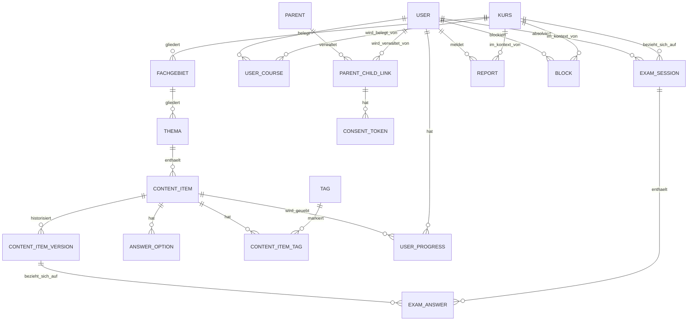

# Architekturplanung: edukedo — Lernplattform für Prüfungsvorbereitung & Wissenserwerb

Version 0.8 · Stand 14.09.2026 · Entwurf zur Abstimmung

> **Update (Version 0.8):** Architektonische Umsetzung der im Anforderungskatalog (Version 0.20, Abschnitt 5.12) neu ergänzten Business-Lizenzen & Sponsoring (F-91–F-94). Zentrale Entscheidung: Die Lizenz koppelt bewusst **nicht** an Premium-Funktionen (F-80/F-81) — ihr einziger Mehrwert ist visuelles Branding (F-92) und aggregierte Statistik (F-93), damit die Investitionshürde für Unternehmen so klein wie möglich bleibt. Dadurch bleibt das Feature **vollständig im Kern-Backend** und benötigt **keine Anbindung an den isolierten Payment-Service** (siehe Abschnitt 1, 8) — ein bewusster Unterschied zum bestehenden B2C-Premium-Modell. Die Abrechnung selbst (geringer, meist pauschaler Betrag) läuft manuell über Rechnung/Überweisung außerhalb des Systems; ein Admin schaltet das Lizenzkontingent danach frei (siehe Abschnitt 4.5, 7, 13). Neu im Datenmodell (Phase-4-Erweiterung, siehe Abschnitt 4.5): `company_account` als eigener Account-Typ analog zu `parent`, `company_invite_code` zur Lizenzvergabe, `user_company_membership` zur Branding-/Statistik-Zuordnung sowie eine vom Lizenzmodell bewusst getrennte `sponsor`-Tabelle für F-94. Entsprechend ergänzt: Abschnitt 3 (Rolle `company_admin`), Abschnitt 7 (neue `/company/*`-Endpunkte, Zugriffskontrolle für aggregierte Statistik), Abschnitt 13 (neue Entscheidungen vom 14.09.2026).
>
> **Update (Version 0.7):** Ergänzung eines Plattform-Hinweises zur Offline-/PWA-Strategie: iOS/Safari weicht in zwei Punkten von Android/Chrome ab — (1) die PWA-Installation läuft ausschließlich manuell über das Safari-Teilen-Menü, es gibt keinen automatischen Installations-Prompt; (2) Safaris Speicherbereinigung (Intelligent Tracking Prevention) kann lokal zwischengespeicherte Daten — inklusive der für den Offline-Modus (F-42) heruntergeladenen Lerninhalte — nach einer gewissen Zeit ohne Nutzung löschen. Da „auch offline zuverlässig verfügbar" ein Kernversprechen von edukedo ist, wird dies als expliziter Test- und Beobachtungspunkt in Abschnitt 5 und Abschnitt 10 aufgenommen, mit einer möglichen Re-Sync-/Warnmechanik als Mitigation; noch keine abschließende architektonische Entscheidung, siehe Abschnitt 13.
>
> **Update (Version 0.6):** Ergebnis eines Entwickler-Reviews von Architekturplanung und Entwicklungsplan. Vier konkrete Schärfungen am Datenmodell/Konzept: (1) **`exam_answer`** referenziert jetzt `content_item_version_id` statt `content_item_id` — analog zum Duell (F-61) zeigt eine Prüfungsauswertung damit immer exakt den Wortlaut, der tatsächlich gestellt wurde, auch wenn der Content-Editor die Frage später korrigiert. Voraussetzung dafür: **`content_item_version`** wird ab sofort ausdrücklich bereits bei der *Erstellung* eines `content_item` angelegt (Version 1), nicht erst bei der ersten Bearbeitung. (2) **`answer_option`** erhält ein neues `side`-Feld (nur für `zuordnung`), das explizit macht, welcher der beiden Paar-Partner die „linke" bzw. „rechte" Seite ist — vorher trug nur `group_key` die Paar-Zugehörigkeit, ohne die Seite festzulegen. (3) Klargestellt: Die Selbstlöschung des eigenen Kontos (F-06) ist unabhängig vom Payment-Service bereits ab den ersten echten Nutzerkonten nötig, nicht erst mit Phase 4 (siehe Abschnitt 8). (4) Redaktionelle Klarstellung zu `report`/`block`: Diese gehören bewusst in dieselbe erste Migrations-Charge wie das übrige Phase-1-Schema (siehe Abschnitt 4.4, „Nächste Schritte").
>
> **Update (Version 0.5):** Abschnitt 4 (Datenmodell) grundlegend vertieft — von einer knappen ERD-Skizze zu einem soliden, flexiblen Schema mit tatsächlicher SQL-Schreibweise, expliziten Constraints/Indizes und dokumentiertem Löschverhalten je Tabelle. Wichtigste neue Elemente (alle am 12.09.2026 entschieden): **`content_item_version`** führt eine echte Versionshistorie statt einer reinen Versionsnummer ein (Grundlage für exakte Duell-Snapshots in Phase 4); **`content_item.payload`** (JSONB, typspezifisch) ergänzt die bisher nur für Multiple-Choice passende `answer_option`-Tabelle um Lückentext, Kurzantwort und Fallaufgaben, ohne für jeden Fragetyp eine eigene Tabelle zu benötigen; ein neues, kursübergreifendes **`tag`/`content_item_tag`**-System ergänzt die hierarchische Einordnung um freies Verschlagworten (F-13/F-14); `kurs.locale` bereitet F-52 vor, ohne jetzt schon eine Übersetzungstabelle zu bauen; fehlende Unique-Constraints (u. a. keine doppelte Kursbelegung, genau ein Fortschritts-Datensatz je Content-Item) wurden ergänzt; das kaskadierende Löschverhalten für F-06 ist jetzt je Tabelle explizit festgelegt statt nur allgemein beschrieben.
>
> **Update (Version 0.4):** Namensübernahme: Die Plattform heißt **edukedo** (siehe Anforderungskatalog Abschnitt 1, Version 0.19); rein redaktionelle Änderung ohne architektonische Konsequenz. Referenz auf den Anforderungskatalog von Version 0.17 auf die aktuelle Version 0.19 aktualisiert.
>
> **Update (Version 0.3):** Die verbliebenen offenen Architekturentscheidungen aus Abschnitt 13 (v0.2) wurden geklärt: (1) Die Kern-API nutzt **tRPC**. (2) Die Karteikarten-Logik (F-20) implementiert **direkt FSRS** statt mit SM-2 zu starten — das Datenmodell für `USER_PROGRESS` wurde entsprechend auf FSRS-Felder umgestellt. (3) Die konkrete Infrastruktur für das selbst gehostete KI-Modell (F-71/F-72) wird bewusst zurückgestellt und erst kurz vor Phase 4 entschieden. (4) Die Kommunikation zwischen Kern-Backend und Payment-Service wird um eine **Event-/Message-Queue** ergänzt (zusätzlich zu synchronen Statusabfragen und dem Zahlungsdienstleister-Webhook), damit Statusänderungen ohne Polling ankommen. (5) Der Payment-Service bleibt **im Monorepo** als eigenes App-Paket. (6) Der Melde-Workflow (F-68, Phase 4) wird als **einfache Zusatzansicht im bestehenden Admin-/Redaktionsbereich** umgesetzt, nicht als eigene Moderationsoberfläche.
>
> **Update (Version 0.2):** Grundlegend überarbeitet, um dem inzwischen stark erweiterten Anforderungskatalog (Version 0.17) zu entsprechen — insbesondere der strategischen Neuausrichtung als generische Multi-Kurs-Plattform (statt reiner Fachwirt-App), der Mehrfach-Kursbelegung (F-09), den Alters-/Jugendschutz- und Eltern-Anforderungen (F-08, F-90, F-53), der Isolierung des Zahlungsmoduls (N-11) sowie der neuen Melde-/Blockierfunktion (F-68). Wichtigste architektonische Entscheidungen dieser Version (alle am 12.09.2026 getroffen): Payment wird als vollständig separater Service mit eigener Datenbank betrieben — stärkere Isolation als ursprünglich vorgesehen; Auth wird komplett selbst gebaut statt Managed Auth zu nutzen, um die Eltern-Kind-Verknüpfung sauber abzubilden; das Eltern-Dashboard erhält einen eigenen, vollwertigen Account-Typ; das Datenmodell für Melden/Blockieren (F-68) wird bereits in Phase 1 mitgebaut, obwohl die Funktion selbst erst in Phase 4 aktiv wird.

Basiert auf dem Anforderungskatalog Version 0.19 (siehe separates Dokument, insbesondere Abschnitt 4 für das generische Content-Modell und Abschnitt 10 für alle „für die Architekturplanung" markierten Entscheidungen). Rahmenbedingungen: Web-App mit PWA-Fähigkeit, Backend mit Nutzerkonten und geräteübergreifender Synchronisierung, generisches Multi-Kurs-Modell von Anfang an, gestaffelter statt vollständiger Content-Umfang zum Start, zwei parallel startende Kurse (Fachwirt-Pilot + Schulfach-Kurs), Solo-/Kleinprojekt mit Wunsch nach niedrigen Betriebskosten und späterer Skalierbarkeit.

## 1. Leitprinzipien für die Architektur

- **Einfachheit vor Vollständigkeit, mit einer bewussten Ausnahme:** Der Kernbereich (Auth, Content, Sync/Progress, Sozial-/Gamification-Funktionen) bleibt ein Monolith mit klarer innerer Modulstruktur — weniger Betriebsaufwand, schnellere Entwicklung für eine Einzelperson. **Payment weicht davon ab und wird von Anfang an als eigener, vollständig getrennter Service mit eigener Datenbank betrieben** (siehe Abschnitt 8): Die stärkere Isolation wiegt hier den zusätzlichen Betriebsaufwand auf, weil ein Sicherheitsvorfall im Kernsystem so nicht automatisch auch Zahlungsdaten betrifft.
- **Content ist Daten, nicht Code — jetzt für beliebige Kurse:** Das generische Content-Modell (Kurs → Fachgebiet → Thema → Lerneinheit, siehe Anforderungskatalog Abschnitt 4) bedeutet, dass sowohl der Fachwirt-Pilot als auch der neue Schulfach-Kurs über dieselben Tabellen abgebildet werden, ohne Schemaänderung (siehe Abschnitt 4 dieses Dokuments).
- **Offline-first, wo es zählt:** Die individuellen Lernmodi (Karteikarten, Quiz, Übungssets) müssen auch mit wackliger Verbindung funktionieren; die sozialen Features (Duelle, Highscore, Lernpartner-Vermittlung) setzen ausdrücklich eine Online-Verbindung voraus (siehe F-42).
- **Datenmodell für Vertrauen/Jugendschutz früh anlegen, Funktion später aktivieren:** Analog zum bereits im Anforderungskatalog verankerten Vorgehen bei F-08 wird auch das Datenmodell für die Melde-/Blockierfunktion (F-68) schon in Phase 1 mitgebaut, obwohl die Funktion selbst erst mit den sozialen Features in Phase 4 live geht — vermeidet eine Schema-Änderung an einer dann bereits produktiven Datenbank mit echten Nutzerdaten.
- **Niedrige Einstiegskosten, klarer Wachstumspfad:** Start auf Hobby-/Free-Tiers, aber ohne Architekturentscheidungen, die einen späteren Umzug erzwingen.

## 2. Technologie-Empfehlung im Überblick

| Bereich | Empfehlung | Begründung |
|---|---|---|
| Frontend | React + TypeScript, Vite als Build-Tool | Größtes Ökosystem, gute PWA-Unterstützung, gut geeignet für interaktive Quiz-/Karteikarten-UI sowie für die rollenbasierten Ansichten (learner, parent, admin, **company_admin**, ergänzt 14.09.2026; `content_editor` mit F-117 am 22.09.2026 wieder entfernt) |
| Styling/UI | Tailwind CSS + shadcn/ui-Komponenten | Schnelles, konsistentes UI ohne viel Custom-CSS |
| State/Data-Fetching | TanStack Query | Sauberes Caching und Sync von Server-Daten, wichtig für Offline/Sync-Logik |
| PWA/Offline | Vite PWA Plugin (Workbox) + IndexedDB (über Dexie.js) | Service-Worker-Caching für Assets, IndexedDB für Offline-Lernstand-Queue |
| Kern-Backend | **Node.js + TypeScript, Fastify** (entschieden am 12.09.2026, siehe Abschnitt 13) | Eine Sprache im gesamten Stack senkt Kontextwechsel-Kosten für eine Einzelperson; Fastify hat einen offiziellen tRPC-Adapter und weniger Boilerplate als NestJS für eine Einzelperson |
| Auth | **Eigenbau, im Kern-Backend, nach dem Lucia-Pattern** (entschieden am 12.09.2026, siehe Abschnitt 13) | Volle Kontrolle über Altersabfrage, Eltern-Verknüpfung (F-08) und einen eigenen Eltern-Account-Typ (F-90) — Managed-Auth-Anbieter (Supabase Auth/Clerk) unterstützen diese Eltern-Kind-Beziehung nicht nativ. Argon2id-Hashing plus signierte, httpOnly-Session-Cookies nach dem Lucia-Pattern (Sessions-Tabelle mit gehashtem Token, siehe Abschnitt 13) — Lucia selbst ist als Bibliothek inzwischen archiviert/deprecated, daher wird nur das Pattern übernommen, nicht die Bibliothek als Dependency eingebunden |
| Payment-Service | **Eigener Service, eigene Datenbank, eigenes Deployment** (entschieden am 12.09.2026) | Vollständige Isolation von Zahlungsdaten gegenüber dem Kernsystem (siehe Abschnitt 8); kommuniziert mit dem Kern-Backend nur über eine schmale, versionierte REST-API |
| API-Stil (Kern) | **tRPC** (entschieden am 12.09.2026) | Spart Boilerplate bei TS-Frontend+Backend im selben Monorepo; native Apps/Drittanbieter-Clients sind laut Anforderungskatalog ohnehin out of scope (Abschnitt 8) |
| API-Stil (Kern ↔ Payment) | REST/HTTPS für synchrone Statusabfragen, **plus Event-/Message-Queue** für asynchrone Statusänderungen (entschieden am 12.09.2026); Zahlungsdienstleister → Payment-Service weiterhin per Webhook | Zwei getrennte Services kommunizieren über einen stabilen, sprachunabhängigen Vertrag statt über TS-spezifische RPC-Mechanismen; die Queue liefert Statusänderungen (z. B. Premium-Freischaltung) ohne Polling an den Kern |
| Datenbank (Kern) | PostgreSQL (verwaltet, z. B. Neon oder Supabase) | Relational passt gut zu den strukturierten Beziehungen des generischen Content-Modells (Kurs → Fachgebiet → Thema → Content-Item → Fortschritt) |
| Datenbank (Payment) | Eigene PostgreSQL-Instanz (separates Neon-/Supabase-Projekt oder eigener Anbieter) | Physische statt nur logischer Trennung — konsistent mit der Entscheidung für einen vollständig separaten Service |
| ORM | **Drizzle ORM** (für den Kern entschieden am 12.09.2026, siehe Abschnitt 13; für Payment weiterhin unabhängig wählbar) | Typsichere Queries, SQL-nahe Migrationsverwaltung, die sich direkt am bereits als reinem SQL-DDL dokumentierten Schema (Abschnitt 4.3) orientiert; Kern und Payment teilen sich bewusst keine ORM-Modelle |
| Caching/Sessions | Redis (optional, erst bei Bedarf) | Session-Storage, Rate-Limiting (u. a. für Login und Einladungscodes, F-63); für MVP ggf. verzichtbar |
| Message-Queue (Kern ↔ Payment) | **BullMQ auf Redis** (empfohlen, konsistent mit dem ohnehin vorgesehenen Redis) | Kein zusätzlicher Infrastruktur-Anbieter nötig; deckt den entschiedenen Bedarf an asynchronen Statusänderungen ab. Alternative (z. B. ein Cloud-Messaging-Dienst wie SNS/SQS) bleibt möglich, falls Redis aus anderen Gründen entfällt |
| Objekt-/Medienspeicher | S3-kompatibel (z. B. Cloudflare R2) | Für Bilder/Diagramme in Lerninhalten |
| Hosting Frontend | Vercel oder Cloudflare Pages | Kostengünstiger Einstieg, automatisches Deployment aus Git, CDN inklusive |
| Hosting Kern-Backend + DB | Railway, Render oder Fly.io (+ Neon/Supabase für DB) | Einfaches Deployment, günstige Einstiegstarife |
| Hosting Payment-Service + DB | Eigenes, vom Kernsystem getrenntes Projekt/Environment beim selben oder einem anderen Anbieter | Eigene Zugriffskontrolle, eigene Umgebungsvariablen/Secrets — organisatorisch und physisch getrennt vom Kernsystem |
| Monorepo-Tooling | pnpm Workspaces + Turborepo, Payment-Service als eigenes App-Paket | Weiterhin ein Repository für einfachere Entwicklung als Solo-Person, aber unabhängig deploybar und ohne gemeinsamen DB-Zugriff |
| CI/CD | GitHub Actions, getrennte Deploy-Pipelines für Kern und Payment | Kostenlos für kleine Projekte; getrennte Pipelines verhindern, dass ein Fehler im einen Bereich versehentlich den anderen mit deployt |

**Alternative, falls du lieber mit Python arbeitest:** Backend mit FastAPI + SQLAlchemy statt Node/TypeScript; das restliche Konzept (PostgreSQL, REST/OpenAPI, Hosting, getrennter Payment-Service) bleibt gültig.

## 3. Systemarchitektur (Überblick)


Der Kern-Backend-„Monolith" bleibt intern modular (Auth, Consent, Content, Sync/Progress, Sozial, **Business (Lizenzen/Branding/Sponsoring, ergänzt 14.09.2026)** als getrennte Module/Ordner), damit einzelne Teile bei Bedarf später als eigene Services herausgelöst werden können. Das neue Business-Modul (F-91–F-94) ist bewusst ein gewöhnliches Kern-Modul wie die übrigen — **kein** Anschluss an den separaten Payment-Service, weil die Lizenz keine Premium-Freischaltung auslöst (siehe Update Version 0.8, Abschnitt 13). Payment ist die eine bewusste Ausnahme von diesem Monolith-Prinzip (siehe Abschnitt 1, 8): Frontend und Nutzer:innen interagieren dort, wo möglich, direkt mit dem gehosteten Checkout des Zahlungsdienstleisters, damit möglichst wenig Zahlungsdaten überhaupt die eigene Infrastruktur berühren (siehe F-81). **Kern und Payment-Service kommunizieren über zwei Kanäle (entschieden am 12.09.2026):** synchrone REST-Statusabfragen für den unmittelbaren Bedarf (z. B. beim Login prüfen, ob Premium aktiv ist) und eine Event-/Message-Queue für asynchrone Statusänderungen (z. B. eine neue Zahlung schaltet Premium frei, ohne dass der Kern dafür pollen müsste) sowie für die umgekehrte Richtung (der Kern meldet eine Konto-Löschung nach F-06 an den Payment-Service, damit dieser seine eigenen Daten ebenfalls bereinigt).

## 4. Datenmodell (Kernentitäten, Stand Phase 1)

**Überarbeitet und deutlich vertieft am 12.09.2026** (vorherige Fassung: knappe ERD-Skizze; siehe Abschnitt 13 für die dabei getroffenen Entscheidungen). Ziel dieser Überarbeitung: ein Schema, das sowohl **solide** ist (referenzielle Integrität, sinnvolle Constraints/Indizes, sauberer Umgang mit Löschungen und Versionierung) als auch **flexibel** bleibt (neue Kurstypen, Content-Formate und Sprachen ohne Breaking-Change am Schema).

### 4.1 Designprinzipien

- **Hybrid relational/JSONB, je nach Vorhersagbarkeit der Struktur:** Wo die Struktur stabil und häufig strukturiert abgefragt wird (Kurs-Hierarchie, Multiple-Choice-Optionen, Fortschritt), bleibt das Modell relational mit echten Spalten/Fremdschlüsseln. Wo die Struktur je nach Content-Typ oder Kurstyp variiert (Lückentext-Lücken, Fallaufgaben-Teilschritte, kurstypspezifische Zusatzattribute), übernimmt ein `payload`/`metadata`-JSONB-Feld die Flexibilität — validiert nicht durch die Datenbank, sondern per Zod-Schema auf Anwendungsebene (siehe Abschnitt 7), pro `type`-Wert unterschiedlich. Das vermeidet sowohl ein „JSONB für alles" (nichts mehr abfragbar/indexierbar) als auch ein „eigene Tabelle pro Content-Typ" (Schema-Änderung bei jedem neuen Fragetyp, widerspricht N-05).
- **Versionierung statt Hard-Delete bei Content:** `CONTENT_ITEM` wird bei Bearbeitung nicht überschrieben, sondern über `CONTENT_ITEM_VERSION` historisiert (setzt F-12 konkret um). Das ist zugleich die solide Grundlage für den beim Duell (F-61, Phase 4) geforderten Content-Snapshot sowie — seit Version 0.6 — für Prüfungsantworten (`EXAM_ANSWER`, siehe unten): Beide referenzieren eine konkrete `content_item_version_id`, nicht nur eine veränderliche Versionsnummer. **Wichtig:** `CONTENT_ITEM_VERSION` wird deshalb nicht erst bei der ersten Bearbeitung angelegt, sondern bereits beim Erstellen eines `CONTENT_ITEM` (Version 1) — sonst gäbe es für ein brandneues Content-Item keine Version, auf die eine frühe Prüfungsantwort oder ein frühes Duell verweisen könnte.
- **Explizite Unique-Constraints gegen unmögliche Zustände:** z. B. genau ein `USER_PROGRESS`-Datensatz je (`user_id`, `content_item_id`), keine doppelte Kursbelegung in `USER_COURSE` — im Vorgängerentwurf nicht explizit, hier nachgezogen.
- **Löschverhalten pro Tabelle bewusst festgelegt statt nur in Prosa beschrieben:** F-06 (Konto-/Datenlöschung) verlangt kaskadierendes Löschen; welche Fremdschlüssel `CASCADE`, `SET NULL` oder `RESTRICT` auslösen, ist unten je Tabelle vermerkt statt nur allgemein postuliert. Die **Selbstlöschung des eigenen Kontos ist dabei unabhängig vom Payment-Service** bereits ab den allerersten echten Nutzerkonten nötig (nicht erst mit Phase 4/Payment) — siehe Abschnitt 8.
- **Freies Verschlagworten quer zur Kurs-Hierarchie:** Eine neue `TAG`/`CONTENT_ITEM_TAG`-Verknüpfung ergänzt F-13/F-14 um kursübergreifende, frei vergebbare Schlagworte (z. B. „Prüfungsrelevant", „Wiederholung empfohlen") — unabhängig von Kurs/Fachgebiet/Thema und damit flexibler als eine rein hierarchische Einordnung.
- **Eindeutige Seitenzuordnung bei Zuordnungs-Paaren:** `ANSWER_OPTION` erhält (seit Version 0.6) neben `group_key` ein `side`-Feld, das bei `type = 'zuordnung'` explizit festlegt, ob eine Option die linke oder rechte Seite eines Paares ist — vorher war das nur implizit über Anwendungskonvention lösbar.
- **Mehrsprachigkeit vorbereitet, ohne sie jetzt zu bauen (F-52):** `KURS.locale` (Default `de`) hält fest, in welcher Sprache ein Kurs geführt wird. Weitere Sprachen kämen additiv über eine spätere `CONTENT_ITEM_TRANSLATION`-Tabelle hinzu, ohne bestehende Spalten zu verändern — im Phase-1-Schema bewusst noch nicht angelegt (kein aktueller Bedarf, siehe F-52 Priorität „Kann").

### 4.2 ER-Diagramm (Überblick, Phase 1)



### 4.3 Tabellenschema (Phase 1)

Tabellen-/Spaltennamen hier bereits in der tatsächlichen SQL-Schreibweise (`snake_case`), passend zu Drizzle/Prisma. `references(...)` zeigt jeweils den Fremdschlüssel samt Lösch-/Änderungsverhalten.

**Content-Hierarchie**

```sql
kurs (
  id            uuid primary key default gen_random_uuid(),
  slug          text not null unique,                 -- z.B. "fachwirt-buero-projektorganisation", "mathematik-9-bundeslandneutral"
  type          text not null,                          -- "fachwirt" | "schulfach" | ... (offen für weitere Typen, F-13/N-05)
  title         text not null,
  locale        char(5) not null default 'de',          -- Vorbereitung F-52, siehe 4.1
  metadata      jsonb not null default '{}',             -- z.B. Klassenstufe, Bundesland-Ansatz (F-13)
  target_mode   text not null default 'einzeltermin',   -- "einzeltermin" | "wochenziel" (F-35)
  is_published  boolean not null default false,
  created_at    timestamptz not null default now(),
  updated_at    timestamptz not null default now()
);

fachgebiet (
  id          uuid primary key default gen_random_uuid(),
  kurs_id     uuid not null references kurs(id) on delete cascade,
  code        text not null,                            -- z.B. "HB1", "algebra"
  title       text not null,
  sort_order  int not null default 0,
  metadata    jsonb not null default '{}',
  unique (kurs_id, code)
);
create index on fachgebiet (kurs_id, sort_order);

thema (
  id             uuid primary key default gen_random_uuid(),
  fachgebiet_id  uuid not null references fachgebiet(id) on delete cascade,
  title          text not null,
  sort_order     int not null default 0
);
create index on thema (fachgebiet_id, sort_order);
```

**Content-Items — relational, wo stabil, JSONB, wo variabel**

```sql
content_item (
  id               uuid primary key default gen_random_uuid(),
  thema_id         uuid not null references thema(id) on delete cascade,
  type             text not null,          -- "theorie" | "karteikarte" | "quiz_mc" | "zuordnung" | "luecken" | "kurzantwort" | "fallaufgabe"
  prompt           text not null,           -- Frage/Vorderseite/Aufgabentext, je nach type
  explanation      text,                    -- Erklärung/Rückseite/Musterlösung, je nach type
  payload          jsonb not null default '{}', -- typspezifische Struktur, siehe unten
  difficulty       text not null default 'mittel', -- "leicht" | "mittel" | "schwer"
  is_premium       boolean not null default false,   -- F-80
  is_active        boolean not null default true,    -- Soft-Delete statt Hard-Delete: alte Fortschritts-/Prüfungsdaten bleiben referenzierbar
  current_version  int not null default 1,
  created_by       uuid references "user"(id) on delete set null,
  created_at       timestamptz not null default now(),
  updated_at       timestamptz not null default now()
);
create index on content_item (thema_id) where is_active;

-- Historie zu jeder inhaltlichen Änderung (F-12), Grundlage für Duell- (F-61) und Pruefungs-Snapshots (EXAM_ANSWER).
-- Wird bereits beim Erstellen eines content_item als Version 1 angelegt, nicht erst bei der ersten Bearbeitung (siehe 4.1).
content_item_version (
  id               uuid primary key default gen_random_uuid(),
  content_item_id  uuid not null references content_item(id) on delete cascade,
  version_number   int not null,
  prompt           text not null,
  explanation      text,
  payload          jsonb not null,
  changed_by       uuid references "user"(id) on delete set null,
  change_note      text,
  created_at       timestamptz not null default now(),
  unique (content_item_id, version_number)
);

-- Nur für type IN ('quiz_mc', 'zuordnung'). Bei quiz_mc bleiben group_key/side leer, is_correct traegt die Bewertung.
-- Bei zuordnung tragen genau zwei Zeilen denselben group_key mit unterschiedlichem side-Wert ("links"/"rechts") -
-- side macht explizit, welcher Paar-Partner auf welcher Seite der Zuordnungs-UI erscheint (seit Version 0.6).
answer_option (
  id                uuid primary key default gen_random_uuid(),
  content_item_id   uuid not null references content_item(id) on delete cascade,
  group_key         text,               -- nur Zuordnung: verknüpft zusammengehörige Paare
  side              text,               -- nur Zuordnung: "links" | "rechts"
  text              text not null,
  is_correct        boolean not null default false,
  sort_order        int not null default 0
);
create index on answer_option (content_item_id);

-- Freies, kursübergreifendes Verschlagworten (F-13/F-14), unabhängig von der Kurs-Hierarchie
tag (
  id    uuid primary key default gen_random_uuid(),
  name  text not null unique
);

content_item_tag (
  content_item_id  uuid not null references content_item(id) on delete cascade,
  tag_id           uuid not null references tag(id) on delete cascade,
  primary key (content_item_id, tag_id)
);
```

**Payload-Struktur je `content_item.type` (auf Anwendungsebene per Zod validiert, nicht in der DB erzwungen):**

| `type` | `payload`-Inhalt (Beispiel) |
|---|---|
| `theorie` | `{ "body_markdown": "...", "images": ["..."] }` |
| `karteikarte` | `{}` (Vorder-/Rückseite genügen `prompt`/`explanation`) |
| `quiz_mc` | `{}` (Optionen liegen in `answer_option`) |
| `zuordnung` | `{}` (Paare liegen in `answer_option` über `group_key`/`side`) |
| `luecken` | `{ "text_with_blanks": "...", "blanks": [{"id": "1", "accepted": ["..."]}] }` |
| `kurzantwort` | `{ "accepted_answers": ["..."], "match_mode": "exact\|contains" }` |
| `fallaufgabe` | `{ "parts": [{"prompt": "...", "points": 5}] }` |

**Nutzerkonten & Kursbelegung**

```sql
"user" (
  id                 uuid primary key default gen_random_uuid(),
  email              citext not null unique,           -- benoetigt Postgres-Extension "citext", siehe Abschnitt 9
  password_hash      text not null,
  birth_date         date,
  is_minor           boolean not null,   -- bei Registrierung aus birth_date abgeleitet und persistiert (F-08, N-13)
  email_verified_at  timestamptz,
  created_at         timestamptz not null default now(),
  updated_at         timestamptz not null default now()
);

-- n:m Nutzerkonto <-> Kurs (F-09), von Anfang an eigene Verknüpfungstabelle
user_course (
  id                 uuid primary key default gen_random_uuid(),
  user_id            uuid not null references "user"(id) on delete cascade,
  kurs_id            uuid not null references kurs(id) on delete cascade,
  target_date        date,
  plan_start_date    date,
  weekly_goal_items  int,       -- nur bei target_mode 'wochenziel' genutzt (F-35)
  joined_at          timestamptz not null default now(),
  unique (user_id, kurs_id)   -- verhindert Doppel-Belegung desselben Kurses
);
```

**Fortschritt & Prüfungssimulation**

```sql
user_progress (
  id               uuid primary key default gen_random_uuid(),
  user_id          uuid not null references "user"(id) on delete cascade,
  content_item_id  uuid not null references content_item(id) on delete cascade,
  difficulty       real not null,        -- FSRS-Parameter
  stability        real not null,        -- FSRS-Parameter
  state            text not null,        -- "new" | "learning" | "review" | "relearning"
  due_at           timestamptz not null,
  last_reviewed_at timestamptz,
  last_result      text,                 -- "gewusst" | "unsicher" | "nicht_gewusst"
  reps             int not null default 0,
  lapses           int not null default 0,
  unique (user_id, content_item_id)      -- genau ein Fortschritts-Datensatz je Nutzer:in und Content-Item
);
create index on user_progress (user_id, due_at);   -- zentrale Abfrage für F-20/F-27: "welche Karten sind fällig"

exam_session (
  id           uuid primary key default gen_random_uuid(),
  user_id      uuid not null references "user"(id) on delete cascade,
  kurs_id      uuid not null references kurs(id) on delete cascade,
  mode         text not null,     -- "quiz" | "schriftliche_simulation" | "praesentation" | "fachgespraech"
  started_at   timestamptz not null default now(),
  finished_at  timestamptz,
  score        real
);
create index on exam_session (user_id, kurs_id);

-- Seit Version 0.6: referenziert content_item_version_id statt content_item_id, analog zum Duell (F-61) -
-- eine Pruefungsauswertung zeigt damit immer den Wortlaut, der zum Pruefungszeitpunkt tatsaechlich galt,
-- auch wenn die Frage danach redaktionell korrigiert wurde.
exam_answer (
  id                       uuid primary key default gen_random_uuid(),
  exam_session_id          uuid not null references exam_session(id) on delete cascade,
  content_item_version_id  uuid not null references content_item_version(id) on delete restrict, -- Pruefungsantworten bleiben auch bei (seltenem) Content-Hard-Delete auswertbar
  given_answer             jsonb not null,   -- Struktur variiert wie beim payload je nach content_item.type
  is_correct               boolean,
  points                   real
);
create index on exam_answer (exam_session_id);
```

**Eltern-/Jugendschutz (F-08, F-90)**

```sql
parent (
  id             uuid primary key default gen_random_uuid(),
  email          citext not null unique,
  password_hash  text not null,
  created_at     timestamptz not null default now()
);

parent_child_link (
  id              uuid primary key default gen_random_uuid(),
  parent_id       uuid not null references parent(id) on delete cascade,
  user_id         uuid not null references "user"(id) on delete cascade,
  consent_status  text not null default 'pending',  -- "pending" | "confirmed" | "revoked"
  consented_at    timestamptz,
  revoked_at      timestamptz,
  unique (parent_id, user_id)
);

consent_token (
  id                     uuid primary key default gen_random_uuid(),
  parent_child_link_id   uuid not null references parent_child_link(id) on delete cascade,
  token_hash             text not null unique,
  expires_at             timestamptz not null,
  used_at                timestamptz,
  reminder_sent_count    int not null default 0
);
create index on consent_token (expires_at);  -- für Erinnerungs-/Aufräum-Jobs
```

**Melden/Blockieren (F-68, Datenmodell bereits in der ersten Migrations-Charge von Phase 1, UI erst Phase 4)**

```sql
report (
  id                 uuid primary key default gen_random_uuid(),
  reporter_user_id   uuid references "user"(id) on delete set null,  -- Meldung bleibt für Moderation bestehen, auch wenn meldende Person das Konto löscht
  reported_user_id   uuid references "user"(id) on delete cascade,   -- betrifft die gemeldete Person direkt -> mit ihr löschen
  kurs_id            uuid not null references kurs(id) on delete cascade,
  reason             text not null,
  status             text not null default 'offen',  -- "offen" | "geprueft" | "abgelehnt"
  created_at         timestamptz not null default now()
);

block (
  id                uuid primary key default gen_random_uuid(),
  user_id           uuid not null references "user"(id) on delete cascade,
  blocked_user_id   uuid not null references "user"(id) on delete cascade,
  kurs_id           uuid not null references kurs(id) on delete cascade,
  created_at        timestamptz not null default now(),
  unique (user_id, blocked_user_id, kurs_id)
);
```

### 4.4 Hinweise

- **KURS/FACHGEBIET/THEMA/CONTENT_ITEM** ersetzen die frühere, fachwirt-spezifische `HANDLUNGSBEREICH`-Tabelle durch das generische Content-Modell aus Anforderungskatalog Abschnitt 4. Der Fachwirt-Pilot und der Schulfach-Kurs sind beides einfach Zeilen in `kurs`, ohne Schemaunterschied — konsistent mit dem dortigen Architektur-Check.
- **`kurs.metadata` (JSONB)** setzt die Entscheidung zu kursspezifischen Zusatzattributen (F-13) um — z. B. Klassenstufe/Bundesland beim Schulfach-Kurs — ohne kurstypspezifische Spalten/Tabellen. `kurs.locale` bereitet F-52 vor, ohne jetzt schon eine Übersetzungstabelle anzulegen. `kurs.is_published` ist zugleich der Schalter, mit dem ein Kurs (z. B. der Mathe-Kurs, siehe Abschnitt 8) erst dann für echte Nutzer:innen sichtbar wird, wenn die dafür nötige Schutzinfrastruktur steht.
- **`user_course`** realisiert die n:m-Beziehung Nutzerkonto↔Kurs (F-09) als eigene Verknüpfungstabelle von Anfang an; der `unique`-Constraint auf (`user_id`, `kurs_id`) verhindert eine versehentliche Doppel-Belegung, die im Vorgängerentwurf nicht ausgeschlossen war.
- **`user.is_minor`** wird bei Registrierung aus `birth_date` abgeleitet und persistiert (statt bei jeder Anfrage neu berechnet), damit Berechtigungsprüfungen (F-66, N-13) und der Ausschluss von Profiling/personalisierter Werbung für Minderjährige (N-01) einfach und konsistent auf dieses eine Feld referenzieren können.
- **`content_item.payload` (JSONB) + `answer_option` (relational)** lösen gemeinsam ab, was im Vorgängerentwurf nur für Multiple-Choice sauber passte: Multiple-Choice und Zuordnung bleiben relational und damit abfragbar/auswertbar (z. B. „welche falsche Antwortoption wird am häufigsten gewählt", relevant für F-16); Lückentext, Kurzantwort und Fallaufgaben nutzen `payload`, weil ihre Struktur zu unterschiedlich ist, um sinnvoll in eigene Spalten/Tabellen zu pressen. Bei Zuordnung macht das neue `side`-Feld (seit Version 0.6) explizit, welche zwei Zeilen mit gleichem `group_key` jeweils die linke bzw. rechte Seite eines Paares sind.
- **`content_item_version`** ist neu (entschieden am 12.09.2026) und macht aus der bisher nur als Zahl geführten Versionierung (F-12) eine echte Historie: Jede inhaltliche Änderung erzeugt einen neuen Versionsdatensatz, statt die alte Fassung zu überschreiben — inklusive Version 1 bereits beim Erstellen des Content-Items (siehe 4.1). Das ist die Voraussetzung dafür, dass sowohl ein Duell (F-61, Phase 4) als auch — seit Version 0.6 — eine abgelegte Prüfungsantwort (`exam_answer`) exakt auf eine bestimmte Content-Fassung verweisen können (`content_item_version_id`) statt nur auf eine veränderliche Versionsnummer.
- **`content_item.is_active`** ersetzt einen harten Löschvorgang für Content: Damit bleiben referenzierte `user_progress`- und `exam_answer`-Datensätze auch dann noch sinnvoll auswertbar, wenn ein Content-Item redaktionell zurückgezogen wird.
- **`tag`/`content_item_tag`** sind neu (entschieden am 12.09.2026) und ergänzen F-13/F-14 um freies, kursübergreifendes Verschlagworten, das nicht an die Kurs-Hierarchie gebunden ist — z. B. ein Tag „Prüfungsrelevant", das sowohl im Fachwirt- als auch im Mathematik-Kurs verwendet werden kann.
- **`parent`, `parent_child_link`, `consent_token`** setzen F-08 und F-90 um: `parent` ist ein eigener, vollwertiger Account-Typ (wie entschieden); `parent_child_link.consent_status` trägt den Einwilligungsstatus inkl. Widerruf (F-90); `consent_token` speichert nur den Hash des Bestätigungslinks (nicht im Klartext) mit Ablaufdatum und einem Zähler für die automatischen Erinnerungsmails.
- **Der Vorschau-Modus (F-08)** ist bewusst nicht Teil dieses Datenmodells: Er wird zustandslos aus dem öffentlichen Content-Bestand bedient, ohne einen `user`-Datensatz oder `user_progress`-Einträge anzulegen — konsistent mit der Vorgabe „keine Speicherung von Fortschritt oder personenbezogenen Daten".
- **`report`/`block`** gehören von Anfang an in dieselbe erste Migrations-Charge wie das übrige Phase-1-Schema (klargestellt in Version 0.6 — vorher stand nur „bereits in Phase 1", ohne den Zeitpunkt innerhalb von Phase 1 eindeutig festzulegen), obwohl die zugehörige Funktion (F-68) erst in Phase 4 zusammen mit den sozialen Features aktiv genutzt wird. Bewusst asymmetrisches Löschverhalten: Löscht die meldende Person ihr Konto, bleibt die Meldung selbst (mit `reporter_user_id = null`) für die Moderationshistorie erhalten; löscht dagegen die gemeldete Person ihr Konto, verliert die Meldung mit ihr ihren Gegenstand und wird mitgelöscht.
- **Löschverhalten (F-06) im Überblick:** Löscht sich ein `user`, kaskadiert das automatisch über `user_course`, `user_progress`, `exam_session` (und darüber `exam_answer`), `parent_child_link` (als Kind) sowie `block`/`report.reported_user_id`; `report.reporter_user_id` wird stattdessen auf `null` gesetzt (siehe oben). `content_item`-Löschungen sind durch `is_active` ohnehin die Ausnahme; falls doch einmal ein Content-Item hart gelöscht wird (was über `content_item_version` kaskadiert), bleiben Prüfungsantworten (`exam_answer`) dank `on delete restrict` auf `content_item_version` geschützt — ein Hard-Delete einer Content-Version mit vorhandenen Prüfungsantworten wird von der Datenbank verweigert, statt still Daten zu verlieren.
- Zahlungsdaten (Abos, Rechnungen) liegen bewusst **nicht** in diesem Datenmodell, sondern in der eigenen Datenbank des Payment-Service (siehe Abschnitt 3, 8) und werden hier nur als Referenz (`user_id`) von außen adressiert.

### 4.5 Phase-4-Erweiterung (Skizze, noch nicht Teil der Phase-1-Migrationen)

Sobald die sozialen Features (F-60–F-65) sowie die Kohorten-/Dozenten-Funktion (F-07, F-64, F-65) gebaut werden, kommen u. a. folgende Tabellen hinzu: `friend_circle_link` (kursbezogen, F-63), `invite_code` (F-63, mit Ablaufdatum/Rate-Limiting), `duel`/`duel_answer` (F-61 — referenziert dank `content_item_version` jetzt sauber eine konkrete Content-Fassung statt nur einer Versionsnummer, analog zu `exam_answer`), `highscore_entry` (F-60), `achievement` (F-67) sowie `cohort`/`cohort_member` (F-64/F-65). `report` und `block` existieren dann bereits und müssen nur noch mit der neuen UI verdrahtet werden.

**Business-Lizenzen & Sponsoring (F-91–F-94, ergänzt 14.09.2026)** — ebenfalls Phase 4 (siehe Anforderungskatalog Abschnitt 9), architektonisch aber bewusst unabhängig vom Payment-Service (siehe Update Version 0.8):

```sql
-- Eigener Account-Typ analog zu "parent" (F-91) — eigenes Login, nicht Teil des "user"-Rollenmodells.
company_account (
  id                 uuid primary key default gen_random_uuid(),
  name               text not null,
  contact_email      citext not null unique,
  password_hash      text not null,
  seat_limit         int not null default 0,        -- Größe des erworbenen Lizenzkontingents
  billing_status     text not null default 'pending', -- "pending" | "active" | "expired" -- manuell durch Admin gepflegt, siehe 4.1-Hinweis unten
  branding_logo_url  text,                            -- F-92: rein visuelles Branding
  branding_color     text,
  branding_headline  text,                            -- z.B. "Ermöglicht durch <Unternehmen>"
  created_at         timestamptz not null default now()
);

-- Lizenzvergabe per Einladungscode (F-91), analog zum invite_code-Konzept für Freundeskreise (F-63).
company_invite_code (
  id                 uuid primary key default gen_random_uuid(),
  company_account_id uuid not null references company_account(id) on delete cascade,
  code               text not null unique,
  expires_at         timestamptz,
  created_at         timestamptz not null default now()
);

-- Verknüpft eine Nutzerin/einen Nutzer mit genau einem Unternehmen (Branding-/Statistik-Zugehörigkeit).
-- Bewusst 1:1 (unique auf user_id) statt n:m, um Branding-Anzeige eindeutig zu halten.
user_company_membership (
  id                 uuid primary key default gen_random_uuid(),
  user_id            uuid not null references "user"(id) on delete cascade,
  company_account_id uuid not null references company_account(id) on delete cascade,
  joined_at          timestamptz not null default now(),
  unique (user_id)
);
create index on user_company_membership (company_account_id);  -- für Sitzplatz-Auslastung (belegt/frei, F-91) und aggregierte Statistik (F-93)

-- Sponsoring (F-94) ist bewusst vom Lizenzmodell getrennt: reine, statische Markenplatzierung ohne
-- Nutzer-Verknüpfung/Tracking (kompatibel mit N-01/N-13 auch im Schulfach-Kurs, siehe Anforderungskatalog 5.12).
sponsor (
  id               uuid primary key default gen_random_uuid(),
  name             text not null,
  logo_url         text,
  attribution_text text not null,          -- z.B. "Ermöglicht durch Unterstützung von XY"
  kurs_id          uuid references kurs(id) on delete cascade,  -- null = plattformweite Platzierung
  is_active        boolean not null default true,
  starts_at        timestamptz,
  ends_at          timestamptz,
  created_at       timestamptz not null default now()
);
```

Hinweise dazu: **Aggregierte Statistik (F-93)** wird bewusst **nicht** als eigene persistente Tabelle geführt, sondern als Query-Ebene über `user_company_membership` (join auf `user_progress`/`exam_session`, gefiltert auf `company_account_id`, ausschließlich aggregiert zurückgegeben — Durchschnittswerte, Prozentanteile). Die entscheidende Absicherung liegt auf API-Ebene (siehe Abschnitt 7): Der `/company/*`-Endpunkt für Statistik darf technisch keine Einzel-Datensätze je Nutzer:in zurückgeben können, aus Beschäftigtendatenschutz-Gründen (§ 26 BDSG, siehe Anforderungskatalog Abschnitt 7). **Löschverhalten:** Löscht sich ein `user`, kaskadiert `user_company_membership` automatisch mit (F-06 bleibt uneingeschränkt gültig, unabhängig vom Unternehmens-Status); löscht sich ein `company_account`, verlieren betroffene Nutzer:innen nur ihre Branding-/Statistik-Zuordnung, nicht ihr eigenes Konto oder ihren Lernfortschritt. **Abrechnung:** `company_account.billing_status` wird manuell von einem Admin gepflegt (Rechnung/Überweisung außerhalb des Systems, siehe Update Version 0.8) — bewusst kein eigenes Rechnungs-/Buchungsmodell, da das Volumen zu Beginn gering und die Abwicklung nicht automatisiert vorgesehen ist.

## 5. Offline-/PWA-Strategie

1. **App-Shell & Assets:** Service Worker cached das UI-Bundle beim ersten Besuch (Workbox „precache").
2. **Content-Vorabladung:** Beim Login bzw. auf Wunsch werden die Lerninhalte des gewählten Kurses/Fachgebiets (statt wie zuvor nur eines Handlungsbereichs) in IndexedDB gespiegelt, sodass Karteikarten/Quiz auch offline funktionieren — unabhängig davon, ob es sich um den Fachwirt-Piloten oder den Schulfach-Kurs handelt.
3. **Offline-Antworten:** Beantwortete Fragen/Karteikarten-Bewertungen werden bei fehlender Verbindung lokal in einer Warteschlange (IndexedDB) gespeichert.
4. **Sync bei Wiederverbindung:** Ein Sync-Service im Kern-Backend nimmt die gepufferten Ereignisse entgegen und spielt sie chronologisch (nach Client-Zeitstempel) über die bestehenden `submitReview`/`recordQuizAttempt`-Pfade nach, statt nur den finalen, clientseitig berechneten Endzustand zu übernehmen (Entscheidung vom 16.09.2026, siehe Abschnitt 13 — löst die ursprünglich hier vorgesehene „last write wins pro Content-Item"-Regel ab, die bei Mehrgeräte-Nutzung eine ganze Lernwiederholung stillschweigend verworfen hätte).
5. **Statusanzeige:** Die UI zeigt sichtbar an, ob gerade offline gearbeitet wird und ob noch nicht synchronisierte Änderungen bestehen.
6. **Ausdrücklich ausgenommen:** Die sozialen Features (Highscore, Duelle, Lernpartner-Vermittlung, Melden/Blockieren) setzen wie entschieden (F-42) eine Online-Verbindung voraus und werden nicht offline gepuffert.
7. **Plattform-Einschränkung iOS/Safari (ergänzt 13.09.2026, noch offener Prüfpunkt):** Anders als Android/Chrome bietet Safari keinen automatischen Installations-Prompt für die PWA — Nutzer:innen müssen die App manuell über „Zum Home-Bildschirm hinzufügen" im Teilen-Menü installieren, was in der Onboarding-Kommunikation berücksichtigt werden sollte. Gravierender: Safaris Speicherbereinigung (Intelligent Tracking Prevention) kann Service-Worker-Cache und IndexedDB-Daten — also genau die für den Offline-Modus vorab geladenen Lerninhalte — löschen, wenn die App über einen gewissen Zeitraum nicht geöffnet wurde. Das muss vor dem Launch auf echten iOS-Geräten verifiziert werden (siehe Abschnitt 10); als Mitigation kommt ein automatischer Re-Sync-Hinweis beim nächsten Online-Öffnen in Frage, falls zwischenzeitlich Inhalte entfernt wurden, statt dass Nutzer:innen unbemerkt mit einer leeren Offline-Kopie dastehen.

## 6. Spaced-Repetition-Algorithmus

**Entschieden am 12.09.2026: FSRS (Free Spaced Repetition Scheduler)** wird direkt implementiert, statt zunächst mit dem einfacheren SM-2 zu starten. FSRS sagt optimale Wiederholungsintervalle genauer voraus (u. a. in Anki seit 2023 Standard), erfordert dafür aber von Anfang an die FSRS-spezifischen Parameter im Datenmodell (`difficulty`, `stability`, `state`, siehe Abschnitt 4) statt des einfacheren SM-2-Modells (`ease_factor`/`interval_days`). Empfohlene Umsetzung: die etablierte Bibliothek **ts-fsrs** (TypeScript-Referenzimplementierung des Algorithmus) statt einer Eigenimplementierung, um Implementierungsfehler bei der Parameter-Optimierung zu vermeiden.

## 7. API-Design-Grundsätze

- **Kern-API:** Klare Trennung nach Modulen: `/auth/*`, `/consent/*` (Eltern-Einwilligungs-Flow, F-08), `/parent/*` (Eltern-Dashboard, F-90), `/courses/*`, `/content/*` (lesend, für Lernende), `/admin/content/*` (schreibend, nur Redaktion/Admin-Rolle), `/progress/*`, `/exam-sessions/*`, `/reports/*` und `/blocks/*` (F-68, Backend ab Phase 1 vorhanden, UI erst Phase 4), sowie neu (Phase 4, ergänzt 14.09.2026) `/company/*` (F-91–F-94: eigenes Login/Session für `company_admin`, Lizenzkontingent-Übersicht inkl. Einladungscodes, Branding-Einstellungen, **ausschließlich aggregierte** Statistik-Endpunkte — bewusst kein Endpunkt, der Einzel-Nutzer-Datensätze je Unternehmen zurückgeben kann, siehe Abschnitt 4.5, 8) und `/sponsors/*` (F-94, lesend für alle Clients, schreibend nur Admin-Rolle).
- Konsequente Eingabevalidierung mit Zod-Schemas, die zwischen Frontend und Kern-Backend geteilt werden (Monorepo-Vorteil) — **bewusst nicht** mit dem Payment-Service geteilt, um dessen Isolation nicht über gemeinsame Typen/Verträge aufzuweichen.
- Autorisierung rollenbasiert: `learner`, `parent`, `admin`, **`company_admin`** (F-91, ergänzt 14.09.2026 — eigener, von `parent` unabhängiger Account-Typ, siehe Abschnitt 4.5) (später ergänzt um `dozent`, siehe F-07). `content_editor` war ursprünglich als dritte `user`-Rolle vorgesehen, wurde aber nie vergeben und mit F-117 (22.09.2026) wieder entfernt, siehe Abschnitt 13.
- Versionierung der API von Anfang an einplanen (`/api/v1/...`).
- **Payment-API (separater Service):** Eigene, schmale REST-Schnittstelle, die dem Kern-Backend nur das Nötigste preisgibt (z. B. „ist Nutzer:in X aktuell Premium, bis wann"), plus ein Webhook-Endpunkt für Ereignisse des Zahlungsdienstleisters. Wo immer möglich, interagiert das Frontend direkt mit dem gehosteten Checkout des Zahlungsdienstleisters statt über eine eigene API, um Zahlungsdaten aus der eigenen Infrastruktur herauszuhalten (F-81).

## 8. Sicherheits- und Datenschutzkonzept

- Passwort-Hashing mit Argon2id (gilt jetzt für Auth **und** für den separaten Payment-Service, jeweils eigenständig implementiert).
- HTTPS erzwingen (HSTS), sichere Cookie-Flags (`HttpOnly`, `Secure`, `SameSite=Lax`) bei Session-/Refresh-Token.
- Rate-Limiting auf Login/Registrierung sowie auf Einladungscodes (F-63, zeitlich befristet und rate-limitiert).
- Serverstandort EU für Kern- **und** Payment-Infrastruktur; Auftragsverarbeitungsverträge (AVV) getrennt mit dem Zahlungsdienstleister und mit dem Managed-KI-API-Anbieter (F-72) abschließen.
- **Payment-Isolation (entschieden am 12.09.2026):** Der Payment-Service läuft als eigenständiges Deployment mit eigener Datenbank, eigenen Zugriffsberechtigungen und eigenen Secrets. Ein Sicherheitsvorfall im Kernsystem (z. B. eine kompromittierte Kern-Datenbank) betrifft dadurch keine Zahlungsdaten, und umgekehrt. Kartendaten selbst werden ohnehin nie in der eigenen Infrastruktur gespeichert — die Zahlungsabwicklung läuft über das gehostete Checkout eines PCI-DSS-konformen Anbieters (siehe F-81).
- **Datensparsamkeit bei Minderjährigen (N-01, N-13):** `USER.is_minor` steuert, dass für diese Konten keine Profilbildung/personalisierte Werbung erfolgt und Analytics-Ereignisse (siehe N-08) ohne marketingfähige Tracking-IDs erfasst werden — reine aggregierte Nutzungsmetriken (aktive Nutzer:innen, Abschlussquote) bleiben davon unberührt.
- **Eltern-Consent-Flow (F-08):** `CONSENT_TOKEN` speichert nur einen Hash des Bestätigungslinks (nicht im Klartext), mit Ablaufdatum; ein Zähler (`reminder_sent_count`) steuert die automatischen Erinnerungsmails. Ein Widerruf setzt `PARENT_CHILD_LINK.consent_status` auf `revoked` und sperrt/löscht das Kindeskonto (F-90) über denselben kaskadierenden Löschprozess wie F-06. **Ein Kurs mit überwiegend minderjähriger Zielgruppe (z. B. der Mathe-Kurs) darf erst dann für echte Nutzer:innen veröffentlicht werden (`kurs.is_published = true`), wenn dieser Flow produktiv steht** — siehe dazu auch den Entwicklungsplan, dessen Iterationsreihenfolge das seit dem Entwickler-Review vom 12.09.2026 explizit abbildet.
- **Vorschau-Modus (F-08):** Technisch bewusst ohne Personenbezug umgesetzt — zustandslos aus dem öffentlichen Content-Bestand bedient, kein Datenbank-Schreibzugriff, keine Cookies/IDs, die eine spätere Zuordnung ermöglichen würden.
- **Lösch- und Auskunftsprozess (F-06):** Account-Löschung → kaskadierendes Löschen aller personenbezogenen Daten inkl. `USER_PROGRESS`, `EXAM_SESSION`, `USER_COURSE`, `PARENT_CHILD_LINK` technisch vorbereiten. **Klarstellung (Version 0.6):** Die Selbstlöschung des eigenen Kontos ist eine Grundfunktion, die unabhängig vom Payment-Service benötigt wird, sobald überhaupt reale Nutzerkonten existieren — sie darf nicht erst mit der Payment-Service-Anbindung (Phase 4) kommen, auch wenn die Event-basierte Benachrichtigung des Payment-Service über gelöschte Konten (siehe Abschnitt 3) naturgemäß erst greift, sobald dieser existiert.
- **Event-/Message-Queue Kern ↔ Payment (entschieden am 12.09.2026):** Events werden mit eindeutiger ID versehen und idempotent verarbeitet (ein doppelt zugestelltes `subscription.updated`-Event darf nicht doppelt Premium verlängern); beide Seiten protokollieren verarbeitete Event-IDs, um Wiederholungen sicher zu erkennen.
- **Beschäftigtendatenschutz bei Business-Lizenzen (F-91–F-94, ergänzt 14.09.2026):** Der `company_admin`-Zugang (Abschnitt 4.5, 7) darf technisch keine personenbezogene Einzeleinsicht in Lern-/Prüfungsleistungen erhalten — nur aggregierte Kennzahlen über `user_company_membership`. Diese Grenze wird auf API-Ebene erzwungen (kein Endpunkt liefert Einzeldatensätze mit `company_admin`-Berechtigung), nicht nur durch UI-Verzicht, konsistent mit § 26 BDSG (siehe Anforderungskatalog Abschnitt 7).
- **Offener Punkt, keine architektonische Konsequenz bisher:** Ob der Jugendmedienschutz-Staatsvertrag (JMStV) eine Pflicht zur Benennung einer/eines Jugendschutzbeauftragten auslöst, ist laut Anforderungskatalog (Abschnitt 7, 10) noch offen und getrennt von der DSGVO-Prüfung zu klären. Architektonisch ist dafür bereits vorgesorgt: Das Report/Block-Datenmodell (Abschnitt 4) existiert unabhängig vom Ausgang dieser Prüfung.

## 9. Deployment & CI/CD

- **Umgebungen:** `local` (Docker Compose für Postgres/Redis lokal, für Kern **und** Payment getrennt) → `staging` → `production`.
- **CI (GitHub Actions):** Lint, Typecheck, Unit-/Integrationstests, Build bei jedem Pull Request; automatisches Deploy nach `main` auf Staging, manuelles Promote auf Production.
- **Zwei getrennte Deploy-Pipelines:** Kern-Backend/Frontend und Payment-Service werden unabhängig voneinander deployt, mit eigenen Secrets und eigenen Umgebungsvariablen — ein Deployment-Fehler im einen Bereich löst kein versehentliches Deployment im anderen aus.
- **Migrationen:** über Drizzle/Prisma-Migrationsdateien, je Service in dessen eigenem Repository-Ordner versioniert, automatisiert bei dessen Deployment ausgeführt. Die erste Kern-Migration muss die benötigten Postgres-Extensions mit aktivieren (`citext` für `"user".email`/`parent.email`, `pgcrypto` bzw. die entsprechende Extension für `gen_random_uuid()`, je nach Anbieter ggf. bereits vorinstalliert).
- **Secrets:** über die Umgebungsvariablen-Verwaltung des jeweiligen Hosting-Anbieters, nie im Repo; Kern- und Payment-Secrets sind strikt getrennt.
- **Message-Queue-Infrastruktur:** Redis-Instanz für BullMQ wird als dritte, gemeinsam von Kern und Payment-Service erreichbare Komponente bereitgestellt (z. B. eine verwaltete Redis-Instanz); Zugriff beidseitig über eigene Credentials, keine gemeinsame Datenbank-Verbindung.

## 10. Testkonzept

| Ebene | Werkzeug | Fokus |
|---|---|---|
| Unit-Tests | Vitest | Spaced-Repetition-Logik, Auswertungsfunktionen, Validierung, `is_minor`-Ableitung |
| Integrationstests | Vitest + Testcontainers (Postgres) | API-Endpunkte gegen echte Test-DB, getrennt für Kern und Payment |
| Kontrakttests Kern ↔ Payment | z. B. einfache HTTP-Mocks/Contract-Tests | Stellt sicher, dass beide Services trotz getrennter Codebasen/Deployments kompatibel bleiben |
| Event-/Queue-Tests Kern ↔ Payment | Vitest + Test-Redis-Instanz | Idempotenz-Verhalten bei doppelt zugestellten Events (z. B. `subscription.updated`), Verhalten bei Queue-Ausfall |
| End-to-End | Playwright | Kernflows: Registrierung, Karteikarten-Session, Quiz, Offline→Online-Sync, **sowie neu:** Eltern-Consent-Flow (Registrierung Minderjährige:r → Eltern-Mail → Bestätigungslink → Kontoaktivierung → Widerruf über Eltern-Dashboard) |
| Backend-Tests Report/Block | Vitest + Testcontainers | Bereits ab Phase 1 testbar, auch ohne zugehörige UI (F-68) |
| Offline-/PWA-Verhalten auf iOS (ergänzt 13.09.2026) | Manuelle Prüfung auf echten iOS-Geräten (kein Simulator, da PWA-Installations- und Speicherverhalten dort abweicht) | Installationsablauf über das Safari-Teilen-Menü; Persistenz von Service-Worker-Cache/IndexedDB nach mehrtägiger Nichtnutzung (Safari ITP, siehe Abschnitt 5) |
| Manuelle Prüfung | — | Barrierefreiheit (Screenreader-Stichprobe), Content-Korrektheit |

## 11. Repository-/Projektstruktur (Vorschlag)

```
/apps
  /web        → React-PWA-Frontend (Rollen: learner, parent, admin)
  /api        → Kern-Backend (Fastify/NestJS) — Auth, Consent, Content, Sync, Sozial
  /payment    → Eigenständiger Payment-Service, eigenes Deployment, eigene DB-Verbindung
/packages
  /shared     → geteilte Zod-Schemas/Typen für Kern (Frontend+API) — bewusst nicht mit /payment geteilt
  /ui         → wiederverwendbare UI-Komponenten (optional, ab mittlerer Größe sinnvoll)
/infra        → IaC/Deployment-Konfiguration (z. B. Docker, GitHub Actions Workflows, getrennt je Service)
```

## 12. Skalierungs- und Weiterentwicklungspfad

- **Nutzerwachstum:** PostgreSQL vertikal skalieren, Lesereplikate bei Bedarf, Redis-Caching für häufige Content-Abfragen ergänzen — gilt unabhängig für Kern- und Payment-Datenbank.
- **Weitere Kurse:** Das Datenmodell ist bereits generisch (`KURS`/`FACHGEBIET`/`THEMA`) — der Schulfach-Kurs, weitere Fachwirt-Qualifikationen oder künftige Kurse (Abschnitt 9 im Anforderungskatalog, Phase 5) werden als zusätzliche `KURS`-Zeilen ergänzt, ohne Schemawechsel. Bei regionaler/Klassenstufen-Varianz (z. B. beim Schulfach-Kurs) werden zusätzliche, granularere `KURS`-Instanzen angelegt statt die Hierarchie zu erweitern (siehe Anforderungskatalog Abschnitt 4).
- **Payment-Service:** Kann unabhängig vom Kernsystem skaliert, gewartet und ggf. sogar von einer anderen Person betreut werden, gerade weil er von Anfang an getrennt ist.
- **Native Apps:** Da die Kern-API von Anfang an unabhängig vom Web-Frontend gestaltet ist, kann später eine native App (z. B. React Native/Expo) dieselbe API nutzen.
- **KI-Unterstützung (F-70–F-72):** Erfordert ein eigenes Warteschlangen-Subsystem für die asynchrone Bewertung (F-70) — kann dieselbe BullMQ/Redis-Infrastruktur nutzen, die bereits für die Kern↔Payment-Kommunikation aufgebaut wird — sowie eine Fallback-Logik auf die Managed API bei Überlastung des selbst gehosteten Modells (F-72). Konkrete Infrastruktur für das selbst gehostete Modell wird bewusst erst kurz vor Phase 4 festgelegt (entschieden am 12.09.2026, siehe Abschnitt 13), da sich die Hosting-Landschaft für KI-Modelle schnell ändert.

## 13. Architekturentscheidungen (für spätere ADRs)

### Entschieden am 22.09.2026 (Nachgezogener Fund: fehlende Gamification-Invalidierung in Flashcards.tsx)

- **Anlass:** Bei der Live-Verifikation von F-33 aufgefallen und per `spawn_task` als separater Folgeauftrag vorgemerkt (siehe F-33-Eintrag unten) — noch am selben Tag umgesetzt. `Flashcards.tsx` (reiner "Nur Karteikarten"-Modus) invalidierte nach einer Selbsteinschätzung (`progress.submitReview`/`changeReview`) nur `progress.suggestions`/`progress.overview`, NICHT `gamification.mascotStatus` (F-118), `auth.me` (F-119, Credits) oder `gamification.streakStatus` (F-33) — alle drei blieben in diesem Lernmodus bis zum nächsten vollständigen Reload auf dem alten Stand, obwohl `MixedLearning.tsx`s gleichnamiger `invalidateProgress`-Helfer das für denselben `submitReview`-Aufruf bereits korrekt tat.
- **Fix:** Dieselben drei `invalidate()`-Aufrufe (mit denselben Begründungskommentaren) aus `MixedLearning.tsx` 1:1 in `Flashcards.tsx`s `invalidateAfterReview` übernommen — keine neue Logik, reines Nachziehen einer bereits an anderer Stelle etablierten Konvention.
- Live verifiziert (Desktop): frisches Konto im "Nur Karteikarten"-Modus, Serie-Badge "🔥 1" erscheint sofort nach der ersten Kartenbewertung ohne Reload (zuvor: erst nach Reload). `tsc --noEmit` in `web` fehlerfrei, vollständige Testsuite (156 Tests, unverändert, reiner Frontend-Fix) weiterhin grün.

### Entschieden am 22.09.2026 (F-33: Lernstreak/Erinnerungen an regelmäßiges Lernen)

- **Anlass:** Anforderungskatalog Abschnitt 5.4, F-33: "Lernstreak/Erinnerungen an regelmäßiges Lernen (optional, dezent)" (Kann-Priorität). Kein "Zu klären"-Vermerk vorhanden — die folgenden Entscheidungen wurden daher ohne Rückfrage getroffen und hier dokumentiert.
- **Erinnerungen bewusst rein In-App, kein echter Push-/E-Mail-Kanal:** Das Projekt hat keine echte Zustell-Infrastruktur — `apps/api/src/email/sender.ts` ist bereits für F-01/F-08 nur eine Konsolen-Ausgabe statt eines echten Versands (siehe dortige Doku: "echte Kontoerstellung bei einem Anbieter ist keine Aufgabe, die als Agent übernommen werden kann"), und es gibt keinerlei Push-Kanal im Projekt. Eine für F-33 komplett neu aufzubauende Zustell-Infrastruktur wäre für eine Kann-Priorität-Anforderung unverhältnismäßig — die Erinnerung ist daher ein dezentes Banner, sichtbar beim nächsten Öffnen der App, kein aktiver Kanal, der Nutzer:innen außerhalb der App erreicht.
- **Keine neue Tabelle — beide Kennzahlen aus der bereits vorhandenen `learning_event`-Historie abgeleitet:** Dieselbe Datengrundlage wie die bestehende `longestConsecutiveDayStreak` (historischer Bestwert, F-67/`myPersonalBests.longestStreakDays`). Zwei neue, reine Funktionen in `achievements/catalog.ts`: `currentStreakDays` (auf "heute" verankert, mit einem Tag Toleranz — ist heute noch nicht gelernt worden, aber gestern, gilt die Serie als weiterhin aktiv, sonst würde die Anzeige morgens vor der ersten Lerneinheit fälschlich "Serie gerissen" zeigen) und `daysSinceLastActive` (Basis der Erinnerung, `null` ohne jede bisherige Aktivität, damit ein brandneues Konto nicht sofort genervt wird). Neue `gamification.streakStatus`-Query liefert beide Werte serverseitig vorberechnet.
- **Lernserie zählt JEDE Antwort, nicht nur richtige:** Anders als der Punktehamster (F-118, zählt nur richtige Quiz-Antworten) und die Credits (F-119, nur die erste richtige Antwort je Item) soll ein Lernstreak schlicht "an diesem Tag gelernt" abbilden — eine falsch beantwortete Frage ist genauso eine Lerneinheit wie eine richtig beantwortete. Nutzt dieselbe `learning_event`-Zeile, die ohnehin unabhängig vom Ergebnis geschrieben wird (siehe `recordQuizAttempt`/`applyReview`, progress.ts).
- **Serie-Badge teilt sich denselben Widget-Slot wie Punktehamster/Credits (`PunktehamsterWidget.tsx`), bewusst UNABHÄNGIG von `mascotEnabled` wie schon der Creditstand (F-119) — UND komplett ausgeblendet bei einer Serie von 0** statt einer demotivierenden "0 Tage"-Anzeige (Anforderungskatalog-Wortlaut "dezent" wörtlich genommen). Kein neues, eigenes Banner — ein viertes durchgängig sichtbares Element hätte die ohnehin schon recht dichte Widget-Zeile überladen.
- **Erinnerungs-Banner (`StreakReminderBanner.tsx`) nach dem `EmailVerificationBanner.tsx`-Muster, aber PRO SITZUNG statt dauerhaft ausblendbar:** Erscheint ab `REMINDER_THRESHOLD_DAYS = 2` Tagen ohne Aktivität, rein clientseitiger `dismissed`-State (kein Server-Feld) — ein einmaliges Wegklicken macht die Erinnerung nicht dauerhaft wirkungslos, sie erscheint beim nächsten tatsächlichen Öffnen der App wieder, wenn die Bedingung weiterhin zutrifft. "Dezent" heißt hier: nicht aufdringlich während einer aktiven Sitzung, nicht: nur einmal im Leben des Kontos gezeigt.
- **Live-Bug gefunden und behoben (Code-Review-Fund vor jeder Live-Verifikation, analog zum F-119-Fund):** Die erste Implementierung berechnete `gamification.streakStatus` zwar korrekt serverseitig, aber `Quiz.tsx`/`MixedLearning.tsx` invalidierten die Query nach einer Antwort nicht mit — das Serie-Badge blieb dadurch bis zum nächsten vollständigen Seiten-Reload auf dem alten Stand. `utils.gamification.streakStatus.invalidate()` in beiden `invalidateProgress`-Helpern ergänzt.
- **Ursprünglich bewusst NICHT in `Flashcards.tsx` (reiner Karteikarten-Modus) korrigiert, direkt im Anschluss als eigene Folgeaufgabe nachgezogen (siehe Eintrag unten):** Bei der Live-Verifikation aufgefallen, dass `Flashcards.tsx` bereits VOR dieser Änderung weder `gamification.mascotStatus` noch `auth.me` nach einer Bewertung invalidierte (nur `MixedLearning.tsx` tat das für F-118/F-119) — derselbe Mangel hätte auch das neue Streak-Badge in diesem Modus betroffen. Da es sich um eine bereits bestehende, von F-33 unabhängige Lücke handelt, wurde sie nicht im Rahmen dieser Änderung mitkorrigiert, sondern als eigenständige Folgeaufgabe vorgemerkt (per `spawn_task`) und noch am selben Tag umgesetzt.
- Live verifiziert (Desktop, Mobile 375×812, Dark Mode): Frisches Konto zeigt weder Serie-Badge noch Erinnerungs-Banner. Nach einer beantworteten Frage erscheint sofort (ohne Reload, nach obigem Bugfix) das Serie-Badge "🔥 1" im Punktehamster-Widget. Ein zweites Konto mit einer gezielt auf vor 3 Tagen zurückdatierten `learning_event`-Zeile (direkt in der DB angelegt, da kein Endpunkt das Einreichen einer Antwort in der Vergangenheit erlaubt) zeigt beim Login korrekt das Erinnerungs-Banner ("Du hast seit 3 Tagen nicht gelernt …"), "Ausblenden" entfernt es für die Sitzung; nach einer neuen, heutigen Antwort verschwindet es (Serie neu bei 1) und bleibt auch nach einem Reload verschwunden. Neue Unit-Tests für `currentStreakDays`/`daysSinceLastActive` (`achievements/catalog.test.ts`, 10 Fälle: leere Historie, heute allein, nur gestern als weiterhin aktive Serie, lückenlose Mehrtagesserie, Abbruch bei ausgelassenem Tag, doppelte Datums-Strings). Neue Integrationstests (Serie startet bei 1 nach der ersten — auch falschen — Antwort, eine zusätzliche ältere, lückenhafte Aktivität verändert die aktuelle Serie nicht, ein ausschließlich mehrere Tage zurückliegender Lernstand liefert eine gerissene Serie samt korrekter Tageszahl). `tsc --noEmit` in `shared`/`api`/`web` fehlerfrei, vollständige Testsuite (156 Tests) grün.

### Entschieden am 22.09.2026 (F-15: Eigene Notizen zu Lerneinheiten)

- **Anlass:** Anforderungskatalog Abschnitt 5.2, F-15: "Möglichkeit, eigene Notizen zu Lerneinheiten zu hinterlegen" (Kann-Priorität). Kein "Zu klären"-Vermerk vorhanden — die folgenden Entscheidungen wurden daher ohne Rückfrage getroffen und hier dokumentiert.
- **Eigenständige neue Tabelle `user_note` statt Erweiterung von `user_progress`:** Eine Notiz ist konzeptionell unabhängig vom FSRS-/Quiz-Fortschritt eines Items und soll auch zu Content-Typen ohne `user_progress`-Zeile möglich sein (Fallaufgaben, Fachgesprächsfragen — beide haben keinen Spaced-Repetition-Zustand). Genau eine Notiz je (`user_id`, `content_item_id`) über denselben Composite-Unique-Index wie bei `user_progress`/`user_progress_user_id_content_item_id_key` — ein zweites, unabhängiges "Notizbuch" pro Lerneinheit wäre für den beschriebenen Anwendungsfall unnötige Komplexität. Nicht im ursprünglichen SQL-DDL (Abschnitt 4.3) enthalten, siehe `db/schema.ts`.
- **Leerer (nach Trim) Text löscht die Notiz, statt sie als leere Zeile zu speichern:** Vermeidet eine zusätzliche `NULL`/Leerstring-Fallunterscheidung an jeder Stelle, die eine Notiz liest (insbesondere `notes.list`, wo eine leere Notiz sonst als bedeutungsloser Eintrag in der "Meine Notizen"-Übersicht aufgetaucht wäre). `notes.save` prüft das serverseitig (nicht nur im Frontend), da die Mutation auch direkt über die API aufrufbar ist.
- **Eigener, schmaler Router `notes.ts` statt Teil von `progress`/`content` — analog zu `contentFeedback` (F-50):** Bezieht sich auf alle Content-Typen gleichermaßen, unabhängig vom Fortschritts-Tracking. Vier Endpunkte: `get` (einzelne Notiz laden, zum Vorbefüllen), `save` (Upsert via `onConflictDoUpdate`, wie bei F-110s `toggleDifficultyFlag`), `delete` (explizit), `list` (kursgebunden, mit Thema-/Fachgebiets-Kontext — derselbe Join wie `content.search`/F-14).
- **Lernenden-UI: neue `NoteButton.tsx` (Trigger + Modal, editierbar/löschbar) neben dem bestehenden `ReportContentButton.tsx` (F-50) — beide erstmals in einer gemeinsamen `ContentActions.tsx` gebündelt statt die Zwei-Buttons-Zeile an jeder der elf Einbindungsstellen (QuizSteps.tsx ×9, Flashcards.tsx, MixedLearning.tsx, Exam.tsx, Fachgespraechstrainer.tsx) einzeln zu duplizieren.** `canReport` (F-50, jetzt auch namensgebend für beide Buttons in `QuizSteps.tsx`) bleibt der bestehende Schalter, der Vorschau.tsx (F-08, kontoloser Modus) ausschließt — beide Buttons benötigen eine protectedProcedure.
- **Live-Bug gefunden und behoben (vor jeder Nutzung durch die Live-Verifikation aufgefallen):** Beim zweiten Öffnen des Notiz-Formulars für dasselbe Item blieb das Textfeld leer statt die zuvor gespeicherte Notiz zu zeigen. Ursache: react-query beantwortet ein erneutes `enabled: true` derselben Query sofort synchron mit dem noch veralteten gecachten Wert (hier: `null` von der ersten, notizlosen Abfrage), während der eigentliche Refetch erst im Hintergrund läuft — die bisherige Initialisierung prüfte nur `data !== undefined`, was bereits durch den veralteten Cache-Wert erfüllt war, und setzte das "bereits initialisiert"-Flag, bevor der frische Wert eintraf. Behoben durch eine zusätzliche `!isFetching`-Bedingung, die auf den Abschluss des tatsächlichen Refetches wartet.
- **"Meine Notizen"-Übersicht im bestehenden "Instrumente"-Tab, neben der Suche (F-14), statt eines neuen Haupt-Tabs:** Der Tab ist bereits der etablierte Ort für kursweite, themenübergreifende Werkzeuge; ein eigener Hauptreiter nur für eine Kann-Priorität-Funktion mit vermutlich seltener Nutzung wäre unverhältnismäßig. Bewusst nur lesend/löschend (`MeineNotizen.tsx`) — Anlegen/Bearbeiten bleibt am `NoteButton` direkt an der jeweiligen Lerneinheit, damit der Kontext (die eigentliche Frage/Karteikarte) beim Formulieren der Notiz sichtbar bleibt.
- Live verifiziert (Desktop, Mobile 375×812, Dark Mode): Notiz an einer Karteikarte über "Notiz" angelegt, Formular erneut geöffnet zeigt den gespeicherten Text korrekt vorbefüllt (nach obigem Bugfix), "Notiz löschen" erscheint nur bei bestehender Notiz. "Meine Notizen" im Instrumente-Tab zeigt die Notiz inkl. Thema-/Fachgebiets-Kontext, "Zu diesem Thema lernen" springt korrekt über den bestehenden F-27-Filter, "Löschen" entfernt den Eintrag und zeigt danach den Leerzustand. Mobile: Zwei-Buttons-Zeile bricht sauber um, Listenzeilen bleiben lesbar. Neuer Integrationstest (Anlegen, Ändern ohne Zweitzeile, Übersicht mit Kontext, Löschen per Leertext, erneutes Anlegen, explizites Löschen). `tsc --noEmit` in `shared`/`api`/`web` fehlerfrei, vollständige Testsuite (144 Tests) grün.

### Entschieden am 22.09.2026 (F-114 Teil 2: Gantt-Diagramm)

- **Anlass:** F-114 ("Interaktive Diagramme und Modelle") deckte in Teil 1 bereits die drei strukturell identischen "4-feste-Zonen"-Modelle ab (SWOT-Matrix, Balanced Scorecard, Ansoff-Matrix, siehe Entscheidung 21.09.2026 unten). Das Gantt-Diagramm war dort bewusst als separater Folgeschritt vorgemerkt, da es "eine eigene Datenstruktur und ein eigenes Layout" bräuchte — kein "Zu klären"-Vermerk im Anforderungskatalog speziell für den Gantt-Teil vorhanden (die allgemeinen F-114-Rückfragen zu Priorisierung/Korrektur/Hervorhebung/Mobile-Bedienung wurden bereits in Teil 1 beantwortet und gelten unverändert auch für Gantt). Die folgenden Entscheidungen wurden daher ohne erneute Rückfrage getroffen und hier dokumentiert.
- **Bewusst NICHT Teil von `QUADRANT_QUIZ_TYPES`, sondern eigener Typ `gantt` mit content-autorierten Zonen:** Der entscheidende Unterschied zu SWOT/BSC/Ansoff ist nicht die Mechanik (die ist identisch — Begriffe per Drag-and-Drop in feste Zonen ziehen), sondern dass die Zeitabschnitte eines Gantt-Diagramms PROJEKTSPEZIFISCH sind (z. B. "Woche 1–2", "Planung"/"Umsetzung"/"Abschluss") statt eines universellen, fest im Code hinterlegten Modells wie `QUADRANT_MODELS`. Die Zonen (`periods`) leben daher im content-autorierten `payload` (`ganttPayloadSchema`, 2–6 Einträge) statt in einer Code-Konstante — dieselbe "generische Struktur, aber content-autoriert statt fest im Code"-Abwägung wie bei F-115 (Distraktoren) oder F-113 Teil 2 (`sort_order` mit neuer Bedeutung), nur diesmal auf der Zonen- statt der Element-Ebene.
- **`checkQuadrantAnswer` und `submitQuadrantInputSchema`/`quiz.submitQuadrant` UNVERÄNDERT wiederverwendet, keine neue Bewertungsfunktion:** Die bestehende F-114-Teil-1-Auswertung vergleicht bereits rein generisch `option.groupKey` gegen ein eingereichtes `zoneKey` — ob dieser Schlüssel aus `QUADRANT_MODELS` oder einem content-autorierten payload stammt, ist ihr gleichgültig. Ebenso wird `QuadrantStep` (QuizSteps.tsx) unverändert mitgenutzt: die Komponente ist bereits vollständig generisch über `item.zones`/`item.terms`, ohne jede Kenntnis von SWOT/BSC/Ansoff im Speziellen. Dieselbe Wiederverwendungs-Tiefe wie bei F-113 Teil 2 (dort: komplette UI-Bausteine wiederverwendet), hier sogar noch weitergehend: außer den neuen Formular-/Payload-Schemas und der `prepareContent`/`get`-Umwandlung in `adminContent.ts` ist praktisch kein neuer Code nötig — insbesondere KEIN neues Zeitleisten-Layout, da das bestehende zweispaltige `.quadrant-grid`-Raster (F-114 Teil 1) sich bereits korrekt auf eine beliebige Zonenzahl generalisiert (2–6 statt fest 4). Das im ursprünglichen Vermerk angenommene "eigene Layout" erwies sich bei der Umsetzung als nicht nötig.
- **Admin-Formular: `periods` (Zeitabschnitts-Labels) getrennt von `terms` (Begriffe je mit `periodIndex`-Referenz), Zonen-Schlüssel serverseitig aus dem Array-Index generiert (`p0`, `p1`, …):** Anders als bei SWOT/BSC/Ansoff (wo `zoneKey` ein stabiler, vorab bekannter String ist) muss die Redaktion die Zeitabschnitte selbst benennen — ein Index in das gerade bearbeitete `periods`-Array ist einfacher zu validieren (`.refine()`: `periodIndex < periods.length`) als ein erst noch zu erzeugender Schlüssel-String, und die Zuordnungs-`<select>` im Formular kann direkt aus dem aktuellen Formularzustand befüllt werden. Beim Entfernen eines Zeitabschnitts im Formular werden referenzierende Begriffe auf den ersten verbleibenden Abschnitt zurückgesetzt statt eine ungültige Referenz zu behalten.
- **Bewusst nur online, wie F-110/F-113/F-114 Teil 1/F-115/F-116:** `gantt` ist NICHT in `OFFLINE_CONTENT_TYPES`/`QUIZ_TYPES` (offline.ts/offlineQuiz.ts) aufgenommen.
- Live verifiziert (Desktop, Mobile 375×812, Dark Mode): Gantt-Item mit drei content-autorierten Zeitabschnitten ("Planung"/"Umsetzung"/"Abschluss") über die Admin-Redaktion angelegt (Ablehnung eines Begriffs mit ungültigem `periodIndex` am Formular-Schema geprüft), im "Lernen"-Tab per echtem Drag-and-Drop (Maus-Zieh-Geste auf Desktop, Touch-Emulation auf Mobile) alle vier Begriffe korrekt den drei Zeitabschnitten zugeordnet, Auswertung "4 von 4 Begriffen richtig zugeordnet. Stark getroffen!"/"Perfekt!" mit grüner Hervorhebung — visuell identisch zur bestehenden SWOT/BSC/Ansoff-Auswertung, nur mit projektspezifischen statt fachlich-fixen Zonen-Labels. Mobile: Zonen-Raster bricht einspaltig um wie bei F-114 Teil 1. Teilweise richtige Zuordnung bereits durch den neuen Integrationstest abgedeckt (ein Begriff absichtlich falsch platziert, `checkQuadrantAnswer` unverändert wiederverwendet). Neuer Integrationstest (Ablehnung bei ungültigem `periodIndex`, `quiz.quizItems` liefert die content-autorierten Zeitabschnitts-Labels als Zonen ohne jeden Hinweis auf die richtige Zuordnung, `quiz.submitQuadrant` wertet eine teilweise richtige Zuordnung korrekt aus, `adminContent.get` reshaped Zeitabschnitte und Begriffe inkl. `periodIndex` für die Redaktion). `tsc --noEmit` in `shared`/`api`/`web` fehlerfrei, vollständige Testsuite (143 Tests) grün.

### Entschieden am 22.09.2026 (F-113 Teil 2: Sortieren)

- **Anlass:** F-113 ("Zuordnungsaufgaben") deckte in Teil 1 bereits Begriff-zu-Begriff-Zuordnung (`zuordnung`) und die visuellen Zonen-Varianten (F-114: SWOT/BSC/Ansoff) ab. Teil 2 ergänzt den im Anforderungskatalog vorgesehenen dritten Zuordnungs-Modus: Elemente in eine vorgegebene Reihenfolge bringen (z. B. Prozessschritte). Kein "Zu klären"-Vermerk im Anforderungskatalog für diesen Unterpunkt vorhanden — die folgenden Entscheidungen wurden daher ohne Rückfrage getroffen und hier dokumentiert.
- **Eigener Content-Typ `sortieren`, fest 4 Elemente statt einer variablen Anzahl:** Analog zu den bestehenden Quiz-Typen ein eigenständiger `content_item.type`-Wert. Die Elementanzahl ist bewusst auf genau 4 fixiert (`.length(4)` sowohl im Zod-Admin-Formschema als auch im `submitSortierenInputSchema`) — konsistent mit der bereits für F-114 (QuadrantStep: 4 feste Zonen) getroffenen Entscheidung für eine einheitliche, vorhersagbare Rätsel-Größe statt einer je Frage unterschiedlichen Elementanzahl, die eigene UI-Sonderfälle (3 vs. 5 vs. 6 Positionen) erzwungen hätte.
- **Wiederverwendung von `answer_option.sort_order` mit neuer Bedeutung, statt einer neuen Spalte:** Bei allen anderen Quiz-Typen ist `sort_order` rein kosmetisch (Anzeige-Reihenfolge in der Redaktion). Bei `sortieren` trägt dieselbe Spalte die tatsächlich richtige Position (0-basiert) — die Lösung selbst. Gerechtfertigt durch dieselbe "generische Spalte mit typspezifischer Bedeutung"-Konvention wie bei `group_key` (Paar-ID bei `zuordnung`, Zonen-Schlüssel bei SWOT/BSC/Ansoff, siehe Abschnitt 4.4) — eine zusätzliche Spalte nur für einen einzigen Content-Typ hätte das Schema ohne Not vergrößert.
- **Lernenden-UI: neue `SortierenStep`-Komponente, wiederverwendet vollständig die `DraggableTerm`/`DroppableZone`-Bausteine und das `.quadrant-pool`/`.quadrant-grid`-CSS aus `QuadrantStep` (F-114), keine neue Drag-and-Drop-Bibliothek:** Modelliert als "Pool + 4 nummerierte Positions-Zonen" (Beschriftung "1."–"4." statt Zonennamen) statt als echte sortierbare Liste — dafür wäre zusätzlich `@dnd-kit/sortable` nötig gewesen (im Projekt bewusst nicht installiert, siehe `dnd-kit/core`-Konvention). Da die Zielstruktur ohnehin exakt 4 feste Positionen sind (keine dynamische Listenlänge), deckt die bestehende Zonen-Infrastruktur den Bedarf vollständig ab, ohne eine neue Abhängigkeit einzuführen. Positionsweise Auswertung (`checkSortierenAnswer`) statt Alles-oder-nichts, konsistent mit `checkMatching` (F-113 Teil 1) und `BlanksSelectionStep` (F-115) — Teilergebnis wird wie dort als Bruchzahl ("X von 4 Positionen richtig") angezeigt.
- **Bewusst nur online, wie F-110/F-114/F-115/F-116:** `sortieren` ist NICHT in `OFFLINE_CONTENT_TYPES`/`QUIZ_TYPES` (offline.ts/offlineQuiz.ts) aufgenommen.
- Live verifiziert (Desktop, Mobile 375×812, Dark Mode): Sortieren-Item über die Admin-Redaktion angelegt (Ablehnung einer Anlage mit nur 3 Elementen am Formular-Schema geprüft), im "Lernen"-Tab per echtem Drag-and-Drop (Maus-Zieh-Geste) alle 4 Elemente korrekt in die nummerierten Positionen gezogen, Auswertung "4 von 4 Positionen richtig. Stark getroffen!" mit grüner Hervorhebung aller Zonen; Mobile: Zonen brechen sauber einspaltig um, Drag-and-Drop funktioniert unverändert per Touch-Emulation; Dark Mode: Pool und Zonen mit korrektem Kontrast, Feedback-Hervorhebung wie im Light Mode. Teilweise richtige Reihenfolge (2 von 4 Positionen) bereits durch den neuen Integrationstest abgedeckt. Neuer Integrationstest (Ablehnung bei nicht genau 4 Elementen, `quiz.quizItems` liefert die Elemente gemischt ohne jeden Hinweis auf die richtige Position, `quiz.submitSortieren` wertet sowohl eine exakt richtige als auch eine teilweise richtige Reihenfolge positionsweise korrekt aus, `adminContent.get` liefert die Elemente in der ursprünglich angelegten, richtigen Reihenfolge zurück). `tsc --noEmit` in `shared`/`api`/`web` fehlerfrei, vollständige Testsuite (142 Tests) grün.

### Entschieden am 22.09.2026 (F-119: Creditsystem als virtuelle Lernwährung, Teil 1 von 2)

- **Anlass:** Aus dem Nutzer-Feedback vom 18.09.2026 (Version 0.25 des Anforderungskatalogs) — für richtig beantwortete Fragen werden Credits verdient, die für zusätzliche Lernangebote eingesetzt werden können (siehe F-120). Der Creditstand ist jederzeit einsehbar. Offen war die Menge an Credits je richtiger Antwort bzw. je Schwierigkeitsgrad sowie ein Mechanismus gegen unbegrenztes Credit-Sammeln durch Wiederholen bereits bekannter Fragen.
- **Bewusst nur F-119 (Erwerb/Anzeige), nicht F-120 (Verbrauch) — Teil 1 von 2:** Der Anforderungskatalog verlangt in Abschnitt 10, offener Punkt 5, dass das Verhältnis des Creditsystems zum bestehenden Abo-Modell (F-81) vor einer Umsetzung von **F-119/F-120** geklärt wird. Diese Entscheidung betrifft aber nur den Verbrauch (F-120: Credits als Freischalt-Weg für F-70) — das reine Erwerben/Anzeigen eines Guthabens (F-119) berührt die Monetarisierungsarchitektur nicht. F-119 wird daher bewusst als eigenständiger, in sich abgeschlossener erster Teil umgesetzt; F-120 bleibt zurückgestellt, bis Abschnitt 10 Punkt 5 entschieden ist.
- **Gestaffelt nach Schwierigkeitsgrad, nur bei der ersten richtigen Antwort (Nutzer-Entscheidung nach Rückfrage):** `leicht=1`/`mittel=2`/`schwer=3` Credits (`CREDIT_AMOUNTS_BY_DIFFICULTY`, progress.ts) — nutzt das bereits vorhandene `content_item.difficulty`-Feld direkt. Anti-Farming: Credits werden ausschließlich beim ERSTEN jemals richtig beantworteten Mal eines Items vergeben (Prüfung gegen die `learning_event`-Historie vor dem Insert, siehe `recordQuizAttempt`) — jede spätere Wiederholung derselben Frage (z. B. im F-26-Wiederholungsset) bringt keine weiteren Credits. Verhindert gezielt genau das im Anforderungskatalog beschriebene Muster, statt nur die Gesamtmenge über ein Tageslimit zu begrenzen.
- **Bewusst UNABHÄNGIG vom Punktehamster (F-118), obwohl beide über `recordQuizAttempt` laufen:** `mascot_food` (rein visuell, zählt jede Wiederholung) und `credits` (echte Lernwährung, nur beim ersten Mal) folgen unterschiedlichen Regeln und leben in getrennten Spalten — eine Vereinheitlichung hätte entweder das bereits ausgelieferte, getestete Punktehamster-Verhalten geändert (jede Wiederholung zählt fürs Maskottchen) oder das Anti-Farming für Credits aufgeweicht.
- **Creditstand teilt sich den bestehenden `PunktehamsterWidget.tsx`-Slot, aber UNABHÄNGIG vom `mascotEnabled`-Schalter sichtbar:** "jederzeit einsehbar" (Anforderungskatalog) gilt auch, wenn die Person das Maskottchen selbst deaktiviert hat — eine reine Bastelfigur-Präferenz sollte die Sicht auf die echte Lernwährung nicht mit ausblenden. Kein zweites, separates Banner nötig, um den ohnehin durchgängig sichtbaren Widget-Bereich nicht zu verdoppeln. `auth.me` liefert `credits` als einfaches Feld (keine Berechnung nötig, anders als `gamification.mascotStatus`).
- **Code-Review-Fund, direkt behoben:** Die erste Implementierung invalidierte nach einer Quiz-Antwort zwar `gamification.mascotStatus` (Punktehamster), aber nicht `auth.me` (wo `credits` lebt) — die Credit-Anzeige blieb dadurch bis zum nächsten Seiten-Reload auf dem alten Stand, obwohl der Server korrekt geschrieben hatte. `utils.auth.me.invalidate()` in `invalidateProgress` (Quiz.tsx/MixedLearning.tsx) ergänzt; live nachverifiziert.
- Live verifiziert (Desktop, Mobile 375×812, Dark Mode): Creditstand startet bei 0, steigt nach einer richtig beantworteten leichten Frage sofort (ohne Reload) auf 1, dann auf 2 nach einer zweiten leichten Frage. Deaktivieren des Punktehamsters im Einstellungen-Modal blendet das Maskottchen aus, der Creditstand bleibt sichtbar. Neuer Integrationstest (keine Credits bei falscher Antwort, korrekte Menge nach Schwierigkeitsgrad bei der ersten richtigen Antwort, keine weiteren Credits bei Wiederholung derselben Frage, korrekte Summe über mehrere Items hinweg). `tsc --noEmit` in `shared`/`api`/`web` fehlerfrei, vollständige Testsuite (141 Tests) grün.

### Entschieden am 22.09.2026 (F-118: Punktehamster)

- **Anlass:** Aus dem Nutzer-Feedback vom 18.09.2026 (Version 0.25 des Anforderungskatalogs, erweitert F-67) — ein durchgängig sichtbares Maskottchen visualisiert den Lernfortschritt spielerisch: für jede richtig beantwortete Frage sammelt es sichtbar Fortschritt ("Futter"), der nach Erreichen einer Schwelle in eine Belohnung überführt wird (siehe F-119). Offen war, ob das Maskottchen dauerhaft oder nur während aktiver Lernsessions sichtbar ist, und ob es sich deaktivieren lässt.
- **Durchgängig sichtbar, abschaltbar (Nutzer-Entscheidung nach Rückfrage):** Platzierung in `App.tsx` neben `CompanyBranding`/`SponsorBanner` (oberhalb der Tab-Leiste, also über Lernen/Prüfung/Instrumente/Sozial/Erfolge/Fortschritt hinweg sichtbar) statt in `Header.tsx` selbst — Letzteres ist generisch auch für Gast-/Eltern-/Unternehmens-Seiten im Einsatz (siehe dortige Doku), an dieser Stelle ist die Sichtbarkeit automatisch auf die eigentliche Lernenden-Ansicht beschränkt (nicht im Admin-Bereich, nicht auf der Kursauswahl-Seite). Neuer Schalter `user.mascot_enabled` (Default an), Einstellung über neue `MascotSettings.tsx` im bestehenden Einstellungen-Modal, analog zu `FlashcardStartSideSettings.tsx`.
- **Bewusst nur echte Quiz-Antworten zählen, keine Karteikarten-Selbsteinschätzung:** "Richtig beantwortete Frage" wörtlich genommen — Karteikarten (F-20) beruhen auf einer subjektiven Selbsteinschätzung (gewusst/unsicher/nicht gewusst), keiner serverseitig geprüften Antwort wie bei den Quiz-Formaten. `user.mascot_food` wächst daher ausschließlich über `recordQuizAttempt` (progress.ts, der gemeinsame Schreibpfad aller `quiz.submit*`-Mutationen — auch für offline beantwortete und später synchronisierte Antworten, ohne die Zähllogik dafür zu duplizieren), nie über `progress.submitReview`/`changeReview`.
- **Kein Reset/Verbrauch, kein echtes Creditsystem — bewusst nur ein Platzhalter-Schwellenwert:** `mascot_food` wächst monoton und sinkt nie bei falschen Antworten (erfüllt "geht bei falscher Antwort nicht verloren" bereits strukturell, da nur `isCorrect === true` je inkrementiert). Die "Belohnung" ist aktuell rein eine clientseitig erkannte, visuelle Feier (kurze Farbwechsel-Animation + Text "Dein Punktehamster hat sich vollgefressen!"), keine ausgebbare Währung — das eigentliche Creditsystem mit realer Kaufkraft ist F-119 vorbehalten, dessen Zu-klären-Fragen (Menge je Antwort/Schwierigkeitsgrad, Anti-Farming-Mechanismus) bewusst nicht Teil dieser Entscheidung sind. `MASCOT_FOOD_THRESHOLD = 10` (gamification.ts) ist ein austauschbarer Platzhalter, keine Migration nötig bei späterer Änderung, da der Rohzähler unabhängig davon weiterwächst.
- **Neue `gamification.mascotStatus`-Query statt Erweiterung von `progress.ts`:** Rein lesend, berechnet `rewardsEarned`/`progressInCurrentPortion` bereits serverseitig (Division/Modulo), damit das Frontend den Schwellenwert nicht dupliziert. Folgt der bestehenden `gamificationRouter`-Konvention (F-67) statt progress.ts weiter anwachsen zu lassen. Die eigentliche Feier-Erkennung ("hat sich gerade neu gefüllt") bleibt bewusst rein clientseitig (Vergleich mit dem zuletzt gerenderten `rewardsEarned`-Wert in `PunktehamsterWidget.tsx`) — kein serverseitiger Push/Websocket nötig, die bestehende `invalidateProgress`-Invalidierung in `Quiz.tsx`/`MixedLearning.tsx` reicht.
- Live verifiziert (Desktop, Mobile 375×812, Dark Mode): Widget zeigt "0/10 bis zur nächsten Belohnung" direkt nach Registrierung, Füllstand steigt nach einer richtig beantworteten Quiz-Frage auf "1/10", bleibt bei einer bewusst falsch beantworteten Frage unverändert. Bei künstlich auf 9 gesetztem Zähler löst die zehnte richtige Antwort die Feier-Animation aus, die nach 3 Sekunden wieder zur normalen "0/10"-Anzeige zurückkehrt. Abschalten im Einstellungen-Modal entfernt das Widget sofort (nach Seiten-Reload bestätigt), erneutes Einschalten stellt es wieder her. Neuer Integrationstest (Futter unverändert bei falscher Antwort, +1 bei richtiger Antwort, `rewardsEarned`/`progressInCurrentPortion` korrekt berechnet, `auth.setMascotEnabled` persistiert und spiegelt sich in `auth.me`). `tsc --noEmit` in `shared`/`api`/`web` fehlerfrei, vollständige Testsuite (140 Tests) grün.

### Entschieden am 22.09.2026 (F-117: Rollenmodell geprüft und vereinfacht)

- **Anlass:** Aus dem Nutzer-Feedback vom 18.09.2026 (Version 0.25 des Anforderungskatalogs) — Rückmeldung, dass die Anzahl unterschiedlicher Rollen/Zugänge (`learner`/`content_editor`/`admin` sowie die eigenständigen Account-Typen Eltern-Zugang F-90 und Unternehmens-Zugang F-91) zu unübersichtlich wirkt. Der Anforderungskatalog verlangte vor einer Konsolidierung explizit zu klären, ob sich die Rückmeldung auf produktiv sichtbare Nutzerrollen oder auf interne Test-/Redaktionsrollen bezieht, und welche Rollen tatsächlich unterschiedliche Berechtigungen benötigen.
- **Code-Audit vor der Rückfrage:** Ein Durchgang durch `apps/api/src/trpc/routers/*` zeigte, dass `content_editor` zwar im `user.role`-CHECK-Constraint (schema.ts) und im Zod-Schema (`userRoleSchema`) deklariert war, aber nirgends vergeben oder geprüft wurde — jeder `roleProcedure(...)`-Aufruf im gesamten Backend (Admin-Content-Redaktion, Kurs-Veröffentlichung, Unternehmens-Konten, Sponsoring, Meldungs-Moderation) verlangt ausschließlich `"admin"`. `apps/web/src/App.tsx` berechnet `isAdmin` ebenfalls nur gegen `"admin"`. `content_editor` war damit ein reiner Karteileichen-Wert ohne jede eigene Berechtigung.
- **Interpretation nach Rückfrage: die Rückmeldung bezieht sich vermutlich auf interne Test-/Redaktionsrollen, nicht auf für Endnutzer:innen sichtbare Verwirrung (Nutzer-Entscheidung):** `session` erzwingt bereits per DB-Constraint (`num_nonnulls(user_id, parent_id, company_account_id) = 1`), dass ein Login exakt einem Konto-Typ angehört; Eltern- (`/parent`) und Unternehmens-Zugang (`/company`) sind eigene Routen, die eine reguläre Lernperson im normalen Betrieb nie zu Gesicht bekommt (nur über Consent-/Setup-Links erreichbar) — die Verwirrung entsteht eher beim Wechseln zwischen Test-Accounts oder beim Lesen der Dokumentation, in der alle Rollen/Typen nebeneinander aufgelistet sind.
- **Konsolidierung nach Rückfrage: `content_editor` entfernt, Parent-/Company-Zugang unverändert belassen:** Da `content_editor` nachweislich keine eigene Berechtigung hatte, ist seine Entfernung eine reine Vereinfachung ohne Verhaltensänderung. Parent- und Company-Zugang bleiben bestehen, da beide im Audit nachweislich eigene, tatsächlich genutzte Berechtigungen haben (Eltern verwalten Einwilligungen für verknüpfte Kinder, Unternehmens-Admins verwalten Branding/Lizenzen/Einladungscodes ihrer Organisation) und architektonisch bereits sauber getrennt sind (eigene Tabellen, eigene Session-Typen).
- **Umsetzung:** `user_role_check`-CHECK-Constraint (schema.ts) sowie `userRoleSchema` (`@edukedo/shared`) auf `learner`/`admin` reduziert; neue Migration `0023_black_zarda.sql` (`ALTER TABLE user DROP/ADD CONSTRAINT`). Da der Wert nie vergeben wurde, betrifft die Migration keine bestehenden Datensätze — verifiziert durch einen Testeinfügeversuch mit `role = 'content_editor'` gegen die migrierte Dev-Datenbank, der wie erwartet an der Constraint scheitert. `apps/api/src/auth/roles.test.ts` entsprechend angepasst.
- Live verifiziert: Registrierung (Default-Rolle `learner`) sowie Promotion auf `role = 'admin'` funktionieren nach der Migration unverändert, Admin-Bereich lädt korrekt. `tsc --noEmit` in `shared`/`api`/`web` fehlerfrei, vollständige Testsuite (139 Tests) grün.

### Entschieden am 22.09.2026 (F-115: Wortauswahl-Lückentext)

- **Anlass:** Aus dem Nutzer-Feedback vom 18.09.2026 (Version 0.25 des Anforderungskatalogs, erweitert F-21/Lückentext) — alternative Bedienform zum bestehenden Lückentext: mögliche Antworten als Wortauswahl vorgegeben und per Drag-and-Drop in die Lücken gezogen, bewusst mit mehr Begriffen als Lücken vorhanden. Offen war, wie viele zusätzliche Begriffe angeboten werden und ob diese absichtlich fachlich ähnlich (schwerer) oder klar abweichend gewählt werden.
- **Feste Mindestanzahl von 2 Distraktoren (Nutzer-Entscheidung nach Rückfrage), Schwierigkeitsgrad der Redaktion überlassen (zweite Nutzer-Entscheidung):** `LUECKEN_AUSWAHL_MIN_DISTRACTORS = 2` (quiz-logic.ts) — absolut, unabhängig von der Lückenzahl, direkt als `.min()` am Formular-Array erzwungen (adminContentItemFormSchema). Ob die Zusatzbegriffe fachlich ähnlich oder klar abweichend sind, bleibt bewusst ohne Systemzwang der Content-Redaktion überlassen — kein Vorschlags-/Ähnlichkeitsmechanismus, der für eine Kann-Priorität unverhältnismäßigen Aufwand bedeutet hätte.
- **Eigener Content-Typ `luecken_auswahl` statt eines Flags auf `luecken`, aber bewusst KEIN eigener Bewertungs-Endpunkt:** Die Lernenden-Antwort ist strukturell identisch zu einem regulären Lückentext (`answers: Record<blankId, string>` — welches Wort in welcher Lücke landet, ist unabhängig davon, ob es getippt oder per Drag-and-Drop platziert wurde). Der bestehende `submitBlanks`/`checkBlanks`-Endpunkt wird **unverändert** wiederverwendet: `lueckenPayloadSchema.parse()` auf einem `luecken_auswahl`-Payload lässt das zusätzliche `distractors`-Feld automatisch fallen (Zod strippt unbekannte Felder im Default-Modus), die Bewertungslogik selbst bleibt vollständig unangetastet. Der eigene Typ existiert also ausschließlich für die Formung/UI-Unterscheidung (Wortpool vs. Freitext-Eingabefeld), nicht für eine andersartige Bewertung.
- **Wortpool-IDs bewusst opak (`w0`, `w1`, …) statt der Lücken-ID:** `shapeQuizItem` mischt die richtigen Begriffe je Lücke (`blank.accepted[0]`) mit den Distraktoren und vergibt fortlaufende, von jeder Lücken-Zugehörigkeit unabhängige IDs — eine ID, die selbst schon verriete, zu welcher Lücke ein Wort gehört, wäre ein Lösungs-Leak über die reine Netzwerkantwort, unabhängig von der UI.
- **Lernenden-UI: neue `BlanksSelectionStep`-Komponente, wiederverwendet die DraggableTerm/DroppableZone-Bausteine aus `QuadrantStep` (F-114) für den Wortpool, neue `DroppableBlankSlot` für die inline im Fließtext sitzenden Lücken** (`DroppableZone` ist als Block gedacht, ungeeignet für eine Position mitten im Satz). Dieselbe Alles-oder-nichts-Mechanik wie bei jedem anderen Lückentext: nur "alle Lücken richtig" zählt als vollständig richtig, Teilergebnis wird wie gehabt als Bruchzahl angezeigt.
- **Bewusst nur online, wie F-110/F-113/F-114/F-116:** `luecken_auswahl` ist NICHT in `OFFLINE_CONTENT_TYPES`/`QUIZ_TYPES` (offline.ts/offlineQuiz.ts) aufgenommen.
- Live verifiziert (Desktop, Mobile 375×812, Dark Mode): Wortauswahl-Lückentext über die Admin-Redaktion angelegt (Ablehnung einer Anlage mit nur 1 Distraktor am Formular-Schema geprüft), im "Lernen"-Tab per echtem Drag-and-Drop (Maus-Zieh-Geste) beide Begriffe korrekt in die Lücken gezogen, Auswertung "2 von 2 Lücken richtig" mit grüner Hervorhebung und F-112-Motivationstext; in einem zweiten Durchlauf ein falscher Begriff gezogen — "1 von 2 Lücken richtig. Richtige Lösung: Soll, Ist" mit rot/grün-Hervorhebung je Begriff. Mobile: Wortpool bricht sauber um, keine horizontale Scrollbar. Neuer Integrationstest (Ablehnung bei zu wenigen Distraktoren, `quiz.quizItems` liefert einen gemischten Wortpool ohne jeden Hinweis auf die richtige Zuordnung, Bewertung über den unveränderten `submitBlanks`-Endpunkt, `adminContent.get` reshaped Lückentext-Quelltext und Distraktoren für die Redaktion). `tsc --noEmit` in `shared`/`api`/`web` fehlerfrei, vollständige Testsuite (139 Tests) grün.

### Entschieden am 22.09.2026 (F-116: Mehrfachauswahl bei Multiple-Choice-Fragen)

- **Anlass:** Aus dem Nutzer-Feedback vom 18.09.2026 (Version 0.25 des Anforderungskatalogs, erweitert F-21/Multiple Choice) — je nach Fragestellung sollen eine, zwei, drei oder alle vier Antwortoptionen korrekt sein können, statt wie bisher genau eine. Der Anforderungskatalog markierte diesen Punkt explizit als "technisch wichtigsten Einzelpunkt" des gesamten Feedback-Batches, da das bestehende Grading-Modell (F-21) durchgängig von genau einer richtigen Antwort ausgeht und bereits mehrere hundert bestehende Multiple-Choice-Fragen darauf beruhen. Offen war die Bewertung bei teilweise richtiger Auswahl (Alles-oder-nichts vs. anteilige Bewertung).
- **Eigener Content-Typ `quiz_mc_multi` statt eines Flags auf `quiz_mc` (bereits durch den Anforderungskatalog selbst vorgegeben):** "Die Umstellung betrifft nur neu als Mehrfachauswahl gekennzeichnete Fragen, bereits vorhandene Multiple-Choice-Inhalte bleiben unverändert einfachauswahl-basiert" — ein neuer, eigenständiger Typ macht diese Trennung strukturell erzwungen (kein Risiko, versehentlich das Grading-Modell einer der mehreren hundert bestehenden `quiz_mc`-Fragen zu verändern) statt sie nur per Konvention einzuhalten.
- **Alles-oder-nichts-Bewertung (Nutzer-Entscheidung nach Rückfrage):** Nur eine exakt deckungsgleiche Auswahl (alle richtigen angekreuzt, keine falschen) zählt als richtig — `checkMcMultiAnswer` (quiz-logic.ts) vergleicht die eingereichte Options-ID-Menge als Set gegen die Menge der `isCorrect`-Optionen. Konsistent mit dem binären richtig/falsch-Bewertungsmodell, das Streaks, Fortschrittsquote (F-30) und das motivierende Feedback (F-112) bereits durchgängig für alle anderen Fragetypen nutzen — eine anteilige Bewertung hätte dieses Modell an mehreren Stellen (Fortschrittsquote, Streak-Zähler, motivierendes Feedback) durchbrochen, ohne dass der Anforderungskatalog das verlangt hätte.
- **Formung/Laden gemeinsam mit `MC_LIKE_QUIZ_TYPES` behandelt, aber bewusst kein Teil dieser Konstante:** `shapeQuizItem` shaped `quiz_mc_multi` über dieselbe Bedingung wie die MC-ähnlichen Typen (identische `{id, text}`-Options-Struktur ohne `isCorrect`), da hier keine Duplizierung nötig ist. `MC_LIKE_QUIZ_TYPES` selbst bleibt aber unverändert auf "genau eine richtig" beschränkt (das ist Teil seiner Dokumentation/Bedeutung an allen Aufrufstellen) — die Bewertung (`checkMcMultiAnswer`, Alles-oder-nichts über ein Set) und die Lernenden-UI (Checkboxen statt Radio-Buttons) sind grundsätzlich eigenständig.
- **Lernenden-UI: neue `McMultiStep`-Komponente mit Checkboxen statt Radio-Buttons, fester Hinweistext:** "Mehrere Antworten können richtig sein." wird immer angezeigt (Anforderungskatalog: "für Lernende muss dabei erkennbar sein, ob eine oder mehrere Antworten richtig sein können"). Nach Prüfung markiert die Komponente nicht nur die eigene Auswahl, sondern auch tatsächlich korrekte, aber nicht ausgewählte Optionen grün — zeigt damit explizit, was zusätzlich hätte angekreuzt werden müssen.
- **Admin-Formular: Checkboxen statt Radio-Button-Gruppe, "mindestens eine richtig" statt "genau eine richtig":** Neuer `.refine()` in `adminContentItemFormSchema` (zusätzlich zum bestehenden "genau eine richtig"-Refine, das `quiz_mc_multi` explizit ausnimmt) verlangt mindestens eine markierte Option — alle vier dürfen auch richtig sein.
- **Bewusst nur online, wie F-110/F-113/F-114:** `quiz_mc_multi` ist NICHT in `OFFLINE_CONTENT_TYPES`/`QUIZ_TYPES` (offline.ts/offlineQuiz.ts) aufgenommen — wird beim Offline-Download eines Kurses schlicht nicht mitgeliefert.
- Live verifiziert (Desktop, Mobile 375×812, Dark Mode): Mehrfachauswahl-Frage mit vier Optionen (zwei richtig) über die Admin-Redaktion angelegt (Ablehnung einer Anlage ohne jede richtige Option am Formular-Schema geprüft), im "Lernen"-Tab mit Checkbox-UI und Hinweistext angezeigt, teilweise richtige Auswahl (eine von zwei richtigen Optionen plus eine falsche) korrekt als "Leider falsch" mit grüner Hervorhebung der verpassten richtigen Option ausgewertet, exakt richtige Auswahl als "Richtig!" mit F-112-Motivationstext ausgewertet. Neuer Integrationstest (Ablehnung einer Anlage ohne richtige Option, `quiz.quizItems` liefert Optionen ohne `isCorrect`, `submitMcMulti` wertet eine teilweise richtige, eine exakt richtige und eine "richtig plus eine falsche zusätzliche" Auswahl jeweils korrekt nach Alles-oder-nichts aus, `adminContent.get` reshaped Optionen inkl. `isCorrect` für die Redaktion). `tsc --noEmit` in `shared`/`api`/`web` fehlerfrei, vollständige Testsuite (138 Tests) grün.

### Entschieden am 21.09.2026 (F-114: Interaktive Diagramme und Modelle — SWOT-Matrix, Balanced Scorecard, Ansoff-Matrix)

- **Anlass:** Aus dem Nutzer-Feedback vom 18.09.2026 (Version 0.25 des Anforderungskatalogs, erweitert F-21/Zuordnung) — fachliche Modelle/Diagramme als leere Struktur, vorgegebene Begriffe per Drag-and-Drop an die richtige Stelle ziehen. Der Anforderungskatalog ließ ausdrücklich offen, welche Modelle priorisiert werden, ob eine Korrektur vor Abgabe möglich ist, wie falsch zugeordnete Elemente nach Prüfung hervorgehoben werden, und wie die Bedienung auf dem Smartphone funktioniert.
- **Umfangs-Entscheidung nach Rückfrage: die drei "4-feste-Zonen"-Modelle jetzt, Gantt-Diagramm separat vorgemerkt:** SWOT-Matrix, Balanced Scorecard und Ansoff-Matrix sind alle strukturell identisch (4 feste Zonen, Begriffe hineinziehen) — über einen gemeinsamen `QUADRANT_QUIZ_TYPES`-Typ (`swot`/`bsc`/`ansoff`, analog zu `MC_LIKE_QUIZ_TYPES` bei F-113) statt dreifacher Duplizierung umgesetzt. Gantt-Diagramm (Zeitleiste/Phasenfolge statt Quadranten) bräuchte eine eigene Datenstruktur und ein eigenes Layout — als separater Folgeschritt vorgemerkt, analog zum "Sortieren"-Split bei F-113.
- **Echtes Drag-and-Drop mit `@dnd-kit/core` statt einer selbst gebauten Pointer-Events-Lösung (Nutzer-Entscheidung nach Rückfrage):** Erste neue Produktions-Abhängigkeit im Frontend seit Projektbeginn — bewusst statt einer Eigenentwicklung, da zuverlässiges Touch-Verhalten (die vierte offene Frage aus dem Anforderungskatalog) mit einer etablierten, aktiv gepflegten Bibliothek deutlich risikoärmer ist als eine eigene Pointer-Events-Implementierung. `PointerSensor` vereinheitlicht Maus/Touch/Pen ohne separaten Code-Pfad je Eingabeart. Tastatur-Bedienung (dnd-kit unterstützt das grundsätzlich) bewusst NICHT umgesetzt — war kein konkret zugesagter Bestandteil dieser Entscheidung, sondern eine spätere Barrierefreiheits-Erweiterung.
- **Datenmodell: `answer_option.group_key` trägt den Zonen-Schlüssel statt einer Paar-ID (Wiederverwendung derselben Tabelle wie "zuordnung"):** Die vier Zonen je Modell sind bewusst FEST im Code hinterlegt (`QUADRANT_MODELS` in `quiz-logic.ts`), nicht content-autorierbar — ein SWOT-Feld hat immer genau die vier Zonen Stärken/Schwächen/Chancen/Risiken, das ist Teil der fachlichen Modell-Definition, keine je-Frage-variable Eigenschaft. `side` bleibt bei diesen drei Typen ungesetzt (nur "zuordnung" kennt zwei Seiten).
- **Korrektur vor Abgabe/Hervorhebung nach Prüfung wie die bestehende Zuordnungsfrage (Nutzer-Entscheidung nach Rückfrage):** Beliebig oft umsortieren vor "Antwort prüfen" (Begriffe lassen sich per Drag-and-Drop jederzeit zwischen Pool und Zonen sowie zwischen Zonen verschieben), danach einmalige Auswertung mit farblicher Hervorhebung (grün/rot je Begriff, dieselben Farbtoken wie `.match-pair`), keine Nachbearbeitung nach der Prüfung — identisch zum etablierten Verhalten aller anderen Quiz-Typen.
- **Bewusst nur online, wie F-110/F-113:** Die drei neuen Typen sind NICHT in `OFFLINE_CONTENT_TYPES`/`QUIZ_TYPES` aufgenommen — sie werden beim Offline-Download eines Kurses schlicht nicht mitgeliefert, ohne den Offline-Sync-Pfad selbst zu berühren.
- Live verifiziert (Desktop, Mobile 375×812, Dark Mode): SWOT-Matrix über die Admin-Redaktion angelegt (4 vorgegebene Zonen-Dropdowns je Begriff), im "Lernen"-Tab per echtem Drag-and-Drop (Maus-Zieh-Geste) alle vier Begriffe korrekt zugeordnet, Auswertung "4 von 4 Begriffen richtig zugeordnet" mit grüner Hervorhebung und F-112-Motivationstext. Mobile: Zonen-Raster bricht auf eine Spalte um. Neuer Integrationstest (Anlage inkl. Ablehnung eines ungültigen Zonen-Schlüssels am Formular-Schema, `quiz.quizItems` liefert feste Zonen-Labels ohne Lösung, `submitQuadrant` wertet eine teilweise richtige Zuordnung korrekt aus, `adminContent.get` reshaped Begriffe inkl. Zone für die Redaktion). `tsc --noEmit` in `shared`/`api`/`web` fehlerfrei, vollständige Testsuite (137 Tests) grün.

### Entschieden am 21.09.2026 (F-113: Neue Quiz-Formate — Wahr/Falsch, Entweder-Oder, Was passt nicht dazu)

- **Anlass:** Aus dem Nutzer-Feedback vom 18.09.2026 (Version 0.25 des Anforderungskatalogs, erweitert F-21) — vier neue, eigenständige Fragetypen (Wahr/Falsch, Sortieren, Entweder-Oder, Was passt nicht dazu). Diese Entscheidung deckt drei der vier ab.
- **Umfangs-Entscheidung nach Rückfrage: erst die drei strukturell zu Multiple Choice identischen Typen, "Sortieren" separat vorgemerkt:** Wahr/Falsch, Entweder-Oder und Was-passt-nicht-dazu sind alle "N Optionen, genau eine richtig" — exakt die bestehende `quiz_mc`/`answer_option`-Struktur. "Sortieren" (Drag-and-Drop-Reihenfolge) bräuchte dagegen echte neue Datenstruktur (eine Positionsangabe je Option statt nur `isCorrect`) und eine eigene Drag-and-Drop-Komponente — deutlich größerer, eigenständiger Aufwand, daher bewusst nicht Teil dieser Entscheidung. Siehe Entwicklungsplan für den vorgemerkten Folgeschritt.
- **Wiederverwendung statt dreifacher Duplizierung — EIN gemeinsamer Typ `MC_LIKE_QUIZ_TYPES` (`quiz_mc`/`wahr_falsch`/`entweder_oder`/`was_passt_nicht`) statt vier fast identischer Codepfade:** `shapeQuizItem`/`checkMcAnswer` (quiz-logic.ts), die `quizItems`/`submitAnswer`-Endpunkte (quiz.ts/preview.ts) sowie `prepareContent`/die `get`-Query (adminContent.ts) behandeln alle vier Typen über eine gemeinsame Bedingung/einen gemeinsamen Case-Block. `checkMcAnswer` brauchte dabei überhaupt keine Änderung — war bereits vollständig generisch (kennt weder Optionsanzahl noch Typ-Literal).
- **Admin-Authoring jetzt mit umgesetzt (Nutzer-Entscheidung nach Rückfrage), nicht erst später nachgezogen:** Neue Formulare in `AdminContentEditor.tsx` für alle drei Typen — Wahr/Falsch mit auf "Wahr"/"Falsch" schreibgeschützten Optionstexten (nur die Zuordnung "welche Einschätzung ist richtig" ist wählbar), Entweder-Oder mit zwei frei editierbaren, aber fest auf genau 2 begrenzten Optionsfeldern (kein Hinzufügen/Entfernen), Was-passt-nicht-dazu identisch zum bestehenden Multiple-Choice-Formular (2–10 Optionen), nur mit umbenannter Radio-Beschriftung ("passt nicht dazu" statt "richtig").
- **Bulk-Import/-Export (content-parser.ts/content-serializer.ts/import-content.ts/export-content.ts/scaffold-content.ts) bewusst NICHT erweitert:** Die Nutzer-Entscheidung zum Admin-Authoring bezog sich konkret auf die CMS-Redaktion (F-11); der Bulk-Import dient dem initialen Einspielen großer, vorab vollständig aufbereiteter Content-Sets (HB1–4, Mathematik-9) und ist für neue Einzelfragen dieser Typen nicht der vorgesehene Weg, jetzt, wo die CMS-Redaktion sie unterstützt. Als separater Folgeschritt vorgemerkt, falls künftig ein größerer Bestand dieser Typen im Zwischenformat benötigt wird.
- **Lernenden-UI: zwei neue, aber wiederverwendete Komponenten statt vier:** Neue `TwoChoiceStep`-Komponente (`QuizSteps.tsx`) für Wahr/Falsch UND Entweder-Oder gemeinsam — zwei große, nebeneinander stehende Antwortflächen (`.quiz-two-choice`) statt der vertikalen Multiple-Choice-Liste, damit sich die binäre Entscheidung optisch abhebt; Klick auf eine Antwort sendet sofort ab (kein separater "Antwort prüfen"-Schritt, passend zu einer echten Ja/Nein-Entscheidung). Was-passt-nicht-dazu nutzt dagegen die bestehende `MultipleChoiceStep`-Komponente unverändert weiter — mechanisch identisch zu einer regulären MC-Frage, die "Eigenständigkeit" dieses Typs liegt allein in der Prompt-Formulierung, nicht in der Interaktion.
- **Bewusst nur online, wie die übrigen F-110-Erweiterungen:** Die drei neuen Typen wurden NICHT in `OFFLINE_CONTENT_TYPES`/`QUIZ_TYPES` (offline.ts/offlineQuiz.ts) aufgenommen — sie werden beim Offline-Download eines Kurses schlicht nicht mitgeliefert, ohne dass am Offline-Sync-Pfad selbst etwas geändert werden musste (geringeres Risiko als eine Erweiterung des Sync-Warteschlangen-Codes).
- Live verifiziert (Desktop, Mobile 375×812, Dark Mode): alle drei Typen über die Admin-Redaktion angelegt (inkl. schreibgeschützter Wahr/Falsch-Optionstexte), im "Lernen"-Tab korrekt angezeigt (TwoChoiceStep für Wahr/Falsch/Entweder-Oder, reguläre MC-Liste für Was-passt-nicht-dazu) und korrekt ausgewertet (inkl. F-112-Motivationstext). Neuer Integrationstest (Anlage aller drei Typen, `quiz.quizItems` liefert sie ohne Lösung, `submitAnswer` wertet richtig/falsch korrekt aus, `adminContent.get` reshaped inkl. `isCorrect` für die Redaktion). `tsc --noEmit` in `shared`/`api`/`web` fehlerfrei, vollständige Testsuite (136 Tests) grün.

### Entschieden am 21.09.2026 (F-112: Direktes motivierendes Feedback im Quiz-Modus)

- **Anlass:** Aus dem Nutzer-Feedback vom 18.09.2026 (Version 0.25 des Anforderungskatalogs, erweitert F-21) — das bestehende Sofort-Feedback im Quiz-Modus sollte eine kurze, motivierende Zusatzformulierung erhalten. Der Anforderungskatalog ließ ausdrücklich offen, ob eine falsche Antwort einen Sofort-Retry an derselben Frage erlaubt, zu welchem Zeitpunkt die Lösung gezeigt wird, und wie eine Demotivierung durch wiederholte Falschantworten vermieden wird.
- **Nur motivierender Zusatztext, keine Architekturänderung (Nutzer-Entscheidung nach Rückfrage):** Die richtige Lösung wird weiterhin sofort angezeigt (unverändertes Verhalten), kein Sofort-Retry an derselben Frage. Wiederholung falsch beantworteter Fragen bleibt ausschließlich Sache des bestehenden F-26-Wiederholungssets (spätere Runde), nicht eines sofortigen zweiten Versuchs. Die Alternative (ein echter Sofort-Retry vor Anzeige der Lösung) hätte eine State-Machine-Erweiterung in allen vier Fragetyp-Komponenten sowie eine Anpassung der Backend-Auswertung erfordert (nur der finale Versuch dürfte gezählt werden, sonst verfälscht ein Fehlversuch+Erfolg die Statistik doppelt — dieselbe Klasse Problem wie bei F-111s `changeReview`) und wurde als für eine Soll-Anforderung unverhältnismäßiger Aufwand verworfen.
- **Mehrere zufällig gewählte Formulierungen je Ergebnis statt einer festen Phrase (Antwort auf die dritte offene Frage — Demotivierungsvermeidung):** `CORRECT_MOTIVATIONS`/`WRONG_MOTIVATIONS` in `QuizSteps.tsx`, je vier Varianten, einmal pro Antwort in `onSuccess` zufällig gewählt und im Feedback-State fixiert (nicht bei jedem Re-Render neu gewürfelt). Bei falscher Antwort bewusst milde formuliert (nie ein kontextloses "Falsch!").
- **Alle vier Fragetyp-Komponenten in `QuizSteps.tsx` geändert, kein neuer Endpunkt:** Rein clientseitige Ergänzung — `Quiz.tsx`, `MixedLearning.tsx` und `Vorschau.tsx` (F-08, kontoloser Modus) nutzen alle dieselben vier Komponenten und erhalten die motivierende Formulierung dadurch automatisch, ohne eigene Änderung.
- Live verifiziert (Desktop, Mobile 375×812, Dark Mode): falsche Kurzantwort zeigt "Leider falsch. Richtige Lösung: …" plus motivierenden Zusatztext ("Kein Problem, weiter geht's!"); richtig beantworteter Lückentext zeigt "Perfekt!". `tsc --noEmit` in `shared`/`api`/`web` fehlerfrei, vollständige Testsuite (135 Tests) grün — rein frontend-seitige, keine Backend-Änderung.

### Entschieden am 21.09.2026 (F-111: Überarbeitete Selbsteinschätzung nach Karteikarten)

- **Anlass:** Aus dem Nutzer-Feedback vom 18.09.2026 (Version 0.25 des Anforderungskatalogs, erweitert F-20) — konkretere Formulierung der Selbsteinschätzungsfrage/-stufen, Möglichkeit zur nachträglichen Änderung sowie unabhängiger Wiederaufruf einer Karte. Der Anforderungskatalog ließ ausdrücklich offen, ob eine nachträgliche Änderung auf den bereits berechneten FSRS-Zustand zurückwirken oder nur die Anzeige betreffen soll.
- **"Unabhängiger Wiederaufruf" bereits durch F-110 abgedeckt, keine weitere Arbeit nötig:** F-110s "Karten auswählen"-Picker (`content.themaFlashcards` + `content.dueCards` mit `contentItemIds`) erlaubt bereits, jede einzelne Karte unabhängig vom FSRS-Fälligkeitszeitpunkt gezielt aufzurufen — exakt das, was F-111 hier zusätzlich verlangt hätte.
- **"Echtes Rückgängig" bei einer nachträglichen Änderung, nicht nur eine zweite kompoundierende Bewertung (Nutzer-Entscheidung nach Rückfrage):** Neues `user_progress.previous_snapshot`-Feld (JSONB) hält den FSRS-Zustand (difficulty/stability/state/dueAt/lastReviewedAt/reps/lapses/lastResult) VOR der jeweils letzten Bewertung fest — bei jeder regulären Bewertung (`applyReview`) überschrieben, also immer der Zustand vor der LETZTEN, nicht die volle Historie. Neue Mutation `progress.changeReview` (`applyChangeReview`) rechnet beim Ändern immer vom dort gespeicherten Zustand neu, statt auf dem bereits durch die vorherige Bewertung veränderten Zustand weiterzurechnen — und lässt `previous_snapshot` dabei bewusst unverändert "gepinnt": mehrfaches Ändern in Folge bleibt dadurch idempotent (immer derselbe Ausgangspunkt), statt bei jedem Aufruf weiter zu driften.
- **Auch der zugehörige `learning_event`-Eintrag wird korrigiert statt verdoppelt:** `applyChangeReview` überschreibt `is_correct` am zuletzt erfassten Ereignis dieser Karte, statt ein neues anzuhängen — sonst würden F-31 (Trefferquote im Zeitverlauf) und F-32 (Schwachstellenanalyse) die ursprünglich falsche, längst korrigierte Antwort weiter mitzählen.
- **Nur online, keine Offline-/Sync-Unterstützung für `changeReview`:** Analog zu F-110s Scoping-Entscheidung — "Ändern" ist ausschließlich über die F-110-Zurück-Navigation innerhalb einer laufenden Online-Session erreichbar.
- **Frontend erkennt "Ändern" rein clientseitig über `ratedThisSession` (Set bereits in dieser Runde bewerteter Karten-IDs), nicht über einen Serverzustand:** Einfacher als eine Server-Rückfrage "wurde diese Karte in DIESER Sitzung schon bewertet" — der Zustand ist ohnehin nur für die Dauer der clientseitig fixierten Session (siehe F-110) relevant. Wichtige Falle dabei (live gefunden und behoben): "Weitere Karten laden" muss `ratedThisSession` zurücksetzen, sonst würde eine erneut fällig gewordene, zufällig namensgleiche Karte in der neuen Runde fälschlich als "Ändern" statt als echte neue Bewertung behandelt und griffe auf einen längst überholten `previous_snapshot` zurück.
- **Relabeling ohne neue FSRS-Stufe:** "Einfach/Mittel/Schwer" (statt "Gut/Schwer/Nochmal") sind reine Beschriftungen derselben drei bestehenden FSRS-Grade (Again/Hard/Good) — FSRS' vierte Stufe "Easy" bleibt weiterhin ungenutzt (siehe bestehende Entscheidung in `apps/api/src/fsrs/scheduler.ts`). Frage-Text "Wie schwierig war diese Karteikarte für dich?" ersetzt "Bewerte unten, wie es lief" in `Flashcards.tsx` UND `MixedLearning.tsx` (beide pflegen weiterhin unabhängige Kopien derselben Karteikarten-Bewertungs-UI, wie bereits bei F-104 angelegt).
- Live verifiziert (Desktop, Mobile 375×812, Dark Mode): neue Frage-/Button-Beschriftung sichtbar; Zurück-Navigation zu einer bereits bewerteten Karte zeigt "Einschätzung ändern?" statt der Erstfrage, ein neuer Klick löst nachweislich `progress.changeReview` statt `progress.submitReview` aus. Neuer Integrationstest (reps bleibt bei 1 statt 2, difficulty/stability entsprechen exakt einer Einzelbewertung ab dem Ursprungszustand, genau ein korrigierter statt ein zweiter `learning_event`-Eintrag, Idempotenz über mehrere Änderungen hinweg). `tsc --noEmit` in `shared`/`api`/`web` fehlerfrei, vollständige Testsuite (135 Tests) grün.

### Entschieden am 21.09.2026 (F-110: Erweiterte Karteikarten-Auswahl)

- **Anlass:** Aus dem Nutzer-Feedback vom 18.09.2026 (Version 0.25 des Anforderungskatalogs, erweitert F-22) — vier Teile: gezielte Auswahl einzelner Karteikarten statt nur ganzer Themen, freie Wahl der Startseite (Frage/Antwort), Vor-/Zurück-Navigation innerhalb einer laufenden Session, sowie eine manuelle "schwierig"-Markierung.
- **Verhältnis "schwierig"-Markierung zu FSRS — rein additiv, FSRS unberührt (Nutzer-Entscheidung nach Rückfrage, da der Anforderungskatalog diese Detailfrage ausdrücklich offen ließ):** Ein neues, unabhängiges Boolean-Feld `user_progress.flagged_as_difficult` (nicht äquivalent zu einer "Schwer"-Bewertung). Markierte Karten lassen sich über den neuen "Nur schwierige Karten"-Filter gezielt und unabhängig vom regulären FSRS-Fälligkeitszeitpunkt abrufen, aber das Markieren selbst verändert `difficulty`/`stability`/`due_at`/`state` nie — nur die reguläre Selbsteinschätzung (F-20, `progress.submitReview`) tut das. Existiert für eine Karte noch kein `user_progress`-Datensatz (z. B. eine nie geübte Karte), legt `progress.toggleDifficultyFlag` einen im FSRS-Ausgangszustand an (`initialProgressState`, dieselbe Basis wie beim ersten regulären Review) — bewusste Nebenwirkung: die Karte zählt ab dann wie eine bereits "angefasste" Karte für die NULLS-FIRST-Sortierung in `content.dueCards`, statt weiter als unangetastete neue Karte geführt zu werden.
- **`content.dueCards` um zwei sich gegenseitig ausschließende Auswahlmodi erweitert statt eines neuen Endpunkts:** `contentItemIds` (gezielte Auswahl, siehe `content.themaFlashcards` für die Themen-Checkliste) und `onlyFlagged` ersetzen beide die reguläre Fälligkeitsfilterung (`dueCardsInputSchema`, Architekturplanung Abschnitt 4). Eine explizite Auswahl/ein Flag-Filter soll unabhängig vom FSRS-Fälligkeitszeitpunkt liefern — die bestehende Fälligkeitslogik blieb dafür unangetastet, nur die WHERE-Bedingung wird je nach Modus ausgetauscht.
- **Karten-Auswahl bewusst themengebunden (`content.themaFlashcards` mit Pflicht-`themaId`), nicht kursweit:** Ein kursweiter Karten-Browser wäre beim Fachwirt-Piloten (mehrere hundert Karten) unübersichtlich — die Auswahl setzt daher immer ein bereits über den F-27-Filter gewähltes Thema voraus (`Progress.tsx`/`Suche.tsx`/Vorschlags-Sprung).
- **Vor-/Zurück-Navigation erzwingt eine fixierte, indexbasierte Session-Liste (analog zu `quiz.quizItems`/`Quiz.tsx`, `staleTime: Infinity`) statt der bisherigen "bei jeder Bewertung per invalidate() neu geladenen Liste":** Ohne eine feste Liste wäre "Zurück" nicht möglich, da eine bereits bewertete Karte nach einem Refetch aus der fälligen Liste verschwunden wäre. Kehrseite (bewusst in Kauf genommen, dokumentiert statt stillschweigend geändert): eine mit "Nochmal" bewertete Karte erscheint nicht mehr automatisch innerhalb derselben Runde erneut (wie zuvor), sondern erst nach "Weitere Karten laden" oder in einer neuen Session — Verhalten jetzt konsistent mit Quiz-Runden, die auch keinen Sofort-Wiederholungs-Loop kennen.
- **Nur online verfügbar — Offline-Pfad (F-42, `offlineFlashcards.ts`) bleibt bei der bisherigen einfachen "nächste fällige Karte"-Logik:** Auswahl/Flag/Vor-Zurück-Navigation setzen Serverkontakt bzw. einen `OfflineContentItem`-Typ ohne Flag-Feld voraus; eine vollständige Offline-Erweiterung wäre für ein Kann-Priorität-Feature unverhältnismäßig, analog zur Offline-Ausnahme bei N-08.
- **Startseite (Frage/Antwort) als dauerhafte Präferenz auf `user.flashcard_start_with_answer`, nicht nur je Sitzung:** Analog zu `learning_mode`-Präferenz (F-104) im Einstellungen-Modal (`FlashcardStartSideSettings.tsx`) statt eines Sitzungs-Schalters — eine einmal gewählte Vorliebe soll nicht bei jedem Login neu gesetzt werden müssen.
- Live verifiziert (Desktop, Mobile 375×812, Dark Mode): Karten-Picker im Fortschritt-Tab (Checkliste über `content.themaFlashcards`) filtert `content.dueCards` korrekt auf die ausgewählten IDs unabhängig von der Fälligkeit; "Nur schwierige Karten" liefert nach Markieren exakt die eine markierte Karte; Vor-/Zurück-Navigation behält den bewerteten Zustand innerhalb der Runde bei (Flag bleibt beim Zurücknavigieren sichtbar); "Zuerst die Antwortseite zeigen" wirkt ab der nächsten angezeigten Karte. Neuer Integrationstest (Flag additiv zu FSRS, `onlyFlagged`/`contentItemIds`-Filterung, Start-Seiten-Präferenz). `tsc --noEmit` in `shared`/`api`/`web` fehlerfrei, vollständige Testsuite (134 Tests) grün.

### Entschieden am 21.09.2026 (F-109: Modul-/Fachgebiets-Übersicht)

- **Anlass:** Aus dem Nutzer-Feedback vom 18.09.2026 (Version 0.25 des Anforderungskatalogs) — eine eigene, explizite Navigationsebene über alle Fachgebiete/Themen eines Kurses mit Fortschritt je Modul, einem Standort-Hinweis und der Möglichkeit, gezielt zu wechseln, ergänzend zur bestehenden, impliziten Fachgebiets-Gliederung (F-30).
- **Bestehende "Fortschritt je Fachgebiet"-Ansicht erweitert statt einer neuen, redundanten zweiten Übersicht (z. B. im Instrumente-Tab):** `progress.overview` (Abschnitt 4) lieferte bereits exakt die von F-109 verlangte Struktur (Fachgebiet → Thema, je mit Fortschritt in Prozent) — es fehlte ausschließlich die "explizite Navigationsebene" (Klickbarkeit) sowie der "Standort-Hinweis". Kein neuer Backend-Endpunkt, keine Schemaänderung.
- **Thema-Blöcke klickbar, Fachgebiets-Summenblock nicht:** Jeder einzelne Themen-Fortschrittsblock in `Progress.tsx` ist jetzt ein `<button>`, der `onGoToThema(themaId, themaTitle)` auslöst — denselben F-27-Themenfilter-Mechanismus (`activeThema`/`setLearningMode("lernen")`), der bereits bei F-14-Suchergebnissen und F-50-Admin-Sprüngen wiederverwendet wird. Der darüberliegende Fachgebiets-Summenblock (`is-total`) bleibt bewusst ein reiner `<div>` ohne Klickverhalten — der F-27-Filter kennt nur Themen-, keine Fachgebiets-Granularität, und diese neue Filterdimension einzuführen wäre für F-109 nicht erforderlich gewesen.
- **"Standort-Hinweis" als Hervorhebung des aktuell aktiven F-27-Filters, kein neues "aktuelles Modul"-Konzept:** `activeThemaId` wird von `App.tsx` durchgereicht (`activeThema?.id`, derselbe State wie beim Such-Sprung) und hebt in `Progress.tsx` das entsprechende Thema optisch hervor (`--sprout-deep`-Farbe auf Titel und Fortschrittsbalken, Zusatzlabel "· aktuell ausgewählt"). Es gibt in der Datenlage kein eigenständiges "aktuelles Modul" jenseits dieses Filterzustands — ihn wiederzuverwenden vermeidet ein zweites, konkurrierendes Konzept von "wo bin ich gerade".
- Live verifiziert (Desktop, Mobile 375×812, Dark Mode): Klick auf einen Themen-Block im Fortschritt-Tab wechselt korrekt in den "Lernen"-Tab gefiltert auf dieses Thema ("Gefiltert: …"-Badge); zurück im Fortschritt-Tab zeigt genau dieses Thema die Hervorhebung samt "· aktuell ausgewählt". `tsc --noEmit` in `shared`/`api`/`web` fehlerfrei, vollständige Testsuite (133 Tests) grün — rein frontend-seitige, keine Backend-Änderung.

### Entschieden am 21.09.2026 (F-108: Personalisierter Wiedereinstieg)

- **Anlass:** Aus dem Nutzer-Feedback vom 18.09.2026 (Version 0.25 des Anforderungskatalogs) — der Wiedereinstieg auf der Startseite sollte um eine namentliche Begrüßung sowie einen direkten "Weiter, wo du aufgehört hast"-Einstieg ergänzt werden, erweitert F-27.
- **Neues, rein optionales `display_name`-Feld auf `user` (Nutzer-Entscheidung nach Rückfrage):** Die App fragte bislang gar keinen Namen ab (nur E-Mail/Passwort/Geburtsdatum). Bewusst kein Pflichtfeld — Registrierung bleibt minimal, ein fehlender Name löst lediglich eine neutrale Begrüßung ("Schön, dass du wieder da bist!") statt einer namentlichen ("Hallo, {Name}!") aus. Settbar bei der Registrierung UND nachträglich änderbar über eine neue `DisplayNameSettings.tsx`-Widget im Einstellungen-Modal (`SettingsModal.tsx`) — ein leerer String löscht ihn wieder auf `null`, analog zum etablierten Muster bei `company.updateBranding`/`createSponsor` (leerer String statt eines eigenen Lösch-Flags).
- **"Weiter, wo du aufgehört hast" auf Themen-Ebene statt exakter Frage-/Positions-Wiederherstellung (Nutzer-Entscheidung nach Rückfrage):** Die vorhandene Datenlage (`exercise_set` aus N-08, `user_progress`) kennt keine einzelne "zuletzt offene Frage", sondern nur, welches Thema zuletzt aktiv war bzw. ob eine Runde unvollständig blieb. Eine exakte Positions-Wiederherstellung hätte eine servergespeicherte Reihenfolge/einen Fortschritt je laufender Runde erfordert (deutlich größerer Aufwand, siehe verworfene Alternative unten). Stattdessen wird der bereits bestehende F-27-Vorschlagsmechanismus (`progress.suggestions`, gerankt nach Fälligkeit/Schwachstelle) wiederverwendet — dieselbe, bereits etablierte Praxis wie bei F-14-Suchergebnissen und F-50-Admin-Sprüngen, nur einer neuen Umgebung (Startseite statt Suche/Meldung) zugeordnet.
- **Kein neuer Backend-Endpunkt für den "Weiter"-Einstieg:** Nur eine zusätzliche Beschriftung ("Weiter, wo du aufgehört hast:") oberhalb der bereits bestehenden `suggestion-row` (F-27) in `App.tsx` — das Ranking-/Vorschlagsmodell selbst bleibt unverändert, wie von F-108 explizit gefordert.
- Live verifiziert (Desktop, Mobile 375×812, Dark Mode): Registrierung mit Anzeigename zeigt sofort "Hallo, Franzi!" statt der neutralen Begrüßung; Ändern/Löschen über die Einstellungen wirkt sofort (Modal bleibt nach dem Speichern bewusst offen, keine Regression zum bereits behobenen F-107-Selbstunmount-Bug). Neuer Integrationstest (Registrierung ohne/mit Anzeigename, Ändern, Trimmen, Löschen über einen nur aus Leerzeichen bestehenden String). `tsc --noEmit` in `shared`/`api`/`web` fehlerfrei, vollständige Testsuite (133 Tests) grün.

### Entschieden am 21.09.2026 (N-08: Basis-Logging/Monitoring inkl. Kern-KPI-Erfassung)

- **Anlass:** Beim ersten Anforderungskatalog-Audit vom 19.09.2026 als Lücke entdeckt — `app.ts` setzte bislang nur Fastifys Standardlogging (`logger: true`), es gab weder gezieltes Fehler-Logging noch irgendeine Erfassung der in Abschnitt 11 definierten Kern-KPIs (aktive Nutzer:innen, Abschlussquote von Übungssets).
- **Neue `exercise_set`-Tabelle statt Ableitung der Abschlussquote aus `learning_event`:** Ein reines Ereignis-Log kennt keine "Rundengröße" und kann daher strukturell nicht unterscheiden, ob eine Runde vollständig durchlaufen oder nach der ersten Frage abgebrochen wurde — genau das verlangt die KPI aber ("Anteil begonnener Übungssets/Quiz-Durchläufe, die auch abgeschlossen werden", Abschnitt 11). `exercise_set` hält deshalb explizit `total_items`/`started_at`/`completed_at` je Runde.
- **Scope-Abgrenzung "Übungsset" (Auslegung der Abschnitt-11-Definition):** Nur Quiz- und Mischmodus-Runden (`mode: "quiz" | "mixed"`, F-104/F-22) zählen als Übungsset. Reine Karteikarten-Sitzungen (F-20) sind bewusst ausgenommen — sie sind endlos (bis zum Abbruch), kennen keine feste Zielgröße und damit kein natürliches "abgeschlossen"-Konzept, anders als eine Quiz-Runde mit frei gewählter Fragenzahl (F-22). Im Mischmodus zählt die GESAMTE gemischte Runde (Karteikarten + Quiz) als ein Übungsset, nicht nur der Quiz-Anteil — aus Sicht der Lernenden ist es eine einzige, durchgängige Runde.
- **Nur online erfasst, kein Offline-Sync-Baustein (bewusste Einschränkung, analog zu F-42's Ausschluss der sozialen Funktionen):** Ein offline begonnenes/abgeschlossenes Übungsset fließt aktuell nicht in die KPI ein. Eine vollständige Sync-Queue analog zu F-42 Baustein 5 wäre für eine reine Beobachtbarkeits-Kennzahl unverhältnismäßig — die KPI ist ohnehin eine grobe Tendenzaussage, kein exakter Zähler.
- **Start-/Abschluss-Tracking direkt in `Quiz.tsx`/`MixedLearning.tsx` verankert statt in einem eigenen Hook:** Der Start feuert in einem `useEffect`, sobald `quiz.quizItems`/die gemischte Warteschlange tatsächlich Daten für die aktuelle Runde liefert (dieselbe `staleTime: Infinity`-Query wie die Rundenanzeige selbst, feuert also exakt einmal je Kurs/Thema/Rundengröße). Der Abschluss wird direkt in der bereits bestehenden `next()`-Funktion erkannt (`nextIndex >= items.length`) — dieselbe Bedingung, die der jeweilige "Runde abgeschlossen"-Render-Zweig ohnehin schon prüft, keine zusätzliche Zustandsverwaltung nötig.
- **`completeExerciseSet` idempotent und fehlertolerant** (`WHERE completed_at IS NULL`, kein Fehler bei unbekannter/fremder/bereits abgeschlossener ID) — analog zum bereits etablierten Best-effort-Verhalten von `startSession`/`pingSession`/`endSession` (F-31): Ein verpasster oder doppelter Aufruf darf das eigentliche Lernen nie blockieren.
- **Fehler-Logging bewusst nur für `INTERNAL_SERVER_ERROR`, nicht jede 4xx-Antwort:** Ein `onError`-Hook am `fastifyTRPCPlugin` protokolliert nur echte, unerwartete Fehler — die weit häufigeren erwarteten 4xx-Antworten (falsches Passwort, fehlende Berechtigung, Validierungsfehler) würden sonst das Fehler-Log dominieren und echte Bugs darin untergehen lassen. Bewusst ohne `input` im Log-Eintrag, da dieses bei `auth.login`/`auth.register` Klartext-Passwörter enthalten könnte.
- **KPI-Exposition als einfache Stat-Kacheln im Admin-Panel** (`admin.kpis`, `.stat-row`/`.stat-tile`, exakt dasselbe Vokabular wie F-93s Unternehmens-Statistik) statt eines eigenen Dashboards mit Zeitraum-Auswahl — für eine erste MVP-Kennzahl mit zwei Werten wäre das über das Ziel hinausgeschossen. Feste Zeitfenster (7 Tage für aktive Nutzer:innen/WAU, 30 Tage für die Abschlussquote) statt konfigurierbarer Zeiträume.
- Live verifiziert (Desktop, Mobile 375×812, Dark Mode): `progress.startExerciseSet` feuert nachweislich beim echten Rundenstart in Quiz.tsx (Netzwerk-Request mit echter `exerciseSetId`), `admin.kpis` zeigt im Admin-Panel korrekte, mit der Datenbank übereinstimmende Werte ("1 Aktive Nutzer:innen", "25 % Abschlussquote Übungssets (1/4, 30 Tage)"). Neuer Integrationstest (Start ohne Abschluss, Start mit Abschluss inkl. doppeltem Abschluss-Aufruf, `admin.kpis`-Auswertung). `tsc --noEmit` in `shared`/`api`/`web` fehlerfrei, vollständige Testsuite (132 Tests) grün.

### Entschieden am 21.09.2026 (F-22: Themenbezogenes Übungsset mit frei wählbarer Fragenzahl)

- **Anlass:** Beim ersten Anforderungskatalog-Audit vom 19.09.2026 als Lücke entdeckt (Muss-Anforderung) — `quiz.quizItems` hatte die Rundengröße bislang fest auf 20 verdrahtet (`.limit(20)`), ohne Möglichkeit, sie einzustellen.
- **Weiche, einklappbare Auswahl statt eines verbindlichen Setup-Schritts (Nutzer-Entscheidung nach Rückfrage):** Eine Quiz-/Lernrunde startet weiterhin sofort mit der zuletzt gewählten Fragenzahl (Default 20, unverändertes Verhalten ohne Angabe) — kein zusätzlicher Klick vor jeder Runde. Eine dezente „N Fragen · Anzahl anpassen"-Steuerung (neue `QuizCountControl.tsx`, in `Quiz.tsx` und `MixedLearning.tsx` wiederverwendet) blendet bei Bedarf vier Voreinstellungen (10/20/30/50) ein. Begründung: Passt zur mit F-104 bewusst reibungsarm gehaltenen Lernablauf-Entscheidung ("ein Klick startbar") — ein verbindlicher Auswahlbildschirm vor jeder Runde hätte dem widersprochen.
- **Eigenes `quizItemsInputSchema` (packages/shared/src/schemas/quiz.ts) statt Erweiterung von `themaFilterableKursInputSchema`:** Letzteres wird auch von `content.dueCards` (Karteikarten) genutzt, deren Rundengröße FSRS-gesteuert ("alle fälligen Karten") bleibt und keine Nutzer-wählbare Anzahl kennt — eine gemeinsame Erweiterung hätte ein für `dueCards` bedeutungsloses Feld eingeführt. `count` ist `min(1).max(50).default(20)` — 50 als praktikable Obergrenze für eine einzelne Runde, kein unbegrenzter Export.
- **In `MixedLearning.tsx` steuert `count` ausschließlich den Quiz-Anteil der gemischten Warteschlange**, der Karteikarten-Anteil bleibt unverändert "alle fälligen Karten" (F-20/FSRS-Logik). Eine kombinierte Gesamtgröße wäre nicht sinnvoll steuerbar gewesen, da beide Quellen fachlich unterschiedlichen Regeln folgen (Fälligkeit vs. freie Auswahl).
- **Offline-Pfad (F-42) symmetrisch nachgezogen:** `loadOfflineQuizRound` (offlineQuiz.ts) nahm `count` als dritten, optionalen Parameter auf (Default `DEFAULT_QUIZ_ROUND_SIZE = 20`, vorher intern hart „QUIZ_ROUND_SIZE = 20"), damit eine offline heruntergeladene Runde exakt demselben Rundengrößen-Verhalten folgt wie online, statt eine Diskrepanz zwischen beiden Pfaden entstehen zu lassen.
- Live verifiziert (Desktop, Mobile 375×812, Dark Mode) gegen den echten Fachwirt-Content: Quiz-Modus zeigt „Frage 1 von 10" nach Auswahl von 10 (vorher 20), Mischmodus zeigt korrekt „1 von 30" (20 fällige Karteikarten + 10 gewählte Quiz-Fragen statt vorher 40) — bestätigt, dass nur der Quiz-Anteil reagiert. Neuer Integrationstest (`core-learning-flow.integration.test.ts`): Default weiterhin 20, `count: 5`/`count: 50` liefern exakt diese Anzahl, `count: 0`/`count: 51` werden mit 400 abgelehnt. `tsc --noEmit` in `shared`/`api`/`web` fehlerfrei, vollständige Testsuite (131 Tests) grün.

### Entschieden am 19.09.2026 (F-11: Admin-/Redaktionsbereich, CMS-Teil — Pflege und Neuanlage einzelner Content-Items)

- **Anlass:** Beim zweiten Anforderungskatalog-Audit vom 19.09.2026 als Lücke entdeckt — F-11 ist eine Muss-Anforderung, war aber bislang nur in der Grundausbaustufe (Kurs-Veröffentlichung, Content-Import-Trigger, Moderationsansichten) umgesetzt; die eigentliche "CMS-artige Pflege von Fragen, Karteikarten und Theorietexten" fehlte. Schließt außerdem den bisher offenen Kreis zu F-50 (Fehlermeldungen zu Lerninhalten): Die Redaktion konnte einen gemeldeten Fehler bisher nur sehen, nicht direkt korrigieren.
- **Scope-Entscheidung nach Rückfrage: eigenes Formular je Content-Typ statt eines rohen JSON-Editors, UND Neuanlage einzelner Items zusätzlich zur reinen Pflege bestehender.** Beide Optionen bedeuten deutlich mehr Umsetzungsaufwand als die jeweilige schlankere Alternative, wurden aber ausdrücklich gewünscht — das Ergebnis ist ein vollwertiges typspezifisches Formular für alle acht `content_item.type`-Werte (Theorie, Karteikarte, vier Quiz-Formate, Fallaufgabe, Fachgesprächsfrage), das sowohl neue Items anlegt als auch bestehende (inkl. per Bulk-Import importierter) bearbeitet.
- **Eigenständiger Router `adminContent.ts` statt Anhängen an `admin.ts`** (bereits umfangreich, 282 Zeilen) oder `content.ts` (dort nur lesende, nutzerseitige Endpunkte). Eigene Formular-Schemas (`admin-content.ts`) statt Wiederverwendung von `contentItemPayloadSchema`: Jenes beschreibt das gespeicherte payload-JSON 1:1, das Formular arbeitet aber mit den rohen, noch unverarbeiteten Eingaben — die Umwandlung (`prepareContent`, mit 9 eigenen Unit-Tests) übernimmt der Server, dieselbe Verantwortungsteilung wie beim Bulk-Import (`content-parser.ts`).
- **Lückentext-Editor nutzt dieselbe inline `___Stichwort___`-Syntax wie das Content-Zwischenformat** (ein Textfeld statt eines separaten, abstrakten `blanks`-Arrays mit IDs) — dafür wurde die bisher in `parseQuizBlock`/`serializeLuecken` verschachtelte Parse-/Render-Logik in eigene, wiederverwendbare Funktionen `parseLueckentext`/`renderLueckentextSource` extrahiert (`content-parser.ts`/`content-serializer.ts`), die jetzt sowohl der Bulk-Import als auch `adminContent.ts` nutzen. **Wichtige Erkenntnis dabei:** `content_item.prompt` entspricht bei Lückentext-Items schon seit dem Bulk-Import exakt dem Quelltext MIT den inline-Markierungen (nicht dem blank-sicheren `text_with_blanks`) — das Formular hat deshalb bewusst kein eigenes `prompt`-Feld für diesen Typ, sondern leitet es 1:1 aus dem Lückentext-Feld ab, um keine widersprüchliche Doppel-Eingabe zu erzeugen.
- **Nebenbefund, als eigene Aufgabe ausgelagert statt hier mit-repariert:** `content.prompt` bei Lückentext-Items enthält also die Antwort im Klartext — die F-14-Volltextsuche (`content.search`) zeigt `prompt` unverändert in den Trefferzeilen an und verrät damit unbeabsichtigt die Lösung, bevor die Frage überhaupt gestellt wird. Die eigentliche Quiz-Auslieferung (`quiz.quizItems`/`shapeQuizItem`) ist davon NICHT betroffen (nutzt korrekt `payload.text_with_blanks`) — der Fehler betrifft ausschließlich die Suchergebnis-Anzeige. Als separate Aufgabe vorgemerkt (nicht Teil dieser F-11-Änderung), da die Ursache in F-14 liegt, nicht in F-11.
- **`zuordnung`-Formular arbeitet mit Paaren (`{left, right}`) statt der relationalen `answer_option`-Rohform** (gemeinsamer `groupKey`, `side` links/rechts) — dieselbe Auflösung wie beim Bulk-Import (zwei `answer_option`-Zeilen je Paar), aber ohne dass die Redaktion die interne Datenmodellierung kennen muss.
- **Content-Typ eines bestehenden Items ist nach der Anlage nicht mehr änderbar** (serverseitig hart durchgesetzt in `adminContent.update`) — ein Typwechsel würde bestehende `answer_option`-Zeilen/`payload`-Struktur inkonsistent zu allen anderen Stellen machen, die den Typ lesen (Quiz-Auslieferung, F-14-Suche, F-50-Meldungen). Ein Typwechsel entspricht inhaltlich ohnehin eher "altes Item deaktivieren, neues anlegen".
- **Versionierung (F-12) bei jedem Speichern**, ohne Diffing — jede `adminContent.update`-Mutation erhöht `content_item.current_version` und legt eine neue `content_item_version`-Zeile an (optionale Änderungsnotiz), unabhängig davon, ob sich der Inhalt tatsächlich geändert hat. Bewusst einfach gehalten, konsistent mit dem bereits bestehenden Muster aus dem Bulk-Import.
- **`isActive`-Umschalten als eigene, schlanke `setActive`-Mutation** statt nur über das volle Bearbeiten-Formular — ermöglicht ein schnelles Deaktivieren direkt aus der Listenansicht (z. B. nach einer F-50-Meldung), ohne das komplette, typspezifische Formular öffnen zu müssen. Löst KEINE neue Versionszeile aus (Sichtbarkeit ist keine inhaltliche Änderung im Sinne von F-12).
- **F-50-Integration:** Jede offene Fehlermeldung im Admin-Panel bekommt einen "In Redaktion bearbeiten"-Link, der den Editor direkt mit dem gemeldeten Item öffnet (`focusContentItemId`-Prop) — schließt den Kreis zwischen Melden und tatsächlichem Beheben.
- **Bug gefunden und behoben, noch während der Live-Verifikation (Mobile 375×812, Dark Mode):** Das Karteikarten-Formular zeigte das `explanation`-Feld doppelt — einmal als eigenes "Rückseite (Antwort)"-Feld, einmal zusätzlich über die generische "Erklärung (optional)"-Fallback-Bedingung, die `karteikarte` fälschlich nicht ausschloss (nur `theorie`/`luecken` waren ausgenommen). Fix: `karteikarte` zur Ausschlussliste ergänzt.
- Live verifiziert (Desktop, Mobile 375×812, Dark Mode) gegen den echten Fachwirt-Content: Theorie-Item bearbeitet (Version korrekt von v1 auf v2 erhöht), Multiple-Choice-Item mit allen vier Optionen und korrektem Radio-Button vorausgefüllt, neues Lückentext-Item angelegt und über `quiz.quizItems` bestätigt, dass die Lücke dort korrekt als bloßes `___` ausgeliefert wird (kein Leak über den Lernpfad). Neuer Ende-zu-Ende-Integrationstest (eigener Admin-Testnutzer, `adminContent.create`/`get`/`update`/`setActive`/`list`, inklusive 403 für eine Nicht-Admin-Session) sowie 9 reine Unit-Tests für `prepareContent`. `tsc --noEmit` in `shared`/`api`/`web` fehlerfrei, vollständige Testsuite (130 Tests) grün.

### Entschieden am 19.09.2026 (N-02: Rate-Limiting bei Login)

- **Anlass:** Beim zweiten Anforderungskatalog-Audit vom 19.09.2026 als Lücke entdeckt — N-02 verlangt ausdrücklich "Rate-Limiting bei Login", das `auth/rate-limit.ts`-Modul existierte bereits (F-63, Freundeskreis-Einladungscodes), war aber nirgends an `auth.login` angebunden; ein Brute-Force-Angriff auf ein einzelnes Konto war damit unbegrenzt möglich.
- **Schlüsselung nach E-Mail-Adresse statt nach IP-Adresse:** Vor einem erfolgreichen Login existiert noch kein `currentUser`, aber die eingegebene E-Mail-Adresse ist bereits bekannt — sie schützt gezielt das angegriffene Konto (klassischer Account-Lockout-Schutz), unabhängig davon, aus wie vielen verschiedenen Quell-IPs ein Angriff verteilt erfolgt. Eine zusätzliche IP-basierte Begrenzung wäre in diesem Single-Process-Deployment ohne vertrauenswürdigen Reverse-Proxy vor der `request.ip`-Erkennung nicht zuverlässig fälschungssicher umzusetzen (siehe Abschnitt 1/8, HTTPS/Deployment ist noch nicht produktiv) und bleibt bewusst ein späterer Ausbauschritt.
- **Zähler VOR der Passwortprüfung geprüft**, nicht erst danach — verhindert unnötige Argon2id-Hashing-Last (bewusst rechenintensiv) durch wiederholte Anfragen, sobald das Limit erreicht ist, und blockiert auch bei zufällig korrektem Passwort im 11. Versuch (siehe Test in `core-learning-flow.integration.test.ts`).
- **10 Versuche / 15 Minuten je E-Mail-Adresse** (`checkRateLimit`, In-Memory-Zähler, dasselbe bei F-63 etablierte Muster) — großzügig genug für normale Tippfehler, aber niedrig genug, um automatisiertes Passwort-Raten wirkungslos zu machen (max. 40 Versuche/Stunde gegen ein einzelnes Konto).
- **Bekannter, akzeptierter Trade-off:** Da der Schlüssel die E-Mail-Adresse selbst ist, kann eine dritte Person durch gezielte Fehlversuche den Login des echten Kontoinhabers vorübergehend blockieren (klassisches Denial-of-Service-Risiko jedes Account-Lockout-Mechanismus) — Registrierung und bereits bestehende Sessions sind davon nicht betroffen, nur neue Login-Versuche für die betroffene Adresse. Dieser Trade-off ist Stand der Technik (OWASP empfiehlt Account-Lockout trotz dieses Risikos) und wird hier bewusst in Kauf genommen.
- Live verifiziert: 10 Fehlversuche gegen dieselbe E-Mail-Adresse liefern `401`, der 11. `429` mit verständlicher Fehlermeldung (nutzt die bereits bestehende generische Fehleranzeige im Login-Formular, keine Frontend-Änderung nötig) — auch mit dem korrekten Passwort weiterhin blockiert, solange das Zeitfenster läuft. Neuer Integrationstest in `core-learning-flow.integration.test.ts`. `tsc --noEmit` in `api` fehlerfrei, vollständige Testsuite (120 Tests) grün.

### Entschieden am 19.09.2026 (F-01: E-Mail-Verifizierung bei Registrierung)

- **Anlass:** Beim zweiten Anforderungskatalog-Audit vom 19.09.2026 als Lücke entdeckt (Muss-Anforderung) — `user.email_verified_at` existierte bereits im Schema, wurde aber nirgends gesetzt oder geprüft; die Registrierung gewährte volljährigen Konten sofort eine Session, ganz ohne Verifizierungsschritt.
- **Weiches statt hartes Gate (Nutzer-Entscheidung nach Rückfrage):** Eine unbestätigte E-Mail-Adresse blockiert den Login NICHT — die Session wird bei der Registrierung weiterhin sofort vergeben, ein dauerhaft sichtbares Hinweis-Banner (`EmailVerificationBanner.tsx`, oberhalb des Hauptinhalts in allen eingeloggten Ansichten) erinnert lediglich an die Bestätigung. Begründung: Passt zum mission-getriebenen Low-Friction-Anspruch (Abschnitt 3) und zur bereits etablierten Praxis, Erwachsenen sofort eine Session zu geben — ein hartes Gate analog zu F-08 hätte unverhältnismäßig viel zusätzliche Reibung für die deutliche Mehrheit der (erwachsenen) Nutzer:innen bedeutet, ohne dass der Anforderungskatalog das ausdrücklich verlangt.
- **Nur volljährige Konten verschicken eine eigene Verifizierungsmail (Nutzer-Entscheidung):** Minderjährige Konten bekommen ohnehin schon den Eltern-Bestätigungslink (F-08) — dieser beweist bereits einen funktionierenden E-Mail-Kanal zur Familie; eine zusätzliche, separate Verifizierungsmail an die (oft ohnehin von den Eltern mitverwaltete) Kind-E-Mail-Adresse wäre redundant gewesen.
- **Eigene `email_verification_token`-Tabelle statt Wiederverwendung von `consent_token` (F-08):** Strukturell identisches Muster (nur der SHA-256-Hash wird gespeichert, `generateToken`/`hashToken` aus `auth/token.ts`), aber an `user` statt an `parent_child_link` gebunden — eine gemeinsame Tabelle hätte ein nullbares "gehört zu Consent ODER zu Verifizierung"-Feld gebraucht, ohne echten Vorteil.
- **`auth.verifyEmail` als `publicProcedure` statt `protectedProcedure`,** analog zu `consent.confirm` — der Bestätigungslink kann auf einem anderen Gerät ohne bestehende Session geöffnet werden, der Token selbst ist der einzige Nachweis.
- **`auth.resendVerificationEmail` rate-limitiert** (3 Versuche/Stunde, In-Memory-Zähler aus `auth/rate-limit.ts`, dasselbe bei F-63 etablierte Muster) — ohne Begrenzung ließe sich der Button missbrauchen, um die eigene (oder bei einem Tippfehler eine fremde) Adresse mit E-Mails zu fluten.
- Live verifiziert (Desktop, Mobile 375×812, Dark Mode): Banner erscheint nach Registrierung eines volljährigen Kontos, "Erneut senden" liefert einen neuen Bestätigungslink, Klick darauf bestätigt die Adresse und das Banner verschwindet danach zuverlässig aus allen Ansichten. Neuer Integrationstest in `core-learning-flow.integration.test.ts` (ungültiger Token → 404, gültiger Token → verifiziert, erneuter Versand nach bereits erfolgter Bestätigung → 400). `tsc --noEmit` in `shared`/`api`/`web` fehlerfrei, vollständige Testsuite (119 Tests) grün.

### Entschieden am 19.09.2026 (F-14: Volltextsuche über alle Lerninhalte)

- **Anlass:** Beim Anforderungskatalog-Audit vom 18.09.2026 als Lücke entdeckt (Soll-Anforderung ohne jede Umsetzung) — bislang ließ sich Lerninhalt ausschließlich über die FSRS-/Quiz-Warteschlangen erreichen, nicht gezielt nach Stichwort auffinden.
- **Neue `content.search`-Query statt Erweiterung von `content.dueCards`/`quiz.quizItems`:** Beide bestehenden Queries sind an ihre jeweilige Lernlogik gebunden (Fälligkeit bzw. Zufallsrunde) und für eine freie Stichwortsuche über den gesamten Kurs strukturell ungeeignet. Sucht per `ILIKE` in `prompt` und `explanation` über alle Content-Typen außer `theorie` (seit F-103 ohne Zugriffsweg im eingeloggten Bereich — ein Treffer dorthin liefe ins Leere).
- **`escapeLikePattern`-Helper statt ungeschütztem `%${query}%`:** `ILIKE` behandelt `%`/`_` in Nutzereingaben als Wildcards und `\` als Escape-Zeichen — ein Suchbegriff wie "50%" hätte ohne Escaping jedes beliebige Zeichen an der Stelle getroffen statt eines wörtlichen Prozentzeichens. Getestet mit dem Suchbegriff "50% Rabatt_test" (liefert korrekt keine Treffer statt eines Fehlers oder falscher Treffer).
- **Ergebnisse verlinken über die Thema-ID in den bestehenden F-27-Themenfilter (`activeThema`-State in `App.tsx`) statt einer neuen "einzelnes Content-Item anzeigen"-Ansicht:** Weder `content.dueCards` noch `quiz.quizItems` unterstützen das gezielte Ansteuern eines einzelnen Items — eine neue Detailansicht hätte den kompletten Lernablauf (FSRS-Bewertung, Quiz-Fortschritt) umgehen müssen. Stattdessen filtert "Zu diesem Thema lernen" den "Lernen"-Tab exakt auf das Thema des Treffers, dieselbe Mechanik wie bei F-27-Empfehlungen.
- **Suchfeld im bisherigen Platzhalter-Tab "Instrumente" (`Suche.tsx`, neue Komponente) statt eines eigenen Haupt-Tabs:** Der Tab war seit F-105 (Anforderungskatalog Abschnitt 5.13) als künftiger Sammelpunkt für Lernwerkzeuge vorgesehen, Volltextsuche ist der erste echte Inhalt darin.
- **Bug gefunden und behoben, noch während der Live-Verifikation:** react-query v4 (`@tanstack/react-query` `^4.36.1`, siehe `apps/web/package.json`) markiert eine deaktivierte Query (`enabled: false`, hier: noch kein Suchbegriff abgeschickt) als `isLoading: true`, solange sie nie erfolgreich geladen hat — anders als in v5, wo `isLoading` korrekt `false` bleibt, solange gar nicht gefetcht wird. Dadurch zeigte `Suche.tsx` den Text "Suche läuft…" bereits im leeren Ausgangszustand an. Fix: die Lade-Anzeige prüft zusätzlich `isFetching` (bildet v4-seitig korrekt ab, ob gerade tatsächlich ein Request läuft) und die gleiche Mindestlängen-Bedingung wie die Query selbst (`trimmed.length >= 2`). Für zukünftigen Code in diesem Projekt gilt deshalb: bei einer bedingt aktivierten react-query-v4-Query niemals `isLoading` allein für eine Lade-Anzeige verwenden, sondern zusätzlich die Aktivierungsbedingung oder `isFetching` prüfen.
- Live verifiziert (Desktop, Mobile 375×812, Dark Mode): Suchfeld im "Instrumente"-Tab, Suche nach "Pflichtenheft" liefert sechs Treffer über mehrere Content-Typen (Karteikarte, zwei Quiz-Formate, Fachgesprächsfrage) hinweg, korrekt sortiert nach Fachgebiet/Thema; "Zu diesem Thema lernen" springt korrekt in den gefilterten "Lernen"-Tab; Suche nach einem erfundenen Begriff liefert den "Keine Treffer"-Hinweis ohne Absturz; keine `theorie`-Treffer in den Ergebnissen. Neuer Integrationstest in `core-learning-flow.integration.test.ts` (bekannter Begriff liefert das erwartete Item, 400 bei 1-Zeichen-Suche, leeres Array bei erfundenem Begriff, leeres Array statt Absturz bei `%`/`_` im Suchbegriff). `tsc --noEmit` in `shared`/`api`/`web` fehlerfrei, vollständige Testsuite (118 Tests) grün.

### Entschieden am 19.09.2026 (F-50: Feedback-Funktion für fehlerhafte Lerninhalte)

- **Anlass:** Beim Anforderungskatalog-Audit vom 18.09.2026 als Lücke entdeckt (Soll-Anforderung ohne jede Umsetzung) — nicht zu verwechseln mit der bereits bestehenden F-68-Melde-/Blockierfunktion (meldet eine andere Person, nicht einen Lerninhalt).
- **Eigene `content_report`-Tabelle statt Wiederverwendung von `report` (F-68):** `report` ist strukturell an F-68 gebunden (`reported_user_id`, immer an einen Kurs gebunden über `kurs_id`); F-50 meldet stattdessen ein Content-Item, unabhängig vom Freundeskreis und ohne direkten Kurs-Bezug (der Kurs ergibt sich transitiv über `content_item_id`). Dasselbe asymmetrische Lösch-Verhalten wie bei `report` (`reporter_user_id` `ON DELETE SET NULL` — die Meldung bleibt für die redaktionelle Nacharbeit auch nach einer Konto-Löschung des Melders erhalten; `content_item_id` `ON DELETE CASCADE` — eine Meldung zu gelöschtem Content ist gegenstandslos).
- **Eigener, schmaler Router `contentFeedback.report`** statt Anhängen an `content`/`quiz` — bezieht sich gleichermaßen auf alle Content-Typen (Karteikarten, alle vier Quiz-Formate, Fallaufgaben, Fachgesprächsfragen). Die Moderationsansicht (`admin.contentReports`/`admin.resolveContentReport`) liegt analog zu F-68 unter `admin.*`.
- **Ein einziger, wiederverwendbarer `ReportContentButton.tsx`** (Trigger-Button + selbst verwaltetes Modal, exakt das bei F-68 etablierte Muster aus `FriendCircle.tsx`: `report.data` statt eines eigenen `submitted`-States als Erfolgs-Signal) statt einer pro Content-Typ eigenen Variante — eingebunden in `FlipCard`-Aufrufstellen (`Flashcards.tsx`, `MixedLearning.tsx`), alle vier `QuizSteps.tsx`-Komponenten (über einen neuen optionalen `canReport`-Prop auf `StepProps`), `Exam.tsx` (Fallaufgaben) und `Fachgespraechstrainer.tsx`.
- **`canReport`-Prop statt eines unbedingt aktiven Buttons in `QuizSteps.tsx`:** Diese vier Komponenten werden auch von `Vorschau.tsx` genutzt (F-08, kontoloser Vorschau-Modus ganz ohne Datenbank-Schreibzugriff) — dort liefe der Button gegen eine `protectedProcedure` und würde mit `UNAUTHORIZED` fehlschlagen, da keine Session existiert. Standardwert `false`; nur `Quiz.tsx`/`MixedLearning.tsx` setzen `canReport` explizit, `Vorschau.tsx` bleibt unverändert.
- **Admin-Ansicht zeigt Content-Typ + gekürzten Prompt statt nur einer ID:** Damit die Redaktion den gemeldeten Lerninhalt ohne zusätzliche Suche im Content-Zwischenformat wiederfindet — analog zur Absicht hinter der Reporter-/Reported-E-Mail-Anzeige bei F-68.
- Live verifiziert (Desktop, Dark Mode): "Fehler melden" erscheint bei Karteikarte, allen vier Quiz-Formaten (inkl. F-104-Mischmodus) und ist über den Freundeskreis/Vorschau-Modus hinweg korrekt nur dort sichtbar, wo eine echte Session besteht. Meldung mit Begründung abgesendet, erscheint in der Admin-Ansicht mit Content-Kontext, "Schließen" entfernt sie aus der offenen Liste. Neue Integrationstests: 4 Cascade-/Constraint-Tests in `db.integration.test.ts` (analog zu `report`/`block`) sowie 1 App-inject-Test in `core-learning-flow.integration.test.ts` (NOT_FOUND bei unbekannter Content-Item-ID, Erfolg bei bekannter). `tsc --noEmit` in `shared`/`api`/`web` fehlerfrei, vollständige Testsuite (117 Tests) grün.

### Entschieden am 18.09.2026 (F-51: Impressum, Datenschutzerklärung, AGB)

- **Anlass:** Beim Anforderungskatalog-Audit vom 18.09.2026 als Lücke entdeckt — F-51 ist eine Muss-Anforderung (MVP), hatte aber nie eine eigene Aufgabe im Entwicklungsplan und existierte im Code nicht, obwohl F-53 (kindgerechte Datenschutz-Kurzfassung, Iteration 2) bereits explizit auf sie als "die vollständige Fassung" verweist.
- **Platzhalter statt echter Kontaktdaten im Impressum (Nutzer-Entscheidung nach Rückfrage):** Die laut Entwicklungsplan (Iteration 0, Recht & Compliance/Organisatorisches) nötige Kleingewerbe-Anmeldung inkl. ladungsfähiger Anschrift sowie die geschäftliche E-Mail-Adresse sind beide noch nicht abgeschlossen. Ein Impressum mit erfundenen Angaben wäre selbst rechtswidrig (§ 5 DDG verlangt echte, ladungsfähige Angaben) — die Seite ist deshalb technisch fertig, aber mit eckigen Klammern als Platzhalter befüllt, die vor echtem Live-Gang ersetzt werden müssen.
- **Drei getrennte statische Seiten (`Impressum.tsx`/`Datenschutzerklaerung.tsx`/`AGB.tsx`) statt einer gemeinsamen Rechtstexte-Seite:** Jede hat einen eigenen, stabilen Zweck und wird typischerweise einzeln verlinkt (Registrierungs-Checkbox-Hinweis auf AGB+Datenschutz, aber nicht zwingend Impressum) — eine gemeinsame Seite hätte das erschwert. Alle drei folgen demselben, bereits durch `DatenschutzKinder.tsx` (F-53) etablierten Muster: statische Seite ohne tRPC-Zugriff, `Header`+`GuestHeaderActions`, Pfad-Weiche in `main.tsx`, "Entwurf, noch nicht anwaltlich geprüft"-Hinweis oben auf der Seite.
- **Datenschutzerklärung beschreibt die tatsächliche Datenverarbeitung anhand des echten Datenmodells** (Kontodaten, Lerndaten, optionale soziale Daten, Unternehmensmitgliedschaft, Eltern-Consent-Mechanismus F-08/F-90) statt generischer Textbausteine — sonst wäre der Text von Anfang an unzutreffend gewesen, unabhängig vom Platzhalter-Status der Kontaktdaten.
- **Kein Cookie-Consent-Banner:** edukedo setzt ausschließlich das eine, technisch notwendige Session-Cookie (httpOnly, signiert) — kein Tracking/Analytics/Marketing. Nach § 25 Abs. 2 Nr. 2 TTDSG ist für unbedingt erforderliche Cookies kein Consent nötig; die Datenschutzerklärung dokumentiert das explizit (das ist die "Cookie-/Consent-Verwaltung" aus F-51 in diesem Fall — durch begründete Abwesenheit eines Banners, nicht durch dessen Bau). Für den lokalen IndexedDB-Speicher des Offline-Modus (F-42) ebenfalls ein eigener, erklärender Absatz statt ihn unter "Cookies" zu subsumieren (technisch kein Cookie).
- **AGB decken bewusst nur den aktuellen, vollständig kostenfreien Stand ab**, statt schon jetzt Klauseln für ein noch nicht existierendes Zahlungsmodell (F-81) vorzuschreiben — wird erweitert, sobald F-81 aktiv wird (dort ist ohnehin schon eine eigene rechtliche Prüfung vorgesehen, siehe Entwicklungsplan Iteration 6). Enthält den bereits im Anforderungskatalog (Abschnitt 7) verlangten IHK-Distanzierungshinweis.
- **Registrierungsformular: Hinweistext statt Pflicht-Checkbox** für die AGB-/Datenschutz-Zustimmung — der bereits bestehende `/datenschutz-kinder`-Link für Minderjährige bleibt zusätzlich erhalten; eine verpflichtende Checkbox hätte den Registrierungs-Flow für alle Nutzer:innen verkompliziert, ohne dass F-51 das ausdrücklich fordert.
- **`.tab-nav`-Fix wiederverwendbar gemacht:** Kein Bezug zu F-51 selbst, aber am selben Tag: der Footer-Link-Container (`.foot-links`) nutzt bewusst eine neue, kleine Klasse statt `.header-actions` wiederzuverwenden, da Letztere spezifisch für den eingeloggten Header gedacht ist und `.foot-bottom` bereits ein eigenes Flex/Gap-Layout mitbringt.
- Live verifiziert (Desktop, Mobile 375×812, Dark Mode): alle drei Seiten erreichbar unter `/impressum`, `/datenschutz`, `/agb`; Footer-Links auf der Landing Page; Registrierungshinweis mit Links zu AGB/Datenschutzerklärung. `tsc --noEmit` in `web` fehlerfrei, vollständige Testsuite (112 Backend-Tests, unverändert) weiterhin grün — F-51 ist rein statischer Frontend-Content ohne Backend-Bezug.

### Entschieden am 18.09.2026 (F-107: Fortschritt-Tab restrukturiert — Sozial/Erfolge als Haupt-Tabs, Einstellungen ins Header-Menü)

- **Anlass:** Letzter Teil der Anforderungsgruppe F-100–F-107 (Anforderungskatalog Abschnitt 5.13, Version 0.24) — Iteration 7 damit vollständig umgesetzt.
- **Aufteilung von "Sozial & Erfolge" in zwei Tabs statt eines gemeinsamen:** Der bisherige, kombinierte Fortschritt-Unter-Tab enthielt bereits `FriendCircle`/`Highscore`/`Lernpartner` (alle mit Fremdkontakt, F-60/F-62/F-63) UND `Achievements` (F-67, ausdrücklich fremdkontaktfrei) zusammen. Die neue Trennung in eigenständige Haupt-Tabs "Sozial" (neue `Sozial.tsx`) und "Erfolge" (bestehende `Achievements.tsx`, unverändert) macht diese konzeptionelle Grenze auch in der UI sichtbar, statt sie nur im Code (F-66-Gate) zu führen.
- **`Sozial.tsx` fragt `progress.overview` selbst ab, statt es wie bisher von `Progress.tsx` durchgereicht zu bekommen:** Notwendig, weil "Sozial" jetzt unabhängig von "Fortschritt" aufrufbar ist. Bewusst keine Sorge um doppelte Netzwerklast — TanStack Query cached dieselbe Query (`kursId`-Key) ohnehin, ein zweiter Aufruf derselben Query aus einer anderen Komponente ist kein zusätzlicher Request, solange die Daten noch nicht stale sind.
- **`Progress.tsx` verliert das `isMinor`-Prop** (wurde nur für `Highscore` gebraucht, das jetzt in `Sozial.tsx` sitzt) und die gesamte Sub-Tab-Leiste/State — zeigt nur noch die bisherige "Übersicht" direkt.
- **Einstellungen als Modal im Header-Benutzermenü (`SettingsModal.tsx`), analog zu `DeleteAccount.tsx`** (Trigger-Button + selbst verwaltetes Modal) statt eines eigenen Tabs — konsistent mit dem bereits bestehenden Muster für kontobezogene, nicht lerninhalt-bezogene Aktionen in diesem Menü. `kursId` wird jetzt von `App.tsx` bis zu `UserMenu.tsx` durchgereicht (kann `null` sein, z. B. direkt nach der Registrierung, bevor F-101 einen Kurs erzwungen hat) — Zielplanung/Offline-Download zeigen dann einen Hinweistext statt eines Absturzes, `LearningModeSettings`/`RedeemCompanyCode` bleiben kursunabhängig immer verfügbar.
- **Bug gefunden und behoben, noch während der Live-Verifikation:** `SettingsModal` schloss ursprünglich das umgebende `UserMenu`-Dropdown beim Öffnen (`onOpenChange`-Callback, analog zu "Logout"/"Verwaltung öffnen"). Da `SettingsModal` selbst innerhalb des `{open && ...}`-Blocks von `UserMenu.tsx` gerendert wird, entmountete das sofort die gerade erst geöffnete `SettingsModal`-Instanz samt ihres lokalen `open`-States, bevor das Modal sichtbar wurde — das Modal erschien nie. Fix: `SettingsModal` schließt das Eltern-Dropdown nicht mehr (wie `DeleteAccount.tsx` es auch nie getan hat); das Modal-Backdrop verdeckt das Dropdown ohnehin vollständig, sodass der optische Unterschied nicht auffällt.
- **Zweiter Bug gefunden und behoben:** `.tab-nav` (Haupt-Tab-Leiste) hatte `grid-template-columns: repeat(5, 1fr)` fest für exakt 5 Tabs codiert (aus der Entstehungszeit dieser Regel). Mit den zwei neuen Tabs (6 insgesamt) brach der letzte Tab ("Fortschritt") in eine eigene, nur 1/5 breite Zeile um. Fix: Die Spaltenzahl kommt jetzt per Inline-Style aus `App.tsx` (`LEARNING_MODE_TABS.length`), damit sie nie wieder von der tatsächlichen Tab-Anzahl abweichen kann, statt bei jeder künftigen Tab-Änderung erneut händisch synchron gehalten werden zu müssen.
- **Stellenweise veraltete Hinweistexte korrigiert:** `LearningModePrompt.tsx` und `LearningModeSettings.tsx` verwiesen noch auf "Einstellungen (Fortschritt-Tab)" — angepasst auf "Menü oben rechts"/Header-Benutzermenü.
- Live verifiziert (Desktop, Mobile 375×812, Dark Mode): alle sechs Haupt-Tabs gleich breit in einer Zeile; "Sozial" zeigt Freundeskreis/Highscore/Lernpartner, "Erfolge" die Achievements, "Fortschritt" nur noch die Übersicht ohne Unter-Tabs; Einstellungen-Modal über das Header-Menü öffnet mit allen vier Widgets (Lernmodus, Zielplanung, Offline-Download, Unternehmenscode). `tsc --noEmit` in `shared`/`api`/`web` fehlerfrei, vollständige Testsuite (112 Tests) weiterhin grün — F-107 ist rein clientseitig, keine neuen Backend-Tests nötig.

### Entschieden am 18.09.2026 (F-100–F-102: Kursauswahlseite, Pflicht-Kursauswahl, Belegungs-Exklusivität)

- **Anlass:** Weiterer Teil der Anforderungsgruppe F-100–F-107 (Anforderungskatalog Abschnitt 5.13, Version 0.24), nach F-103/F-104 (siehe Eintrag oben).
- **F-102, Wechsel-Flow — integrierte Bestätigung statt zwei getrennter Schritte:** Nutzer-Entscheidung nach Rückfrage. Es gab bislang keine "Kurs verlassen"-Funktion; statt sie als eigenständige, vom Beitritt getrennte Aktion einzuführen, prüft `CourseSelection.tsx` clientseitig (aus den bereits geladenen `courses.list`-Daten), ob der Zielkurs exklusivitätspflichtig ist und ob bereits eine andere aktive Belegung derselben Kategorie besteht — nur dann erscheint eine Bestätigung ("Du verlässt dabei X"), die `courses.enroll` mit `leaveKursId` aufruft. Ein direkter Beitritt ohne Konflikt bleibt unverändert einfach.
- **`courses.enroll` prüft den Konflikt zusätzlich serverseitig, statt sich allein auf das Frontend zu verlassen:** Ohne (oder mit falschem) `leaveKursId` bei bestehendem Konflikt liefert die Mutation `CONFLICT` (409) mit der betroffenen Kurs-Bezeichnung in der Fehlermeldung — rein defensiv, der reguläre Weg über `CourseSelection.tsx` löst den Konflikt bereits vorher auf.
- **Wechsel als atomare DB-Transaktion (`ctx.db.transaction`):** Verlassen der alten und Anlegen der neuen `user_course`-Zeile in einem Schritt, damit nie ein Zwischenzustand ganz ohne Belegung dieser Kategorie sichtbar wird (z. B. bei einem Absturz zwischen beiden Operationen). Erste Nutzung von `db.transaction()` im Projekt — bisher gab es dafür noch keinen Bedarf.
- **Neue, allgemeine `courses.leave`-Mutation** (nicht nur für den Wechsel-Flow) — löscht ausschließlich die `user_course`-Zeile; Lernhistorie (`user_progress`/`learning_event`) bleibt erhalten, da keine Fremdschlüssel von dort auf `user_course.id` zeigen (siehe Abschnitt 4.3). Eine Person, die einen Kurs erneut belegt, verliert also nicht ihren bisherigen Fortschritt.
- **Kurskategorie (`kurs.metadata.kategorie`, F-102) über dasselbe generische JSON-Feld wie `zielgruppe` (F-13)** statt einer eigenen Spalte — neue Helfer `kursKategorie`/`isEnrollmentExclusive` in `course-audience.ts`, analog zu `kursZielgruppe`/`matchesKursZielgruppe`. Fehlendes Feld gilt als "unbekannt" (keine Exklusivität) — der technische Demo-Kurs bleibt bewusst unkategorisiert. `KURS_META` (`import-content.ts`) trägt jetzt `kategorie: "erwachsenenbildung"` (Fachwirt) bzw. `"schule"` (Mathematik-9); ein erneuter Import aktualisiert das Feld auch bei bereits bestehenden Kursen (bestehende Update-Logik für `metadata`, unverändert).
- **F-100, Kursauswahl-/Katalogseite als eigene `view` (`"courses"`) statt einer Modal-Überlagerung:** Analog zum bereits bestehenden `"admin"`-View-Zustand (`App.tsx`) — ersetzt den gesamten Hauptbereich, statt über der Lern-Tab-Leiste zu schweben, weil die Auswahl (F-101) den Zugriff auf Lerninhalte zeitweise vollständig blockieren muss.
- **F-101, Pflicht-Auswahl über einen abgeleiteten Zustand statt eines separaten Onboarding-Schritts:** `showCourseSelection = view === "courses" || (view === "app" && courses.data !== undefined && !activeKursId)` — dieselbe `CourseSelection.tsx` bedient sowohl den erzwungenen Erstzustand (`canDismiss={false}`, kein "← Zurück") als auch den späteren freiwilligen Wechsel über den Header-Link (`canDismiss={true}`). Die `courses.data !== undefined`-Bedingung verhindert ein kurzes Aufblitzen der Zwangsauswahl während des allerersten Ladens von `courses.list` (activeKursId ist dann ebenfalls noch null, aber noch nicht aussagekräftig).
- **`CourseSwitcher.tsx` (Header-Dropdown) zeigt nur noch belegte Kurse plus einen Link zu `CourseSelection.tsx`**, nicht mehr den vollständigen Katalog inline — löst die bisherige, direkt im Dropdown eingebettete "Verfügbare Kurse"-Liste ab (skaliert nicht auf perspektivisch mehrere hundert Kurse).
- **Einfache Text-/Kategorie-Filter (Suche per Titel-Teilstring, drei Kategorie-Buttons) statt einer eigenen Such-Infrastruktur:** Bei aktuell drei Kursen bewusst minimal gehalten — reicht als Grundgerüst, das mit wachsendem Katalog erweiterbar bleibt, ohne vorzeitig zu overengineeren.
- Live verifiziert (Desktop, Mobile 375×812, Dark Mode): Header-Dropdown zeigt nur belegte Kurse; Kursauswahlseite mit Suche/Kategorie-Filtern; Beitritt zu einem nicht-exklusiven Kurs (Mathematik-9) neben einem bereits belegten Erwachsenenbildungskurs funktioniert ohne Bestätigung; "Verlassen" entfernt die Belegung sofort und fällt korrekt auf den verbleibenden Kurs zurück; ein brandneues Konto landet zwangsweise auf der Kursauswahl (kein "← Zurück", Hinweistext sichtbar), nach Beitritt erscheint direkt anschließend die F-104-Erstbesuch-Abfrage. Neue Integrationstests: `course-enrollment.integration.test.ts` (Belegungs-Exklusivität, atomarer Wechsel, `courses.leave`) sowie `course-audience.test.ts` (kursKategorie/isEnrollmentExclusive). `tsc --noEmit` in `shared`/`api`/`web` fehlerfrei, vollständige Testsuite (112 Tests) grün.

### Entschieden am 18.09.2026 (F-103/F-104: Theorie-Tab entfernt, vereinheitlichter Lernen-Tab)

- **Anlass:** Neue Anforderungsgruppe F-100–F-107 (Anforderungskatalog Abschnitt 5.13, Version 0.24) — Umbau der bestehenden Tab-Navigation. F-103/F-104 zuerst umgesetzt (Nutzer-Priorisierung), F-100–F-102/F-105–F-107 folgen als eigene Schritte (Iteration 7, Entwicklungsplan).
- **F-103 (Theorie-Tab entfällt):** `Theorie.tsx` als jetzt unbenutzte Komponente gelöscht; `content.theorySections` (Backend) bewusst unverändert belassen, da der Content-Typ laut Anforderung im Datenmodell erhalten bleibt — nur ohne aktuellen Zugriffsweg. Nutzer-Entscheidung: kein Ersatz-Tab, keine Einbindung im neuen "Lernen"-Tab.
- **F-104 (Tab "Lernen"), Präferenz-Modell — zwei unabhängige Schalter statt einer dritten "Beides"-Spalte:** Der Anforderungstext beschreibt drei Checkboxen (Karteikarte/Quiz/Beides), was bei unabhängiger Toggelbarkeit widersprüchliche Zustände erlauben würde (z. B. "Beides" an, aber beide Einzelmodi aus). Stattdessen zwei neue `user`-Spalten (`learn_flashcards_enabled`/`learn_quiz_enabled`, beide `default true`) plus `learning_mode_preference_set` (unterscheidet "Default nie angefasst" von "bewusst auf Default belassen", steuert die Erstbesuch-Abfrage). DB-Check-Constraint (`user_learning_mode_at_least_one_check`) erzwingt "mindestens eine Option aktiv" zusätzlich zur Zod-`.refine()`-Prüfung am `auth.setLearningModePreference`-Eingang — Nutzer-Entscheidung nach Rückfrage.
- **F-104, Mix-Verhalten bei "Beides" — eine gemischte Warteschlange statt zwei sequenzieller Abschnitte:** Nutzer-Entscheidung nach Rückfrage. Neue Komponente `MixedLearning.tsx` holt dieselben Daten wie die unveränderten `Flashcards.tsx`/`Quiz.tsx` (`content.dueCards`/`quiz.quizItems`, inkl. derselben Offline-Fallbacks über `loadOfflineDueCards`/`loadOfflineQuizRound`) und mischt sie nur clientseitig zu einer Liste (`shuffle` aus `@edukedo/shared`) — bewusst **kein** neuer Backend-Endpunkt, um die bestehende Fälligkeits-/Zufallsauswahl-Logik nicht zu duplizieren. `staleTime: Infinity` (wie bereits bei `quiz.quizItems` in `Quiz.tsx`) verhindert ein Reshuffle mitten in der Runde. Rendering pro Element reicht `submit`-Mutationen 1:1 an die bestehenden `QuizSteps.tsx`-Komponenten bzw. an `FlipCard.tsx` weiter, statt Anzeige-Logik zu duplizieren.
- **`Lernen.tsx` als reiner Verteiler:** Je nach Präferenz-Kombination entweder das unveränderte `Flashcards.tsx`/`Quiz.tsx` oder `MixedLearning.tsx` — hält beide Einzelmodi (inkl. ihrer bestehenden Tests/Offline-Pfade) unangetastet, statt sie in eine gemeinsame, komplexere Komponente zu verschmelzen.
- **Erstbesuch-Abfrage (`LearningModePrompt.tsx`) bleibt für die aktuelle Sitzung ausblendbar, ohne die Präferenz zu setzen:** Nutzt die bestehende `Modal.tsx` unverändert (Escape/Backdrop schließen). Ein Abbruch ohne Auswahl lässt `learningModePreferenceSet` auf `false` — die Abfrage erscheint beim nächsten Öffnen erneut, statt auf Basis einer nie getroffenen Wahl in einen Modus zu starten.
- **Einstellungen (zwei Checkboxen) vorerst im bestehenden Fortschritt-Tab ("Einstellungen"), nicht an neuer Stelle:** F-107 (Restrukturierung, Einstellungen wandern ins Header-Benutzermenü) ist ein eigener, noch offener Schritt in Iteration 7 — die neue `LearningModeSettings.tsx` reiht sich vorerst in den bestehenden `widget-grid` neben `Zielplanung`/`OfflineDownload`/`RedeemCompanyCode` ein, um F-104 nicht an F-107 zu koppeln.
- **`Lernen` bleibt wie vorher nur `Quiz` per `hidden`-Attribut immer im DOM montiert** (`App.tsx`), statt bei jedem Tab-Wechsel neu gemountet zu werden — sonst würde ein laufender Quiz-/Mischmodus-Durchgang beim Wechsel zu "Prüfung"/"Fortschritt" und zurück verworfen. `key={activeKursId}-…-activeThema?.id` erzwingt weiterhin einen Remount bei Kurswechsel/Themenfilter.
- **F-27-Vorschlagsklick (`suggestions.mode`) wechselt jetzt immer zu `"lernen"`** statt zwischen "flashcards"/"quiz" zu unterscheiden — es gibt nur noch einen Lernmodus-Tab; das Backend-Feld `progress.suggestions.mode` bleibt unverändert (steckt weiterhin in der angezeigten Begründung "X Karte(n) fällig" vs. "Y % Trefferquote"), steuert aber keinen Tab-Wechsel mehr.
- Live verifiziert (Desktop, Mobile 375×812, Dark Mode): Erstbesuch-Abfrage erscheint, "Beides gemischt" liefert eine 40er-Liste (20 Karteikarten + 20 Quiz-Fragen) mit tatsächlich gemischter Reihenfolge, Karteikarten-Bewertung UND Quiz-Beantwortung funktionieren innerhalb derselben Runde, Fortschritt aktualisiert sich korrekt. Einstellungen: Abwählen von "Quiz" sperrt "Karteikarten" gegen Abwählen (und umgekehrt) — danach zeigt "Lernen" korrekt nur noch den reinen Karteikarten-Modus inkl. Stapel-Optik. `tsc --noEmit` in `shared`/`api`/`web` fehlerfrei, vollständige Testsuite (102 Tests) weiterhin grün.

### Entschieden am 17.09.2026 (Bug-Fixes: Karteikasten-Stapel zu nah an Nachbarelementen, Theorie-Nav-Text angeschnitten)

- **Anlass:** Nutzer bemerkte live im Browser zwei Anschluss-Bugs an bereits umgesetzten Änderungen desselben Tages.
- **Karteikasten-Stapel (`.flip-stack`) rückte dem "X Karte(n) fällig"-Text darüber und den Bewertungs-Buttons darunter zu nah auf:** Die rotierten Stapel-Ebenen ragen an den Ecken über die eigentliche Kartenbox hinaus (Effekt der Rotation) — nur durch den generischen 14px-`.stack`-Gap von den Nachbarelementen getrennt, reichte das nicht. Neue Klasse `.flip-scene.has-stack` (`margin-block: 20px`) reserviert zusätzlichen Vertikalabstand — von `FlipCard.tsx` nur gesetzt, wenn `stacked` aktiv ist, damit die unveränderte Landing-Page-Demokarte (kein Stapel) keinen zusätzlichen Abstand bekommt. Per `getBoundingClientRect()` verifiziert: durchgängig ~12px Abstand oberhalb/unterhalb des Stapels statt vorher nahezu null.
- **Theorie-Sidebar-Einträge (`.theory-nav button`, zweizeiliger `-webkit-line-clamp`) schnitten die zweite Zeile am unteren Rand leicht an:** `line-height` war zuvor implizit `normal` — `-webkit-line-clamp` reserviert die Boxhöhe dann nicht immer exakt für die volle Zeilenzahl. Ein expliziter Wert (`line-height: 1.35`) macht die Höhenberechnung deterministisch. Per `getBoundingClientRect()`/`getComputedStyle()` verifiziert: Boxhöhe (67px) entspricht jetzt exakt 2 vollen Zeilen (20.25px × 2) plus Padding, kein Anschnitt mehr.
- Live verifiziert (Desktop, Mobile 375×812, Dark Mode): beide Fixes bestätigt, Landing-Page-Demokarte nachweislich unverändert (`className="flip-scene"`, `marginBlock: 0px`, kein `.flip-stack` im DOM). Vollständige Testsuite (102 Tests) weiterhin grün.

### Entschieden am 17.09.2026 (Design-Vorschlag: Karteikasten-Stapel-Optik für Flashcards.tsx)

- **Anlass:** Nutzer empfand die Karteikarten-Frageseite als "farbarm". Erster Entwurf (reine Verlaufs-/Tint-Hintergründe hinter dem Fragetext) wurde als einfallslos zurückgewiesen — auf Nachfrage als "professioneller Designer" vier eigenständige Konzepte mit erkennbarer Idee statt bloßer Farbfläche vorgeschlagen (Karteikasten-Stapel, umgeknickte Papier-Ecke, Konfetti-Cluster, Fachgebiet-Wasserzeichen), mit Empfehlung für den Stapel. Vom Nutzer bestätigt.
- **Zwei angedeutete, leicht rotierte Karten hinter der eigentlichen Frage-/Antwortkarte** (`.flip-stack`/`.flip-stack-1`/`.flip-stack-2` in `styles.css`, neuer `stacked`-Prop auf `FlipCard.tsx`) — zeigt beiläufig "es sind noch mehr Karten im Stapel" (echte Information, kein reiner Schmuck) statt die Karte selbst einzufärben; die Frage bleibt auf reinem `--card`-Weiß maximal lesbar. Nutzt die bereits vorhandenen `--sprout-tint`/`--sun-tint`-Tokens (keine neuen Farbwerte), die bereits automatisch dark-mode-tauglich sind.
- **Stapel-Ebenen bewusst als Geschwister von `.flip-card`, nicht Teil von dessen 3D-Flip:** Bleiben beim Umdrehen der obersten Karte unbewegt stehen — genau wie bei einem echten Kartenstapel, bei dem nur die oberste Karte gewendet wird.
- **`stacked` ist ein optionaler Prop (Standard `false`), nur `Flashcards.tsx` setzt ihn** (`stacked={cards.length > 1}` — kein Stapel, wenn tatsächlich nur noch eine Karte fällig ist, das wäre irreführend). Die Landing-Page-Beispielkarte (`LandingPage.tsx`) bleibt bewusst unverändert — eine einzelne Demo-Karte ohne echten Stapel dahinter sollte keinen vortäuschen.
- Live verifiziert (Desktop, Mobile 375×812, Dark Mode, Flip-Interaktion): Stapel sichtbar und korrekt rotiert bei >1 fälliger Karte, bleibt beim Flip zur Antwortseite unbewegt stehen, Landing Page unverändert, Farben in Dark Mode passend angepasst. Vollständige Testsuite (102 Tests) weiterhin grün.

### Entschieden am 17.09.2026 (Bug-Fix: Skip-Link dauerhaft sichtbarer grüner Rand)

- **Anlass:** Nutzer bemerkte eine grüne Struktur oben links im Header auf praktisch jeder Seite. Ursache: `.skip-link` ("Zum Hauptinhalt springen", F-44) sollte per `top: -40px` komplett außerhalb des sichtbaren Bereichs liegen, bis der Link per Tab-Taste fokussiert wird — die tatsächliche Elementhöhe lag durch die globale `line-height: 1.55` (siehe `body` in `:root`) aber bei ~43px statt der angenommenen 40px, wodurch dauerhaft ca. 3px des grün abgerundeten unteren Rands sichtbar blieben.
- **`top: -40px` durch `transform: translateY(-100%)` ersetzt:** Versetzt das Element immer um exakt seine eigene, aktuell berechnete Höhe nach oben, unabhängig von Schriftgröße/Padding — kein manuell nachzuführender Pixelwert mehr, der bei künftigen Typografie-Änderungen erneut auseinanderlaufen könnte.
- Per `getBoundingClientRect()` verifiziert: vorher `bottom: 3.25px` (sichtbarer Rest), nachher `bottom: 0px` (vollständig verborgen). Tab-Fokus zeigt den Link weiterhin korrekt vollständig an (live per Tastatur-Fokus geprüft). Vollständige Testsuite (102 Tests) weiterhin grün.

### Entschieden am 17.09.2026 (Redesign-Audit Befund #10: vertikale Zentrierung bei Karteikarten/Quiz/Prüfung-Setup)

- **Anlass:** Letzter Befund aus dem Design-Audit — eine einzelne Karteikarte/Quizfrage/Prüfungs-Auswahl blieb in `.content-narrow` auf breiten Bildschirmen oben in der (seit Phase 1 auf 1160px verbreiterten) `.shell` "liegen", darunter blieb viel ungenutzte Fläche. Konnte als bewusster Fokus gelesen werden, wirkte in der Praxis aber eher leer als komponiert.
- **Drei Optionen mit dem Nutzer abgestimmt:** vertikal zentrieren (gewählt), zusätzlicher Inhalt in einer Seitenspalte (deutlich größerer Eingriff, eigene Konzeption nötig), oder unverändert lassen. Vertikale Zentrierung gewählt, da sie das Problem direkt löst, ohne neuen Inhalt/neue Fragen an den Content-Umfang zu erzeugen, und der Fokus-Gedanke (schmale Spalte) erhalten bleibt.
- **`.content-narrow` wird ab 860px zu einem Flex-Container mit `justify-content: center` und `min-height: 60vh`:** Degradiert automatisch zu normalem Top-Alignment, sobald der eigentliche Inhalt `min-height` übersteigt (z. B. der textlastige Präsentationstrainer mit drei Textfeldern + Checkliste + Timer) — Flexbox verteilt "center"-Freiraum nur, wenn welcher übrig ist; bei zu großem Inhalt bleibt keiner übrig, das Verhalten entspricht dann exakt dem bisherigen. Bewusst nur ab 860px aktiv: Auf schmalen/mobilen Bildschirmen ist der verfügbare Platz ohnehin knapp, dort bleibt gewohntes Top-Alignment die bessere Wahl.
- Live verifiziert (1400×1000 Desktop, Dark Mode, Mobile 375×812): Karteikarten/Quiz/"Schriftliche Prüfung" (kurzer Inhalt) jetzt sichtbar vertikal zentriert statt oben klebend; "Präsentation"-Unterreiter (langer Inhalt) bleibt unverändert oben ausgerichtet, keine Überlappung/kein Abschneiden; Mobile-Ansicht unverändert Top-aligned. Vollständige Testsuite (102 Tests) weiterhin grün.

### Entschieden am 17.09.2026 (Redesign-Audit Befund #4: Listenelement-Stile im Kurs-Dropdown vereinheitlicht)

- **Anlass:** Letzter offener struktureller Befund aus dem Design-Audit — mindestens drei koexistierende Listenelement-Stile (`.admin-row`, `.list-row`, `.course-tile`/`.join-row`). Nach Phase 2 war nur noch `CourseSwitcher.tsx` (Kurs-Dropdown im Header) übrig: belegte Kurse als umrandete `.course-tile`-Kacheln in einem Grid, noch nicht belegte Kurse als umrandete `.join-row`-Zeilen — beide eine dritte, eigene Optik neben `.list-row`.
- **Beide Listen auf `.list-row` umgestellt, keine neue Klasse eingeführt.** Da `.header-menu-panel` (das Dropdown selbst) bereits eine eigene umrandete Fläche mit Schatten ist (wie `.modal-panel`), brauchen die Einträge darin keine eigene Box mehr — schlichte Trennlinien passen better zum bereits vorhandenen äußeren Rahmen, als verschachtelte Boxen-in-der-Box zu erzeugen.
- **`.list-row` erweitert, um sowohl als `<div>` als auch als `<button>` zu funktionieren** (neue, rein additive Reset-Eigenschaften wie `background:none`/`border-inline:none`/`text-align:left`/`font:inherit` — für die bestehende `<div>`-Verwendung wirkungslose No-ops, da ein `<div>` diese Werte ohnehin schon hat). Ermöglicht, dass ein belegter Kurs — wie zuvor bei `.course-tile` — als GANZE Zeile klickbar ist (statt nur ein Meta-Text mit separatem Auslöse-Button), ohne eine zweite Listenelement-Variante zu benötigen.
- **Neue `.list-row.is-active`-Regel (Textfarbe `--sprout-deep` statt gefüllter Fläche) plus Häkchen-Symbol** markiert den aktuell gewählten Kurs — ersetzt die vorherige volltonig grün gefüllte `.course-tile.is-active`-Kachel. Passt zur bereits etablierten Zurückhaltung bei Flächenfarben in Listen (nur `--surface`/`--surface-2` für Statistik-Kacheln, keine Vollton-Flächen in Listenzeilen).
- **`.course-tiles`/`.course-tile`/`.join-row` vollständig aus dem CSS entfernt** (kein Verwender mehr) — zusammen mit dem bereits in Phase 2 entfernten `.admin-row` ist `.list-row` jetzt die einzige Listenelement-Klasse im gesamten Frontend.
- Live verifiziert (Desktop, Mobile 375×812, Dark Mode): belegte Kurse als klickbare `.list-row`-Buttons mit grünem Häkchen beim aktiven Kurs, "Weiteren Kurs beitreten" mit `.list-row` + "Beitreten"-Button, Kurswechsel per Klick und per "Beitreten" beide funktional bestätigt (Inhalt/Fälligkeitszahl aktualisiert sich korrekt). Vollständige Testsuite (102 Tests) weiterhin grün.

### Entschieden am 17.09.2026 (Redesign Phase 2: Admin-Panel, Eltern-Dashboard, Unternehmens-Dashboard)

- **Anlass:** Befund #9 aus dem Design-Audit — der Kontrast zwischen dem neu gestalteten Fortschritt-Tab (Phase 1) und den bis dahin unangetasteten `.card`/`.admin-row`-Bereichen war im direkten Vergleich stärker als ursprünglich erwartet. Auf Nutzer-Entscheidung wurde Phase 2 (ursprünglich bewusst zurückgestellt, siehe frühere Einträge) daraufhin komplett vorgezogen — Admin-Panel, Eltern-Dashboard und Unternehmens-Dashboard in einem Zug.
- **Auth-Formulare (Login/Registrierung/Setup-Seiten) bewusst NICHT angefasst:** Diese nutzen bereits `.shell--narrow` mit einer einzelnen zentrierten `.card` — ein anderes, weiterhin gültiges Muster für fokussierte Einzelinhalte (analog zu `.content-narrow` bei Karteikarten/Quiz), kein `.admin-row`-Listen-Stil. Die eigentliche Baustelle war ausschließlich die jeweilige eingeloggte Dashboard-Ansicht.
- **Admin-Panel und Unternehmens-Dashboard auf volle `.shell`-Breite umgestellt** (wie der Fortschritt-Tab), analog mit `.panel-section`/`.list-row` statt der bisherigen Einzel-`.card`-Boxen je Abschnitt. **Eltern-Dashboard bewusst bei `.shell--narrow` belassen:** Es enthält nur eine einzelne, meist kurze Kinder-Liste plus einen Link — bei diesem Umfang hätte volle Breite eher wie Punkt #10 (zu viel Leerraum) wirken können; nur `.card` → `.panel-section`/`.list-row` wurde übernommen, die Breite nicht.
- **`CompanyBillingForm`/`RevokeConsentButton` bewusst NICHT als `.list-row-actions`-Inline-Kind belassen, wenn sie zu einer vollbreiten Box aufklappen können:** `RevokeConsentButton` (Eltern-Dashboard) rendert bei Bestätigung eine mehrzeilige `.alert`-Box mit zwei Buttons — als Flex-Kind einer `align-items:center`-`.list-row` neben dem Meta-Text wäre das zusammengequetscht statt darunter erschienen. Eigener `.stack`-Wrapper je Zeile löst das, analog zum bereits in `FriendCircle.tsx`/Phase 1 etablierten Muster für Zeilen mit aufklappbarem Inhalt.
- **Bug-Fund, nachgezogen: `.list-row` bekam `flex-wrap: wrap` ergänzt.** Beim Übertragen von `.admin-row` auf `.list-row` im Admin-Panel fiel auf, dass `CompanyBillingForm` (Status-Dropdown + Zahleneingabe + Speichern-Button, drei Kontrollelemente in einer Zeile) auf schmalen Bildschirmen aus dem Viewport lief — ein vorbestehendes Problem, das `.admin-row` schon hatte (keine Media-Query/Wrap-Regel), jetzt aber bei der Gelegenheit direkt mitbehoben, da `.list-row` die neue, aktiv weiterverwendete Klasse ist.
- **"Neuen Einladungscode erstellen" (Unternehmens-Dashboard) ebenfalls von `.btn-secondary` auf `.btn-ghost.btn-sm` heruntergestuft** — dieselbe Inkonsistenz wie Befund #6 im Freundeskreis-Widget (siehe früherer Eintrag), beim Umbau dieses strukturell identischen Bereichs gleich mit behoben.
- **Bekannte, nicht behobene Beobachtung:** Der native `<input type="color">` in `BrandingSection` (Unternehmens-Dashboard) wird durch `.input { width: 100% }` breiter gestreckt, als der Browser dafür sinnvoll rendert — ein vorbestehendes, rein kosmetisches Detail, unverändert seit vor diesem Redesign-Durchgang, bewusst nicht Teil dieses Audits. Ebenso: Die `.header-actions`-Kopfzeile (E-Mail-Anzeige + Logout-Button, `Header.tsx`s `right`-Prop) bei Unternehmens-/Eltern-Dashboard rückt auf 375px eng an das Logo heran — dasselbe vorbestehende Verhalten wie vor diesem Durchgang, nutzt nicht die App-eigene `UserMenu`-Dropdown-Lösung.
- Live verifiziert (Desktop, Mobile 375×812, Dark Mode) mit eigens angelegten Testkonten: Admin-Panel (Kurse/Unternehmens-Konten inkl. `CompanyBillingForm`-Umbruch/Sponsoring/Meldungen), Unternehmens-Dashboard (Login → Passwort setzen → volle Ansicht inkl. Einladungscodes/Teilnehmende/Branding/Statistik), Eltern-Dashboard (Login → Passwort setzen → Kinderliste inkl. Widerruf-Bestätigungsfluss). Vollständige Testsuite (102 Tests) weiterhin grün.

### Entschieden am 17.09.2026 (Redesign-Audit: Bug-Fix — falsches "✓ Synchronisiert" ohne echten Sync)

- **Anlass:** Fünfter, kleinster Befund aus dem Design-Audit: Ein "✓ Synchronisiert"-Badge blitzte im Header bei praktisch jedem Login/Reload kurz auf, obwohl die lokale Offline-Warteschlange leer war und nichts zu synchronisieren gab — ein irreführendes Signal.
- **Ursache in `useOfflineSync.ts` gefunden:** Der `useEffect` löste bei jedem Wechsel zu `online` (auch beim ersten Mounten, wenn ohnehin schon online) `syncOfflineQueue` aus und setzte danach UNBEDINGT `setState("synced")` — unabhängig davon, ob `syncOfflineQueue` tatsächlich Einträge synchronisiert hatte (`count > 0`) oder die Warteschlange von vornherein leer war (`count === 0`, der weit überwiegende Normalfall).
- **Fix:** `setState("synced")` nur noch im `count > 0`-Zweig (zusammen mit den bereits dort vorhandenen `utils.progress.invalidate()`/`utils.content.invalidate()`-Aufrufen), sonst `setState("idle")`. `OfflineStatus.tsx` selbst musste nicht geändert werden — sie blendet "✓ Synchronisiert" ohnehin korrekt nur bei `syncState === "synced"` ein, das fehlerhafte Signal kam ausschließlich aus dem Hook.
- Live verifiziert: mehrere Seiten-Reloads bei leerer Warteschlange zeigen jetzt korrekt kein "✓ Synchronisiert" mehr. Der positive Fall (tatsächlicher Sync nach Offline-Nutzung) bleibt unverändert, da dessen Code-Pfad (`count > 0`) nicht angefasst wurde. Vollständige Testsuite (102 Tests) weiterhin grün.

### Entschieden am 17.09.2026 (Redesign-Audit: drei kleinere visuelle Inkonsistenzen behoben)

- **Anlass:** Vierter, gebündelter Befund aus dem Design-Audit — drei kleine, aber wiederkehrende visuelle Unstimmigkeiten im Freundeskreis-Widget und bei den Fortschrittsbalken.
- **"Neuen Einladungscode erstellen" von `.btn-secondary` (volltonig, ohne Größenmodifikator) auf `.btn-ghost.btn-sm` heruntergestuft:** Im Vergleich mit allen anderen "Aktion auslösen"-Buttons in denselben und benachbarten Widgets (`FriendCircle.tsx`s eigenes "Code einlösen", `OfflineDownload.tsx`, `RedeemCompanyCode.tsx`) war dieser Button der einzige Ausreißer mit voller Prominenz, obwohl Erstellen und Einlösen eines Codes vergleichbar häufige, vergleichbar folgenlose (über "Widerrufen" reversible) Aktionen sind. `.btn-secondary` bleibt für tatsächlich abschließende Formular-Submits reserviert (z. B. "Meldung absenden"), wie im übrigen Projekt bereits üblich.
- **Neue `stat-subheading` vor dem "Einladungscode einlösen"-Formular ergänzt:** War der einzige Unterbereich im Freundeskreis-Widget ohne eigene Überschrift und dadurch optisch nicht als eigener Abschnitt neben "Meine Einladungscodes"/"Meine Freunde"/"Meine Blockierungen" erkennbar.
- **`.progress-bar`-Hintergrund von `--surface` auf `--surface-2` geändert:** `--surface` war gegen `--paper` (Seitenhintergrund) zu kontrastarm — eine 0-%-Leiste war praktisch unsichtbar, "0 % begonnen" ließ sich nicht von "kein Balken vorhanden" unterscheiden. `--surface-2` ist ein im Tokensystem bereits vorhandener, kräftigerer Ton (siehe `:root`), der vor diesem Fix ungenutzt war — kein neuer Farbwert nötig.
- Live verifiziert (Desktop, Dark Mode): beide Buttons jetzt gleichgewichtig, neue Unterüberschrift sichtbar, 0-%-Balken in beiden Farbschemata klar als Leiste erkennbar. Vollständige Testsuite (102 Tests) weiterhin grün.

### Entschieden am 17.09.2026 (Redesign-Audit: mobile Lernmodus-Tableiste als Einzeiler)

- **Anlass:** Dritter Befund aus dem Design-Audit. `.tab-nav` (Theorie/Karteikarten/Quiz/Prüfung/Fortschritt) stufte bei schmalen Bildschirmen über CSS Grid von 5 auf 3 auf 2 Spalten herunter — bei 5 Tabs und 2 Spalten ergab das ein unausgeglichenes 2-2-1-Raster, in dem "Fortschritt" allein und linksbündig in einer eigenen letzten Zeile hing.
- **Horizontal scrollbarer Einzeiler (`display:flex; overflow-x:auto`) ab 640px statt einer weiteren, noch kleinteiligeren Grid-Stufe:** Eine ungerade Tab-Anzahl lässt sich nicht umbruchfrei in ein gleichmäßiges Spalten-Raster pressen; ein horizontal scrollbarer Streifen ist das auf mobilen Plattformen etablierte Muster für eine Tab-Menge, die nicht mehr nebeneinanderpasst (statt eines Umbruchs), und wurde bewusst ohne zusätzliche Scroll-Indikatoren (z. B. Fade-Verlauf am Rand) umgesetzt — die letzten sichtbaren Buchstaben des nächsten, teils abgeschnittenen Tabs am Bildschirmrand sind bereits ein ausreichendes visuelles Signal für "hier geht es weiter", wie in vergleichbaren mobilen Tableisten üblich.
- **Der `.segmented`-Sub-Tab-Stil (Prüfung/Fortschritt-Untertabs) blieb bewusst unangetastet:** Dort sind es nur 2–3 Einträge mit kürzeren Labels, die schon bei 375px problemlos nebeneinanderpassen (im Audit selbst verifiziert) — das Problem betraf ausschließlich die 5-elementige Haupt-Lernmodus-Leiste.
- Live verifiziert (375×812 Mobile, 700px Zwischenbreite, Desktop, Dark Mode): kein Umbruch mehr, alle 5 Tabs per horizontalem Scroll erreichbar und anklickbar, ab ca. 700px passen alle 5 Tabs ohnehin ohne Scrollen nebeneinander. Vollständige Testsuite (102 Tests) weiterhin grün.

### Entschieden am 17.09.2026 (Redesign-Audit: Theorie-Sidebar gruppiert, sticky, Scroll-Bug behoben)

- **Anlass:** Zweiter Befund aus dem Design-Audit (siehe vorheriger Eintrag): die Theorie-Sidebar war eine flache Liste mit bis zu 16 Einträgen, deren volle Satz-Titel je 4–5 Zeilen einnahmen, ohne Gliederung und ohne unabhängiges Scrollen — verbunden mit einem echten Bug (Themenwechsel scrollte den Inhalt nicht zurück nach oben).
- **Gruppierung nach Handlungsbereich (Fachgebiet) rein clientseitig, ohne neue fachgebietId vom Server:** `content.theorySections` liefert die Liste bereits nach `fachgebiet.sortOrder`/`thema.sortOrder` sortiert (siehe `content.ts`) — ein einfaches Zusammenfassen aufeinanderfolgender Einträge mit gleichem `fachgebietTitle` in `Theorie.tsx` reicht für die Gruppierung, ohne API oder Schema anzufassen.
- **Nav-Titel per CSS `-webkit-line-clamp: 2` gekürzt statt eines neuen Kurztitel-Felds im Datenmodell:** Der volle Satz-Titel bleibt vollständig erhalten (Tooltip via `title`-Attribut, vollständig sichtbar in der Content-Überschrift) — eine Schema-Änderung (`thema.short_title` o. Ä.) hätte eine Migration plus Nachpflege für alle ~20 bestehenden Themen beider Kurse erfordert, für einen rein darstellerischen Zweck.
- **`.theory-nav` ab 780px `position: sticky` mit eigenem `overflow-y: auto`/`max-height`:** bleibt neben dem Inhalt sichtbar und scrollt bei Bedarf unabhängig von ihm — vorher musste man bei einem langen Thema zum Wechseln erst wieder zum Seitenanfang zurückscrollen. `top: 84px` orientiert sich an der Höhe des global sticky `.landing-nav`-Headers (`Header.tsx`).
- **Bug behoben: Themenwechsel setzt jetzt `window.scrollTo({ top: 0, behavior: "smooth" })`.** Ohne diesen Reset blieb die Scroll-Position beim Klick auf ein anderes Thema unverändert — bei einem bereits weit heruntergescrollten Thema zeigte der Inhalt dann nur das Ende des NEUEN Themas, ohne erkennbar zu machen, dass sich überhaupt etwas geändert hatte. Live reproduziert und nach dem Fix verifiziert.
- Live verifiziert (Desktop, Mobile 375×812, Dark Mode): Gruppierung sichtbar, zweizeilige Titel korrekt geklemmt (per `getBoundingClientRect` nachgemessen: 68px Button-Höhe bei 129px vollem Inhalt, kein Überlappen benachbarter Buttons), Sidebar bleibt beim Scrollen sichtbar und scrollt eigenständig durch alle 16 Themen, Themenwechsel scrollt den Inhalt zuverlässig zurück zum Anfang. Vollständige Testsuite (102 Tests) weiterhin grün.

### Entschieden am 17.09.2026 (Redesign-Audit: Fortschritt-Tab in Sub-Tabs unterteilt)

- **Anlass:** Auf Nutzeranfrage wurde das laufende Redesign aus vier kritischen Perspektiven (Design, Product Owner, Usability, Marke/Vision) durchleuchtet. Größter Einzelbefund: Der Fortschritt-Tab war zu einer einzigen, sehr langen Seite gewachsen (3 Einstellungs-Widgets + 4 Social-/Gamification-Bereiche + volle Fachgebiets-Baumstruktur + Lernstatistik), ohne Inhaltsverzeichnis oder Gliederung — praktisch endloses Scrollen.
- **Drei Sub-Tabs ("Übersicht" / "Sozial & Erfolge" / "Einstellungen") statt Akkordeon oder eigenem Top-Level-Tab:** Mit dem Nutzer per `AskUserQuestion` abgestimmt. Wiederverwendet exakt das bereits etablierte `.segmented`-ARIA-Tablist-Muster mit roving Tabindex aus `Pruefungsvorbereitung.tsx` (`tabListKeyboardNav.ts`) statt ein viertes Navigationsmuster einzuführen. Ein eigener Top-Level-Tab ("Community") hätte die Anzahl der Lernmodus-Tabs von 5 auf 6 erhöht und damit das ohnehin fragile Mobile-Umbruchverhalten der Tab-Leiste zusätzlich verschärft (separater, noch offener Befund aus demselben Audit).
- **Alle drei Panels bleiben wie beim Prüfung-Tab über `hidden` permanent gemountet**, nicht conditional gerendert — verhindert Datenverlust bei z. B. einem angefangenen Freundeskreis-Formular beim Tab-Wechsel.
- **Bug gefunden und behoben: `hidden` + eine `display`-setzende Klasse (`.stack`) auf demselben Element heben sich gegenseitig auf.** Die native `[hidden] { display: none }`-Regel des User-Agent-Stylesheets und eine Autoren-Klasse wie `.stack { display: flex }` haben dieselbe Spezifität (0-1-0); die zuletzt geladene Regel (immer die Autoren-Regel) gewinnt, wodurch das Panel trotz `hidden` sichtbar bleibt. Das "Übersicht"-Panel hatte ursprünglich `hidden` und `className="stack"` auf demselben `<div>` — dadurch blieb es beim Umschalten auf "Sozial & Erfolge"/"Einstellungen" weiterhin sichtbar. Behoben durch einen zusätzlichen inneren Wrapper: das äußere, `hidden`-tragende Element bekommt keine eigene `display`-Klasse mehr, das `.stack` sitzt auf einem Kind-Element. `Pruefungsvorbereitung.tsx` selbst hatte dieses Problem nie, da dort auf dem `hidden`-Element bewusst kein `className` gesetzt ist — ein Muster, das beim Kopieren nicht sofort auffällt und deshalb hier explizit dokumentiert wird.
- Live verifiziert (Desktop, Mobile 375×812, Dark Mode): alle drei Sub-Tabs zeigen nach dem Fix korrekt nur ihren eigenen Inhalt; "Übersicht" ist deutlich kürzer als die vorherige Gesamtseite. Vollständige Testsuite (102 Tests) weiterhin grün.

### Entschieden am 17.09.2026 (Redesign Phase 1: Fullsize-Layout für die Kern-Lern-App)

- **Anlass:** Nutzerauftrag, den Stil der Plattform an Projektziel.md/Anforderungskatalog.md anzupassen, die Vision des freien Wissens stärker einzubringen und alle Inhalte an ein responsives Fullsize-Layout analog zur Landingpage anzupassen (unnötigen Card-Einsatz vermeiden, Modals gezielt einsetzen). Vor der Umsetzung per Rückfrage (`AskUserQuestion`) mit dem Nutzer abgestimmt: Umfang zunächst nur die Kern-Lern-App (Theorie/Karteikarten/Quiz/Prüfung/Fortschritt inkl. der darin eingebetteten Social-Features F-60/F-62/F-63/F-67/F-68); Marke (Sprout/Coral/Sun-Palette, Fredoka/Manrope/JetBrains-Mono) bleibt unverändert, nur das Layout wird gelockert; Listen wechseln von umrandeten `.admin-row`-Kästen zu schlichten, durch Trennlinien getrennten Zeilen; Modals nur für Formulare und folgenreiche/destruktive Aktionen (Konto löschen, Melden, Blockieren), Kerninhalte bleiben Vollseiten statt Modal.
- **`.shell` von 960px auf 1160px verbreitert** (entspricht `.landing-wrap` der Landingpage) statt eines komplett neuen Layout-Containers — nutzt den bereits etablierten Breakpoint-/Padding-Mechanismus weiter, `.shell--narrow` (460px, Auth-Bildschirme) bleibt davon unberührt.
- **Neuer schmaler Wrapper `.content-narrow` (640px) statt eines pauschalen `.card`-Wrappers um jeden Lernmodus:** Fokussierte Einzelinhalte (Karteikarte, Quizfrage, Prüfungs-Setup) profitieren nicht von der vollen Breite und werden bewusst weiter schmal/zentriert gehalten; Theorie und Fortschritt nutzen dagegen aktiv die volle Breite über neue CSS-Grid-Layouts (`.theory-layout`: 1-spaltig → `260px 1fr` ab 780px; `.progress-grid`: 1-spaltig → `1fr 1fr` ab 860px).
- **Neue generische Layout-Primitive `.panel-section`/`.list-row` ersetzen `.card`/`.admin-row` NUR im Phase-1-Geltungsbereich:** Admin-Panel, Eltern-Dashboard und Unternehmens-Dashboard (Phase 2, noch nicht umgesetzt) verwenden weiterhin bewusst `.card`/`.admin-row` — keine rückwirkende Anwendung außerhalb des abgestimmten Umfangs.
- **Erstes wiederverwendbares Modal-Component (`Modal.tsx`) im Projekt**, da bisher keines existierte: React-Portal in `document.body`, `role="dialog"`/`aria-modal`/`aria-labelledby`, Escape- und Backdrop-Klick zum Schließen, Tab-Fokusfalle, Scroll-Lock mit Restore, Fokus-Rückgabe an das auslösende Element beim Schließen — konsistent mit dem im Projekt bereits etablierten Barrierefreiheits-Anspruch (u. a. Skip-Links, ARIA-Tablist bei den Lernmodus-Tabs). Der bestehende `useDismissableMenu`-Hook wurde bewusst NICHT wiederverwendet, da er weder Fokusfalle noch Backdrop noch Scroll-Lock bietet, die ein echtes Modal braucht.
- Live gegen die UI verifiziert (Desktop und Mobile 375×812, hell und dunkel): Landingpage (unverändert), Karteikarten/Quiz/Prüfung (`.content-narrow`, zentriert), Theorie (`.theory-layout` zweispaltig auf Desktop), Fortschritt (`.panel-section`/`.progress-grid`, alle vier Social-Widgets mit `.list-row`), Konto-löschen-Modal (Desktop/Mobile/Dark), Freundeskreis-Melden-Modal (dabei einen echten UX-Fehler gefunden und behoben: die Erfolgsmeldung wurde durch ein `onSuccess`, das das Modal sofort schloss, unsichtbar gemacht — behoben durch Entfernen dieses `onSuccess` und einen expliziten "Schließen"-Button in der Erfolgsansicht) und Freundeskreis-Blockieren-Modal. Vollständige Testsuite (102 Tests) weiterhin grün.
- **Nachtrag (auf Nutzer-Nachfrage): dynamisches Widget-Raster (`.widget-grid`/`.widget`) für die drei kleinen, kontobezogenen Einstellungs-Bereiche im Fortschritt-Tab** (Zielplanung/Restzeit, Offline-Download, Unternehmenscode-Einlösung) — diese nahmen als erzwungen volle Breite unnötig viel Platz ein, obwohl ihr Inhalt viel schmaler ist. Bewusst per `AskUserQuestion` abgestimmt: NUR diese drei kompakten Widgets (nicht Freundeskreis/Highscore/Lernpartner/Achievements, deren längere Listen als schmale Raster-Kachel gestaucht wirken würden), und als optische Abgrenzung eine dezent getönte Fläche (`--surface`, dasselbe Token wie `.stat-tile`) statt Rahmen/Schatten — bewusst kein `.card`-Rückfall. `grid-template-columns: repeat(auto-fit, minmax(240px, 1fr))` statt eines festen Breakpoints wie bei `.progress-grid`: füllt die verfügbare Breite dynamisch mit so vielen Spalten wie Platz vorhanden ist, fällt auf Mobile automatisch auf eine Spalte zurück, ganz ohne JavaScript. `align-items: start`, da die drei Widgets unterschiedlich hoch sind (Zielplanung mit Formular am höchsten) und sonst durch das Standard-`stretch` unnötigen Leerraum in den kürzeren Nachbarn erzeugt hätten. `Zielplanung.tsx` verlor dabei sein bisheriges `.stat-section` (Trennlinie/Innenabstand) auf dem eigenen Root-Element, da die Widget-Kachel diese Abgrenzung jetzt selbst übernimmt; `.stat-section` bleibt als Klasse bestehen, da `CompanyDashboard.tsx` (Phase 2) sie weiterhin nutzt. Live verifiziert (Desktop, Mobile 375×812, Dark Mode): drei Kacheln nebeneinander auf Desktop ohne Höhen-Streckung, eine Spalte auf Mobile, korrekte Abgrenzungsfarbe in beiden Farbschemata.

### Entschieden am 17.09.2026 (F-67 Nicht-soziale Gamification — Iteration 6)

- **`achievement` bewusst OHNE `kursId`, anders als `friend_circle_link`/`highscore`/`lernpartner`:** Ein Achievement würdigt die gesamte Lernreise einer Person über alle belegten Kurse hinweg (F-09, Mehrfach-Kursbelegung), nicht eine einzelne Kurs-Mitgliedschaft — "100 richtige Antworten" fühlt sich als kontoweite Leistung natürlicher an als eine pro Kurs zurückgesetzte Zählung.
- **Achievement-Katalog als Server-Konstante (`achievements/catalog.ts`), keine eigene DB-Tabelle für die Definitionen:** Titel/Beschreibung/Kriterium ändern sich nur mit einem Code-Deployment, nie zur Laufzeit — eine DB-Tabelle dafür wäre unnötige Komplexität. Die `achievement`-Tabelle speichert ausschließlich, WANN eine Person ein Kriterium erstmals erfüllt hat.
- **`checkAndAward` berechnet bei jedem Aufruf alle Kriterien neu, statt event-getrieben bei jeder Antwort/Prüfung ausgelöst zu werden:** Ein einmal vergebenes Achievement bleibt ohnehin unveränderlich (kein Entzug bei späterem Datenrückgang), die Berechnung selbst sind nur wenige einfache Zählungen über die eigenen Daten der Person — ein Hook in jeden bestehenden Schreibpfad (`progress.ts`/`offline.ts`/`exam.ts`) hätte unverhältnismäßig viele Stellen anfassen müssen für denselben Effekt. Aufgerufen wird die Prüfung stattdessen einmalig beim Mounten der `Achievements.tsx`-Komponente im "Fortschritt"-Tab.
- **Kein "bestandene Prüfung"-Achievement, sondern "abgeschlossene Prüfungssimulation":** Es gibt im Projekt noch keine definierte Bestehensgrenze für die Prüfungssimulation (F-23) — ein erfundener Schwellenwert (z. B. "50 % bestanden") hätte eine fachlich nicht abgesicherte Vorgabe gemacht. `exam_session.finished_at is not null` ist ein rein faktisches, unstrittiges Kriterium.
- **"Beste Tages-Trefferquote" nur ab mindestens 3 Antworten an diesem Tag** (`MIN_ANSWERS_FOR_BEST_DAY_HIT_RATE`) — analog zu `MIN_ATTEMPTS_FOR_WEAK_SPOT` in `progress.ts`: Ein Tag mit nur 1 Antwort würde die Kennzahl sonst durch einen Zufallstreffer (100 % bei 1/1) verzerren.
- **Streak-Berechnung (`longestConsecutiveDayStreak`) als gemeinsam genutzte Funktion** zwischen dem "sieben_tage_serie"-Achievement-Kriterium und der "längste Lernserie"-Bestwert-Kennzahl — dieselbe Logik, zwei Verwendungszwecke, keine doppelte Implementierung.
- Live gegen echte Postgres-Instanz und über die UI verifiziert: gezielt eingefügte `learning_event`/`exam_session`-Testdaten über eine 7-Tage-Serie mit exakt 10 richtigen Antworten (bewusst nicht 100) ergaben genau die vier dafür vorgesehenen Achievements, "Auf Kurs" (100 richtige) korrekt NICHT freigeschaltet; die berechneten Bestwerte (83 % Trefferquote, 6 Fragen an einem Tag, 7-Tage-Serie, 82 % Prüfungspunktzahl) stimmten exakt mit der händischen Erwartungsrechnung überein; ein erneuter `checkAndAward`-Aufruf lieferte keine neuen Achievements mehr (Idempotenz).

### Entschieden am 17.09.2026 (F-62 Lernpartner-Vermittlung — Iteration 6, Social-Cluster)

- **Rein anzeigend, kein Anfrage-/Bestätigungs-Workflow:** Der Anforderungskatalog verlangt ausdrücklich "ohne offenes Forum/Chat" — die App zeigt nur, WER innerhalb des Freundeskreises zum eigenen Zieltermin/Handlungsbereich passt, der eigentliche Kontakt läuft über die im Freundeskreis (F-63) bereits sichtbare E-Mail-Adresse. Ein zusätzlicher In-App-Anfrage-Mechanismus (z. B. "Partnerschaft anfragen/bestätigen") wäre über die Anforderung hinausgegangen und hätte den ausdrücklichen Chat-Ausschluss unterlaufen.
- **`lernpartner_fachgebiet_id` als optionale Spalte auf `user_course`, analog zu `highscore_opt_in`/`weekly_goal_items`:** Ein einzelnes, pro Kurs-Mitgliedschaft skopiertes Präferenz-Feld ohne eigene Historie — passt zum bereits etablierten Muster für ähnlich einfache, kursbezogene Nutzer-Einstellungen. `onDelete: "set null"` statt "cascade": Verschwindet ein Fachgebiet (Content-Umbau), verliert die Person nur ihre Präferenz, nicht die gesamte Kurs-Mitgliedschaft.
- **Zieltermin-Übereinstimmung als ±30-Tage-Fenster, kein exakter Vorgabewert im Anforderungskatalog:** Bewusst grob gewählt (jemand, der "im selben Zeitraum" die Prüfung ablegt, ist ein guter Lernpartner-Kandidat) statt eine exakte Tagesübereinstimmung zu fordern, die kaum je einträfe — mit dem Nutzer als Empfehlung abgestimmt, analog zum rollierenden Zeitfenster bei F-60.
- **Wiederverwendung der bereits über `progress.overview` geladenen Fachgebiets-Liste im Frontend** (`Lernpartner.tsx` erhält `fachgebiete` als Prop von `Progress.tsx`) statt eines eigenen `lernpartner.fachgebiete`-Endpunkts — vermeidet eine zweite, redundante Abfrage für dieselben Daten.
- Live gegen echte Postgres-Instanz und über die UI verifiziert: Drei Testkonten mit unterschiedlichen Zielterminen/Handlungsbereich-Präferenzen (ein enger Zieltermin + gleicher Handlungsbereich, ein entfernter Zieltermin + anderer Handlungsbereich) ergaben exakt die erwartete Sortierung — die vollständige Übereinstimmung zuerst, keine Übereinstimmung zuletzt; ein Handlungsbereich aus einem ANDEREN Kurs wird beim Setzen der Präferenz korrekt mit `BAD_REQUEST` abgelehnt.

### Entschieden am 17.09.2026 (F-60 Highscore-/Punkteliste — Iteration 6, Social-Cluster)

- **Punktestand = Anzahl richtig beantworteter Fragen, nicht Trefferquote:** Eine reine Zählung braucht keine Mindest-Fragenumfangs-Schwelle, um Ausreißer zu vermeiden (eine Person mit 1 von 1 richtiger Antwort würde bei einer Prozent-Metrik fälschlich ganz oben stehen) — mit dem Nutzer abgestimmt.
- **Rollierendes 7-Tage-Zeitfenster in der Abfrage statt fester Kalenderwochen mit Persistenz:** Erfüllt "regelmäßiger (z. B. wöchentlicher) Reset" ohne Scheduler/Cronjob (im Projekt nicht vorhanden), ohne separate Zurücksetzungs-Logik und ohne eine Historie abgeschlossener Wochen führen zu müssen — mit dem Nutzer abgestimmt, analog zur bereits an anderer Stelle bevorzugten Lösung "reine Abfrage statt zusätzlicher Infrastruktur".
- **`highscore_opt_in` als Spalte auf `user_course`, keine eigene Tabelle:** Ein einzelnes, pro Kurs-Mitgliedschaft skopiertes Flag ohne eigene Historie — analog zu `weekly_goal_items`, das aus demselben Grund ebenfalls dort sitzt statt in einer eigenen Tabelle.
- **Opt-in durch eine minderjährige Person wird serverseitig kategorisch abgelehnt (`FORBIDDEN`), keine simulierte Einwilligungsprüfung:** F-66 verlangt für eine Aktivierung bei Minderjährigen eine gesonderte Einwilligung der Erziehungsberechtigten über das Eltern-Dashboard (F-90) — das granulare Berechtigungs-Werkzeug dafür existiert dort noch nicht (siehe apps/web/README.md, "Noch offen"). Bis es existiert, ist eine kategorische Ablehnung die einzige Option, die weder eine nicht vorhandene Einwilligung fälschlich unterstellt noch eine Umgehung über die API zulässt, die die Vorgabe rein auf UI-Ebene (deaktiviertes Kontrollkästchen) durchsetzen würde.
- **Ansehen der Bestenliste erfordert kein eigenes Opt-in — nur die Teilnahme (das Erscheinen darin) tut das:** Wer selbst nicht opted-in ist, kann trotzdem sehen, welche seiner Freunde teilnehmen und wie sie stehen; das ist eine bewusste Lesart von "beschränkt auf den eigenen Freundeskreis", die Ansehen und Teilnahme als zwei getrennte Fragen behandelt.
- Live gegen echte Postgres-Instanz und über die UI verifiziert: Opt-in durch eine minderjährige Testperson korrekt mit `FORBIDDEN` abgelehnt (zusätzlich der zugehörige Hinweistext statt Kontrollkästchen in der UI bestätigt); die Bestenliste zeigt nur opted-in Freunde und schließt einen zwischenzeitlich nicht-opted-in Freund korrekt aus, bis dieser selbst opted-in ist; gezielt eingefügte `learning_event`-Testdaten (teils falsch, teils außerhalb des 7-Tage-Fensters) ergaben exakt die erwarteten Punktestände.

### Entschieden am 17.09.2026 (F-68 Melde-/Blockierfunktion — zunächst innerhalb des Freundeskreises F-63)

- **Melden/Blockieren verlangt eine bestehende Freundschaft in genau diesem Kurs als Voraussetzung:** Aktuell ist der Freundeskreis (F-63) die einzige soziale Fläche, auf der eine Person überhaupt an die User-ID einer anderen Person kommt — ohne diese Prüfung könnte der Endpunkt theoretisch mit einer erratenen/erschlossenen fremden User-ID missbraucht werden. Highscore (F-60), Duelle (F-61) und Lernpartner-Vermittlung (F-62) werden diese Prüfung um ihre jeweiligen eigenen Kontext-Bedingungen erweitern müssen, sobald sie gebaut werden (laut Anforderungskatalog wird F-68 "zusammen" mit ihnen gebaut).
- **`blockUser` entfernt zusätzlich eine bestehende `friend_circle_link`-Zeile** — ohne diesen Nebeneffekt stünde eine blockierte Person trotz aktiver Blockierung weiterhin in der eigenen Freundesliste, obwohl `friend.redeemInviteCode` neue Freundschaften mit ihr bereits verweigert. Ein aktiver Blockier-Schutz soll sofort wirken, nicht nur zukünftige Einladungen betreffen.
- **Neue Admin-Moderationsansicht (`admin.reports`/`admin.resolveReport`) als notwendige Ergänzung, nicht optional:** Eine Meldefunktion ohne Möglichkeit, sie einzusehen und zu bearbeiten, liefe ins Leere — die Meldungen würden in der Datenbank landen, aber niemand könnte je reagieren. Reporter-/Reported-E-Mail per Alias-Selbst-Join auf `user` (`drizzle-orm/pg-core` `alias()`, erste Verwendung im Projekt für einen Selbst-Join), da `report.reporter_user_id`/`report.reported_user_id` beide auf dieselbe Tabelle verweisen.
- **Schließen (`status = 'geschlossen'`) statt Löschen einer Meldung** — analog zum bereits etablierten Muster "Deaktivieren statt Löschen" (Sponsoring, F-91 Baustein 5): Eine gelöschte Meldung wäre für eine spätere Nachvollziehbarkeit (wer hat wann wen aus welchem Grund gemeldet) verloren.
- **Kein eigener Endpunkt für Admin-Aktionen GEGEN die gemeldete Person** (z. B. Konto sperren) in diesem Baustein — F-68 selbst verlangt laut Anforderungskatalog nur Melden/Blockieren durch Nutzer:innen; wie ein Admin auf eine Meldung inhaltlich reagiert (Ermahnung, Kontosperrung), ist eine eigene, hier nicht spezifizierte Frage und bewusst nicht Teil dieses Bausteins.
- Live gegen echte Postgres-Instanz verifiziert: Melden zwischen zwei bestehenden Freunden erfolgreich; Selbst-Melden und Melden ohne bestehende Freundschaft abgelehnt; die Meldung erscheint in der Admin-Ansicht mit korrekten E-Mails und verschwindet nach dem Schließen; Blockieren entfernt die Freundschaft sofort auf beiden Seiten und erscheint in der eigenen Blockierungsliste; ein neuer Einladungscode kann von der blockierten Person nicht eingelöst werden; Entblocken macht das erneute Einlösen wieder möglich — jeweils zusätzlich über die UI (Melden-Formular, Blockieren-Button, Admin-Meldungsliste) nachvollzogen.

### Entschieden am 17.09.2026 (F-63 Einladungs-/Freundschaftssystem, Grundgerüst — Iteration 6, Social-Cluster)

- **`friend_circle_link` als EINE symmetrische Zeile statt zweier gerichteter Zeilen**, kanonisch sortiert (`user_id_a < user_id_b`, per CHECK erzwungen wie bei `sponsor`/`company_account` bereits etabliert): Eine Freundschaft ist beiderseitig gleich, eine gerichtete Modellierung hätte nur eine künstliche "wer hat wen eingeladen"-Unterscheidung erzeugt, die für F-60/F-61/F-62 (die eigentliche Nutzung des Freundeskreises) irrelevant ist. Die UUID-Textvergleichsordnung entspricht dabei exakt der von Postgres verwendeten Byte-Ordnung (dieselbe Hex-Zeichenfolge an derselben Position), ein einfacher String-Vergleich in TypeScript reicht daher aus, um dieselbe kanonische Seite zu bestimmen wie die Datenbank.
- **`invite_code.expires_at` bewusst `notNull()`** — anders als `company_invite_code` (F-91, dort bewusst OHNE Pflicht-Befristung, siehe Entscheidung vom 16.09.2026): Der Anforderungskatalog verlangt für F-63 ausdrücklich eine zeitliche Befristung (z. B. 7 Tage), weil ein Sozial-Invite ein sicherheitsrelevanteres Ziel ist (unbefugter Fremdkontakt) als ein Business-Lizenzcode. Feste 7-Tage-Dauer server-seitig (`INVITE_CODE_DURATION_MS`, analog zu `CONSENT_TOKEN_DURATION_MS`), nicht von der aufrufenden Person konfigurierbar.
- **Rate-Limiting als einfacher In-Memory-Zähler pro Prozess (`src/auth/rate-limit.ts`) statt Redis/DB-basiert:** Die im Projekt vorgesehene Redis-Anbindung ist ausdrücklich für die Kern↔Payment-Queue reserviert (siehe Abschnitt 1/8), nicht für allgemeines Rate-Limiting, und die Plattform läuft als einzelner Fastify-Prozess ohne horizontale Skalierung. Begrenzt bewusst nur die EINLÖSE-Versuche (nicht die Code-Erstellung) auf 10 je Person pro 10 Minuten — das ist der tatsächliche Brute-Force-Vektor, den der Anforderungskatalog benennt; der Code-Keyspace (~1,8·10^15 mögliche Werte über das bestehende Alphabet aus `generateInviteCode`) macht zufälliges Erraten für sich genommen schon praktisch ausgeschlossen, die Begrenzung fängt aber automatisierte Massenversuche gegen den Endpunkt ab, wie ausdrücklich verlangt.
- **`redeemInviteCode` prüft gegenseitige Blockierungen (F-68, `block`-Tabelle) mit derselben generischen "ungültig"-Meldung wie ein falscher/unbekannter Code** — verrät der blockierenden Person nicht, dass die andere Seite einen Einlöseversuch unternommen hat (analog zur bewusst generischen Login-Fehlermeldung bei `parent`/`company`). Die `block`-Tabelle existiert bereits seit Phase 1 (Datenmodell), ihre UI folgt erst mit F-68 selbst — diese Prüfung ist ein reiner, kostengünstiger API-seitiger Sicherheits-Zusatz, keine vollständige F-68-Umsetzung.
- **F-66 (Minderjährigen-Einschränkung) noch nicht auf F-63 selbst angewendet:** Der Anforderungskatalog nennt für F-66 ausdrücklich nur Highscore (F-60), Duelle (F-61) und Lernpartner-Vermittlung (F-62) als standardmäßig für Minderjährige deaktiviert — F-63 selbst wird dort nicht erwähnt. Ein reiner Freundeskreis-Eintrag ohne diese drei Funktionen hat für sich genommen keine Interaktions-/Nachrichten-/Fremdkontakt-Wirkung; die Einschränkung muss beim Bau von F-60–F-62 selbst berücksichtigt werden (dort ist `user.isMinor` bereits abrufbar), nicht rückwirkend hier.
- **Kein Endpunkt zum Entfernen einer bestehenden Freundschaft in diesem Grundgerüst** — bewusst klein gehalten (Erstellen/Auflisten/Widerrufen von Codes, Einlösen, Freundesliste), analog zum inkrementellen Vorgehen bei F-91 (dort Baustein 1/2 zuerst). Eine "Entfreunden"-Funktion ist ein sinnvoller, aber eigenständiger, späterer Ausbauschritt.
- Live gegen echte Postgres-Instanz verifiziert: Code erstellen/einlösen über zwei eingeschriebene Testkonten ergibt beidseitig dieselbe, korrekte Freundschafts-Zeile; erneutes Einlösen desselben oder Erhalt eines idempotenten Erfolgs statt Fehler; Selbst-Einlösung abgelehnt; eine nicht in den Kurs eingeschriebene Person wird abgelehnt; ein abgelaufener Code wird abgelehnt; ein gegenseitig blockiertes Konto erhält dieselbe generische Fehlermeldung wie ein ungültiger Code; ab dem 10. Einlöse-Versuch innerhalb von 10 Minuten greift die Rate-Begrenzung (`TOO_MANY_REQUESTS`); Widerrufen über die UI entfernt den Code sofort aus der Liste; Einlösen über die UI zeigt die Erfolgsmeldung und aktualisiert die Freundesliste ohne Reload.

### Entschieden am 17.09.2026 (F-91 Business-Lizenzen, Baustein 6: Admin-Freischalt-Werkzeug für die Abrechnung — F-91–F-94 damit vollständig umgesetzt)

- **EIN Endpunkt (`admin.updateCompanyBilling`) für `billing_status` UND `seat_limit` statt zwei getrennter Mutationen:** Beide Felder werden in der Praxis stets gemeinsam nach demselben manuellen Zahlungseingang aktualisiert (Rechnung/Überweisung außerhalb des Systems, siehe Abschnitt 4.5) — eine künstliche Aufteilung in zwei Aufrufe hätte nur unnötige Zwischenzustände erzeugt (z. B. `billing_status = active` mit noch altem `seat_limit`).
- **`seat_limit` hier ab 0 statt ab 1 zulässig** (anders als bei `admin.createCompanyAccount`): Ein Admin muss ein Kontingent auch vorübergehend auf 0 setzen können (z. B. bei ausstehender Anschlusszahlung), ohne das Unternehmens-Konto selbst löschen zu müssen — ein neu ANGELEGTES Konto ergibt dagegen ohne jedes Kontingent keinen Sinn.
- **Keine serverseitige Sperre gegen ein `seat_limit` unterhalb der aktuellen `seatsUsed`-Zahl:** Konsistent mit der bereits in Baustein 2 getroffenen Entscheidung, das Kontingent bewusst nur bei NEUEN Einlösungen zu prüfen (`redeemInviteCode`), nicht retroaktiv gegen bestehende Mitgliedschaften durchzusetzen — eine Kontingent-Reduzierung sperrt damit nur künftige Einlösungen, entzieht aber niemandem stillschweigend eine bereits bestehende Lizenz.
- **Kein `useEffect`-Reset der Formularfelder bei jedem Company-Listen-Refetch** (`CompanyBillingForm` in `AdminPanel.tsx`): Initialisiert den lokalen State bewusst nur beim ersten Rendern aus den Server-Daten — sonst würde eine gerade eingetippte, noch nicht abgeschickte Änderung durch das Neuladen der Liste nach dem Bearbeiten einer ANDEREN Unternehmens-Zeile stillschweigend verworfen.
- Live gegen echte Postgres-Instanz verifiziert: Statusänderung auf "Aktiv" und Kontingent-Erhöhung auf 25 landen sofort in der Admin-Liste und im `company.me`-Abruf der betroffenen Unternehmens-Session selbst; eine unbekannte Konto-ID liefert `NOT_FOUND`; eine Company-Session kann `admin.updateCompanyBilling` selbst nicht aufrufen (`UNAUTHORIZED`).

### Entschieden am 17.09.2026 (F-91 Business-Lizenzen, Baustein 5: Sponsoring, F-94)

- **`sponsor` exakt nach der Skizze aus Abschnitt 4.5 umgesetzt**, ohne Abweichung: keine Nutzer-Verknüpfung, `kurs_id` nullable (= plattformweite Platzierung), `is_active` statt Hard-Delete, `starts_at`/`ends_at` beide unabhängig voneinander optional.
- **`sponsor.list` als `publicProcedure`, nicht `protectedProcedure`:** Architekturplanung Abschnitt 7 verlangt explizit "lesend für alle Clients" — Sponsoring ist eine öffentlich sichtbare Markenplatzierung auf frei verfügbarem Content, kein kontobezogenes Feature (anders als das Branding-Banner aus Baustein 3, das nur für zugeordnete Unternehmens-Mitglieder sichtbar ist).
- **Deaktivieren statt Löschen (`admin.setSponsorActive`), analog zu `admin.setPublished` für Kurse:** Ein Hard-Delete würde eine vereinbarte Sponsoring-Laufzeit unwiderruflich beenden; die Admin-Liste zeigt bewusst den rohen `is_active`-Zustand, unabhängig davon, ob ein Sponsoring gerade wegen `starts_at`/`ends_at` ohnehin unsichtbar ist — beide Zustände (roh vs. aktuell sichtbar) sind unterschiedliche Fragen und sollen im Admin-Bereich nicht miteinander verschmolzen werden.
- **Kein Sitzplatz-/Lizenzbezug:** Sponsoring ist bewusst NICHT über `company_account` einbuchbar — ein Sponsor braucht keine eigene Session, kein Login, keine Mitgliederliste. Das hält die Trennung zum Lizenzmodell (F-91) sauber, die der Anforderungskatalog explizit fordert (kein exklusiver, unternehmensgebundener Content).
- **`SponsorBanner.tsx` bewusst ohne jede Interaktivität** (kein Klick-Handler, kein Link, keine Personalisierung) — einzige technische Absicherung für die N-01/N-13-Anforderung ("rein statischer Hinweis ohne Tracking/Call-to-Action" auch im Schulfach-Kurs), da die Komponente unverändert für alle Kurse (auch Mathematik, Klasse 9) verwendet wird, statt einer eigenen, eingeschränkteren Variante für den Minderjährigen-Kurs.
- Live gegen echte Postgres-Instanz verifiziert: ein plattformweiter Sponsor erscheint auch ohne gewählten Kurs; ein kursspezifischer Sponsor erscheint zusätzlich nur im zugeordneten Kurs, in einem anderen Kurs korrekt nicht; ein Sponsoring mit `starts_at` in der Zukunft bzw. `ends_at` in der Vergangenheit wird korrekt ausgeblendet; Deaktivieren im Admin-Bereich entfernt das Banner nach Reload sofort.

### Entschieden am 17.09.2026 (F-91 Business-Lizenzen, Baustein 4: aggregierte Statistik, F-93)

- **Reine SQL-Aggregation (`count`/`count distinct` über Joins) statt Laden von Einzeldatensätzen und Aggregieren in TypeScript** (anders als das bestehende Muster in `progress.ts`, siehe oben): `company.stats` gibt dadurch strukturell niemals eine Zeile zurück, aus der sich eine Einzelperson herauslesen ließe — die Absicherung liegt nicht nur in der Anwendungslogik, sondern bereits in der Form der Abfrage selbst. Passt zur besonderen Sensibilität dieses Endpunkts (Beschäftigtendatenschutz, § 26 BDSG).
- **Neue Mindestgröße `MIN_COHORT_SIZE_FOR_STATS = 5` (Baustein 4, nicht vorab in Baustein 1–3 angelegt, da erst hier relevant):** Ohne diese Grenze wäre eine "aggregierte" Kennzahl bei sehr wenigen Mitgliedschaften faktisch eine personenbezogene Einzelauswertung — bei genau einer Mitgliedschaft entspricht die Ø-Trefferquote exakt der Trefferquote dieser einen Person. Unterhalb der Grenze liefert `company.stats` bewusst `null` statt einer technisch korrekten, aber irreführend "aggregiert" wirkenden Kennzahl; das Frontend zeigt stattdessen einen erklärenden Hinweistext. 5 ist ein in der Praxis gängiger Mindestwert für Zellengrößen bei aggregierten Personendaten, kein aus einer Rechtsvorschrift abgeleiteter exakter Wert.
- **"Aktive Lizenz" definiert über `learning_event` im 30-Tage-Fenster, keine neue `last_active_at`-Spalte:** Es gibt bereits eine geeignete, indexierte Datenquelle (`learning_event_user_id_occurred_at_idx`) — eine zusätzliche, bei jeder Lernaktion zu pflegende Spalte an `user`/`user_company_membership` hätte denselben Informationsgehalt redundant vorgehalten (vgl. die bewusst NICHT denormalisierte `seats_used`, Baustein 2).
- **"Ø Fortschritt" als Anteil `user_progress`-Zeilen im Zustand `review` über ALLE Mitgliedschaften kombiniert, nicht als Mittelwert von Pro-Kurs-Prozentsätzen je Mitgliedschaft (wie in `progress.overview` für eine einzelne Person):** Unternehmens-Mitglieder können in unterschiedlichen Kursen eingeschrieben sein oder unterschiedlich viele Themen begonnen haben — ein einfacher Anteilswert über den gesamten `user_progress`-Bestand der Kohorte ist als SQL-Aggregat ausdrückbar (siehe oben) und damit strukturell anonym, während ein Pro-Kurs-Mittelwert das Laden von Einzelwerten je Mitgliedschaft erfordert hätte.
- Live gegen echte Postgres-Instanz verifiziert: Bei 3 Mitgliedschaften liefert `company.stats` erwartungsgemäß `activeSharePercent`/`avgAccuracyPercent`/`avgProgressPercent = null`; ab 5 Mitgliedschaften mit gezielt eingefügten `learning_event`-Zeilen (teils innerhalb, teils außerhalb des 30-Tage-Fensters, mit korrekten/falschen Antworten) und `user_progress`-Zeilen (teils `review`, teils `learning`) stimmten alle drei berechneten Prozentwerte exakt mit der händisch erwarteten Rechnung überein (60 % aktive Lizenzen, 63 % Ø Trefferquote, 50 % Ø Fortschritt).

### Entschieden am 17.09.2026 (F-91 Business-Lizenzen, Baustein 3: Branding, F-92)

- **Kein Datei-Upload für das Logo, nur eine URL:** Die Plattform hat noch keine S3-/Objektspeicher-Anbindung (siehe Abschnitt 4.3/11) — statt diese Infrastruktur für ein rein optionales Presentation-Feature vorzuziehen, verlinkt ein Unternehmen ein bereits extern gehostetes Logo (`branding_logo_url`, Zod `.url()`-Validierung). Konsistent mit dem bereits an anderer Stelle verwendeten Muster „technischer Platzhalter/einfachere Lösung statt vorgezogener Infrastruktur" (siehe z. B. Platzhalter-App-Icons weiter unten).
- **Leerer String löscht ein Branding-Feld (`null`), statt als leerer String gespeichert zu werden:** `updateBranding` normalisiert `input.logoUrl/color/headline || null` — ein leerer String bei `brandingLogoUrl` würde sonst ein kaputtes `` erzeugen; die Anzeige-Logik in `CompanyBranding.tsx` prüft entsprechend auf Wahrheitswert, nicht nur auf `!== null`.
- **`company.myBranding` als eigener, von `company.me` getrennter Query:** `company.me` läuft unter `protectedCompanyAdminProcedure` (Unternehmens-Session), `myBranding` unter `protectedProcedure` (Lernperson-Session) — beide Account-Typen haben unterschiedliche Sessions (siehe `auth/session.ts`, `num_nonnulls`-Check), ein gemeinsamer Endpunkt wäre nicht sinnvoll ansteuerbar.
- **Branding-Banner bewusst ohne Interaktivität/Tracking** (kein Klick-Handler, kein Call-to-Action) — F-92 soll ausschließlich Reputations-/Wiedererkennungswert stiften, das ist die bewusste Abgrenzung zum späteren Sponsoring (F-94, siehe Anforderungskatalog Abschnitt 5.12: dort explizit "ohne Tracking/Personalisierung" gefordert, hier vorweggenommen, weil dieselbe Abgrenzung sinnvoll auch fürs Branding gilt).
- **Codereview-Fund während der Live-Verifikation, sofort behoben:** `RedeemCompanyCode.tsx` invalidierte nach erfolgreichem `redeemInviteCode` ursprünglich nur implizit gar nichts Branding-Bezogenes — der zuvor (beim Seitenaufbau, noch ohne Mitgliedschaft) auf `null` gecachte `company.myBranding`-Stand blieb dadurch bis zum nächsten vollständigen Neuladen bestehen, das Banner erschien also nicht sofort nach dem Einlösen. Fix: `onSuccess` von `redeemInviteCode` invalidiert zusätzlich `company.myBranding`.
- Live gegen echte Postgres-Instanz verifiziert: Branding im Unternehmens-Dashboard speichern (Logo-URL/Farbe/Begrüßungstext), Werte bleiben nach Reload im Formular erhalten; Banner erscheint bei der Lernperson unmittelbar nach Code-Einlösung ohne Seiten-Neuladen, bleibt über alle Lernmodus-Tabs und einen vollständigen Reload hinweg sichtbar, zeigt Logo/Farbe/Begrüßungstext korrekt; kein Banner ohne Unternehmens-Mitgliedschaft; Banner verschwindet nach Widerruf der Mitgliedschaft durch das Unternehmen.

### Entschieden am 16.09.2026 (F-91 Business-Lizenzen, Baustein 2: Einladungscodes + Mitgliedschaft)

- **`company_invite_code` bewusst OHNE Pflicht-Befristung** (anders als das spätere F-63, das laut Anforderungskatalog "zeitlich befristet, z. B. 7 Tage" sein muss): Ein Unternehmens-Code ist ein fortlaufendes Einschreibungsmittel für neue Mitarbeitende über einen längeren Zeitraum, kein sicherheitskritischer Sozial-Invite — die eigentliche Kapazitätsgrenze ist `company_account.seat_limit`, nicht eine Code-Gültigkeitsdauer. `expiresAt` bleibt als optionales Feld im Schema (nullable), falls ein Unternehmen doch eine Befristung wünscht.
- **Mehrere Codes je Unternehmen erlaubt** statt eines einzigen, ersetzbaren Codes — vereinfacht die Logik (kein Sonderfall "es gibt schon einen, ersetze ihn") und erlaubt z. B. separate Codes je Abteilung oder einen einfachen Ersatz nach einem Leak, ohne bestehende Mitgliedschaften zu berühren (`user_company_membership` verweist bewusst nicht auf den eingelösten Code, siehe unten).
- **`user_company_membership` trägt keinen Verweis auf den eingelösten `company_invite_code`** — welcher konkrete Code benutzt wurde, ist für Branding (F-92)/Statistik (F-93) irrelevant, und ein Code kann durch beliebig viele Personen eingelöst werden (bis das Kontingent erschöpft ist). Das hält die Tabelle exakt bei der in Abschnitt 4.5 skizzierten Form.
- **Kurzer, 10-stelliger Code statt eines vollen Krypto-Tokens** (`auth/invite-code.ts`, Alphabet ohne 0/O/1/I zur Vermeidung von Abtipp-Verwechslungen) — der Code landet in einem Formularfeld, nicht in einem Link wie `company_setup_token`/`consent_token`. Kein Kollisions-Retry beim Anlegen: ~5·10^14 Möglichkeiten machen einen Konflikt bei der zu erwartenden Codeanzahl praktisch ausgeschlossen, ein (nie beobachteter) Unique-Verstoß wäre für die anlegende Person ohnehin nur ein harmloser, wiederholbarer Fehler.
- **`company.members` liefert bewusst nur E-Mail + Beitrittsdatum, keinerlei Lernfortschritt** (Beschäftigtendatenschutz, § 26 BDSG, siehe Abschnitt 8) — ein Unternehmen muss wissen, WER Mitglied ist, um eine Lizenz gezielt entziehen zu können (Anforderungskatalog Abschnitt 5.12, F-91), das ist etwas anderes als Einsicht in WIE GUT diese Person lernt. Die eigentliche Sperre gegen Einzel-Lerndaten liegt bei der aggregierten Statistik (F-93, eigener, späterer Baustein).
- **`redeemInviteCode` idempotent bei erneutem Einlösen desselben Codes/Unternehmens, aber ablehnend bei einem Wechsel zu einem anderen Unternehmen:** `user_company_membership` ist bewusst 1:1 (siehe Abschnitt 4.5) — ein stillschweigender Wechsel der Zuordnung (z. B. bei einem Jobwechsel) hätte unklare Branding-/Statistik-Konsequenzen; eine bestehende Zuordnung muss erst über `revokeMembership` durch das ABGEBENDE Unternehmen aufgelöst werden, bevor eine neue entstehen kann.
- **Sitzplatz-Auslastung als reine Zählung über `user_company_membership`** statt einer denormalisierten `seats_used`-Spalte an `company_account` — kann dadurch nie aus dem tatsächlichen Mitgliederbestand herauslaufen. Bewusst ohne Transaktion/Row-Lock beim Kontingent-Check vor dem Einlösen (anders als die kürzlich für `learning_event`/`user_progress` eingeführten Transaktionen, siehe oben) — ein durch zwei zeitgleiche Einlöseversuche im seltenen Grenzfall um einen Platz überschrittenes Kontingent ist ein geringfügiges geschäftliches Ungemach, kein Korrektheitsfehler, der die zusätzliche Komplexität rechtfertigen würde.
- Live gegen echte Postgres-Instanz verifiziert: Code einlösen (inkl. Groß-/Kleinschreibungs-Normalisierung auf Großbuchstaben), Sitzplatz-Zähler steigt korrekt; bei `seat_limit = 2` wird ein dritter Einlöseversuch korrekt mit "Lizenzkontingent ausgeschöpft" abgelehnt; eine bereits einem Unternehmen zugeordnete Person kann keine Lizenz eines ZWEITEN Unternehmens annehmen; ein erneutes Einlösen desselben Codes durch dieselbe (bereits zugeordnete) Person bleibt idempotent erfolgreich, statt erneut die Kontingent-Prüfung zu durchlaufen; die Mitgliederliste zeigt ausschließlich E-Mail/Beitrittsdatum; ein Lizenzentzug senkt den Sitzplatz-Zähler sofort.

### Entschieden am 16.09.2026 (F-91 Business-Lizenzen, Baustein 1: Datenmodell + Auth-Grundgerüst)

Iteration 6 wird laut Entwicklungsplan eigentlich erst nach einem positiven KPI-Signal begonnen — auf ausdrücklichen Nutzer-Wunsch wird dieses Gate hier bewusst übersprungen. Mit dem Nutzer abgestimmter Gesamtansatz für F-91–F-94 (sechs Bausteine analog zu F-42, Baustein 1/2 hier umgesetzt): (1) Datenmodell + Auth-Grundgerüst, (2) Einladungscodes + Mitgliedschaft, (3) Branding (F-92), (4) aggregierte Statistik (F-93), (5) Sponsoring (F-94), (6) Admin-Freischalt-Werkzeug für die Abrechnung.

- **`company_account` bewusst als vollständige Tabelle bereits in Baustein 1 angelegt** (inkl. `seat_limit`/`billing_status`/`branding_*`, siehe Abschnitt 4.5), statt die Spalten schrittweise über mehrere Bausteine zu ergänzen — die Skizze in Abschnitt 4.5 modelliert das Konto ohnehin als eine zusammenhängende Entität; nur die *Nutzung* der Branding-Felder folgt erst in Baustein 3.
- **Kein Self-Service-Signup für Unternehmen — ein Admin legt das Konto an** (`admin.createCompanyAccount`, neuer Endpunkt in `admin.ts`): Die Abrechnung läuft ohnehin manuell außerhalb des Systems (Rechnung/Überweisung, siehe Abschnitt 4.5) — der Anforderungskatalog spricht bei F-91 zwar von "Self-Service", meint damit aber ausdrücklich die *Verwaltung* (Einladen/Entziehen von Lizenzen durch das Unternehmen selbst, siehe Abschnitt 10), nicht die Konto-*Erstellung*. Ein Admin hat zu diesem Zeitpunkt bereits eine vertrauenswürdige Geschäftsbeziehung zum Unternehmen (Verkaufsgespräch, Zahlungseingang) — anders als bei F-08 (Eltern-Consent), wo die Identität einer bis dahin unbekannten E-Mail-Adresse erst über einen Bestätigungslink verifiziert werden muss.
- **Trotzdem dasselbe Platzhalter-Passwort-/Einmal-Link-Muster wie bei `parent`/F-08 übernommen** (neue `company_setup_token`-Tabelle, `auth/company-setup.ts::createCompanyAccount`, analog zu `auth/consent.ts::initiateParentalConsent`): Auch wenn die Identitätsprüfung hier bereits vor der Kontoerstellung stattfindet, sorgt der Einmal-Link dafür, dass niemand (auch kein Admin) das tatsächliche Login-Passwort kennt — das Unternehmen setzt es selbst beim ersten Öffnen des Links. Einfacher und konsistenter mit dem Rest des Codebase, als stattdessen ein vom Admin sichtbares Temporär-Passwort zu generieren und manuell weiterzugeben.
- **`session` um eine dritte nullable FK-Spalte (`company_account_id`) erweitert statt einer eigenen Session-Tabelle** — folgt exakt dem bestehenden `user_id`/`parent_id`-Muster (Abschnitt 13, "session"), der `num_nonnulls(...) = 1`-Check wächst von zwei auf drei Spalten. Migration `0009_dry_grim_reaper.sql` legt den Check-Constraint dafür ab und neu an (Postgres erlaubt kein `ALTER CONSTRAINT` für Check-Constraints).
- **Eigene `requireCompanyAdmin`-Middleware/`protectedCompanyAdminProcedure`** statt einer weiteren `user.role`-Ausprägung — `company_account` ist wie `parent` ein vollständig eigener Account-Typ mit eigener Tabelle, kein Wert in `user.role` (siehe `requireParent` als Vorbild).
- **`admin.createCompanyAccount` gibt den Setup-Link im Dev-Modus direkt zurück** (`devSetupUrl`, `NODE_ENV !== "production"`), analog zu `devConfirmUrl` bei `auth.register` — es gibt noch keinen echten E-Mail-Anbieter (siehe `email/sender.ts`), die neue `sendCompanySetupEmail`-Funktion loggt stattdessen nur auf die Konsole.
- Live gegen echte Postgres-Instanz verifiziert: Admin legt ein Unternehmens-Konto an, öffnet den angezeigten Setup-Link (Session wird erstellt), setzt ein Passwort, loggt sich aus und mit dem neuen Passwort wieder ein; ein falsches Passwort wird mit der generischen Fehlermeldung abgelehnt; ein erneuter Aufruf desselben (bereits benutzten) Setup-Links liefert `already_confirmed` und stellt trotzdem eine Session her; eine aktive Company-Session kann `admin.createCompanyAccount` nicht aufrufen (`UNAUTHORIZED`, da `ctx.currentUser` für eine Company-Session `null` bleibt); eine zweite Kontoerstellung mit derselben Kontakt-E-Mail wird mit `CONFLICT` abgelehnt.

### Entschieden am 16.09.2026 (Integrationstest für `offline.syncQueue`)

- **Anlass:** Der vollumfängliche Codereview über F-42 (siehe unten) deckte mehrere subtile Zustands-/Timing-Fehler auf, die vorher nur durch manuelle Live-Verifikation gegen eine echte Docker-Postgres-Instanz gefunden wurden — ohne automatisierten Test hätten künftige Änderungen an `progress.ts`/`offline.ts` dieselben Fehler unbemerkt wieder einführen können.
- **Neue `apps/api/test/offline-sync.integration.test.ts`**, nach demselben Muster wie `core-learning-flow.integration.test.ts`/`consent-flow.integration.test.ts` (Testcontainers-Postgres, `app.inject()` über die echte HTTP-Schicht statt eines Unit-Tests der Router-Funktion isoliert) — die Idempotenz-/Staleness-/Batch-Isolation-Logik hängt eng an der echten Datenbank-Constraint (`onConflictDoNothing`) zusammen, ein reiner In-Memory-Mock hätte genau die Fehler nicht gefangen, die hier abgesichert werden sollen.
- **Deckt exakt die vier beim Codereview gefundenen Randfälle ab** (siehe Findings unten): Idempotenz bei wiederholtem Sync (kein doppeltes `reps`, nur eine `learning_event`-Zeile), Staleness-Guard (ein älteres Ereignis nach einem bereits neueren Online-Review lässt `user_progress` unverändert, wird aber weiterhin protokolliert), Batch-Isolation (ein nicht existierendes UND ein deaktiviertes Content-Item im selben Batch brechen den Sync nicht ab), Idempotenz-Skopierung pro Nutzer:in (dieselbe client-generierte Eintrags-ID für zwei unterschiedliche Konten wird unabhängig verarbeitet).
- Live gegen echte Postgres-Instanz (Testcontainers) verifiziert: `pnpm --filter @edukedo/api test` — 5 neue Tests, insgesamt weiterhin 102 grün.

### Entschieden am 16.09.2026 (Vollumfänglicher Codereview über F-42 Offline-Modus, 10 Findings behoben)

- **Anlass:** Auf ausdrücklichen Wunsch ein vollständiger Codereview (`/code-review`, hoher Aufwand: 8 Finder-Blickwinkel × bis zu 6 Kandidaten, 1-Stimmen-Verifikation) über den gesamten F-42-Diff (alle sechs Bausteine, `235d925..HEAD`). Alle 8 korrektheitsrelevanten Findings wurden einzeln von einem zweiten Agenten gegen den tatsächlichen Code verifiziert (alle CONFIRMED), bevor sie behoben wurden.
- **Ein einzelner defekter Warteschlangen-Eintrag konnte den Sync eines Nutzers dauerhaft blockieren:** `offline.syncQueue` fing für "review"-Ereignisse (Karteikarten) — anders als für die vier Quiz-Ereignistypen — keine Existenz-/Aktiv-Prüfung ab; ein zwischenzeitlich hart gelöschtes `content_item` (z. B. durch einen Content-Re-Import) löste einen rohen Fremdschlüssel-Fehler aus, der nicht von der `QuizItemNotFoundError`/`ZodError`-Behandlung abgefangen wurde und den gesamten restlichen Batch bei jedem weiteren Sync-Versuch erneut blockierte. Behoben durch eine einzige, vorab gebündelte "existiert UND ist aktiv"-Prüfung für ALLE Ereignistypen (nicht nur Quiz), die einen fehlenden/deaktivierten Eintrag einheitlich in eine `QuizItemNotFoundError` überführt — dieselbe Änderung behebt gleichzeitig den zweiten Fund unten (isActive-Filter). Live gegen echtes Postgres reproduziert (ein Sync-Batch mit einer nicht existierenden `contentItemId` neben zwei gültigen Einträgen schlug vorher mit 500 fehl; nach dem Fix liefert derselbe Batch 200 mit den gültigen Einträgen in `syncedIds`, der ungültige bleibt sauber unsynchronisiert).
- **Deaktivierte (nicht gelöschte) Content-Items wurden beim Sync stillschweigend akzeptiert statt wie dokumentiert übersprungen:** `syncQueue`s Antwortoptionen-/Payload-Abfragen filterten (anders als `downloadKurs`) nicht auf `content_item.is_active`. Durch dieselbe vorab gebündelte Existenz-/Aktiv-Prüfung wie oben behoben.
- **Ein veralteter Offline-Review konnte einen zwischenzeitlich neueren Review überschreiben:** `applyReview` verglich den übergebenen (client-seitigen) Zeitstempel nie mit dem bereits gespeicherten `lastReviewedAt` — bei Mehrgeräte-Nutzung (Karte offline auf Gerät A UND zwischenzeitlich online auf Gerät B gelernt) konnte ein spät nachgereichtes älteres Ereignis den neueren FSRS-Zustand mit einer aus seiner Sicht rückwirkenden (negativen) Intervallberechnung überschreiben — genau das Szenario, das das dokumentierte Ereignis-Replay eigentlich verhindern sollte. Behoben: Das Ereignis wird weiterhin (idempotent) in `learning_event` protokolliert (Historie für F-31/F-32 bleibt vollständig), der `user_progress`-Schreibzugriff wird aber übersprungen, wenn `occurredAt` nicht nach dem gespeicherten `lastReviewedAt` liegt. Dieselbe Prüfung wurde auch in `recordQuizAttempt` ergänzt (dort zusätzlich ein neuer `select` auf `user_progress`, da diese Funktion vorher blind schrieb). Live gegen echtes Postgres reproduziert und verifiziert: ein simulierter "neuerer Online-Review, dann älterer Offline-Sync"-Ablauf ließ `user_progress` nach dem Fix exakt beim neueren Stand (unverändert), während der ältere Zeitstempel trotzdem als zweite Zeile in `learning_event` erscheint; der umgekehrte Fall (genuin neuerer Sync) aktualisiert `user_progress` weiterhin korrekt.
- **Der Idempotenz-Schlüssel (`learning_event.client_event_id`) war global eindeutig statt pro Nutzer:in:** Der Wert kommt unverändert vom Client (die Warteschlangen-Eintrags-ID) — eine Kollision zwischen zwei verschiedenen Nutzer:innen (Zufall oder ein manipulierter Request) hätte die Antwort der zweiten Person via `onConflictDoNothing` still verworfen, obwohl sie als synchronisiert gemeldet worden wäre. Behoben durch einen zusammengesetzten Unique-Index `(user_id, client_event_id)` (Migration `0008_short_robbie_robertson.sql`) statt einer spaltenweiten `UNIQUE`-Constraint; beide `onConflictDoNothing`-Aufrufe in `progress.ts` zielen jetzt auf das zusammengesetzte Ziel. Live gegen echtes Postgres verifiziert: derselbe `client_event_id`-Wert für zwei unterschiedliche Nutzer:innen lässt sich jetzt unabhängig voneinander einfügen, ein echtes Duplikat für dieselbe Nutzer:in weiterhin nicht (Unique-Verletzung, von `onConflictDoNothing` abgefangen).
- **Der Client sendete die komplette Warteschlange in einem einzigen Request, ohne sie wie im Schema-Kommentar von `offline-sync.ts` behauptet in Blöcke von höchstens `OFFLINE_SYNC_BATCH_LIMIT` (500) aufzuteilen** — eine nach längerer Offline-Nutzung über dieses Limit gewachsene Warteschlange hätte die serverseitige Zod-`.max()`-Prüfung komplett scheitern lassen und wäre nie mehr synchronisierbar gewesen. `apps/web/src/offlineSync.ts` schneidet die Warteschlange jetzt in Blöcke dieser Größe und löscht jeden bestätigten Block sofort lokal, bevor der nächste gesendet wird.
- **Offline-Schreibfehler (IndexedDB) wurden an zwei Stellen stillschweigend verschluckt, während die UI bereits Erfolg meldete:** `offlineQuiz.ts`s vier `mutate`-Implementierungen riefen `opts.onSuccess(...)` synchron auf, ohne den vorangehenden Warteschlangen-Schreibzugriff (`pushQueueEvent`, mit `void` verworfen) abzuwarten; `Flashcards.tsx`s Offline-Bewertungspfad hatte kein `.catch()` an der `reviewOfflineCard(...).then(...)`-Kette, und `setRevealed(false)` lief unabhängig vom Ergebnis. Bei einem realistischen Fehler (IndexedDB-Kontingent überschritten, blockierte/schließende Verbindung durch einen Versionswechsel in einem anderen Tab) wäre die Antwort nie in die Warteschlange gelangt, obwohl die Lernperson korrektes/falsches Feedback sah. Behoben: `onSuccess` feuert jetzt erst nach erfolgreichem Schreibzugriff (`.then()`), ein Fehlschlag wird geloggt statt Erfolg vorzutäuschen — ein erneuter Klick/eine erneute Bewertung versucht es erneut, statt den Lernfortschritt unbemerkt zu verlieren.
- **`learning_event`-Insert und `user_progress`-Upsert liefen unverbunden nacheinander, ohne Transaktion:** Der bereits vor diesem Review bestehende Zustand (auch die ursprüngliche `submitReview`-Implementierung hatte keine Transaktion) wurde durch den Idempotenz-Refactor in seiner Schreibreihenfolge vertauscht (Ereignis zuerst statt zuletzt), wodurch sich bei einem Verbindungsabbruch zwischen beiden Schreibzugriffen jetzt eine verwaiste `learning_event`-Zeile statt eines fehlenden Log-Eintrags ergeben hätte. Behoben durch `db.transaction(...)` um beide Schreibzugriffe in `applyReview` und `recordQuizAttempt` — die erste Transaktionsnutzung in `apps/api`.
- **Kleinere Funde:** Die `ZodError`-Erkennung in `syncQueue`s Catch-Block nutzte einen fragilen `error.name === "ZodError"`-Stringvergleich statt `error instanceof ZodError` (jetzt korrigiert, `zod` ist in `apps/api` und `packages/shared` auf dieselbe aufgelöste Version gepinnt, siehe `pnpm-lock.yaml`, `instanceof` funktioniert also paketübergreifend). `OfflineStatus.tsx`s Bedingung `syncState === "error" || pendingCount > 0` hatte eine redundante erste Hälfte (ein werfender Sync-Request löscht nie Einträge aus der Warteschlange, `pendingCount` ist im Fehlerfall also immer schon > 0) — auf `pendingCount > 0` vereinfacht.
- Live gegen echte Postgres-Instanz verifiziert (zusätzlich zu den oben je Fund genannten gezielten Reproduktionen): `pnpm --filter @edukedo/api test` weiterhin 97 grün, `tsc --noEmit` über alle drei Packages sauber, vollständiger Offline→Online-Roundtrip nach den Fixes (Lückentext-Frage offline beantwortet, Karteikarte offline mit einer bereits online neuer bewerteten Karte kombiniert) funktioniert weiterhin korrekt.

### Entschieden am 16.09.2026 (F-42 Offline-Modus, Architekturansatz, vollständig umgesetzt)

Mit dem Nutzer abgestimmter Gesamtansatz (sechs Bausteine, in dieser Reihenfolge umgesetzt, siehe Entwicklungsplan Iteration 5):

1. **Gemeinsamer FSRS-Scheduler:** `apps/api/src/fsrs/scheduler.ts` nach `@edukedo/shared` verschoben (reine, deterministische Funktionen ohne DB-Zugriff, siehe Doc-Kommentar dort) — Client und Server nutzen künftig exakt denselben Code, statt den Algorithmus zweimal zu pflegen. Offline berechnet der Client den nächsten FSRS-Zustand selbst; der Server wendet beim Sync denselben Code auf die nachgespielten Ereignisse an.
2. **Lokaler Speicher (Dexie.js/IndexedDB):** `apps/web/src/offlineDb.ts`, zwei Tabellen — `content` (offline verfügbar gemachte Karteikarten/Quiz-Items) und `queue` (noch nicht synchronisierte Lern-Ereignisse, mit Client-UUID + Zeitstempel).
3. **"Für offline verfügbar machen"-Aktion je Kurs:** neuer Endpunkt `offline.downloadKurs` (`apps/api/src/trpc/routers/offline.ts`) plus Button im "Fortschritt"-Tab (`apps/web/src/OfflineDownload.tsx`, per `utils.offline.downloadKurs.fetch` statt `useQuery` — ein einmaliger, klick-ausgelöster Abruf statt einer dauerhaft gehaltenen Anfrage). Details siehe unten.
4. **Offline-Antwortpfad** in `Flashcards.tsx`/`Quiz.tsx` bei `!navigator.onLine`. Details siehe unten.
5. **Sync-Endpunkt**, der die Ereignis-Warteschlange nachspielt. Details siehe unten.
6. **Online/Offline-Status-UI.** Details siehe unten.

**Baustein 3 im Detail:**

- **Liefert ALLE aktiven Karteikarten-/Quiz-Items des Kurses statt nur fälliger Karten (`content.dueCards`) bzw. einer zufälligen 20er-Auswahl (`quiz.quizItems`).** Eine feste 20er-Auswahl wäre nach deren Bearbeitung erschöpft, und Fälligkeiten verschieben sich auch ohne Serverkontakt weiter — die Offline-Kopie muss über die gesamte (potenziell mehrtägige) Downloadphase hinweg nutzbar bleiben, nicht nur für die Fragen, die zum Download-Zeitpunkt gerade fällig/ausgewählt waren.
- **Tags/Antwortoptionen/`user_progress` werden gebündelt pro Kurs statt pro Item abgefragt** (`inArray` über alle Item-IDs, analog zum bereits bestehenden Muster in `export-content.ts`), um kein N+1-Abfragemuster bei einem Kurs mit hunderten Items einzuführen.
- **Nie geübte Karteikarten bekommen `initialProgressState(now)` als Startzustand** (dieselbe Funktion, die auch `progress.submitReview` beim allerersten Review verwendet) statt `null` — Baustein 4 kann dadurch für jede heruntergeladene Karteikarte direkt `scheduleReview` aufrufen, ohne vorher unterscheiden zu müssen, ob schon einmal serverseitig geübt wurde.
- **Ein erneuter Download überschreibt (`bulkPut`) bestehende Einträge anhand ihrer `content_item.id`** statt sie zu duplizieren — Wiederholtes Klicken auf "Für offline verfügbar machen" ist damit ungefährlich und aktualisiert nur den Stand.
- **Date-Rekonstruktion auf dem Client:** Die tRPC-Route nutzt keinen superjson-Transformer (siehe `trpc.ts`), `dueAt`/`lastReviewedAt` kommen also als ISO-Strings an. `OfflineDownload.tsx` wandelt sie explizit zurück in echte `Date`-Objekte, bevor sie in `offlineDb.content` geschrieben werden — sonst würde `scheduleReview` (Baustein 4) mit Strings statt Dates rechnen.

Zwei Entscheidungen dabei explizit mit dem Nutzer abgestimmt, da sie von bestehenden, bewussten Festlegungen abweichen bzw. sie präzisieren:

- **Offline-Quiz-Antworten werden inklusive Lösung heruntergeladen (Nutzer-Entscheidung), statt das Feedback erst beim Sync anzuzeigen.** Das weicht von der bestehenden Regel "die richtige Option wird den Lernenden serverseitig nie mitgeschickt" (siehe `quiz.ts`) für den Sonderfall explizit heruntergeladener Offline-Inhalte ab: `checkMcAnswer`/`checkMatching`/`checkBlanks`/`checkKurzantwort` (`quiz-logic.ts`) brauchen die Lösung, um offline sofort prüfen zu können, ohne die der Kern-Lerneffekt (sofortiges Feedback) entfiele. Der Kompromiss — wer die lokalen Daten inspiziert, sieht die Lösungen der heruntergeladenen Fragen im Voraus — wurde als vertretbar eingestuft, da edukedo eine kostenfreie, nicht-kompetitive Lernplattform ohne Prüfungscharakter ist (kein Anti-Cheat-Interesse wie bei einer echten Prüfung). `quiz-logic.ts` ist mit Baustein 4 nach `@edukedo/shared` verschoben (siehe unten).
- **Ereignis-Replay statt "last write wins" bei der FSRS-Konfliktauflösung (Nutzer-Entscheidung), siehe Änderung an Abschnitt 5 Punkt 4 oben.** Der ursprüngliche Plan hätte bei Mehrgeräte-Nutzung (Karte offline auf Gerät A UND zwischenzeitlich online auf Gerät B gelernt) eine ganze Lernwiederholung stillschweigend verwerfen können, da FSRS-Zustand das Ergebnis einer Sequenz von Bewertungen ist, kein unabhängiger Einzelwert. Die `offlineQueue`/spätere Sync-Logik speichert daher einzelne Ereignisse mit Zeitstempel statt nur den Endzustand.
- **`apps/api/package.json` verliert die direkte `ts-fsrs`-Abhängigkeit** (zieht sie jetzt transitiv über `@edukedo/shared`), `packages/shared/package.json` bekommt sie neu.

**Baustein 4 im Detail:**

- **`quiz-logic.ts` (F-21) von `apps/api` nach `@edukedo/shared` verschoben** — derselbe Beweggrund wie bei `fsrs/scheduler.ts` in Baustein 1: `checkMcAnswer`/`checkMatching`/`checkBlanks`/`checkKurzantwort`/`shapeQuizItem` sind reine, DB-freie Funktionen, die jetzt sowohl `quiz.ts`/`preview.ts` (Server) als auch `offlineQuiz.ts` (Client) nutzen, statt die Prüflogik zweimal zu pflegen. Neuer Test `quiz-logic.test.ts` (13 Fälle), da für dieses Modul bisher kein eigener Test existierte.
- **`TRPCError` durch eine eigene, leichtgewichtige `QuizItemNotFoundError`-Klasse ersetzt** (`checkMcAnswer`/`checkMatching` warfen vorher `TRPCError`) — sonst hätte `@edukedo/shared` das komplette `@trpc/server`-Paket in den Browser-Bundle ziehen müssen, nur für eine Fehler-Klasse. Ändert das Verhalten nur im praktisch nie erreichten Fall eines manipulierten Requests (falsche/fremde Options-ID): Die Backend-Router liefern dafür jetzt `INTERNAL_SERVER_ERROR` statt `NOT_FOUND`, da tRPC einen nicht als `TRPCError` erkannten Fehler generisch abbildet. Per `grep` im Produktions-Bundle bestätigt, dass weder `TRPCError` noch `@trpc/server` mitgebündelt werden.
- **`OfflineAnswerOption` (`offlineDb.ts`) um `contentItemId` ergänzt** — fehlte zunächst, `checkMcAnswer`/`shapeQuizItem` filtern aber intern nach `option.contentItemId === item.id`. `offline.downloadKurs` liefert das Feld seitdem mit.
- **`Flashcards.tsx`/`Quiz.tsx` erkennen den Verbindungsstatus über den neuen `useOnlineStatus`-Hook** (lauscht auf die `online`/`offline`-Fenster-Events, da sich `navigator.onLine` beim Verbindungswechsel nicht von selbst aktualisiert) und wählen je nach Zustand zwischen der Server-Query (`content.dueCards`/`quiz.quizItems`) und einem einmaligen, lokalen Ladevorgang aus `offlineDb.content` (`offlineFlashcards.ts`/`offlineQuiz.ts`).
- **Offline-Quiz-Runde: derselbe Zufalls-+Limit(20)-Ansatz wie `quiz.quizItems`**, nur lokal berechnet (`shuffle` aus `@edukedo/shared`) statt per SQL — sonst wäre die Rundengröße inkonsistent zwischen online und offline.
- **`QuizSteps.tsx` musste nicht angepasst werden:** Die vier Fragetyp-Komponenten erwarteten bereits ein generisches `MutationLike<TInput, TOutput>`-Interface (`mutate`/`isPending`), ursprünglich für die Wiederverwendung zwischen `quiz.ts` und `preview.ts` gedacht — `offlineQuiz.ts`s `createOfflineQuizMutations` baut vier Objekte mit exakt dieser Schnittstelle, die lokal statt per Serveraufruf antworten. Ein Beispiel dafür, dass eine für einen anderen Zweck geschaffene Abstraktion sich hier ein zweites Mal auszahlt, ohne selbst geändert werden zu müssen.
- **Offline entfernt eine bewertete Karteikarte direkt aus der lokalen React-State-Liste** (`setOfflineCards`), statt (wie online) eine Server-Query zu invalidieren, die neu laden könnte — es gibt offline keine Query, die das übernehmen würde.
- **Ein Verbindungswechsel mitten in einer Quiz-Runde setzt `index`/`correctCount` zurück** (`useEffect` auf `online`), da sich die komplette Fragenliste (Server- vs. IndexedDB-Quelle) dabei ändert und die bisherige Position sonst nicht mehr zur neuen Liste passen würde — ein bewusst einfacher, defensiver Kompromiss für einen seltenen Randfall (Verbindungswechsel exakt während einer laufenden Runde), keine vollständige Zustandsübernahme zwischen den Quellen.

Live verifiziert: `pnpm --filter @edukedo/shared test` (die fünf bestehenden Scheduler-Tests laufen jetzt dort unverändert durch), `pnpm --filter @edukedo/api test` (97 Tests weiterhin grün, der verschobene Import in `progress.ts` bricht nichts), Dexie öffnet die Datenbank im Browser tatsächlich und ein Schreib-/Lese-Roundtrip über beide Tabellen funktioniert, `pnpm --filter @edukedo/web build` bündelt Dexie und den verschobenen FSRS-Code ohne Fehler. Für Baustein 3 zusätzlich: Download beim Fachwirt-Kurs liefert 387 Items (224 Karteikarten, 72 Multiple-Choice, 35 Kurzantwort, 32 Lückentext, 24 Zuordnung), Stichproben aller fünf Typen in `offlineDb.content` per direkter IndexedDB-Inspektion geprüft (inkl. Lösung bei allen vier Quiz-Formaten und `initialProgressState` bei einer nie geübten Karteikarte), ein erneuter Download bleibt bei 387 Einträgen statt zu duplizieren. Für Baustein 4 zusätzlich: `pnpm --filter @edukedo/shared test` (28 Tests inkl. neuer `quiz-logic.test.ts`), `pnpm --filter @edukedo/api test` weiterhin 97 grün, echter Browser-Test mit simulierten `online`/`offline`-Events — Karteikarten-Bewertung offline aktualisiert FSRS-Zustand (state new→learning, reps 0→1, dueAt korrekt in die Zukunft verschoben) und Fälligkeits-Zählung (224→223) korrekt, eine Multiple-Choice- und eine Zuordnungs-Frage offline korrekt geprüft (inkl. Erklärung bzw. Teilpunkten "2 von 4 Zuordnungen richtig"), alle drei Ereignistypen (review/quiz_mc/zuordnung) landen korrekt in `offlineDb.queue`.

**Baustein 5 im Detail:**

- **`submitReview`s Kernlogik nach `applyReview` extrahiert, `recordQuizAttempt` um `occurredAt`/`clientEventId` erweitert** (beide weiterhin in `progress.ts`) — der Sync-Endpunkt (`offline.ts`) ruft dieselben Funktionen auf wie die Online-Mutationen (`progress.submitReview`, `quiz.submitAnswer`/`submitMatching`/`submitBlanks`/`submitKurzantwort`), statt eine zweite, parallele Implementierung der FSRS-/Fortschritts-Schreiblogik zu pflegen. Ein offline erfasstes Ereignis wird dabei mit seinem tatsächlichen, client-seitigen Zeitstempel (`occurredAt`) verbucht statt mit der Sync-Ankunftszeit — bei `applyReview` wesentlich, da FSRS das nächste Intervall aus der seit der letzten Bewertung *tatsächlich* verstrichenen Zeit berechnet, nicht aus der (ggf. erst Tage späteren) Sync-Zeit.
- **Idempotenz über eine neue, nullable-eindeutige Spalte `learning_event.client_event_id`** (Migration `0007_narrow_sugar_man.sql`, per Code-Review-Korrektur vom 16.09.2026 zu einem zusammengesetzten `(user_id, client_event_id)`-Unique-Index statt einer spaltenweiten Constraint geändert, siehe oben und Migration `0008_short_robbie_robertson.sql`) statt einer separaten "bereits synchronisiert"-Tabelle: Postgres erlaubt beliebig viele `NULL`-Werte unter `UNIQUE`, normale Online-Ereignisse (kein `clientEventId`) bleiben davon also unberührt. `applyReview`/`recordQuizAttempt` fügen den `learning_event`-Eintrag zuerst per `onConflictDoNothing` ein — schlägt das fehl (Eintrag existiert bereits von einem vorherigen, abgebrochenen Sync-Versuch, oder das Ereignis ist älter als der bereits gespeicherte `user_progress`-Stand, ebenfalls Code-Review-Korrektur), wird der `user_progress`-Schreibzugriff übersprungen, statt eine FSRS-Bewertung oder einen Quiz-Versuch ein zweites Mal bzw. rückwirkend anzuwenden.
- **Bewusst sequenzielle, chronologische Verarbeitung (`occurredAt` aufsteigend sortiert) statt `Promise.all`:** `applyReview` liest den aktuellen `user_progress`-Zustand, bevor es den nächsten berechnet — mehrere Karteikarten-Bewertungen desselben Items in einem Batch müssen deshalb strikt nacheinander angewendet werden, sonst würden sie alle vom selben (veralteten) Ausgangszustand aus rechnen. Das setzt die bereits mit dem Nutzer abgestimmte "Ereignis-Replay statt Last-Write-Wins"-Entscheidung (siehe oben) tatsächlich um.
- **Antwortoptionen/Payloads werden vorab gebündelt geladen** (`inArray` über alle im Batch vorkommenden `content_item`-IDs, analog zu Baustein 3/`export-content.ts`) statt je Warteschlangen-Eintrag einzeln nachzuladen — ein Kurs-Sync bezieht sich typischerweise auf deutlich weniger unterschiedliche Items als die Warteschlange selbst lang ist (dieselbe Karte kann mehrfach bewertet werden).
- **Ein einzelner fehlerhafter Eintrag bricht nicht den gesamten Sync-Batch ab:** Wird ein `QuizItemNotFoundError` (Frage/Option existiert nicht mehr oder wurde deaktiviert — seit der Code-Review-Korrektur vom 16.09.2026 durch eine vorab gebündelte Existenz-/Aktiv-Prüfung für ALLE Ereignistypen inkl. "review" ausgelöst, siehe oben; ursprünglich fehlte diese Prüfung für Karteikarten-Reviews, ein hart gelöschtes Content-Item löste dort einen unbehandelten Fremdschlüssel-Fehler aus) oder ein Zod-Parse-Fehler (Payload-Struktur hat sich seit dem Download geändert, per `instanceof ZodError` erkannt) geworfen, bleibt nur dieser eine Eintrag unsynchronisiert (fehlt in `syncedIds`, der Client behält ihn in der lokalen Warteschlange) — alle anderen Einträge werden trotzdem übernommen. Ein serverseitig zwischenzeitlich deaktiviertes Content-Item darf nicht den kompletten restlichen Lernfortschritt eines Sync-Versuchs blockieren.
- **Client (`apps/web/src/offlineSync.ts`) löscht nach dem Sync nur die vom Server bestätigten `syncedIds` aus `offlineDb.queue`** (`bulkDelete`), nicht die gesamte Warteschlange — alles andere bleibt für einen späteren Versuch stehen, statt bei einem Teilfehler stillschweigend verworfen zu werden.
- **Automatischer Auslöser statt manuellem "Jetzt synchronisieren"-Button:** `App.tsx` beobachtet `useOnlineStatus()` und startet den Sync bei jedem Wechsel zu `online` (inkl. App-Start, falls bereits online) — ein Hintergrundvorgang ohne eigene Nutzer-Interaktion, passend zur "Baustein 6 bringt erst die sichtbare Status-UI"-Reihenfolge. Bei Erfolg mit mindestens einem synchronisierten Eintrag werden `progress`/`content` (tRPC-Utils) invalidiert, damit Fälligkeiten/Fortschrittsanzeige den nachgespielten Stand zeigen; ein Fehlschlag wird bewusst still verworfen (nächster Online-Wechsel versucht es erneut), da es noch keine Status-UI gibt, die einen Fehler sinnvoll anzeigen könnte.
- Live gegen echte Postgres-Instanz verifiziert: eine Karteikarten-Bewertung und eine Zuordnungs-Frage offline beantwortet (siehe Baustein 4), Verbindungswechsel zu `online` löst automatisch `offline.syncQueue` aus (per Netzwerk-Log bestätigt), beide Ereignisse landen korrekt in `learning_event`/`user_progress` mit dem ursprünglichen Offline-Zeitstempel (nicht der Sync-Zeit) und korrektem `client_event_id`, lokale Warteschlange danach leer. Idempotenz zusätzlich per direktem, manuellem Wiederholungsaufruf desselben `syncQueue`-Requests (identische Eintrags-ID) bestätigt: Server meldet den Eintrag weiterhin als synchronisiert, aber `learning_event`-Zeilenanzahl und `user_progress.reps` bleiben unverändert (kein zweites Mal angewendet).

**Baustein 6 im Detail:**

- **Sichtbarer Status statt eines rein im Hintergrund laufenden Sync:** Bausteine 4/5 funktionierten bereits vollständig, blieben für Lernende aber unsichtbar — ohne Rückmeldung ist nicht erkennbar, ob eine offline gegebene Antwort "wirklich" gespeichert oder nur lokal gepuffert wurde. Neue Komponente `apps/web/src/OfflineStatus.tsx`, im Header neben Kurs-/Nutzer-Menü platziert (`App.tsx`), zeigt vier Zustände: `Offline · N noch zu synchronisieren`, `Wird synchronisiert…`, eine 3 Sekunden sichtbare `✓ Synchronisiert`-Bestätigung, oder einen bleibenden Fehlerhinweis. Im (weit überwiegenden) Online-Normalfall ohne ausstehende Ereignisse zeigt die Komponente bewusst nichts an, um nicht abzulenken.
- **Der in Baustein 5 direkt in `App.tsx` lebende Sync-Trigger wurde nach `apps/web/src/useOfflineSync.ts` extrahiert**, das jetzt seinen Zustand (`idle`/`syncing`/`synced`/`error`) zurückgibt, den `OfflineStatus.tsx` anzeigt — `App.tsx` selbst enthält damit keine Offline-Sync-Logik mehr, nur noch das Rendern der Status-Komponente.
- **Live-Zähler der ausstehenden Warteschlange über Dexies eingebaute Table-Hooks** (`apps/web/src/useOfflineQueueCount.ts`, `queue.hook("creating"/"deleting", ...)`) statt eines Polling-Intervalls oder der zusätzlichen Abhängigkeit `dexie-react-hooks`: Ein initialer `count()` beim Mounten, danach wird der lokale Zähler bei jedem `creating`/`deleting`-Hook direkt inkrementiert/dekrementiert (nicht neu abgefragt, da diese Hooks synchron innerhalb der noch nicht committeten Transaktion feuern) — laut Dexie-Dokumentation feuert `deleting` auch je Eintrag innerhalb eines `bulkDelete` (wie es `offlineSync.ts` beim Löschen synchronisierter Einträge nutzt), ein einzelner Hook-Satz deckt also sowohl das Anwachsen (offline beantwortete Fragen) als auch das Schrumpfen (erfolgreicher Sync) der Warteschlange ab.
- **Ein serverseitig abgelehntes Ereignis oder ein komplett fehlgeschlagener Sync-Request bleibt sichtbar, statt automatisch zu verschwinden:** Der Fehlerzustand (`syncState === "error"` oder `pendingCount > 0` nach einem Sync-Versuch) hat in `OfflineStatus.tsx` bewusst Vorrang vor der "Synchronisiert"-Bestätigung — ein teilweiser oder vollständiger Fehlschlag darf nicht durch eine kurz aufblitzende Erfolgsmeldung überdeckt werden.
- **Farbgebung folgt der bereits etablierten "Tint-Hintergrund + Deep-Text"-Konvention** (siehe z. B. `.input.is-correct`/`.input.is-wrong` in `styles.css`) statt neuer, dediziert kalibrierter Fülltöne wie bei F-44: Diese Status-Pille hat keinen weißen Text auf gesättigter Fläche, sondern dunklen/hellen Text auf einer hellen/dunklen Tönungsfläche (`--sun-tint`/`--danger-tint`/`--sprout-tint` mit `--ink-soft`/`--danger-deep`/`--sprout-deep`) — der WCAG-AA-Kontrastbedarf unterscheidet sich hier grundlegend von der F-44-Situation, das dortige Muster war deshalb nicht direkt übertragbar.
- Live gegen echte Postgres-Instanz verifiziert: Offline-Pill erscheint sofort bei simuliertem `offline`-Event, Live-Zähler springt unmittelbar nach einer Karteikarten-Bewertung von "Offline" auf "Offline · 1 noch zu synchronisieren", nach Rückkehr zu `online` läuft der Sync automatisch (per Netzwerk-Log bestätigt) und die Anzeige verschwindet wieder in den Normalzustand; die "✓ Synchronisiert"-Bestätigung erscheint kurz und blendet sich nach 3 Sekunden korrekt selbst wieder aus; ein erzwungener Fehlerfall (manuell per IndexedDB eingefügtes Ereignis mit nicht existierender `contentItemId`, löst serverseitig einen Fremdschlüssel-Verstoß aus) zeigt korrekt "Synchronisierung fehlgeschlagen" an, nach Bereinigung und Seiten-Reload wieder der unauffällige Normalzustand.

### Entschieden am 16.09.2026 (F-44 Barrierefreiheit, punktueller Durchgang über wiederverwendete Bausteine)

- **Punktueller Durchgang über die am häufigsten wiederverwendeten Bausteine statt einer Einzelseiten-Prüfung:** Header, Tab-/Segmented-Leisten-Muster, FlipCard und die Fehlermeldungs-Konvention tauchen in praktisch jeder Ansicht auf — ein Fix an einer Stelle wirkt sich damit auf den Großteil der App aus, ohne dass jede der zehn-plus Seiten einzeln durchgegangen werden musste. Eine erschöpfende Einzelseiten-Prüfung (Admin-Panel, Präsentations-/Fachgesprächstrainer-Detailinteraktionen) sowie die eigentliche manuelle Screenreader-Stichprobe (Entwicklungsplan Iteration 5, Testing) bleiben bewusst eigene, spätere Schritte.
- **Neue `id="main-content"` auf jedem `<main>`-Landmark plus Sprungmarke im globalen Header (`.skip-link`):** Vorher hatte nur die eingeloggte App und die Landing Page ein `<main>` — Eltern-Dashboard, Vorschau, Datenschutz-Kinder, Consent-Bestätigung und die Login/Registrierung-Ansicht nutzten ein bloßes `<div className="shell...">`, wodurch Tastatur-/Screenreader-Nutzende auf diesen Seiten keine Landmarken-Navigation zum Hauptinhalt hatten und bei jedem Seitenaufruf zuerst durch den kompletten Header tabben mussten. `.skip-link` ist per `position: absolute` + negativem `top` statt `display: none` versteckt, da sich Letzteres nicht animiert/fokussierbar wieder einblenden ließe.
- **Volles ARIA-Tablist-Muster (`role="tablist"/"tab"/"tabpanel"`, `aria-selected`, roving Tabindex mit Pfeiltasten-Navigation) für alle drei Tab-/Segmented-Leisten** (Lernmodus-Tabs in `App.tsx`, Login/Registrieren-Umschalter ebenda, Prüfungsvorbereitungs-Umschalter in `Pruefungsvorbereitung.tsx`) statt nur visuell markierter `<button>`-Gruppen ohne jede ARIA-Semantik — der aktive Zustand war vorher ausschließlich über eine CSS-Klasse (Farbe) vermittelt, für Screenreader-Nutzende also nicht feststellbar. Die Pfeiltasten-Logik (Links/Rechts/Pos1/Ende) liegt einmalig in `apps/web/src/tabListKeyboardNav.ts`, da alle drei Leisten identisch aufgebaut sind — bewusst *nicht* pro Leiste separat implementiert.
- **Header-Dropdowns (Kurs-/Nutzer-Menü) jetzt per Escape schließbar, mit Fokus-Rückgabe an den Auslöser-Button, plus `aria-haspopup`/`aria-expanded` am Trigger:** `useClickOutside.ts` zu `useDismissableMenu.ts` erweitert (Escape-Handling + Fokus-Management ergänzt), statt einen zweiten, parallelen Hook nur für Escape zu pflegen — beide Dropdowns teilen sich exakt dasselbe Dismiss-Verhalten.
- **FlipCard (`FlipCard.tsx`) hatte einen echten Informationsleck für Screenreader:** `backface-visibility: hidden` blendet die Rückseite nur visuell aus, beide `.flip-face`-Kindelemente lagen unabhängig vom `flipped`-Zustand immer beide im DOM — ein Screenreader hätte Frage- UND Antworttext gleichzeitig vorgelesen, unabhängig davon, welche Seite gerade sichtbar ist. Behoben über `aria-hidden={flipped}`/`aria-hidden={!flipped}` je Seite, plus `aria-pressed={flipped}` am Umdreh-Button (echter Toggle-Button-Zustand statt nur `role="button"`).
- **Elf verstreute `<p className="error">`-Fehlermeldungen zu einer gemeinsamen `ErrorMessage`-Komponente (`role="alert"`) zusammengeführt:** Eine erst nach einer fehlgeschlagenen Aktion (Formular-Absenden, Mutation) eingeblendete Fehlermeldung wird jetzt automatisch von Screenreadern angekündigt, statt dass sie erst manuell auf der Seite gefunden werden muss. Als gemeinsame Komponente statt elf einzelner `role="alert"`-Ergänzungen, um künftige Fehlermeldungen automatisch korrekt zu bekommen.
- **Farbkontrast, dedizierte Fülltöne statt Änderung der Basisfarben (Nutzer-Entscheidung):** Weißer Text auf `--coral`/`--sprout`/`--danger` (Haupt-CTA-Button, aktive Tabs/Kacheln, Karteikarten-Rückseite, Löschen-Button) erreichte nur 2,8–4,4:1 gegenüber der WCAG-AA-Mindestanforderung 4,5:1 für normalen Text (Coral am schlechtesten: 2,8:1). Die Basistöne selbst blieben unangetastet, da sie an vielen weiteren Stellen als Text-/Rahmenfarbe wiederverwendet werden (`.link`, `.link-danger`, zahlreiche Label/Badge-Texte) und dort bereits ausreichenden Kontrast haben — eine pauschale Änderung hätte dort ein neues, unnötiges Risiko geschaffen. Stattdessen drei neue Tokens (`--coral-fill`, `--sprout-fill`, `--danger-fill`, plus `--coral-fill-hover` für den Hover-Zustand von `.btn-primary`, da `--coral-deep` mit 3,9:1 ebenfalls nicht ausreicht) ausschließlich für die acht betroffenen Flächen-mit-weißem-Text-Stellen (`.btn-primary`, `.btn-secondary`, `.btn-danger`, `.segmented button.is-active`, `.tab-nav button.is-active`, `.theory-nav button.is-active`, `.course-tile.is-active`, `.flip-back`) ergänzt, kalibriert auf exakt ≥ 4,5:1 gegenüber Weiß. Bewusst identische Werte in Light UND Dark Mode (nicht in den `@media`/`[data-theme]`-Blöcken redefiniert): Eine Fläche mit weißem Text braucht unabhängig vom Farbschema denselben Mindestkontrast, anders als die Text-Rollen von coral/sprout/danger, die zwischen den Themes bewusst die Helligkeit tauschen — im Dark Mode war der bisherige Kontrast sogar noch deutlich schlechter (2,1–2,4:1), da die dortigen, für Text-auf-Dunkel optimierten helleren Coral-/Sprout-/Danger-Werte als Flächenfarbe hinter weißem Text erst recht nicht taugen. `.progress-bar > span` (reine Fortschrittsbalken-Füllung ohne Text) blieb bewusst bei `--sprout`, da dort kein Text-Kontrast-Problem besteht.
- Live gegen echte Postgres-Instanz verifiziert: Skip-Link erscheint bei Tab-Fokus, Pfeiltasten-Navigation zwischen Tabs bewegt Fokus UND Auswahl korrekt (inkl. Tabpanel-Wechsel), Escape schließt Header-Dropdown mit Fokus-Rückgabe an den Trigger (`aria-expanded` korrekt togglend), Flip-Karte togglet `aria-hidden`/`aria-pressed` beim Umdrehen korrekt (per DOM-Inspektion bestätigt, da das verwendete Accessibility-Tree-Tool `aria-hidden` beim Rendern nicht berücksichtigt), neue Button-/Tab-Fülltöne sowohl in Light- als auch in Dark-Mode geprüft.

### Entschieden am 16.09.2026 (F-35 Restzeit-/Lernpensum-Anzeige)

- **"Lerneinheit" auf Thema-Ebene operationalisiert:** Der Anforderungskatalog nennt die Content-Hierarchie eigentlich Kurs → Fachgebiet → Thema → Lerneinheit (Abschnitt 4), spricht bei F-35 aber im selben Satz sowohl von "verbleibenden Lerneinheiten" in der Formel als auch von "wie viele Themen pro Woche" in der resultierenden Empfehlung. Da Fortschritt/Beherrschung in diesem Projekt ohnehin nur auf Thema- und Fachgebiets-Ebene aggregiert wird (siehe `progress.overview`, F-30) und dort bereits eine klare "abgeschlossen"-Definition existiert (alle Karteikarten-/Quiz-Items eines Themas "beherrscht", state `review`), zählt ein Thema hier als eine "Lerneinheit". Ein Thema gilt als abgeschlossen, sobald es vollständig beherrscht ist.
- **Zwei Zielmodi teilen sich einen Endpunkt (`progress.pacing`), unterscheiden sich aber vollständig in der Berechnung:** "einzeltermin" (Countdown zu `user_course.target_date`) und "wochenziel" (wiederkehrendes Pensum ohne Stichtag) liefern je nach `kurs.targetMode` unterschiedlich geformte Antworten (discriminated union über `mode`) statt eines gemeinsamen, mit optionalen Feldern aufgeblähten Schemas — beide Modi haben inhaltlich nichts miteinander zu tun, ein gemeinsames Schema hätte nur beim jeweils anderen Modus ungenutzte Felder erzeugt.
- **Formel für "einzeltermin" bewusst in eine reine Funktion ausgelagert** (`apps/api/src/pacing.ts`, `calculateEinzelterminPacing`), analog zu `fsrs/scheduler.ts` und `content-parser.ts` — unit-testbar ohne laufende Datenbank (`pacing.test.ts`), da die Formel mehrere nicht-triviale Fallunterscheidungen hat (fertig, Termin verstrichen, im Plan, im Rückstand).
- **"Rückstand" heißt: das aktuell nötige Wochenpensum (verbleibende Themen ÷ verbleibende Wochen) ist höher als das ursprünglich ab `plan_start_date` geplante (Gesamt-Themen ÷ Gesamt-Wochen).** Eine naive Neuberechnung allein (ohne Vergleich mit dem Ursprungsplan) hätte bei plangemäßem Fortschritt denselben Wert ergeben wie zu Beginn — der Vergleich mit dem Ursprungspensum ist notwendig, um einen echten Rückstand von normalem, plangemäßem Fortschreiten der Zeit zu unterscheiden. `plan_start_date` fällt auf `user_course.joined_at` zurück, wenn nicht explizit gesetzt.
- **Bei bereits abgeschlossenem Zieltermin (`isOverdue`) wird keine Wochenempfehlung mehr angezeigt** (`recommendedPerWeek: null`) statt einer rechnerisch aufgeblähten Zahl (die Formel würde durch die untere Wochen-Klammerung von 1/7 einen unrealistisch hohen Wert liefern) — eine eigene, klar formulierte Warnung ("Zieltermin bereits erreicht, aber noch X Themen offen") ersetzt die Zahl in diesem Zustand.
- **Zielmodus "wochenziel" zählt die reine Übungsmenge (`learning_event`-Zeilen der letzten rollierenden 7 Tage, richtig wie falsch beantwortet) statt abgeschlossener Themen:** Ohne festen Termin gibt es keinen sinnvollen Bezugspunkt, WANN ein Thema "diese Woche" abgeschlossen wurde, ohne einen bislang nicht vorhandenen Thema-Abschluss-Zeitstempel einzuführen — ein rollierendes 7-Tage-Fenster über die ohnehin vorhandene `learning_event`-Tabelle (F-31/F-32) passt außerdem besser zum "kontinuierlichen Pensum ohne festen Stichtag"-Charakter dieses Modus als eine Kalenderwoche (Montag–Sonntag).
- **Neue Spalte `user_course.weekly_goal_items`** (nullable Integer) ergänzt, nur im Zielmodus "wochenziel" genutzt — Migration `0006_soft_mandrill.sql`.
- **Die im Anforderungskatalog vorgesehene "X von Y Handlungsbereichen verfügbar"-Anzeige bei unvollständigem Rahmenlehrplan wurde bewusst NICHT gebaut:** Beide aktuellen Kurse (Fachwirt-Pilot, Mathematik-9) sind bereits vollständig befüllt (siehe Iteration 4 des Entwicklungsplans), und es gibt aktuell keine gespeicherte "geplante Gesamtzahl" jenseits des tatsächlich importierten Contents, gegen die man den aktuellen Stand abgleichen könnte. Nachziehen, sobald ein Kurs erneut mit unvollständigem Content startet (z. B. über ein neues `kurs.metadata`-Feld mit der geplanten Gesamtzahl an Fachgebieten/Themen).
- **`courses.setTarget` nutzt `undefined` als "Feld unverändert lassen" und `null` als "Feld explizit löschen"** statt eines pauschalen Überschreibens aller drei Zielfelder (`targetDate`/`planStartDate`/`weeklyGoalItems`) bei jedem Aufruf — die Wochenziel-Eingabe im Frontend soll z. B. nicht versehentlich einen bereits gesetzten Zieltermin löschen, wenn beide Formulare unabhängig voneinander bedient werden.
- **Validierung `targetDate > planStartDate`** direkt in `courses.setTarget` anhand der resultierenden (nicht nur der übergebenen) Werte, da beide Felder auch in getrennten Aufrufen gesetzt werden können.
- Live gegen echte Postgres-Instanz verifiziert: Zieltermin setzen (Rückstands-Warnung bei Plan-Start in der Vergangenheit ohne Fortschritt, korrekt berechnete Wochenempfehlung), Zieltermin in der Vergangenheit (Overdue-Zustand statt Wochenempfehlung), Wochenziel setzen und Fortschrittsbalken nach einer Karteikarten-Antwort korrekt auf 1/10 steigend (Mathematik-9 testweise auf `target_mode = 'wochenziel'` und `is_published = true` gesetzt, danach beides zurückgesetzt).

### Entschieden am 16.09.2026 (Vollumfänglicher Codereview nach dem 4-Augen-Prinzip, 10 Findings behoben)

- **Anlass:** Auf ausdrücklichen Wunsch ein vollständiger Codereview (`/code-review`, hoher Aufwand: 8 Finder-Blickwinkel × bis zu 6 Kandidaten, 1-Stimmen-Verifikation) über den kompletten Diff seit dem letzten Push (F-23 bis Layout-Vereinheitlichung, 45 Dateien). 10 Findings gemeldet und in diesem Schritt alle behoben.
- **`exam.submitAnswer` fehlte ein Ownership-Check der `sessionId`** (anders als `finish`, das von Anfang an nach `examSession.userId` filterte) — jede eingeloggte Person hätte eine `examAnswer`-Zeile in eine fremde Prüfungssitzung schreiben können. Behoben durch dieselbe Prüfung wie in `finish`.
- **`exam.submitAnswer` schrieb nie in `learning_event`:** Übungsantworten in der schriftlichen Prüfungssimulation (F-23) blieben dadurch für F-31 (Trefferquote) und F-32/F-27 (Schwachstellenanalyse) komplett unsichtbar, da nur `recordQuizAttempt`/`submitReview` (siehe `progress.ts`) dorthin schrieben. Fallaufgaben haben keine einzelne richtig/falsch-Antwort wie Quiz/Karteikarten — als Näherung zählt jetzt eine mehrheitlich erreichte Punktzahl (≥ 50 %) als "richtig", analog zur bereits bestehenden großzügigen Einstufung bei Karteikarten (siehe `submitReview`).
- **Admin-Bereich zählte fälschlich als Lernzeit:** Die im Zuge der Layout-Vereinheitlichung eingeführte `view`-Unterscheidung (`"app" | "admin"`) floss nicht in die Bedingung von `useLearningSessionTracker` ein — `learningMode` bleibt beim Wechsel in den Admin-Bereich unverändert, wodurch der Tracker unbemerkt weiterlief. Live gegen echte Postgres-Instanz verifiziert: Wechsel in den Admin-Bereich beendet die offene `learning_session` jetzt korrekt (`ended_at` gesetzt), statt sie weiterlaufen zu lassen.
- **`stats`/`suggestions` in `progress.ts` hatten unabhängig voneinander dieselbe Thema-Aggregations-Logik samt `MIN_ATTEMPTS_FOR_WEAK_SPOT`-Konstante dupliziert:** in `fetchLearningEventsByThema`/`aggregateEventsByThema`/einer einzigen Modul-Konstante zusammengeführt, um künftiges Auseinanderlaufen beider Prozeduren zu verhindern. Gleichzeitig liefen in beiden Prozeduren jeweils zwei voneinander unabhängige DB-Abfragen sequenziell statt parallel — auf `Promise.all` umgestellt.
- **F-17-Export (`export-content.ts`) ließ `fallaufgabe`/`fachgespraech_frage` weiterhin aus** (siehe bereits dokumentierte, bewusst aufgeschobene Alternative unten unter "F-17-Serialisierung/-Export/-Scaffold für `fallaufgabe` bewusst NICHT mitgezogen") — jetzt nachgezogen: `serializeFallaufgabe`/`serializeFachgespraechThema` in `content-serializer.ts` ergänzt, `fachgespraech_frage`-Items werden dabei nach `payload.themaTitel` zu `### `-Unterabschnitten unter einer gemeinsamen `## Fachgesprächsfragen`-Überschrift gruppiert (mehrere Content-Items pro Datei, anders als bei den 1:1 auf einen Block abgebildeten übrigen Typen). Live gegen echte Postgres-Instanz verifiziert: Export erzeugt für alle vier Handlungsbereiche inhaltlich mit dem Original übereinstimmende Fallaufgaben-/Fachgesprächsfragen-Dateien, keine "Unbekannter Content-Typ"-Warnungen mehr.
- **F-17-Export hatte ein N+1-Abfragemuster:** `contentItemTag`/`answerOption` wurden je Content-Item einzeln abgefragt statt einmal je Thema gebündelt. Auf zwei `inArray`-Abfragen über alle Item-IDs eines Themas umgestellt, Ergebnisse anschließend in-memory per `Map<contentItemId, ...>` gruppiert — Muster analog zum bereits bestehenden Guard in `preview.ts` (`optionItemIds.length ? ... : []`, leeres Array statt eines `inArray()` mit leerer Liste).
- **`content-parser.ts`s `parseFallaufgabe` schnitt mehrzeilige Ausgangssituationen/Aufgabenstellungen still ab:** `extractField` erfasst nur die erste Zeile, obwohl "Ausgangssituation"/"Aufgabenstellung" typischerweise längere Fließtext-Absätze sind (anders als die kurzen Ein-Zeiler, für die `extractField` ursprünglich gedacht war). Neue Funktion `extractFieldUntilNextLabel` erfasst stattdessen bis zur nächsten `**Feld:**`-Zeile — nur für Felder geeignet, denen im Block direkt eine weitere Feld-Zeile folgt (hier: gefolgt von der ersten Teilaufgabe).
- **Kleinere UI-Nachzügler aus der Layout-Vereinheitlichung:** Der Empty-State-Hinweis bei fehlender Kurszuordnung nannte nicht mehr, dass "Kurs beitreten" jetzt im Kurs-Dropdown des Headers liegt (vorher stand die Kursliste direkt automatisch aufgeklappt an dieser Stelle). Der `ParentDashboard`-Zustand "Passwort noch nicht gesetzt" war als einziger der drei Zustände ohne Überschrift geblieben, nachdem die alte `BrandLink`-Kopfzeile entfernt wurde.
- Vollständige Testsuite (96 API- + 10 Shared-Tests, inkl. neuer Round-Trip-Tests für `serializeFallaufgabe`/`serializeFachgespraechThema` in `content-serializer.test.ts`) sowie Typecheck über alle drei Pakete grün. Live gegen echte Postgres-Instanz verifiziert: vollständiger Prüfungssimulations-Durchlauf inkl. Selbsteinschätzung (erzeugt jetzt korrekt einen `learning_event`-Eintrag), Admin-Bereich-Wechsel während laufender Lernsitzung, vollständiger Content-Export aller vier Handlungsbereiche.

### Entschieden am 16.09.2026 (Layout-Vereinheitlichung: globaler Header über alle Zustände)

- **Ausgangsbefund (Stakeholder-Review auf ausdrücklichen Wunsch):** Ein erneuter Workflow-/UX-Review aus mehreren Perspektiven (Lernende, Eltern, Admin/Redaktion, Entwicklung, Produkt) bestätigte einen bereits am 15.09.2026 dokumentierten, aber nur teilweise behobenen Layout-Bruch (siehe Eintrag weiter unten, "Layout-Bruch zwischen voller Landing-Page-Breite ... und dem ... eingeloggten App-Bereich"): Die damalige Lösung verbreiterte nur `.shell` auf 960px, ließ die strukturelle Ursache aber bestehen — die Landing Page hat einen echten, durchgehenden `<header>` (Logo + Aktionen, sticky), während App/Login/Eltern-Dashboard/Vorschau/Rechtsseiten allesamt in eine einzelne `.shell > .card` gepresst waren, mit dem Logo nur als kleinem Inline-Link. Als Stopper für den Produktreifen-Eindruck direkt nach der Registrierung eingestuft.
- **Zusätzlicher Fund dabei: `design/` enthält bereits 33 Redesign-Mockups (`system.css`, Stand 15.09.2026), die aber KEINE Lösung für dieses Problem sind** — sie übernehmen exakt dieselbe `.shell/.card`-Struktur (nur Typografie/Icons/Farben verbessert, was in der echten App bereits umgesetzt ist). Dem Nutzer transparent gemacht, statt die Mockups blind als vermeintlich fertige Vorlage nachzubauen.
- **Neue, global wiederverwendete `Header`-Komponente** (`apps/web/src/Header.tsx`) nutzt bewusst exakt dieselben CSS-Klassen wie die ursprüngliche Landing-Page-Kopfzeile (`landing-nav`/`landing-wrap`/`landing-nav-actions`) statt einer zweiten, ähnlichen Variante — garantiert pixelgleiches Erscheinungsbild statt nur "ähnlich aussehend". Eingesetzt auf wirklich allen Seiten: Landing, Login/Registrierung, Sperrhinweis (Eltern-Consent), eingeloggte App, Eltern-Dashboard, Eltern-Login, Vorschau, Datenschutz-Kinder, Consent-Bestätigung.
- **Kursauswahl und Nutzer-Menü in den Header verschoben** (explizite Nutzer-Entscheidung) statt wie zuvor große Kacheln bzw. eine Zeile mitten im Lernbereich: `CourseSwitcher` ist jetzt ein Dropdown (`.header-menu`), `UserMenu` (neu) bündelt Rolle/Logout/Konto-löschen. Beide nutzen einen gemeinsamen `useClickOutside`-Hook zum Schließen bei Klick außerhalb.
- **Admin-Bereich aus dem Lernbereich ausgelagert** (explizite Nutzer-Entscheidung, siehe Stakeholder-Review-Fund "wirkt wie ein versehentlich eingebautes Bedienfeld"): neuer `view`-Zustand (`"app" | "admin"`) in `App.tsx`, umgeschaltet über einen Menüpunkt in `UserMenu` (nur für `role === "admin"` sichtbar) statt eines Tabs in der Lern-Tab-Leiste — gehört konzeptionell zur Rolle, nicht zu den Lerninhalten. Bewusst weiterhin kein echter Router/eigene URL dafür (kein Router im Projekt, siehe Abschnitt 11) — ein einfacher State-Toggle reicht für diesen einen Fall.
- **Kein großer, alles umschließender `.card` mehr für den eingeloggten Hauptbereich:** `<main className="shell">` (dieselbe 960px-Breite/Flex-Spacing wie zuvor, nur ohne weißen Hintergrund/Schatten/Rahmen) sitzt jetzt direkt auf dem offenen Seitenhintergrund, analog zur Landing Page. Vorschlagsleiste und Tab-Navigation liegen offen darin, nur der jeweils aktive Tab-Inhalt (Karteikarte/Quiz/Prüfung/Fortschritt/Theorie) bzw. das Admin-Panel bekommen weiterhin eine eigene `.card` — bewusster Mittelweg zwischen "alles eine Karte" (vorher) und "nirgends mehr visuelle Gruppierung" (hätte einzelne Lernblöcke ohne jede Kontur wirken lassen).
- **`.who`/`.who b` von `.user-header .who` auf global entkoppelt:** Die Zeile "Eingeloggt als …" erscheint jetzt an mehreren Stellen ohne die (jetzt ungenutzte) `.user-header`-Elternklasse (Header-Dropdown-Panels, Eltern-Dashboard-Header) — die verschachtelte Selektor-Regel hätte dort sonst nicht gegriffen.
- **Mobile Breakpoint bei 480px für die Header-Dropdown-Trigger ergänzt**, beim Live-Test entdeckt: Kurs- und Nutzer-Menü-Trigger nebeneinander verursachten bei 375px echtes horizontales Overflow (`scrollWidth` 438px statt 375px) — behoben durch stärker gekürzte Trigger-Beschriftung (7 statt 12 Zeichen) und engeres Padding unterhalb 480px.
- Live gegen echte Postgres-Instanz verifiziert: Header auf allen genannten Seiten (Landing, Login/Registrierung inkl. Minderjährigen-Sperrhinweis, alle fünf Lern-Tabs, Eltern-Dashboard in allen drei Zuständen, Vorschau, Datenschutz-Kinder) sowie Kurs-/Nutzer-Menü-Dropdowns (öffnen, Klick-außerhalb schließt, Kurswechsel, Logout) und der Admin-Bereich-Umschalter (testweise eine Rolle testweise auf `admin` gesetzt und zurückgesetzt) geprüft; horizontales Overflow auf 375px-Mobilansicht gefunden und behoben.

### Entschieden am 16.09.2026 (F-25 Fachgesprächs-Trainer, Content-Typ `fachgespraech_frage` erstmals importiert)

- **`fachgespraech.md` erstmals importiert** (nur beim Fachwirt-Piloten relevant, siehe `content/README.md` — kein Schulfach-Äquivalent) — vorher bewusst übersprungen, solange F-25 nicht existierte, analog zur Fallaufgaben-Entscheidung vom selben Tag.
- **Kein Punkte-/Musterlösungs-System wie bei F-23:** Fachgesprächsfragen sind ein reiner Übungs-Fragen-Pool für freies mündliches Antworten, ohne Referenzantwort im Content-Format. Entsprechend keine `exam_session`/`exam_answer`-Nutzung, keine Mutation zum "Beantworten" — nur eine einzelne Query (`content.fachgespraechFragen`), die zufällig aus dem ganzen Kurs zieht. Deutlich schlanker als F-23, passend zur niedrigeren Priorität ("Kann" statt "Soll") im Anforderungskatalog.
- **`themaTitel` als reines Anzeige-Payload-Feld statt eigener `thema`-Zeile je Gliederungspunkt** aus `fachgespraech.md` — analog zur Fallaufgaben-Entscheidung: Alle Fragen einer Datei landen unter dem einen synthetischen Thema aus dem Frontmatter, die Original-Gliederung (`### 3.1 ...`) dient nur als Kontext-Anzeige neben der Frage im Trainer.
- **Aufnahmefunktion zur Selbstreflexion bewusst nicht gebaut:** Der Anforderungskatalog markiert sie mit "ggf." (optional) — Mikrofonzugriff/Audio-Speicherung hätte den Aufwand und die Datenschutz-Fläche deutlich vergrößert, ohne die im Katalog beschriebene Kernfunktion ("Sammlung typischer Prüfungsfragen") zu betreffen. Nachziehen als eigene, spätere Aufgabe, falls gewünscht.
- **Drittes Segment im bereits bestehenden "Prüfung"-Tab statt eines eigenen Tabs** — konsequente Fortsetzung der F-24-Entscheidung, alle drei Prüfungsvorbereitungs-Werkzeuge (F-23/F-24/F-25) an einem Ort zu bündeln.
- **Entdeckt: `exam_answer.content_item_version_id` (`ON DELETE RESTRICT`) blockiert einen Re-Import von Themen, für die bereits echte Prüfungsantworten existieren.** Bei diesem Import fehlgeschlagen, weil eigene Test-Daten aus der F-23-Live-Verifikation noch in der Dev-Datenbank standen — nach Bereinigung dieser Testdaten erfolgreich reproduziert. Für die Produktion relevant: Sobald echte Lernende Fallaufgaben in der Prüfungssimulation beantwortet haben, verhindert dieses bewusst gewählte `RESTRICT` (siehe F-23-Entscheidung: Prüfungshistorie soll nicht durch einen Content-Reimport stillschweigend gelöscht werden können) einen vollständigen Re-Import der betroffenen Themen-Datei. Das ist die beabsichtigte Schutzwirkung, keine Fehlfunktion — sollte aber bei künftigen Content-Updates an bereits "scharf geschalteten" Fallaufgaben-Themen bewusst mitgedacht werden (z. B. inkrementeller Upsert statt Vollersetzung, siehe bereits bestehender Hinweis zu diesem Thema unter "Volle Ersetzung statt Upsert" weiter unten).
- Live gegen echte Postgres-Instanz verifiziert: Import über alle vier Handlungsbereiche (103 Fragen), vollständiger Durchlauf einer 20er-Zufallsauswahl über mehrere Handlungsbereiche hinweg, "Neu mischen" nach Rundenende, Leerfall bei Mathematik-9 (kein `fachgespraech.md`-Äquivalent) ohne Absturz.

### Entschieden am 16.09.2026 (F-24 Präsentationstrainer)

- **Genau ein Entwurf je (Nutzer:in, Kurs), nicht mehrere/versioniert:** F-24 verlangt kein Verlaufsprotokoll wie F-31/F-32 — ein Upsert auf `(user_id, kurs_id)` reicht, analog zum bereits bestehenden `user_progress`-Muster ("genau ein Fortschritts-Datensatz je Content-Item").
- **Gliederung relational (drei feste Textspalten `outline_einleitung`/`outline_hauptteil`/`outline_schluss`), Checkliste als JSONB-Map:** Die drei Gliederungsabschnitte sind eine stabile, im Anforderungskatalog vorgegebene Struktur — passend zur allgemeinen Modellierungsregel aus Abschnitt 4.1 ("wo die Struktur stabil ist, bleibt das Modell relational"). Die Checklisten-Punkte selbst sind dagegen reine Frontend-Definition (`apps/web/src/Praesentationstrainer.tsx`) und könnten sich künftig ändern, ohne dass das eine Migration rechtfertigen sollte — daher ein freies String→Boolean-Mapping statt einer eigenen Zeile je Punkt.
- **F-23 und F-24 im selben "Prüfung"-Tab gebündelt statt als zwei Top-Level-Tabs** (`Pruefungsvorbereitung.tsx` mit Segmented-Toggle "Schriftliche Prüfung"/"Präsentation") — beide gehören konzeptionell zur Prüfungsvorbereitung, ein sechster Top-Level-Tab hätte die ohnehin schon auf fünf gewachsene Tab-Leiste weiter überladen.
- **Beide Kind-Komponenten bleiben beim Umschalten immer gemountet (nur per `hidden` ausgeblendet), analog zum bereits bestehenden Quiz-Tab-Muster:** `Exam.tsx` hält Sitzungs-ID, aktuelle Fallaufgabe und Antwortentwürfe nur im lokalen React-State, nicht serverseitig abrufbar — ein Unmount beim Wechsel zur Präsentation hätte eine laufende Prüfungssitzung ersatzlos verworfen.
- **Timer als frei weiterlaufende Stoppuhr, nicht als Countdown mit Zwangsende:** Analog zur Entscheidung bei F-23 (Zeitbegrenzung rein clientseitig) — Ziel ist das Einüben der eigenen Redezeit, die Stoppuhr zählt über die 10-Minuten-Grenze hinaus weiter und markiert sie nur farblich, damit beim Üben sichtbar bleibt, um wie viel eine Überziehung ausfällt, statt bei Erreichen einfach anzuhalten.
- Live gegen echte Postgres-Instanz verifiziert: Entwurf (Gliederung + Checkliste) gespeichert und nach vollständigem Seiten-Reload korrekt aus der Datenbank wiederhergestellt; Timer-Start/Pause/Zurücksetzen geprüft; Wechsel zwischen den beiden Sub-Tabs verliert keinen Zustand in keine der beiden Richtungen.

### Entschieden am 16.09.2026 (F-23 Prüfungssimulation, Content-Typ `fallaufgabe` erstmals importiert)

- **`fallaufgaben.md`/`uebungsaufgaben.md` erstmals importiert** — beide lagen laut `content/README.md` bereits vollständig im Zwischenformat vor (`content_item.type = "fallaufgabe"` war seit Version 0.5 im Schema und in `@edukedo/shared` als `fallaufgabePayloadSchema` bereits vorbereitet), wurden aber bewusst übersprungen, solange das Feature nicht existierte (siehe bisheriger Kommentar in `import-content.ts`). `fachgespraech.md` bleibt weiterhin ausgeschlossen, da F-25 noch nicht gebaut ist.
- **Neue Parser-Funktion `extractFieldToEnd` statt der bestehenden `extractField`** für "Musterlösungshinweise": Die Fachwirt-Fallaufgaben schreiben sie einzeilig, die Mathematik-Übungsaufgaben dagegen als mehrzeilige Aufzählung (echter, beim Gegencheck der realen Dateien entdeckter Formatunterschied, nicht nur ein hypothetischer Fall) — `extractField` (nur erste Zeile) hätte bei Mathematik einen leeren String geliefert. Nur für das jeweils letzte Feld eines Blocks anwendbar, siehe Doc-Kommentar in `content-parser.ts`.
- **`bloom` je Teilaufgabe (`payload.parts[].bloom`) statt am `content_item` selbst:** Eine Fallaufgabe deckt typischerweise mehrere kognitive Anforderungsstufen gleichzeitig ab (siehe content/README.md) — eine einzelne Stufe für die ganze Aufgabe hätte das nicht abbilden können. Optional/nullable, da nur bei Fachwirt-Fallaufgaben verbindlich, nicht bei Mathematik-Übungsaufgaben.
- **F-17-Serialisierung/-Export/-Scaffold für `fallaufgabe` bewusst NICHT mitgezogen:** `export-content.ts` überspringt unbekannte Typen ohnehin schon defensiv mit einer Warnung (war bereits vor diesem Import für genau diesen Fall vorgesehen) statt hart abzubrechen — ein Re-Export würde frisch importierte Fallaufgaben also nur stillschweigend auslassen, nicht crashen. Nachziehen als eigene, spätere Aufgabe, falls Redaktion regelmäßig mit Fallaufgaben über den Export-Pfad arbeiten möchte.
- **Zeitbegrenzung rein clientseitig, nicht in `exam_session` persistiert:** Ein Selbstlern-Werkzeug ohne Aufsicht — die serverseitige Erzwingung einer Prüfungszeit hätte keinen echten Zweck (eine entschlossene Person könnte den Timer ohnehin umgehen) und hätte nur eine weitere Spalte/Migration gekostet. Der Countdown in `apps/web/src/Exam.tsx` läuft frei weiter, auch nach Ablauf — es gibt bewusst kein Zwangs-Einreichen.
- **Score bezieht sich nur auf tatsächlich eingereichte Fallaufgaben dieser Sitzung, nicht auf ursprünglich zugeteilte, aber übersprungene:** Bewusster Verzicht auf eine zusätzliche Zuordnungstabelle (z. B. `exam_session_item`), die festhält, welche Fallaufgaben einer Sitzung ursprünglich zugewiesen wurden — der Score berechnet sich stattdessen ausschließlich aus den vorhandenen `exam_answer`-Zeilen (erreichte Punkte ÷ deren Maximalpunktzahl). Das Frontend erzwingt aktuell ohnehin eine sequenzielle Bearbeitung ohne Überspringen-Möglichkeit; sollte später ein "Fallaufgabe überspringen"-Button hinzukommen, müsste diese Entscheidung revidiert werden (übersprungene Aufgaben würden dann fälschlich gar nicht in den Nenner einfließen, statt mit 0 Punkten zu zählen).
- **`examAnswer` wird bei erneuter Einreichung derselben Fallaufgabe ersetzt (Delete-Then-Insert), nicht zusätzlich addiert** — verhindert Doppelzählung bei einer (im aktuellen Frontend nicht vorgesehenen, aber am API-Contract nicht verhinderten) Zurück-Navigation.
- **Selbsteinschätzung serverseitig auf die tatsächlich mögliche Punktzahl je Teilaufgabe begrenzt** (`Math.min` in `exam.submitAnswer`) — verhindert eine zu hohe Eingabe unabhängig vom Frontend-Zustand, analog zum sonstigen Grundsatz "Prüfung/Berechnung serverseitig, nicht nur im Client" dieses Projekts.
- Live gegen echte Postgres-Instanz verifiziert: vollständiger Prüfungsdurchlauf über 4 Fallaufgaben (Fachwirt-Kurs, je eine pro Handlungsbereich), Score-Berechnung exakt nachgerechnet (60 von 80 Punkten = 75 %); 3-Fachgebiete-Fall bei Mathematik-9 (kein `bloom`-Tag je Teilaufgabe, korrekt ohne Anzeige); Leerfall „keine Fallaufgaben verfügbar" beim Demo-Kurs ohne Absturz.

### Entschieden am 16.09.2026 (F-27 "Weiter lernen"-Einstieg, Thema-Filter für Karteikarten/Quiz)

- **Ranking-Formel für die Kombination aus Fälligkeit und Schwachstelle:** Weder Anforderungs- noch Architekturkatalog geben eine konkrete Gewichtung vor — 50/50 zwischen normalisierter maximaler Überfälligkeit (in Tagen, je Thema) und normalisierter Schwäche (100 % − Trefferquote, nur ab derselben `MIN_ATTEMPTS_FOR_WEAK_SPOT = 3`-Schwelle wie bei F-32) gewählt, dokumentiert statt stillschweigend festgelegt, damit eine spätere Anpassung bewusst getroffen wird statt zufällig überschrieben zu werden. Ein Thema erscheint nur, wenn tatsächlich etwas Konkretes ansteht (fällige Karten ODER genug Quiz-Antworten für eine belastbare Quote) — sonst gäbe es nichts, das der Klick sinnvoll "startet".
- **Vorgeschlagener Modus je Thema:** Bei vorhandenem Karteikarten-Rückstand immer `flashcards` (konkret abarbeitbar), sonst `quiz` (setzt voraus, dass `weakPercent` gesetzt ist, siehe Filter oben) — ein Thema kann in beiden Signalen auffällig sein, dann gewinnt der unmittelbar handlungsfähige Rückstand.
- **"Ein-Klick startbar" wörtlich umgesetzt, nicht nur als Tab-Sprung:** `content.dueCards`/`quiz.quizItems` erhalten einen neuen optionalen `themaId`-Parameter (`themaFilterableKursInputSchema`, rückwärtskompatibel), der Klick auf einen Vorschlag filtert die jeweilige Lernrunde also tatsächlich auf das betroffene Thema, statt nur den Tab zu wechseln (das wäre ohne diese Funktion bereits einen Klick entfernt gewesen und hätte dem Feature keinen echten Mehrwert gegeben). Der Filter ist über ein sichtbares `ThemaFilterBadge` jederzeit aufhebbar (zurück zur kursweiten Auswahl) und wird beim Kurswechsel automatisch zurückgesetzt, damit er nicht in einen anderen Kurs durchsickert.
- **Dabei gefunden und behoben: vorbestehender Flaky-Test in `core-learning-flow.integration.test.ts`.** Der Test verglich `progress.overview`-`mastered` nur für Fachgebiet-Index 0 vor/nach einer zufällig gezogenen Quiz-Antwort — die Zufallsfrage (`quiz.quizItems`, `orderBy(sql\`random()\`)`) gehört aber nicht zuverlässig zum ersten, nach `sort_order` sortierten Fachgebiet. Reproduziert unabhängig von den F-27-Änderungen (vor deren Anwendung isoliert nachgestellt), also kein durch diese Arbeit eingeführter Regressionsfehler, sondern ein latenter, zufallsabhängiger Bug im Test selbst. Behoben durch Summenbildung über alle Fachgebiete statt Index-0-Vergleich.

### Entschieden am 16.09.2026 (F-31/F-32 Lernstatistiken/Schwachstellenanalyse, `learning_event`/`learning_session` neu)

- **Befund vor der Umsetzung: `user_progress` reicht für F-31/F-32 nicht aus.** Die Tabelle speichert nur den aktuellen FSRS-/Beherrschungs-Zustand je (Nutzer, Content-Item), keine Historie — `submitReview` überschreibt den Zeilenstand, und `recordQuizAttempt` (F-26) schreibt für Quiz-Zeilen sogar dauerhaft `reps = 0`/`lapses = 0`. Weder "Trefferquote im Zeitverlauf" noch eine Schwachstellenanalyse für Quiz-Antworten wären daraus berechenbar gewesen. Dem Nutzer vor der Umsetzung transparent gemacht statt die Lücke stillschweigend mit einer Notlösung (z. B. Hochrechnung aus `reps`/`lapses`) zu überdecken.
- **Neue Tabelle `learning_event`** (append-only: `userId`, `contentItemId`, `isCorrect`, `occurredAt`) wird aus `submitReview` (Karteikarten: `isCorrect = result !== "nicht_gewusst"`, exakt dieselbe Schwelle wie beim bestehenden `lapses`-Zähler) und `recordQuizAttempt` (Quiz: tatsächliches Richtig/Falsch) befüllt. Trägt sowohl F-31 (Trefferquote/Anzahl/Zeitverlauf, gruppiert nach UTC-Kalendertag) als auch F-32 (Schwachstellen je Thema, Mindestschwelle 3 Antworten gegen Einzelfall-Rauschen, Top 5 aufsteigend nach Trefferquote).
- **Lernzeit-Erfassung: explizites Start/Heartbeat/Ende statt Zeitstempel-Heuristik aus `learning_event`** — dem Nutzer als Alternative vorgelegt (Zeitstempel-Lücken-Heuristik ohne Frontend-Änderung vs. exaktes Tracking mit mehr Aufwand) und bewusst zugunsten der Genauigkeit entschieden. Neue Tabelle `learning_session` (`userId`, `kursId`, `startedAt`, `lastPingAt`, `endedAt`). Frontend-Hook `apps/web/src/useLearningSession.ts` startet eine Sitzung, sobald der Karteikarten- oder Quiz-Tab aktiv UND der Browser-Tab sichtbar ist (kombiniert `learningMode` aus `App.tsx` mit der `visibilitychange`-API), sendet danach alle 45 s einen Heartbeat und beendet die Sitzung beim Verlassen (Tab-Wechsel, Sichtbarkeitswechsel oder Unmount). Bewusst `visibilitychange` statt `beforeunload`/`sendBeacon`: Feuert zuverlässig auch beim bloßen Tab-Wechsel (dem weit häufigeren Fall als ein tatsächliches Schließen), nicht nur beim Verlassen der Seite.
- **`lastPingAt` als konservativer Fallback für `endedAt`:** Bricht die Verbindung ab (Absturz, Netzausfall), bevor der explizite Ende-Aufruf ankommt, zählt die Sitzungsdauer nur bis zum letzten bekannten Heartbeat, nicht bis zum tatsächlichen (unbekannten) Sitzungsende — im Zweifel wird also eher zu wenig als zu viel Lernzeit ausgewiesen. Bewusst in Kauf genommen: Mehrere gleichzeitig geöffnete Tabs erzeugen unabhängige Sitzungen und können echte Lernzeit theoretisch doppelt zählen — bei der erwarteten Nutzung (ein Gerät, ein Tab) ein vernachlässigbarer Randfall, keine eigene Dedup-Logik dafür.
- **`progress.stats` als neue, von `progress.overview` getrennte Abfrage** (eigene Datenquelle: `learning_event`/`learning_session` statt `user_progress`, eigener Ladezustand) — Ergebnis wird im bestehenden "Fortschritt"-Tab unterhalb der F-30-Anzeige dargestellt statt in einem eigenen fünften Tab, da beide Anzeigen inhaltlich zum selben "wie steht es um meinen Lernfortschritt"-Bereich gehören. Aggregation bewusst in TypeScript nach einer einzelnen SQL-Abfrage je Datenquelle (analog zu `progress.overview`), nicht über mehrere GROUP-BY-Abfragen — die Datenmenge je Nutzer:in ist dafür klein genug.
- Live gegen echte Postgres-Instanz verifiziert: Registrierung, mehrere Karteikarten-Bewertungen und Quiz-Antworten (Multiple-Choice, Kurzantwort) erzeugen die erwarteten `learning_event`-Zeilen; Tab-Wechsel weg von Karteikarten/Quiz sowie ein simulierter `visibilitychange`-Wechsel auf `hidden` beenden die laufende `learning_session` jeweils korrekt (`endedAt` gesetzt); Statistik- und Schwachstellen-Anzeige im Fortschritt-Tab mit den tatsächlich erzeugten Daten geprüft.

### Entschieden am 15.09.2026 (HB1/HB2/HB4-Content importiert, `content_item.bloom` neu)

- **HB1, HB2 und HB4 wurden direkt im Hauptcheckout erstellt (außerhalb dieser Worktree-Session) und beim nächsten Blick ins Repo entdeckt, nicht von mir angefragt oder erzeugt.** Vor jeder weiteren Arbeit erst gesichtet und ins Worktree gemerged (etablierte Routine dieses Repos) — dabei fiel auf, dass `content/README.md` zeitgleich um zwei neue Format-Elemente erweitert wurde, die der bestehende Parser/Import noch nicht kannte (siehe unten). Import erst nach Rücksprache und Schema-Erweiterung durchgeführt, nicht blind auf den unbekannten Formatstand losgelassen.
- **`content_item.bloom` als neue, nullable Textspalte ergänzt** (Migration `0003_dusty_blockbuster.sql`, Check-Constraint auf die sechs Stufen der Bloom'schen Taxonomie) statt eines Felds mit Default-Wert wie bei `difficulty`: Älterer Content (HB3, Mathematik-9, Demo) wurde nie danach klassifiziert — ein Default hätte eine tatsächlich erfolgte Einstufung vorgetäuscht. `content_item_version` bewusst NICHT um `bloom` erweitert, analog zu `difficulty`, das dort ebenfalls nicht versioniert wird (siehe bestehendes Schema) — beides sind Klassifikationsmetadaten des aktuellen Stands, keine inhaltlichen Änderungen, die eine neue Version rechtfertigen.
- **`qualifikationsinhalte` (neues Frontmatter-Feld, YAML-Liste je Thema) bewusst NICHT in der Datenbank persistiert** — bleibt rein dokumentarisch in der Quelldatei. Der bestehende zeilenbasierte Frontmatter-Parser ignoriert mehrzeilige YAML-Listen ohnehin robust (kein Crash, nur der leere Key wird erfasst, siehe content-parser.test.ts), ein Schema-/Code-Ausbau dafür wurde bewusst zurückgestellt, bis ein konkreter Verwendungszweck (z. B. eine Lernziel-Anzeige) feststeht.
- **`bloom` an allen fünf betroffenen Stellen durchgezogen, nicht nur im Parser:** `content-parser.ts` (`extractBloom`, analog zu `extractDifficulty`, aber `null` statt Default), `import-content.ts` (alle vier Quiz-Typen + Karteikarte), `content-serializer.ts`/`export-content.ts` (F-17-Bulk-Export, gemeinsame `serializeMetaLine`-Hilfsfunktion, hängt `bloom` nur an, wenn vorhanden), `scaffold-content.ts` (F-17-Vorlagen enthalten jetzt standardmäßig ein `bloom: verstehen`-Platzhalter-Tag, da ab HB1/HB2/HB4 verbindlich). `@edukedo/shared` erhält `contentItemBloomSchema` als wiederverwendbaren Zod-Enum, analog zu `contentItemDifficultySchema`.
- **Live gegen echtes Postgres verifiziert, nicht nur per Unit-Test:** Migration angewendet, vollständiger Import aller 24 Themen-Dateien (621 Content-Items, siehe genaue Aufschlüsselung in Entwicklungsplan Iteration 4) ohne Fehler, `bloom`-Verteilung pro Handlungsbereich per SQL gegengeprüft (HB1 nur echte Werte, bis auf die vier bloom-losen Theorie-Items je Fachgebiet; HB3 durchgängig `null`), Round-Trip über `db:export-content` bestätigt das `bloom`-Tag im Export, App-Smoke-Test (Theorie/Quiz mit dem erweiterten Content-Pool) unauffällig.

### Entschieden am 15.09.2026 (Redaktions-Effizienzfunktionen F-17: Vorlagen + Bulk-Export)

- **Bulk-Export ist bewusst kein Round-Trip-Ersatz für die Originaldateien:** `content_item` speichert weder die ursprünglichen Anzeige-IDs (`K-3.1-01` usw.) noch eine Item-Reihenfolge innerhalb eines Themas noch die Frontmatter-Felder `quelle`/`rechtsstand` — alle vier existieren nur in der von Hand gepflegten Quelldatei und werden beim Import verworfen. `db:export-content` rekonstruiert IDs deshalb frisch durchnummeriert (Reihenfolge genähert über `content_item.created_at`) und trägt für `quelle`/`rechtsstand` nur einen erkennbaren Platzhalter-Text ein. Konsequenz: Der Export schreibt bewusst NICHT nach `content/` zurück, sondern in ein separates, gitignored `content-export/`-Verzeichnis im Repo-Root — ein Überschreiben der Originaldateien hätte handgepflegte Details unwiederbringlich gekostet. Gedacht als Backup/Diff-Grundlage und als Startpunkt für ein neues, ähnliches Thema, nicht als Quelle der Wahrheit.
- **`content-serializer.ts` als reines Gegenstück zu `content-parser.ts`, ebenso ohne DB-Zugriff:** Ermöglicht Round-Trip-Unit-Tests (serialisieren → mit dem bestehenden Parser wieder einlesen → Felder vergleichen) ohne Testcontainers/Datenbank, analog zur bereits etablierten Trennung reine Logik/DB-Zugriff bei Import (`content-parser.ts` vs. `import-content.ts`).
- **`content:scaffold` als reine Dateioperation ohne Datenbankzugriff:** Die nächste freie Block-ID wird durch Scannen der `#### K-`/`Q-`-Header derselben Zieldatei ermittelt (Regex mit korrekt escapetem Themacode, da Codes wie "3.1" einen Punkt enthalten, der sonst als Regex-Wildcard wirken würde) — kein DB-Zugriff nötig, funktioniert auch für Themen, die noch nie importiert wurden. Ein Block wird gezielt an das Ende des jeweiligen Abschnitts eingefügt (Karteikarten-Blöcke vor einen ggf. folgenden Quiz-Abschnitt, nicht ans Dateiende) — ein erster Entwurf hängte versehentlich alles ans Dateiende an, wodurch Karteikarten-Platzhalter hinter der Quiz-Überschrift gelandet wären; ein Regressionstest deckt das jetzt ab.
- **End-to-End über den echten Import-Pfad verifiziert, nicht nur per Unit-Test:** Mit `content:scaffold` ein komplettes Test-Thema samt je einem Block aller fünf Fragetypen erzeugt und erfolgreich über `db:import-content` in eine echte Postgres-Instanz importiert (7 Content-Items, keine Parse-Fehler) — bestätigt, dass die erzeugte Markdown-Syntax exakt mit dem bestehenden Parser kompatibel ist. Test-Thema und -Datei anschließend rückstandsfrei entfernt.

### Entschieden am 15.09.2026 (Mathe-Kurs veröffentlicht, Iteration 3 abgeschlossen)

- **`mathematik-9.is_published` explizit per Nutzer-Entscheidung auf `true` gesetzt, ohne die in Iteration 0 offen gebliebene Schulbuch-Gegenprüfung des Themenkatalogs abzuwarten.** Diese Gegenprüfung war dort ausdrücklich als "sollte vor Veröffentlichung nachgeholt werden" markiert — die Veröffentlichung wurde bewusst trotzdem vorgezogen, auf ausdrücklichen Wunsch nach vorheriger Nennung dieses Trade-offs. Die Gegenprüfung bleibt als offener Punkt in Iteration 0 bestehen und sollte zeitnah nachgeholt werden, um etwaige inhaltliche Abweichungen vom KMK-Themenkatalog zu erkennen, solange der Kurs noch wenige echte Nutzer:innen hat.
- **Über den bestehenden Admin-Mechanismus (`admin.setPublished`) veröffentlicht, nicht per direktem SQL-Update:** Dieselbe Gelegenheit genutzt, um den kompletten Weg (Zielgruppen-Filter F-13, Katalog-Sichtbarkeit, Beitritt, Karteikarten/Theorie mit echtem Content, `fachgebiet.sort_order`) für den Mathe-Kurs noch einmal end-to-end mit einem frischen Lernkonto zu verifizieren, statt nur ein Datenbankfeld blind umzuschalten.
- **Betrifft nur die lokale, per `docker-compose.yml` verwaltete Dev-Datenbank dieses Repos** (persistiert über ein benanntes Volume, übersteht `docker compose down`/`up`) — es existiert noch keine verwaltete Cloud-Postgres-Instanz für Staging/Produktion (siehe offener Punkt in Iteration 0). Der `is_published`-Stand muss beim späteren Aufsetzen einer echten Produktionsdatenbank erneut gesetzt werden.

### Entschieden am 15.09.2026 (UX-Review-Nachfassung: vier Punkte niedriger Priorität)

- **`courses.list` liefert jetzt eine explizite, stabile Reihenfolge:** Ohne `ORDER BY` überließ die Query Postgres die Zeilenreihenfolge (in der Praxis meist Einfügereihenfolge) — der zuerst per `db:seed` angelegte Demo-Kurs erschien dadurch vor den echten, später importierten Kursen, sowohl in "Verfügbare Kurse" als auch in den `course-tiles` nach dem Beitritt. Fix: `.sort((a, b) => Number(a.type === "demo") - Number(b.type === "demo"))` nach dem Filtern — Kurse vom Typ `"demo"` sortieren ans Ende, echte Kurse behalten ihre bisherige Reihenfolge untereinander.
- **`ROLLE: LEARNER`/`ROLLE: ADMIN` zeigte das rohe DB-Enum in Großbuchstaben statt übersetzten Text:** `ROLE_LABELS`-Map (`learner` → "Lernende:r", `admin` → "Admin") in `App.tsx` ergänzt; das "Rolle: "-Präfix entfällt, da die Rollen-Pille durch Form/Kontext bereits erkennbar als Rollen-Badge dient.
- **Eine einzeln belegte `.course-tile` füllte auf der (seit der letzten Nachfassung) 960px breiten `.shell` die komplette Zeile als durchgängige Fläche** und wirkte dadurch eher wie ein großer Call-to-Action-Button als wie ein Kurs-Auswahlschalter. `max-width: 300px` auf `.course-tile` ergänzt — bei mehreren Kacheln bleibt das bisherige `auto-fit`-Verhalten erhalten, nur die maximale Einzelbreite ist jetzt gedeckelt.
- **Leere Zustände waren unstyled Fließtext** ("Keine Theorie-Inhalte verfügbar.", "Keine Quiz-Fragen verfügbar.", "Keine Karten fällig 🎉", "Noch keine Karteikarten-Fortschrittsdaten…", "Tritt einem Kurs bei…") statt einer der bereits etablierten `.alert`-Boxen — wirkten dadurch im Vergleich zum Rest der App unfertig. Alle fünf jetzt als `.alert.alert-info` (neutraler Hinweis) bzw. `.alert.alert-success` (für den positiven "keine Karten fällig"-Zustand) mit dem passenden Icon aus `Icons.tsx`.
- **Bewusst nicht angegangen: fehlender Impressum/Datenschutz-Link im Footer der Landing Page.** Das ist als F-51 bereits bekannt (siehe Anforderungskatalog) — es existiert im Projekt noch keine echte Datenschutzerklärung/kein Impressum, und die dafür nötigen rechtlichen/geschäftlichen Angaben (Adresse, Kontakt, o. Ä.) liegen laut Entwicklungsplan (Iteration 0, Organisatorisches) noch nicht vor. Ein Link auf nicht existierenden Content wäre schlechter als gar keiner; dieser Punkt bleibt an F-51 hängen statt hier oberflächlich "gelöst" zu werden.

### Entschieden am 15.09.2026 (UX-Review-Nachfassung: zwei Punkte mittlerer Priorität)

- **Quiz-Fortschritt ging bei einem Tab-Wechsel innerhalb desselben Kurses verloren:** `App.tsx` mountete `<Quiz>` bisher nur bedingt (`{learningMode === "quiz" && <Quiz .../>}`), wodurch ein kurzer Ausflug zu "Theorie" und zurück die Komponente neu mountete — `quiz.quizItems` liefert die 20 Fragen serverseitig in zufälliger Reihenfolge (kein Session-Zustand in der DB), ein Remount lud also eine neu gemischte Runde und der lokale `index`/`correctCount` sprang auf 0 zurück. Fix: `<Quiz>` bleibt jetzt dauerhaft gemountet, sobald ein Kurs aktiv ist, und wird nur noch per `hidden`-Attribut aus-/eingeblendet (`key={activeKursId}` sorgt weiterhin dafür, dass ein echter Kurswechsel die Runde bewusst zurücksetzt). Zusätzlich `staleTime: Infinity` auf `quiz.quizItems`, damit ein automatischer Hintergrund-Refetch (TanStack Querys `refetchOnWindowFocus`) die Liste nicht mitten in einer laufenden Runde unbemerkt neu mischt. Theorie/Karteikarten/Fortschritt bleiben bewusst weiterhin bedingt gemountet — sie haben keinen vergleichbaren "Session-Zustand" zu verlieren, und ein Remount sorgt dort gerade für den gewünschten frischen Datenstand (`content.dueCards`/`progress.overview`).
- **`--ink-faint` (Sekundär-/Hinweistext wie Rollen-Pille, "Frage X von Y", Feld-Hinweise) erreichte im hellen Farbschema nur ~3,1–3,4:1 Kontrast** (WCAG AA verlangt 4,5:1 für normalen Fließtext) — betroffen v. a. gegen `--surface`, den Hintergrund der Rollen-Pille. Der Dark-Mode-Wert lag mit ~5,2–5,7:1 bereits im grünen Bereich und wurde unverändert gelassen. Neuer Hell-Wert `#5c6b68` (vorher `#7c8a87`) erreicht 4,87:1 gegen `--surface` und 5,32:1 gegen `--paper`, bleibt aber heller als `--ink-soft`, damit die Text-Hierarchie ink > ink-soft > ink-faint erhalten bleibt.

### Entschieden am 15.09.2026 (UX-Review aus Stakeholder-Sicht, vier Sofort-Fixes)

- **Live-Review der App aus fünf Perspektiven (anonym, erwachsene:r Lernende:r, minderjährige:r Lernende:r, Elternteil, Admin) ergab zwölf Befunde; vier davon mit hoher Priorität sofort umgesetzt, der Rest bewusst zurückgestellt** (siehe Chat-Verlauf für die vollständige Liste — u. a. verlorener Quiz-Fortschritt bei Tab-Wechsel, Farbkontrast von `--ink-faint`, fehlende Übersetzung der Rollen-Pille, fehlendes Impressum). Nur die vier Punkte mit dem größten Hebel bei geringem Risiko wurden direkt behoben:
- **Registrierungs-CTAs landeten auf dem falschen Formular-Tab:** `LandingPage`s `onStart` (alle "Kostenlos starten"/"Kurs ansehen"-Buttons) und `onLogin` riefen in `App.tsx` beide nur `setShowAuth(true)` auf, ohne den Formular-`mode` zu setzen — er blieb auf dem initialen `"login"`. Jeder Neu-Registrierungs-CTA öffnete damit fälschlich den Login-Tab. Fix: `onStart` setzt jetzt zusätzlich `setMode("register")`, `onLogin` entsprechend `setMode("login")`.
- **`.quiz-blank` (Inline-Eingabefeld im Lückentext) hatte nur `min-width`, keine feste `width`:** Ohne `size`-Attribut rendert ein `<input>` mit der Browser-Standardbreite (~230px) — bei mehreren Lücken im selben Satz sprengte das die Kartenbreite und die Felder brachen auf eigene Zeilen um. Fix: feste `width: 130px` (wie im Design-Entwurf vorgegeben), `min-width` bleibt als Untergrenze.
- **Mathematik-Kurs wurde auf der Landing Page beworben, obwohl `is_published = false`:** Ein Kind, das den vollständigen Eltern-Consent-Flow durchläuft, landete danach in einer App ohne echten Content für sich (nur der Demo-Platzhalter). Bewusst **kein** `courses.enroll`/`is_published`-Flip vorgenommen — das ist eine eigenständige, in Iteration 3 des Entwicklungsplans bereits vorgesehene Freigabe-Entscheidung, keine reine Layout-Frage. Stattdessen rein inhaltlicher Fix auf der (öffentlichen, nicht authentifizierten) Landing Page: `.badge-soon`-Kennzeichnung "Bald verfügbar" an der Kurs-Karte, der anklickbare "Kurs ansehen"-Link durch einen ehrlichen Hinweistext ersetzt. `courses.list` ist `protectedProcedure` — die Landing Page kennt den echten Veröffentlichungsstatus technisch noch gar nicht; dieser Fix ist daher statisch/manuell und muss beim tatsächlichen Launch von Hand nachgezogen werden (siehe auch offene Idee: künftig ein öffentlicher Kurs-Status-Endpunkt).
- **Layout-Bruch zwischen voller Landing-Page-Breite (`.landing-wrap`, bis 1160px) und dem auf 640px begrenzten eingeloggten App-Bereich:** Auf großen Screens wirkte der Übergang von der breiten Marketing-Seite zur schmalen, mittig schwebenden App-Karte wie ein deutlicher Bruch. `.shell` (nur vom eingeloggten App-Bereich in `App.tsx` genutzt — alle anderen Screens nutzen `.shell--narrow` bei 460px und blieben unverändert) auf **960px** verbreitert. Um dabei nicht unlesbar/unhandlich zu werden: `.theory-content` auf `max-width: 70ch` begrenzt (Fließtext bleibt lesbar, Navigation/Kacheln nutzen weiter die volle Breite) und `.flip-scene` auf `max-width: 640px` begrenzt (die Karteikarte selbst wird bei aspect-ratio 4/3 sonst unhandlich groß).

### Entschieden am 15.09.2026 (Umsetzung der Layoutvorlagen aus design/, zweiter Design-Entwurf)

- **Ausgangspunkt war ein funktionaler Screenshot-Satz, nicht nur der ursprüngliche Landing-Page-Entwurf:** Auf Basis von `design/screenshots/` (siehe Eintrag zur Screenshot-Sammlung, vorheriger Commit) wurden 33 neue statische Layoutvorlagen (`design/04-*.html` bis `design/37-*.html`) erstellt, die exakt die Felder/Texte/Zustände der bestehenden App im edukedo-Design zeigen — mit einem gemeinsamen `design/system.css`/`system.js` statt 33 unabhängiger Dateien. Diese Vorlagen wurden 1:1 auf `apps/web` übertragen: `apps/web/src/styles.css` übernimmt Tokens und Komponentenklassen aus `system.css` (Shell/Card, Segmented-Toggle, Field/Input, Alert-Boxen, User-Header, Course-Tiles, Tab-Nav, Match-/Quiz-Klassen usw.), alle betroffenen Komponenten wurden entsprechend umbenannt (`.tabs` → `.tab-nav`/`.segmented`/`.course-tiles` je nach Kontext, `.quiz-option` → `.quiz-opt` mit `is-correct`/`is-wrong`-Modifiern, `.theorie-*` → `.theory-*`, u. v. m.).
- **FSRS-Bewertungsleiste bewusst bei drei Stufen belassen (Nochmal/Schwer/Gut), nicht auf die im Entwurf gezeigten vier (zusätzlich "Leicht") erweitert:** Der Design-Entwurf zeigt testweise ein viertes "Leicht"-Rating, das im FSRS-Backend (`apps/api/src/fsrs/scheduler.ts`, `ts-fsrs`-Rating `Again`/`Hard`/`Good`) noch nicht existiert. Eine Erweiterung um `Rating.Easy` wäre eine eigenständige, über reines Re-Styling hinausgehende Backend-Änderung (neuer `ReviewResult`-Wert im `@edukedo/shared`-Schema, neues FSRS-Mapping, Testanpassungen) und wurde daher bewusst nicht im selben Schritt mitgezogen — `.rate-row` ist aktuell 3-spaltig, `.rate-row .easy` steht in `styles.css` bereits für eine spätere Erweiterung bereit.
- **`.progress-block`-Layout in `Progress.tsx` bewusst abgeflacht:** Der neue Entwurf zeigt je Fachgebiet einen hervorgehobenen `.progress-block.is-total` gefolgt von den zugehörigen Themen als gleichrangige `.progress-block`-Elemente, ohne die zuvor per CSS eingerückte `.progress-themen`-Verschachtelung. Übernommen wie im Entwurf gezeigt — vereinfacht sowohl das Markup als auch die Komponente.
- **`BrandLink.tsx` und `Icons.tsx` als neue, gemeinsam genutzte Komponenten:** Das edukedo-Logo (`.brand`/`.brand-mark`) und die drei Alert-Icons (Info/Erfolg/Gefahr) erscheinen in praktisch jeder `.card` — an einer Stelle definiert statt in zehn Komponenten dupliziert.
- **Play-wright-Screenshot-Skript (`design/screenshots/`) dient jetzt auch als Regressionsreferenz:** Beim visuellen Testen der Umsetzung (Browser-Vorschau gegen den lokalen Dev-Server) wurden alle Kernbildschirme (Login/Registrierung inkl. Minderjährigen-Feld, Sperrhinweis, Datenschutz-Kurzfassung, Vorschau-Modus inkl. Feedback, Karteikarte vorne/hinten, alle vier Quiz-Formate, Fortschritt, Admin-Panel inkl. Import-Erfolg, Konto-löschen-Dialog, Mobile-Breakpoint, Dark Mode) gegen die jeweilige Vorlage abgeglichen und stimmen überein.

### Entschieden am 15.09.2026 (End-to-End-Test des Eltern-Consent-Flows)

- **Denselben `app.inject()`-Ansatz wie beim Kernlernstrecke-Test wiederverwendet, keine eigene Infrastruktur nur für diesen Flow:** Auch der Consent-Flow braucht echte, signierte Session-Cookies (einmal für das Kind, einmal für das Elternteil) — `app.inject()` liefert das bereits, ein zweiter, andersartiger Testaufbau wäre unnötig.
- **Reihenfolge der `consent.confirm`-Zustände bewusst genutzt statt nur den Erfolgsfall zu testen:** Der Router prüft `"revoked"` VOR `"confirmed"` (siehe `consent.ts`) — der Test bestätigt deshalb gezielt zwei unterschiedliche Fehlerpfade für denselben Token je nach Zeitpunkt: vor der Bestätigung eine `FORBIDDEN`-Sperre auf `auth.login` ("wartet noch auf Bestätigung"), nach einem Widerruf dagegen ein `BAD_REQUEST` direkt auf `consent.confirm` selbst ("wurde bereits widerrufen") — beide Male derselbe Bestätigungslink, aber ein bewusst unterschiedlicher Fehler je nach `parent_child_link.consent_status`.
- **Das erneute Öffnen des bereits benutzten Bestätigungslinks (`"already_confirmed"`) explizit mitgetestet:** Dieser Zweig wurde beim ursprünglichen Bauen des Eltern-Dashboards (siehe Eintrag unten) bewusst für einen bequemen Wiedereinstieg ergänzt — ohne einen dedizierten Test hätte eine künftige Änderung ihn leicht unbemerkt wieder brechen können, da er sich nur bei einem bereits bestätigten Link zeigt.

### Entschieden am 15.09.2026 (End-to-End-Test der Kernlernstrecke)

- **`app.ts` als eigene, wiederverwendbare `buildApp()`-Funktion aus `index.ts` herausgezogen:** `index.ts` registrierte Plugins und rief `.listen()` bisher als unbedingten Top-Level-Code auf — für einen Test ohne echten Netzwerk-Port musste die Fastify-Instanz separat aufbaubar sein. `index.ts` bleibt danach ein dünner Einstiegspunkt (`buildApp()` aufrufen, dann `.listen()`), analog zum bereits an anderer Stelle etablierten Muster "wiederverwendbare Kernfunktion exportieren, Seiteneffekt-Einstiegspunkt dünn halten" (siehe Eintrag zum Bulk-Import-Trigger).
- **`app.inject()` statt eines echten Netzwerk-Sockets oder einer neuen Browser-E2E-Bibliothek:** Fastify's eingebautes `inject()` durchläuft den vollständigen Stack (Routing, das `@fastify/cookie`-Plugin mit echter Signierung/Prüfung, tRPC-Adapter, alle Middleware) ohne einen Port zu öffnen — ausreichend "End-to-End" für die Kernlernstrecke, ohne Playwright/Cypress als komplett neue Testinfrastruktur einzuführen (das bereits in Iteration 0 festgelegte Testkonzept sieht nur Vitest/Testcontainers vor).
- **Die richtige Quiz-Antwort wird im Test aus der Datenbank gelesen, nicht im Content erraten:** `quiz.quizItems` liefert die Lösung bewusst nie mit (siehe Eintrag zum Quiz-Modus) — ein Test, der eine konkrete Antwort aus dem Content-Text hart codiert, wäre bei jeder inhaltlichen Content-Änderung zerbrechlich. Der Test liest stattdessen direkt `answer_option.is_correct` für das geladene Item.
- **Fortschritts-Assertion als Differenz (`masteredAfter === masteredBefore + 1`) statt eines festen Zahlenwerts:** Da derselbe Testcontainer den vollständigen echten Content importiert (Fachwirt + Mathematik-9, wie beim Bulk-Import-Test), variieren absolute Gesamtzahlen mit jeder Content-Änderung — die Differenz vor/nach der Antwort bleibt unabhängig davon aussagekräftig.

### Entschieden am 15.09.2026 (Quiz-Ergebnisse in der Fortschrittsanzeige, F-26)

- **`user_progress` wiederverwendet statt einer eigenen Quiz-Fortschrittstabelle:** Ein separates Schema nur für "hat diese Quiz-Frage zuletzt richtig beantwortet" hätte `progress.overview` gezwungen, zwei unterschiedliche Tabellen zusammenzuführen. Da `state` bereits ein reiner Text ist (kein FSRS-spezifischer Enum-Constraint), passt eine einfachere Semantik problemlos in dieselbe Spalte: `"review"` = beherrscht, `"learning"` = noch nicht — unabhängig davon, ob die Zeile von einer FSRS-Karteikarte oder einer Quiz-Antwort stammt.
- **Keine FSRS-Wiederholungsplanung für Quiz-Zeilen — "beherrscht" bedeutet "die letzte Antwort war richtig", nicht "die Lernphase verlassen":** Quiz-Fragen werden laut F-21 zufällig aus einem Pool von 20 gezogen, nicht nach Fälligkeit geplant (bewusste Entscheidung aus Iteration 1, siehe unten). `difficulty`/`stability`/`dueAt` bleiben für Quiz-Zeilen neutrale Platzhalter (0 bzw. `now()`) — unproblematisch, da `content.dueCards` (die einzige Stelle, die `dueAt` tatsächlich für die Planung liest) strikt auf `content_item.type = "karteikarte"` filtert.
- **Ein falsch beantwortetes, zuvor korrekt beantwortetes Quiz-Item fällt zurück auf `"learning"`:** Bewusst kein "einmal richtig, für immer beherrscht" — konsistent mit der intuitiven Bedeutung von "gerade beherrscht" und mit dem bestehenden Verhalten bei Karteikarten (ein FSRS-Rückfall in `relearning` zählt ebenfalls nicht mehr als beherrscht, siehe Eintrag zu F-30 unten).
- **Schreibzugriff bewusst nur in `quiz.ts` (den vier `submit*`-Mutationen), nicht in `quiz-logic.ts` oder `preview.ts`:** `quiz-logic.ts` bleibt reine, DB-freie Prüflogik, die sich `quiz.ts` und `preview.ts` weiterhin teilen (siehe Eintrag zum kontolosen Vorschau-Modus unten) — der Fortschritts-Schreibzugriff wird nur im geschützten Router ergänzt, damit der Vorschau-Modus wie vorgesehen ohne jeden Datenbank-Schreibzugriff bleibt.
- **`progress.overview` filtert jetzt auf `["karteikarte", "quiz_mc", "zuordnung", "luecken", "kurzantwort"]` statt nur `"karteikarte"`:** Theorie-Content-Items bleiben bewusst ausgeschlossen, da sie keinen Beherrschungs-Zustand haben — ein einfaches Entfernen des Typ-Filters hätte sie fälschlich als dauerhaft "nicht beherrscht" in die Gesamtzahl einbezogen.

### Entschieden am 15.09.2026 (Bulk-Import-Tests F-12)

- **Integrationstest gegen den echten Content aus `content/`, keine synthetischen Test-Fixtures:** `CONTENT_DIR` in `import-content.ts` wird relativ zur Datei selbst aufgelöst und hat bewusst keinen Override-Parameter für Tests (siehe Eintrag zum Bulk-Import-Trigger oben) — ein synthetisches Fixture-Verzeichnis hätte diese Auflösung zusätzlich verändern müssen. Der Test importiert deshalb denselben echten Content (Fachwirt + Mathematik-9), der auch im Admin-Bereich importiert wird, und prüft allgemeine Integritätsinvarianten (1:1 Content-Item↔Version, keine verwaisten Versionen bei Re-Import, `is_published` bleibt unangetastet) statt konkreter Inhalte.
- **`process.env.DATABASE_URL` vor einem dynamischen `import()` von `import-content.ts` gesetzt, statt eines Konstruktor-Parameters:** `importAllContent()` nutzt intern den App-weiten `db`-Singleton aus `db/client.ts`, der beim ersten Import fest auf `env.DATABASE_URL` verdrahtet wird (analog zu `env.ts`, das beim Import sofort `process.env` validiert). Ein synchroner Top-Level-Import von `import-content.ts` hätte sich damit schon vor dem Start des Testcontainers auf die falsche (oder gar keine) `DATABASE_URL` festgelegt — der Test setzt die Umgebungsvariablen deshalb in `beforeAll`, bevor er das Modul per dynamischem `import()` lädt. Zusätzlich muss auch der interne `pool` aus `db/client.ts` (nicht nur der test-eigene `pool`) im `afterAll` explizit geschlossen werden, sonst wirft er nach dem Stoppen des Testcontainers noch offene Verbindungen einen unhandled error.

### Entschieden am 15.09.2026 (Bulk-Import-Trigger F-17)

- **Bestehende CLI-Logik exportiert statt eines separaten Import-Mechanismus für den Admin-Bereich:** `import-content.ts` enthielt bisher nur ein unbedingt beim Modul-Laden ausführendes Skript (`main().catch(...)` am Dateiende) — ein einfacher `import` dieser Datei aus `admin.ts` hätte beim Server-Start sofort einen vollen Content-Import ausgelöst und danach den gemeinsamen DB-Pool (`pool.end()`) geschlossen. Die Kernlogik wurde als `importAllContent()` exportiert (ohne `pool.end()`), der CLI-Einstiegspunkt läuft jetzt nur noch hinter einer Guard (`import.meta.url === pathToFileURL(process.argv[1]).href`) — dem Standard-Idiom für "läuft diese ESM-Datei gerade direkt oder wurde sie nur importiert". `pnpm db:import-content` bleibt dadurch unverändert nutzbar.
- **`admin.triggerImport` nutzt denselben, bereits im Server laufenden `db`-Client** (über `ctx.db`, identisch mit dem in `import-content.ts` importierten Singleton aus `db/client.ts`) statt einer eigenen Verbindung — ein Admin-Trigger braucht keinen zusätzlichen Pool, die Anfrage läuft im selben Prozess.
- **Fehler während des Imports werden zu `TRPCError({code: "INTERNAL_SERVER_ERROR"})`, nicht zu `process.exit`:** Der CLI-Pfad darf bei einem Fehler den Prozess beenden (eigener, kurzlebiger Aufruf), ein Server-Endpunkt darf das nicht — ein fehlgeschlagener Import soll die laufende API nicht mit herunterfahren. Die Fehlermeldung wird 1:1 als `message` durchgereicht, damit das Admin-Panel den tatsächlichen Grund anzeigen kann.

### Entschieden am 15.09.2026 (Admin-/Redaktionsbereich F-11, erste Version)

- **Scope bewusst nur Kurs-Veröffentlichung, nicht die volle CMS-artige Content-Pflege:** F-11 beschreibt einen Admin-/Redaktionsbereich zur Pflege von Fragen, Karteikarten und Theorietexten — das wäre ein deutlich größerer Baustein (Formulare je Content-Typ, Versionierung, o. Ä.). Direkt aus einer Stakeholder-Review hervorgegangen: Jede Kurs-Veröffentlichung lief bis dahin ausschließlich über direkten SQL-Zugriff, was den Nutzer für jede operative Änderung von einer Entwickler-Session abhängig machte. Dieser konkrete, sofort spürbare Engpass wird zuerst behoben; Fragen-/Karteikarten-Pflege und ein Bulk-Import-Trigger (F-17) bleiben spätere Ausbauschritte.
- **`roleProcedure("admin")` zum ersten Mal tatsächlich genutzt:** Die Middleware existierte bereits seit dem Auth-Grundgerüst (Iteration 0), wurde aber nie verdrahtet, da es bis jetzt keinen Endpunkt gab, der eine Rolle über die reine Login-Pflicht hinaus verlangte. `user.role = "admin"` ist weiterhin nur per direktem SQL-Update setzbar (keine Selbstbeförderung über die App) — konsistent mit der bewussten Entscheidung, keine Selbstregistrierung als Admin zuzulassen.
- **Neuer Router `admin` statt Erweiterung des bestehenden `courses`-Routers:** `courses.list` filtert bewusst nach `is_published`/Zielgruppen-Eignung für Lernende (siehe Eintrag oben zu `course-audience.ts`) — ein Admin braucht dagegen genau das Gegenteil: alle Kurse, unabhängig vom Veröffentlichungsstatus. Ein eigener, rollen-gesicherter Router hält diese beiden Zugriffsmuster klar getrennt, statt Sonderfälle in `courses.list` einzubauen.
- **Frontend als bedingt gerenderte Sektion in `App.tsx`, nicht als eigene Route:** `role` ist bereits Teil von `me.data` (derselbe Login wie Lernende, kein eigener Account-Typ wie `parent`) — `{me.data.role === "admin" && <AdminPanel />}` reicht aus, ohne eine neue Pathname-Route in `main.tsx` einzuführen.

### Entschieden am 15.09.2026 (Design-Entwurf umgesetzt)

- **Design-Tokens aus `design/01-landing-und-app-vorschau.html` übernommen** (siehe `design/README.md`): Farbpalette (`--ink`/`--paper`/`--surface`/`--card`/`--sprout`/`--coral`/`--sun`, jeweils mit Dark-Mode-Variante über `prefers-color-scheme`) und Schriften (Fredoka/Manrope/JetBrains Mono, Google Fonts) als CSS-Custom-Properties in `apps/web/src/styles.css`. Bestehende Komponenten wurden nicht neu geschrieben, sondern nur ihre bereits vorhandenen CSS-Klassen umgefärbt/umgerundet — konsistent mit der Empfehlung in `design/README.md`, die HTML-Entwürfe als reine visuelle Referenz zu behandeln, nicht als Implementierungscode.
- **Flip-Card statt Button-Reveal für Karteikarten (F-20):** Die im Entwurf durchgängig verwendete Interaktionsidee (3D-Flip zwischen Frage- und Antwortseite) ersetzt den bisherigen "Antwort zeigen"-Button in `Flashcards.tsx`. Als eigene, kontrollierte Komponente `apps/web/src/FlipCard.tsx` extrahiert (Props `flipped`/`onToggle` statt eigenem State), damit sie sowohl von `Flashcards.tsx` als auch von der neuen Landing Page (Beispiel-Karteikarte im Hero) genutzt werden kann, ohne die Flip-Logik zu duplizieren.
- **Neue öffentliche Landing Page (`apps/web/src/LandingPage.tsx`), bewusst ohne neue Route:** Da das Projekt keinen Router einsetzt (siehe bisherige Pathname-Weiche in `main.tsx`), wird die Landing Page als lokaler Anzeigezustand in `App.tsx` verdrahtet (`showAuth`-State): nicht eingeloggte Besucher:innen sehen zunächst die Landing Page, die CTAs ("Anmelden"/"Kostenlos starten") wechseln nur auf das bereits bestehende Login-/Registrierungsformular, ohne Page-Reload und ohne eine neue Pathname-Route einzuführen.
- **"Ein Blick in die App"-Abschnitt aus dem Entwurf bewusst nicht übernommen:** Der Entwurf zeigt dort eine Browser-Attrappe mit erfundenen Beispielwerten (Streak, Fortschritts-Prozente). Auf einer echten Landing Page wären das irreführende Fake-Daten — stattdessen führt jede CTA direkt in die echte App.

### Entschieden am 15.09.2026

- **Zielgruppen-Eignung je Kurs (`kurs.metadata.zielgruppe`, betrifft F-13):** Bei einer Stakeholder-Review aufgefallen: Ein minderjähriges Konto konnte dem Fachwirt-Kurs (Inhalte wie AGG, BetrVG, Personalführung — fachlich für Berufstätige, nicht für Kinder konzipiert) beitreten, da der Kurskatalog keine Eignungsprüfung kannte. Fix: `kurs.metadata.zielgruppe` (`"minderjaehrige" | "erwachsene" | "alle"`, Default beim Fehlen des Felds: `"alle"`) — reine, DB-freie Logik in `apps/api/src/course-audience.ts` (`kursZielgruppe`/`matchesKursZielgruppe`, unit-testbar, siehe `course-audience.test.ts`), genutzt von `courses.list` (nicht passende Kurse werden aus "Verfügbare Kurse" entfernt statt nur markiert) und `courses.enroll` (serverseitige Sperre, nicht nur Frontend-Filterung — sonst wäre ein direkter API-Aufruf ein Umgehungsweg). Bewusst nur für **neue** Beitritte durchgesetzt: Bereits laufende Einschreibungen bleiben unangetastet, auch wenn sich die Zielgruppen-Zuordnung eines Kurses später ändert (kein rückwirkendes Entfernen aus Kursen). Aktuell gesetzt: Fachwirt-Kurs = `"erwachsene"`; Mathematik-9 bleibt bewusst ohne dieses Feld (`"alle"`) — ein Erwachsener, der Schulstoff auffrischt, ist kein Schutzproblem, nur die umgekehrte Richtung (Minderjährige im Fachwirt-Kurs) war der beobachtete Missstand.
- **Metadata-Vergleich beim Content-Re-Import ergänzt (betrifft `import-content.ts`):** Die bestehende Synchronisierung von Titel/Typ/Metadata bei jedem Import-Lauf verglich bisher nur `title`/`type`, nicht `metadata` selbst — eine nachträglich in `KURS_META` ergänzte `metadata.zielgruppe` (siehe oben) wäre bei einem bereits existierenden Kurs beim Re-Import stillschweigend ignoriert worden. Der Vergleich schließt `metadata` jetzt per `JSON.stringify`-Vergleich ein.

### Entschieden am 14.09.2026

- **Business-Lizenz (F-91) koppelt nicht an Premium (F-80/F-81):** Ihr einziger Mehrwert ist Branding (F-92) + aggregierte Statistik (F-93) — bewusste Entscheidung, um die Investitionshürde für Unternehmen möglichst klein zu halten (Kernidee: Reputationsgewinn statt Feature-Kauf). Konsequenz: Das Business-Modul bleibt vollständig im Kern-Backend, **keine** Anbindung an den isolierten Payment-Service oder die Kern↔Payment-Event-Queue nötig — deutlich weniger Aufwand als eine B2B-Erweiterung des bestehenden Checkout-Flows.
- **Abrechnung manuell statt Self-Service-Checkout:** Das Lizenzkontingent wird gegen einen geringen, meist pauschalen Betrag außerhalb des Systems (Rechnung/Überweisung) abgerechnet; ein Admin setzt `company_account.billing_status` und `seat_limit` danach manuell (siehe Abschnitt 4.5). Passt zum erwarteten geringen B2B-Volumen zu Beginn und vermeidet ein eigenes Rechnungs-/Buchungsmodul für einen bewusst kleinen Kanal.
- **`company_account` als eigener Account-Typ analog zu `parent`:** Eigenes Login, eigene Rolle `company_admin`, statt einer Erweiterung des bestehenden `user`-Rollenmodells — konsistent mit dem bereits etablierten Muster für Eltern-Accounts (F-90). `user_company_membership` ist bewusst 1:1 (ein Unternehmen je Nutzer:in), um Branding-Anzeige eindeutig zu halten.
- **Sponsoring (F-94) bewusst getrennt vom Lizenzmodell:** Eigene `sponsor`-Tabelle ohne Nutzer-Verknüpfung — rein statische Markenplatzierung ohne Tracking/Personalisierung, damit die Anforderung auch im Schulfach-Kurs (Minderjährige, N-01/N-13) unverändert erfüllbar bleibt, ohne dort Business-Lizenzen (F-91–F-93) einzuführen.
- **Aggregierte Statistik (F-93) als Query-Ebene statt eigener Tabelle:** Keine zusätzliche Persistenz — stattdessen eine aggregierende Abfrage über `user_progress`/`exam_session`, mit expliziter API-seitiger Sperre gegen Einzel-Nutzer-Auswertungen (siehe Abschnitt 7, 8), aus Beschäftigtendatenschutz-Gründen.
- **Zweiter Kurstyp (Mathematik, `KURS.type = "schulfach"`) über eine `KURS_META`-Konstante je Kurs-Slug angelegt** (`apps/api/src/db/import-content.ts`, `KURS_META`/`kursMetaFor`), statt Titel/Typ/`is_published`/`metadata` aus dem Content-Zwischenformat selbst abzuleiten — das Zwischenformat kennt pro Datei nur Fachgebiet/Thema, nicht die Kurs-Ebene (siehe Abschnitt 4.1), und Kurs-Metadaten wie Klassenstufe/Bundesland-Ansatz sind reine Verlagsentscheidung, keine Content-Eigenschaft. Titel/Typ/Metadata werden bei jedem Re-Import synchronisiert, `is_published` bewusst **nie** durch einen Re-Import überschrieben — sonst würde ein späterer inhaltlicher Nachimport eine zwischenzeitlich manuell erteilte Veröffentlichung (oder einen ebenso manuellen Rückzug) unbeabsichtigt zurücksetzen.
- **`uebungsaufgaben.md` beim Import übersprungen**, analog zu `fallaufgaben.md`/`fachgespraech.md` (siehe Eintrag unten zum HB3-Import): Mehrteilige, klassenarbeitsähnliche Übungsaufgaben mit Teilaufgaben/Punkteverteilung passen in keinen der vier bereits abgebildeten Content-Item-Typen und es existiert noch keine konsumierende Ansicht dafür (vgl. `Übungsaufgabe`/Fallaufgabe beim Fachwirt-Kurs) — Import erst, wenn eine passende Übungs-/Klassenarbeits-Ansicht geplant wird.
- **Live-Verifikation eines zunächst unveröffentlichten Kurses über einen temporären Publish-Zyklus statt eigens dafür geschriebenem Testcode:** `kurs.is_published` per SQL kurzzeitig auf `true` gesetzt, vollen Pfad (Kursbeitritt, Karteikarten/Theorie/Quiz/Fortschritt) im Browser gegen echtes Postgres geprüft, danach wieder auf `false` zurückgesetzt. Passt zum bestehenden Testkonzept (Abschnitt 12): Live-Verifikation ergänzt, ersetzt aber keine automatisierten Tests.
- **`fachgebiet.sort_order` wird beim Import jetzt explizit gesetzt und bei jedem Re-Import synchronisiert** (zuvor blieb die Spalte auf ihrem Default `0` für alle Fachgebiete eines Kurses). Bug entdeckt bei der Live-Verifikation des Mathematik-Kurses (3 Fachgebiete) — beim Fachwirt-Kurs (nur 1 Fachgebiet) konnte er nie auffallen, da es dort keine Sortier-Ties zwischen Fachgebieten gibt. Ohne explizites `sort_order` brach die SQL-`ORDER BY`-Tie zwischen gleichrangigen Fachgebieten je nach Abfrage/Join-Plan unterschiedlich auf, sodass `content.theorySections` (reines SQL-`ORDER BY`) und `progress.overview` (zusätzliches JS-seitiges Re-Sort) dieselben Fachgebiete in unterschiedlicher Reihenfolge zeigten. Fix: `sort_order` wird beim Import aus der alphabetischen Verzeichnisreihenfolge abgeleitet (analog zum bereits bestehenden Verfahren für `thema.sort_order`).

### Entschieden am 12.09.2026

- ~~Managed Auth (z. B. Supabase Auth) vs. Eigenbau~~ — **Eigenbau**, siehe Abschnitt 1, 2.
- ~~tRPC vs. REST+OpenAPI für die Kern-API~~ — **tRPC**, siehe Abschnitt 2. Native Apps/Drittanbieter-Clients sind laut Anforderungskatalog ohnehin out of scope, der Hauptgrund für REST+OpenAPI entfällt damit.
- ~~SM-2 vs. FSRS für Spaced Repetition~~ — **FSRS direkt implementieren**, siehe Abschnitt 4, 6. Datenmodell entsprechend auf `difficulty`/`stability`/`state` umgestellt; empfohlene Bibliothek: `ts-fsrs`.
- ~~Feingranularität der Kommunikation Kern ↔ Payment-Service~~ — **synchrone REST-Statusabfragen plus Event-/Message-Queue** (BullMQ auf Redis), siehe Abschnitt 2, 3, 8. Ermöglicht sofortige Reaktion auf Statusänderungen ohne Polling.
- ~~Monorepo mit separatem Payment-App-Paket vs. eigenes Repository~~ — **im Monorepo bleiben**, siehe Abschnitt 11. Einfacher für die Solo-Entwicklung; Deployment und Datenbank bleiben trotzdem vollständig getrennt.
- ~~Konkrete Ausgestaltung des Melde-Workflows (F-68) in Phase 4~~ — **einfache Zusatzansicht im bestehenden Admin-/Redaktionsbereich (F-11)**, siehe Abschnitt 4. Passt zum bereits dokumentierten Single-Point-of-Failure-Risiko (dieselbe Einzelperson sichtet Reports); keine eigene Moderationsoberfläche.
- **Konkrete Infrastruktur für das selbst gehostete KI-Modell (F-72, N-10):** bewusst zurückgestellt statt jetzt festgelegt — die Hosting-/Hardware-Landschaft für selbst gehostete KI-Modelle ändert sich schnell, eine heutige Festlegung wäre bis Phase 4 voraussichtlich überholt. Wird kurz vor Phase 4 neu bewertet.
- ~~Content-Versionierung: reine Versionsnummer vs. echte Historie~~ — **echte Historie über `content_item_version`**, siehe Abschnitt 4. Notwendig, damit ein Duell (F-61, Phase 4) exakt auf eine konkrete Content-Fassung verweisen kann, statt sich auf eine veränderliche Zahl zu verlassen.
- ~~Flexible Fragetypen (Lückentext, Kurzantwort, Fallaufgabe): eigene Tabelle je Typ vs. generisches Feld~~ — **generisches `payload`-JSONB-Feld auf Anwendungsebene validiert (Zod)**, siehe Abschnitt 4.1, 4.3. Multiple-Choice und Zuordnung bleiben dagegen relational (`answer_option`), weil dort strukturierte Auswertung (z. B. Distraktoren-Qualität, F-16) einen echten Mehrwert bietet.
- **Freies, kursübergreifendes Verschlagworten (F-13/F-14):** neues `tag`/`content_item_tag`-Modell ergänzt die starre Kurs-Hierarchie, siehe Abschnitt 4.1, 4.3.
- **Löschverhalten (F-06) je Tabelle explizit festgelegt:** siehe Abschnitt 4.4 — insbesondere das bewusst asymmetrische Verhalten bei `report` (meldende Person: `SET NULL`, gemeldete Person: `CASCADE`) und der Schutz von `exam_answer` vor Content-Hard-Deletes (`ON DELETE RESTRICT`).
- ~~exam_answer: Referenz auf content_item vs. content_item_version~~ — **Referenz auf `content_item_version_id`**, siehe Abschnitt 4.1, 4.3. Ergebnis des Entwickler-Reviews: Ohne diese Umstellung hätte eine nachträgliche Content-Korrektur den historischen Wortlaut einer bereits abgelegten Prüfung verändert. Voraussetzung: `content_item_version` wird ab sofort schon bei Erstellung eines Content-Items (Version 1) angelegt, nicht erst bei der ersten Bearbeitung.
- ~~Zuordnungs-Paare: Seiten-Zuordnung über Konvention vs. explizites Feld~~ — **explizites `side`-Feld auf `answer_option`**, siehe Abschnitt 4.1, 4.3. Vermeidet stille Fehler bei manueller Content-Erstellung im Zwischenformat.
- **Konto-Selbstlöschung (F-06) unabhängig vom Payment-Service:** klargestellt, dass diese Grundfunktion bereits ab den ersten echten Nutzerkonten benötigt wird, siehe Abschnitt 8. Im Entwicklungsplan entsprechend auf Iteration 1 vorgezogen.
- **Reihenfolge Consent-Flow vs. Mathe-Kurs-Live-Gang:** Ergebnis des Entwickler-Reviews: Der vollständige Eltern-Consent-Flow (F-08/F-90) muss produktiv stehen, **bevor** der Mathe-Kurs für echte Nutzer:innen veröffentlicht wird (`kurs.is_published = true`). Der Entwicklungsplan wurde entsprechend umsortiert (siehe dortige Iteration 2/3).

### Entschieden am 12.09.2026 (Umsetzung Iteration 0)

- ~~Drizzle vs. Prisma (ORM Kern-Backend)~~ — **Drizzle**, siehe Abschnitt 2. SQL-nahe Migrationsverwaltung passt direkt zum bereits als reinem SQL-DDL dokumentierten Schema (Abschnitt 4.3); kein Codegen-Schritt nötig.
- ~~Fastify vs. NestJS (Kern-Backend-Framework)~~ — **Fastify**, siehe Abschnitt 2. Offizieller tRPC-Adapter, weniger Boilerplate für die Solo-Entwicklung.
- ~~Volles Auth-Eigenbau vs. Aufbau auf einer Session-Bibliothek~~ — **Nach dem Lucia-Pattern implementiert, ohne die Bibliothek selbst als Dependency** (Lucia ist inzwischen archiviert/deprecated), siehe Abschnitt 2. Argon2id-Hashing plus eine eigene `session`-Tabelle, deren `id`-Spalte nur den SHA-256-Hash des Session-Tokens trägt (Klartext-Token nur im signierten httpOnly-Cookie) — analog zum bereits bestehenden `consent_token.token_hash`-Muster.
- **Neue Tabelle `session` (nicht im ursprünglichen Schema aus Abschnitt 4.3):** Grundlage des Session-/Cookie-Auth. Trägt `user_id` ODER `parent_id` (nie beide, nie keines — per `CHECK (num_nonnulls(user_id, parent_id) = 1)`), weil `user` und `parent` bewusst getrennte Konto-Tabellen sind (Abschnitt 4.4) und sich beide Konto-Typen einloggen können.
- **Neue Spalte `user.role` (nicht im ursprünglichen Schema aus Abschnitt 4.3):** Abschnitt 7 verlangt rollenbasierte Autorisierung (`learner`, `parent`, `content_editor`, `admin`), das Schema in Abschnitt 4.3 hatte dafür aber kein Feld vorgesehen. `role text not null default 'learner'` mit `CHECK (role in ('learner', 'content_editor', 'admin'))` auf der `user`-Tabelle schließt diese Lücke. **`parent` ist bewusst kein möglicher Wert dieser Spalte**, sondern bleibt der bereits bestehende eigene Account-Typ (eigene Tabelle `parent`) — eine Parent-Session hat `session.parent_id` gesetzt statt `session.user_id`.
- **Lokale Entwicklungsdatenbank:** `docker-compose.yml` im Repo-Root startet Postgres 16 + Redis 7 lokal (siehe Abschnitt 9). Die tatsächliche verwaltete Cloud-Instanz (Neon/Supabase) für Staging/Produktion ist davon unabhängig und noch offen (Konto-/Vertragsabschluss, siehe Entwicklungsplan Iteration 0, Organisatorisches).

### Entschieden am 13.09.2026 (Umsetzung Iteration 1, Karteikarten-Modus)

- **Abbildung der Selbsteinschätzung (F-20: „gewusst"/„unsicher"/„nicht gewusst") auf FSRS-Grades:** `ts-fsrs` kennt vier Stufen (Again/Hard/Good/Easy). Da die UI bewusst nur drei Buttons anbietet (Anforderungskatalog F-20), bleibt „Easy" ungenutzt: `nicht_gewusst → Again`, `unsicher → Hard`, `gewusst → Good` (siehe `apps/api/src/fsrs/scheduler.ts`). Ein gängiges Vorgehen bei Lern-Apps ohne eigenes „trivial leicht"-Feedback.
- **`elapsed_days`/`scheduled_days` aus dem ts-fsrs-`Card`-Typ werden nicht persistiert:** Die Bibliothek berechnet beide bei jedem `next()`-Aufruf aus `due`/`last_review`/`now` neu — das bereits in Abschnitt 4.3 festgelegte `user_progress`-Schema (ohne diese beiden Felder) war also bereits richtig dimensioniert.
- **Minimaler Kurs-Beitritt (`courses.list`/`courses.enroll`) vorgezogen:** Der Karteikarten-Modus setzt eine Kurseinschreibung (`user_course`, F-09) voraus. Statt die vollständige Kursauswahl-/Wechsel-UI aus Iteration 3 vorwegzunehmen, gibt es nur einen einfachen „Beitreten"-Button je veröffentlichtem Kurs — bewusst minimal, kein Ersatz für die dortige Aufgabe.
- **Technischer Platzhalter-Content statt echtem Fachwirt-/Mathematik-Content:** `apps/api/src/db/seed.ts` legt einen klar als Demo gekennzeichneten Kurs mit generischen Allgemeinwissens-Karteikarten an, um den Karteikarten-Modus durchspielen zu können — bewusst keine Vorwegnahme der separaten Content-Erstellungsaufgabe (Entwicklungsplan Iteration 0/1, „Content").

### Entschieden am 13.09.2026 (Umsetzung Iteration 1, Quiz-Modus)

- **`quiz.quizItems` liefert nie die Lösung mit — für alle drei Formate:** Bei `quiz_mc` fehlt `is_correct`, bei `zuordnung` liefert der Server links/rechts unabhängig gemischt ohne `group_key` (die Zuordnung selbst wäre sonst aus den IDs ablesbar), bei `luecken` fehlt `payload.blanks[].accepted`. Die jeweilige Prüfung (`submitAnswer`/`submitMatching`/`submitBlanks`) erfolgt ausschließlich serverseitig (siehe `apps/api/src/trpc/routers/quiz.ts`) — sonst ließe sich die Lösung im Browser-Devtools-Netzwerktab vor dem Beantworten auslesen.
- **Quiz-Antworten schreiben (noch) nicht in `user_progress`:** F-21 (Sofort-Feedback) ist von F-20 (Spaced-Repetition-Fälligkeit) unabhängig; eine Verknüpfung (z. B. falsch beantwortete Fragen automatisch in ein Wiederholungsset übernehmen) ist explizit F-26 und damit eine spätere, eigene Aufgabe.
- **Zuordnung — Antwortformat als Paar-Liste statt fester Struktur:** Das Frontend reicht die vom Lernenden gebildeten Paare (`{leftOptionId, rightOptionId}[]`) ein, statt z. B. ein Array in fester Reihenfolge zu erwarten — robuster gegenüber unvollständig/in beliebiger Reihenfolge gebildeten Paaren. Bewertung: pro eingereichtem Paar wird verglichen, ob `group_key` von linker und rechter Option übereinstimmt.
- **Lückentext — Vergleich case-insensitive nach Trim, keine Mehrfachschreibweisen nötig:** `submitBlanks` vergleicht `answer.trim().toLowerCase()` gegen `blank.accepted[].trim().toLowerCase()`, sodass z. B. „Berlin“/„berlin“ beide als richtig zählen, ohne dass der Content jede Schreibvariante einzeln in `accepted` auflisten muss.
- **Ein Quiz-Item gilt in der Gesamt-Score-Anzeige nur als „richtig“, wenn alle Teile richtig sind:** Bei Zuordnung/Lückentext mit mehreren Paaren/Lücken zählt der Abschluss-Score („X von Y richtig“) ein Item nur dann als Treffer, wenn `correctCount === total` — konsistent mit der binären gewusst/nicht-gewusst-Bewertung bei Multiple Choice und Karteikarten, statt Teilpunkte zu vergeben.

### Entschieden am 13.09.2026 (Umsetzung Iteration 1, Fortschrittsanzeige F-30)

- **Definition von „beherrscht" (F-30): `user_progress.state = 'review'`.** F-30 verlangt eine Prozentanzeige „beherrscht", legt aber nicht fest, wie das aus den FSRS-Feldern abzuleiten ist. `review` bedeutet, dass eine Karteikarte die anfängliche (Re-)Lernphase verlassen hat und im FSRS-Langzeit-Wiederholungsplan steckt — ein Rückfall (`relearning`) gilt bewusst nicht mehr als „beherrscht", auch wenn die Karte vorher schon einmal `review` erreicht hatte, weil das der intuitiven Bedeutung von „gerade nicht mehr sicher gewusst" entspricht. Siehe `apps/api/src/trpc/routers/progress.ts` (`overview`).
- **Scope aktuell nur Karteikarten (`type = 'karteikarte'`):** Nur der Karteikarten-Modus schreibt `user_progress` (siehe Quiz-Entscheidung oben). Fachgebiete/Themen, die ausschließlich Quiz-Content enthalten, tauchen in der Fortschrittsanzeige aktuell gar nicht auf, statt fälschlich mit 0 % geführt zu werden — konsistenter, als Content ohne jede Fortschritts-Tracking-Möglichkeit einzubeziehen.
- **Aggregation applikationsseitig statt per SQL GROUP BY:** Die Fachgebiet-/Thema-Hierarchie mit verschachtelten Prozentwerten wird nach einer flachen Abfrage in JavaScript aggregiert (Map über Fachgebiet-/Thema-ID) — bei den hier relevanten Datenmengen (Fachgebiete/Themen/Karteikarten pro Kurs) unproblematisch und deutlich lesbarer als eine verschachtelte SQL-Aggregation.

### Entschieden am 13.09.2026 (Umsetzung Iteration 1, Konto-Selbstlöschung F-06)

- **Erneute Passworteingabe als Bestätigung, nicht in F-06 explizit gefordert, aber bewusst ergänzt:** Eine unumkehrbare, kaskadierend datenvernichtende Aktion verdient eine stärkere Bestätigung als einen einzelnen Klick. Der Endpunkt `auth.deleteAccount` verlangt daher das aktuelle Passwort, geprüft wie beim Login über `verifyPassword` gegen den bestehenden `password_hash` — kein neues Passwort, keine zusätzliche Policy-Prüfung (siehe `deleteAccountInputSchema`).
- **Löschung selbst ist ein einzelnes `DELETE FROM "user"`, keine anwendungsseitige Kaskadenlogik:** Die in Abschnitt 4.3/4.4 bereits festgelegten `ON DELETE CASCADE`/`SET NULL`-Fremdschlüsselregeln erledigen das kaskadierende Aufräumen (user_course, user_progress, exam_session/exam_answer, session, parent_child_link als Kind, block, report.reported_user_id kaskadiert, report.reporter_user_id auf null) vollständig auf Datenbankebene — die Sorgfalt beim ursprünglichen Schema-Entwurf zahlt sich hier aus. Per Testcontainers-Integrationstest gegen echtes Postgres verifiziert (`apps/api/test/db.integration.test.ts`).
- **Session-Cookie wird explizit gelöscht, nicht nur die DB-Zeile:** Die aktuelle Session des Kontos wird durch die Kaskade ohnehin aus der `session`-Tabelle entfernt, aber das httpOnly-Cookie im Browser bliebe ohne `clearCookie`-Aufruf bestehen (zeigt dann nur noch auf eine nicht mehr existierende Session) — analog zum bestehenden `auth.logout`.

### Entschieden am 13.09.2026 (Umsetzung Iteration 1, PWA-Grundgerüst F-40/F-41)

- **`vite-plugin-pwa` statt manuell verwaltetem Workbox-Setup:** Generiert Web-App-Manifest und Service-Worker-Precaching (App-Shell) automatisch aus der Vite-Build-Konfiguration (siehe Abschnitt 2, „Vite PWA Plugin (Workbox)"). `registerType: "autoUpdate"` reicht für dieses Grundgerüst; eine eigene "Update verfügbar"-UI ist kein Bestandteil von F-40/F-41 und bleibt offen.
- **Scope bewusst nur F-40/F-41, nicht F-42:** Nur App-Shell-Precaching + Installierbarkeit. Die volle Offline-Synchronisierung (Content-Vorabladung in IndexedDB, Offline-Antwort-Warteschlange, Sync-Service, siehe Abschnitt 5, Punkte 2–5) bleibt eine eigene, spätere Aufgabe — das PWA-Grundgerüst allein macht Karteikarten/Quiz noch nicht offline nutzbar.
- **Platzhalter-App-Icons, kein echtes Branding:** `apps/web/public/icons/icon-{180,192,512}.png` sind einfache, per Skript erzeugte Icons (dunkler Hintergrund, heller Kreis mit maskable-tauglichem Sicherheitsabstand) — konsistent mit dem bereits an anderer Stelle verwendeten Muster „technischer Platzhalter statt echtem Ergebnis", bis echtes Branding existiert.
- **`preview.proxy` ergänzt, analog zu `server.proxy`:** Vite übernimmt die Proxy-Konfiguration für `vite dev` nicht automatisch für `vite preview` (Prod-Build lokal testen); ohne die Ergänzung wäre der Prod-Build nicht sinnvoll gegen das Backend zu testen gewesen.
- **Service-Worker-Aktivierung in der Browser-Sandbox dieser Session nicht live vorführbar:** `navigator.serviceWorker.register()` schlägt in der hier verwendeten Browser-Vorschau-Sandbox generisch fehl ("An unknown error occurred when fetching the script") — reproduzierbar auch mit einer trivialen, nachweislich korrekt ausgelieferten Test-Datei, also eine Umgebungseinschränkung dieser Sandbox und kein Konfigurationsfehler. Manifest und generiertes `sw.js` wurden stattdessen direkt geprüft (gültiges JSON, korrekte Icons/Theme-Farbe, `sw.js` per `fetch()` erreichbar, 7 vorab gecachte Einträge laut Build-Log). Eine echte Installierbarkeitsprüfung (Chrome-Lighthouse-Audit oder „Zum Startbildschirm hinzufügen") sollte einmal in einem normalen Browser nachgeholt werden.

### Entschieden am 13.09.2026 (Umsetzung Iteration 2, Eltern-Consent-Flow F-08/F-90)

- **Zwei unterschiedliche Altersschwellen bewusst nicht zusammengeführt:** `user.is_minor` (< 18 Jahre, bereits aus Iteration 0, u. a. für den Profiling-Ausschluss N-01) und die neue, niedrigere Schwelle für die Einwilligungspflicht nach Art. 8 DSGVO (< 16 Jahre) sind zwei fachlich unterschiedliche Konzepte und bleiben deshalb als zwei getrennte Funktionen erhalten: `calculateIsMinor` (`apps/api/src/auth/age.ts`, unverändert) und `requiresParentalConsent` (neu, `packages/shared/src/age.ts`). Eine gemeinsame Funktion mit Parameter hätte den fachlichen Unterschied im Code verschleiert.
- **Einwilligungspflicht wird bei jedem Login neu berechnet, nicht bei der Registrierung eingefroren:** `auth.login` ruft `requiresParentalConsent` erneut mit dem aktuellen Datum auf (nicht nur `auth.register`). Grund: Ein zum Registrierungszeitpunkt 15-jähriges Konto würde sonst nach dem 16. Geburtstag weiterhin fälschlich als einwilligungspflichtig behandelt (unschädlich, aber unnötig) bzw. umgekehrt bliebe eine zwischenzeitliche Umgehung unentdeckt, wenn nur einmalig zum Registrierungszeitpunkt geprüft würde. Die Berechnung aus dem gespeicherten `birth_date` ist ohnehin jederzeit deterministisch neu ableitbar, es gibt also keinen Grund, einen Snapshot zu speichern.
- **Neues `parent`-Konto beim ersten Consent-Vorgang: Platzhalter-Passwort-Hash statt Nullable-Spalte:** `parent.password_hash` ist laut Abschnitt 4.3 `NOT NULL`, ein Elternteil hat aber zu diesem Zeitpunkt noch kein eigenes Passwort gesetzt (Eltern-Login/F-90 ist noch nicht umgesetzt). Statt die Spalte nullable zu machen, wird ein kryptographisch zufälliger, nirgends gespeicherter Wert gehasht und abgelegt — das Konto existiert damit bereits (für `parent_child_link`), ist aber bis zum tatsächlichen Passwort-Setzen (Teil des noch offenen Eltern-Dashboards) für niemanden einloggbar. `parent`-Zeilen werden per Find-or-Create über die E-Mail-Adresse wiederverwendet, falls dieselbe Person bereits ein weiteres Kind-Konto verknüpft hat.
- **E-Mail-Versand aktuell nur ein Platzhalter (`apps/api/src/email/sender.ts`, reines `console.log`):** Analog zur bereits dokumentierten Entscheidung, die Wahl der Cloud-Datenbank offen zu lassen, wurde hier bewusst kein echter Transactional-E-Mail-Anbieter (z. B. Resend, Postmark) unilateral festgelegt. Der Bestätigungslink wird im Dev-Betrieb zusätzlich direkt im Registrierungs-Response (`devConfirmUrl`, nur wenn `NODE_ENV !== "production"`) an das Frontend zurückgegeben, damit der Flow ohne echten Mailversand durchspielbar bleibt.
- **Bestätigungsseite (`/consent/confirm?token=...`) bewusst ohne Login und ohne eigenen Router:** Das Elternteil hat kein edukedo-Konto mit Session und soll keines anlegen müssen, nur um eine Einwilligung zu bestätigen — der tRPC-Endpunkt `consent.confirm` ist deshalb `publicProcedure`, gesichert allein durch den unraten­baren Token (gehasht abgelegt, analog zum Session-Token-Muster). Da es sich um die einzige öffentliche Seite im gesamten Frontend handelt, wurde dafür keine Router-Bibliothek eingeführt, sondern eine einfache Weiche auf `window.location.pathname` in `apps/web/src/main.tsx` ergänzt (siehe bereits bestehende Entscheidung „kein eigener Router" in Abschnitt 11).
- **Scope bewusst nur der Kernmechanismus, nicht das vollständige F-08/F-90:** Automatische Erinnerungsmails für unbestätigte Tokens (`consent_token.reminder_sent_count` existiert im Schema, wird aber noch nicht befüllt), der kontolose Vorschau-Modus für wartende Minderjährige, ein echter Eltern-Login mit Passwort-Setzen sowie das Eltern-Dashboard (Einwilligungsstatus einsehen, Widerruf) bleiben eigene, spätere Aufgaben (siehe Entwicklungsplan Iteration 2). Wichtig ist laut Entwicklungsplan nur, dass dieser Kernmechanismus produktiv steht, **bevor** der Mathe-Kurs live geht — nicht, dass bereits alle Ausbaustufen von F-08/F-90 fertig sind.

### Entschieden am 14.09.2026 (Umsetzung Iteration 2, Eltern-Dashboard-Grundgerüst F-90)

- **Neue Spalte `parent.password_set` (nicht im ursprünglichen Schema aus Abschnitt 4.3):** Unterscheidet explizit zwischen dem beim ersten Consent-Vorgang vergebenen, nirgends bekannten Platzhalter-Hash (siehe oben) und einem tatsächlich selbst gesetzten Passwort — ohne diese Spalte müsste der Login-Endpunkt implizit davon ausgehen, dass ein Verify gegen den Platzhalter-Hash schon "nie erfolgreich" bedeutet.
- **Auto-Login des Elternteils direkt bei Bestätigung des Consent-Links:** `consent.confirm` legt zusätzlich zur Status-Änderung eine reguläre Parent-Session an (`session.parent_id`) und setzt das Session-Cookie — die Person hat mit dem Klick auf den E-Mail-Link bereits die Kontrolle über die E-Mail-Adresse nachgewiesen, ein zusätzlicher manueller Login direkt danach wäre unnötige Reibung. Gilt bewusst auch beim erneuten Öffnen eines schon benutzten Bestätigungslinks (`already_confirmed`) — bequemer Wiedereinstieg ins Dashboard, ohne dass der Link dafür "erneut gültig" sein müsste.
- **Passwort-Setzen als einmaliger Schritt direkt im Dashboard, nicht auf der Bestätigungsseite:** `parent.setInitialPassword` ist nur nutzbar, solange `password_set = false`, und verlangt kein bestehendes Passwort (der bisherige Hash war ja nur ein Platzhalter). Dadurch bleibt die gesamte Passwort-Logik an einer Stelle (`ParentDashboard.tsx`) statt zwischen Bestätigungsseite und Dashboard aufgeteilt.
- **Widerruf sperrt (`consent_status = "revoked"`), löscht aber nicht hart:** Der Anforderungskatalog (F-90) beschreibt den Effekt als „sperrt/löscht … analog zu F-06", umgesetzt wird hier aber bewusst nur die Sperre über den bereits bestehenden `consent_status`-Wert `"revoked"` (den `auth.login` schon zuvor ablehnend behandelte) statt eines sofortigen `DELETE FROM "user"`. Vorteil: reversibel (falls sich ein Widerruf als Irrtum herausstellt) und der Lernfortschritt des Kindes bleibt erhalten, falls die Einwilligung später erneut erteilt wird — eine Hard-Delete-Option analog zu F-06 kann bei Bedarf ergänzt werden, ist aber nicht Teil dieses Grundgerüsts.
- **`setSessionCookie` aus `trpc/routers/auth.ts` nach `auth/session.ts` verschoben:** Wird jetzt auch von `consent.ts` für den Auto-Login gebraucht — technisches Aufräumen ohne fachliche Konsequenz.
- **Scope bewusst nur Einwilligungsstatus + Widerruf, keine granulare Berechtigungsverwaltung:** F-90 nennt als Beispiel „insbesondere die Freigabe der Gamification-Funktionen (F-66)" — da Gamification selbst noch nicht existiert (erst Iteration 6), gibt es aktuell nichts Granulareres zu verwalten als den Einwilligungsstatus. Folgt automatisch nach, sobald F-66 gebaut wird.

### Entschieden am 14.09.2026 (Umsetzung Iteration 2, Kindgerechte Datenschutz-Kurzfassung F-53)

- **Kurzfassung trotz fehlender F-51 (vollständige juristische Datenschutzerklärung) umgesetzt, aber explizit als Entwurf gekennzeichnet:** Der Anforderungskatalog beschreibt F-53 als Ergänzung zur vollständigen juristischen Fassung (F-51) — F-51 selbst (Impressum, Datenschutzerklärung, AGB) ist im Projekt noch nicht erstellt. Statt F-53 deshalb zurückzustellen, wurde die kindgerechte Kurzfassung bereits jetzt inhaltlich und technisch umgesetzt, aber mit einem deutlichen Hinweis direkt auf der Seite versehen, dass es sich um einen noch nicht rechtlich geprüften Entwurf handelt, der die (fehlende) vollständige Fassung nicht ersetzt. Grund: Echte Rechtstexte (Datenschutzerklärung, Impressum) sollten nicht unilateral von der KI-gestützten Entwicklung als verbindlich verfasst werden — konsistent mit der bereits an anderer Stelle getroffenen Entscheidung, die externe Jugendschutz-Rechtsprüfung an den Content-Fortschritt zu koppeln statt eigene rechtliche Festlegungen zu treffen.
- **Statische Seite ohne tRPC-Zugriff:** `apps/web/src/DatenschutzKinder.tsx` unter `/datenschutz-kinder`, per `window.location.pathname`-Weiche in `main.tsx` gerendert (kein eigener Router im Projekt, siehe bereits bestehende Entscheidung in Abschnitt 11) — analog zu `/consent/confirm` und `/parent`.
- **Verlinkung an drei Stellen statt einer zentralen Rechtstexte-Seite:** Registrierungsformular (sobald `needsParentEmail`), der Sperrhinweis nach erfolgreicher Registrierung einer/eines Minderjährigen, sowie das Eltern-Dashboard — deckt die relevanten Momente ab, in denen eine minderjährige Person oder ein Elternteil sich für diese Information interessieren könnte, ohne eine globale Footer-Navigation einzuführen, die es im Projekt noch nicht gibt.

### Entschieden am 14.09.2026 (Umsetzung Iteration 1/2, HB3-Content-Import)

- **Zweckgebundenes Bulk-Import-Skript statt Vorwegnahme von F-17:** `apps/api/src/db/import-content.ts` liest das Content-Zwischenformat (`content/README.md` im Repo-Root) ein und schreibt es in die Datenbank — bewusst ein einfaches CLI-Skript für genau dieses Markdown-Format, keine generische Admin-/Redaktions-UI. F-17 (Bulk-Import-Grundfunktion mit UI, Iteration 3) bleibt eine eigene, spätere Aufgabe; dieses Skript deckt nur den aktuellen, konkreten Bedarf ab.
- **Kein YAML-Parser für das Frontmatter:** Die `quelle`-Zeile in den Thema-Dateien enthält verschachtelte Anführungszeichen (`"...„..."..."`), die kein striktes YAML sind — ein echter YAML-Parser (getestet mit der Bibliothek `yaml`) scheitert daran. Ein einfacher, toleranter Key:Value-Zeilenparser für die neun bekannten Frontmatter-Felder (siehe `apps/api/src/db/content-parser.ts`) ist robuster, ohne die Content-Dateien nachträglich "reparieren" zu müssen.
- **`content/` als Teil des versionierten Repos übernommen:** Lag zunächst nur im übergeordneten Checkout, nicht im Worktree — analog zur bereits dokumentierten Erfahrung mit den drei Planungsdokumenten. `content/README.md` beschreibt den Ordner ohnehin bereits als festen Bestandteil der Repository-Struktur.
- **Parsing-Logik von der DB-Schreiblogik getrennt (`content-parser.ts` vs. `import-content.ts`):** Reine, seiteneffektfreie Funktionen für Frontmatter/Abschnitte/Karteikarten/Quiz-Blöcke sind ohne laufende Datenbank unit-testbar (`content-parser.test.ts`) — beim ersten Testlauf wurde so ein echter Bug gefunden: `extractSection` matchte mit dem "m"-Regex-Flag "$" am Ende JEDER Zeile statt nur am Stringende, wodurch der Theorie-Abschnitt an der ersten Leerzeile abgeschnitten wurde.
- **Theorie-Ansicht (F-21/Iteration 1 nachträglich ergänzt) und Kurzantwort-Quiz-Format (vierter Fragetyp) im selben Zug mitgebaut, nicht nur die Content-Daten importiert:** Ohne diese beiden Ergänzungen wären ein ganzer Content-Typ (`theorie`) unsichtbar und ein anderer (`kurzantwort`) technisch unbenutzbar geblieben — der HB3-Content nutzt beide durchgängig. `submitKurzantwort` prüft `payload.match_mode` ("exact" oder "contains", case-insensitive nach Trim); der Import setzt für den vorliegenden Content durchgängig "exact".
- **Fallaufgaben (F-23) und Fachgespräch (F-25) bewusst nicht importiert:** Beide Content-Dateien liegen bereits im Zwischenformat vor, aber die zugehörigen Features existieren im Code noch nicht (Phase 2/3) — ein Import ohne jede Verwendung wäre nur ungenutzter DB-Ballast. `fachgespraech.md` ist laut `content/README.md` ohnehin explizit nicht für den automatisierten Bulk-Import gedacht.
- **Volle Ersetzung statt Upsert je Content-Item bei (Re-)Import:** Ein erneuter Lauf löscht zunächst alle vorhandenen `content_item`-Zeilen des jeweiligen Themas (kaskadiert zu `content_item_version`/`answer_option`/`content_item_tag`/`user_progress`) und legt sie neu an. Unkritisch, solange noch keine echten Lernenden-Fortschrittsdaten für diesen Kurs existieren; ein inkrementeller Upsert-Mechanismus, der bestehenden Fortschritt erhält, kann bei Bedarf zusammen mit F-17 nachgezogen werden.
- **Kurstitel je `kurs_slug` fest im Skript hinterlegt (`KURS_TITLES`):** Das Frontmatter-Format kennt bewusst kein Feld für den Gesamtkurs-Titel (jede Thema-Datei kennt nur ihr eigenes Fachgebiet/Thema) — eine kleine, im Skript gepflegte Zuordnungstabelle ist einfacher als ein zusätzliches Metadaten-Feld nur für diesen einen Zweck.

### Entschieden am 14.09.2026 (Umsetzung Iteration 2, Kontoloser Vorschau-Modus F-08)

- **Eigener `preview`-Router statt Wiederverwendung des bestehenden `quiz`-Routers:** Die vorhandenen `quiz.*`-Endpunkte sind `protectedProcedure` (Session nötig); der Vorschau-Modus muss laut Anforderungskatalog aber vollständig kontolos funktionieren. Statt die bestehenden Endpunkte nachträglich auf `publicProcedure` umzustellen (Risiko, versehentlich echte Nutzerdaten offenzulegen), gibt es einen neuen, bewusst schmalen `preview`-Router mit identischer Formung/Prüfung, aber eigener, zusätzlicher Absicherung.
- **Formungs-/Prüflogik in `apps/api/src/quiz-logic.ts` extrahiert, statt sie zu duplizieren:** `shapeQuizItem`/`checkMcAnswer`/`checkMatching`/`checkBlanks`/`checkKurzantwort` sind reine Funktionen ohne DB-Zugriff, von `quiz.ts` (eingeschriebene Kurse) und `preview.ts` (kontoloser Vorschau-Modus) gemeinsam genutzt — nur die Query, die die content_item-Zeilen liefert, unterscheidet sich (Einschreibung vs. `kurs.is_published`). Verhindert, dass sich beide Implementierungen mit der Zeit unbemerkt auseinanderentwickeln.
- **Quelle sind alle veröffentlichten Kurse (`kurs.is_published = true`), nicht ein fest verdrahteter Kurs:** Der Vorschau-Modus ist laut Anforderungskatalog primär für den (noch nicht live geschalteten) Schulfach-Kurs gedacht, aktuell aber nur der Fachwirt-Pilot veröffentlicht. Eine generische Quelle sorgt dafür, dass der Vorschau-Modus automatisch auch den Mathe-Kurs bedient, sobald dieser `is_published = true` gesetzt wird (Iteration 3) — ohne dass an `preview.ts` etwas geändert werden müsste.
- **Zusätzliche `is_active`/`is_published`-Prüfung in den `preview.*`-Submit-Endpunkten, die die geschützten `quiz.*`-Endpunkte nicht haben:** Da der Vorschau-Modus komplett unauthentifiziert ist, wäre eine `content_item_id` die einzige Zugriffskontrolle — ohne diese zusätzliche Prüfung könnte man beliebige (auch unveröffentlichte/inaktive) `content_item`-IDs durchprobieren und deren Lösung erfragen. Bei den geschützten Endpunkten ist dieses Risiko durch die Session-Pflicht bereits deutlich kleiner, weshalb dort bewusst keine gleichwertige Prüfung nachgezogen wurde (bestehendes Verhalten unverändert gelassen).
- **UI-Schritt-Komponenten (Multiple Choice/Zuordnung/Lückentext/Kurzantwort) nach `apps/web/src/QuizSteps.tsx` extrahiert:** `Quiz.tsx` und die neue `Vorschau.tsx` zeigen exakt dieselbe Interaktion, nur mit unterschiedlichen tRPC-Mutationen (`quiz.*` vs. `preview.*`) — die jeweilige Mutation wird den Schritt-Komponenten als Prop übergeben (strukturell identische Input-/Output-Form), statt die rund 300 Zeilen UI-Code zu duplizieren.
- **`/vorschau` als eigenständige, direkt aufrufbare Route statt nur ein eingebetteter Abschnitt auf dem Sperrhinweis:** Ermöglicht einen bookmarkfähigen Link, der z. B. später auch in einer Erinnerungsmail verschickt werden könnte, ohne an den Registrierungs-Flow gebunden zu sein.

### Entschieden am 14.09.2026 (Umsetzung Iteration 2, Automatische Erinnerungsmails F-08)

- **Eigenständiges Wartungsskript statt eines echten Schedulers/Crons:** BullMQ/Redis ist laut Entwicklungsplan erst ab Iteration 6 (Kern↔Payment) vorgesehen — ein eigener Scheduler nur für diese eine Aufgabe wäre unverhältnismäßig. `apps/api/src/db/send-consent-reminders.ts` ist stattdessen ein eigenständiges Skript analog zu `db:seed`/`db:import-content`, gedacht für periodischen externen Aufruf (z. B. ein Cron-Job der Hosting-Plattform) — die tatsächliche Einrichtung dieses Aufrufs ist ein späterer Deployment-/Infrastruktur-Schritt, keine Programmieraufgabe.
- **Erinnerungen rotieren den `token_hash` auf der bestehenden `consent_token`-Zeile, statt eine neue Zeile anzulegen:** Der ursprüngliche Klartext-Token lässt sich nicht erneut verschicken, da nur sein Hash gespeichert wird (siehe Abschnitt 4.1/13, `consent_token.token_hash`). Eine Rotation auf derselben Zeile passt zur bereits dokumentierten Absicht, `reminder_sent_count` als Zähler *einer* Zeile zu führen (siehe Update Version 0.6/Abschnitt 4.4), statt über mehrere Token-Zeilen je Erinnerung zu summieren. Konsequenz: Ein zuvor versendeter Bestätigungslink (auch der ursprüngliche aus der ersten E-Mail) wird beim Versenden einer Erinnerung ungültig — ein bei "E-Mail erneut senden"-Flows verbreitetes, akzeptables Verhalten, da jede neue E-Mail den aktuell gültigen Link enthält. `expires_at` bleibt dabei unverändert auf dem ursprünglichen 7-Tage-Zeitraum fixiert (keine Verlängerung durch Erinnerungen).
- **Erinnerungszeitpunkt ohne eigene `last_reminder_sent_at`-Spalte berechnet:** Da `expires_at` bei der Erstellung fix auf `CONSENT_TOKEN_DURATION_MS` (7 Tage) gesetzt wird, lässt sich der Erstellungszeitpunkt daraus ableiten (`expires_at - CONSENT_TOKEN_DURATION_MS`) — ausreichend, um zusammen mit `reminder_sent_count` zu bestimmen, ob die nächste Erinnerung fällig ist (Tag 2, 4, 6 bei einem 2-Tage-Intervall und maximal 3 Erinnerungen). Vermeidet eine zusätzliche Spalte nur für diesen einen Zweck.
- **Zusätzlicher Filter auf `parent_child_link.consent_status = "pending"`, nicht nur auf `consent_token.used_at IS NULL`:** Ein Widerruf (`parent.revokeConsent`) setzt nur den Status auf `"revoked"`, nicht `consent_token.used_at` — ohne diesen zusätzlichen Filter hätte das Skript nach einem Widerruf weiterhin Erinnerungen an das Elternteil verschickt. Live verifiziert: ein widerrufener Link mit künstlich zurückdatiertem `expires_at` erhält korrekt keine Erinnerung.
- **Reine Entscheidungslogik (`shouldSendReminder`) in `apps/api/src/consent-reminder-logic.ts` ausgelagert:** Analog zu `content-parser.ts` und `quiz-logic.ts` — ohne DB-Zugriff unit-testbar (`consent-reminder-logic.test.ts`), das eigentliche Skript beschränkt sich auf Datenbank-Lesen/-Schreiben und E-Mail-Versand.

### Entschieden am 14.09.2026 (Umsetzung Iteration 3, Mehrfach-Kursbelegung F-09 aktiv genutzt)

- **`kursId` als Pflicht-Input statt eines optionalen Filters:** `content.dueCards`/`content.theorySections`/`quiz.quizItems`/`progress.overview` verlangten bisher gar keinen Kurs-Bezug und aggregierten stillschweigend über alle eingeschriebenen Kurse hinweg — das war für den bisherigen Ein-Kurs-Alltag unauffällig, wäre aber spätestens mit dem Mathe-Kurs (Iteration 3) sichtbar falsch geworden (z. B. Fachwirt- und Mathe-Karteikarten in einer gemeinsamen Warteschlange). Ein Pflichtfeld statt eines optionalen erzwingt, dass das Frontend immer einen konkreten aktiven Kurs kennt, bevor es einen Lernmodus überhaupt aufruft.
- **Gemeinsames Zod-Schema `activeKursInputSchema` (`packages/shared/src/schemas/course.ts`) für alle vier Endpunkte statt vier separaten Definitionen:** Die Eingabeform (`{ kursId }`) ist überall identisch — ein gemeinsames Schema vermeidet Drift, falls sich das Feld später ändert (z. B. Umbenennung).
- **Aktiver Kurs als reiner Frontend-State (`useState` in `App.tsx`), nicht serverseitig gespeichert:** Kein neues Feld wie `user.last_active_kurs_id` — die Auswahl geht bei einem Seiten-Reload bewusst verloren und fällt dann auf den ersten eingeschriebenen Kurs zurück (siehe nächster Punkt). Für den aktuellen Umfang (zwei Kurse, keine Cross-Device-Anforderung an diese eine Einstellung) ist das ausreichend; eine Persistierung kann bei Bedarf leicht nachgezogen werden, ohne dass sich die Kernlogik ändert.
- **Fallback-Logik statt `useEffect`:** `App.tsx` berechnet den tatsächlich aktiven Kurs direkt aus dem zuletzt per Klick gewählten Kurs (`selectedKursId`) und der aktuellen Liste eingeschriebener Kurse — ist `selectedKursId` (noch) nicht darunter (initial `null`, oder nach einer zwischenzeitlichen Änderung), fällt die Berechnung auf den ersten eingeschriebenen Kurs zurück. Vermeidet einen zusätzlichen Render-Zyklus und den sonst nötigen Zustandsabgleich per Effekt.
- **`key={activeKursId}` auf den vier Lernmodi-Komponenten:** Erzwingt einen vollständigen Remount bei einem Kurswechsel, damit lokaler UI-Zustand (aktuelle Quiz-Frage/-Punktzahl, aufgedeckte Karteikarte, ausgewähltes Theorie-Thema) nicht versehentlich vom vorherigen Kurs übernommen wird — einfacher und robuster als jede Komponente einzeln bei einem `kursId`-Wechsel zurückzusetzen.
- **Beitritt zu einem neuen Kurs setzt ihn automatisch als aktiven Kurs:** `CourseSwitcher.tsx` ruft nach erfolgreichem `courses.enroll` sofort `onActiveKursChange` mit der neuen `kursId` auf — die soeben erfolgte Handlung (einem Kurs beitreten) ist der stärkste Hinweis darauf, dass genau dieser Kurs jetzt auch angezeigt werden soll.

### Weiterhin offen

1. Genaue Wahl der Message-Queue-Technologie im Detail — BullMQ auf Redis ist die aktuelle Empfehlung (konsistent mit dem ohnehin für Sessions/Rate-Limiting vorgesehenen Redis), eine abschließende Festlegung (vs. z. B. eines Cloud-Messaging-Diensts) kann bei Bedarf noch erfolgen.
2. Genaue technische Ausgestaltung der Idempotenz-/Fehlerbehandlung der Event-Queue (Retry-Strategie, Dead-Letter-Handling) — bei Implementierung von Abschnitt 3/8 zu spezifizieren.
3. **iOS/Safari-Speicherbereinigung und Offline-Persistenz (ergänzt 13.09.2026):** Ob und wie stark Safaris Intelligent Tracking Prevention die für den Offline-Modus (F-42) zwischengespeicherten Lerninhalte in der Praxis beeinträchtigt, ist noch nicht auf echten Geräten verifiziert (siehe Abschnitt 5, 10). Je nach Testergebnis kann eine Re-Sync-/Warnmechanik nötig werden — konkrete Ausgestaltung folgt nach dem Test.

## Nächste Schritte

1. Auth-Eigenbau-Grundgerüst aufsetzen (Argon2id, Sessions, Rollenmodell inkl. `parent`), tRPC-Router-Struktur für die Kern-API anlegen.
2. Generisches Kurs-Datenmodell migrieren/aufsetzen (`kurs`/`fachgebiet`/`thema`/`content_item`/`content_item_version`/`answer_option`/`tag`/`content_item_tag` + `user_course` + `report`/`block`, siehe Abschnitt 4.3, alles in derselben ersten Migrations-Charge), Karteikarten-Logik mit `ts-fsrs` und den entsprechenden `user_progress`-Feldern (`difficulty`/`stability`/`state`) umsetzen. Dabei die benötigten Postgres-Extensions (`citext`, ggf. `pgcrypto`) aktivieren.
3. Konto-Selbstlöschung (F-06) für Kern-Nutzerkonten umsetzen, sobald echte Konten existieren — unabhängig vom (später hinzukommenden) Payment-Service.
4. Consent-/Eltern-Flow (F-08/F-90) inkl. `consent_token`-Tabelle und Erinnerungsmails umsetzen — **vor** Live-Gang (`is_published = true`) des Schulfach-Kurses.
5. Payment-Service als eigenständigen Bauplan festlegen (Repo-Struktur, DB-Schema-Entwurf) inkl. BullMQ/Redis-Anbindung für die Event-Queue zum Kern; ein produktives Deployment kann bis kurz vor der Phase-4-Aktivierung von F-81 warten.
6. Ersten vertikalen Slice umsetzen: Login (inkl. Altersabfrage) → Fachwirt-Pilot mit HB3 als erstem Fachgebiet → Karteikarten → Fortschrittsanzeige; parallel dazu einen minimalen Schulfach-Kurs-Datensatz anlegen (unveröffentlicht), sobald das konkrete Fach/die Klassenstufe feststehen (siehe Anforderungskatalog Abschnitt 10).
