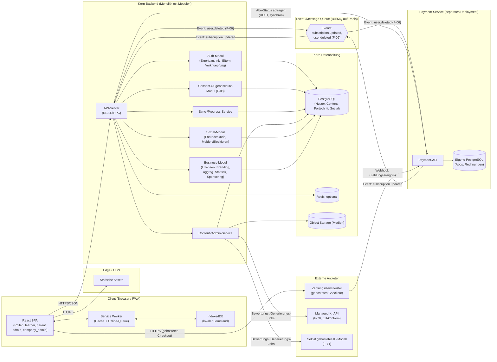
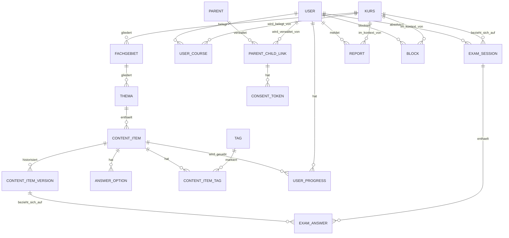

# Architekturplanung: edukedo — Lernplattform für Prüfungsvorbereitung & Wissenserwerb

Version 0.8 · Stand 14.09.2026 · Entwurf zur Abstimmung

> **Update (Version 0.8):** Architektonische Umsetzung der im Anforderungskatalog (Version 0.20, Abschnitt 5.12) neu ergänzten Business-Lizenzen & Sponsoring (F-91–F-94). Zentrale Entscheidung: Die Lizenz koppelt bewusst **nicht** an Premium-Funktionen (F-80/F-81) — ihr einziger Mehrwert ist visuelles Branding (F-92) und aggregierte Statistik (F-93), damit die Investitionshürde für Unternehmen so klein wie möglich bleibt. Dadurch bleibt das Feature **vollständig im Kern-Backend** und benötigt **keine Anbindung an den isolierten Payment-Service** (siehe Abschnitt 1, 8) — ein bewusster Unterschied zum bestehenden B2C-Premium-Modell. Die Abrechnung selbst (geringer, meist pauschaler Betrag) läuft manuell über Rechnung/Überweisung außerhalb des Systems; ein Admin schaltet das Lizenzkontingent danach frei (siehe Abschnitt 4.5, 7, 13). Neu im Datenmodell (Phase-4-Erweiterung, siehe Abschnitt 4.5): `company_account` als eigener Account-Typ analog zu `parent`, `company_invite_code` zur Lizenzvergabe, `user_company_membership` zur Branding-/Statistik-Zuordnung sowie eine vom Lizenzmodell bewusst getrennte `sponsor`-Tabelle für F-94. Entsprechend ergänzt: Abschnitt 3 (Rolle `company_admin`), Abschnitt 7 (neue `/company/*`-Endpunkte, Zugriffskontrolle für aggregierte Statistik), Abschnitt 13 (neue Entscheidungen vom 14.09.2026).
>
> **Update (Version 0.7):** Ergänzung eines Plattform-Hinweises zur Offline-/PWA-Strategie: iOS/Safari weicht in zwei Punkten von Android/Chrome ab — (1) die PWA-Installation läuft ausschließlich manuell über das Safari-Teilen-Menü, es gibt keinen automatischen Installations-Prompt; (2) Safaris Speicherbereinigung (Intelligent Tracking Prevention) kann lokal zwischengespeicherte Daten — inklusive der für den Offline-Modus (F-42) heruntergeladenen Lerninhalte — nach einer gewissen Zeit ohne Nutzung löschen. Da „auch offline zuverlässig verfügbar" ein Kernversprechen von edukedo ist, wird dies als expliziter Test- und Beobachtungspunkt in Abschnitt 5 und Abschnitt 10 aufgenommen, mit einer möglichen Re-Sync-/Warnmechanik als Mitigation; noch keine abschließende architektonische Entscheidung, siehe Abschnitt 13.
>
> **Update (Version 0.6):** Ergebnis eines Entwickler-Reviews von Architekturplanung und Entwicklungsplan. Vier konkrete Schärfungen am Datenmodell/Konzept: (1) **`exam_answer`** referenziert jetzt `content_item_version_id` statt `content_item_id` — analog zum Duell (F-61) zeigt eine Prüfungsauswertung damit immer exakt den Wortlaut, der tatsächlich gestellt wurde, auch wenn der Content-Editor die Frage später korrigiert. Voraussetzung dafür: **`content_item_version`** wird ab sofort ausdrücklich bereits bei der *Erstellung* eines `content_item` angelegt (Version 1), nicht erst bei der ersten Bearbeitung. (2) **`answer_option`** erhält ein neues `side`-Feld (nur für `zuordnung`), das explizit macht, welcher der beiden Paar-Partner die „linke" bzw. „rechte" Seite ist — vorher trug nur `group_key` die Paar-Zugehörigkeit, ohne die Seite festzulegen. (3) Klargestellt: Die Selbstlöschung des eigenen Kontos (F-06) ist unabhängig vom Payment-Service bereits ab den ersten echten Nutzerkonten nötig, nicht erst mit Phase 4 (siehe Abschnitt 8). (4) Redaktionelle Klarstellung zu `report`/`block`: Diese gehören bewusst in dieselbe erste Migrations-Charge wie das übrige Phase-1-Schema (siehe Abschnitt 4.4, „Nächste Schritte").
>
> **Update (Version 0.5):** Abschnitt 4 (Datenmodell) grundlegend vertieft — von einer knappen ERD-Skizze zu einem soliden, flexiblen Schema mit tatsächlicher SQL-Schreibweise, expliziten Constraints/Indizes und dokumentiertem Löschverhalten je Tabelle. Wichtigste neue Elemente (alle am 12.09.2026 entschieden): **`content_item_version`** führt eine echte Versionshistorie statt einer reinen Versionsnummer ein (Grundlage für exakte Duell-Snapshots in Phase 4); **`content_item.payload`** (JSONB, typspezifisch) ergänzt die bisher nur für Multiple-Choice passende `answer_option`-Tabelle um Lückentext, Kurzantwort und Fallaufgaben, ohne für jeden Fragetyp eine eigene Tabelle zu benötigen; ein neues, kursübergreifendes **`tag`/`content_item_tag`**-System ergänzt die hierarchische Einordnung um freies Verschlagworten (F-13/F-14); `kurs.locale` bereitet F-52 vor, ohne jetzt schon eine Übersetzungstabelle zu bauen; fehlende Unique-Constraints (u. a. keine doppelte Kursbelegung, genau ein Fortschritts-Datensatz je Content-Item) wurden ergänzt; das kaskadierende Löschverhalten für F-06 ist jetzt je Tabelle explizit festgelegt statt nur allgemein beschrieben.
>
> **Update (Version 0.4):** Namensübernahme: Die Plattform heißt **edukedo** (siehe Anforderungskatalog Abschnitt 1, Version 0.19); rein redaktionelle Änderung ohne architektonische Konsequenz. Referenz auf den Anforderungskatalog von Version 0.17 auf die aktuelle Version 0.19 aktualisiert.
>
> **Update (Version 0.3):** Die verbliebenen offenen Architekturentscheidungen aus Abschnitt 13 (v0.2) wurden geklärt: (1) Die Kern-API nutzt **tRPC**. (2) Die Karteikarten-Logik (F-20) implementiert **direkt FSRS** statt mit SM-2 zu starten — das Datenmodell für `USER_PROGRESS` wurde entsprechend auf FSRS-Felder umgestellt. (3) Die konkrete Infrastruktur für das selbst gehostete KI-Modell (F-71/F-72) wird bewusst zurückgestellt und erst kurz vor Phase 4 entschieden. (4) Die Kommunikation zwischen Kern-Backend und Payment-Service wird um eine **Event-/Message-Queue** ergänzt (zusätzlich zu synchronen Statusabfragen und dem Zahlungsdienstleister-Webhook), damit Statusänderungen ohne Polling ankommen. (5) Der Payment-Service bleibt **im Monorepo** als eigenes App-Paket. (6) Der Melde-Workflow (F-68, Phase 4) wird als **einfache Zusatzansicht im bestehenden Admin-/Redaktionsbereich** umgesetzt, nicht als eigene Moderationsoberfläche.
>
> **Update (Version 0.2):** Grundlegend überarbeitet, um dem inzwischen stark erweiterten Anforderungskatalog (Version 0.17) zu entsprechen — insbesondere der strategischen Neuausrichtung als generische Multi-Kurs-Plattform (statt reiner Fachwirt-App), der Mehrfach-Kursbelegung (F-09), den Alters-/Jugendschutz- und Eltern-Anforderungen (F-08, F-90, F-53), der Isolierung des Zahlungsmoduls (N-11) sowie der neuen Melde-/Blockierfunktion (F-68). Wichtigste architektonische Entscheidungen dieser Version (alle am 12.09.2026 getroffen): Payment wird als vollständig separater Service mit eigener Datenbank betrieben — stärkere Isolation als ursprünglich vorgesehen; Auth wird komplett selbst gebaut statt Managed Auth zu nutzen, um die Eltern-Kind-Verknüpfung sauber abzubilden; das Eltern-Dashboard erhält einen eigenen, vollwertigen Account-Typ; das Datenmodell für Melden/Blockieren (F-68) wird bereits in Phase 1 mitgebaut, obwohl die Funktion selbst erst in Phase 4 aktiv wird.

Basiert auf dem Anforderungskatalog Version 0.19 (siehe separates Dokument, insbesondere Abschnitt 4 für das generische Content-Modell und Abschnitt 10 für alle „für die Architekturplanung" markierten Entscheidungen). Rahmenbedingungen: Web-App mit PWA-Fähigkeit, Backend mit Nutzerkonten und geräteübergreifender Synchronisierung, generisches Multi-Kurs-Modell von Anfang an, gestaffelter statt vollständiger Content-Umfang zum Start, zwei parallel startende Kurse (Fachwirt-Pilot + Schulfach-Kurs), Solo-/Kleinprojekt mit Wunsch nach niedrigen Betriebskosten und späterer Skalierbarkeit.

## 1. Leitprinzipien für die Architektur

- **Einfachheit vor Vollständigkeit, mit einer bewussten Ausnahme:** Der Kernbereich (Auth, Content, Sync/Progress, Sozial-/Gamification-Funktionen) bleibt ein Monolith mit klarer innerer Modulstruktur — weniger Betriebsaufwand, schnellere Entwicklung für eine Einzelperson. **Payment weicht davon ab und wird von Anfang an als eigener, vollständig getrennter Service mit eigener Datenbank betrieben** (siehe Abschnitt 8): Die stärkere Isolation wiegt hier den zusätzlichen Betriebsaufwand auf, weil ein Sicherheitsvorfall im Kernsystem so nicht automatisch auch Zahlungsdaten betrifft.
- **Content ist Daten, nicht Code — jetzt für beliebige Kurse:** Das generische Content-Modell (Kurs → Fachgebiet → Thema → Lerneinheit, siehe Anforderungskatalog Abschnitt 4) bedeutet, dass sowohl der Fachwirt-Pilot als auch der neue Schulfach-Kurs über dieselben Tabellen abgebildet werden, ohne Schemaänderung (siehe Abschnitt 4 dieses Dokuments).
- **Offline-first, wo es zählt:** Die individuellen Lernmodi (Karteikarten, Quiz, Übungssets) müssen auch mit wackliger Verbindung funktionieren; die sozialen Features (Duelle, Highscore, Lernpartner-Vermittlung) setzen ausdrücklich eine Online-Verbindung voraus (siehe F-42).
- **Datenmodell für Vertrauen/Jugendschutz früh anlegen, Funktion später aktivieren:** Analog zum bereits im Anforderungskatalog verankerten Vorgehen bei F-08 wird auch das Datenmodell für die Melde-/Blockierfunktion (F-68) schon in Phase 1 mitgebaut, obwohl die Funktion selbst erst mit den sozialen Features in Phase 4 live geht — vermeidet eine Schema-Änderung an einer dann bereits produktiven Datenbank mit echten Nutzerdaten.
- **Niedrige Einstiegskosten, klarer Wachstumspfad:** Start auf Hobby-/Free-Tiers, aber ohne Architekturentscheidungen, die einen späteren Umzug erzwingen.

## 2. Technologie-Empfehlung im Überblick

| Bereich | Empfehlung | Begründung |
|---|---|---|
| Frontend | React + TypeScript, Vite als Build-Tool | Größtes Ökosystem, gute PWA-Unterstützung, gut geeignet für interaktive Quiz-/Karteikarten-UI sowie für die rollenbasierten Ansichten (learner, parent, admin, **company_admin**, ergänzt 14.09.2026; `content_editor` mit F-117 am 22.09.2026 wieder entfernt) |
| Styling/UI | Tailwind CSS + shadcn/ui-Komponenten | Schnelles, konsistentes UI ohne viel Custom-CSS |
| State/Data-Fetching | TanStack Query | Sauberes Caching und Sync von Server-Daten, wichtig für Offline/Sync-Logik |
| PWA/Offline | Vite PWA Plugin (Workbox) + IndexedDB (über Dexie.js) | Service-Worker-Caching für Assets, IndexedDB für Offline-Lernstand-Queue |
| Kern-Backend | **Node.js + TypeScript, Fastify** (entschieden am 12.09.2026, siehe Abschnitt 13) | Eine Sprache im gesamten Stack senkt Kontextwechsel-Kosten für eine Einzelperson; Fastify hat einen offiziellen tRPC-Adapter und weniger Boilerplate als NestJS für eine Einzelperson |
| Auth | **Eigenbau, im Kern-Backend, nach dem Lucia-Pattern** (entschieden am 12.09.2026, siehe Abschnitt 13) | Volle Kontrolle über Altersabfrage, Eltern-Verknüpfung (F-08) und einen eigenen Eltern-Account-Typ (F-90) — Managed-Auth-Anbieter (Supabase Auth/Clerk) unterstützen diese Eltern-Kind-Beziehung nicht nativ. Argon2id-Hashing plus signierte, httpOnly-Session-Cookies nach dem Lucia-Pattern (Sessions-Tabelle mit gehashtem Token, siehe Abschnitt 13) — Lucia selbst ist als Bibliothek inzwischen archiviert/deprecated, daher wird nur das Pattern übernommen, nicht die Bibliothek als Dependency eingebunden |
| Payment-Service | **Eigener Service, eigene Datenbank, eigenes Deployment** (entschieden am 12.09.2026) | Vollständige Isolation von Zahlungsdaten gegenüber dem Kernsystem (siehe Abschnitt 8); kommuniziert mit dem Kern-Backend nur über eine schmale, versionierte REST-API |
| API-Stil (Kern) | **tRPC** (entschieden am 12.09.2026) | Spart Boilerplate bei TS-Frontend+Backend im selben Monorepo; native Apps/Drittanbieter-Clients sind laut Anforderungskatalog ohnehin out of scope (Abschnitt 8) |
| API-Stil (Kern ↔ Payment) | REST/HTTPS für synchrone Statusabfragen, **plus Event-/Message-Queue** für asynchrone Statusänderungen (entschieden am 12.09.2026); Zahlungsdienstleister → Payment-Service weiterhin per Webhook | Zwei getrennte Services kommunizieren über einen stabilen, sprachunabhängigen Vertrag statt über TS-spezifische RPC-Mechanismen; die Queue liefert Statusänderungen (z. B. Premium-Freischaltung) ohne Polling an den Kern |
| Datenbank (Kern) | PostgreSQL (verwaltet, z. B. Neon oder Supabase) | Relational passt gut zu den strukturierten Beziehungen des generischen Content-Modells (Kurs → Fachgebiet → Thema → Content-Item → Fortschritt) |
| Datenbank (Payment) | Eigene PostgreSQL-Instanz (separates Neon-/Supabase-Projekt oder eigener Anbieter) | Physische statt nur logischer Trennung — konsistent mit der Entscheidung für einen vollständig separaten Service |
| ORM | **Drizzle ORM** (für den Kern entschieden am 12.09.2026, siehe Abschnitt 13; für Payment weiterhin unabhängig wählbar) | Typsichere Queries, SQL-nahe Migrationsverwaltung, die sich direkt am bereits als reinem SQL-DDL dokumentierten Schema (Abschnitt 4.3) orientiert; Kern und Payment teilen sich bewusst keine ORM-Modelle |
| Caching/Sessions | Redis (optional, erst bei Bedarf) | Session-Storage, Rate-Limiting (u. a. für Login und Einladungscodes, F-63); für MVP ggf. verzichtbar |
| Message-Queue (Kern ↔ Payment) | **BullMQ auf Redis** (empfohlen, konsistent mit dem ohnehin vorgesehenen Redis) | Kein zusätzlicher Infrastruktur-Anbieter nötig; deckt den entschiedenen Bedarf an asynchronen Statusänderungen ab. Alternative (z. B. ein Cloud-Messaging-Dienst wie SNS/SQS) bleibt möglich, falls Redis aus anderen Gründen entfällt |
| Objekt-/Medienspeicher | S3-kompatibel (z. B. Cloudflare R2) | Für Bilder/Diagramme in Lerninhalten |
| Hosting Frontend | Vercel oder Cloudflare Pages | Kostengünstiger Einstieg, automatisches Deployment aus Git, CDN inklusive |
| Hosting Kern-Backend + DB | Railway, Render oder Fly.io (+ Neon/Supabase für DB) | Einfaches Deployment, günstige Einstiegstarife |
| Hosting Payment-Service + DB | Eigenes, vom Kernsystem getrenntes Projekt/Environment beim selben oder einem anderen Anbieter | Eigene Zugriffskontrolle, eigene Umgebungsvariablen/Secrets — organisatorisch und physisch getrennt vom Kernsystem |
| Monorepo-Tooling | pnpm Workspaces + Turborepo, Payment-Service als eigenes App-Paket | Weiterhin ein Repository für einfachere Entwicklung als Solo-Person, aber unabhängig deploybar und ohne gemeinsamen DB-Zugriff |
| CI/CD | GitHub Actions, getrennte Deploy-Pipelines für Kern und Payment | Kostenlos für kleine Projekte; getrennte Pipelines verhindern, dass ein Fehler im einen Bereich versehentlich den anderen mit deployt |

**Alternative, falls du lieber mit Python arbeitest:** Backend mit FastAPI + SQLAlchemy statt Node/TypeScript; das restliche Konzept (PostgreSQL, REST/OpenAPI, Hosting, getrennter Payment-Service) bleibt gültig.

## 3. Systemarchitektur (Überblick)


```mermaid
flowchart LR
    subgraph Client["Client (Browser / PWA)"]
        UI["React SPA\n(Rollen: learner, parent,\nadmin, company_admin)"]
        SW["Service Worker\n(Cache + Offline-Queue)"]
        IDB["IndexedDB\n(lokaler Lernstand)"]
    end

    subgraph Edge["Edge / CDN"]
        CDN["Statische Assets"]
    end

    subgraph Core["Kern-Backend (Monolith mit Modulen)"]
        API["API-Server\n(REST/tRPC)"]
        AuthSvc["Auth-Modul\n(Eigenbau, inkl. Eltern-Verknuepfung)"]
        ConsentSvc["Consent-/Jugendschutz-Modul (F-08)"]
        SyncSvc["Sync-/Progress-Service"]
        ContentSvc["Content-/Admin-Service"]
        SocialSvc["Sozial-Modul\n(Freundeskreis, Melden/Blockieren)"]
        CompanySvc["Business-Modul\n(Lizenzen, Branding,\naggreg. Statistik, Sponsoring)"]
    end

    subgraph CoreData["Kern-Datenhaltung"]
        PG[("PostgreSQL\n(Nutzer, Content, Fortschritt, Sozial)")]
        Redis[("Redis, optional")]
        S3[("Object Storage (Medien)")]
    end

    subgraph PaySys["Payment-Service (separates Deployment)"]
        PaySvc["Payment-API"]
        PayDB[("Eigene PostgreSQL\n(Abos, Rechnungen)")]
    end

    subgraph Queue["Event-/Message-Queue (BullMQ auf Redis)"]
        MQ{{"Events:\nsubscription.updated,\nuser.deleted (F-06)"}}
    end

    subgraph External["Externe Anbieter"]
        PSP["Zahlungsdienstleister\n(gehostetes Checkout)"]
        AIManaged["Managed KI-API\n(F-70, EU-konform)"]
        AISelf["Selbst gehostetes KI-Modell\n(F-71)"]
    end

    UI <--> SW
    SW <--> IDB
    UI -- "HTTPS" --> CDN
    UI -- "HTTPS/JSON" --> API
    UI -- "HTTPS (gehostetes Checkout)" --> PSP
    API -- "Event: user.deleted (F-06)" --> MQ
    MQ -- "Event: subscription.updated" --> API
    PaySvc -- "Event: subscription.updated" --> MQ
    MQ -- "Event: user.deleted (F-06)" --> PaySvc
    API --> AuthSvc
    API --> ConsentSvc
    API --> SyncSvc
    API --> ContentSvc
    API --> SocialSvc
    API --> CompanySvc
    AuthSvc --> PG
    ConsentSvc --> PG
    SyncSvc --> PG
    ContentSvc --> PG
    SocialSvc --> PG
    CompanySvc --> PG
    API --> Redis
    ContentSvc --> S3
    API -- "Abo-Status abfragen (REST, synchron)" --> PaySvc
    PaySvc --> PayDB
    PSP -- "Webhook (Zahlungsereignis)" --> PaySvc
    ContentSvc -- "Bewertungs-/Generierungs-Jobs" --> AIManaged
    ContentSvc -- "Bewertungs-/Generierungs-Jobs" --> AISelf
```

Der Kern-Backend-„Monolith" bleibt intern modular (Auth, Consent, Content, Sync/Progress, Sozial, **Business (Lizenzen/Branding/Sponsoring, ergänzt 14.09.2026)** als getrennte Module/Ordner), damit einzelne Teile bei Bedarf später als eigene Services herausgelöst werden können. Das neue Business-Modul (F-91–F-94) ist bewusst ein gewöhnliches Kern-Modul wie die übrigen — **kein** Anschluss an den separaten Payment-Service, weil die Lizenz keine Premium-Freischaltung auslöst (siehe Update Version 0.8, Abschnitt 13). Payment ist die eine bewusste Ausnahme von diesem Monolith-Prinzip (siehe Abschnitt 1, 8): Frontend und Nutzer:innen interagieren dort, wo möglich, direkt mit dem gehosteten Checkout des Zahlungsdienstleisters, damit möglichst wenig Zahlungsdaten überhaupt die eigene Infrastruktur berühren (siehe F-81). **Kern und Payment-Service kommunizieren über zwei Kanäle (entschieden am 12.09.2026):** synchrone REST-Statusabfragen für den unmittelbaren Bedarf (z. B. beim Login prüfen, ob Premium aktiv ist) und eine Event-/Message-Queue für asynchrone Statusänderungen (z. B. eine neue Zahlung schaltet Premium frei, ohne dass der Kern dafür pollen müsste) sowie für die umgekehrte Richtung (der Kern meldet eine Konto-Löschung nach F-06 an den Payment-Service, damit dieser seine eigenen Daten ebenfalls bereinigt).

## 4. Datenmodell (Kernentitäten, Stand Phase 1)

**Überarbeitet und deutlich vertieft am 12.09.2026** (vorherige Fassung: knappe ERD-Skizze; siehe Abschnitt 13 für die dabei getroffenen Entscheidungen). Ziel dieser Überarbeitung: ein Schema, das sowohl **solide** ist (referenzielle Integrität, sinnvolle Constraints/Indizes, sauberer Umgang mit Löschungen und Versionierung) als auch **flexibel** bleibt (neue Kurstypen, Content-Formate und Sprachen ohne Breaking-Change am Schema).

### 4.1 Designprinzipien

- **Hybrid relational/JSONB, je nach Vorhersagbarkeit der Struktur:** Wo die Struktur stabil und häufig strukturiert abgefragt wird (Kurs-Hierarchie, Multiple-Choice-Optionen, Fortschritt), bleibt das Modell relational mit echten Spalten/Fremdschlüsseln. Wo die Struktur je nach Content-Typ oder Kurstyp variiert (Lückentext-Lücken, Fallaufgaben-Teilschritte, kurstypspezifische Zusatzattribute), übernimmt ein `payload`/`metadata`-JSONB-Feld die Flexibilität — validiert nicht durch die Datenbank, sondern per Zod-Schema auf Anwendungsebene (siehe Abschnitt 7), pro `type`-Wert unterschiedlich. Das vermeidet sowohl ein „JSONB für alles" (nichts mehr abfragbar/indexierbar) als auch ein „eigene Tabelle pro Content-Typ" (Schema-Änderung bei jedem neuen Fragetyp, widerspricht N-05).
- **Versionierung statt Hard-Delete bei Content:** `CONTENT_ITEM` wird bei Bearbeitung nicht überschrieben, sondern über `CONTENT_ITEM_VERSION` historisiert (setzt F-12 konkret um). Das ist zugleich die solide Grundlage für den beim Duell (F-61, Phase 4) geforderten Content-Snapshot sowie — seit Version 0.6 — für Prüfungsantworten (`EXAM_ANSWER`, siehe unten): Beide referenzieren eine konkrete `content_item_version_id`, nicht nur eine veränderliche Versionsnummer. **Wichtig:** `CONTENT_ITEM_VERSION` wird deshalb nicht erst bei der ersten Bearbeitung angelegt, sondern bereits beim Erstellen eines `CONTENT_ITEM` (Version 1) — sonst gäbe es für ein brandneues Content-Item keine Version, auf die eine frühe Prüfungsantwort oder ein frühes Duell verweisen könnte.
- **Explizite Unique-Constraints gegen unmögliche Zustände:** z. B. genau ein `USER_PROGRESS`-Datensatz je (`user_id`, `content_item_id`), keine doppelte Kursbelegung in `USER_COURSE` — im Vorgängerentwurf nicht explizit, hier nachgezogen.
- **Löschverhalten pro Tabelle bewusst festgelegt statt nur in Prosa beschrieben:** F-06 (Konto-/Datenlöschung) verlangt kaskadierendes Löschen; welche Fremdschlüssel `CASCADE`, `SET NULL` oder `RESTRICT` auslösen, ist unten je Tabelle vermerkt statt nur allgemein postuliert. Die **Selbstlöschung des eigenen Kontos ist dabei unabhängig vom Payment-Service** bereits ab den allerersten echten Nutzerkonten nötig (nicht erst mit Phase 4/Payment) — siehe Abschnitt 8.
- **Freies Verschlagworten quer zur Kurs-Hierarchie:** Eine neue `TAG`/`CONTENT_ITEM_TAG`-Verknüpfung ergänzt F-13/F-14 um kursübergreifende, frei vergebbare Schlagworte (z. B. „Prüfungsrelevant", „Wiederholung empfohlen") — unabhängig von Kurs/Fachgebiet/Thema und damit flexibler als eine rein hierarchische Einordnung.
- **Eindeutige Seitenzuordnung bei Zuordnungs-Paaren:** `ANSWER_OPTION` erhält (seit Version 0.6) neben `group_key` ein `side`-Feld, das bei `type = 'zuordnung'` explizit festlegt, ob eine Option die linke oder rechte Seite eines Paares ist — vorher war das nur implizit über Anwendungskonvention lösbar.
- **Mehrsprachigkeit vorbereitet, ohne sie jetzt zu bauen (F-52):** `KURS.locale` (Default `de`) hält fest, in welcher Sprache ein Kurs geführt wird. Weitere Sprachen kämen additiv über eine spätere `CONTENT_ITEM_TRANSLATION`-Tabelle hinzu, ohne bestehende Spalten zu verändern — im Phase-1-Schema bewusst noch nicht angelegt (kein aktueller Bedarf, siehe F-52 Priorität „Kann").

### 4.2 ER-Diagramm (Überblick, Phase 1)


```mermaid
erDiagram
    KURS ||--o{ FACHGEBIET : gliedert
    FACHGEBIET ||--o{ THEMA : gliedert
    THEMA ||--o{ CONTENT_ITEM : enthaelt
    CONTENT_ITEM ||--o{ CONTENT_ITEM_VERSION : historisiert
    CONTENT_ITEM ||--o{ ANSWER_OPTION : hat
    CONTENT_ITEM ||--o{ CONTENT_ITEM_TAG : hat
    TAG ||--o{ CONTENT_ITEM_TAG : markiert
    CONTENT_ITEM ||--o{ USER_PROGRESS : wird_geuebt
    CONTENT_ITEM_VERSION ||--o{ EXAM_ANSWER : bezieht_sich_auf
    USER ||--o{ USER_COURSE : belegt
    KURS ||--o{ USER_COURSE : wird_belegt_von
    USER ||--o{ USER_PROGRESS : hat
    USER ||--o{ EXAM_SESSION : absolviert
    KURS ||--o{ EXAM_SESSION : bezieht_sich_auf
    EXAM_SESSION ||--o{ EXAM_ANSWER : enthaelt
    PARENT ||--o{ PARENT_CHILD_LINK : verwaltet
    USER ||--o{ PARENT_CHILD_LINK : wird_verwaltet_von
    PARENT_CHILD_LINK ||--o{ CONSENT_TOKEN : hat
    USER ||--o{ REPORT : meldet
    USER ||--o{ BLOCK : blockiert
    KURS ||--o{ REPORT : im_kontext_von
    KURS ||--o{ BLOCK : im_kontext_von
```

### 4.3 Tabellenschema (Phase 1)

Tabellen-/Spaltennamen hier bereits in der tatsächlichen SQL-Schreibweise (`snake_case`), passend zu Drizzle/Prisma. `references(...)` zeigt jeweils den Fremdschlüssel samt Lösch-/Änderungsverhalten.

**Content-Hierarchie**

```sql
kurs (
  id            uuid primary key default gen_random_uuid(),
  slug          text not null unique,                 -- z.B. "fachwirt-buero-projektorganisation", "mathematik-9-bundeslandneutral"
  type          text not null,                          -- "fachwirt" | "schulfach" | ... (offen für weitere Typen, F-13/N-05)
  title         text not null,
  locale        char(5) not null default 'de',          -- Vorbereitung F-52, siehe 4.1
  metadata      jsonb not null default '{}',             -- z.B. Klassenstufe, Bundesland-Ansatz (F-13)
  target_mode   text not null default 'einzeltermin',   -- "einzeltermin" | "wochenziel" (F-35)
  is_published  boolean not null default false,
  created_at    timestamptz not null default now(),
  updated_at    timestamptz not null default now()
);

fachgebiet (
  id          uuid primary key default gen_random_uuid(),
  kurs_id     uuid not null references kurs(id) on delete cascade,
  code        text not null,                            -- z.B. "HB1", "algebra"
  title       text not null,
  sort_order  int not null default 0,
  metadata    jsonb not null default '{}',
  unique (kurs_id, code)
);
create index on fachgebiet (kurs_id, sort_order);

thema (
  id             uuid primary key default gen_random_uuid(),
  fachgebiet_id  uuid not null references fachgebiet(id) on delete cascade,
  title          text not null,
  sort_order     int not null default 0
);
create index on thema (fachgebiet_id, sort_order);
```

**Content-Items — relational, wo stabil, JSONB, wo variabel**

```sql
content_item (
  id               uuid primary key default gen_random_uuid(),
  thema_id         uuid not null references thema(id) on delete cascade,
  type             text not null,          -- "theorie" | "karteikarte" | "quiz_mc" | "zuordnung" | "luecken" | "kurzantwort" | "fallaufgabe"
  prompt           text not null,           -- Frage/Vorderseite/Aufgabentext, je nach type
  explanation      text,                    -- Erklärung/Rückseite/Musterlösung, je nach type
  payload          jsonb not null default '{}', -- typspezifische Struktur, siehe unten
  difficulty       text not null default 'mittel', -- "leicht" | "mittel" | "schwer"
  is_premium       boolean not null default false,   -- F-80
  is_active        boolean not null default true,    -- Soft-Delete statt Hard-Delete: alte Fortschritts-/Prüfungsdaten bleiben referenzierbar
  current_version  int not null default 1,
  created_by       uuid references "user"(id) on delete set null,
  created_at       timestamptz not null default now(),
  updated_at       timestamptz not null default now()
);
create index on content_item (thema_id) where is_active;

-- Historie zu jeder inhaltlichen Änderung (F-12), Grundlage für Duell- (F-61) und Pruefungs-Snapshots (EXAM_ANSWER).
-- Wird bereits beim Erstellen eines content_item als Version 1 angelegt, nicht erst bei der ersten Bearbeitung (siehe 4.1).
content_item_version (
  id               uuid primary key default gen_random_uuid(),
  content_item_id  uuid not null references content_item(id) on delete cascade,
  version_number   int not null,
  prompt           text not null,
  explanation      text,
  payload          jsonb not null,
  changed_by       uuid references "user"(id) on delete set null,
  change_note      text,
  created_at       timestamptz not null default now(),
  unique (content_item_id, version_number)
);

-- Nur für type IN ('quiz_mc', 'zuordnung'). Bei quiz_mc bleiben group_key/side leer, is_correct traegt die Bewertung.
-- Bei zuordnung tragen genau zwei Zeilen denselben group_key mit unterschiedlichem side-Wert ("links"/"rechts") -
-- side macht explizit, welcher Paar-Partner auf welcher Seite der Zuordnungs-UI erscheint (seit Version 0.6).
answer_option (
  id                uuid primary key default gen_random_uuid(),
  content_item_id   uuid not null references content_item(id) on delete cascade,
  group_key         text,               -- nur Zuordnung: verknüpft zusammengehörige Paare
  side              text,               -- nur Zuordnung: "links" | "rechts"
  text              text not null,
  is_correct        boolean not null default false,
  sort_order        int not null default 0
);
create index on answer_option (content_item_id);

-- Freies, kursübergreifendes Verschlagworten (F-13/F-14), unabhängig von der Kurs-Hierarchie
tag (
  id    uuid primary key default gen_random_uuid(),
  name  text not null unique
);

content_item_tag (
  content_item_id  uuid not null references content_item(id) on delete cascade,
  tag_id           uuid not null references tag(id) on delete cascade,
  primary key (content_item_id, tag_id)
);
```

**Payload-Struktur je `content_item.type` (auf Anwendungsebene per Zod validiert, nicht in der DB erzwungen):**

| `type` | `payload`-Inhalt (Beispiel) |
|---|---|
| `theorie` | `{ "body_markdown": "...", "images": ["..."] }` |
| `karteikarte` | `{}` (Vorder-/Rückseite genügen `prompt`/`explanation`) |
| `quiz_mc` | `{}` (Optionen liegen in `answer_option`) |
| `zuordnung` | `{}` (Paare liegen in `answer_option` über `group_key`/`side`) |
| `luecken` | `{ "text_with_blanks": "...", "blanks": [{"id": "1", "accepted": ["..."]}] }` |
| `kurzantwort` | `{ "accepted_answers": ["..."], "match_mode": "exact\|contains" }` |
| `fallaufgabe` | `{ "parts": [{"prompt": "...", "points": 5}] }` |

**Nutzerkonten & Kursbelegung**

```sql
"user" (
  id                 uuid primary key default gen_random_uuid(),
  email              citext not null unique,           -- benoetigt Postgres-Extension "citext", siehe Abschnitt 9
  password_hash      text not null,
  birth_date         date,
  is_minor           boolean not null,   -- bei Registrierung aus birth_date abgeleitet und persistiert (F-08, N-13)
  email_verified_at  timestamptz,
  created_at         timestamptz not null default now(),
  updated_at         timestamptz not null default now()
);

-- n:m Nutzerkonto <-> Kurs (F-09), von Anfang an eigene Verknüpfungstabelle
user_course (
  id                 uuid primary key default gen_random_uuid(),
  user_id            uuid not null references "user"(id) on delete cascade,
  kurs_id            uuid not null references kurs(id) on delete cascade,
  target_date        date,
  plan_start_date    date,
  weekly_goal_items  int,       -- nur bei target_mode 'wochenziel' genutzt (F-35)
  joined_at          timestamptz not null default now(),
  unique (user_id, kurs_id)   -- verhindert Doppel-Belegung desselben Kurses
);
```

**Fortschritt & Prüfungssimulation**

```sql
user_progress (
  id               uuid primary key default gen_random_uuid(),
  user_id          uuid not null references "user"(id) on delete cascade,
  content_item_id  uuid not null references content_item(id) on delete cascade,
  difficulty       real not null,        -- FSRS-Parameter
  stability        real not null,        -- FSRS-Parameter
  state            text not null,        -- "new" | "learning" | "review" | "relearning"
  due_at           timestamptz not null,
  last_reviewed_at timestamptz,
  last_result      text,                 -- "gewusst" | "unsicher" | "nicht_gewusst"
  reps             int not null default 0,
  lapses           int not null default 0,
  unique (user_id, content_item_id)      -- genau ein Fortschritts-Datensatz je Nutzer:in und Content-Item
);
create index on user_progress (user_id, due_at);   -- zentrale Abfrage für F-20/F-27: "welche Karten sind fällig"

exam_session (
  id           uuid primary key default gen_random_uuid(),
  user_id      uuid not null references "user"(id) on delete cascade,
  kurs_id      uuid not null references kurs(id) on delete cascade,
  mode         text not null,     -- "quiz" | "schriftliche_simulation" | "praesentation" | "fachgespraech"
  started_at   timestamptz not null default now(),
  finished_at  timestamptz,
  score        real
);
create index on exam_session (user_id, kurs_id);

-- Seit Version 0.6: referenziert content_item_version_id statt content_item_id, analog zum Duell (F-61) -
-- eine Pruefungsauswertung zeigt damit immer den Wortlaut, der zum Pruefungszeitpunkt tatsaechlich galt,
-- auch wenn die Frage danach redaktionell korrigiert wurde.
exam_answer (
  id                       uuid primary key default gen_random_uuid(),
  exam_session_id          uuid not null references exam_session(id) on delete cascade,
  content_item_version_id  uuid not null references content_item_version(id) on delete restrict, -- Pruefungsantworten bleiben auch bei (seltenem) Content-Hard-Delete auswertbar
  given_answer             jsonb not null,   -- Struktur variiert wie beim payload je nach content_item.type
  is_correct               boolean,
  points                   real
);
create index on exam_answer (exam_session_id);
```

**Eltern-/Jugendschutz (F-08, F-90)**

```sql
parent (
  id             uuid primary key default gen_random_uuid(),
  email          citext not null unique,
  password_hash  text not null,
  created_at     timestamptz not null default now()
);

parent_child_link (
  id              uuid primary key default gen_random_uuid(),
  parent_id       uuid not null references parent(id) on delete cascade,
  user_id         uuid not null references "user"(id) on delete cascade,
  consent_status  text not null default 'pending',  -- "pending" | "confirmed" | "revoked"
  consented_at    timestamptz,
  revoked_at      timestamptz,
  unique (parent_id, user_id)
);

consent_token (
  id                     uuid primary key default gen_random_uuid(),
  parent_child_link_id   uuid not null references parent_child_link(id) on delete cascade,
  token_hash             text not null unique,
  expires_at             timestamptz not null,
  used_at                timestamptz,
  reminder_sent_count    int not null default 0
);
create index on consent_token (expires_at);  -- für Erinnerungs-/Aufräum-Jobs
```

**Melden/Blockieren (F-68, Datenmodell bereits in der ersten Migrations-Charge von Phase 1, UI erst Phase 4)**

```sql
report (
  id                 uuid primary key default gen_random_uuid(),
  reporter_user_id   uuid references "user"(id) on delete set null,  -- Meldung bleibt für Moderation bestehen, auch wenn meldende Person das Konto löscht
  reported_user_id   uuid references "user"(id) on delete cascade,   -- betrifft die gemeldete Person direkt -> mit ihr löschen
  kurs_id            uuid not null references kurs(id) on delete cascade,
  reason             text not null,
  status             text not null default 'offen',  -- "offen" | "geprueft" | "abgelehnt"
  created_at         timestamptz not null default now()
);

block (
  id                uuid primary key default gen_random_uuid(),
  user_id           uuid not null references "user"(id) on delete cascade,
  blocked_user_id   uuid not null references "user"(id) on delete cascade,
  kurs_id           uuid not null references kurs(id) on delete cascade,
  created_at        timestamptz not null default now(),
  unique (user_id, blocked_user_id, kurs_id)
);
```

### 4.4 Hinweise

- **KURS/FACHGEBIET/THEMA/CONTENT_ITEM** ersetzen die frühere, fachwirt-spezifische `HANDLUNGSBEREICH`-Tabelle durch das generische Content-Modell aus Anforderungskatalog Abschnitt 4. Der Fachwirt-Pilot und der Schulfach-Kurs sind beides einfach Zeilen in `kurs`, ohne Schemaunterschied — konsistent mit dem dortigen Architektur-Check.
- **`kurs.metadata` (JSONB)** setzt die Entscheidung zu kursspezifischen Zusatzattributen (F-13) um — z. B. Klassenstufe/Bundesland beim Schulfach-Kurs — ohne kurstypspezifische Spalten/Tabellen. `kurs.locale` bereitet F-52 vor, ohne jetzt schon eine Übersetzungstabelle anzulegen. `kurs.is_published` ist zugleich der Schalter, mit dem ein Kurs (z. B. der Mathe-Kurs, siehe Abschnitt 8) erst dann für echte Nutzer:innen sichtbar wird, wenn die dafür nötige Schutzinfrastruktur steht.
- **`user_course`** realisiert die n:m-Beziehung Nutzerkonto↔Kurs (F-09) als eigene Verknüpfungstabelle von Anfang an; der `unique`-Constraint auf (`user_id`, `kurs_id`) verhindert eine versehentliche Doppel-Belegung, die im Vorgängerentwurf nicht ausgeschlossen war.
- **`user.is_minor`** wird bei Registrierung aus `birth_date` abgeleitet und persistiert (statt bei jeder Anfrage neu berechnet), damit Berechtigungsprüfungen (F-66, N-13) und der Ausschluss von Profiling/personalisierter Werbung für Minderjährige (N-01) einfach und konsistent auf dieses eine Feld referenzieren können.
- **`content_item.payload` (JSONB) + `answer_option` (relational)** lösen gemeinsam ab, was im Vorgängerentwurf nur für Multiple-Choice sauber passte: Multiple-Choice und Zuordnung bleiben relational und damit abfragbar/auswertbar (z. B. „welche falsche Antwortoption wird am häufigsten gewählt", relevant für F-16); Lückentext, Kurzantwort und Fallaufgaben nutzen `payload`, weil ihre Struktur zu unterschiedlich ist, um sinnvoll in eigene Spalten/Tabellen zu pressen. Bei Zuordnung macht das neue `side`-Feld (seit Version 0.6) explizit, welche zwei Zeilen mit gleichem `group_key` jeweils die linke bzw. rechte Seite eines Paares sind.
- **`content_item_version`** ist neu (entschieden am 12.09.2026) und macht aus der bisher nur als Zahl geführten Versionierung (F-12) eine echte Historie: Jede inhaltliche Änderung erzeugt einen neuen Versionsdatensatz, statt die alte Fassung zu überschreiben — inklusive Version 1 bereits beim Erstellen des Content-Items (siehe 4.1). Das ist die Voraussetzung dafür, dass sowohl ein Duell (F-61, Phase 4) als auch — seit Version 0.6 — eine abgelegte Prüfungsantwort (`exam_answer`) exakt auf eine bestimmte Content-Fassung verweisen können (`content_item_version_id`) statt nur auf eine veränderliche Versionsnummer.
- **`content_item.is_active`** ersetzt einen harten Löschvorgang für Content: Damit bleiben referenzierte `user_progress`- und `exam_answer`-Datensätze auch dann noch sinnvoll auswertbar, wenn ein Content-Item redaktionell zurückgezogen wird.
- **`tag`/`content_item_tag`** sind neu (entschieden am 12.09.2026) und ergänzen F-13/F-14 um freies, kursübergreifendes Verschlagworten, das nicht an die Kurs-Hierarchie gebunden ist — z. B. ein Tag „Prüfungsrelevant", das sowohl im Fachwirt- als auch im Mathematik-Kurs verwendet werden kann.
- **`parent`, `parent_child_link`, `consent_token`** setzen F-08 und F-90 um: `parent` ist ein eigener, vollwertiger Account-Typ (wie entschieden); `parent_child_link.consent_status` trägt den Einwilligungsstatus inkl. Widerruf (F-90); `consent_token` speichert nur den Hash des Bestätigungslinks (nicht im Klartext) mit Ablaufdatum und einem Zähler für die automatischen Erinnerungsmails.
- **Der Vorschau-Modus (F-08)** ist bewusst nicht Teil dieses Datenmodells: Er wird zustandslos aus dem öffentlichen Content-Bestand bedient, ohne einen `user`-Datensatz oder `user_progress`-Einträge anzulegen — konsistent mit der Vorgabe „keine Speicherung von Fortschritt oder personenbezogenen Daten".
- **`report`/`block`** gehören von Anfang an in dieselbe erste Migrations-Charge wie das übrige Phase-1-Schema (klargestellt in Version 0.6 — vorher stand nur „bereits in Phase 1", ohne den Zeitpunkt innerhalb von Phase 1 eindeutig festzulegen), obwohl die zugehörige Funktion (F-68) erst in Phase 4 zusammen mit den sozialen Features aktiv genutzt wird. Bewusst asymmetrisches Löschverhalten: Löscht die meldende Person ihr Konto, bleibt die Meldung selbst (mit `reporter_user_id = null`) für die Moderationshistorie erhalten; löscht dagegen die gemeldete Person ihr Konto, verliert die Meldung mit ihr ihren Gegenstand und wird mitgelöscht.
- **Löschverhalten (F-06) im Überblick:** Löscht sich ein `user`, kaskadiert das automatisch über `user_course`, `user_progress`, `exam_session` (und darüber `exam_answer`), `parent_child_link` (als Kind) sowie `block`/`report.reported_user_id`; `report.reporter_user_id` wird stattdessen auf `null` gesetzt (siehe oben). `content_item`-Löschungen sind durch `is_active` ohnehin die Ausnahme; falls doch einmal ein Content-Item hart gelöscht wird (was über `content_item_version` kaskadiert), bleiben Prüfungsantworten (`exam_answer`) dank `on delete restrict` auf `content_item_version` geschützt — ein Hard-Delete einer Content-Version mit vorhandenen Prüfungsantworten wird von der Datenbank verweigert, statt still Daten zu verlieren.
- Zahlungsdaten (Abos, Rechnungen) liegen bewusst **nicht** in diesem Datenmodell, sondern in der eigenen Datenbank des Payment-Service (siehe Abschnitt 3, 8) und werden hier nur als Referenz (`user_id`) von außen adressiert.

### 4.5 Phase-4-Erweiterung (Skizze, noch nicht Teil der Phase-1-Migrationen)

Sobald die sozialen Features (F-60–F-65) sowie die Kohorten-/Dozenten-Funktion (F-07, F-64, F-65) gebaut werden, kommen u. a. folgende Tabellen hinzu: `friend_circle_link` (kursbezogen, F-63), `invite_code` (F-63, mit Ablaufdatum/Rate-Limiting), `duel`/`duel_answer` (F-61 — referenziert dank `content_item_version` jetzt sauber eine konkrete Content-Fassung statt nur einer Versionsnummer, analog zu `exam_answer`), `highscore_entry` (F-60), `achievement` (F-67) sowie `cohort`/`cohort_member` (F-64/F-65). `report` und `block` existieren dann bereits und müssen nur noch mit der neuen UI verdrahtet werden.

**Business-Lizenzen & Sponsoring (F-91–F-94, ergänzt 14.09.2026)** — ebenfalls Phase 4 (siehe Anforderungskatalog Abschnitt 9), architektonisch aber bewusst unabhängig vom Payment-Service (siehe Update Version 0.8):

```sql
-- Eigener Account-Typ analog zu "parent" (F-91) — eigenes Login, nicht Teil des "user"-Rollenmodells.
company_account (
  id                 uuid primary key default gen_random_uuid(),
  name               text not null,
  contact_email      citext not null unique,
  password_hash      text not null,
  seat_limit         int not null default 0,        -- Größe des erworbenen Lizenzkontingents
  billing_status     text not null default 'pending', -- "pending" | "active" | "expired" -- manuell durch Admin gepflegt, siehe 4.1-Hinweis unten
  branding_logo_url  text,                            -- F-92: rein visuelles Branding
  branding_color     text,
  branding_headline  text,                            -- z.B. "Ermöglicht durch <Unternehmen>"
  created_at         timestamptz not null default now()
);

-- Lizenzvergabe per Einladungscode (F-91), analog zum invite_code-Konzept für Freundeskreise (F-63).
company_invite_code (
  id                 uuid primary key default gen_random_uuid(),
  company_account_id uuid not null references company_account(id) on delete cascade,
  code               text not null unique,
  expires_at         timestamptz,
  created_at         timestamptz not null default now()
);

-- Verknüpft eine Nutzerin/einen Nutzer mit genau einem Unternehmen (Branding-/Statistik-Zugehörigkeit).
-- Bewusst 1:1 (unique auf user_id) statt n:m, um Branding-Anzeige eindeutig zu halten.
user_company_membership (
  id                 uuid primary key default gen_random_uuid(),
  user_id            uuid not null references "user"(id) on delete cascade,
  company_account_id uuid not null references company_account(id) on delete cascade,
  joined_at          timestamptz not null default now(),
  unique (user_id)
);
create index on user_company_membership (company_account_id);  -- für Sitzplatz-Auslastung (belegt/frei, F-91) und aggregierte Statistik (F-93)

-- Sponsoring (F-94) ist bewusst vom Lizenzmodell getrennt: reine, statische Markenplatzierung ohne
-- Nutzer-Verknüpfung/Tracking (kompatibel mit N-01/N-13 auch im Schulfach-Kurs, siehe Anforderungskatalog 5.12).
sponsor (
  id               uuid primary key default gen_random_uuid(),
  name             text not null,
  logo_url         text,
  attribution_text text not null,          -- z.B. "Ermöglicht durch Unterstützung von XY"
  kurs_id          uuid references kurs(id) on delete cascade,  -- null = plattformweite Platzierung
  is_active        boolean not null default true,
  starts_at        timestamptz,
  ends_at          timestamptz,
  created_at       timestamptz not null default now()
);
```

Hinweise dazu: **Aggregierte Statistik (F-93)** wird bewusst **nicht** als eigene persistente Tabelle geführt, sondern als Query-Ebene über `user_company_membership` (join auf `user_progress`/`exam_session`, gefiltert auf `company_account_id`, ausschließlich aggregiert zurückgegeben — Durchschnittswerte, Prozentanteile). Die entscheidende Absicherung liegt auf API-Ebene (siehe Abschnitt 7): Der `/company/*`-Endpunkt für Statistik darf technisch keine Einzel-Datensätze je Nutzer:in zurückgeben können, aus Beschäftigtendatenschutz-Gründen (§ 26 BDSG, siehe Anforderungskatalog Abschnitt 7). **Löschverhalten:** Löscht sich ein `user`, kaskadiert `user_company_membership` automatisch mit (F-06 bleibt uneingeschränkt gültig, unabhängig vom Unternehmens-Status); löscht sich ein `company_account`, verlieren betroffene Nutzer:innen nur ihre Branding-/Statistik-Zuordnung, nicht ihr eigenes Konto oder ihren Lernfortschritt. **Abrechnung:** `company_account.billing_status` wird manuell von einem Admin gepflegt (Rechnung/Überweisung außerhalb des Systems, siehe Update Version 0.8) — bewusst kein eigenes Rechnungs-/Buchungsmodell, da das Volumen zu Beginn gering und die Abwicklung nicht automatisiert vorgesehen ist.

## 5. Offline-/PWA-Strategie

1. **App-Shell & Assets:** Service Worker cached das UI-Bundle beim ersten Besuch (Workbox „precache").
2. **Content-Vorabladung:** Beim Login bzw. auf Wunsch werden die Lerninhalte des gewählten Kurses/Fachgebiets (statt wie zuvor nur eines Handlungsbereichs) in IndexedDB gespiegelt, sodass Karteikarten/Quiz auch offline funktionieren — unabhängig davon, ob es sich um den Fachwirt-Piloten oder den Schulfach-Kurs handelt.
3. **Offline-Antworten:** Beantwortete Fragen/Karteikarten-Bewertungen werden bei fehlender Verbindung lokal in einer Warteschlange (IndexedDB) gespeichert.
4. **Sync bei Wiederverbindung:** Ein Sync-Service im Kern-Backend nimmt die gepufferten Ereignisse entgegen und spielt sie chronologisch (nach Client-Zeitstempel) über die bestehenden `submitReview`/`recordQuizAttempt`-Pfade nach, statt nur den finalen, clientseitig berechneten Endzustand zu übernehmen (Entscheidung vom 16.09.2026, siehe Abschnitt 13 — löst die ursprünglich hier vorgesehene „last write wins pro Content-Item"-Regel ab, die bei Mehrgeräte-Nutzung eine ganze Lernwiederholung stillschweigend verworfen hätte).
5. **Statusanzeige:** Die UI zeigt sichtbar an, ob gerade offline gearbeitet wird und ob noch nicht synchronisierte Änderungen bestehen.
6. **Ausdrücklich ausgenommen:** Die sozialen Features (Highscore, Duelle, Lernpartner-Vermittlung, Melden/Blockieren) setzen wie entschieden (F-42) eine Online-Verbindung voraus und werden nicht offline gepuffert.
7. **Plattform-Einschränkung iOS/Safari (ergänzt 13.09.2026, noch offener Prüfpunkt):** Anders als Android/Chrome bietet Safari keinen automatischen Installations-Prompt für die PWA — Nutzer:innen müssen die App manuell über „Zum Home-Bildschirm hinzufügen" im Teilen-Menü installieren, was in der Onboarding-Kommunikation berücksichtigt werden sollte. Gravierender: Safaris Speicherbereinigung (Intelligent Tracking Prevention) kann Service-Worker-Cache und IndexedDB-Daten — also genau die für den Offline-Modus vorab geladenen Lerninhalte — löschen, wenn die App über einen gewissen Zeitraum nicht geöffnet wurde. Das muss vor dem Launch auf echten iOS-Geräten verifiziert werden (siehe Abschnitt 10); als Mitigation kommt ein automatischer Re-Sync-Hinweis beim nächsten Online-Öffnen in Frage, falls zwischenzeitlich Inhalte entfernt wurden, statt dass Nutzer:innen unbemerkt mit einer leeren Offline-Kopie dastehen.

## 6. Spaced-Repetition-Algorithmus

**Entschieden am 12.09.2026: FSRS (Free Spaced Repetition Scheduler)** wird direkt implementiert, statt zunächst mit dem einfacheren SM-2 zu starten. FSRS sagt optimale Wiederholungsintervalle genauer voraus (u. a. in Anki seit 2023 Standard), erfordert dafür aber von Anfang an die FSRS-spezifischen Parameter im Datenmodell (`difficulty`, `stability`, `state`, siehe Abschnitt 4) statt des einfacheren SM-2-Modells (`ease_factor`/`interval_days`). Empfohlene Umsetzung: die etablierte Bibliothek **ts-fsrs** (TypeScript-Referenzimplementierung des Algorithmus) statt einer Eigenimplementierung, um Implementierungsfehler bei der Parameter-Optimierung zu vermeiden.

## 7. API-Design-Grundsätze

- **Kern-API:** Klare Trennung nach Modulen: `/auth/*`, `/consent/*` (Eltern-Einwilligungs-Flow, F-08), `/parent/*` (Eltern-Dashboard, F-90), `/courses/*`, `/content/*` (lesend, für Lernende), `/admin/content/*` (schreibend, nur Redaktion/Admin-Rolle), `/progress/*`, `/exam-sessions/*`, `/reports/*` und `/blocks/*` (F-68, Backend ab Phase 1 vorhanden, UI erst Phase 4), sowie neu (Phase 4, ergänzt 14.09.2026) `/company/*` (F-91–F-94: eigenes Login/Session für `company_admin`, Lizenzkontingent-Übersicht inkl. Einladungscodes, Branding-Einstellungen, **ausschließlich aggregierte** Statistik-Endpunkte — bewusst kein Endpunkt, der Einzel-Nutzer-Datensätze je Unternehmen zurückgeben kann, siehe Abschnitt 4.5, 8) und `/sponsors/*` (F-94, lesend für alle Clients, schreibend nur Admin-Rolle).
- Konsequente Eingabevalidierung mit Zod-Schemas, die zwischen Frontend und Kern-Backend geteilt werden (Monorepo-Vorteil) — **bewusst nicht** mit dem Payment-Service geteilt, um dessen Isolation nicht über gemeinsame Typen/Verträge aufzuweichen.
- Autorisierung rollenbasiert: `learner`, `parent`, `admin`, **`company_admin`** (F-91, ergänzt 14.09.2026 — eigener, von `parent` unabhängiger Account-Typ, siehe Abschnitt 4.5). `content_editor` war ursprünglich als dritte `user`-Rolle vorgesehen, wurde aber nie vergeben und mit F-117 (22.09.2026) wieder entfernt, siehe Abschnitt 13. **Korrektur 23.09.2026 (F-07/F-64/F-65, siehe Abschnitt 13):** Die hier ursprünglich vorgesehene Ergänzung um einen vierten Rollenwert `dozent` wurde bei der Umsetzung NICHT so gebaut — "Dozent:in sein" ist inhärent je Kohorte, nicht platformweit, ein Rollenwert hätte das nicht abgebildet. Stattdessen einfache Eigentümerschaft über `cohort.dozent_user_id` (verweist auf dieselbe `user`-Tabelle, kein neuer Rollenwert nötig).
- Versionierung der API von Anfang an einplanen (`/api/v1/...`).
- **Payment-API (separater Service):** Eigene, schmale REST-Schnittstelle, die dem Kern-Backend nur das Nötigste preisgibt (z. B. „ist Nutzer:in X aktuell Premium, bis wann"), plus ein Webhook-Endpunkt für Ereignisse des Zahlungsdienstleisters. Wo immer möglich, interagiert das Frontend direkt mit dem gehosteten Checkout des Zahlungsdienstleisters statt über eine eigene API, um Zahlungsdaten aus der eigenen Infrastruktur herauszuhalten (F-81).

## 8. Sicherheits- und Datenschutzkonzept

- Passwort-Hashing mit Argon2id (gilt jetzt für Auth **und** für den separaten Payment-Service, jeweils eigenständig implementiert).
- HTTPS erzwingen (HSTS), sichere Cookie-Flags (`HttpOnly`, `Secure`, `SameSite=Lax`) bei Session-/Refresh-Token.
- Rate-Limiting auf Login/Registrierung sowie auf Einladungscodes (F-63, zeitlich befristet und rate-limitiert).
- Serverstandort EU für Kern- **und** Payment-Infrastruktur; Auftragsverarbeitungsverträge (AVV) getrennt mit dem Zahlungsdienstleister und mit dem Managed-KI-API-Anbieter (F-72) abschließen.
- **Payment-Isolation (entschieden am 12.09.2026):** Der Payment-Service läuft als eigenständiges Deployment mit eigener Datenbank, eigenen Zugriffsberechtigungen und eigenen Secrets. Ein Sicherheitsvorfall im Kernsystem (z. B. eine kompromittierte Kern-Datenbank) betrifft dadurch keine Zahlungsdaten, und umgekehrt. Kartendaten selbst werden ohnehin nie in der eigenen Infrastruktur gespeichert — die Zahlungsabwicklung läuft über das gehostete Checkout eines PCI-DSS-konformen Anbieters (siehe F-81).
- **Datensparsamkeit bei Minderjährigen (N-01, N-13):** `USER.is_minor` steuert, dass für diese Konten keine Profilbildung/personalisierte Werbung erfolgt und Analytics-Ereignisse (siehe N-08) ohne marketingfähige Tracking-IDs erfasst werden — reine aggregierte Nutzungsmetriken (aktive Nutzer:innen, Abschlussquote) bleiben davon unberührt.
- **Eltern-Consent-Flow (F-08):** `CONSENT_TOKEN` speichert nur einen Hash des Bestätigungslinks (nicht im Klartext), mit Ablaufdatum; ein Zähler (`reminder_sent_count`) steuert die automatischen Erinnerungsmails. Ein Widerruf setzt `PARENT_CHILD_LINK.consent_status` auf `revoked` und sperrt/löscht das Kindeskonto (F-90) über denselben kaskadierenden Löschprozess wie F-06. **Ein Kurs mit überwiegend minderjähriger Zielgruppe (z. B. der Mathe-Kurs) darf erst dann für echte Nutzer:innen veröffentlicht werden (`kurs.is_published = true`), wenn dieser Flow produktiv steht** — siehe dazu auch den Entwicklungsplan, dessen Iterationsreihenfolge das seit dem Entwickler-Review vom 12.09.2026 explizit abbildet.
- **Vorschau-Modus (F-08):** Technisch bewusst ohne Personenbezug umgesetzt — zustandslos aus dem öffentlichen Content-Bestand bedient, kein Datenbank-Schreibzugriff, keine Cookies/IDs, die eine spätere Zuordnung ermöglichen würden.
- **Lösch- und Auskunftsprozess (F-06):** Account-Löschung → kaskadierendes Löschen aller personenbezogenen Daten inkl. `USER_PROGRESS`, `EXAM_SESSION`, `USER_COURSE`, `PARENT_CHILD_LINK` technisch vorbereiten. **Klarstellung (Version 0.6):** Die Selbstlöschung des eigenen Kontos ist eine Grundfunktion, die unabhängig vom Payment-Service benötigt wird, sobald überhaupt reale Nutzerkonten existieren — sie darf nicht erst mit der Payment-Service-Anbindung (Phase 4) kommen, auch wenn die Event-basierte Benachrichtigung des Payment-Service über gelöschte Konten (siehe Abschnitt 3) naturgemäß erst greift, sobald dieser existiert.
- **Event-/Message-Queue Kern ↔ Payment (entschieden am 12.09.2026):** Events werden mit eindeutiger ID versehen und idempotent verarbeitet (ein doppelt zugestelltes `subscription.updated`-Event darf nicht doppelt Premium verlängern); beide Seiten protokollieren verarbeitete Event-IDs, um Wiederholungen sicher zu erkennen.
- **Beschäftigtendatenschutz bei Business-Lizenzen (F-91–F-94, ergänzt 14.09.2026):** Der `company_admin`-Zugang (Abschnitt 4.5, 7) darf technisch keine personenbezogene Einzeleinsicht in Lern-/Prüfungsleistungen erhalten — nur aggregierte Kennzahlen über `user_company_membership`. Diese Grenze wird auf API-Ebene erzwungen (kein Endpunkt liefert Einzeldatensätze mit `company_admin`-Berechtigung), nicht nur durch UI-Verzicht, konsistent mit § 26 BDSG (siehe Anforderungskatalog Abschnitt 7).
- **Offener Punkt, keine architektonische Konsequenz bisher:** Ob der Jugendmedienschutz-Staatsvertrag (JMStV) eine Pflicht zur Benennung einer/eines Jugendschutzbeauftragten auslöst, ist laut Anforderungskatalog (Abschnitt 7, 10) noch offen und getrennt von der DSGVO-Prüfung zu klären. Architektonisch ist dafür bereits vorgesorgt: Das Report/Block-Datenmodell (Abschnitt 4) existiert unabhängig vom Ausgang dieser Prüfung.

## 9. Deployment & CI/CD

- **Umgebungen:** `local` (Docker Compose für Postgres/Redis lokal, für Kern **und** Payment getrennt) → `staging` → `production`.
- **CI (GitHub Actions):** Lint, Typecheck, Unit-/Integrationstests, Build bei jedem Pull Request; automatisches Deploy nach `main` auf Staging, manuelles Promote auf Production.
- **Zwei getrennte Deploy-Pipelines:** Kern-Backend/Frontend und Payment-Service werden unabhängig voneinander deployt, mit eigenen Secrets und eigenen Umgebungsvariablen — ein Deployment-Fehler im einen Bereich löst kein versehentliches Deployment im anderen aus.
- **Migrationen:** über Drizzle/Prisma-Migrationsdateien, je Service in dessen eigenem Repository-Ordner versioniert, automatisiert bei dessen Deployment ausgeführt. Die erste Kern-Migration muss die benötigten Postgres-Extensions mit aktivieren (`citext` für `"user".email`/`parent.email`, `pgcrypto` bzw. die entsprechende Extension für `gen_random_uuid()`, je nach Anbieter ggf. bereits vorinstalliert).
- **Secrets:** über die Umgebungsvariablen-Verwaltung des jeweiligen Hosting-Anbieters, nie im Repo; Kern- und Payment-Secrets sind strikt getrennt.
- **Message-Queue-Infrastruktur:** Redis-Instanz für BullMQ wird als dritte, gemeinsam von Kern und Payment-Service erreichbare Komponente bereitgestellt (z. B. eine verwaltete Redis-Instanz); Zugriff beidseitig über eigene Credentials, keine gemeinsame Datenbank-Verbindung.

## 10. Testkonzept

| Ebene | Werkzeug | Fokus |
|---|---|---|
| Unit-Tests | Vitest | Spaced-Repetition-Logik, Auswertungsfunktionen, Validierung, `is_minor`-Ableitung |
| Integrationstests | Vitest + Testcontainers (Postgres) | API-Endpunkte gegen echte Test-DB, getrennt für Kern und Payment |
| Kontrakttests Kern ↔ Payment | z. B. einfache HTTP-Mocks/Contract-Tests | Stellt sicher, dass beide Services trotz getrennter Codebasen/Deployments kompatibel bleiben |
| Event-/Queue-Tests Kern ↔ Payment | Vitest + Test-Redis-Instanz | Idempotenz-Verhalten bei doppelt zugestellten Events (z. B. `subscription.updated`), Verhalten bei Queue-Ausfall |
| End-to-End | Playwright | Kernflows: Registrierung, Karteikarten-Session, Quiz, Offline→Online-Sync, **sowie neu:** Eltern-Consent-Flow (Registrierung Minderjährige:r → Eltern-Mail → Bestätigungslink → Kontoaktivierung → Widerruf über Eltern-Dashboard) |
| Backend-Tests Report/Block | Vitest + Testcontainers | Bereits ab Phase 1 testbar, auch ohne zugehörige UI (F-68) |
| Offline-/PWA-Verhalten auf iOS (ergänzt 13.09.2026) | Manuelle Prüfung auf echten iOS-Geräten (kein Simulator, da PWA-Installations- und Speicherverhalten dort abweicht) | Installationsablauf über das Safari-Teilen-Menü; Persistenz von Service-Worker-Cache/IndexedDB nach mehrtägiger Nichtnutzung (Safari ITP, siehe Abschnitt 5) |
| Manuelle Prüfung | — | Barrierefreiheit (Screenreader-Stichprobe), Content-Korrektheit |

## 11. Repository-/Projektstruktur (Vorschlag)

```
/apps
  /web        → React-PWA-Frontend (Rollen: learner, parent, admin)
  /api        → Kern-Backend (Fastify/NestJS) — Auth, Consent, Content, Sync, Sozial
  /payment    → Eigenständiger Payment-Service, eigenes Deployment, eigene DB-Verbindung
/packages
  /shared     → geteilte Zod-Schemas/Typen für Kern (Frontend+API) — bewusst nicht mit /payment geteilt
  /ui         → wiederverwendbare UI-Komponenten (optional, ab mittlerer Größe sinnvoll)
/infra        → IaC/Deployment-Konfiguration (z. B. Docker, GitHub Actions Workflows, getrennt je Service)
```

## 12. Skalierungs- und Weiterentwicklungspfad

- **Nutzerwachstum:** PostgreSQL vertikal skalieren, Lesereplikate bei Bedarf, Redis-Caching für häufige Content-Abfragen ergänzen — gilt unabhängig für Kern- und Payment-Datenbank.
- **Weitere Kurse:** Das Datenmodell ist bereits generisch (`KURS`/`FACHGEBIET`/`THEMA`) — der Schulfach-Kurs, weitere Fachwirt-Qualifikationen oder künftige Kurse (Abschnitt 9 im Anforderungskatalog, Phase 5) werden als zusätzliche `KURS`-Zeilen ergänzt, ohne Schemawechsel. Bei regionaler/Klassenstufen-Varianz (z. B. beim Schulfach-Kurs) werden zusätzliche, granularere `KURS`-Instanzen angelegt statt die Hierarchie zu erweitern (siehe Anforderungskatalog Abschnitt 4).
- **Payment-Service:** Kann unabhängig vom Kernsystem skaliert, gewartet und ggf. sogar von einer anderen Person betreut werden, gerade weil er von Anfang an getrennt ist.
- **Native Apps:** Da die Kern-API von Anfang an unabhängig vom Web-Frontend gestaltet ist, kann später eine native App (z. B. React Native/Expo) dieselbe API nutzen.
- **KI-Unterstützung (F-70–F-72):** Das Warteschlangen-Subsystem für die asynchrone Bewertung (F-70, BullMQ/Redis) steht seit 23.09.2026 (siehe Abschnitt 13), hinter einer austauschbaren `AiProvider`-Schnittstelle mit einer deterministischen Platzhalter-Implementierung statt eines echten Modells. Noch offen: die Fallback-Logik auf eine Managed API bei Überlastung des selbst gehosteten Modells (F-72) sowie die konkrete Infrastruktur für das selbst gehostete Modell, bewusst erst kurz vor Phase 4 festgelegt (entschieden am 12.09.2026, siehe Abschnitt 13), da sich die Hosting-Landschaft für KI-Modelle schnell ändert.

## 13. Architekturentscheidungen (für spätere ADRs)

### Entschieden am 06.10.2026 (F-185: Kursprofile Phase 1 — Technischer Fachwirt)

- **Anlass:** Nutzer-Vorgabe „Weiter mit Phase 1 für den Technischen Fachwirt“, gleicher Maßstab wie F-177 bis F-184: Priorität „hoch“ und Aufwand S aus docs/kursprofile/02-industrie-technik-logistik.md (I-TEC-01, -02, -03, I-FW-01, -10, S-TEC-02). Zurückgestellt: Incoterms (der Kurs nennt nur EXW; Kursbasis zu dünn), Abfallhierarchie, Zugversuch-Diagramm, Linienarten, Automatisierungspyramide (mittel/niedrig, teils ohne Kursbeleg), Kreuzworträtsel/Memory, Störungs-Detektiv Produktion und Einheiten-Sprint (Aufwand M/L), alle Werkzeuge (Phase 3), Glossar und Lernpfade (Phase 4).
- **Technik:** Vier Einträge in `QUADRANT_MODELS` (`fertigungsverfahren` 6 Zonen, `instandhaltung` 4, `top` 3, `ishikawa6m` 6), vier Literale in `contentItemTypeSchema`, `KATALOG_INSTRUMENTE`, vier Illustrationen und Katalogeinträge, Parser-Test; die Zuschlagskalkulation wird mit dem Modell `kalkulation` aus F-184 und eigenem Content wiederverwendet. **Gliederung des Kurses statt Vorschlag:** TOP statt STOP (der Kurs führt die Rangfolge Technische, Organisatorische, Personenbezogene Maßnahmen), `ishikawa6m` mit „Milieu (Umwelt)“ als eigenes Modell neben `ishikawa` (Industriefachwirt: „Mitwelt“; gleiche Kategorien tragen je Kurs andere Beschriftungen und dürfen nicht ein Modell teilen), DIN 8580 mit den sechs Hauptgruppen, wie der Kurs sie nennt.
- **Content:** je 4 Fragen in tq3/7.1 (Fertigungsverfahren `Q-7.1-14`–`17`), tq3/7.2 (Instandhaltung `Q-7.2-14`–`17`), hq3/10.3 (TOP `Q-10.3-15`–`18`), hq3/10.1 (Ishikawa `Q-10.1-16`–`19`), wq2/2.2 (Zuschlagskalkulation `Q-2.2-15`–`18`). Theorie nur in 2.2 ergänzt (ca. 280 Wörter, K-2.2-21 bis -23, ohne Rechenzahlen). Die Dateien enthalten nur Ergänzungen (0 gelöschte Zeilen).
- **Spielset:** `game-kennzahlen-duell-technische-unterscheidungen.ts` (setKey `technische-unterscheidungen`, 20 Fragen in 4 Runden à 5), in `seed-games.ts` nur für diesen Kurs registriert; der Test erlaubt nur Themenverweise auf tatsächlich verwendete Themen und verbietet Zahlen, Formeln und Paragrafenzeichen (nur der Name „DIN 31051“ ist erlaubt). Abweichungen vom Vorschlag: „Eisen- oder NE-Metall“, „Übermaßpassung“, „Prüfmittel“ und „Wirk- oder Blindleistung“ fehlen, weil der Kurs sie nicht behandelt.
- **Offene Fachfragen (Prüfblatt 14):** dünne Kursbasis bei „Stoffeigenschaft ändern“ (nur Härten); Normbezeichnungen DIN 8580/31051 in der Kursfassung; TOP gegen STOP (Substitution); Einordnung der Unterweisung als organisatorisch; Deutung von „Management“ und Grenzfälle im Ishikawa-Diagramm; Beispiele ohne Kursbeleg in der Instandhaltung; Duell-Fragen 17 (Betriebsarzt gegen Fachkraft für Arbeitssicherheit) und 20 (FI-Schutzschalter gegen Not-Aus).
- **Verifiziert:** Live mit vorübergehend freigeschalteten Instrumenten (fünf Kacheln, Illustrationen im Dunkelmodus); Sperre danach wiederhergestellt.

### Entschieden am 06.10.2026 (F-184: Kursprofile Phase 1 — Industriefachwirt)

- **Anlass:** Nutzer-Vorgabe „Weiter mit Phase 1 für den Industriefachwirt“, gleicher Maßstab wie F-177 bis F-183: Priorität „hoch“ und Aufwand S aus docs/kursprofile/02-industrie-technik-logistik.md (I-IND-01, -03, -04, I-FW-01, -10, -12, S-IND-02). Zurückgestellt: Break-even-Diagramm (I-FW-03, die Kursbasis in 2.2/2.3 ist zu dünn), ABC-/XYZ-Matrix mit neun Zonen (I-FW-04, Aufwand M), Fertigungstypen, Stage-Gate, Logistikarten (mittel), alle Werkzeuge (Phase 3), Kreuzworträtsel/Memory/Duell „Wissensmanagement“, Glossar und Lernpfade (Phase 4).
- **Technik:** Sechs Einträge in `QUADRANT_MODELS` (`pps`, `beschaffung`, `seci`, `ishikawa`, `kalkulation`, `incoterms`), sechs Literale in `contentItemTypeSchema`, `KATALOG_INSTRUMENTE`, sechs Illustrationen und Katalogeinträge, Parser-Test; sonst keine Änderung (Registry aus F-177). **Gliederung des Kurses statt Vorschlag:** Die Zonen folgen jeweils der Kurstheorie — PPS in vier Stufen (der Vorschlag nannte fünf Aufgaben), Beschaffungsstrategien mit vier Zonen (Just-in-Sequence führt der Kurs ausdrücklich), Ishikawa mit den Kategorien Mitwelt und Management (der Vorschlag nannte Milieu und Messung), Incoterms als die vier Klauseln des Kurses (der Vorschlag nannte die Gruppen E, F, C, D).
- **Wiederverwendung:** `kalkulation`, `ishikawa` und `incoterms` sind als gemeinsame Modelle (I-FW-01, -10, -12) für Technischen Fachwirt, Wirtschaftsfachwirt und Logistik vorgesehen; je Kurs prüfen, ob die Kurstheorie dieselbe Gliederung führt, sonst eigenes Modell.
- **Content:** je 4 Fragen in hq2/6.1 (PPS `Q-6.1-14`–`17`), hq2/6.4 (Beschaffung `Q-6.4-13`–`16`), hq2/6.3 (Ishikawa `Q-6.3-13`–`16`), hq4/8.1 (SECI `Q-8.1-15`–`18`), wq2/2.2 (Zuschlagskalkulation `Q-2.2-16`–`19`), hq3/7.4 (Incoterms `Q-7.4-13`–`16`). Theorie nur in 2.2 ergänzt („Zuschlagskalkulation im Überblick“, ca. 330 Wörter, K-2.2-21 bis -23): Herstellkosten, Verwaltungs- und Vertriebsgemeinkosten, Gewinnzuschlag und Angebotspreis fehlten; ohne Rechenzahlen. Die Dateien enthalten nur Ergänzungen (0 gelöschte Zeilen).
- **Spielset:** `game-kennzahlen-duell-kosten-leistungen.ts` (setKey `kosten-leistungen`, 20 Fragen in 4 Runden à 5), in `seed-games.ts` nur für diesen Kurs registriert; der Titel „und Leistungen“ ist inhaltlich nur dünn gedeckt, weil der Kurs Ausgabe/Auszahlung und die Leistungsrechnung nicht behandelt (Prüfblatt-Hinweis).
- **Offene Fachfragen (Prüfblatt 13):** Gliederung der PPS (Ablaufplanung, Kapazitätsabgleich zwischen Werken); JIT gegen Einzelbeschaffung; Deutung von „Management“ im Ishikawa-Diagramm und Grenzfälle Mitwelt/Mensch; Selbstkosten in zwei unterschiedlich weiten Formulierungen im Kurs (alter und neuer Abschnitt); Barverkaufspreis bewusst ausgelassen; Incoterms-Aussagen zu FOB (Käufer übernimmt Seetransport) und keine Aussagen zu CIF-Gefahrenübergang; Duell Frage 20 (absolut formulierte falsche Antwort) und Frage 7 (Hallenmiete nur im Quiz belegt).
- **Verifiziert:** Live mit vorübergehend freigeschalteten Instrumenten (sechs Kacheln, Illustrationen im Dunkelmodus); Sperre danach wiederhergestellt.

### Entschieden am 06.10.2026 (F-183: Kursprofile Phase 1 — Fachwirt Büro- und Projektorganisation)

- **Anlass:** Nutzer-Vorgabe „Weiter mit Phase 1 für den Büro-Fachwirt“, gleicher Maßstab wie F-177 bis F-182: Priorität „hoch“ und Aufwand S aus docs/kursprofile/04-buero-gesundheit-aevo.md (I-BUE-01, -02, -03, S-BUE-01). Zurückgestellt: Kommunikationsquadrat, Glasl, Ishikawa, RACI, Tuckman (I-BUE-04 bis -08, mittel/niedrig), Kreuzworträtsel „Büro- und Projektorganisation“, die Spiele mit neuer Engine (Reihenfolge-Spiel, Kennzahlen-Sprint, Dokument-Detektiv), alle Werkzeuge (Phase 3) und Glossar/Lernpfade (Phase 4). Die Entscheidung zu Ansoff und den zwei „unsicheren“ Bestandsspielen (Kreuzworträtsel „Finanzkennzahlen“, Kennzahlen-Duell „QM und Prozesse“) bleibt beim Produktinhaber (Prüfblatt-Hinweis).
- **Technik:** Drei Einträge in `QUADRANT_MODELS` (`projektphasen` 6 Zonen, `stakeholder` 4, `abc` 3), drei Literale in `contentItemTypeSchema`, `KATALOG_INSTRUMENTE`, drei Illustrationen und Katalogeinträge, Parser-Test; sonst keine Änderung (Registry aus F-177). **Abweichung vom Vorschlag:** Die Projektphasen folgen mit sechs Zonen der Gliederung der Kurstheorie in Thema 1.3 statt dem Vorschlag mit vier Phasen (Initiierung, Planung, Durchführung, Abschluss), damit Zonen und Theorie nicht widersprüchlich sind; die Erklärung der schweren Frage nennt die verbreitete andere Gliederung.
- **Content:** je 4 Fragen in hb1/1.3 (Projektphasen `Q-1.3-20`–`23`, Stakeholder `Q-1.3-24`–`27`) und hb4/4.2 (ABC `Q-4.2-08`–`11`). Theorie nur für die Stakeholder-Matrix ergänzt (1.3, ca. 340 Wörter, K-1.3-17 bis -19). Die ABC-Fragen enthalten keine Prozentgrenzen, weil die Kurstheorie keine führt. Die Dateien enthalten nur Ergänzungen (0 gelöschte Zeilen).
- **Spielset:** `game-kennzahlen-duell-projektmanagement.ts` (setKey `projektmanagement`, 20 Fragen in 4 Runden à 5), in `seed-games.ts` nur für diesen Kurs registriert, Test mit Nachrechnen des Beispielnetzplans (Ziffern nur in den Netzplan-Fragen erlaubt; Normangaben und Paragrafenzeichen verboten). Abweichung von der Planung: Lastenheft, Gantt-Diagramm und Abschlussbericht fehlen in der Kurstheorie; die Netzplan-Begriffe stehen in 1.2, nicht in 1.3.
- **Offene Fachfragen (Prüfblatt 12):** Trennung von Steuerung und Kontrolle in den Projektphasen (Theorie überschneidet sich); Gliederung des Kurses gegen die übliche Vier-Phasen-Gliederung; Stakeholder-Matrix nicht im Rahmenplan belegt; ABC: B-Klasse nur Allgemeinwissen, XYZ-Hinweis in Q-4.2-11; Duell-Fragen 13 bis 15 (Netzplan-Beispiel, Lesart „B und C parallel“).
- **Verifiziert:** Live mit vorübergehend freigeschalteten Instrumenten (drei Kacheln, Illustrationen im Dunkelmodus); Sperre danach wiederhergestellt.

### Entschieden am 06.10.2026 (F-182: Kursprofile Phase 1 — Fachwirt Gesundheit/Soziales)

- **Anlass:** Nutzer-Vorgabe „Weiter mit Phase 1 für Gesundheit/Soziales“, gleicher Maßstab wie F-177 bis F-181: Priorität „hoch“ und Aufwand S aus docs/kursprofile/04-buero-gesundheit-aevo.md (I-GES-01, -02, -03, S-GES-01). Zurückgestellt: Risikomatrix- und Balanced-Scorecard-Content (I-GES-04/-05, mittel), Marketing-Mix, Teamphasen, Kostenverhalten (I-GES-06 bis -08), Kreuzworträtsel/Memory (S-GES-02/-03), die Spiele mit neuer Engine (Kennzahlen-Sprint, Dienstplan-Detektiv), alle Werkzeuge (Break-even-, Personalbedarfs-, Dienstplan-Rechner, Phase 3), Glossar und Lernpfade (Phase 4).
- **Technik:** Zwei Einträge in `QUADRANT_MODELS` (`donabedian` 3 Zonen, `kostentraeger` 4 Zonen), zwei Literale in `contentItemTypeSchema`, `KATALOG_INSTRUMENTE`, zwei Illustrationen und Katalogeinträge, Parser-Test; sonst keine Änderung (Registry aus F-177).
- **Besonderheit PDCA:** Der Typ `pdca` ist im Kursangebot seit F-176 erlaubt, erschien aber mangels Inhalt nicht. Mit neuen Fragen würde er **sofort** sichtbar; deshalb steht er jetzt bis zur Freigabe nicht mehr im Angebot (`liste(OHNE("pdca"))`). Bei der Freigabe: `OHNE()` wiederherstellen, `"donabedian"`, `"kostentraeger"` aufnehmen.
- **Content:** je 4 Fragen in hb2/2.1 (Donabedian `Q-2.1-14`–`17`, PDCA `Q-2.1-18`–`21`) und hb4/4.2 (Kostenträger `Q-4.2-13`–`16`). Es wurde keine Theorie ergänzt: Struktur-/Prozess-/Ergebnisqualität, PDCA, die vier Kostenträger und die Pflegeversicherung waren in 2.1 und 4.2 bereits klar erklärt. Die Dateien enthalten nur Ergänzungen (0 gelöschte Zeilen).
- **Spielset:** `game-kennzahlen-duell-gesundheit-sozialsystem.ts` (setKey `gesundheit-sozialsystem`; 20 Fragen in 4 Runden à 5 zu den Themen 4.2, 2.1/2.2, 4.3 und 5.5), in `seed-games.ts` nur für diesen Kurs registriert; Test mit Positivliste der erlaubten Gesetzesangaben (SGB V, XI, XII, DIN EN ISO 9001), Paragrafenzeichen im ganzen Set verboten, Ziffernprüfung (keine Beträge, Prozent).
- **Rechtsstand (R4/R7):** Nur Aussagen aus den Kursdateien (Rechtsstand dort 29.09.2026); das Prüfblatt kennzeichnet sozial- und arbeitsrechtliche Punkte, u. a. Probezeit sechs Monate im Arbeitsverhältnis (Frage 16; im AEVO-Kurs vier Monate im Ausbildungsverhältnis), Kündigungsschutz ohne Betriebsgröße (Frage 18), „Mitarbeitervertretung“ gegenüber Betriebsrat (Frage 20), die Schlussfolgerung häusliche Krankenpflege = SGB V und die Zuordnung der PKV-Begriffe.
- **Prüfblatt-Generator:** Blatt 11 über `kursBlatt`; die Darstellung der Duell-Sets ist in die Hilfsfunktion `duellBloecke` ausgelagert (Blatt 10 unverändert).
- **Verifiziert:** Live mit vorübergehend freigeschalteten Inhalten (PDCA, Donabedian, Kostenträger sichtbar, Illustrationen im Dunkelmodus); Sperre danach wiederhergestellt.

### Entschieden am 06.10.2026 (F-181: Kursprofile Phase 1 — AEVO)

- **Anlass:** Nutzer-Vorgabe „Weiter mit Phase 1 für AEVO“, gleicher Maßstab wie F-177 bis F-180: Priorität „hoch“ und Aufwand S aus docs/kursprofile/04-buero-gesundheit-aevo.md (I-AEV-01, -02, -03, -05, -06, S-AEV-02). Zurückgestellt: Lernzielhierarchie (I-AEV-04, Baum-Typ), Mitwirkende der Ausbildung und Ausbildungsverlauf (mittel), die Spiele mit neuer Engine (Reihenfolge-Spiel „Unterweisung“, Beurteilungsfehler-Detektiv, Jugendschutz-Sprint), Memory/Kreuzworträtsel „AEVO-Fachbegriffe“, der Unterweisungs-Planer (Phase 3) und das Glossar (Phase 4).
- **Technik:** Fünf Einträge in `QUADRANT_MODELS` (`handlungsfelder` 4 Zonen, `vierstufen` 4, `lernzielbereiche` 3, `beurteilungsfehler` 5, `regelwerke` 4), fünf Literale in `contentItemTypeSchema`, `KATALOG_INSTRUMENTE`, fünf Illustrationen und Katalogeinträge, Parser-Test; sonst keine Änderung (Registry aus F-177). Die Zonen von `vierstufen` tragen die Stufenbezeichnungen der **Kurstheorie** (Thema 3.2).
- **Content:** je 4 Fragen in hf1/1.1 (Handlungsfelder `Q-1.1-11`–`14`, Regelwerke `Q-1.1-15`–`18`), hf3/3.2 (Vier-Stufen `Q-3.2-10`–`13`, Lernzielbereiche `Q-3.2-14`–`17`), hf3/3.4 (Beurteilungsfehler `Q-3.4-10`–`13`). Neue Theorieabschnitte in 3.2 (Lernziele, ca. 300 Wörter, 3 Karteikarten) und 3.4 (Beurteilungsfehler, ca. 340 Wörter, 3 Karteikarten).
- **Spielset:** `game-kennzahlen-duell-recht-berufsausbildung.ts` (setKey `recht-berufsausbildung`; 20 Fragen in 4 Runden à 5, Rückmeldungen mit Verweis auf das Thema); in `seed-games.ts` nur für AEVO registriert; Test mit Positivliste der erlaubten Paragrafenangaben und Ziffernprüfung der Antworten als Absicherung gegen Zahlen ohne Kursquelle.
- **Rechtsstand (R4/R7):** In den Fragen stehen keine Paragrafen, Monate oder Fristen, die der Kurs nicht belegt; Ausnahmen sind eigene Distraktoren (z. B. sechs Monate Probezeit) und zwei eigene Konkretisierungen im Instrument „Regelwerke“ (10-Stunden-Schicht, Wochenendeinsatz einer 17-Jährigen), die das Prüfblatt ausweist. Das Prüfblatt kennzeichnet alle rechtlichen Aussagen; solange keine rechtliche Prüfung vorliegt, bleibt „Regelwerke“ und das Duell unsichtbar.
- **Offene Fachfragen (Prüfblatt 10):** **Stufenfassung der Vier-Stufen-Methode** (Kurs: Vorbereiten und Vormachen in Stufe 1 zusammen; üblich: vier getrennte Stufen mit Vorbereiten als Stufe 1 und Üben als Stufe 4) — betrifft Theorie, Zonen und Fragen, Entscheidung nötig; Einordnung „Ausbildungsplan erstellen“ in HF 2; Namensliste der Beurteilungsfehler und Alternativbezeichnungen; § 102 BetrVG in der Probezeit; Paragrafenzuordnung aus dem Kurs.
- **Prüfblatt-Generator:** Blatt 10 über `kursBlatt` (Zonen-Instrumente, Theorie, Duell-Fragen mit Rückmeldungen).
- **Verifiziert:** Live mit vorübergehend freigeschalteten Instrumenten (fünf Kacheln, Illustrationen im Dunkelmodus, eine Gruppe ohne Überschriften); Sperre danach wiederhergestellt.

### Entschieden am 06.10.2026 (F-180: Kursprofile Phase 1 — Systemintegration)

- **Anlass:** Nutzer-Vorgabe „Weiter mit Phase 1 für Systemintegration“, gleicher Maßstab wie F-177 bis F-179: Priorität „hoch“ und Aufwand S bis M aus docs/kursprofile/01-fachinformatiker.md (I-SI-01 bis -04 und -07, S-SI-01, S-SI-02). Zurückgestellt: Instrumente mit mittlerer/niedriger Priorität (VM/Container, Migrationsplan als Gantt, Verkabelung), die gemeinsamen Instrumente I-FI-02/-05/-06, die neuen Spieltypen und Werkzeuge (Betriebs-Sprint, Regel-Richter, Backup-/RAID-/Verfügbarkeitsrechner, Admin-Szenarien im Terminal) und die Sets für vorhandene Spieltypen (S-SI-05).
- **Technik:** Fünf Einträge in `QUADRANT_MODELS` (`sicherungsarten` 3 Zonen, `raid` 5, `netzsicherheit` 5, `verzeichnisdienst` 5, `switching` 4), fünf Literale in `contentItemTypeSchema`, `KATALOG_INSTRUMENTE`, fünf Illustrationen und Katalogeinträge, Parser-Test; sonst keine Änderung (Registry aus F-177).
- **Content:** je 4 Fragen in si3/10.3 (Sicherungsarten, `Q-10.3-15`–`18`), si4/11.2 (RAID, `Q-11.2-15`–`18`), si2/9.3 (Netzsicherheit, `Q-9.3-15`–`18`), si3/10.1 (Verzeichnisdienst, `Q-10.1-14`–`17`), si2/9.1 (Switching, `Q-9.1-14`–`17`). Theorie nur in 10.1 ergänzt (OU, GPO, ACL fehlten); RAID-Level, Sicherungsarten mit Rechenbeispiel, Port-Security/802.1X, Switching/VLAN/STP waren schon vorhanden. Die Switching-Fragen liegen in 9.1, weil dort Switching, VLAN/Trunking, STP und Routing am ausführlichsten stehen.
- **Spielsets:** `game-troubleshooting-serverdienste.ts` (setKey `serverdienste`; **fünf eigene Ebenen** statt OSI-Schichten, weil Speicherplatz, Quota, Uhrzeit, Berechtigungen und Zertifikate keine OSI-Schichten sind: Netzwerkanbindung, Firewall und Netzfilter, Betriebssystem und Ressourcen, Dienstkonfiguration, Konten/Rechte/Zertifikate; „Netzwerkanbindung“ nur als Ablenker), `game-troubleshooting-switching-routing.ts` (setKey `switching-routing`, Schichten wie im Netzwerk-Set) und `game-bughunt-skripte-konfiguration.ts` (setKey `skripte-konfiguration`); alle in `seed-games.ts` nur für Systemintegration registriert, je mit Test. Die Bug-Hunt-Ausschnitte wurden technisch geprüft (Bash, Python, PowerShell 5.1 mit echten Läufen; sshd_config, nginx und ufw nur von Hand), harmlose fiktive Pfade, keine gefährlichen Befehle (automatisch im Test geprüft).
- **Offene Fachfragen (Prüfblatt 09):** Schichtzuordnung von Duplex-Mismatch (Schicht 1 gegen 2) und DHCP-Relay (3 gegen 7) im Switching-Set; Zertifikat unter „Konten, Rechte und Zertifikate“; alle Logzeilen und Fehlermeldungen aus Kenntnis; Eindeutigkeit der ufw-Aufgabe; GPO-/OU-Aussagen für Active Directory; Grenzfälle bei den Netzsicherheits-Szenarien.
- **Prüfblatt-Generator:** Die Darstellung von Troubleshooting-Fällen und Bug-Hunt-Ausschnitten ist in gemeinsame Hilfsfunktionen (`troubleshootingFallBlock`, `bugHuntAufgabeBlock`) ausgelagert (Ausgabe der Blätter 06 und 08 unverändert); Blatt 09 mit Zonen-Instrumenten, Theorie und den drei Spielsets.
- **Freigabe-Regel:** Instrumente und Sets stehen nicht in `KURS_ANGEBOT`. Bei der Freigabe: Instrumente in die Liste, Troubleshooting-Einträge auf die Sets ergänzen und Bug-Hunt (`["bughunt", "skripte-konfiguration", "kern"]`) neu aufnehmen, dann `pnpm db:apply-kurs-metadata` und `pnpm db:seed-games`. Live geprüft: fünf Kacheln, Illustrationen im Dunkelmodus; die neuen Sets bleiben unsichtbar; Sperre danach wiederhergestellt.

### Entschieden am 06.10.2026 (F-179: Kursprofile Phase 1 — Digitale Vernetzung)

- **Anlass:** Nutzer-Vorgabe „Weiter mit Phase 1 für Digitale Vernetzung“, gleicher Maßstab wie F-177/F-178: Priorität „hoch“ und Aufwand S bis M aus docs/kursprofile/01-fachinformatiker.md (I-DV-01 bis -04, S-DV-01). Zurückgestellt: Instrumente mit mittlerer/niedriger Priorität (Kommunikationsmuster, Wartungsstrategien, Edge/Cloud, Funktechniken), die neuen Spieltypen und Werkzeuge (Anomalie-Jäger, MQTT-Sprint, Betriebs-Sprint, MQTT-Labor, Modbus-/Skalierungsrechner, Industrienetz-Szenarien: Aufwand M/L).
- **Technik:** Vier Einträge in `QUADRANT_MODELS` (`pyramide` 5 Zonen, `sensoraktor` 4, `industrieprotokolle` 4, `zonenkonzept` 4), vier Literale in `contentItemTypeSchema`, `KATALOG_INSTRUMENTE`, vier Illustrationen und Katalogeinträge, Parser-Test; sonst keine Änderung (Registry aus F-177).
- **Content:** je 4 Fragen in dv1/8.2 (Pyramide, `Q-8.2-15`–`18`), dv2/9.2 (Sensor/Aktor, `Q-9.2-14`–`17`), dv4/11.1 (Protokolle, `Q-11.1-14`–`17`), dv1/8.3 (Zonenkonzept, `Q-8.3-15`–`18`). **Ebenenlesart der Pyramide:** fünf benannte Ebenen ohne Nummerierung (Feld, Steuerung, Leit/SCADA, Betriebsleit/MES, Unternehmen), wie in 8.2/11.2; die Erklärungen nennen das Purdue-Modell (0–4) als Beispiel einer anderen Zählung. **Zonenkonzept:** vereinfachte Vierteilung nach der Tabelle in 8.3 (MES im Produktionsnetz); IEC 62443 zoniert nach Schutzbedarf — in den Erklärungen ausgewiesen.
- **Spielset:** `game-troubleshooting-industrie-iot.ts` (setKey `industrie-iot`, 10 Fälle der fiktiven Hallbach Kunststofftechnik GmbH; Schichten 1, 2, 3, 4 und 7 wie im Netzwerk-Set; Fälle 1–4 laufen von Schicht 1 bis 4, danach Anwendungsfälle: Zeitsynchronisation, Skalierung, Topic-Berechtigung, OPC-UA-Zertifikat, hängendes Gateway, Broker-Queue). Registriert in `seed-games.ts` nur für Digitale Vernetzung; Test `game-troubleshooting-industrie-iot.test.ts`. Im Kursangebot ist der Troubleshooting-Detektiv bis zur Freigabe auf `standard` begrenzt.
- **Offene Fachfragen (Prüfblatt 08):** Modbus als eigene Zone neben der Feldbus-Familie; Zuordnung einzelner Bauteile (Schütz, Öffner-Näherungsschalter, Magnetventil); `BadCertificateTimeInvalid` und abgelaufenes Client-Zertifikat (Fall 8, OSI-Schicht 5/6 gegen 7); Broker-Verhalten bei persistenter Sitzung (Fall 10); Subscribe-Log (Fall 7).
- **Prüfblatt-Generator:** Blatt 08 über die gemeinsame Funktion `kursBlatt` (Theorieabschnitt leer, Nachspann mit den Troubleshooting-Fällen).
- **Verifiziert:** Live mit vorübergehend freigeschalteten Instrumenten (vier Kacheln, Illustrationen im Dunkelmodus); das neue Troubleshooting-Set bleibt im Gaming-Tab unsichtbar; Sperre danach wiederhergestellt.

### Entschieden am 06.10.2026 (F-178: Kursprofile Phase 1 — Daten- und Prozessanalyse)

- **Anlass:** Nutzer-Vorgabe „Weiter mit Phase 1 für Daten- und Prozessanalyse“, nach demselben Maßstab wie F-177: nur Priorität „hoch“ und Aufwand S aus docs/kursprofile/01-fachinformatiker.md (I-DPA-01, -03, -04, -05). Zurückgestellt: die Instrumente mit mittlerer Priorität (Prozessdarstellungen im Vergleich, Aufgabenarten des maschinellen Lernens, ETL, Diagrammwahl), die Sets für vorhandene Spieltypen (S-DPA-05) und alle neuen Spieltypen/Werkzeuge (Prozess-Detektiv, Daten-Detektiv, Statistik-Sprint/-Trainer, Prozessmodellierer: Aufwand M/L, Phase 2/3).
- **Technik:** Dank der Registry aus F-177 genügten vier Einträge in `QUADRANT_MODELS` (`bpmn` 5 Zonen, `analysewerkzeuge` 6 Zonen, `datenqualitaet` 5 Zonen, `skalenniveaus` 4 Zonen), vier Literale in `contentItemTypeSchema`, die Liste `KATALOG_INSTRUMENTE`, vier Illustrationen und Katalogeinträge; Parser-Test ergänzt. Keine Änderung an Import, Router, Quiz oder Editor.
- **Content:** je Instrument 4 Fragen (leicht, mittel, mittel, schwer) in dp1/8.2 (BPMN, `Q-8.2-15`–`18`), dp1/8.3 (Analysewerkzeuge, `Q-8.3-15`–`18`), dp4/11.1 (Datenqualität, `Q-11.1-15`–`18`), dp2/9.1 (Skalenniveaus, `Q-9.1-14`–`17`); neue Theorieabschnitte in 8.3 und 9.1 mit je zwei Karteikarten. Die Skalenniveaus liegen in 9.1, weil dort alle vier Skalen erklärt werden (in 10.1 nur nominal/ordinal/metrisch).
- **Offene Fachfragen (stehen im Prüfblatt 07):** Abgrenzung Quantität/Vollständigkeit und Plausibilität/Richtigkeit in der Theorie; Originaltext der FIAusbV zu den fünf Datenqualitäts-Dimensionen (ISO/IEC 25012 kennt weitere); Einstufung von Datum/Baujahr als Intervallskala; Schreibweise „Process Mining“ vs. „Prozess Mining“.
- **Prüfblatt-Generator:** `export-pruefblaetter.ts` erzeugt jetzt je Kurs ein Blatt über eine gemeinsame Funktion (`kursBlatt(KursBlatt)`): Blatt 06 (Anwendungsentwicklung, mit Bug-Hunt-Abschnitt als Nachspann) und neu Blatt 07 (Daten- und Prozessanalyse); jeder weitere Kurs braucht nur eine Konfiguration.
- **Freigabe-Regel:** Die Instrumente stehen nicht in `KURS_ANGEBOT`, im Kurs also unsichtbar. Live (vorübergehend freigeschaltet, danach zurückgenommen) geprüft: Kacheln, Illustrationen, Dunkelmodus, Sprung ins Thema 9.1.

### Entschieden am 06.10.2026 (F-177: Kursprofile Phase 1 — Anwendungsentwicklung, Instrument-Registry)

- **Anlass:** Nutzer-Vorgabe „Ja, weiter mit Phase 1“ (Kursprofile, siehe F-176). Phase 1 = Inhalte in vorhandenen Typen; begonnen mit dem Kurs Anwendungsentwicklung (Blaupause), Priorität „hoch“ und Aufwand S aus docs/kursprofile/01-fachinformatiker.md: Entwurfsmuster (I-AE-01), UML-Klassenbeziehungen (I-AE-03), Testverfahren (I-AE-04), Git (I-AE-06), „Ablaufstrukturen“ und Zustandsdiagramm (I-AE-00), Bug-Hunt-Sets (S-AE-01) und die dazugehörige Theorie. Die Instrumente mit mittlerer Priorität (Sichtbarkeit, ISO 25010, Anomalien/ACID, Anforderungsarten) und alle Spiele/Werkzeuge mit Aufwand M/L sind späteren Phasen vorbehalten.
- **Registry statt Handarbeit:** Alle Modelle mit festen Zonen (`QUADRANT_MODELS`) laufen jetzt über einen gemeinsamen Mechanismus. Die vorher an etwa zehn Stellen einzeln aufgezählten Typen (Import, Redaktions-Router, Redaktions-Formular, Quiz, gemischtes Lernen, Vorschau, Admin-Schema) sind durch die Typwächter `isQuadrantType`/`isQuadrantItem`/`isQuadrantOrGanttItem` (`quiz-logic.ts`) und ein einziges Admin-Formular-Objekt mit `z.enum(QUADRANT_QUIZ_TYPES)` ersetzt; die Beschriftung im Redaktions-Editor wird aus `QUADRANT_MODELS` abgeleitet. Ein neues Zonen-Instrument braucht nur noch: Eintrag in `QUADRANT_MODELS`, Literal in `contentItemTypeSchema`, Illustration und Katalogeintrag (`Instrumente.tsx`), Eintrag in `KATALOG_INSTRUMENTE` (`kurs-angebot.ts`) und Content. Verhalten unverändert (Shared 571, Parser 36, Integration Lernfluss/KI/Redaktion grün).
- **Neue Modelle:** `muster` (Singleton, Fabrikmethode, Beobachter, MVC), `klassenbeziehungen` (5 Zonen), `testverfahren` (3 Zonen), `git` (4 Zonen); `uml` bekommt die Zone `zustand` (rückwärtskompatibel: bestehende Fragen bleiben gültig). `ablauf` behält Typ und Zonen, nur Katalogtitel, Beschreibung und Illustration ändern sich.
- **Content:** je Instrument 4 Fragen (drei zusätzlich für UML) in ae1/8.2, ae2/9.2, ae2/9.3 (Themen-Dateien, `Q-8.2-15` bis `Q-9.3-16`); Theorie: neuer Abschnitt „Drei Entwurfsmuster im Detail“ (8.2, 4 Karteikarten), „Testverfahren: statisch und dynamisch …“ (9.2, 2 Karteikarten), „Die vier Bereiche und der Weg einer Änderung“ (9.3). Bug-Hunt: `game-bughunt-{schleifen,objektorientierung,sql-fehler}.ts` (11/11/12 Ausschnitte; setKeys `schleifen`, `objektorientierung`, `sql-fehler`), in `seed-games.ts` nur für den Kurs Anwendungsentwicklung registriert; Test `game-bughunt-sets.test.ts`. Alle Codeausschnitte wurden mit echten Compilern/Interpretern gegengeprüft (JavaScript, Python, Java, C#; SQL nur gegen SQLite).
- **Freigabe-Regel (Rahmenentscheidung R3):** Die neuen Instrumente und Sets stehen **nicht** in `KURS_ANGEBOT` und sind deshalb im Kurs unsichtbar; Bug-Hunt ist im Kursangebot ausdrücklich auf das Set `standard` begrenzt. Nach der Freigabe des Prüfblatts reicht ein Eintrag je Instrument (`liste([…, "muster", …])`) bzw. Set und `pnpm db:apply-kurs-metadata`. Die Theorie und die Fragen sind schon importiert (`db:import-content`) und werden bei freigeschaltetem Instrument automatisch verlinkt (`content.instruments` liefert den Zielthema-Link aus dem ersten Item des Typs).
- **Werkzeuge:** Neues Redaktionswerkzeug `validate-content-md.ts` (Prüfung von Content-Markdown ohne Datenbank gegen den Import-Parser); `export-pruefblaetter.ts` erzeugt zusätzlich Blatt 06 (neue Zonen-Instrumente mit Zuordnungstabellen, neue Theorieabschnitte, Bug-Hunt-Sets mit Zeilennummern, jeweils mit Prüffragen und Freigabezeile).
- **Verifiziert:** Live mit vorübergehend freigeschalteten Instrumenten (Kacheln, Illustrationen, Dunkelmodus, Link ins Thema 9.3, Quiz läuft) und danach zurückgenommen; Unit- und Integrationstests grün.
- **Bewusst nicht enthalten:** Freischaltung im Kurs (wartet auf Prüfblatt 06), das Glossar der Anwendungsentwicklung (G-AE-01), Lernpfade, Algorithmen-Visualisierer, Testfall-Trainer, Git-Szenarien im Terminal, UML-Detektiv; die anderen drei Fachinformatiker-Kurse (nächste Schritte von Phase 1).

### Entschieden am 06.10.2026 (F-176: Kursprofile, Phase 0 — nur Passendes je Kurs)

- **Anlass:** Nutzer-Vorgabe, die Anwendungsentwicklung als Blaupause für alle Kurse (außer Mathematik) zu nehmen und nur kurspassende Instrumente/Werkzeuge anzubieten. Recherche und Matrix liegen in `docs/kursprofile/` (00 Übersicht mit den Rahmenentscheidungen R1–R8, 01–04 Kursgruppen, 05 Phase-0-Matrix). Phase 0 ist der Mechanismus; neue Inhalte je Kurs folgen in späteren Phasen (Reihenfolge laut Rahmenentscheidung: Mechanismus → Fachinformatiker → AEVO/Gesundheit → übrige Fachwirte; erst Theorie, dann Werkzeug; jede neue Inhaltsart bekommt ein Prüfblatt).
- **Datenmodell:** keine Migration. Das Angebot liegt in `kurs.metadata.angebot` (JSONB), geschrieben aus `KURS_ANGEBOT` (`packages/shared/src/kurs-angebot.ts`) über `KURS_META` in `import-content.ts`; die ältere Einzelangabe `metadata.werkzeuge` entfällt dort (`kursWerkzeuge()` leitet die Werkzeuge bei vorhandenem Angebot daraus ab, ohne Angebot gilt die alte Angabe weiter). Neues Skript `pnpm db:apply-kurs-metadata` schreibt nur Titel/Typ/Metadaten in bestehende Kurse (kein voller Content-Import, `is_published` unberührt).
- **Form:** Allowlist (nicht Denylist) mit Gruppe `kern`/`grundlagen` je Eintrag: `instrumente`, `werkzeuge`, `spiele` (Spieltyp, optional Set — der Eintrag mit Set hat Vorrang), `lernpfade` (Instrumenttypen) und `szenarien` je Terminal/Topologie/Flags. Fehlt das Angebot (Mathematik, Demo-Kurs), gilt keine Einschränkung. Reine Abfragefunktionen (`angebotInstrument/Werkzeug/Spiel/Lernpfad/Szenarien`) liegen in `packages/shared` und sind getestet (38 Tests: nur bekannte Schlüssel, Eindeutigkeit, Fachwirt ohne IT, Blaupause AE, Vorrangregel).
- **API:** `courses.list` liefert zusätzlich `angebot` (geparst; ungültige Angaben ergeben `null` = keine Einschränkung) und `werkzeuge` daraus. **Präsentationsdauer:** Handelsfachwirt 15, Versicherungen/Finanzanlagen 20 Minuten (Fachinformatiker und AEVO hatten 15 bereits); nicht belegte Kurse behalten den Standard 10.
- **Web:** `Instrumente.tsx` und `Spiele.tsx` filtern nach dem Angebot und zeigen nur Einträge mit Inhalt (Instrument: Quiz-Items vorhanden; Werkzeug: freigeschaltet und mindestens ein erlaubtes Szenario). Der Block „Weitere …“ entfällt (Entscheidungen Q-1/Q-2). Die Labore (`TerminalLabor`, `TopologieLabor`, `FlagRaetsel`) bekommen `erlaubt` (Szenario-IDs) und zählen/zeigen nur diese; Lernpfad-Schaltflächen nur bei `angebot.lernpfade`. Gruppen-Überschriften erscheinen nur, wenn der Kurs beide Gruppen hat (`.tile-group-title`). Szenarien selbst werden nicht noch einmal nach Gruppen getrennt (die Auswahl bleibt nach Stufe sortiert).
- **Festgelegte Zuordnung (Auszug):** Anwendungsentwicklung 13 Instrumente/Werkzeuge im Kern bzw. in den Grundlagen (u. a. UML, SQL, Scrum, Normalformen, Struktogramm im Kern; PDCA, Risikomatrix, OSI, Netzplan, Subnetting, Terminal 4 von 12, Topologie 3 von 9, Flag-Rätsel 9 von 14 in den Grundlagen); Daten-/Prozessanalyse: SQL, ER-Modell, Normalformen, PDCA, Schutzziele im Kern; Digitale Vernetzung und Systemintegration: Subnetting, Terminal, Topologie, Flags, OSI, Risikomatrix, Teststufen im Kern (Systemintegration alle 12 Terminal-Szenarien). Fachwirt-Kurse: die acht Wirtschaftsinstrumente (Wirtschaftsfachwirt ohne Gantt, Logistik ohne Balanced Scorecard und Gantt), Netzplan bei Immobilien, Versicherungen und Büro, Lernpfad Balanced Scorecard bei Büro; AEVO: keine Instrumente. Die Zuordnung der Szenarien zu den Kursen ist meine Ableitung aus den Schwierigkeitsstufen und wurde als Ganzes freigegeben; Änderungen sind eine Zeile in `kurs-angebot.ts`.
- **Verifiziert:** Live mit Wegwerfkonten in AE, Büro, Systemintegration und Mathematik (Kachelanzahl, Gruppen, Szenario-Anzahlen, Dunkelmodus, 375 px), Unit-/Integrationstests grün (Shared 571, API-Unit 205 plus zwei wegen des bekannten drizzle-Ladeproblems separat gelaufene Dateien, Kurs-/Lernfluss-/Import-/Prüfungsbereiche-Integration).
- **Bewusst nicht enthalten:** Konfiguration von Prüfungsrahmen/-bereichen für die Nicht-FI-Kurse; neue Instrumente, Spiel-Sets und Werkzeuge (spätere Phasen); eine Filterung in den Lernpfad-Inhalten selbst (die Schaltfläche entscheidet).

### Entschieden am 06.10.2026 (F-175: Fortschritt nur noch über den Lernen-Tab, Spiele ohne Belohnung)

- **Anlass:** Nutzer-Vorgabe „Entferne vorher jeden Belohnungsfortschritt aus allen Spielen und Instrumenten. Fortschritt soll ausschließlich über das Lernen Tab erzeugt werden“ — Voraussetzung für das geplante Umgestalten aller Kurse nach der Blaupause Anwendungsentwicklung. Vorab kartiert (Explore-Agent, Ist-Stand HEAD 6a02a7c): Alle neun Spiele liefen über `recordGameAttempt` (progress.ts) und erhöhten **Punktehamster** (+1 je richtiger Antwort, auch beim Wiederholen) und **Credits** (einmalig je `game_item_key`) und schrieben ein `learning_event` mit `game_item_key` — das speiste **Lernserie, Erfolge, Bestwerte, Lernerinnerung (Push), Firmen-KPI und Admin-WAU** (Highscore, Kohorten-Kennzahlen, Lernstatistik, Fortschritt-Tab und Pacing schlossen Spiele bereits über einen Join auf `content_item` aus). Instrumente, Instrumenten-Lernpfade (nur Selbsteinschätzung als eigene Tabelle) und alle Übungswerkzeuge waren schon vorher frei von Belohnung.
- **Entscheidungen im Gespräch:** (1) Das **soziale Duell** bleibt Lernen (gleiche Quizfragen, FSRS-Wirkung, Hamster/Credits). (2) Die **Fallaufgaben der schriftlichen Prüfung** zählen weiter (Serie, Erfolge, Statistik; sie werden auch als Lernzeit gemessen). (3) **Spielstände** (`game_progress`: gelöste Wörter, Runden, Sprint-Bestwerte) bleiben zum Fortsetzen. (4) **Keine Datenmigration** — Altdaten bleiben, es wird nur nichts Neues vergeben.
- **Umsetzung:** `recordGameAttempt` samt Hilfsfunktion `itemKey` ist **gelöscht**; `game.ts` ruft nirgends mehr etwas für Belohnung auf (`recordListResult` schreibt nur noch den Spielstand; Schritt 1 des Troubleshooting-Detektivs und `sprintAntwort` prüfen nur noch). `applyCorrectAnswerRewards` wird jetzt ausschließlich von `recordQuizAttempt` genutzt. Die Spalte `learning_event.game_item_key` samt CHECK und Index **bleibt** für Altdaten, wird aber nicht mehr beschrieben (Kommentar im Schema). Im Frontend entfielen in den vier Spiel-Komponenten alle Aktualisierungen von Hamster/Credits/Serie/Fortschritt (`invalidateProgress`, `useInvalidateProgress`); der Einleitungstext im Gaming-Tab nennt die Spiele ausdrücklich „reine Übung“ und verweist für Fortschritt auf den Lernen-Tab.
- **Tests:** `game.integration.test.ts` (Kreuzworträtsel, Memory) erwartet jetzt **keine** Änderung an Punktehamster/Credits und **keine** neuen `learning_event`-Zeilen, auch nicht bei wiederholten richtigen Antworten; `game-weitere.integration.test.ts` bekam einen Test, dass nach Antworten in allen weiteren Spielen Hamster, Credits und Lernereignisse bei 0 bleiben (beide Dateien: 26 Tests grün). Alle Lernen-Tests (F-118/F-119, Abbruch, Offline-Sync) blieben unverändert.
- **Nebeneffekte (gewollt):** Spiel-Antworten verlängern die Lernserie nicht mehr und verhindern keine Lernerinnerung mehr; Firmen-KPI und Admin-WAU zählen Spiele nicht mehr mit (vorher inkonsistent zu den Kohorten-Kennzahlen).
- **Bewusst nicht enthalten / aufgefallen:** Der Abbruch einer Karteikarten-Runde (`abortRoundItem`) kann Credits mindern, obwohl Karteikarten nie Credits vergeben (Untergrenze 0) — nicht Teil dieses Auftrags, als Befund dokumentiert; ältere Spiel-Events bleiben in der Tabelle und zählen weiter für Serie/Erfolge der Altdaten.

### Entschieden am 06.10.2026 (Redaktionswerkzeug: Prüfblätter für die fachliche Prüfung der IT-Inhalte)

- **Anlass:** Die IT-Inhalte (Lernpfade F-168, Glossar F-165, Terminal/Flag/Topologie F-171/F-174) sind Entwürfe von Claude und müssen vor dem Livegang fachlich geprüft werden; Nutzer-Auftrag „erstelle das Prüfblatt“.
- **Entscheidung: Blätter werden aus den echten Daten erzeugt, nicht abgeschrieben.** `apps/api/src/db/export-pruefblaetter.ts` (Aufruf in `apps/api`: `npx tsx src/db/export-pruefblaetter.ts`) importiert die Szenario-, Aufgaben- und Lernpfad-Daten (`@edukedo/shared`, `db/content/instrument-lernpfad-*-brevanta.ts`) und liest die `glossar.md`-Dateien; Ausgabe sind Markdown-Dateien unter `docs/pruefblaetter/` (Übersicht plus fünf Blätter, zusammen rund 39.000 Wörter). Damit können Blatt und App nicht auseinanderlaufen; nach jeder Inhaltsänderung neu erzeugen.
- **Aufbau je Inhalt:** Kennung (T01…, F01…, N01…, L1…, Glossar-Tabelle je Fachgebiet), die Texte so, wie Lernende sie sehen, erwartete Lösung bzw. Lösungsweg zum Nachspielen, Tipps, Erklärung, **Prüffragen zum Abhaken**, ein Block **„Besonders prüfen“** mit den bekannten Vereinfachungen und fachlich unsicheren Stellen (von Hand im Generator gepflegt, z. B. Rechte-Bewertung beim Terminal-Szenario „rechte“, Vereinfachung der Firewall-Logik, „bei `sshd_config` gilt der erste Wert“, NAT ohne Ports, VLANs ohne Trunks) und eine **Freigabe**-Zeile (in Ordnung / ändern / streichen, Anmerkung). Das Glossar steht als kompakte Tabelle (Begriff, Thema/Abschnitt, Definition, Kästchen), die vier Kurskopien sind inhaltlich identisch (geprüft per Vergleich; nur der Kurs-Kopf unterscheidet sich).
- **Rückfluss:** Die Prüfung liefert Änderungswünsche als Liste „Kennung → Änderung“; sie werden in den Quelldateien nachgezogen, die Tests laufen erneut (jede Aufgabe wird weiterhin aus den Daten nachgerechnet), die Blätter neu erzeugt und im Glossar `Geprüft` auf `ja` gesetzt.
- **Bewusst nicht enthalten:** Word-/PDF-Fassung (kein Konverter im Projekt; Markdown lässt sich in der App und in jedem Editor lesen und in Word einfügen); Übernahme von Prüfergebnissen aus dem Blatt zurück in die Daten per Skript.

### Entschieden am 06.10.2026 (F-174: Ausbau der Simulationen und Flag-Rätsel)

- **Anlass:** Nutzer-Vorgabe „Weiter mit den Entscheidungen zum Ausbau von F-171“. Entschieden im Gespräch: **keine Wertung** (freies Üben wie F-167, keine Speicherung, keine Serverseite), Reihenfolge **Terminal → Flag-Rätsel → Topologie**, Umfang „deutlich ausbauen“ (je etwa 10–15 Inhalte, nach Stufe gestuft), Inhalte **entwirft Claude**, die fachliche Prüfung folgt vor dem Livegang.
- **Ergebnis:** Terminal 3 → **12** Szenarien (4/5/3 nach Stufe; `terminal-sim.test.ts` 65 → 236 Tests), Flag-Rätsel 5 → **14** Aufgaben (5/5/4; 30 → 58 Tests), Topologie 2 → **9** Szenarien (3/4/2; 48 → 113 Tests). Die ids der bisherigen Inhalte sind unverändert, alle bisherigen Tests blieben grün (nur zwei Erwartungen im Terminal-Test mussten angepasst werden: Anzahl der Szenario-ids und `rm` ist nicht mehr „command not found“).
- **Vorgehen:** wieder drei parallele Agenten mit je eigenen Dateien (Logik, Tests, Oberfläche, eine neue CSS-Teildatei je Werkzeug), danach von mir verdrahtet (CSS in `styles.css`), geprüft und im Browser angesehen. Lerneffekt aus der Prüfung: Der Vite-Entwicklungsserver lieferte nach den vielen gleichzeitigen Dateiänderungen eine **veraltete Fassung** von `FlagRaetsel.tsx` aus (Anzeige ohne die neue Gruppierung, obwohl die Datei korrekt war) — ein Neustart des Servers behob das; bei „es sieht aus wie vorher“ nach Agentenarbeit zuerst den Dev-Server neu starten.
- **Terminal:** Abwärtskompatible optionale Zustandsfelder (`ordner`, `meta`, `groessen`, `platten`, `prozesse`, `firewall`, `dhcp`, `programme`, `konten` …), damit die alten Szenarien unverändert laufen. Dateizugriffe prüfen jetzt Rechte samt x-Recht auf Elternverzeichnissen; `rm` löscht nur unterhalb von `/var/log`, `/var/backups`, `/var/tmp`, `/tmp` und dem Heimverzeichnis, nie `/`, und braucht Rechte. Ziele sind so formuliert, dass die „bequeme“ Falschlösung nicht zählt (`chmod 777`, Firewall abschalten, Dienst nur neu starten, Regel ans Ende statt `ufw insert 1`). `ufw` ist first-match, Zugriffe auf die eigene Netzwerk-IP (nicht 127.x) behandelt die Simulation wie Zugriffe von außen, damit die Firewall wirkt. Weggelassen: IPv6-Regeln, `top` ohne `-b`, `tail -f`, `crontab -e`, interaktive Editoren, `cp`/`mv`/`sed`/`awk`/`find` (melden „command not found“ mit Hinweis).
- **Flag-Rätsel:** neue Hilfsfunktionen `flagHexDekodiere`, `flagXorHex` (reine TypeScript, deutsche Fehlermeldungen) und Hilfsmittel „Hex-Dekodierer“/„XOR-Entschlüsseler“; `FlagHilfsmittel` kennt `base64 | caesar | url | hex | xor`. Die Tests rechnen **jede** neue Aufgabe aus den Daten nach (Hex, Base64, XOR, HMAC/JWT, SHA-256 per `node:crypto`) und prüfen, dass alle IPs in privaten oder Dokumentationsbereichen und alle Domains `example.*` sind. Oberfläche: nach Stufe gruppierte Auswahl, nach Wechsel springt der Fokus zur Aufgabenansicht, nach richtiger Lösung „Nächstes Rätsel →“. Weggelassen: ROT13 als eigene Aufgabe (wäre Caesar 13), Firewall-Regelliste/Zeitreihen-/Zertifikatsanalyse als Rätsel.
- **Topologie, neue Konzepte:** **Statische Routen** am Router (Zielnetz/Maske/nächster Hop, Standardroute; längster Präfix gewinnt, bei Gleichstand das direkt angeschlossene Netz; der Rückweg wird getrennt geprüft — auch Zwischenrouter brauchen die Route zurück; `routing-schleife` und `hop-limit` (`TOPOLOGIE_MAX_HOPS` = 8) statt Endlosschleife). **DHCP** an Router-/Server-Schnittstellen (Pool, Gateway) mit deterministischer Vergabe in Geräte-Reihenfolge; Fehlerbilder APIPA (mit Ursachenhinweisen), Pool ungültig/erschöpft, Adresskonflikt. **VLANs als Access-Ports** (`vlan` je Switch-Port, Standard 1; je VLAN ein Segment; Router braucht je VLAN eine Schnittstelle mit eigenem Kabel — **Trunks/Subinterfaces bewusst weggelassen** und in den Texten erwähnt). **Firewall** (Regelliste erlauben/blockieren mit Von/Nach als „alle“, CIDR oder Einzeladresse, von oben nach unten, Standardaktion, zustandsbehaftet: Antworten passieren; Pakete an den Router selbst werden nicht gefiltert) und **einfaches NAT** (Haken je Router-Schnittstelle, Quelladresse wird ersetzt, Antwort über NAT-Tabelle zurück). Prüfaufträge haben `erwartet: "getrennt"` für „soll blockiert sein“. Weggelassen: dynamisches Routing, DHCP-Relay, Pool-Ausschlüsse, NAT-Ports. Datenmodell abwärtskompatibel (neue Felder optional).
- **Topologie, Oberfläche:** Szenarioauswahl nach Stufe; Konfiguration um Adressvergabe (fest/DHCP), DHCP-Dienst, Routentabelle, Firewall-Regeln, NAT-Haken und VLAN je Switch-Port erweitert; parallele Kabel zwischen zwei Geräten werden versetzt gezeichnet, **VLAN-Marken** am Kabelende beim Switch (Text, nicht nur Farbe); Zeichenbreite aus den Maximalmaßen der Karten; Test, dass Karten nie überlappen.
- **Verifiziert:** `tsc`/`eslint` in allen Paketen; 533 Unit-Tests in shared. Live im Browser mit Screenshots (Wegwerf-Konto, danach gelöscht): Terminal-Auswahl (12 in drei Gruppen) und „Festplatte voll“ mit echten Tastatureingaben bis zur Erfolgsmeldung; Flag-Rätsel (14 in drei Gruppen), das mehrstufige Rätsel 14 vollständig über Base64- und XOR-Hilfsmittel gelöst (Eingabe `flag{nebelhorn}` akzeptiert); Topologie „Büro, Server und Gäste mit Firewall“ mit „Lösung übernehmen“ und allen fünf Prüfaufträgen ✓ (davon zwei „soll blockiert sein“), VLAN-Marken und parallele Kabel sichtbar. Kontrast aller Texte gemessen: in allen drei Werkzeugen hell und dunkel mindestens 4,5 : 1; 375 px ohne Seitenüberlauf.
- **Bewusst nicht enthalten / offen:** Wertung, Punkte und Achievements (Entscheidung: keine); Trunks und dynamisches Routing; weitere Inhalte; **fachliche Prüfung** aller neuen Szenarien, Rätsel und Befehlsausgaben vor dem Livegang.

### Entschieden am 06.10.2026 (F-173: Kachel-Optik im Kurs-Menü der Kopfzeile)

- **Anlass:** Nutzer-Vorgabe „Nur noch die Tile-Optik für das Header-Dropdown CourseSwitcher“ — der letzte Punkt, den F-144–F-148 bewusst ausgespart hatten („Listenform bleibt“, Entscheidung vom 05.10.2026).
- **Umsetzung:** `CourseSwitcher.tsx` rendert die belegten Kurse als `<Tile size="sm">` (Klickkachel, `aria-pressed` für den aktuellen Kurs) in einer einspaltigen Liste (`.header-menu-tiles`); `meta` zeigt „NN % gelernt“, beim aktuellen Kurs „Aktueller Kurs · NN % gelernt“, `fill` den Prozentwert. Die Daten kommen aus derselben Abfrage wie die Kursauswahl (`courses.progress`, F-147) — **nur beim geöffneten Menü** (`enabled: open`), damit die Kopfzeile auf jeder Seite keine zusätzliche Abfrage auslöst; bis die Daten da sind, steht die Füllung bei 0 und der Prozenttext fehlt. Keine Backend-Änderung. Ohne Bild: ein Kategoriebanner würde das 280 px breite Menü sprengen, die Kachel bleibt dadurch kompakt.
- **Kontrast (F-136-Regel) gemessen:** Titel und Zusatztext auch im ungünstigsten Fall einer **voll gefüllten** Kachel hell mindestens 4,71 : 1 und dunkel mindestens 4,98 : 1 (Füllung und Kachelhintergrund über dem Menühintergrund verrechnet; die Füllung ist `color-mix(…, transparent)` und wird vom Browser als `color(srgb …)` gemeldet — ein naives Auslesen der Zahlen führt zu falschen Messwerten).
- **Nebenbei behoben (vorhandener Fehler):** Auf 375 px Breite ragte das Kurs-Menü 21 px links aus dem Bild (Menü 280 px breit, rechtsbündig am Auslöser, der nicht ganz rechts sitzt; die erste Kachel hätte 4 px abgeschnitten). Für Bildschirme bis 480 px wird nun die Kopfzeile (`.landing-nav-row`) zum Bezugspunkt und die Menüs (`.header-menu-panel`, Kurs und Konto) spannen mit 12 px Rand über deren Breite; ab 481 px bleibt alles unverändert (Desktop geprüft: 280 px rechtsbündig am Auslöser).
- **Bewusst nicht enthalten:** Kategorie-Symbole oder Banner in den Menükacheln; Verlassen-Schaltfläche im Menü (bleibt in der Kursauswahl); Sortierung nach Fortschritt.
- **Verifiziert:** `tsc`/`eslint`. Live im Browser (Wegwerf-Konto mit zwei Kursen, 152 Fortschrittseinträge nur für den Test, danach gelöscht): zwei Kacheln mit Füllstand 0 % und 10 % (Füllhöhe 10 von 107 px), „Aktueller Kurs · 0 % gelernt“ und `aria-pressed` am aktuellen Kurs; Klick auf die zweite Kachel wechselt den Kurs, schließt das Menü und setzt den Auslöser-Titel um; Escape schließt und gibt den Fokus an den Auslöser zurück; Hell/Dunkel gemessen; 375 px: Menü 12–363 px, Kacheln ab 29 px, kein Seitenüberlauf, beide Menüs (Kurs, Konto) korrekt unter der Kopfzeile.

### Entschieden am 06.10.2026 (F-172: Autovervollständigung in der SQL-Übungsfläche)

- **Anlass:** Nutzer-Vorgabe „Ja, weiter mit dem nächsten Punkt aus dem Entwicklungsplan" — der letzte offene Rest des Punktes „Syntaxhervorhebung/Autovervollständigung in der SQL-Übungsfläche" (Hervorhebung: F-170).
- **Reine Logik, keine Abhängigkeit:** `sqlVorschlaege(text, cursor, tabellen?)` in `packages/shared/src/sql-vorschlaege.ts` (13 Tests) liefert den zu ersetzenden Bereich (`von`/`bis`) und bis zu `SQL_VORSCHLAEGE_MAX` (8) Vorschläge. Regeln statt Parser: das Wort vor dem Cursor (mindestens zwei Zeichen, nach `x.` auch leer) wird gegen Kandidaten geprüft; der Zusammenhang kommt aus dem vorherigen Wort (`FROM`/`JOIN`/`INTO`/`UPDATE`/`TABLE` → Tabellen), aus einem Qualifizierer (`tabelle.`, `alias.`; Aliase per Muster aus `FROM`/`JOIN`, dabei sind Wörter wie `WHERE`/`ON` nie Aliase) oder aus den in der Anweisung genannten Tabellen. In offenen Zeichenketten und Kommentaren (über `tokenisiereSql` aus F-170 erkannt) gibt es keine Vorschläge; ein einziger, schon vollständig getippter Treffer wird nicht angeboten. Die Schlüsselwörter kommen aus derselben Liste wie die Hervorhebung (`SQL_SCHLUESSELWOERTER`, dafür exportiert), Tabellen und Spalten aus `SQL_TABELLEN` (F-167).
- **Oberfläche (`SqlUebung.tsx`):** Liste unter dem Editor statt eines Popups am Cursor (kein Messen von Cursorkoordinaten in der durchsichtigen Eingabe aus F-170, robust auf Mobilgeräten). Der Fokus bleibt im `<textarea>`. Pfeil nach unten/oben wählt (ohne Vorauswahl), **Enter oder Tab übernehmen nur bei aktiver Auswahl** — ohne Auswahl behalten beide ihre normale Wirkung (Zeilenumbruch, Fokuswechsel), damit niemand per Tastatur „gefangen" wird; Escape schließt; `Strg+Enter` führt weiter aus. Die Liste schließt bei Verlassen des Feldes und beim Aufgabenwechsel; Mausklick/Tippen (`onMouseDown` mit `preventDefault`, damit das Feld den Fokus behält) übernimmt. Nach dem Einfügen setzt ein Effekt den Cursor hinter das Wort.
- **Barrierefreiheit:** Das `<textarea>` bekommt bewusst **keine** Combobox-Rolle (HTML erlaubt sie dort nicht); stattdessen eine Liste mit `role="listbox"`/`option` und `aria-selected` plus eine für Bildschirmleser bestimmte Statusmeldung (`role="status"`, Klasse `.sr-only`, neu in `styles.css`), die Anzahl, Bedienung und den ausgewählten Eintrag ansagt. Der aktive Eintrag ist zusätzlich über Balken und Fettschrift erkennbar. Kontrast gemessen: hell mindestens 4,67 : 1, dunkel mindestens 4,80 : 1.
- **Bewusst nicht enthalten:** Vorschläge für Funktionsargumente, Spaltenreihenfolge bei `INSERT`, Join-Bedingungen aus Fremdschlüsseln, Fehlermarkierung im Editor, Vervollständigung außerhalb der SQL-Übungsfläche; Vorschläge für selbst angelegte Tabellen (`CREATE TABLE` in der Sitzung) — die Tabellenliste ist die feste Beispieldatenbank.
- **Verifiziert:** `tsc`/`eslint`, 13 neue Unit-Tests. Live im Browser (Wegwerf-Konto, danach gelöscht), mit echten Tastatureingaben: `SELECT na` → Vorschläge `name` und `NATURAL`; Pfeil nach unten + Enter ergibt `SELECT name`, danach ` FROM ku` + Pfeil + Tab `FROM kunde` mit Cursor am Ende und Fokus im Editor; `k.or` mit Alias `k` ergibt `ort`; Escape schließt, danach fügt Enter einen Zeilenumbruch ein; Klick auf einen Eintrag (`ti` → `ticket`); `Strg+Enter` führt bei offener Liste aus. Hell und Dunkel gemessen, kein Seitenüberlauf.

### Entschieden am 06.10.2026 (F-171: Netzwerk-/Server-Simulationen und Flag-Rätsel, Prototypen)

- **Anlass:** Nutzer-Vorgabe „Ja, weiter mit dem nächsten Punkt aus dem Entwicklungsplan" — der Punkt „gamifizierte Netzwerk-/Server-Simulationen (Packet-Tracer-artig) und Capture-the-Flag-Übungen", der in F-158 als „sprengt den Rahmen, braucht ein eigenes Konzept (Sandbox-Infrastruktur, Sicherheitsfragen)" zurückgestellt war. Antworten auf die Rückfragen: alle drei Formen (Terminal, Topologie, Flags), je ein Prototyp, alle vier Fachinformatiker-Kurse, **ohne Wertung**.
- **Kernentscheidung: reine Simulation im Browser statt Sandbox-Infrastruktur.** Wie bei der SQL-Übungsfläche (F-167) entfallen damit die Sicherheitsfragen (fremder Code, echte Systeme, Mandantentrennung, Missbrauch): Die Simulationen sind Zustandsmaschinen über feste Datenstrukturen in `packages/shared`; es wird weder etwas ausgeführt noch über das Netz geschickt (kein `eval`/`Function`, kein `fetch`, kein tRPC, keine Speicherung, keine Wertung, keine neue Abhängigkeit). Weil nichts gespeichert wird, braucht es keine Migration und keine Datenschutz-Anpassung. Ausblick „mit Wertung" (Punkte, Achievements) würde Serverseite und Missbrauchsschutz brauchen und ist bewusst nicht enthalten.
- **Freischaltung:** wie F-163/F-166/F-167 über `kurs.metadata.werkzeuge` mit den Schlüsseln `terminal`, `topologie`, `flags` (Importer `fachinformatikMetadata`; Entwicklungsdatenbank per SQL gesetzt); Katalogeinträge in `INSTRUMENT_CATALOG` mit `werkzeug: true`, je eine Illustration in `InstrumentIllustrations.tsx`.
- **Aufteilung:** je Werkzeug ein reines, getestetes Logikmodul (`terminal-sim.ts` 65 Tests, `topologie-sim.ts` 48 Tests, `flag-raetsel.ts` 30 Tests; alle Exporte mit Präfix `Terminal`/`Topologie`/`Flag`, damit `export *` in `index.ts` nicht kollidiert) und eine Oberfläche (`TerminalLabor.tsx`, `TopologieLabor.tsx`, `FlagRaetsel.tsx`); das CSS steht in `styles.css` mit den Präfixen `.term-`, `.topo-`, `.flag-`. Die drei Module wurden **parallel von drei Agenten entworfen** (je eigene Dateien, keine Berührung gemeinsamer Dateien) und danach von mir verdrahtet, gelesen und im Browser geprüft.
- **Terminal:** `terminalAusfuehren(szenario, zustand, eingabe)` ist unveränderlich (neuer Zustand statt Mutation) und gibt Ausgabezeilen, neuen Zustand, `geloest` und `leeren` zurück. Der Parser kennt Anführungszeichen, Backslash, Kommentare, `$VAR`, `;`, `&&`, `||`, Pipes (nur `grep`/`tee` als Empfänger) und `>`/`>>`; nicht Simuliertes (`nano`, `rm`, `apt`, `ssh`, `dig` …) meldet „command not found" mit Hinweis. Realistische Rechtelogik (ohne `sudo` „Interactive authentication required" bzw. „Operation not permitted"; `sudo echo … > datei` scheitert wie in echt, `| sudo tee` gelingt), `ss -tlnp` zeigt die Prozess-Spalte nur mit `sudo`, nginx startet nicht, solange ein anderer Dienst Port 80 belegt. Die Uhr für Zeitstempel läuft nur bei Eingaben (8 s je Zeile), damit Ausgaben deterministisch bleiben.
- **Topologie:** `topologiePing` prüft in Reihenfolge Kabel an der Quelle, gültige IP/Maske, Adresskonflikt, Zieladresse, dann Hinweg (gleiches Netz → Erreichbarkeit im Segment; sonst Gateway gesetzt, im Subnetz, erreichbar, Router) und **getrennt den Rückweg aus Sicht des Ziels** — die klassische „Hinweg ok, Rückweg fehlt"-Falle (z. B. falsche Maske am Server) wird erklärt. Segmente per Union-Find über Kabel und Switches, Router trennen Segmente; der Weg im Text kommt aus einer Breitensuche. Router kennen nur direkt angeschlossene Netze (keine statischen Routen, kein DHCP/NAT/Firewall/Spanning-Tree). Netz-/Broadcastadressen sind keine Hostadressen, /31 und /32 werden mit Erklärung abgewiesen; Rechenhilfen kommen aus `subnetting-logic.ts` (F-166). **Bedienung ohne Ziehen:** Kabel per zwei Auswahlfelder, Konfiguration per Geräteauswahl; die Zeichenfläche (Inline-SVG mit festen Positionen, Geräte als Schaltflächen) dient der Anschauung und Auswahl und hebt nach einem Ping Weg und Abbruchstelle hervor (Linienart und ✓/✗, nie nur Farbe); Ergebnisse sind nach Änderungen als „veraltet" gekennzeichnet.
- **Flag-Rätsel:** `flagPruefe` normalisiert (trim, Groß-/Kleinschreibung, `FLAG{…}` mit/ohne Rahmen, ä/ö/ü/ß ↔ ae/oe/ue/ss, Leerzeichen/`-`/`_` gleich; Punkte bleiben). Die Tests rechnen **jede Lösung aus den Daten selbst nach** (Base64, Caesar, Zählen in den Logzeilen, SHA-256 per `node:crypto`), damit Daten und Flag nicht auseinanderlaufen; Base64 (strenges UTF-8) und Caesar sind in reinem TypeScript ohne Node-/DOM-Schnittstellen. Alle IPs liegen in privaten oder Dokumentationsbereichen (ein Test prüft das); die Aufgaben sind rein erkennend (Brute-Force-Muster, Integrität, Pfad-Traversal-Versuch im Log), ohne Angriffsanleitung.
- **Verifiziert:** `tsc`/`eslint` in shared, web und api; 256 Unit-Tests in shared (davon 143 neu). Live im Browser (Wegwerf-Konto, danach gelöscht): alle drei Kacheln im Werkzeugkasten; Terminal-Szenario 1 mit echten Tastatureingaben bis zur Erfolgsmeldung (`curl` → `systemctl status` → `sudo ss -tlnp` → `sudo systemctl stop apache2` → `sudo systemctl start nginx`); Topologie Szenario 1 (Kabel stecken, Ping scheitert mit Rückweg-Erklärung wegen /28, nach Korrektur der Maske alle drei Prüfaufträge ✓ und Erfolgsmeldung) und Szenario 2 (Ausgangslage nur Kontrollping ✓, nach „Lösung übernehmen" alle vier Prüfaufträge ✓); Flag-Rätsel mit leerer, falscher und richtiger Eingabe (Aufgabe 1 über den Base64-Dekodierer, Eingabe `flag{schluessel2024}` wird akzeptiert). Kontrast gemessen (Text auf seinem Hintergrund, Hell und Dunkel): in allen drei Werkzeugen mindestens 4,5 : 1 (Terminalfläche mindestens 12 : 1); mobil (375 px) kein Seitenüberlauf, keine Konsolenfehler.
- **Optische Prüfung mit Screenshots (06.10.2026, nachdem das Browser-Fenster eingeblendet war):** Werkzeugkasten-Kacheln mit den drei neuen Illustrationen, Terminal (Ausgabe, Erfolgsmeldung, Fokusrahmen), Topologie (Zeichnung, rot gestrichelter Abbruchweg mit ✗, Schrittliste, Prüfaufträge), Flag-Rätsel, SQL-Editor mit Hervorhebung und Vorschlagsliste (F-170/F-172) und das Kurs-Menü (F-173) in Hell, Dunkel und auf 375 px. Zwei Befunde behoben: **(1)** In „Zwei Netze über einen Router“ überlappten die Karten von Router und Switches um 4 px, die Kabel dazwischen (und ihre ✓-Marken) waren unsichtbar — Abstände im Szenario vergrößert und die Zeichenbreite wächst nun mit den Positionen (`Zeichenflaeche`: `max(640, größte rechte Kante + 20)`); **(2)** auf dem Handy schrumpfte die Zeichnung auf etwa 4–5 px Schriftgröße — sie hat jetzt eine Mindestbreite von 520 px und scrollt im Rahmen seitlich (`.topo-svg-wrap`), alle Angaben stehen weiterhin auch in Konfiguration und Kabelliste.
- **Bewusst nicht enthalten / offen:** (Stand F-171; Ausbau siehe F-174) Wertung, Punkte und Achievements; mehr Szenarien/Aufgaben (Prototyp: 3 + 2 + 5); echte Pfadfindung/Routen/VLANs/DHCP/NAT in der Topologie; Drag-and-Drop in der Topologie (barrierefreie Auswahlfelder sind der Hauptweg); Tab-Vervollständigung und weitere Befehle im Terminal; **fachliche Prüfung aller Inhalte** (Befehlsausgaben, Erklärtexte, Rätseldaten) vor dem Livegang. Im Windows-Kontrastmodus (`forced-colors`) wurde nicht gesondert geprüft.

### Entschieden am 05.10.2026 (F-170: Syntaxhervorhebung in der SQL-Übungsfläche)

- **Anlass:** Nutzer-Vorgabe „Ja, weiter mit dem nächsten Punkt aus dem Entwicklungsplan" — der Punkt „Syntaxhervorhebung/Autovervollständigung in der SQL-Übungsfläche, falls gewünscht" (in F-167 als „bewusst nicht enthalten" vermerkt). Umgesetzt wurde die Hervorhebung; die Autovervollständigung bleibt offen.
- **Keine neue Abhängigkeit:** Statt einer Editor-Bibliothek (CodeMirror/Monaco, mehrere hundert KB) ein kleiner Zeichen-Scanner `tokenisiereSql` in `packages/shared/src/sql-highlight.ts` (7 Unit-Tests). Er ist **verlustfrei** (die Abschnitte ergeben wieder genau die Eingabe, auch für alle 18 Musterlösungen getestet), wirft bei unvollständiger Eingabe keine Fehler und kennt sechs Arten: Schlüsselwort (inkl. Datentypen und gängiger Funktionen aus den Aufgaben), Zeichenkette, Zahl, Bezeichner in Anführungszeichen, Kommentar, übriger Text. Es ist kein SQL-Parser — es geht nur um Farben.
- **Überlagerung statt Editor-Umbau:** Das bestehende `<textarea>` bleibt das einzige bedienbare Element (Tastatur, Auswahl, Kopieren, Rechtschreibung aus, Strg+Enter, Bildschirmleser). Dahinter liegt eine `aria-hidden`-Textebene (`.sql-highlight`) mit identischer Schrift und identischen Abständen; das Eingabefeld ist durchsichtig (`color: transparent`, Cursor in `--ink`, Auswahlfarbe halbtransparent) und führt die Ebene beim Scrollen per `onScroll` mit. Ein zusätzlicher Zeilenumbruch am Ende hält die Höhe der letzten Zeile, ein Zusatzabstand unten/rechts gleicht die Scrollleisten des Eingabefelds aus. Nur Farbe und Kursivschrift, **keine Fettschrift**, damit die Zeichenbreite gleich bleibt.
- **Farben nur über Tokens:** `--info-deep` (Schlüsselwort), `--sprout-deep` (Zeichenkette), `--danger-deep` (Zahl), `--ink-soft` (Bezeichner), `--ink-faint` kursiv (Kommentar); Dark Mode ergibt sich aus den bestehenden Tokens. Gemessener Kontrast: hell 5,3–6,6 : 1 im Editor und 5,6–7,0 : 1 in der Musterlösung, dunkel 5,0–12,2 : 1.
- **Musterlösung** nutzt dieselbe Komponente (`SqlText`), die als Text und Farb-`<span>`s rendert; der Text bleibt für Kopieren und Vorlesen unverändert.
- **Bewusst nicht enthalten:** Autovervollständigung (folgte als F-172), Fehlermarkierung im Editor, Einrückungs-/Klammerhilfen, Hervorhebung des Tabellen-/Spaltenschemas; Hervorhebung außerhalb der SQL-Übungsfläche. Bei Windows-Kontrastmodus (`forced-colors`) wäre die Überlagerung doppelt sichtbar — dort nicht gesondert behandelt.
- **Verifiziert:** `tsc`/`eslint`, Unit-Tests. Live im Browser (Wegwerf-Konto, danach gelöscht): mehrzeilige Anweisung mit Kommentar, Zeichenkette, Zahl und Block-Kommentar korrekt gefärbt, Cursor deckungsgleich; Scrollen (14 Zeilen, sehr langer Kommentar) hält Ebene und Eingabefeld auf identischer Position (`scrollTop`/`scrollLeft` gleich); Ausführen und Musterlösung funktionieren; Dunkelmodus und mobile Breite (375 px) ohne Überlauf, beide Ebenen mit identischen Maßen.

### Entschieden am 05.10.2026 (F-169: Auswählen statt Ziehen in den Lernpfad-Stationen)

- **Anlass:** Nutzer-Vorgabe „Ja, weiter mit dem nächsten Punkt aus dem Entwicklungsplan". Beim Abschluss von F-168 war aufgefallen, dass die Lernpfad-Stationen (seit F-129) nur per Ziehen bedienbar waren, obwohl F-135 für die Quiz-Zuordnungen schon einen Auswählen-Pfad eingeführt hatte (Barrierefreiheit: Tastatur, Bedienhilfen, Touch ohne Ziehen). Das Testwerkzeug ließ sich dadurch auch nicht durch die Stationen führen.
- **Wiederverwendung statt neuer Mechanik:** `useKeyboardPlacement` und die Auswahl-Eigenschaften von `DraggableTerm`/`DroppableZone` (`onToggleSelect`, `onSelectTarget`) aus `QuizSteps.tsx` — in `InstrumentLernpfad.tsx` für die vier Stationstypen (Pool-Runden, grobe Zonen, gepoolte Zonen, Sortieren). Die jeweilige `handleDragEnd`-Logik wurde zu einer Platzier-Funktion (`placeItem`/`movePlacement`) umgebaut, die Ziehen und Auswählen gemeinsam nutzen; die sofortige Serverprüfung je Zug (F-129) bleibt dadurch identisch.
- **Sperre während der Prüfung:** Solange ein Zug beim Server geprüft wird (bzw. die Runde/Station abgeschlossen ist), sind Auswahl und Zielschaltflächen gesperrt (`locked`).
- **Kleine Verhaltensänderung beim Sortieren:** Wird ein Begriff auf ein belegtes Feld gesetzt, geht der bisherige Begriff zurück in den Pool. Vorher wurden zwei Begriffe auf dasselbe Feld gelegt und nur einer angezeigt — beim Ziehen selten, beim Auswählen leicht auszulösen.
- **Hinweistexte** über den Zuordnungen nennen beide Wege (wie in den Quiz-Zuordnungen).
- **Bewusst nicht enthalten:** Tastaturbedienung des Ziehens selbst (`KeyboardSensor`, siehe F-135-Begründung); Änderungen an Server oder Inhalten.
- **Verifiziert:** `tsc`/`eslint` im Web-Paket. Live im Browser (Wegwerf-Konto mit Testzugang, danach gelöscht): der **komplette OSI-Lernpfad** (acht Stationen) ausschließlich per Auswählen durchgespielt — Wissensfragen, 5 Begriffe in „Richtig", 7 Schichten-Zuordnungen, Grunddurchlauf mit vier Runden und „27 weitere üben", vier Entscheidungsrunden, Zusammenhänge, vier Sortieraufgaben (je „4 von 4 an der richtigen Stelle") und Selbsteinschätzung mit Speicherung. Das Ziehen mit der Maus ließ sich mit dem Testwerkzeug weiterhin nicht auslösen; die Ziehen-Logik wurde nur in dieselbe Funktion verlagert.

### Entschieden am 05.10.2026 (F-168: Geführte Lernpfade für die IT-Instrumente)

- **Anlass:** Nutzer-Vorgabe „Ja, weiter mit dem nächsten Punkt aus dem Entwicklungsplan" — der Punkt „geführte Lernpfade (F-129–F-131) für die IT-Instrumente". Rückfragen und Antworten: alle vier Instrumente (Scrum, OSI-Modell, Normalformen/ER-Modell, Schutzziele), dieselben sieben Stationen wie beim Balanced-Scorecard-Pfad, Inhalte **entwirft Claude**, die Prüfung folgt vor dem Livegang.
- **Keine Änderung am Datenmodell und an den Endpunkten:** Die Pfade liegen wie der BSC-Pfad in `instrument_lernpfad` (Unique-Index `kurs_id` + `instrument_type`), Prüfung und Premium-Schranke (`isPremiumActive`) unverändert. Eingetragen werden sie über `seed-instrument-lernpfad.ts` (getypte TS-Inhalte unter `db/content/instrument-lernpfad-<name>-brevanta.ts`, Zod-Validierung vor dem Schreiben): dieselbe Fassung für alle vier Fachinformatiker-Kurse (FU1–FU7 sind in allen identisch), der Datenmodell-Pfad unter **beiden** Instrumentenschlüsseln `normalisierung` und `ermodell`.
- **Abweichung von F-129: Stationsnamen je Lernpfad.** Die technischen Stationsschlüssel (`zieleZuordnen`, `messbareZieleZuordnen`, `massnahmenWahl` …) stammen vom BSC-Pfad und bleiben, bezeichnen aber nur noch die **Rolle** (grobe Zuordnung, vertiefte Zuordnung aus Pool, Entscheidungsrunden mit Kontext). Die sichtbaren Namen kommen aus dem neuen optionalen Payload-Feld `stationsnamen` (`lernpfadStationsnamenSchema`, je ≤ 40 Zeichen); fehlt es, gelten die Standardnamen des BSC-Pfads (`lernpfadStationsnamen()` in `packages/shared`). `instrumentLernpfad.get` liefert `stationsnamen` mit; die Oberfläche beschriftet Stationsanzeige und „Weiter: …"-Schaltfläche daraus. Eine Umbenennung der Schlüssel wurde bewusst nicht gemacht (Migration der vorhandenen Payloads ohne Nutzen).
- **Qualitätssicherung als Code:** `pruefeLernpfadPayload` (`packages/shared/src/instrument-lernpfad-pruefung.ts`) prüft über das Zod-Schema hinaus: 3 bzw. 5 Wissensfragen mit mindestens einer richtigen und einer falschen Option, `correctCount` stimmt mit den als richtig markierten Begriffen überein, eindeutige Texte (die Serverprüfung identifiziert Elemente über ihren Text), gültige Zonen, jede Zone belegt, Pool mindestens `kernAnzahlProZone` + 1 je Zone, vier Entscheidungsrunden mit Kontext, vier Sortieraufgaben. `pruefeStationsnamenVollstaendig` verlangt für neue Pfade alle sieben Namen. Als Kommandozeilen-Werkzeug `npx tsx src/db/validate-lernpfad.ts` und als Test `instrument-lernpfad-content.test.ts` (prüft jede Datei `instrument-lernpfad-*.ts`, dazu Negativtests der Prüffunktion).
- **Inhalte (Entwürfe, an die Theorie der Kurse angelehnt):** Scrum — Wartungs-App-Projekt (Lena Product Owner, Tarek Scrum Master, Jonas Developer), Pool 24 Begriffe; OSI — Nordlicht Logistik AG, 7 Zonen, Pool 41 Begriffe, Kernrunden mit 2 Begriffen je Zone; Schutzziele — Vertraulichkeit/Integrität/Verfügbarkeit/Authentizität, Pool 27, Distraktoren aus Wirtschaftlichkeit/Benutzerfreundlichkeit/Skalierbarkeit/Wartbarkeit; Datenmodell — ER-Bausteine und 1.–3. Normalform, Pool 21, Normalformen nur mit eindeutig verletzter niedrigster Stufe. Grenzfälle (Verbindlichkeit/Nichtabstreitbarkeit, BCNF/4NF, nicht strikt funktionale Abhängigkeiten) sind bewusst weggelassen. **Alle Inhalte brauchen vor dem Livegang eine fachliche und didaktische Prüfung** (wie das Glossar aus F-165).
- **Nebenbei behoben:** Die Abfrage `instrumentLernpfad.get` wurde beim Zurückkehren ins Fenster neu geladen und mischte dabei Antwortoptionen und Begriffe unter dem Cursor neu. Sie läuft jetzt mit `staleTime: Infinity` (wie Quiz/Karteikarten); neu geladen wird nur gezielt nach der Selbsteinschätzung.
- **Bewusst nicht enthalten:** eigene Fallbeispiele je Kurs (alle vier Fachinformatiker-Kurse nutzen dieselbe Fassung); eine Klick-Alternative zum Ziehen in den Lernpfad-Stationen (folgte noch am selben Tag als F-169); Lernpfade für SQL-Befehlsgruppen, UML, V-Modell und Struktogramm.
- **Verifiziert:** `tsc`/`eslint` in shared, api und web; Content-Test (12 Tests) und Validator für alle fünf Dateien; Seed in die Entwicklungsdatenbank (5 Pfade × 4 Kurse). Live im Browser (Wegwerf-Konto mit Testzugang, danach gelöscht): `available` liefert je Kurs fünf Pfade, `get` je Pfad die Stationsnamen; OSI-Pfad Station 1 komplett beantwortet, die Stationen 2–7 mit richtigem Namen, Kontext, Rundenzähler und 7-Zonen-Raster (zweispaltig) dargestellt. Das tatsächliche Ziehen der Begriffe ließ sich mit dem Testwerkzeug nicht auslösen und wurde nicht geprüft (Komponenten unverändert aus F-129).

### Entschieden am 05.10.2026 (F-167: SQL-Übungsfläche)

- **Anlass:** Nutzer-Vorgabe „Ja, weiter mit dem nächsten Punkt aus dem Entwicklungsplan" — der Punkt „SQL-Übungsfläche (abgesicherte Ausführung)". Das eigentliche Problem war die Sicherheit: fremde SQL-Anweisungen auf einer echten Datenbank auszuführen, wäre ein eigenes Sicherheitskonzept (Rechte, Ressourcenlimits, Isolation je Nutzer:in) wert.
- **Entscheidung: SQLite im Browser statt Server-Ausführung.** `sql.js` (SQLite 3.49.1 als WebAssembly) läuft in einem **Web Worker** (`sqlWorker.ts`); die Datenbank lebt nur im Arbeitsspeicher der Sitzung. Damit entfallen Rechte-, Mandanten- und Missbrauchsfragen vollständig: kein Netzwerkzugriff, kein Zugriff auf Lerndaten, nichts persistent — im schlimmsten Fall bringt eine Eingabe den eigenen Browser-Tab ins Stocken, was die Zeitgrenze abfängt. Verworfen: PostgreSQL-Instanz je Sitzung/Schema (hoher Betriebs- und Sicherheitsaufwand), PGlite (Postgres als WebAssembly, rund 3 MB+ und deutlich schwerer). **Preis:** Dialekt SQLite statt PostgreSQL/MySQL; für die Prüfungsinhalte (Kern-SQL der Theorie 5.2) unerheblich, die Oberfläche weist auf mögliche Unterschiede hin (Begrenzen von Zeilen, Datumsfunktionen). RIGHT/FULL JOIN werden von dieser SQLite-Version unterstützt.
- **Neue Abhängigkeit `sql.js`** (MIT-Lizenz; Web-Paket als Laufzeit-, Shared-Paket nur für Tests): Das WASM (≈ 650 KB) und der Worker (≈ 145 KB) sind eigene Build-Dateien (Vite `?url`/`new Worker(new URL(…))`) und gehören **nicht** zum Haupt-Bundle; sie werden erst beim Öffnen der Übungsfläche geladen. Das WASM ist nicht im Service-Worker-Precache, die Übungsfläche braucht also einmal eine Verbindung.
- **Beispieldatenbank = Datenbank der Theorie:** `SQL_SCHEMA` und `SQL_TABELLEN` in `packages/shared/src/sql-uebungen.ts` legen dieselben drei Tabellen mit denselben Daten an wie die Theorie „SQL-Abfragen" (Thema 5.2, „Grundlagen und Beispieldaten"), sodass die dortigen Beispiele und Ergebnisse direkt nachvollziehbar sind. Ein Test vergleicht die Spaltenübersicht mit dem tatsächlichen Schema.
- **Aufgaben gegen die Musterlösung statt gegen feste Ergebnisse:** `vergleicheErgebnisse` vergleicht die Ergebnistabelle der Eingabe mit der der Musterlösung **auf derselben Datenbank**; Spaltennamen sind egal (Aliase), die Reihenfolge der Zeilen nur bei `geordnet` (ORDER BY verlangt), Kommazahlen werden auf sechs Stellen gerundet, NULL/Zahl/Text werden unterschieden. Dadurch ist jede gleichwertige Abfrage richtig (Test: NOT IN/NOT EXISTS statt LEFT JOIN, Rechenvarianten, VARCHAR statt TEXT bei CREATE TABLE). Bei Änderungsaufgaben (INSERT/UPDATE/DELETE/DDL) führt der Worker Muster und Eingabe je auf einer **frisch aufgebauten Datenbank** aus und vergleicht eine **Prüfabfrage** (`pruefAbfrage`) — so verfälschen Änderungen weder die Sitzungsdatenbank noch sich gegenseitig. Die Hinweise nennen Spalten- und Zeilenzahlen, nie Zeilen der Musterlösung.
- **Ressourcenschutz:** `SqlSandbox` (`sqlSandbox.ts`) beendet den Worker nach 5 Sekunden ohne Antwort (`SQL_TIMEOUT_MS`) und startet ihn bei der nächsten Anfrage neu — die Sitzungsdatenbank geht dabei verloren, was die Fehlermeldung benennt. Ergebnisse werden in der Anzeige auf 200 Zeilen begrenzt (beim Prüfen bis 10.000), Binärwerte als „[BLOB, n Byte]" dargestellt.
- **18 Aufgaben** (`SQL_UEBUNGEN`): 5 leicht, 6 mittel, 7 schwer, je mit Titel, Aufgabentext, Musterlösung, zwei Tipps und Erklärung; fachlich an die Themen der Theorie 5.2 angelehnt (SELECT/WHERE/ORDER BY, Aggregatfunktionen, GROUP BY/HAVING, Joins, Unterabfragen, INSERT/UPDATE/DELETE, CREATE TABLE). Die Aufgaben sind im Code statt in Markdown abgelegt, weil sie ein Schema, Musterlösungen und Prüfabfragen gemeinsam brauchen; Pflege dort. Ein Test führt **alle** Musterlösungen gegen die echte SQLite-Datenbank aus und prüft, dass jede die eigene Prüfung besteht und nicht leer ist (27 Tests).
- **Freischaltung:** `kurs.metadata.werkzeuge` (wie F-163/F-166) mit dem Schlüssel **`sqluebung`** — der Schlüssel `sql` gehört bereits dem Quiz-Instrument „SQL-Befehlsgruppen" (F-156). Gesetzt für die vier Fachinformatiker-Kurse; Entwicklungsdatenbank per SQL nachgezogen.
- **Oberfläche (`SqlUebung.tsx`):** Hinweisbox zur Sicherheit („läuft in deinem Browser, nichts wird gespeichert"), Tabellenübersicht (aufklappbar, mit „Inhalt anzeigen"), Stufenwahl und Aufgabenliste (✓ bei gelösten Aufgaben, nur in dieser Sitzung), Freies Üben, Editor als `<textarea>` in Festbreitenschrift (Strg/Cmd+Enter führt aus), Ergebnisse als Tabelle, Prüfmeldungen in einer `aria-live`-Region, Musterlösung erst auf Klick.
- **Bewusst nicht enthalten:** Syntaxhervorhebung (folgte als F-170) und Autovervollständigung im Editor; Speichern eigener Abfragen; Ausführung auf serverseitigen Datenbanken; Wertung/Credits/Fortschritt; Aufgaben zu DCL/Transaktionen; eigene Tabellen-Importe; Offline-Nutzung ohne vorheriges Laden.
- **Verifiziert:** `sql-uebungen.test.ts` (27 Tests gegen echte SQLite-Datenbank in Node), `tsc`/`eslint`, Produktions-Build (Worker und WASM als eigene Dateien). Live im Browser (Wegwerf-Konto im Anwendungsentwicklungs-Kurs, danach gelöscht): Kachel und Übungsfläche; Beispielabfrage liefert die zwei Kölner Kunden; falsche Lösung → „2 Spalte(n), erwartet 4", richtige → „Richtig" mit ✓ in der Liste; Syntaxfehler als SQLite-Meldung; Tipp und Musterlösung; Änderungsaufgabe (UPDATE ohne WHERE falsch, mit WHERE richtig), Ausführung ändert die Sitzungsdatenbank (35200/29700), „Datenbank zurücksetzen" stellt 32000/27000 wieder her; endlose rekursive Abfrage wird nach 5 Sekunden abgebrochen und die Übungsfläche funktioniert danach weiter. Nicht live geprüft: schmale Bildschirme, Dunkelmodus und der Produktionsbetrieb über `vite preview`.

### Entschieden am 05.10.2026 (F-166: Subnetting-Rechner)

- **Anlass:** Nutzer-Vorgabe „Ja, weiter mit dem nächsten Punkt aus dem Entwicklungsplan" — der Punkt „freier Subnetting-Rechner" (neben der SQL-Übungsfläche und den Lernpfaden). Der Subnetting-Sprint (F-158) stellt Aufgaben; das Werkzeug rechnet **eigene** Adressen nach und zeigt den Rechenweg.
- **Werkzeug über `kurs.metadata.werkzeuge` (wie F-163):** `"subnetting"` für die vier Fachinformatiker-Kurse (`fachinformatikMetadata`: `["netzplan", "subnetting"]`); Katalogeintrag in `INSTRUMENT_CATALOG` mit `werkzeug: true` und neuem Feld `aktion` (Beschriftung der Schaltfläche, „Rechner öffnen"). Die Entwicklungsdatenbank wurde per SQL nachgezogen. Weitere Kurse (z. B. künftige Netzwerk-Fortbildungen) schalten den Rechner allein über die Metadaten frei.
- **Reine Logik in `packages/shared/src/subnetting-logic.ts`** (18 Unit-Tests): `parseIpv4` (vier Dezimalzahlen 0–255, **keine führenden Nullen**, da „010" manchenorts als oktal gilt), `parseMaske` (Präfix mit/ohne „/" oder Punktschreibweise; nicht zusammenhängende Masken wie 255.255.0.255 werden abgelehnt), `parseCidr` (Adresse mit `/n`, `/maske` oder Leerzeichen), `analysiere`, `teileNetz`, `praefixFuerHosts`. Eigene Hilfsfunktionen statt Wiederverwendung der privaten IPv4-Helfer der Sprint-Spiele (`game-logic-weitere.ts`) — dort bleiben sie unverändert, die geringe Doppelung ist bewusst in Kauf genommen.
- **Rechenkonventionen:** Nutzbare Hosts = 2^(32−Präfix) − 2 für /0 bis /30; **/31** nach RFC 3021 mit zwei nutzbaren Adressen ohne Broadcast, **/32** als Einzeladresse — beide in der Oberfläche ausdrücklich als Sonderfall gekennzeichnet („in Prüfungen wird meist nur bis /30 gerechnet"). Adressarten nach den bekannten IPv4-Bereichen (privat nach RFC 1918, Loopback, Link-Local, Shared Address Space 100.64.0.0/10, Multicast, reserviert); eine „Netzklasse" (A/B/C) wird bewusst **nicht** angezeigt, weil klassenbehaftetes Routing überholt ist. Teilen: Aufrunden der Wunschzahl auf eine Zweierpotenz, höchstens 256 Subnetze und längstens /30; sonst verständliche Fehlermeldung.
- **Oberfläche (`Subnetting.tsx`):** drei Reiter in einer ARIA-Tablist (`.segmented`, Pfeiltasten wie bei den übrigen Reitern), Ergebnisse live ohne Absenden-Schaltfläche, Fehlermeldungen in einer `aria-live`-Region, `aria-invalid` am Eingabefeld; Beispiel-Schaltflächen. Binärdarstellung: Netzanteil **fett/dunkel**, Hostanteil hell — der Unterschied steckt auch in der Schriftstärke, nicht nur in der Farbe; jede Bitreihe trägt ein `aria-label` mit den Oktetten und dem Hinweis auf die Netzbits (die einzelnen Bits sind `aria-hidden`). Neue Illustration `SubnettingIllustration` (Bits mit Netz-/Hostanteil), CSS `.subnet-*`.
- **Bewusst nicht enthalten:** IPv6; VLSM mit unterschiedlich großen Subnetzen (Eingabe von Host-Anforderungen je Subnetz); Supernetting/Zusammenfassung von Netzen; Speichern oder Teilen von Ergebnissen; eine Prüfungsfunktion „Meine Rechnung kontrollieren" (dafür gibt es den Sprint, F-158).
- **Verifiziert:** Unit-Tests `subnetting-logic.test.ts` (18: Lehrbuchbeispiel 192.168.10.77/26, /12 und /20 ohne Oktettgrenze, /8, /30, /31, /32, /0, Adressarten, Bitfolgen, Teilen inkl. Aufrunden und Fehlerfälle, Präfix für Hosts), `tsc`/`eslint` in allen Paketen. Live im Browser (Wegwerf-Konto im Systemintegrations-Kurs, danach gelöscht): Kachel mit Schaltfläche „Rechner öffnen"; Beispiel liefert Netz 192.168.10.64, Broadcast 192.168.10.127, Hostbereich .65–.126, 62 Hosts, Binärdarstellung mit 26 Netzbits; Fehlerfälle (Oktett 300, fehlender Präfix) mit passenden Meldungen; /31-Sonderfall; Hinweis bei Netzadresse; „Netz teilen" 5 → 8 Subnetze /27 mit Hinweis auf das Aufrunden und acht Tabellenzeilen; Teilen eines /29 in 8 Subnetze wird abgelehnt; „Präfix für Hosts" 200 → /24 mit Rechenweg. Nicht live geprüft: schmale Bildschirme (Grid fällt per Media Query auf eine Spalte) und Dunkelmodus (nur Design-Tokens).

### Entschieden am 05.10.2026 (F-165: Fachbegriffe mit Kurzdefinition — Stufe 2)

- **Entscheidungen der Nutzerin/des Nutzers (Rückfragen):** Kurzdefinition als **Popover am Begriff** (statt zentralem Modal); **Pilot-Glossar Fachinformatiker FU1–FU7** (wirkt über die kopierten gemeinsamen Fachgebiete in vier Kursen); Markierung in **Erklärung nach Quiz-Antwort, aufgedeckter Karteikarte, Frage und Optionen nach Antwort und Prüfungsauswertung**; grundsätzlich erst nach der Frage; Inhalte werden vor dem Livegang fachlich geprüft.
- **Datenmodell — Tabelle `glossar_eintrag` (Migration 0042):** `kurs_id` (CASCADE), `term`, `aliases` (JSONB-Array), `definition`, `thema_id` (optional, ON DELETE SET NULL), `abschnitt` (Text einer ###-Überschrift der Theorie), `geprueft` (Boolean, Entwürfe `false`), `created_at`; **eindeutig je Kurs über `lower(term)`**. Ein eigenes Datenmodell statt Content-Items, weil Glossar-Einträge weder Fortschritt noch Versionen haben und je Kurs als Ganzes ersetzt werden.
- **Content-Format `glossar.md` je Fachgebiet** (`content/README.md`): `#### Begriff` mit `**Auch:**`, `**Thema:**` (thema_code), `**Abschnitt:**`, `**Definition:**` (Pflicht), `**Geprüft:**`. Der Import (`importGlossarFiles` in `import-content.ts`) behandelt `glossar.md` **nicht als Thema**, sondern ersetzt nach den Themen eines Kurses dessen gesamtes Glossar; ein Begriff oder Alias darf im Kurs nur einmal vorkommen (Abbruch mit klarer Meldung), ein unbekannter thema_code bricht ab. `parseGlossar` in `content-parser.ts`. Die gemeinsamen Fachgebiete FU1–FU7 sind wie üblich byte-identisch in die vier Fachinformatiker-Kurse kopiert (nur `kurs_slug` ersetzt). Nicht enthalten: Bearbeitung im Redaktionsformular (Admin-Editor) und im `db:export-content`-Export.
- **Treffer-Erkennung als reine Funktion (`packages/shared/src/fachbegriffe.ts`, 7 Unit-Tests):** ganze Wörter (weder Buchstabe/Ziffer noch Bindestrich davor/danach), Groß-/Kleinschreibung egal, außer bei **Akronymen** (≤ 6 Zeichen, Großbuchstaben/Ziffern): exakt und ohne Endung; **einfache Endungen** (-e/-en/-er/-es/-n/-s) werden erkannt, unregelmäßige Formen stehen als Alias; Mehrwortbegriffe mit beliebigem Leerraum; längster Begriff zuerst, überlappende Treffer fallen weg, **nur das erste Vorkommen je Begriff und Text**. Bewusst konservativ: lieber ein Begriff nicht markiert als falsch markiert (kein Treffer in "Netzplantechnik" für "Netzplan", wenn nicht als Alias hinterlegt).
- **Backend:** `glossar.list` (nur für belegte Kurse; kleine Liste, einmal je Kurs geladen, `staleTime: Infinity`), liefert Begriff, Aliase, Definition, Thema (`themaId`/`themaTitle`) und Abschnitt. Kein Offline-Cache: ohne Verbindung (und damit ohne Lesefenster) wird nicht markiert.
- **Frontend (`Fachbegriffe.tsx`):** `FachbegriffProvider` (innerhalb von `TheorieProvider`) lädt das Glossar und erzeugt den Sucher; `FachbegriffText({ text, aktiv })` rendert Segmente, markierte Begriffe sind `<button class="fachbegriff">` mit `aria-haspopup="dialog"`; **`aktiv` ist nur wahr, wenn die Frage beantwortet bzw. die Karte aufgedeckt ist** (die Aufrufer übergeben `feedback !== null`, `revealed` usw.) — ohne `aktiv` bleibt der Text unverändert. Das Popover (Portal, `role="dialog"`, nicht modal) positioniert sich unter dem Begriff bzw. darüber, wenn unten kein Platz ist; auf schmalen Bildschirmen (≤ 640 px) Bottom-Sheet; Fokus beim Öffnen ins Popover, Esc/✕/Klick außerhalb/Scrollen/Größenänderung schließen, Esc gibt den Fokus an den Begriff zurück. `Im Thema nachlesen` öffnet das Lesefenster mit `abschnitt` (Anker über `headingSlug`, F-164).
- **Eingebunden in:** `MultipleChoiceStep`, `TwoChoiceStep`, `McMultiStep` (Frage, Optionen, Erklärung) und `KurzantwortStep` (Frage, Erklärung) in `QuizSteps.tsx`; Antwortoptionen werden **nach der Antwort zu einem statischen Element** (`AntwortOption`, `.quiz-opt.is-static`), weil eine Schaltfläche in einer deaktivierten Schaltfläche ungültig und in manchen Browsern nicht klickbar wäre; `FlashcardAnswer` (Rückseite, `markieren={revealed}`, d. h. im DOM vor dem Aufdecken keine anklickbaren Elemente) und die Musterlösungshinweise in `Exam.tsx` (erst nach „Antworten abgeben" und „Musterlösungshinweise anzeigen"). Die übrigen Fragetypen (Zuordnung, Sortieren, Zonen-/Baum-Zuordnung, Lückentext) zeigen keine Erklärung und sind nicht eingebunden.
- **Anpassung der Karteikarte (`FlipCard.tsx`):** Die Karte war immer `role="button"`; Kinder einer Schaltfläche sind für Screenreader nicht bedienbar, die markierten Begriffe auf der Rückseite also unerreichbar. Jetzt ist die Karte **nur im verdeckten Zustand** eine Tastatur-Schaltfläche; aufgedeckt `role="group"` (`aria-label` "Karteikarte, Antwortseite"), per Maus lässt sie sich weiter zurückdrehen. Ein Klick auf einen Begriff dreht die Karte nicht (`stopPropagation`).
- **Einstellung:** `displayPrefs.ts` (`useFachbegriffe`, Standard an, `localStorage`-Schlüssel `edukedo.fachbegriffe`), Schalter in `DisplaySettings.tsx` — wie Hell/Dunkel und Ruhiger Modus nur für diesen Browser.
- **Inhalt des Pilot-Glossars:** Sieben Entwurfsdateien (FU1–FU7) von parallelen Hilfsagenten aus den vorhandenen Theorie-Texten abgeleitet (Regeln: nur Aussagen aus der Theorie, keine neuen Fakten/Zahlen, 1–3 Sätze, keine mehrdeutigen Allgemeinwörter), danach geprüft (Format, eindeutige Namen, existierende Themen und Abschnitte) und **dedupliziert**: 171 Roh-Einträge → 157 (Begriffe, die in mehreren Fachgebieten vorkamen — Lastenheft, Pflichtenheft, Nutzwertanalyse, Soll-Ist-Vergleich, Abnahmeprotokoll, PDCA-Zyklus, SLA, Prinzip der minimalen Rechte, RTO, RPO — bleiben im inhaltlich passendsten Fachgebiet). Alle Einträge stehen auf `Geprüft: nein`. **Fachliche Prüfung vor dem Livegang nötig.**
- **Dauerhafte Qualitätssicherung:** `glossar-content.test.ts` (29 Tests über die echten Dateien aller Kurse mit Glossar: gültiges Format, Definition ≤ 400 Zeichen ohne Markdown, bekannte Themen, Abschnitte sind tatsächlich ###-Überschriften der Theorie, Begriffe/Aliase je Kurs eindeutig); Integrationstest `import-content` (je Fachinformatiker-Kurs gleiche, vollständig verlinkte Einträge; `glossar.md` erzeugt kein Thema).
- **Bewusst nicht enthalten:** Glossare für andere Kurse (Fachwirt-Kurse, AEVO, Mathematik); Begriffs-Markierung in Zuordnungs-/Sortier-/Zonen-/Lückentext-Fragen; Markierung in den Ausgangssituationen der Fallaufgaben; Anspringen nur durch `Abschnitt` (kein Absatz-Anker); Nutzungsmessung der Begriffsklicks (wäre die Entscheidungsgrundlage für einen Ausbau); Redaktionsformular und Export für das Glossar; Offline-Verfügbarkeit.
- **Verifiziert:** `fachbegriffe.test.ts` (7), `glossar-content.test.ts` (29), `parseGlossar`-Unit-Tests (2), `glossar.integration.test.ts` (4: Zugriff nur für belegte Kurse, alphabetisch, Aliase und Thema, Anmeldepflicht, Eindeutigkeit unabhängig von der Schreibweise), erweiterter `import-content`-Integrationstest, `tsc`/`eslint` in allen Paketen. Live im Browser (Wegwerf-Konten, danach gelöscht): Karteikarte — vor dem Aufdecken keine Markierung, danach "Lastenheft"/"Pflichtenheft" markiert; Klick öffnet das Popover direkt am Begriff, Fokus im Popover, Karte bleibt aufgedeckt (Fehler dazu gefunden und behoben: der Klick drehte die Karte zurück; der Fokus kam wegen des noch unsichtbaren Popovers nicht an); "Im Thema nachlesen" scrollt im Lesefenster exakt zum hinterlegten Abschnitt; Schalter in den Einstellungen schaltet die Markierung ab; Quizfrage (Wahr/Falsch) — Frage und Erklärung nach der Antwort markiert, Optionen statisch, "Im Thema nachlesen" erst danach; mobile Ansicht als Bottom-Sheet. Nicht live geprüft: Markierung in den Musterlösungshinweisen der Prüfung, in `McMultiStep`/`KurzantwortStep` und im Mischmodus (gleiche Komponenten und Muster wie die geprüften).

### Entschieden am 05.10.2026 (F-164: Theorie ohne Tab — Lesefenster, Stufe 1)

- **Anlass und Bewertung:** Nutzer-Frage, ob die Theorie ohne zusätzlichen Tab verfügbar gemacht werden kann, etwa über farbig markierte Begriffe mit Modal. Kritische Bewertung (im Gespräch dokumentiert): Die Theorie ist je Thema ein Fließtext (Entwicklungsdatenbank: 424 Themen, im Schnitt 935 Wörter, höchstens 2.456, ca. 32 fett markierte Begriffe je Thema) — für ein Begriffs-Modal fehlt die Begriffsebene; Markierungen in Fragen verraten Antworten (Testing-Effekt, Prüfungsrealismus); ein zentrales Modal verdeckt die Frage. Entscheidung: **gestaffelt** — Stufe 1 (dieser Eintrag) macht die vorhandene Theorie zugänglich, Stufe 2 (F-165) ergänzt Fachbegriffe mit Kurzdefinition. Nutzer-Vorgabe: Begriffe erst **nach** der Frage nachschlagbar; Lesefenster als **Seitenleiste** (nicht zentrales Modal); der Content wird vor dem Livegang fachlich geprüft.
- **Lesefenster als Seitenleiste (`TheorieReader.tsx`):** `TheorieProvider` (um den eingeloggten Bereich in `App.tsx`) hält das aktuelle Ziel; `useTheorie().openTheorie({ themaId, themaTitle?, abschnitt? })` öffnet das Panel von jeder Stelle, `NachlesenButton` ist die Standard-Schaltfläche. Panel: `position: fixed` rechts (460 px, auf schmalen Bildschirmen volle Breite), am Desktop (≥ 1100 px) bekommt `body.has-theorie-panel` ein `padding-right`, sodass der Inhalt zur Seite rückt und die Frage sichtbar bleibt; darunter überlagert es und sperrt das Scrollen des Hintergrunds. Barrierefreiheit: `role="complementary"` mit `aria-label`, Fokus beim Öffnen auf den Titel, Esc/„Schließen" schließen, der Fokus kehrt zum Auslöser zurück (beim Themenwechsel bleibt der ursprüngliche Auslöser erhalten). Kein Fokus-Gefängnis, da das Panel nicht modal ist.
- **Markdown-Rendering mit `react-markdown` + `remark-gfm`** (neue Abhängigkeiten im Web-Paket): Die Theorie enthält GFM-Tabellen (ca. 690 Tabellenzeilen), verschachtelte und nummerierte Listen, Codeblöcke und Zitate; ein eigener Renderer hätte dies nachbauen müssen. `react-markdown` rendert ohne `dangerouslySetInnerHTML` und ohne Roh-HTML (sicher für redaktionell gepflegten Inhalt); Links werden zu Text, Bilder entfallen (die Inhalte nutzen keine). Überschriftsebenen werden unter den Panel-Titel eingeordnet (Markdown-H1/H2 → `h3`, H3 → `h4`).
- **Inhaltsverzeichnis:** `extractTheorieHeadings`/`headingSlug` in `packages/shared/src/theorie-headings.ts` (3 Unit-Tests): Überschriften der Ebenen 2–3 außerhalb von Codeblöcken; die Anker-ID hängt nur vom Text ab (kein Zähler), damit mehrfaches Rendern (React StrictMode) stabil bleibt — bei gleichnamigen Überschriften springt das Verzeichnis zur ersten.
- **Backend:** `content.theorieThema` (Theorie eines einzelnen Themas statt `theorySections` über den ganzen Kurs, das mehrere hundert Kilobyte liefern würde; Zugriff nur für belegte Kurse, unbekannte oder fremde Themen → 404, Thema ohne Theorie → `bodyMarkdown: null`). `content.search` liefert zusätzlich Theorie-Treffer (`type: "theorie"`, Suche im Theorie-Text, höchstens 8, zuerst). `content.dueCards` und `quiz.quizItems` liefern `themaId`/`themaTitle` mit, damit „Im Thema nachlesen" das Thema kennt; `preview.ts` (öffentlich) und die Offline-Pfade bleiben unverändert.
- **Zugänge und Zeitpunkt:** (1) Thema-Kacheln im Fortschritt: statt einer Klick-Kachel jetzt zwei Aktionen (`actions`-Variante der Tile-Komponente): „Lernen" (wie bisher F-27/F-109) und „📖 Lesen" — eine Klick-Kachel mit zweiter Schaltfläche wäre ungültig verschachtelt. (2) „Im Thema nachlesen" erscheint nur, wenn die aktuelle Frage beantwortet und ausgewertet ist (`answeredIndex === index` in `Quiz.tsx`/`MixedLearning.tsx`, über das bestehende `onAnswered`-Callback aller Fragetypen) bzw. die Karteikarte aufgedeckt ist (`revealed`); **nie davor und nicht in der Prüfungssimulation**. (3) Suche (`Suche.tsx`). Offline blendet sich der Button aus (`useOnlineStatus`), die Theorie wird nicht offline vorgehalten.
- **Nebenfund behoben:** Der Dialog „Wie möchtest du lernen?" (`LearningModePrompt`) erschien bei neuen Konten über jedem Tab, weil die Lernen-Ansicht beim Tab-Wechsel nur ausgeblendet gemountet bleibt. `Lernen` bekommt `active` (Tab `lernen` und Ansicht `app`); der Dialog rendert nur noch im sichtbaren Lernen-Tab. Er hätte sonst (z-index 200) das Lesefenster (150) überdeckt.
- **Bewusst nicht enthalten (Stufe 2 bzw. offen):** Fachbegriffe/Glossar und Markierungen (F-165); Anspringen eines passenden Abschnitts aus der Frage (nur über Glossar-Einträge mit `abschnitt`, F-165); Zugang aus der Prüfungsauswertung (nur über Fachbegriffe, F-165); Offline-Verfügbarkeit; Merken der zuletzt gelesenen Stelle.
- **Verifiziert:** Unit-Tests (`theorie-headings.test.ts`, 3), Integrationstest `theorie-lesen.integration.test.ts` (6 Tests: Theorie je Thema, Thema ohne Theorie, 404 für fremde/unbekannte Themen, Anmeldepflicht, Theorie-Treffer in der Suche, `themaId`/`themaTitle` an Karten und Fragen), `tsc`/`eslint` in allen Paketen. Live im Browser (Wegwerf-Konto, danach gelöscht): „📖 Lesen" an Thema-Kacheln, Panel mit Inhaltsverzeichnis, Tabelle (Thema 8.2), Codeblock und Netzplan-Abschnitt; Sprung über das Inhaltsverzeichnis fokussiert die Überschrift; Esc schließt und gibt den Fokus zurück; „Im Thema nachlesen" bei Karteikarten erst nach dem Aufdecken; Suche „Pufferzeit" liefert den Theorie-Treffer zuerst und öffnet das Panel; mobile Ansicht (375 px) als Vollbild; der Lern-Dialog erscheint nicht mehr auf anderen Tabs. Nicht einzeln live geprüft: der Button nach einer **Quizfrage** (der Pfad nutzt dasselbe Muster wie bei Karteikarten, im Test war die zufällig erste Frage eine Drag-Aufgabe).

### Entschieden am 05.10.2026 (Theorie-Ergänzung zum Netzplan)

- **Anlass:** Nutzer-Vorgabe „Ja, weiter mit der Theorie-Ergänzung" — Folge von F-163: Die Content-Themen nannten Netzplan und kritischen Pfad nur als Begriff; FAZ/FEZ/SAZ/SEZ und Puffer kamen nicht vor.
- **Wo ergänzt:** Ein Abschnitt „Netzplan berechnen" (Aufbau des Vorgangsknotennetzes, Vorwärtsrechnung, Rückwärtsrechnung, Gesamtpuffer, freier Puffer, kritischer Pfad, Beispiel als Tabelle im Codeblock) steht jeweils direkt hinter der bestehenden Netzplan-Passage: in `fu1/1.1` der vier Fachinformatiker-Kurse (nach „Ablauf- und Terminplanung", dort baut das Beispiel auf dem vorhandenen auf: A 2 Tage; B 3 und C 5 Tage nach A; D 1 Tag nach B und C — dasselbe Netz, jetzt mit allen Werten, kritischer Pfad A–C–D mit 8 Tagen, B mit 2 Tagen Gesamtpuffer wie bisher im Text), in `hb1/1.2` des Fachwirts Büro- und Projektorganisation (hinter „Ablaufpläne, Diagramme und Netzpläne erstellen"), in `hb5/5.4` des Immobilienfachwirts (hinter „Terminplanung und Bauzeitenplan") und in `kp2/4.3` von Versicherungen/Finanzanlagen (hinter „Projektplanungsinstrumente") — also genau in den sieben Kursen, die den Netzplan-Trainer freischalten. Die vier FI-Dateien bleiben byte-identisch (Kopier-Modell der FU-Fachgebiete).
- **Beispiel nachgerechnet:** Die Tabelle stimmt mit `berechneNetzplan` (packages/shared) überein: A FAZ 0/FEZ 2/SAZ 0/SEZ 2, B 2/5/4/7 mit GP 2 und FP 2, C 2/7/2/7, D 7/8/7/8, Projektdauer 8. Definitionen und Konvention (Zeitpunkte ab 0, Normalfolgen) sind dieselben wie im Trainer.
- **Sichtbarkeit — wichtig:** Theorie-Inhalte haben seit F-103 bewusst keinen Zugriffsweg im eingeloggten Bereich (`content.theorySections` ohne Frontend). Die Ergänzung ist daher Content im Bestand, den Lernende derzeit nicht sehen; sichtbar ist nur die Erklärung „So rechnest du" im Netzplan-Trainer. Sobald Theorie wieder eingebunden wird, ist der Text vorhanden. (**Seit F-164 erreichbar** über das Lesefenster, siehe Eintrag oben.)
- **Bewusst nicht enthalten:** Keine neuen Karteikarten/Quiz-Fragen (hätten die Content-Item-Zahlen und Tests verändert; die Übung läuft über den Trainer), keine Anordnungsbeziehungen mit Zeitabständen, kein Kosten-/Kapazitätsbezug.
- **Verifiziert:** Vollimport in die Entwicklungsdatenbank (615 Dateien, Zahl der Content-Items unverändert, da nur bestehende Theorie-Items erweitert wurden); die vier FI-Kopien byte-identisch; Beispielwerte gegen die Rechenlogik geprüft.

### Entschieden am 05.10.2026 (F-163: Netzplan-Trainer)

- **Anlass:** Nutzer-Vorgabe „Ja, weiter mit dem Netzplan" — der erste der drei Instrumente aus dem Entwicklungsplan, die eine neue Mechanik statt der Zonen-Zuordnung brauchen. Die Content-Themen behandeln den Netzplan bisher nur als Begriff (kritischer Pfad, Pufferzeit); FAZ/FEZ/SAZ/SEZ und Puffer kamen im Content nicht vor.
- **Rechentrainer mit zufälligen Aufgaben statt Content-Items:** Netzplan-Aufgaben sind Rechenaufgaben mit unbegrenzter Variation; als content-autorierter Fragetyp (wie Gantt/Hierarchie) hätten sie neue Typen in allen expliziten Typlisten, Parser-Format, Redaktionsformular und eine feste, kleine Aufgabenmenge bedeutet. Stattdessen erzeugt `erzeugeNetzplan` zufällige, geprüft brauchbare Netze. Nachteil, bewusst in Kauf genommen: keine Anbindung an `user_progress`, Credits oder Statistik.
- **Reine Logik in `packages/shared`:** `netzplan-logic.ts` (`berechneNetzplan`, `erzeugeNetzplan`, `netzplanEbenen`, `leseNetzplanZahl`, `NETZPLAN_FELDER`) mit Unit-Tests (9 Tests: Lehrbuchbeispiel, Beziehungen GP = SAZ − FAZ = SEZ − FEZ und FP ≤ GP über je 30 Seeds je Stufe, Generator-Eigenschaften, Reproduzierbarkeit). Zufallsquelle austauschbar (`zufall`-Parameter), damit Tests deterministisch laufen. Verfahren und Begriffe: Vorgangsknotennetz mit Normalfolgen (Ende–Anfang, ohne Zeitabstände), Zeitpunkte ab Projektstart 0; FAZ/FEZ/SAZ/SEZ/GP/FP nach DIN 69900. **Konvention:** Der erste Vorgang beginnt bei 0 (Zeitpunkt = Ende der Einheit); Lehrbücher, die bei 1 zu zählen beginnen, würden alle Werte um 1 verschieben — der Hinweis steht im Abschnitt „So rechnest du".
- **Aufgabengenerierung:** Pro Versuch ein Netz mit 5/7/9 Vorgängen (Dauern 1 bis 6/8/9); jeder Vorgang außer dem ersten hat einen oder zwei Vorgänger aus den jeweils letzten Vorgängen; überflüssige Kanten (A→C neben A→B→C) werden entfernt. Ein Netz ist nur brauchbar, wenn mindestens drei Vorgänge kritisch sind, genug Vorgänge Gesamtpuffer haben (1 bzw. 2), bei „schwer" mindestens ein freier Puffer > 0 existiert und höchstens zwei Vorgänge ohne Nachfolger enden; bis zu 300 Versuche, danach das letzte (stets gültige) Netz. Mehrere kritische Pfade sind möglich und zulässig.
- **Freischaltung je Kurs über `kurs.metadata.werkzeuge`:** Liste von Werkzeug-Schlüsseln (Leser `kursWerkzeuge`, ausgeliefert als `werkzeuge` in `courses.list`), wie `projekt`/`presentationMinutes` (F-161/F-150). Der Netzplan hat keinen Quiz-Content, deshalb greift die Verfügbarkeitsprüfung über `content.instruments` nicht; `INSTRUMENT_CATALOG` markiert solche Einträge mit `werkzeug: true`. Gesetzt für die vier Fachinformatiker-Kurse (`fachinformatikMetadata`), `fachwirt-buero-projektorganisation`, `immobilienfachwirt` und `versicherungen-finanzanlagen` — die Kurse, deren Content Netzplan/kritischen Pfad nennt. Weitere Kurse schalten den Trainer allein über die Metadaten frei. In der Entwicklungsdatenbank wurde die Metadaten-Änderung per SQL nachgezogen (der Import schreibt sie ebenfalls).
- **Darstellung (`Netzplan.tsx`):** Grafik als SVG (Spalten nach der Länge der Vorgängerkette, Pfeile, im klassischen Kasten FAZ/FEZ oben, SAZ/SEZ unten, erst nach „Lösung anzeigen" mit Werten, kritische Vorgänge mit dickem Rand), darunter Eingabetabelle (horizontal scrollbar auf schmalen Bildschirmen). Rückmeldung nicht allein über Farbe: ✓/✗ mit `aria-label`, `aria-invalid` auf falschen Feldern. Jede Änderung blendet die Markierungen aus; nach „Lösung anzeigen" sind „Prüfen" und „Lösung anzeigen" bis zur nächsten Aufgabe gesperrt. Das SVG trägt eine textuelle Beschreibung des Netzes (`role="img"`, `aria-label`), die Tabelle enthält dieselben Angaben.
- **Bewusst nicht enthalten:** Zeitabstände/Anordnungsbeziehungen (Anfangs-/Endfolge, Mindest-/Höchstabstände), Kapazitäts-/Kostenplanung, Eingabe eigener Netzpläne, Speichern von Ergebnissen oder Bestwerten, ein Quiz-Fragetyp „Netzplan" im Lernen-Tab. Die Theorie-Ergänzung in den Content-Themen (FAZ/FEZ/SAZ/SEZ) folgte direkt danach, siehe Eintrag „Theorie-Ergänzung zum Netzplan" weiter oben.
- **Verifiziert:** Unit-Tests `netzplan-logic.test.ts` (9) und `pruefungsbereiche.test.ts` (neue Fälle für `kursWerkzeuge`), Integrationstest `projekt.integration.test.ts` (`werkzeuge` in `courses.list`), `tsc`/`eslint` in allen drei Paketen. Live im Browser (Wegwerf-Konto im Kurs Fachwirt Büro- und Projektorganisation, danach gelöscht): Kachel vorhanden, Trainer öffnet mit 5 Vorgängen; Werte unabhängig nachgerechnet und eingetragen — 10 von 11 richtig bei einem absichtlich falschen Feld, ✓/✗ und Markierung korrekt; Stufe „Schwer" mit 9 Vorgängen, allen sechs Feldern, Lösungsanzeige mit Werten im Netzplan und vier markierten kritischen Vorgängen, Projektdauer 33 plausibel (A→C→F→I).

### Entschieden am 05.10.2026 (F-162: weitere IT-Instrumente)

- **Anlass:** Nutzer-Vorgabe „Ja, weiter mit dem nächsten Punkt aus dem Entwicklungsplan" — der Punkt „Weitere IT-Instrumente (ER-Modell/Normalisierung, Struktogramm/PAP, Netzplan, Subnetting-Rechner, SQL-Übungsfläche …)" aus dem Azubi-Durchgang. Der Punkt war von vornherein in zwei Gruppen geteilt: Instrumente, die in die vorhandene Zonen-Zuordnung passen, und solche, die eine neue Mechanik brauchen.
- **Umgesetzt: die drei Zonen-Instrumente.** `ermodell` (4 Zonen: Entitätstyp, Attribut, Beziehung, Kardinalität), `normalisierung` (3 Zonen: 1., 2., 3. Normalform) und `ablauf` (3 Zonen: Sequenz, Verzweigung, Schleife; im Katalog „Struktogramm und Programmablauf") sind weitere Einträge in `QUADRANT_MODELS`, also reine Datenerweiterung ohne neue Mechanik — dieselbe Begründung wie bei F-156. Struktogramm und Programmablaufplan wurden bewusst zu einem Instrument zusammengefasst, weil beide dieselben drei Strukturen darstellen; abgefragt wird die Struktur, nicht die Zeichenregeln. Normalisierung steht als eigenes Instrument neben dem ER-Modell, weil die Zonen (Stufen) und die Fragestellung (Mangel erkennen) andere sind.
- **Typlisten:** Die expliziten Typlisten wurden wie bei F-156 ergänzt (Zod-Typ-Enum `content-item.ts`, Redaktionsformular `admin-content.ts`, `adminContent.ts`, `AdminContentEditor.tsx`, `Quiz.tsx`/`MixedLearning.tsx`/`Vorschau.tsx`, `import-content.ts`). Parser, Instrumente-Abfrage (`content.instruments`, über `INSTRUMENT_TYPES`) und Fortschrittszählung brauchten keine Änderung. Die Ziffer in `1. Normalform` ist im Content-Zwischenformat unkritisch (die Zonen-Beschriftung steht hinter " → ").
- **Content:** Je Kurs 9 neue Fragen in den gemeinsamen Fachgebieten: ER-Modell und Normalformen in `fu5/5.1` (Q-5.1-14 bis Q-5.1-19), Ablaufstrukturen in `fu4/4.2` (Q-4.2-14 bis Q-4.2-16) — im Anwendungsentwicklungs-Kurs geschrieben und byte-identisch in die drei anderen Fachinformatiker-Kurse kopiert (Kopier-Modell der FU-Fachgebiete). Insgesamt 36 neue Content-Items (Import: 15.732 statt 15.696). Die Fragen stützen sich auf die vorhandene Theorie derselben Themen (ER-Bausteine und Kardinalitäten, Normalformen mit partieller und transitiver Abhängigkeit, Sequenz/Verzweigung/Schleife, Struktogramm) und folgen der Regel „keine Grenzfälle": Bei den Normalform-Fragen ist jeweils der Schlüssel genannt und die niedrigste verletzte Stufe gefragt; ein Beispiel Postleitzahl → Ort wurde bewusst vermieden, weil diese Abhängigkeit nicht strikt funktional ist. Die Inhalte sind nicht von einer Fachperson gegengelesen — wie bei den übrigen Fachinformatiker-Inhalten vor Verwendung durch echte Lernende gegenlesen lassen.
- **Illustrationen:** drei neue SVGs in `InstrumentIllustrations.tsx` (ER-Diagramm mit Entitäten, Raute und Attributen; Tabelle wird in drei Tabellen zerlegt; Struktogramm mit Verzweigung und Schleife), nur Design-Tokens, Dunkelmodus automatisch.
- **Bewusst nicht enthalten (offen im Entwicklungsplan):** **Netzplan** (Vorwärts-/Rückwärtsrechnung, Pufferzeiten — braucht eine Rechen-/Eingabemechanik), **Subnetting-Rechner** (als Sprint-Spiel in F-158 vorhanden, ein freier Rechner wäre ein eigenes Werkzeug), **SQL-Übungsfläche** (braucht eine abgesicherte Ausführungsumgebung für fremde Anweisungen — eigenes Sicherheitskonzept) und **geführte Lernpfade** (F-129–F-131) für die neuen Instrumente. Eine Visualisierung der Diagramme als Aufgabe (Zeichnen/Ergänzen) ist ebenfalls nicht enthalten.
- **Verifiziert:** Parser-Unit-Test (33 Tests grün, neu: ER-Modell, Normalformen mit Ziffern in der Zonen-Beschriftung, Ablaufstrukturen), Parser-Trockenlauf aller neuen Fragen in zwei Kursen (jede Zone belegt, Schwierigkeit und Bloom-Stufe erkannt), voller Import in die Entwicklungsdatenbank, `tsc`/`eslint` in API und Web. Live im Browser (Wegwerf-Konto, danach gelöscht): 15 Instrumente mit Content im Anwendungsentwicklungs-Kurs, 2 eingeklappt, die drei neuen Kacheln mit Illustration; über die API je drei verschiedene Fragen je Instrument ohne Lösung im Payload, ein komplett falsch platziertes Antwortset wird je Begriff als falsch gewertet. Die Darstellung einer einzelnen Frage mit Normalform-Zonen wurde nicht einzeln im Browser angesehen (derselbe `QuadrantStep` wie bei den bisherigen Instrumenten).

### Entschieden am 05.10.2026 (F-161: Projekt-Hilfe, AEVO-Präsentationsdauer)

- **Anlass:** Nutzer-Vorgabe „Ja, weiter mit dem nächsten Punkt aus dem Entwicklungsplan" — der Punkt „Fachgespräch-Trainer mit Hilfen zu Projektantrag und Projektdokumentation; Dauer der AEVO-Präsentation prüfen" aus dem Azubi-Durchgang. Der Fachgesprächs-Trainer selbst (F-25) und die Content-Themen 12.1/12.2 (Projektantrag, Dokumentation) existierten bereits; es fehlte die **Hilfe zum Selbermachen**: eine Stelle, an der man das eigene Projekt für Antrag, Dokumentation und Fachgespräch aufbereitet.
- **Neuer Reiter statt Umbau des Trainers:** Unter „Prüfung" kommt der Reiter „Projekt" (`Projekthilfe.tsx`) zwischen „Präsentation" und „Fachgespräch". Der Fachgesprächs-Trainer bleibt unverändert (reiner Fragen-Pool ohne Bewertung); aus dem Reiter führt ein Button direkt dorthin. Der Reiter erscheint nur, wenn `courses.list` ein `projektStunden` liefert — also nicht bei Fachwirt-, AEVO- und Mathematik-Kursen.
- **Kursabhängig über `kurs.metadata.projekt.stunden`:** wie `presentationMinutes`/`pruefungsbereiche` (F-149/F-150) im generischen Metadaten-JSON, Leser `kursProjektStunden` (`null` ohne gültigen Wert), ausgeliefert als `projektStunden`. Gesetzt für die vier Fachinformatiker-Kurse über `fachinformatikMetadata` (80 Stunden Anwendungsentwicklung, je 40 Stunden Daten- und Prozessanalyse, Digitale Vernetzung, Systemintegration — dieselben Werte wie im bestehenden `pruefungsablauf`-Text). Die Stundenangabe im Antragscheck („Projektarbeit und Dokumentation zusammen höchstens …") entspricht dem Wortlaut der Content-Themen 12.1 aller vier Kurse. Neue Kurse mit Projekt (z. B. künftige Fortbildungs-Projektarbeiten) schalten den Reiter allein über diese Metadaten frei.
- **Speicherung — Tabelle `projekt_profil` (Migration 0041):** genau eine Zeile je (`user_id`, `kurs_id`), eindeutig über beide, beide Fremdschlüssel `ON DELETE CASCADE`; `felder` (JSONB, Feld-Key → Text) und `checklist` (JSONB, Key → Boolean), `updated_at`. Bewusst dasselbe Muster wie `presentation_draft` (F-24): Beschriftungen, Nachfragen und Checklistenpunkte stehen im Frontend (ändern sich, ohne Migration), die Datenbank hält nur den Stand der Person. Anders als `presentation_draft` sind die Felder hier JSONB statt Spalten, weil der Satz der Leitfelder eher wächst als der der drei Präsentationsabschnitte. Der feste Feld-Key-Satz (neun Schlüssel, `PROJEKT_FELD_KEYS`) und die Obergrenze von 2000 Zeichen je Feld werden in `packages/shared/src/schemas/projekt.ts` erzwungen; beim Lesen werden unbekannte Schlüssel verworfen. Procedures `projekt.get`/`projekt.save` (Upsert), nur für angemeldete Nutzer:innen.
- **Inhalt der Hilfen:** Antrag-Check aus den Pflichtbestandteilen der Projektbeschreibung nach FIAusbV (Ausgangssituation, Projektziel, Zeitplanung; Genehmigung durch den Prüfungsausschuss vor Projektbeginn) plus Machbarkeit und IHK-Vorgaben; Dokumentations-Check aus Aufbau, typischen Fehlern und Soll-Ist-Vergleich in Thema 12.2; die Nachfragen je Feld sind dem Fragen-Pool des Fachgesprächs-Trainers entnommen (Content `fachgespraech.md`) und für alle vier Fachrichtungen allgemein formuliert (kein Bezug auf Programmiersprachen). Es werden **keine Seitenzahlen oder Formvorgaben genannt** — diese legt die zuständige IHK fest (Hinweis im Reiter). Die Texte sind Entwurfsformulierungen aus bestehendem Content; die fachliche Gegenlese durch eine Fachperson bleibt wie bei den übrigen Fachinformatiker-Inhalten offen.
- **AEVO-Präsentationsdauer geprüft (offener Punkt aus F-150):** § 4 Abs. 3 AusbEignV (gesetze-im-internet.de, Abruf 05.10.2026): Die Präsentation soll 15 Minuten nicht überschreiten, Präsentation einer Ausbildungssituation und Fachgespräch zusammen höchstens 30 Minuten. `presentationMinutes` des Kurses `ausbildung-der-ausbilder` steht deshalb jetzt auf 15 (zuvor Standard 10). Betrifft den Redezeit-Timer und die Checkliste im Präsentationstrainer.
- **Bewusst nicht enthalten:** Kein automatisches Bewerten der Eingaben; keine Verknüpfung des Profils mit den Fragen des Trainers (z. B. eigene Stichpunkte neben jeder Frage) — möglich als spätere Ausbaustufe; kein Export als Dokument; keine KI-Rückmeldung zum Projektantrag (wäre eine KI-Funktion nach F-72/F-128 mit eigener Kosten- und Datenschutzbetrachtung, da die Eingaben Betriebsinterna enthalten können).
- **Datenschutz-Hinweis:** Das Profil kann Betriebs- und Kundeninterna enthalten, wenn Nutzer:innen sie eintragen; es liegt wie Notizen und Präsentationsentwürfe nur beim eigenen Konto, wird nicht geteilt und mit dem Konto gelöscht (`ON DELETE CASCADE`). Ein ausdrücklicher Hinweis im Reiter, keine Kundendaten einzutragen, ist **nicht** enthalten und sollte mit der Rechtsprüfung der Texte abgestimmt werden.
- **Verifiziert:** Unit-Tests `pruefungsbereiche.test.ts` (Leser für Projektstunden und Präsentationsdauer), Integrationstest `projekt.integration.test.ts` (6 Tests: `projektStunden` nur bei Kursen mit Projekt, leeres Profil, Upsert mit genau einer Zeile, Trennung der Nutzer:innen, Ablehnung unbekannter Felder/zu langer Texte, Anmeldepflicht), `tsc`/`eslint` in API und Web. Live im Browser (Wegwerf-Konto, danach gelöscht): Reiter nur im Anwendungsentwicklungs-Kurs, 80-Stunden-Text, Eintragen/Abhaken/Speichern, Stand nach Neuladen erhalten, Sprung zum Fachgespräch; `courses.list` liefert `[80, 15]` (AE), `[null, 15]` (AEVO) und `[null, 10]` (Fachwirt).

### Entschieden am 05.10.2026 (F-160: ruhigere Lernrunde, gegliederte Karteikarten-Antworten)

- **Anlass:** Nutzer-Vorgabe „Ja, weiter mit dem nächsten Punkt aus dem Entwicklungsplan" — die beiden letzten, kleinen Befunde aus dem Azubi-Durchgang (Iteration 22): Banner lenken während einer Frage ab, und Karteikarten-Antworten sind einzeilige Textblöcke.
- **Rundenstatus per Marker statt Prop-Kette:** `LearningRound.tsx` stellt einen Context (`LearningRoundContext`, Wert = `setRoundActive` aus `App.tsx`) und die Marker-Komponente `RoundActiveMarker` bereit. `Quiz`, `Flashcards` und `MixedLearning` rendern den Marker nur in dem Zweig, der eine offene Frage zeigt (nicht bei „Lädt", Pause/Abbruch, Rundenende, „keine Karten fällig"); beim Unmount meldet er sich selbst ab. Ein Hook-Aufruf kam nicht in Frage, weil alle drei Komponenten mehrere frühe Returns nach den Hooks haben. Offline-Runden zählen genauso (der Marker hängt nicht an `online`).
- **Wann ausgeblendet wird:** `hideBanners = roundActive && view === "app" && learningMode === "lernen"`. Die `Lernen`-Ansicht bleibt beim Tab-Wechsel gemountet (nur `hidden`), die Runde läuft also weiter — deshalb muss der aktive Tab mit in die Bedingung, sonst fehlten die Hinweise auch in Fortschritt/Instrumente/Gaming. Ausgeblendet werden `OnboardingHints`, `EmailVerificationBanner` und `StreakReminderBanner`; **nicht** ausgeblendet werden Sponsoren-/Firmen-Branding und die Begrüßung — sie sind nicht Teil des Befunds und bleiben unverändert. Der Zustand `onboardingHintsSeen` bleibt unberührt — es wird nichts als gesehen markiert.
- **Antworten gliedern:** Reine Funktion `structureAnswer` in `packages/shared/src/answer-structure.ts` (mit Unit-Tests), Darstellung in `FlashcardAnswer.tsx`. Verlustfrei und rein darstellerisch — kein Eingriff in Content, Import oder Datenbank. Die Semikolon-Regel greift nur bei Einzelabsätzen ab 90 Zeichen und wenn jeder Teil mindestens 12 Zeichen hat (sonst bleibt der Absatz). Begründung: Der vorhandene Content (z. B. `ae1/8.1-…`) formuliert gleichrangige Aussagen als ein Satz mit Semikolon; Zeilenumbrüche/Listen im Markdown werden ebenfalls erkannt, falls künftiger Content sie nutzt. Die Karte hat ein festes Seitenverhältnis; die Antwort scrollt bei Bedarf innerhalb der Rückseite (`.flip-answer`).
- **Bewusst nicht enthalten:** Keine Auszeichnung innerhalb der Antwort (Fett, Formeln), keine Änderung am Antwortformat im Content (die Markdown-Struktur `**Antwort:**` bleibt einzeilig); das Quiz-Feedback wird nicht gegliedert (nur Karteikarten).
- **Verifiziert:** 6 Unit-Tests (`answer-structure.test.ts`), `tsc`/`eslint` in `apps/web`. Live im Browser (Wegwerf-Konto, danach gelöscht): E-Mail-Banner und „Kurz erklärt" vor der Runde sichtbar, mit laufender Karteikartenrunde verschwunden, im Tab „Fortschritt" sichtbar, zurück in „Lernen" wieder verschwunden, nach „Pause — Antworten behalten" wieder da; Antwortseite zeigt zwei Aufzählungspunkte statt einer Textzeile. Quiz- und Mischmodus nutzen denselben Marker, wurden aber nicht einzeln live geprüft.

### Entschieden am 05.10.2026 (F-159: Zugang für Minderjährige vorerst geschlossen)

- **Anlass:** Nutzer-Vorgabe „Wir schließen den Zugang für Minderjährige erstmal aus. Wir konzentrieren uns auf volljährige Nutzer." Der Eltern-Consent-Flow (F-08/F-90) und die Jugendschutz-Reihenfolge (Mathe-Kurs erst nach Consent-Flow) bleiben gültig — die Öffnung für Minderjährige ist **zurückgestellt**, nicht verworfen.
- **Ein Schalter statt Rückbau:** Neue Umgebungsvariable `ALLOW_MINORS` (`"true"`/`"false"`, Standard `false`, in `env.ts` zu boolean transformiert; in `.env.example` dokumentiert). Der gesamte Consent-Code (Elternverknüpfung, Einwilligungs-Mails, Kontosperre bis zur Bestätigung) bleibt unverändert und läuft mit `ALLOW_MINORS=true` wieder.
- **Registrierung:** `auth.register` prüft **als Erstes** `calculateIsMinor(birthDate)` und antwortet mit `FORBIDDEN` (HTTP 403) und der Meldung „edukedo steht aktuell nur Volljährigen (ab 18 Jahren) offen …". Weil die Prüfung vor jedem Schreibzugriff steht, entstehen weder `user`- noch `parent_child_link`-Zeilen und keine Eltern-Mail. Die Altersgrenze 18 entspricht der bestehenden `is_minor`-Definition (kein neuer Wert).
- **Login am aktuellen Alter:** `auth.login` rechnet das Alter nach der Passwortprüfung aus `birth_date` neu (Fallback: gespeichertes `is_minor`, falls kein Geburtsdatum vorliegt). Minderjährige werden mit derselben `FORBIDDEN`-Meldung abgewiesen; wer inzwischen 18 geworden ist, wird eingelassen und `user.is_minor` auf `false` korrigiert. Die Sperrmeldung folgt bewusst **auf** die Passwortprüfung, damit sie keine Kontoexistenz verrät.
- **Öffentliche Konfiguration:** Neue `auth.publicConfig` (öffentliche Query, nur `{ minorsAllowed }`), damit das Formular die Alterssperre ohne Build-Zeit-Flag im Frontend abbildet. Maßgeblich bleibt immer die Backend-Prüfung; das Formular ist nur Komfort (Hinweis statt Fehlversuch).
- **Registrierungsformular (`App.tsx`):** Bei geschlossenem Zugang zeigt das Geburtsdatum den Hinweis „nur Volljährigen (ab 18 Jahren)"; ein Datum unter 18 blendet einen Info-Hinweis ein und deaktiviert den Absenden-Button. Die Eltern-E-Mail-Abfrage erscheint nur bei `minorsAllowed`. Solange `publicConfig` lädt, gilt der strengere Zustand (`false`).
- **Rechtstexte:** AGB § 3 und Datenschutzerklärung § 4 nennen, dass sich derzeit nur Volljährige registrieren können und die Minderjährigen-Regeln erst mit der Öffnung gelten. **Die Textänderung ist eine Entwurfsformulierung und muss mit der ohnehin offenen Rechtsprüfung der Texte abgestimmt werden.**
- **Bewusst nicht enthalten:** (1) Bereits ausgestellte Sitzungen minderjähriger Konten werden **nicht** widerrufen — `protectedProcedure` bleibt unverändert; die Sperre greift beim nächsten Login. Da vor dieser Änderung keine produktiven Minderjährigen existierten (Mathe-Kurs nie veröffentlicht), ist das vertretbar; vor einer Produktivschaltung mit Bestandsnutzern wäre der Widerruf nachzuziehen. (2) Der Mathematik-Kurs wird nicht ausgeblendet — er ist weiterhin eine Kursoption, hat aber ohne Minderjährige faktisch keine Zielgruppe. (3) Keine Altersprüfung über das Geburtsdatum hinaus (Selbstangabe wie bisher, F-08).
- **Verifiziert:** Neuer Integrationstest `minors-gate.integration.test.ts` (5 Tests: `publicConfig`, Ablehnung Minderjähriger ohne Konto-/Link-Zeilen, Registrierung und Login Volljähriger, Login-Sperre eines bestehenden minderjährigen Kontos, Wiedereinlass nach Volljährigwerden inkl. Flag-Korrektur); `consent-flow.integration.test.ts` setzt `ALLOW_MINORS=true` und prüft damit weiter den Eltern-Flow. Live im Browser: Geburtsdatum 2010 → Hinweis und gesperrter Button, Geburtsdatum 1990 → Formular frei.

### Entschieden am 05.10.2026 (F-158: weitere Spiele und Spiel-Sets)

- **Anlass:** Nutzer-Vorgabe „Ja, weiter mit dem Phishing-Detektiv. Setze dann auch alle weiteren Spielevorschläge um." (Spielideen aus der Recherche zu F-157).
- **Mehrere Sets je Spieltyp (Migration 0040):** `game.set_key` (Text, Standard `'standard'`), eindeutig über (`kurs_id`, `game_type`, `set_key`) statt bisher (`kurs_id`, `game_type`). Alle bestehenden Zeilen behalten `'standard'`; alle Spiel-Eingaben (`gameKursInputSchema` und die Submit-Schemas) haben ein optionales `setKey`, ohne Angabe gilt das Standard-Set — bestehende Aufrufer und Fortschrittsdaten bleiben gültig. Fortschritt (`game_progress`) hängt weiter an der Spielzeile und ist damit je Set getrennt. Die Anti-Farming-Kennung (`learning_event.game_item_key`) behält für das Standard-Set ihre alte Form und enthält bei weiteren Sets den `setKey`.
- **Sechs neue Spieltypen als Erweiterung desselben Musters:** Zod-Payload-Schemas in `packages/shared/src/schemas/game.ts`, reine Form-/Prüflogik in `game-logic-weitere.ts` (`shape*` liefert nie die Lösung, `check*` prüft einen Versuch), Prozeduren `get…/submit…` im `game`-Router, Oberflächen in `WeitereSpiele.tsx`, Katalog und Illustrationen in `Spiele.tsx`/`GameIllustrations.tsx`. Fortschritt der vier inhaltsbasierten Spiele ist eine Liste gelöster Nummern (`solvedNumbers`); jeder Versuch läuft über `recordGameAttempt` (Gamification wie bisher).
- **Lösungsfreie Auslieferung:** Phishing liefert Elemente ohne `verdaechtig`/`erklaerung`; Bug-Hunt ohne `fehlerZeile`/`korrektur`/`erklaerung` (bei falscher Zeile nur der Tipp); Code-Reihenfolge mit gemischter Startanordnung und **nicht positionsverratenden Zeilen-IDs** (FNV-1a-Hash des Zeilentextes, `codeZeilenId`) — die Startanordnung ist nie die Lösung; Troubleshooting gibt die Erklärung erst nach der richtigen Ursache preis. Bei Code-Reihenfolge ist die Eindeutigkeit der Lösung Voraussetzung für den Content (die Autoren haben alle Permutationen geprüft); mehrdeutige Aufgaben wären als falsch bewertet worden.
- **Serverseitig erzeugte Aufgaben für die Sprints (zustandslos):** Der Server wählt Aufgaben mit `crypto.randomInt` und liefert sie als **signierte Token** (`game-sprint-token.ts`): Token = Base64url(Aufgabenparameter + Ablaufzeit 1 Stunde) + HMAC-SHA-256-Signatur, Schlüssel aus `SESSION_SECRET` mit eigenem Kontext abgeleitet, Prüfung mit `timingSafeEqual`. Der Token enthält **nicht** die Lösung (sie wird erst nach der Antwort aus den Parametern berechnet und mit der Rückmeldung gezeigt), eine Manipulation der Parameter macht die Signatur ungültig (400). Die Anti-Farming-Kennung der Sprints ist je Aufgabenart und Schwierigkeit statt je Aufgabe, damit sich zufällige Aufgaben nicht endlos „farmen" lassen. Der Sprint-Abschluss (Bestwert je Schwierigkeit) ist **client-gemeldet** und hat bewusst keine Gamification-Folge (die läuft je Antwort serverseitig). Generatoren, Rechen- und Normalisierungslogik sind reine Funktionen (`erzeugeSubnettingAufgabe`/`subnettingLoesung`/`pruefeSubnettingEingabe` und die Zahlensystem-Pendants) und per Unit-Test über alle Arten und Schwierigkeiten mit 50 Zufallsaufgaben je Kombination geprüft (die eigene Lösung muss jeweils als richtig gelten).
- **Subnetting-Umfang:** nur IPv4; Aufgabenarten Netzadresse, Broadcast-Adresse, nutzbare Hosts (nur /17–/30), Maske zu /n, /n zur Maske. Eingaben werden tolerant normalisiert (führende Nullen, Leerzeichen, „/24", Tausenderpunkt bei Hostzahlen). Zahlensysteme: Werte 1–255, sechs Umrechnungsrichtungen.
- **Katalog:** Eine Kachel je Zeile aus `game.available` (Typ + Set + Titel aus der Datenbank), Katalogreihenfolge, mehrere Sets desselben Typs hintereinander; Typen ohne Spiel im Kurs stehen eingeklappt unter „Weitere Spiele (n)" (`<details>`, wie bei den Instrumenten, F-156). `Spiele.tsx` wählt die Komponente per `switch` über den Spieltyp; die drei bestehenden Spiele erhalten `setKey` als Prop.
- **Content (wie bei F-157):** Sieben neue Dateien in `apps/api/src/db/content/` (Phishing, Bug-Hunt, Code-Reihenfolge, Troubleshooting, drei Zusatz-Sets), parallel von Hilfsagenten geschrieben und von mir stichprobenhaft gegengelesen; `db:seed-games` spielt sie für alle vier Fachinformatiker-Kurse ein (12 Spiele je Kurs). Für Phishing wurden ausschließlich reservierte bzw. Fantasiedomains verwendet (`.example`, `.test`), keine echten Marken. Bug-Hunt-Aufgaben wurden von den Autoren in Python, Node, Java und SQLite tatsächlich ausgeführt (Fehler- und korrigierte Fassung). **Offen: fachliche Gegenlese durch eine Fachperson.** Bekannte, von den Autoren genannte Grenzfälle: Bug-Hunt Aufgabe 7 (Java) lässt sich auch durch `double summe = 0` in einer anderen Zeile korrigieren — gewertet wird die Divisionszeile; Troubleshooting Fall 8 (doppelte IP-Adresse) ist didaktisch auf Schicht 3 eingeordnet, Fälle 2/3 (DHCP/DNS) als Anwendungsschicht; Code-Reihenfolge Aufgabe 3 (Git) wurde nur gedanklich auf Eindeutigkeit geprüft.
- **Bewusst nicht enthalten:** Gamifizierte Netzwerk-/Server-Simulationen (Packet-Tracer-artig) und Capture-the-Flag-Übungen (folgten als Prototypen in F-171, siehe unten) — sie sprengen den Rahmen des Gaming-Tabs und brauchen ein eigenes Konzept (Sandbox-Infrastruktur, Sicherheitsfragen).
- **Fehler aus der Live-Verifikation (behoben):** (1) Der Aufgabenzeiger sprang nach einer richtigen Antwort sofort zur nächsten Aufgabe (er folgte dem sich ändernden `geloest`-Stand) — der Startindex wird jetzt einmalig beim ersten Laden bestimmt; (2) im Troubleshooting-Detektiv blieb der Zwischenstand wirkungslos, weil er an `nummer: 0` hing — der Zustand gehört jetzt zur Fallnummer der Antwort.
- **Verifiziert:** Unit-Tests (`game-logic-weitere.test.ts`, 18 Tests: Generatoren, Eingabe-Normalisierung, Token-Manipulation, Lösungsfreiheit, Content-Schemas, Gitter, Verteilungen), Integrationstest `game-weitere.integration.test.ts` (8 Tests: Sets, alle vier inhaltsbasierten Spiele, Sprint mit Token-Manipulation und Bestwert), bestehender `game.integration.test.ts` (17 Tests) weiter grün, `tsc`/`eslint` in `apps/api` und `apps/web` sauber, alle 174 Unit-Tests in `apps/api/src` grün; live im Browser (Systemintegrations-Konto): zwölf Kacheln, Phishing mit Markieren/Urteil/Erklärung, Bug-Hunt (falsch → Tipp, richtig → Korrektur), Code-Reihenfolge inklusive Umsortieren und Lösung, Troubleshooting zweistufig mit „Nächster Fall", Subnetting-Sprint durchgespielt (richtig/falsch, Ergebnis, Zeit); Testkonto danach gelöscht.

### Entschieden am 05.10.2026 (F-157: Spiele für die Fachinformatiker-Kurse)

- **Anlass:** Nutzer-Vorgabe „Ja, weiter mit Spielen für Fachinformatiker" (Befund aus dem Azubi-Durchgang: alle drei Spiele waren dort „nicht verfügbar", der Spiele-Bereich leer) sowie die Bitte, passende weitere Spiele zu recherchieren.
- **Bestehende Spieltypen, neuer Content statt neuer Mechanik:** Kreuzworträtsel, Begriffe-/Kennzahlen-Duell (Entweder-oder) und Memory (Begriff ↔ Bedeutung) sind generische, payload-getriebene Mechaniken (`game.payload`, `kreuzwortraetselPayloadSchema`/`kennzahlenDuellPayloadSchema`/`memoryPayloadSchema`). Für die Fachinformatiker gibt es je Typ ein neues TypeScript-Content-Objekt in `apps/api/src/db/content/` (`game-kreuzwortraetsel-it-fachbegriffe.ts`, `game-kennzahlen-duell-it-begriffe.ts`, `game-memory-it-begriffe.ts`), das `db:seed-games` für alle vier Fachinformatiker-Kurse identisch einspielt (wie die gemeinsamen Fachgebiete FU1–FU7). Der interne Spieltyp heißt weiter `kennzahlen_duell`; im UI heißt er je Kurs, wie in `game.title` hinterlegt.
- **Titel je Kurs aus der Datenbank:** `game.available` lieferte den Titel bereits; `Spiele.tsx` verwendet ihn jetzt für Kachel und Spielansicht (`title`-Prop an `Kreuzwortraetsel`, `KennzahlenDuell`, `PersonalkennzahlenMemory`), der statische Katalogname dient nur als Rückfall. Die Katalog-Beschreibungen wurden von „Finanzkennzahlen/Kennzahlen/Personalkennzahlen" auf allgemeine Formulierungen umgestellt; feste Fachwirt-Texte in den Spielkomponenten (Überschrift „Kreuzworträtsel: Finanzkennzahlen", „Kennzahlen-Duell: …", Fehlermeldungen) entfielen. Fachwirt-Kurse zeigen unverändert ihre bisherigen Titel.
- **Content-Erstellung und Prüfung:** Die drei Dateien entstanden parallel (je ein Agent, fachlich konservativ: lehrbuchgesichert, keine herstellerspezifischen Details, keine Grenzfälle) und wurden von mir gegengelesen. Das Kreuzworträtsel-Gitter (zwei senkrechte Wörter PRIMAERSCHLUESSEL und DATENSCHUTZ, je vier kreuzende waagerechte Wörter, Zeilenabstand ≥ 2) wurde per Skript konstruiert und mit `verifyCrosswordGrid` geprüft. Neue Unit-Tests in `game-logic.test.ts` (Schema, Gitter ohne Kreuzungskonflikte, 20 Fragen in 4×5 mit ausgewogener Lösungsverteilung, 24 Paare in 4×6 ohne Dubletten). **Offen:** fachliche Gegenlese durch eine Fachperson; vom Memory-Autor genannte angreifbare Formulierungen: Pflichtenheft (Auftragnehmer-Sicht nach DIN 69901-5, in der Praxis oft gemeinsam erstellt), MAC-Adresse („weltweit eindeutig vorgesehen"), NAT (ersetzt keine Firewall), RAID („Independent" statt „Inexpensive"), UEFI als „moderner Nachfolger des BIOS" (vereinfacht).
- **Recherche zu weiteren Spielen (Web, Stand 05.10.2026):** Gängige Formen in der IT-Ausbildung sind Subnetting-Trainer mit Zeitdruck, Debugging-/Bug-Hunt-Spiele (z. B. RoboBUG, "Sojourner under Sabotage"), Coding-Rätsel mit Code-Reihenfolge (Parsons-Probleme, CodeCombat/CheckiO-Prinzip), gamifizierte Netzwerk-Simulationen (Cisco Networking Academy) und Security-Plattformen (TryHackMe, Hack The Box). Für edukedo passend und mit überschaubarem Aufwand: Details im Entwicklungsplan, Iteration 22 („Spielideen").
- **Verifiziert:** Unit-Tests (14, inkl. neuer F-157-Tests), Integrationstest `game.integration.test.ts` (17 grün), `tsc`/`eslint` sauber, Seed für alle vier Kurse, live im Browser (Systemintegrations-Konto): drei Kacheln mit IT-Titeln, Kreuzworträtsel-Gitter (21 Spalten, zehn Begriffe im Pool), Duell-Runde 1 und Memory-Runde 1 geladen; Testkonto danach gelöscht.

### Entschieden am 05.10.2026 (F-156: IT-Instrumente für die Fachinformatiker-Kurse)

- **Anlass:** Nutzer-Vorgabe „Ja, weiter mit IT-Instrumenten" als Folge des Azubi-Durchgangs (Befund: Der Werkzeugkasten zeigte nur BWL-Modelle — SWOT, Balanced Scorecard, Ansoff —, die für Fachinformatiker:innen kaum relevant sind).
- **Zonen-Quiz statt neuer Mechanik:** Alle sechs neuen Instrumente (`osi`, `schutzziele`, `sql`, `scrum`, `uml`, `teststufen`) sind weitere Einträge in `QUADRANT_MODELS` (`packages/shared/src/quiz-logic.ts`). Damit gelten automatisch Quiz-Auslieferung, Auswertung (`checkQuadrantAnswer`), Fortschrittszählung (`PROGRESS_COUNTABLE_TYPES`) und der Instrumente-Katalog (`INSTRUMENT_TYPES`); die Zonenzahl ist frei — OSI hat 7, SQL 5, Scrum 3 Zonen (das Frontend `QuadrantStep` rendert beliebig viele). Eine Prüfung der Darstellung mit 7 Zonen erfolgte live im Browser.
- **Parser und Editor generalisiert:** Der Content-Parser sucht die Modellart nicht mehr über eine feste Liste von Überschriften, sondern über `QUADRANT_MODELS[type].label`; Zonen-Beschriftungen kommen für die sechs Alt-Modelle weiterhin aus der Kurzform-Tabelle `QUADRANT_ZONE_LABELS`, für alle weiteren direkt aus `QUADRANT_MODELS`. Neue Modelle mit festen Zonen brauchen damit keinen Parser-Code mehr (`content/README.md` beschreibt das). `isQuadrantType` (Typwächter in `quiz-logic.ts`) ersetzt die lange Typenliste in der Validierung des Redaktionsformulars (`admin-content.ts`); in den übrigen Stellen mit expliziten Typlisten (Zod-Typ-Enum `content-item.ts`, `adminContent.ts`, `AdminContentEditor.tsx`, `Quiz.tsx`/`MixedLearning.tsx`/`Vorschau.tsx`, `import-content.ts`) wurden die sechs Typen ergänzt — dort bleibt die Liste durch die TypeScript-Typnarrowing-Anforderung explizit. **Offen (kleine technische Schuld):** diese Listen ließen sich über einen gemeinsamen Typwächter auf Item-Ebene weiter vereinheitlichen.
- **Content in den gemeinsamen Fachgebieten:** Die Fragen stehen (je drei, leicht/mittel/schwer) in `fu3/3.1` (OSI), `fu6/6.1` (Schutzziele), `fu5/5.2` (SQL), `fu1/1.1` (Scrum), `fu4/4.4` (UML) und `fu4/4.3` (Teststufen) — also in den kopierten FU-Dateien aller vier Fachinformatiker-Kurse (nach dem bekannten Kopier-Modell: im Anwendungsentwicklungs-Kurs geschrieben, `kurs_slug` ersetzt, byte-identisch). 18 Fragen je Kurs, 72 neue Content-Items; `content.instruments` verlinkt je Instrument auf das erste Thema mit Content, die Fachwirt-Kurse haben diese Typen nicht und zeigen sie als „nicht verfügbar". Die UML-Frage wurde bewusst in `fu4/4.4` statt in einen Anwendungsentwicklungs-Fachgebiet gelegt, damit alle vier Fachrichtungen sie bekommen.
- **Fachliche Absicherung:** Die Zuordnungen sind Lehrbuchwissen und wurden bewusst eindeutig gewählt (keine Grenzfälle wie TLS an der Darstellungs-/Sitzungsschicht oder ARP zwischen Schicht 2 und 3). Bei SQL ist `SELECT` als eigene Gruppe DQL geführt; die Erklärung nennt, dass manche Lehrbücher es zu DML zählen. Bei Scrum folgen Rollen/Events/Artefakte dem Scrum Guide 2020 (Product Owner, Scrum Master, Developers; Sprint, Sprint Planning, Daily Scrum, Sprint Review, Sprint Retrospective; Product Backlog, Sprint Backlog, Increment). Die Inhalte sind nicht von einer Fachperson gegengelesen — vor Verwendung durch echte Lernende gegenlesen lassen.
- **Instrumente-Kacheln (F-146 erweitert):** `Instrumente.tsx` zeigt Instrumente mit Content zuerst und alle ohne Content eingeklappt unter „Weitere Instrumente (n)" (`<details>`), statt bis zu 14 Kacheln, von denen viele „nicht verfügbar" melden. Sechs neue SVG-Illustrationen in `InstrumentIllustrations.tsx`. Geführte Lernpfade (F-129–F-131) gibt es für die neuen Instrumente nicht.
- **Verifiziert:** Parser-Dry-Run (alle sechs Dateien parsen, 140 Zonen-Begriffe), neuer Parser-Unit-Test (32 Tests grün, inkl. 3 und 7 Zonen und unbekannter Zone), voller Import (615 Dateien, 15.696 Content-Items; 72 neue, je 12 je Typ), live im Browser (alle zwölf Kacheln im Fachinformatiker-Kurs, 2 eingeklappt, OSI-Frage mit 7 Zonen gerendert, Auswertung per API richtig/falsch), `tsc`/`eslint` in `apps/api` und `apps/web` sauber, Testkonto gelöscht. **Nebenbefund — drei bereits vor dieser Änderung rote Integrationstests repariert:** `abort-round` und `offline-sync` wählten per `limit(…)` irgendein Content-Item der ganzen Datenbank und trafen seit dem Import weiterer Kurse (zuerst AEVO) ein Item eines nicht belegten Kurses (404) — die Abfragen sind jetzt auf den belegten Kurs eingeschränkt; `import-content` überschritt mit dem gewachsenen Content (15 Kurse, ca. 80 s Importzeit) sein 60-Sekunden-Limit — die Timeouts stehen jetzt bei 240 s. Der gesamte API-Testlauf (35 Dateien, 300 Tests) lief danach bis auf diese drei Dateien grün, die drei wurden einzeln grün nachgeprüft.

### Entschieden am 05.10.2026 (F-154/F-155: Prüfungsangst-Hilfen und Ruhiger Modus)

- **Anlass:** Nutzer-Vorgabe „Ja, weiter mit den Prüfungsangst-Hilfen" als Folge des Azubi-Durchgangs (siehe Eintrag zu F-149–F-153): Im ganzen Frontend gab es nichts gegen Prüfungsangst, keine Übersicht über den Prüfungsablauf und keine Möglichkeit, Spielelemente auszublenden.
- **Neuer Unter-Tab statt eigener Hauptseite (F-154):** `Pruefungsangst.tsx` als vierter Reiter „Gelassen bleiben" in `Pruefungsvorbereitung.tsx` (bleibt wie die anderen Reiter immer gemountet). Inhalte: Ablauf, Lernstand, Atemübung, Blackout-Tipps, Checkliste, Hilfe-Hinweise. Der Text ist bewusst ermutigend und kündigt keine Erfolgswahrscheinlichkeit an.
- **Kursabhängiger Inhalt über `kurs.metadata`:** `pruefungsablauf` (Liste von Stichpunkten, Leser `kursPruefungsablauf`) neben `pruefungsbereiche`/`presentationMinutes` (siehe Eintrag zu F-149/F-150). Für die vier Fachinformatiker-Kurse ist sie in `fachinformatikMetadata(projektStunden, bereiche)` hinterlegt; Zahlen live gegen gesetze-im-internet.de/fiausbv/ geprüft (Teil 1 im vierten Ausbildungshalbjahr, 20 % Teil 1, 50 % Projekt, je 10 % für die übrigen Bereiche, Projektarbeit höchstens 80 Stunden bei Anwendungsentwicklung und 40 Stunden bei den anderen Fachrichtungen). Kurse ohne Angabe zeigen einen neutralen Hinweis. `KURS_META` wird jetzt exportiert, damit die Entwicklungsdatenbank aus der Quelle der Wahrheit nachgezogen werden kann.
- **Lernstand je Prüfungsbereich (`exam.guide`):** eine SQL-Aggregation je `fachgebiet.code` (gleiche Zählweise wie `courses.progress`, `PROGRESS_COUNTABLE_TYPES`), anschließend je Prüfungsbereich über dessen `fachgebietCodes` summiert — keine Doppelzählung, solange ein Fachgebiet in verschiedenen Bereichen nicht mehrfach in einer Summe vorkommt (ein Fachgebiet darf in mehreren Bereichen stehen und zählt dann in jedem). Die Anzeige verwendet die Kachel mit Füllstand (F-144).
- **Atemübung:** 4 Sekunden ein, 6 Sekunden aus, 5 Runden; Zustandsautomat mit `setInterval` (ein Tick pro Sekunde, geringe Drift ist unkritisch). Der Kreis animiert per CSS-`transition`; `prefers-reduced-motion` ist über die globale Regel abgedeckt, Phase und Zähler stehen zusätzlich als Text (`role="status"`).
- **Hilfe-Hinweise:** Telefonseelsorge (0800 111 0 111) und Nummer gegen Kummer (116 111) sind bundesweite, kostenlose Angebote; die Seite sagt ausdrücklich, dass sie keine Beratung ersetzt, und nennt keine konkreten medizinischen Aussagen. Besondere Prüfungsbedingungen werden nur als „entscheidet die IHK" erwähnt (nicht rechtlich zugesichert).
- **Darstellung und Ruhiger Modus (F-155):** `displayPrefs.ts` (`localStorage`, `useSyncExternalStore`, `data-theme`/`data-calm` am `<html>`) und das Einstellungs-Widget `DisplaySettings.tsx`. Bewusst **pro Browser** statt serverseitig: reine Darstellung, keine Migration, wirkt schon vor dem Login — anders als `mascotEnabled` (F-118), das serverseitig liegt. `styles.css` enthielt die `data-theme`-Blöcke bereits, nur der Schalter fehlte. Im Ruhigen Modus werden `PunktehamsterWidget` und `StreakReminderBanner` nicht gerendert; der Prüfungs-Timer ist ohne eigene Wahl ausgeblendet (`timerChoice ?? calmMode`). Gamification-Funktionen im Hintergrund (Credits, Serie) laufen unverändert weiter.
- **Bewusst nicht enthalten:** Einstellung geräteübergreifend, Ausblenden der Erfolge/Achievements, Prognose der Prüfungsnote, Aufnahme/Bewertung der Atemübung.
- **Verifiziert:** Integrationstest (`exam-pruefungsbereiche`, jetzt 6 Tests, u. a. `exam.guide` mit Ablauf und 25 % Lernstand); live im Browser (Reiter mit Ablauf, Kacheln mit Füllstand, Atemübung mit Phasenwechsel und Stopp, Ruhiger Modus blendet Hamster aus, Dunkel-Schalter), danach Testkonto und Browser-Einstellungen entfernt; `tsc`/`eslint` in `apps/api` und `apps/web` sauber.

### Entschieden am 05.10.2026 (F-149–F-153: Nachbesserungen aus dem Durchgang als Azubi mit Prüfungsangst)

- **Anlass:** Nutzer-Auftrag „Begib dich in die Rolle eines Auszubildenden zum Fachinformatiker mit großer Prüfungsangst. Durchlaufe die gesamte App und notiere kritisch was dir noch fehlt." (live im Browser mit Wegwerf-Konto), anschließend „Behebe Punkt 4 und 5 und mach weiter". Aus 17 Befunden wurden die Punkte 2–5 sowie ein Teil von 1 und 13 umgesetzt; die übrigen bleiben bewusst offen (siehe Anforderungskatalog 0.59).
- **Prüfungsbereiche über `kurs.metadata` statt neuer Tabelle (F-149):** `kurs.metadata.pruefungsbereiche` (Zod-Schema `pruefungsbereichSchema` in `@edukedo/shared`, Leser `kursPruefungsbereiche` in `apps/api/src/pruefungsbereiche.ts`) — wie `zielgruppe`/`kategorie` ein generisches JSON-Feld, daher keine Migration. Neue Abfrage `exam.areas`; `exam.start` nimmt optional `pruefungsbereichKey` und liefert `durationMinutes`. Auswahl der Aufgaben: nur Fachgebiete des Bereichs (über `fachgebiet.code`), Zielanzahl `round(Minuten / 20)`, reihum über die Fachgebiete verteilt. Ohne Key bleibt das bisherige Verhalten (eine Aufgabe je Fachgebiet, freie Dauer) — Kurse ohne Angabe sind unverändert. Die Zeitbegrenzung bleibt rein clientseitig (siehe Eintrag zu F-23).
- **Dauern nach FIAusbV, Zuordnung ist eine Lernhilfe:** Namen und Dauern (Teil 1: 90 Min.; Teil 2: zwei Bereiche à 90 Min. und WiSo 60 Min.; Präsentation höchstens 15 Min., Präsentation + Fachgespräch höchstens 30 Min.) sind live gegen gesetze-im-internet.de/fiausbv/ geprüft. Die Zuordnung der Fachgebiete (z. B. Teil 1 = FU1/FU2/FU3/FU6; AE-Algorithmen = AE4/FU4/FU5) ist eine didaktische Entscheidung dieser Plattform und in der Oberfläche als solche gekennzeichnet. Die Projekt-Fachgebiete (AE5/SI5/DP5/DV5) gehören bewusst zur mündlichen Prüfung, nicht zur schriftlichen. Die Metadaten stehen in `KURS_META` (`import-content.ts`, Hilfsfunktion `fachinformatikMetadata`); der Re-Import synchronisiert sie, die lokale Entwicklungsdatenbank wurde per SQL nachgezogen.
- **Bloom-Stufe nicht mehr in der Aufgabenstellung (F-149):** Sie ist ein internes Autor:innen-Label (`content_item.bloom`) und bleibt im Datenmodell und im Admin-Editor erhalten, wird in der Prüfungssimulation aber nicht mehr angezeigt — keine echte Prüfung nennt sie, und der Begriff „erschaffen" verunsichert.
- **Präsentationsdauer (F-150):** `kurs.metadata.presentationMinutes` (Standard 10), über `courses.list` ausgeliefert (`presentationMinutes`, Leser `kursPresentationMinutes`). Die AEVO-Prüfung ist seit F-161 mit 15 Minuten hinterlegt (siehe Eintrag zu F-161); zuvor galt dort der Standard.
- **Timer und Prüfung beenden (F-151):** Der Timer-Zustand liegt in `localStorage` (`edukedo.examTimerHidden`, nur Komfort, mit try/catch); die Zeit läuft intern weiter, der Hinweis bei Zeitablauf (F-23, „du kannst trotzdem in Ruhe weitermachen") bleibt. „Prüfung beenden" ist serverseitig kein eigener Zustand: die Sitzung bleibt, bereits abgegebene Aufgaben bleiben gespeichert.
- **Pause statt nur Verwerfen (F-152):** `AbortRoundButton` bietet zusätzlich `onPaused` — verlässt die Runde, ohne `progress.abortRound` aufzurufen (Antworten werden ja schon einzeln gespeichert). `Flashcards`/`Quiz`/`MixedLearning` führen dafür den Zustand `false | "aborted" | "paused"` statt eines Booleans.
- **Altershinweis (F-153):** reine Anzeige in `CourseSelection` für `auth.me.isMinor`; die Zielgruppenregel F-13 bleibt unverändert. Ob Auszubildende unter 18 Zugang bekommen sollen (Eltern-Consent-Flow, Kurs-Zielgruppe „alle"), ist **nicht entschieden** und braucht eine Produktentscheidung.
- **Verifiziert:** neuer Integrationstest `exam-pruefungsbereiche.integration.test.ts` (5 Tests: Bereichsliste, Dauer/Fachgebietsfilter/Aufgabenzahl, Mischprüfung unverändert, unbekannter Bereich 404, Präsentationsdauer); live im Browser (Bereichsauswahl, 5 Aufgaben bei 90 Min., Timer ausblenden und gespeichert, „Prüfung beenden", Pause, `max. 15 Min.` im Präsentationstrainer, keine Bloom-Anzeige); `tsc`/`eslint` in `apps/api` und `apps/web` sauber.

### Entschieden am 05.10.2026 (F-144–F-148: durchgängiges Kacheldesign mit Füllstand-Fortschritt)

- **Anlass:** Nutzer-Vorgabe „Passe die Fortschrittsanzeigen, die Instrumentenauswahl und die generelle Kursauswahl an. Ich möchte allgemein ein durchgängiges Kacheldesign etablieren. Orientiere dich am Gaming. Bei der Fortschrittsanzeige soll der Fortschritt durch einen entsprechenden Füllstand (von unten nach oben, helles, transparentes blau, damit Text noch lesbar bleibt) der Kachel dargestellt werden." Rückfragen vorab: Umfang inkl. Achievements/Lernstatistik/Sozial, Fachgebiete mit aufklappbaren Themen-Kacheln, eigene Illustration je Instrument, Kurs-Füllstand in „Deine Kurse".
- **Eine gemeinsame `Tile`-Komponente statt je Bereich eigener Kachel-Markup** (`apps/web/src/Tile.tsx`, CSS `.tile*` in `styles.css`; die bisherigen `.game-tile*`-Klassen aus F-140 entfallen, Spiele nutzt dieselbe Komponente). Zwei Varianten: ganze Kachel als `<button>` (Spiele, Fortschritt, Duelle, Schwachstellen) oder `<article>` mit Aktionsleiste (Instrumente, Kursauswahl, Freundeskreis, Kohorten) — verschachtelte Buttons in einem `<button>` wären ungültiges HTML. Größe `md` (mit Bild) oder `sm` (kompakt, `.tile-grid-sm`).
- **Füllstand-Technik:** `.tile-fill` ist ein absolut positionierter Layer (`bottom: 0`, `height: var(--tile-fill)`), liegt über dem Vorschaubild, aber unter dem Text (`z-index` 1 vs. 2) und trägt keine eigene Information (`aria-hidden`) — der Prozentwert steht immer als Text in der Kachel. Farbe aus dem vorhandenen Info-Ton per `color-mix(in srgb, var(--info) 18%, transparent)` mit einer 2-px-Oberkante (45 %), dadurch folgt der Dunkelmodus automatisch den bestehenden `--info`-Tokens (beide Dark-Mode-Blöcke blieben unberührt). **Kontrast (F-136-Regel):** Kachel-Text nutzt `--ink` bzw. `--ink-soft`, nicht `--ink-faint` — berechnet ≥ 5,5:1 (hell) bzw. ≥ 5,9:1 (dunkel) für `--ink-soft` auf der Füllung, `--ink-faint` läge mit 4,41:1 (hell) / 3,42:1 (dunkel) darunter. Einlaufanimation (`@keyframes tile-fill-rise`, 0,8 s) und Hover laufen unter die bestehende globale `prefers-reduced-motion`-Regel; bei 0 % entfällt die Oberkante.
- **Fortschritt:** Jeweils ein Fachgebiet ist aufgeklappt; seine Themen erscheinen als eigene `.tile-subgrid`-Zeile über die volle Rasterbreite direkt unter der Rasterzeile des Fachgebiets. Die Spaltenanzahl des `auto-fill`-Rasters wird per `ResizeObserver` (`useGridColumns`) ermittelt — ein reines CSS-Einfügen direkt unter der angeklickten Kachel hätte Lücken im Raster der übrigen Fachgebiete gelassen. Die alten Fortschritts-Balken-Klassen (`.progress-grid`, `.is-total`, `.is-weak` usw.) entfallen; `.progress-block/-head/-bar` bleiben für die Wochenziel-Anzeige in `Zielplanung.tsx`. Der PDF-Export (`ProgressExport.tsx`) nutzt keine dieser Klassen und blieb unberührt.
- **Backend: neue Abfrage `courses.progress`** (eine SQL-Aggregation über `content_item → thema → fachgebiet → user_course → user_progress`, `count(*)` und `count(*) filter (where state = 'review')` je Kurs; liefert höchstens eine Zeile je belegtem Kurs, Kurse ohne Content-Items keine Zeile → Frontend zeigt 0 %). Bewusst **eine eigene Query statt eines Feldes in `courses.list`**: `list` wird auch von Header, App und Zielplanung gelesen und soll leicht bleiben; die Kursauswahl lädt den Fortschritt nach (Füllstand läuft ein, sobald die Daten da sind). Zählweise und Rundung identisch zu `progress.overview` (ein Integrationstest gleicht beide ab). Die bisher in `progress.overview` und `progress.pacing` doppelt gepflegte Typenliste ist als `PROGRESS_COUNTABLE_TYPES` nach `apps/api/src/progress-items.ts` gewandert und wird von allen drei Stellen genutzt.
- **Bildsprache:** `InstrumentIllustrations.tsx` (acht SVGs) und `CourseIcons.tsx` (Motiv nach `kurs.type`, sonst nach Kategorie) folgen der Konvention von `GameIllustrations.tsx` (viewBox 320×140, nur Design-Tokens). Die Kurs-Motive vermeiden bewusst einen blauen Hintergrund, damit der blaue Füllstand nicht mit dem Bild verschwimmt.
- **Sozial/Erfolge:** Listen (Einladungscodes, Freunde, Blockierungen, Kohorten, Mitglieder, Highscore, Duelle, Lernpartner, Achievements) wurden zu `sm`-Kacheln; Modals sind Portale und liegen als Kinder in der Kachel, ohne deren Layout zu beeinflussen. `.stat-tile` bekam denselben Rahmen-/Radius-Look (wirkt dadurch auch in Admin-, Firmen-Dashboard und Kohorte). Leere `.tile-grid` werden ausgeblendet.
- **Bewusst nicht enthalten:** Das Header-Dropdown `CourseSwitcher` (Listenform bleibt; folgte als F-173), der PDF-Export, die Detailansicht eines Duells und der Zeitverlauf der Trefferquote (`.stat-timeline`) bleiben unverändert.
- **Verifiziert** (Wegwerf-Testkonto, danach gelöscht): Kursauswahl mit Füllstand und Typ-Motiven, F-102-Wechseldialog, Fortschritt mit Auf-/Zuklappen und Zeilen-Einfügung, Instrumente (alle acht Illustrationen), Erfolge, Freundeskreis/Kohorten-Kacheln, Dunkelmodus, mobile Breite (375 px, kein horizontaler Überlauf), Konsolen-Check in frischem Tab; `tsc`/`eslint` in `apps/api` und `apps/web` sauber, Integrationstests `course-enrollment` und `core-learning-flow` (40 Tests) grün.

### Entschieden am 05.10.2026 (fünfzehnter Kurs: Fachinformatiker/in Digitale Vernetzung — vierter und letzter Fachinformatiker-Kurs)

- **Anlass:** Nutzer-Vorgabe „Ja, weiter mit Kurs 15" im vereinbarten Rhythmus „ein Durchlauf je Fachrichtung". Alle Entscheidungen der Einträge zum zwölften bis vierzehnten Kurs gelten unverändert (neutraler Titel, voller Rahmenplan, `type: "ausbildungsberuf"`, Zielgruppe nur Erwachsene, Kopier-Modell). Die Prüfungsstruktur (§§ 34–41 FIAusbV, Anlage Abschnitt E) stammt aus der beim zwölften Kurs live gelesenen und als Referenzdatei gesicherten Verordnung. **Mit diesem Kurs sind alle vier Fachrichtungen der FIAusbV umgesetzt.**
- **Kopier-Modell zum dritten Mal angewandt:** `fu1`–`fu7` (36 Dateien) aus `content/fachinformatiker-anwendungsentwicklung/` kopiert, `kurs_slug` ersetzt, wie bei den Kursen 13/14 kontrolliert (alle 36 Dateien ersetzt, keine Restvorkommen des Alt-Slugs, Rest byte-identisch). Die gemeinsamen Fachgebiete liegen damit in **vier identischen Kopien** vor (Kurse 12–15); bei jeder Korrektur sind alle vier Kurse nachzuziehen (Grep über `content/fachinformatiker-*/fu*`).
- **Fünf neue Fachgebiete `DV1`–`DV5`** (Themen-Nummern ab 8, 19 Themen — eines mehr als bei den Kursen 13/14, daher 46 statt 45 Themen) aus Rahmenplan Abschnitt E und den Prüfungsbereichen §§ 36–38: Analysieren und Planen von Systemen zur Vernetzung (cyber-physische Systeme, Topologien, Planung, Kundenabstimmung), Errichten/Ändern/Prüfen von vernetzten Systemen, Betreiben/Diagnose/Störungsbeseitigung (Prüfungsbereich § 37), Betrieb und Erweiterung (Prüfungsbereich § 38), Planen und Umsetzen eines Projektes der digitalen Vernetzung (§ 36: 40 statt 80 Stunden). Fünf parallele Content-Autorierungs-Agenten; die Abgrenzung `DV3` (Diagnose, Betriebsüberwachung, OT-Security) gegen `DV4` (heterogene Protokolle, Kommunikationsprüfung, Netzerweiterung) wurde in beiden Briefings ausdrücklich festgelegt, die Überschneidung mit den gemeinsamen Fachgebieten (`fu3` Netzwerkgrundlagen/Fehlersuche, `fu6` IT-Sicherheit) durch Verweise statt Wiederholung gelöst.
- **Unterbrochene Agenten:** Die fünf Content-Agenten wurden beim Ende der Arbeitssitzung (Tagesende) gestoppt, bevor einer eine Datei geschrieben hatte (Ordner `dv1`–`dv5` existierten nicht). Per `SendMessage` konnten alle fünf mit ihrem bisherigen Kontext fortgesetzt werden, ohne die langen Briefings neu zu senden; zuvor wurde geprüft, dass keine Teilergebnisse doppelt oder halb vorlagen. Nach dem Neustart waren zudem Docker-Container und Dev-Server aus (Volumes blieben erhalten), die Browser-Sitzungen waren weg (Redis nicht persistent) und wurden durch erneute Anmeldung ersetzt.
- **Stichprobe der Rechtsverweise:** Alle in `dv1`–`dv5` zitierten FIAusbV-Paragraphen (§§ 4 Abs. 6, 5 Abs. 4, 35–38, 40, 41) sind im Digitale-Vernetzung-Kontext gültig. Ein Befund: `DV5` Thema 12.2 verwies auf die Schwester-Fachgebiete mit **geratenen Kurztiteln** („DV4 (Betrieb und Sicherheit)", DV3 fehlte), weil die Ordner zum Schreibzeitpunkt noch nicht existierten — der Satz wurde auf die tatsächlichen Fachgebiets-Titel korrigiert. Lehre: Verweise auf parallel entstehende Geschwister-Fachgebiete im Briefing mit den endgültigen Titeln vorgeben statt sie den Agenten raten zu lassen. Technische Angaben (Modbus-Port 502/Funktionscode 16, MQTT 1883/8883 und Keep-Alive-Faktor 1,5 bei MQTT 3.1.1, OPC UA 4840, 4–20-mA-Skalierung, Aderpaare 100 Mbit/s vs. Gigabit) und Kostenketten (z. B. 21.870 € → 24.057 € → 28.627,83 €) stimmen mit meinem Wissensstand überein; Normbezüge (IEC 62443) stehen nur als „Orientierung" im Text.
- **Umfang:** 12 Fachgebiete, 46 Themen, 61 Dateien, **1.641 Content-Items** (894 Karteikarten, 608 Quiz-Fragen, 46 Theorie, 36 Fallaufgaben, 57 Fachgesprächsfragen); davon 964 kopiert und 677 neu (`DV1`–`DV5`). 615 Dateien / 15.624 Content-Items insgesamt über alle fünfzehn Kurse. Fachgespräch wieder nur in projektbezogenen Fachgebieten (`FU1`, `FU6`, `DV5`).
- **Dry-Run und Import ohne Zwischenfall:** Dry-Run aller 61 Dateien im ersten Anlauf ohne Fehler (keine CRLF-Datei, Briefing-Regeln aus den früheren Durchläufen wirksam). Vor dem Import wurde geprüft, dass keine `exam_answer`-Zeilen existieren; der Import lief im ersten Anlauf fehlerfrei durch, Delta exakt wie erwartet (1.641).
- **Aufräumen der Verifikationsdaten:** Das für die Live-Prüfungen der Kurse 12–15 angelegte Wegwerf-Testkonto `claude-verify-fi@example.test` wurde nach der Verifikation dieses letzten Durchlaufs aus der lokalen Datenbank gelöscht (nur dieses eine Konto, `DELETE 1`, abhängige Zeilen kaskadiert; alle anderen Konten, darunter `testaccount2@testeling.com`, unberührt) und die Datei mit seinen Zugangsdaten im Scratchpad entfernt.
- **Verifiziert:** `tsc --noEmit`/`eslint` in `apps/api` fehlerfrei. Live im Browser mit dem Wegwerf-Konto: Kurs erscheint im Katalog, der F-102-Wechseldialog nennt beide Fachinformatiker-Kurse (Daten- und Prozessanalyse → Digitale Vernetzung) korrekt, die Lernrunde liefert eine `DV1`-Karteikarte (vertikale/horizontale Vernetzung), „Fortschritt" zeigt alle zwölf Fachgebiete mit exakt den Dry-Run-Zahlen (`DV1`–`DV5`: 134/132/128/131/97; `FU1`–`FU7` wie bei den Vorkursen), Prüfung → Fachgespräch liefert eine korrekt zugeordnete Frage, die schriftliche Prüfungssimulation zieht 12 Fallaufgaben (ohne Abgabe), Konsolen-Check in frischem Tab nach Durchlauf aller fünf Haupt-Tabs ohne Fehler.

### Entschieden am 04.10.2026 (vierzehnter Kurs: Fachinformatiker/in Daten- und Prozessanalyse — dritter von vier Fachinformatiker-Kursen)

- **Anlass:** Nutzer-Vorgabe „Ja, weiter mit Kurs 14" im vereinbarten Rhythmus „ein Durchlauf je Fachrichtung". Alle Entscheidungen der Einträge zum zwölften und dreizehnten Kurs gelten unverändert (neutraler Titel, voller Rahmenplan, `type: "ausbildungsberuf"`, Zielgruppe nur Erwachsene, Kopier-Modell). Die Prüfungsstruktur (§§ 26–33 FIAusbV, Anlage Abschnitt D) stammt aus der beim zwölften Kurs live gelesenen und als Referenzdatei gesicherten Verordnung.
- **Kopier-Modell zum zweiten Mal angewandt:** `fu1`–`fu7` (36 Dateien) aus `content/fachinformatiker-anwendungsentwicklung/` kopiert, `kurs_slug` ersetzt; kontrolliert wie beim dreizehnten Kurs (alle 36 Dateien ersetzt, keine Restvorkommen des Alt-Slugs, Rest byte-identisch). Die beiden Folgekurse 13 und 14 enthalten damit identische gemeinsame Fachgebiete (nur `kurs_slug` unterscheidet sich) — bei einer Korrektur sind inzwischen **drei** Kurse betroffen.
- **Fünf neue Fachgebiete `DP1`–`DP5`** (Themen-Nummern ab 8) aus Rahmenplan Abschnitt D und den Prüfungsbereichen §§ 28–30: Analysieren von Arbeits- und Geschäftsprozessen (Prüfungsbereich § 29 „Durchführen einer Prozessanalyse"), Datenquellen analysieren und Daten bereitstellen, Daten nutzen (Analyse, Statistik, Visualisierung — umfangreichstes Fachrichtungsfeld laut Rahmenplan), Datenqualität/Datenschutz/Datensicherheit (Prüfungsbereich § 30 „Sicherstellen der Datenqualität"), Planen und Durchführen eines Projektes der Datenanalyse (§ 28: 40 statt 80 Stunden Projektarbeit, im Briefing ausdrücklich betont). Fünf parallele Content-Autorierungs-Agenten. Zur Vermeidung von Doppelungen wurden den Agenten die Themen der bereits vorhandenen gemeinsamen Fachgebiete (`fu4` Programmierung, `fu5` Datenbanken/SQL, `fu6` IT-Sicherheit/Datenschutz/Qualität) genannt; `DP3` und `DP4` waren zudem gegeneinander abgegrenzt (Datenqualität/FAIR-Eigenschaften nur in `DP4`, Statistik/Modelle nur in `DP3`).
- **Briefing-Regeln aus den Durchläufen 1–2 unverändert wirksam:** LF-Zeilenenden, keine `##`/`####`-Überschriften/`---`-Zeilen in der Theorie, Code und Tabellen in Fallaufgaben, nur verifizierte FIAusbV-Paragraphen zitieren. Ergebnis: Dry-Run aller 60 Dateien im ersten Anlauf ohne Fehler, keine CRLF-Datei. **Neu im Briefing für die Datenanalyse:** statistische Rechnungen Schritt für Schritt (möglichst per Python) nachrechnen und Stichprobe/Grundgesamtheit bei Varianz und Standardabweichung ausdrücklich unterscheiden.
- **Stichprobe der Rechtsverweise:** Alle in `dp1`–`dp5` zitierten FIAusbV-Paragraphen (§ 4 Abs. 5, §§ 27–30, 32, 33) sind im Daten- und Prozessanalyse-Kontext gültig und inhaltlich korrekt wiedergegeben (u. a. 40-Stunden-Rahmen, Ergänzungsprüfung nicht im Projektbereich). Die zusätzlich von den Agenten genannten Gesetzesbezüge (DSGVO Art. 4 Nr. 5, 5, 6, 9, 22, 28, 30, 35, 37–39, Erwägungsgrund 26; § 87 Abs. 1 Nr. 6 BetrVG; §§ 87a ff. UrhG) entsprechen meinem Wissensstand und stehen im Katalog zur fachlichen Gegenlesung. Nicht ausführbar war die pandas-Prüfung in Thema 10.3 (Bibliothek in der Agenten-Umgebung nicht installiert) — die Aussagen stammen aus Fachwissen und sind im Katalog als zu prüfen markiert; SQL-Beispiele wurden mit SQLite ausgeführt, Statistik per Python nachgerechnet.
- **Umfang:** 12 Fachgebiete, 45 Themen, 60 Dateien, **1.623 Content-Items** (877 Karteikarten, 607 Quiz-Fragen, 45 Theorie, 36 Fallaufgaben, 58 Fachgesprächsfragen); davon 964 kopiert und 659 neu (`DP1`–`DP5`). 554 Dateien / 13.983 Content-Items insgesamt über alle vierzehn Kurse. Fachgespräch wieder nur in projektbezogenen Fachgebieten (`FU1`, `FU6`, `DP5`).
- **Import ohne Zwischenfall:** Vor dem Import wurde geprüft, dass keine `exam_answer`-Zeilen existieren (die Verifikation des dreizehnten Kurses hatte bewusst keine Prüfungsantworten abgegeben, siehe dortigen Eintrag) — der Import lief im ersten Anlauf fehlerfrei durch, Delta exakt wie im Dry-Run erwartet (1.623).
- **Verifiziert:** `tsc --noEmit`/`eslint` in `apps/api` fehlerfrei. Live im Browser mit demselben Wegwerf-Testkonto: Kurs erscheint im Katalog, der F-102-Wechseldialog nennt beide Fachinformatiker-Kurse korrekt, die Lernrunde liefert eine `DP1`-Karteikarte, „Fortschritt" zeigt alle zwölf Fachgebiete mit exakt den Dry-Run-Zahlen (`DP1`–`DP5`: 134/98/138/134/100; `FU1`–`FU7` wie bei den Vorkursen), Prüfung → Fachgespräch liefert eine korrekt zugeordnete Frage (`DP5`, Thema 12.2), die schriftliche Prüfungssimulation zieht 12 Fallaufgaben (ohne Abgabe), Konsolen-Check in frischem Tab nach Durchlauf aller fünf Haupt-Tabs ohne Fehler.

### Entschieden am 04.10.2026 (dreizehnter Kurs: Fachinformatiker/in Systemintegration — zweiter von vier Fachinformatiker-Kursen)

- **Anlass:** Nutzer-Vorgabe „Ja, weiter mit Kurs 13" im vereinbarten Rhythmus „ein Durchlauf je Fachrichtung" (siehe Eintrag zum zwölften Kurs). Alle dort getroffenen Entscheidungen gelten unverändert: neutraler Titel „…(IHK-Abschlussprüfung)", voller Ausbildungsrahmenplan, `type: "ausbildungsberuf"`, Zielgruppe nur Erwachsene, Kopier-Modell für die gemeinsamen Fachgebiete. Die Prüfungsstruktur wurde nicht neu recherchiert, sondern aus der beim zwölften Kurs live gelesenen und als Referenzdatei gesicherten FIAusbV (§§ 18–25, Anlage Abschnitt C) übernommen.
- **Kopier-Modell erstmals angewandt:** `fu1`–`fu7` (36 Dateien) wurden aus `content/fachinformatiker-anwendungsentwicklung/` per Skript kopiert, `kurs_slug` im Frontmatter ersetzt. Kontrolliert: alle 36 Dateien hatten die Zeile, keine Restvorkommen des alten Slugs, Inhalt außerhalb der Slug-Zeile byte-identisch zur Quelle. Dank der beim zwölften Kurs bewusst fachrichtungsneutral formulierten Texte (Fachrichtungs-Paragraphen nur als „für Anwendungsentwicklung, Parallelvorschriften §§ 20, 28, 36") musste nichts angepasst werden.
- **Fünf neue Fachgebiete `SI1`–`SI5`** (Themen-Nummern ab 8, kursweit eindeutig) aus Rahmenplan Abschnitt C und den Prüfungsbereichen §§ 20–22: Konzipieren/Realisieren von IT-Systemen, Installieren/Konfigurieren von Netzwerken, Administrieren von IT-Systemen, Automatisierte Systemverwaltung und Speicherlösungen (deckt die Teile „Speicherlösungen" und „Programme zur automatisierten Systemverwaltung" des Prüfungsbereichs § 21 ab), Planen und Umsetzen eines Projektes der Systemintegration (§ 20: **40 statt 80 Stunden** Projektarbeit — in den Agenten-Briefings ausdrücklich betont, damit nicht die Anwendungsentwicklungs-Werte übernommen werden). Fünf parallele Content-Autorierungs-Agenten; den Agenten wurden `fu3`/`fu5`/`fu6` (Netzwerk-, Speicher-, Sicherheitsgrundlagen) als bereits vorhandenes Material genannt, um Doppelungen zu vermeiden — überschneidende Randthemen werden in den neuen Dateien auf die gemeinsamen Fachgebiete verwiesen und nur systemintegrationsspezifisch vertieft.
- **Neue Briefing-Regeln aus Durchlauf 1:** LF-Zeilenenden (der Frontmatter-Parser erkennt CRLF nicht), keine `##`/`####`-Überschriften und keine `---`-Zeilen in der Theorie (der Parser trennt Abschnitte an `\n## `, Blöcke an `\n#### `), Code in ```-Blöcken und Tabellen als `a | b | c`-Zeilen in Fallaufgaben (von der Prüfungssimulation dargestellt, siehe Eintrag zum zwölften Kurs). Wirkung: der Dry-Run fand diesmal **keine** CRLF-Datei; alle 60 Dateien bestanden im ersten Anlauf.
- **Stichprobe der Rechtsverweise:** Alle in `si1`–`si5` zitierten Paragraphen (§§ 4, 5, 19–22, 24, 25; § 12 nur als Vergleich „80 statt 40 Stunden") sind im Systemintegrations-Kontext gültig und stimmen inhaltlich (u. a. § 25 Abs. 2: keine Ergänzungsprüfung im Projektbereich; § 24 Abs. 2 Bestehensregeln). Technische Rechenbeispiele (Subnetze/VLSM, RAID-Kapazitäten, Backup-Ketten, Verfügbarkeit, Nutzwertanalysen) wurden von den Agenten nachgerechnet; als „üblich"/„Richtwert" gekennzeichnete Angaben (Kabelreichweiten, WLAN-Pegel, Support-Stufen, 3-2-1-Regel) stehen im Katalog zur fachlichen Gegenlesung.
- **Umfang:** 12 Fachgebiete, 45 Themen, 60 Dateien, **1.612 Content-Items** (869 Karteikarten, 604 Quiz-Fragen, 45 Theorie, 36 Fallaufgaben, 58 Fachgesprächsfragen); davon 964 Items kopiert und 648 neu (`SI1`–`SI5`). 494 Dateien / 12.360 Content-Items insgesamt über alle dreizehn Kurse. Fachgespräch wieder nur in projektbezogenen Fachgebieten (`FU1`, `FU6`, `SI5`).
- **Import-Befund — Voll-Import scheitert, sobald Prüfungsantworten existieren:** Der erste Import-Versuch brach mit `exam_answer_content_item_version_id_…_fk` ab. Ursache: Beim Durchklicken der Prüfungssimulation für den zwölften Kurs hatte das Wegwerf-Testkonto zwölf Antworten abgegeben; `exam_answer.content_item_version_id` verweist mit `ON DELETE RESTRICT` auf die Content-Version (Absicht: eine abgegebene Prüfungsantwort soll ihre Fragenversion behalten), der Voll-Import löscht und legt Versionen dagegen neu an. Das trat bei den früheren Kursen nie auf, weil dort nie Prüfungsantworten abgegeben worden waren. Behoben, indem nur die drei Prüfungssitzungen des eigenen Wegwerf-Kontos gelöscht wurden (kaskadiert auf `exam_answer`; alle anderen Konten hatten keine Antworten), danach lief der Import fehlerfrei durch (idempotent). **Konsequenz für künftige Imports:** `db:import-content` ist ein reines Entwicklungswerkzeug und für eine Datenbank mit echten Prüfungsantworten nicht geeignet — dort bräuchte es einen versionierenden Import (neue `content_item_version` statt Löschen). Als Verifikationsregel gilt ab jetzt: in der Live-Prüfung die Prüfungssimulation nur starten und lesen, **keine Antworten abgeben**, bevor alle Importe abgeschlossen sind.
- **Import-Ergebnis:** 494 Dateien, 12.360 Content-Items insgesamt (Delta 1.612, exakt wie im Dry-Run erwartet).
- **Verifiziert:** `tsc --noEmit`/`eslint` in `apps/api` fehlerfrei. Live im Browser mit demselben Wegwerf-Testkonto: Kurs erscheint im Katalog (Kategorie „Erwachsenenbildung"), der F-102-Wechseldialog zwischen den beiden Fachinformatiker-Kursen nennt beide Titel korrekt, die Lernrunde liefert eine kopierte WiSo-Frage (`FU7`), „Fortschritt" zeigt alle zwölf Fachgebiete mit exakt den Dry-Run-Zahlen (`FU1`–`FU7`: 100/135/121/127/99/131/167; `SI1`–`SI5`: 136/126/131/99/101), Prüfung → Fachgespräch liefert eine korrekt zugeordnete Frage (`FU6`, Thema 6.3), die schriftliche Prüfungssimulation zieht 12 Fallaufgaben (ohne Abgabe), Konsolen-Check in frischem Tab nach Durchlauf aller fünf Haupt-Tabs ohne Fehler. Die in der Frontend-Korrektur des zwölften Kurses (`SituationText`) verifizierte Darstellung von Code/Tabellen gilt unverändert für die neuen Fallaufgaben (z. B. Bash-Skript und Tabellen in `SI4`).

### Entschieden am 04.10.2026 (zwölfter Kurs: Fachinformatiker/in Anwendungsentwicklung — erster von vier Fachinformatiker-Kursen)

- **Anlass — Nutzer-Vorgabe mit Rückfragen:** „Starte mit einem Kurs zur Umschulung zum Fachinformatiker. Stell notwendige Fragen." Per `AskUserQuestion` geklärt (Entscheidungen des Nutzers): **alle vier Fachrichtungen** (Anwendungsentwicklung, Systemintegration, Daten- und Prozessanalyse, Digitale Vernetzung), **neutraler Titel** „…(IHK-Abschlussprüfung)" statt „Umschulung", **voller Ausbildungsrahmenplan** (nicht nur prüfungsorientiert), **vier eigene Kurse** mit je Kurs kopierten gemeinsamen Fachgebieten, **nur Erwachsene** als Zielgruppe, **ein Durchlauf (Recherche → Content → Import → Verifikation → Doku → Commit-Frage) je Fachrichtung**. Vor jedem Code/Content wurde die Fachinformatikerausbildungsverordnung (FIAusbV 2020) live gegen gesetze-im-internet.de gelesen (Inhaltsübersicht, §§ 1–43, Ausbildungsrahmenplan) und als wortgleiche Referenzdatei an alle Content-Agenten weitergegeben.
- **Qualifikationsart und neuer `type`-Wert `ausbildungsberuf`:** Fachinformatiker/in ist ein Ausbildungsberuf mit gestreckter Abschlussprüfung (Teil 1 für alle Fachrichtungen identisch, Teil 2 je Fachrichtung) — weder Aufstiegsfortbildung (`fachwirt`) noch Eignungsprüfung (`eignungspruefung`, AdA-Kurs). Wie beim AdA-Kurs gilt: `kurs.type` ist freier Text und wird im Code nur für die „demo"-Sortierung ausgewertet, ein neuer Wert ist gefahrlos; im Live-Test funktionierten Katalog, Beitritt und F-102-Wechseldialog unverändert.
- **Mehrere Fachrichtungen im Datenmodell — Kopier-Modell:** Ein Kurs besitzt seine Fachgebiete fest (Kurs → Fachgebiet → Thema); Fortschritt, Prüfungssimulation und Fachgespräch werden je Kurs ausgewertet. Ein einziger Kurs mit allen Fachrichtungen als Wahl-Fachgebiete wurde deshalb verworfen (Fortschrittsanzeige und Prüfungssimulation würden Fachgebiete aller Fachrichtungen mischen — stärker als beim Wahlpflicht-Muster des Handelsfachwirts). Stattdessen je Fachrichtung ein eigener Kurs; die fachrichtungsübergreifenden Fachgebiete (`FU1`–`FU7`: Rahmenplan Abschnitt A/F, Prüfungsteil 1, WiSo) werden **einmal geschrieben** und in die Folgekurse **kopiert** (nur `kurs_slug` im Frontmatter ändert sich). Bewusst akzeptierter Wartungsnachteil: Korrekturen an diesen 36 Dateien müssen in allen vier Kursen nachgezogen werden (Grep über `content/fachinformatiker-*/fu*`); ein generierter Kopiermechanismus wurde als Überbau verworfen. Die gemeinsamen Dateien sind dafür bewusst fachrichtungsneutral formuliert (z. B. Prüfungsgewichtung „20 % in allen vier Fachrichtungen, für die Anwendungsentwicklung § 16 Abs. 1"; Projektarbeits-Höchstdauer „80 Std. Anwendungsentwicklung, 40 Std. die übrigen drei").
- **Thema-Codes kursweit eindeutig:** `FU1`–`FU7` belegen die Themen-Nummern 1–7, die Fachrichtungs-Fachgebiete (`AE1`–`AE5`) setzen die Nummerierung fort (8–12) — analog zur fortlaufenden Nummerierung bei den Vorkursen. Gilt auch für die Folgekurse (`SI`/`DP`/`DV` ebenfalls ab 8).
- **Zielgruppe nur Erwachsene:** `metadata: { zielgruppe: "erwachsene", kategorie: "erwachsenenbildung" }` wie alle Erwachsenenbildungs-Kurse. Begründung: Umschüler:innen sind erwachsen; minderjährige Auszubildende (16–17) sehen den Kurs im Katalog nicht (F-13), volljährige Azubis können ihn nutzen. Eine Öffnung für Minderjährige wäre eine Jugendschutz-Entscheidung (Eltern-Consent-Flow) und bleibt bewusst offen.
- **Technischer Fußabdruck im Backend minimal:** Einzige Backend-Änderung ist ein neuer `KURS_META`-Eintrag (`kurs_slug: fachinformatiker-anwendungsentwicklung`) in `apps/api/src/db/import-content.ts`, `isPublished: true` direkt beim Erstanlegen.
- **Umfang:** 12 Fachgebiete, 45 Themen, 60 Dateien, zwölf parallele Content-Autorierungs-Agenten (7 × `FU`, 5 × `AE`). Neues Modellunternehmen „Brevanta IT-Systemhaus GmbH" (IT-Dienstleister mit vier Bereichen, bewusst für alle vier Fachrichtungen plausibel). **1.606 Content-Items** für diesen Kurs (870 Karteikarten, 598 Quiz-Fragen, 45 Theorie, 36 Fallaufgaben, 57 Fachgesprächsfragen) — größter Einzelkurs; 434 Dateien / 10.748 Content-Items insgesamt über alle zwölf Kurse. Fachgespräch bewusst nur in den projektbezogenen Fachgebieten (`FU1`, `FU6`, `AE5`), da es laut §§ 12/20/28/36 FIAusbV auf die betriebliche Projektarbeit zielt.
- **Konsequenzen aus dem AdA-Kurs im Briefing umgesetzt:** Jedem Agenten wurden die für sein Fachgebiet relevanten Verordnungsstellen als verifizierte Referenzdatei mitgegeben, mit der Anweisung, **ausschließlich dort stehende Paragraphen/Rahmenplan-Positionen zu zitieren** (beim AdA-Kurs hatte ein Agent einen Paragraphen-Bereich erfunden). Ergebnis der Stichprobe vor dem Dry-Run: alle FIAusbV-Zitate (§§ 2–9, 11–14, 16, 17, 20, 28, 36) liegen im gültigen Bereich und stimmen inhaltlich mit dem Verordnungstext überein (Dauer, Prüfungsbereiche, 80 vs. 40 Std., 90/60 Min., Gewichtungen); die gemeinsamen `FU`-Dateien nennen Fachrichtungs-Paragraphen nur ausdrücklich als „für Anwendungsentwicklung, Parallelvorschriften §§ 20, 28, 36". Rechnerische Beispiele (Subnetze, Verfügbarkeit, SQL-Ergebnisse, Python-Traces, Kosten/Amortisation) wurden von den Agenten nachgerechnet bzw. ausgeführt und stichprobenhaft von mir geprüft; DSGVO-/BDSG-/Arbeitsrecht-Aussagen sind grundlagenorientiert und stehen im Katalog als zu prüfen.
- **Dry-Run-Befund — CRLF-Zeilenenden:** Eine einzige Datei (`fu5/fallaufgaben.md`) wurde mit CRLF statt LF geschrieben; der Frontmatter-Parser (`splitFrontmatter`, Regex `^---\n…`) liest nur LF und meldete „Kein gültiger Frontmatter-Block". Per Node-Skript normalisiert (60 Dateien geprüft, nur diese eine betroffen). Der Dry-Run prüft zusätzlich eindeutige `thema_code`s je Fachgebiet, `bloom` auf jeder Karte/Quiz-Frage/Teilaufgabe, Ordnername ↔ `fachgebiet_code` und Musterlösungshinweise je Fallaufgabe. Erwartete 1.606 Items stimmten exakt mit dem Import-Delta (10.748 − 9.142) überein. Das Validierungsskript wurde aus dem Repo entfernt und außerhalb (Scratchpad) für die Folge-Durchläufe gesichert.
- **Frontend-Änderung — Darstellung der Fallaufgaben-Ausgangssituation (`apps/web/src/Exam.tsx`, `styles.css`):** Die Live-Verifikation deckte auf, dass die Prüfungssimulation die Ausgangssituation in einem `<p>` rendert, das Zeilenumbrüche zusammenfasst — bei den bisherigen Kursen unauffällig (einzeilige Absätze), bei den IT-Kursen aber unleserlich (Klartext-Tabellen zu einem Pipe-Zeichen-Brei, mehrzeiliger Code ohne Einrückung). Neue kleine Komponente `SituationText`: Zeilenumbrüche bleiben erhalten (`white-space: pre-wrap`), ```-Codeblöcke erscheinen als `<pre>` in Festbreitenschrift, und Absätze mit mindestens zwei „a | b | c"-Zeilen (Klartext-Tabellen, auch SQL-Ergebnisse mit `---+---`-Trennzeile) werden ebenfalls als `<pre>` gesetzt, damit die mit Leerzeichen ausgerichteten Spalten fluchten. Bewusst klein gehalten (keine Markdown-Bibliothek); Quiz-/Karteikarten-Felder bleiben einzeilig mit Inline-Code in Backticks. Einzeilige Aufgaben der Vorkurse rendern unverändert. Verifiziert im Browser: alle zwölf Aufgaben einer Simulation durchgeklickt (fenced Python-Code, `tickets = [`-Listen, FU5-Tabelle, SQL-Ergebnistabellen als `<pre>`; einzeilige Aufgaben als normale Absätze).
- **Import-Ergebnis:** 434 Dateien, 10.748 Content-Items insgesamt (Fachinformatiker AE: 1.606).
- **Verifiziert:** `tsc --noEmit`/`eslint` in `apps/api` und `apps/web` fehlerfrei. Live im Browser mit einem frisch angelegten Wegwerf-Testkonto auf der lokalen Dev-Instanz (`claude-verify-fi@example.test`, selbst generiertes Passwort ausschließlich im Scratchpad; das bisherige Testkonto `testaccount2@testeling.com` ließ sich nicht nutzen, da die Sitzungen mit dem über Nacht neu erzeugten Redis-Container verloren waren und dessen Passwort nirgends dokumentiert ist — es wurde nicht angetastet): Kurs erscheint im Katalog mit Kategorie „Erwachsenenbildung", Beitritt und Erstbesuch-Dialog, Lernrunde liefert eine echte Karteikarte (AE1, IDE-Werkzeuge), „Fortschritt" zeigt alle zwölf Fachgebiete mit exakt den Dry-Run-Zahlen (133/129/100/131/95 für `AE1`–`AE5`, 100/135/121/127/99/131/167 für `FU1`–`FU7`, Summe 1.468), Prüfung → Fachgespräch liefert eine korrekt zugeordnete Frage (`FU1`, Thema 1.3), die schriftliche Prüfungssimulation zieht 12 Fallaufgaben (je Fachgebiet eine), der F-102-Wechseldialog erscheint beim Beitritt zu einem zweiten Kurs, Konsolen-Check in frischem Tab nach Durchlauf aller fünf Haupt-Tabs ohne Fehler.
- **Folge-Durchläufe:** Kurse 13–15 (Systemintegration, Daten- und Prozessanalyse, Digitale Vernetzung) kopieren `fu1`–`fu7` per Skript aus Kurs 12 und ergänzen je fünf eigene Fachgebiete; das Wegwerf-Testkonto bleibt dafür bestehen und wird nach dem letzten Durchlauf bzw. auf Nutzerwunsch aus der lokalen Datenbank gelöscht.

### Entschieden am 29.09.2026 (elfter Kurs: Ausbildung der Ausbilder – AEVO-Ausbildereignungsprüfung)

- **Anlass — erstmals eine direkte Namensvorgabe statt eines Statistik-Rankings:** Nutzer-Vorgabe „Starte mit einem Ausbildung der Ausbilder Kurs." Anders als bei den Kursen 3–10 war hier kein DIHK-Fortbildungsstatistik-Ranking nötig, da der Nutzer den Kurs direkt beim Namen genannt hat. Die „Ausbildung der Ausbilder" (AdA) wurde live gegen den Verordnungstext der Ausbilder-Eignungsverordnung (AEVO, gesetze-im-internet.de/ausbeignv_2009/, §§ 2–4) recherchiert, bevor irgendein Code oder Content entstand — keine aus dem Gedächtnis übernommenen Angaben zu Handlungsfeldern oder Prüfungsstruktur.
- **Fundamental andere Qualifikationsart als die zehn Vorkurse:** AdA ist keine Aufstiegsfortbildung, sondern eine berufspädagogische **Eignungsprüfung** — keine Zulassungsvoraussetzung, keine mehrjährige Berufspraxis nötig, kein Bezug zur DIHK-Fortbildungsstatistik-Rangliste (dort taucht diese Prüfungskategorie gar nicht auf). Deutlich kompaktere Prüfung als jeder Fachwirt-Kurs: schriftlicher Teil nur 3 Stunden (statt z. B. 2×300 Min. beim zehnten Kurs), praktischer Teil (Präsentation + Fachgespräch) max. 30 Minuten. Diese strukturelle Andersartigkeit spiegelt sich bewusst im Umfang wider (siehe unten).
- **Neuer `type`-Wert `eignungspruefung` statt Wiederverwendung von `fachwirt`:** Anders als bei den Bachelor-Professional-Nachfolgetiteln der Kurse 9/10 (wo `type: "fachwirt"` als rein technisches, vom amtlichen Titel unabhängiges Einordnungsfeld bewusst beibehalten wurde) wird hier erstmals ein neuer Wert eingeführt — begründet damit, dass AdA fachlich/strukturell etwas grundlegend anderes ist als eine Aufstiegsfortbildung, nicht nur einen anderen Titel trägt. Vor der Einführung verifiziert: `type` ist in `schema.ts` freier Text ohne Enum-Constraint und wird im Code nur an einer Stelle ausgewertet (`courses.ts`, Sortierung `type === "demo"` ans Ende der Kursliste) — ein neuer Wert ist damit gefahrlos, keine weitere Logik hängt daran.
- **Vier Handlungsfelder als vier gleichrangige Fachgebiete:** § 2 AEVO benennt vier Handlungsfelder, § 3 AEVO konkretisiert sie in vier Absätzen (Abs. 1: 7, Abs. 2: 6, Abs. 3: 9 — umfangreichstes Handlungsfeld —, Abs. 4: 4 Einzelkompetenzen) — als vier `fachgebiet`-Zeilen geführt (Codes `HF1`–`HF4`, an die Paragraphen-Nummerierung angelehnt). Themenzahl je Fachgebiet (3/3/4/2) folgt bewusst der Gewichtung der Einzelkompetenzen in § 3 AEVO, keine Schema-Erweiterung nötig.
- **Bewusst reduzierte Content-Dichte je Thema:** Passend zur deutlich kompakteren Prüfung (3 Std. schriftlich statt 5–10 Std. bei den Fachwirt-Kursen) wurden die Zielwerte je Thema erstmals nach unten angepasst statt wie bei kleineren Fachgebiets-Anzahlen sonst üblich nach oben (vgl. neunter/zehnter Kurs): 12–15 Karteikarten und 8–10 Quiz-Fragen statt der bisherigen Standardspanne 15–20/10–15, 2 statt der bisher üblichen 3 Fallaufgaben je Fachgebiet. Das Fachgespräch (realer, integraler Prüfungsbestandteil nach § 4 Abs. 3 AEVO) wurde bewusst NICHT im gleichen Maß gekürzt (12–15 Fragen je Fachgebiet, wie bei den Vorkursen).
- **Technischer Fußabdruck minimal:** Einzige Code-Änderung ist ein neuer `KURS_META`-Eintrag (`kurs_slug: ausbildung-der-ausbilder`) in `apps/api/src/db/import-content.ts`. `isPublished: true` direkt beim Erstanlegen.
- **Umfang:** 4 Fachgebiete, 12 Themen, 20 Dateien, vier parallele Content-Autorierungs-Agenten (einer je Handlungsfeld). Neues Modellunternehmen „Kelvinar Elektrotechnik GmbH" (ca. 180 Beschäftigte, bildet gleichzeitig in drei Berufen aus — Elektroniker/in für Betriebstechnik, Industriekaufmann/-frau, Fachinformatiker/in Systemintegration — bewusst berufsübergreifend statt branchenspezifisch wie bei den Fachwirt-Kursen, damit Beispiele nicht auf einen einzigen Ausbildungsberuf verengt sind).
- **Content-Review deckte einen fabrizierten Rechtsverweis auf:** Ein Content-Agent hatte in einer Theorie-Passage (Thema 1.1) fälschlich behauptet, die vier Handlungsfelder stünden in den §§ 3–6 AEVO (je ein eigener Paragraph pro Handlungsfeld) — tatsächlich benennt § 2 AEVO die vier Handlungsfelder, § 3 AEVO konkretisiert alle vier in eigenen Absätzen, § 4 AEVO regelt den Prüfungsnachweis. Bei der Stichprobenprüfung vor dem Dry-Run entdeckt und in allen drei betroffenen Stellen (Theorie-Fließtext, zwei Quiz-Erklärungen) korrigiert; die übrigen 19 Dateien zitierten die Rechtsgrundlage durchgängig korrekt (per Grep verifiziert). Dient als Beleg, warum die Stichprobenprüfung vor dem Dry-Run ein fester Bestandteil des Ablaufs bleibt — der Dry-Run selbst prüft nur Formatkonformität, keine fachliche Richtigkeit.
- **Dry-Run-Validierung erneut eingesetzt, nach Korrektur fehlerfrei:** Dasselbe Ad-hoc-Skript (mit an dieses Fachgebiet-Set angepasster Fallaufgaben-/Fachgespräch-Sektionsbehandlung) prüfte alle 20 neuen Dateien vor dem echten Import — 0 Fehler.
- **Import-Ergebnis:** 374 Dateien, 9.142 Content-Items insgesamt über alle elf Kurse (Ausbildung der Ausbilder allein: 360 Content-Items — kleinster Einzelkurs bisher, wie erwartet passend zur kompakteren Prüfung; Fachgesprächsfragen zählen dabei — anders als zunächst von den Content-Agenten vermutet — sehr wohl als eigene `content_item`-Zeilen, siehe `import-content.ts`).
- **Statistik-Tabelle (Anforderungskatalog Abschnitt 12) bewusst unverändert:** Keine neue Zeile, kein Bezug zur DIHK-Fortbildungsstatistik — andere Prüfungskategorie, in der bisher verwendeten Quelle nicht enthalten.
- **Verifiziert:** `tsc --noEmit`/`eslint` in `apps/api` fehlerfrei. Live im Browser (bestehendes Testkonto `testaccount2@testeling.com`): Kurswechsel über den F-102-Wechsel-Dialog funktioniert korrekt (auch mit dem neuen `type`-Wert `eignungspruefung`, keine Auswirkung auf Sortierung/Anzeige), Kurs erscheint sofort im Katalog mit korrekter Kategorie „Erwachsenenbildung", Lernrunde liefert eine echte Karteikarte mit korrektem Fachbezug (Kelvinar Elektrotechnik GmbH), „Fortschritt" zeigt alle vier Fachgebiete mit korrekten Titeln und Mengen (73/72/88/50 Karteikarten+Quiz, Summe 283 stimmt exakt mit dem Dry-Run überein), „Prüfung"-Tab zeigt neben Schriftlicher Prüfung und Fachgespräch auch einen eigenen Unterreiter „Präsentation" (passend zum echten AEVO-Prüfungsaufbau), Fachgesprächs-Trainer liefert eine echte, korrekt zugeordnete HF1-Frage (Thema 1.3). Instrumente-Tab zeigt für alle acht Werkzeuge korrekt „In diesem Kurs noch nicht verfügbar" (keines der Instrument-Fragetypen thematisch passend, wie geplant nicht verwendet). Konsolen-Check in einem frischen Browser-Tab bestätigt: keine neuen Fehler durch diesen Kurs.

### Entschieden am 29.09.2026 (zehnter Kurs: Bachelor Professional in Transport Management and Logistics)

- **Anlass — zweite Nachfolge-Titel-Situation, diesmal ohne erneute Rückfrage:** Nutzer-Vorgabe „Starte mit dem nächsten Fachwirt" — nächstgrößter Kandidat war der „Fachwirt für Güterverkehr und Logistik" (442 Prüfungsteilnehmer:innen 2025 kombiniert). Wie beim neunten Kurs stellte sich heraus, dass diese Qualifikation zu „Bachelor Professional in Transport Management and Logistics" umbenannt wurde — hier aber mit deutlich fortgeschrittener Migration (436 von 442 bereits unter neuem Titel, nur noch 6 unter altem). Da die Grundsatzfrage (alten auslaufenden Titel vs. aktuellen Titel bauen) beim neunten Kurs bereits explizit per `AskUserQuestion` geklärt wurde, wurde hier **bewusst nicht erneut gefragt** — die Migration ist eindeutiger fortgeschritten als beim neunten Kurs (fast abgeschlossen statt am Nullpunkt), die bereits getroffene Nutzer-Präferenz (aktuellen Titel bevorzugen) trägt konsistent. Grenze für künftige Sitzungen: Bei einer erneuten Nachfolge-Titel-Situation mit unklarer Lage (z. B. Migration erst zur Hälfte, oder deutlich abweichende Prüfungsstruktur) sollte weiterhin nachgefragt werden — hier war die Sachlage eindeutig genug, um die bereits etablierte Präferenz direkt anzuwenden.
- **Kompakteste Prüfungsstruktur bisher — drei Handlungsbereiche, integrierte Prüfung:** Die Verordnung GüLogFachwBAProFV (21.09.2023) kennt nur drei Handlungsbereiche, die gemeinsam durch eine integrierte schriftliche Prüfung (zwei Aufgabenstellungen auf Basis einer betrieblichen Situationsbeschreibung) abgedeckt werden, statt wie bei den meisten Vorkursen in getrennte Einzelfächer aufgeteilt zu sein. Trägt keine Konsequenz fürs Datenmodell — drei gleichrangige `fachgebiet`-Zeilen (Codes `HB1`–`HB3`) wie gehabt, **kleinste Fachgebiets-Anzahl bisher** (3, kleiner als der Büro-Fachwirt-Pilot mit 4). Um vergleichbaren Gesamtumfang zu erreichen, bekam jedes Fachgebiet mehr Themen (4–6 statt 3–4) und mehr Karteikarten/Quiz-Fragen je Thema — dasselbe Vorgehen wie beim neunten Kurs.
- **Technischer Fußabdruck erneut minimal:** Einzige Code-Änderung ist ein neuer `KURS_META`-Eintrag (`kurs_slug: transport-management-logistics`) in `apps/api/src/db/import-content.ts`. `isPublished: true` direkt beim Erstanlegen.
- **Umfang:** 3 Fachgebiete, 15 Themen — kleinster Kurs bisher —, drei parallele Content-Autorierungs-Agenten. Neues Modellunternehmen „Fracora Spedition & Logistik GmbH" (Spedition mit eigenem Fuhrpark, Kontraktlogistik, europaweit mit Seefracht-Partneranbindung).
- **Dry-Run-Validierung erneut eingesetzt, wieder auf Anhieb fehlerfrei:** Dasselbe Ad-hoc-Skript prüfte alle 20 neuen Dateien vor dem echten Import — 0 Fehler im ersten Anlauf.
- **Import-Ergebnis:** 354 Dateien, 8.782 Content-Items insgesamt über alle zehn Kurse (Transport Management and Logistics allein: 578 Content-Items — kleinster Einzelkurs bisher).
- **Statistik-Tabelle diesmal aktualisiert (anders als beim neunten Kurs):** Da die Migration zum neuen Titel hier bereits weit fortgeschritten ist, bekam die Anforderungskatalog-Tabelle in Abschnitt 12 eine neue, kombinierte Zeile (alter + neuer Titel zusammen, mit erläuternder Fußnote) — anders als beim neunten Kurs, wo der neue Titel 2025 noch gar nicht in der Statistik auftauchte.
- **Verifiziert:** `tsc --noEmit`/`eslint` in `apps/api` fehlerfrei. Live im Browser (bestehendes Testkonto `testaccount2@testeling.com`, weiterhin bewusst NICHT selbstständig gelöscht): Kurswechsel über den F-102-Wechsel-Dialog funktioniert korrekt, Kurs erscheint sofort im Katalog, Lernrunde liefert eine echte Karteikarte mit korrektem Fachbezug (Marktsegmentierung, HB1), „Fortschritt" zeigt alle drei Fachgebiete mit den vollständigen amtlichen Namen, Fachgesprächs-Trainer liefert eine echte Frage mit korrekter Thema-Zuordnung (HB2, Thema 2.1 „Transportplanung und -durchführung"). Konsolen-Check in einem frischen Browser-Tab bestätigt: keine neuen Fehler durch diesen Kurs.

### Entschieden am 29.09.2026 (neunter Kurs: Bachelor Professional in Versicherungen und Finanzanlagen)

- **Anlass und Abweichung vom bisherigen Muster:** Nutzer-Vorgabe „Starte mit dem nächsten Fachwirt" — der naheliegende nächste Kandidat wäre laut Rangfolge der Fachwirt/in für Versicherungen und Finanzen (1.035 Prüfungsteilnehmer:innen 2025) gewesen. Eine Recherche zur Prüfungsstruktur deckte jedoch auf, dass die zugrunde liegende Verordnung VersFachwPrV (26.08.2008) zum 01.01.2025 durch eine neue Fortbildungsordnung BAProVFFPrV abgelöst wird, die den Abschluss „Bachelor Professional in Versicherungen und Finanzanlagen" einführt — Anmeldungen zur alten Prüfung nur noch bis 31.12.2026 möglich. **Erstmals in dieser Sitzung wurde diese Weichenstellung nicht autonom entschieden, sondern per `AskUserQuestion` vorgelegt** (drei Optionen: klassischer auslaufender Fachwirt / neue Nachfolge-Qualifikation / beides gestaffelt) — begründet dadurch, dass die Entscheidung nicht nur eine Umsetzungsdetailfrage ist, sondern eine Produktentscheidung mit direkter Auswirkung auf echte Lernende (ein auslaufender Titel wäre irreführend für jemanden, der jetzt mit der Vorbereitung beginnt). Nutzer-Entscheidung: die neue Nachfolge-Qualifikation.
- **Grundlegend andere, komplexere Prüfungsstruktur — bewusst nur die inhaltliche Gliederung abgebildet, nicht die volle Prüfungsmechanik:** Die neue Verordnung kennt eine echte Praxistransferarbeit (4–6 Textseiten, freies Thema mit betrieblicher Relevanz) als Teil der praxisbezogenen Prüfung — dafür gibt es im Content-Modell bewusst KEINEN neuen `content_item.type`; das generische Modell bildet wie bei allen Vorkursen nur Theorie/Karteikarten/Quiz/Fallaufgaben/Fachgespräch ab, die Praxistransferarbeit selbst ist kein Lerninhalt, der sich sinnvoll in dieses Raster pressen lässt (keine Schema-Änderung nötig, siehe Anforderungskatalog Abschnitt 4).
- **Vier Fachgebiete — kleinste Anzahl seit dem Piloten, aber inhaltlich breiter:** Zwei Wahlbereich-Optionen aus Prüfungsteil 1 „Kundenbedarfsfelder" (KB1 Vorsorge, KB2 Sach-/Vermögensschutz Gewerbekunden) plus zwei Pflicht-Handlungsbereiche aus Prüfungsteil 2 „Kernprozesse, Steuerung und Zusammenarbeit" (KP1, KP2) werden als vier gleichrangige `fachgebiet`-Zeilen geführt — analog zum Wahlpflicht-Muster des fünften Kurses (Handelsfachwirt), beide Kundenbedarfsfelder vollständig ausgearbeitet statt nur eines. Da nur vier statt der üblichen sechs bis elf Fachgebiete, wurden je Fachgebiet mehr Themen (4–5 statt 3–4) angelegt, um vergleichbaren Gesamtumfang zu erreichen.
- **Technischer Fußabdruck erneut minimal:** Einzige Code-Änderung ist ein neuer `KURS_META`-Eintrag (`kurs_slug: versicherungen-finanzanlagen`) in `apps/api/src/db/import-content.ts`, `type: "fachwirt"` bewusst als rein technisches Einordnungsfeld beibehalten (keine Aussage über den amtlichen Titel). `isPublished: true` direkt beim Erstanlegen.
- **Umfang:** 4 Fachgebiete, 18 Themen, vier parallele Content-Autorierungs-Agenten. Neues Modellunternehmen „Nordantis Versicherung AG" (Sach-/Kranken-/Lebensversicherung, Privat- und Gewerbekunden, mehrere Regionaldirektionen).
- **Dry-Run-Validierung erneut eingesetzt, wieder auf Anhieb fehlerfrei:** Dasselbe Ad-hoc-Skript prüfte alle 24 neuen Dateien vor dem echten Import — 0 Fehler im ersten Anlauf.
- **Import-Ergebnis:** 333 Dateien, 8.204 Content-Items insgesamt über alle neun Kurse (Versicherungen und Finanzanlagen allein: 714 Content-Items).
- **Statistik-Tabelle bewusst NICHT aktualisiert:** Anders als bei den Vorkursen bekam die Anforderungskatalog-Tabelle in Abschnitt 12 keine neue Zeile für diesen Kurs — die dortige „Fachwirt für Versicherungen und Finanzen"-Zeile bezieht sich auf die auslaufende alte Prüfung und bleibt als das stehen, was sie ist; ein Teilnehmerzahl-Vergleichswert für die neue Prüfung existiert in der DIHK-Statistik 2025 noch nicht (die neue Prüfung fand da noch nicht statt).
- **Verifiziert:** `tsc --noEmit`/`eslint` in `apps/api` fehlerfrei. Live im Browser (bestehendes Testkonto `testaccount2@testeling.com`, weiterhin bewusst NICHT selbstständig gelöscht): Kurswechsel über den F-102-Wechsel-Dialog funktioniert korrekt, Kurs erscheint sofort im Katalog, Lernrunde liefert eine echte Lückentext-Frage mit korrektem Fachbezug (Schadenreserven), „Fortschritt" zeigt alle vier Fachgebiete mit den vollständigen amtlichen Namen, Fachgesprächs-Trainer liefert eine echte Frage mit korrekter Thema-Zuordnung (KB2, Thema 2.4 „Betriebsunterbrechungsversicherung"). Konsolen-Check in einem frischen Browser-Tab bestätigt: keine neuen Fehler durch diesen Kurs.

### Entschieden am 29.09.2026 (achter Kurs: Geprüfter Immobilienfachwirt)

- **Anlass:** Nutzer-Vorgabe „Starte mit dem nächsten Fachwirt" — anhand der 2025er-DIHK-Statistik ist der Immobilienfachwirt mit 1.151 Prüfungsteilnehmer:innen 2025 die fünftgrößte noch nicht umgesetzte Fachwirt-Qualifikation. Direktive Umsetzungsanweisung ohne weiteren Abstimmungsbedarf — analog zu den sieben vorangegangenen Kursen direkt der volle Kurs umgesetzt und sofort veröffentlicht.
- **Strukturelle Rückkehr zur Einteiligkeit:** Der Immobilienfachwirt hat laut Rechtsverordnung ImmoFachwPrV (25.01.2008, BGBl. I S. 117) eine einteilige Prüfungsstruktur — sechs gleichrangige Handlungsbereiche ohne WQ/HQ- oder WBQ/HSQ-Aufteilung, wie sie die letzten vier Kurse (vierter bis siebter) alle in unterschiedlichen Varianten hatten. Damit erstmals seit dem dritten Kurs (Gesundheitsfachwirt) wieder das einfachste Modellierungsmuster: sechs gleichrangige `fachgebiet`-Zeilen (Codes `HB1`–`HB6`), keine Sonderbehandlung nötig. **Keine inhaltliche Überschneidung mit bestehenden Fächern** — anders als bei den drei vorangegangenen Kursen musste keiner der sechs Content-Agenten zur Eigenständigkeit gegenüber einem Vorkurs-Fachgebiet angewiesen werden, da die Immobilienwirtschaft als Branche keine strukturelle Nähe zu den bisherigen WQ/WBQ-Fächern hat.
- **Technischer Fußabdruck erneut minimal:** Einzige Code-Änderung ist ein neuer `KURS_META`-Eintrag (`kurs_slug: immobilienfachwirt`) in `apps/api/src/db/import-content.ts`. `isPublished: true` direkt beim Erstanlegen.
- **Umfang:** 6 Fachgebiete, 24 Themen — kleinster Kurs seit dem dritten (Gesundheitsfachwirt, 916 Content-Items) —, sechs parallele Content-Autorierungs-Agenten. Neues Modellunternehmen „Ravelin Immobilien GmbH" (Hausverwaltung mit ca. 3.000 verwalteten Einheiten, Maklerabteilung, Bauträgersparte für kleinere Neubauprojekte) — deckt mit drei Geschäftsbereichen alle sechs Handlungsbereiche plausibel ab.
- **Dry-Run-Validierung erneut eingesetzt, wieder auf Anhieb fehlerfrei:** Dasselbe Ad-hoc-Skript prüfte alle 36 neuen Dateien vor dem echten Import — 0 Fehler im ersten Anlauf.
- **Import-Ergebnis:** 307 Dateien, 7.490 Content-Items insgesamt über alle acht Kurse (Immobilienfachwirt allein: 907 Content-Items).
- **Verifiziert:** `tsc --noEmit`/`eslint` in `apps/api` fehlerfrei. Live im Browser (bestehendes Testkonto `testaccount2@testeling.com`, weiterhin bewusst NICHT selbstständig gelöscht): Kurswechsel über den F-102-Wechsel-Dialog funktioniert korrekt, Kurs erscheint sofort im Katalog, Lernrunde liefert eine echte Karteikarte mit korrektem Fachbezug (Bestellerprinzip, HB6 „Marktorientierung und Vertrieb, Maklertätigkeit"), „Fortschritt" zeigt alle sechs Fachgebiete mit korrekten Namen, Fachgesprächs-Trainer liefert eine echte Frage mit korrekter Thema-Zuordnung (HB1, Thema 1.3 „Berufsbild und Standesregeln"). Konsolen-Check in einem frischen Browser-Tab bestätigt: keine neuen Fehler durch diesen Kurs.

### Entschieden am 29.09.2026 (siebter Kurs: Geprüfter Industriefachwirt)

- **Anlass:** Nutzer-Vorgabe „Starte mit dem nächsten Fachwirt" — anhand der 2025er-DIHK-Statistik ist der Industriefachwirt mit 1.196 Prüfungsteilnehmer:innen 2025 die viertgrößte noch nicht umgesetzte Fachwirt-Qualifikation. Direktive Umsetzungsanweisung ohne weiteren Abstimmungsbedarf — analog zu den fünf vorangegangenen Kursen daher direkt der volle Kurs umgesetzt und sofort veröffentlicht.
- **Strukturelle Einordnung — zweiteilig, ausnahmslos Pflicht, keine Schema-Erweiterung:** Der Industriefachwirt hat laut Rechtsverordnung IndFachwirtPrV 2010 (25.06.2010, BGBl. I S. 833) eine zweiteilige Prüfungsstruktur (Wirtschaftsbezogene Qualifikationen: 4 Fächer; Handlungsspezifische Qualifikationen: 5 Handlungsbereiche) — strukturell näher am vierten Kurs (Wirtschaftsfachwirt, ebenfalls zweiteilig) als am fünften (Wahlpflicht) oder sechsten (dreiteilig). Alle neun Bereiche werden wie bei den drei Vorkursen als neun gleichrangige `fachgebiet`-Zeilen desselben Kurses geführt (Codes `WQ1`–`WQ4`, `HQ1`–`HQ5`).
- **Dritte Wiederholung derselben WQ-Überschneidung — Muster jetzt etabliert:** Die vier Wirtschaftsbezogenen Qualifikationen sind nun bereits das dritte Mal (nach dem vierten und sechsten Kurs) inhaltlich deckungsgleich mit einem Vorkurs-Fachgebiet. Die vier WQ-Agenten wurden erneut — wie beim sechsten Kurs — explizit zur Eigenständigkeit angewiesen (Vorbild-Dateien beider Vorkurse als Formatreferenz, kein Textrecycling, eigenes Modellunternehmen). Dieses Muster hat sich über drei Wiederholungen hinweg bewährt: keiner der drei Sätze WQ/WBQ-Dateien wurde bislang als inhaltlich zu ähnlich bemängelt.
- **Technischer Fußabdruck erneut minimal:** Einzige Code-Änderung ist ein neuer `KURS_META`-Eintrag (`kurs_slug: industriefachwirt`) in `apps/api/src/db/import-content.ts`. `isPublished: true` direkt beim Erstanlegen.
- **Umfang:** 9 Fachgebiete, 31 Themen, neun parallele Content-Autorierungs-Agenten. Neues Modellunternehmen „Solvitec Elektrowerke GmbH" (Elektrotechnik-Hersteller für industrielle Automatisierung, ~500 Beschäftigte, mehrere Werke, weltweiter Export) — bewusst andere Branche als „Vantera Präzisionstechnik GmbH" (Maschinenbau, sechster Kurs), um Verwechslung zu vermeiden.
- **Dry-Run-Validierung erneut eingesetzt, wieder auf Anhieb fehlerfrei:** Dasselbe Ad-hoc-Skript prüfte alle 50 neuen Dateien vor dem echten Import — 0 Fehler im ersten Anlauf.
- **Import-Ergebnis:** 271 Dateien, 6.583 Content-Items insgesamt über alle sieben Kurse (Industriefachwirt allein: 1.185 Content-Items).
- **Verifiziert:** `tsc --noEmit`/`eslint` in `apps/api` fehlerfrei. Live im Browser (bestehendes Testkonto `testaccount2@testeling.com`, weiterhin bewusst NICHT selbstständig gelöscht): Kurswechsel über den F-102-Wechsel-Dialog funktioniert korrekt, Kurs erscheint sofort im Katalog, Lernrunde liefert eine echte Karteikarte mit korrektem Fachbezug (Sensitivitätsanalyse, HQ1 „Finanzwirtschaft"), „Fortschritt" zeigt alle neun Fachgebiete mit korrekten Namen, Fachgesprächs-Trainer liefert eine echte Frage mit korrekter Thema-Zuordnung (WQ4 „Unternehmensführung", Thema 4.1 „Betriebsorganisation"). Konsolen-Check in einem frischen Browser-Tab bestätigt: keine neuen Fehler durch diesen Kurs.
- **Nachgetragener Dokumentations-Lücke behoben:** Beim sechsten Kurs (Technischer Fachwirt) wurde vergessen, die Statistik-Tabelle in Anforderungskatalog Abschnitt 12 um dessen Zeile zu ergänzen — beim siebten Kurs zusammen mit der neuen Industriefachwirt-Zeile nachgetragen. **Lehre:** Die Dokumentations-Checkliste (Statistik-Tabelle als expliziter Teilschritt) sollte bei künftigen Kursen konsequent Zeile für Zeile abgehakt werden, nicht nur die Abschnitt-4-Baustelle.

### Entschieden am 29.09.2026 (sechster Kurs: Geprüfter Technischer Fachwirt)

- **Anlass:** Nutzer-Vorgabe „Starte mit dem nächsten Fachwirt" — anhand der bereits beim fünften Kurs beschafften 2025er-DIHK-Statistik ist der Technische Fachwirt mit 1.740 Prüfungsteilnehmer:innen 2025 die drittgrößte noch nicht umgesetzte Fachwirt-Qualifikation (nach Handelsfachwirt und Wirtschaftsfachwirt, deutlich vor Industriefachwirt 1.196). Direktive Umsetzungsanweisung ohne weiteren Abstimmungsbedarf — analog zu den vier vorangegangenen Kursen daher direkt der volle Kurs umgesetzt und sofort veröffentlicht.
- **Strukturelle Besonderheit — dreiteilige Prüfungsstruktur, elf Fachgebiete, keine Schema-Erweiterung:** Der Technische Fachwirt hat laut Rechtsverordnung TechFachwPrV (17.01.2006, BGBl. I S. 66) eine dreiteilige Prüfungsstruktur (Wirtschaftsbezogene Qualifikationen: 4 Fächer; Technische Qualifikationen: 3 Fächer; Handlungsspezifische Qualifikationen: 4 Handlungsbereiche) — die bislang umfangreichste Fachgebiets-Gliederung unter den sechs Kursen (11 statt 6–9 bei den Vorkursen), aber anders als beim fünften Kurs (Handelsfachwirt, echtes Wahlpflicht-Element) ausnahmslos Pflicht. Alle elf Bereiche werden wie beim vierten/fünften Kurs als elf gleichrangige `fachgebiet`-Zeilen desselben Kurses geführt (Codes `WQ1`–`WQ4`, `TQ1`–`TQ3`, `HQ1`–`HQ4`) — rein inhaltliche, keine technische Unterscheidung. Bestätigt erneut, dass das generische Content-Modell auch bei der bislang komplexesten Prüfungsgliederung ohne Anpassung trägt.
- **Bewusste Eigenständigkeit trotz Themen-Überschneidung mit dem vierten Kurs:** Die vier Wirtschaftsbezogenen Qualifikationen (WQ1–4) sind laut Verordnung inhaltlich deckungsgleich mit den WBQ-Fächern des Wirtschaftsfachwirt-Kurses (ein bundesweit standardisierter Prüfungsteil, den mehrere Fachwirt-Qualifikationen teilen) — den zugehörigen vier Content-Autorierungs-Agenten wurde explizit aufgetragen, die bestehende WBQ-Datei nur als Formatvorbild, nicht als Inhaltsquelle zu nutzen, um reines Textrecycling zu vermeiden. Alle vier lieferten eigenständig formulierten Content mit durchgehendem Bezug zum neuen Modellunternehmen.
- **Technischer Fußabdruck erneut minimal:** Einzige Code-Änderung ist ein neuer `KURS_META`-Eintrag (`kurs_slug: technischer-fachwirt`) in `apps/api/src/db/import-content.ts`, exakt das Muster der fünf bestehenden Kurse. `isPublished: true` direkt beim Erstanlegen.
- **Umfang:** 11 Fachgebiete, 36 Themen — bisher meiste Fachgebiete/Themen eines Kurses —, elf parallele Content-Autorierungs-Agenten (einer je Fachgebiet, gleiches Briefing wie bei den Vorkursen inkl. Format-Fallstricke). Neues Modellunternehmen „Vantera Präzisionstechnik GmbH" (Maschinenbau, ~350 Beschäftigte, mehrere Fertigungshallen, Präzisionsbauteile für Automobilzulieferer/Maschinenbau, EU-Export) — passt zu den technischen Fachgebieten (Fertigungstechnik, Werkstoffkunde, Produktionsplanung) deutlich besser als die Handels-/Dienstleistungsunternehmen der Vorkurse.
- **Dry-Run-Validierung erneut eingesetzt, wieder auf Anhieb fehlerfrei:** Dasselbe Ad-hoc-Skript wie bei den Vorkursen prüfte alle 60 neuen Dateien vor dem echten Import — 0 Fehler im ersten Anlauf. Zwei Agenten (TQ1 „Naturwissenschaftliche und technische Grundlagen", TQ3 „Fertigungs- und Betriebstechnik") fanden und korrigierten je einen eigenen Formatfehler (eine ungültige fünfte Optionszeile bei „Was passt nicht dazu" bzw. eine falsch zugeordnete SWOT-Zone) bereits während der Erstellung selbst, vor der offiziellen Dry-Run-Prüfung — ein Beleg, dass die in den Agenten-Prompts mitgegebenen Format-Fallstricke inzwischen aktiv zur Selbstkorrektur genutzt werden, nicht nur zur Fehlervermeidung im Vorfeld.
- **Import-Ergebnis:** 222 Dateien, 5.358 Content-Items insgesamt über alle sechs Kurse (Technischer Fachwirt allein: 1.457 Content-Items — größter Einzelkurs bisher, vor dem Wirtschaftsfachwirt mit 1.247).
- **Verifiziert:** `tsc --noEmit`/`eslint` in `apps/api` fehlerfrei (einzige Code-Änderung: ein neuer Map-Eintrag). Live im Browser (bestehendes Testkonto `testaccount2@testeling.com`, wie bei den beiden Vorkursen bewusst NICHT selbstständig gelöscht): Kurswechsel über den F-102-Wechsel-Dialog bestätigt die Belegungs-Exklusivität funktioniert auch für den sechsten Kurs korrekt, Kurs erscheint sofort im Katalog unter „Erwachsenenbildung", Lernrunde liefert eine echte Quiz-Frage mit korrektem Bezug zum neuen Modellunternehmen, „Fortschritt" zeigt alle elf Fachgebiete mit korrekten Namen, Fachgesprächs-Trainer liefert eine echte Frage mit korrekter Thema-Zuordnung (TQ2 „Technische Kommunikation und Werkstofftechnologie", Thema 6.3 „Werkstoffprüfung"). Konsolen-Check in einem frischen Browser-Tab bestätigt: keine neuen Fehler durch diesen Kurs.

### Entschieden am 29.09.2026 (fünfter Kurs: Geprüfter Handelsfachwirt)

- **Anlass:** Nutzer-Vorgabe „Starte mit dem nächsten Fachwirt" — ohne vorgegebenes Ranking diesmal, daher zunächst die DIHK-Fortbildungsstatistik erneut abgerufen, und zwar bewusst die **aktuellste verfügbare Ausgabe (Berichtsjahr 2025, Stand 27.05.2026)** statt der beim vierten Kurs genutzten 2024er-Ausgabe. Sortiert man alle Fachwirt-Abschlüsse nach Prüfungsteilnehmer:innen 2025 und blendet die vier bereits umgesetzten Kurse aus, liegt der Handelsfachwirt mit 3.262 Teilnehmer:innen 2025 mit deutlichem Abstand (1,9× der nächstgrößere, Technischer Fachwirt mit 1.740) an erster Stelle. Direktive Umsetzungsanweisung ohne weiteren Abstimmungsbedarf zu Umfang/Veröffentlichung — analog zu den beiden Vorkursen daher direkt der volle Kurs umgesetzt und sofort veröffentlicht.
- **Strukturelle Besonderheit — echtes Wahlpflicht-Element, weiterhin ohne Schema-Erweiterung:** Der Handelsfachwirt hat laut Rechtsverordnung HdlFachwPrV (13.05.2014, BGBl. I S. 527/1708) vier verpflichtende Handlungsbereiche PLUS einen von vier zur Wahl stehenden Handlungsbereichen in der zweiten schriftlichen Teilprüfung (Vertriebssteuerung/Handelslogistik/Einkauf/Außenhandel) — anders als beim Wirtschaftsfachwirt (dort organisatorisch zweigeteilt in WBQ/HSQ, aber alle neun Fachgebiete verpflichtend) ist dies das erste echte Wahlpflicht-Element unter den fünf Kursen. Wie beim vierten Kurs werden alle acht Handlungsbereiche (4 Pflicht + 4 Wahl) schlicht als acht gleichrangige `fachgebiet`-Zeilen desselben Kurses geführt (Codes `HB1`–`HB4`, `WB1`–`WB4`) — die Wahlpflicht-Eigenschaft ist rein inhaltlich/dokumentarisch im `fachgebiet_title` vermerkt (z. B. „Vertriebssteuerung (Wahlpflicht)"), keine technische Einschränkung. Bewusste Entscheidung gegen eine echte Wahlpflicht-Modellierung im Datenmodell: Lernende profitieren davon, alle vier Wahlbereiche zum Vergleich durcharbeiten zu können, bevor sie sich für die tatsächliche Prüfung festlegen — eine erzwungene Auswahl im System wäre reine Restriktion ohne Lernwert.
- **Technischer Fußabdruck erneut minimal:** Einzige Code-Änderung ist ein neuer `KURS_META`-Eintrag (`kurs_slug: handelsfachwirt`) in `apps/api/src/db/import-content.ts`, exakt das Muster der vier bestehenden Kurse. `isPublished: true` direkt beim Erstanlegen (Zielgruppe Berufstätige, kein Jugendschutz-Gate).
- **Umfang:** 8 Fachgebiete, 28 Themen, acht parallele Content-Autorierungs-Agenten (einer je Fachgebiet, gleiches Briefing wie bei den beiden Vorkursen inkl. expliziter Format-Fallstricke). Neues Modellunternehmen „Loreno Mode & Wohnen GmbH" (Einzelhandelskette für Mode/Wohnaccessoires, ca. 40 Filialen, Online-Shop, Importe aus Asien/Europa) statt des B2B-Großhändlers „NordWert Handels GmbH" des vierten Kurses — passt besser zu den handelsspezifischen Themen (Sortimentsgestaltung, Visual Merchandising, Category Management, Filialsteuerung).
- **Dry-Run-Validierung erneut eingesetzt, diesmal auf Anhieb fehlerfrei:** Dasselbe Ad-hoc-Skript wie bei den beiden Vorkursen (nutzt `content-parser.ts`-Funktionen ohne Datenbankzugriff, danach wieder gelöscht) prüfte alle 40 neuen Dateien vor dem echten Import — 0 Fehler im ersten Anlauf. Mehrere Agenten mieden dabei bewusst die fehleranfälligeren Zonen-basierten Fragetypen (`hierarchie`, `swot`/`ansoff`/`pdca`/`eisenhower`/`bsc`/`risiko`, `gantt`) zugunsten der übrigen, robusteren Typen — ein plausibler Grund für die durchgehend fehlerfreie erste Validierung.
- **Import-Ergebnis:** 164 Dateien, 3.901 Content-Items insgesamt über alle fünf Kurse (Handelsfachwirt allein: 979 Content-Items über 28 Themen).
- **Verifiziert:** `tsc --noEmit`/`eslint` in `apps/api` fehlerfrei (einzige Code-Änderung: ein neuer Map-Eintrag). Live im Browser (bestehendes Testkonto `testaccount2@testeling.com`, wie beim vierten Kurs bewusst NICHT selbstständig gelöscht): Kurswechsel über den F-102-Wechsel-Dialog bestätigt die Belegungs-Exklusivität funktioniert auch für den fünften Kurs korrekt, Kurs erscheint sofort im Katalog unter „Erwachsenenbildung", Lernrunde liefert echte Quiz-/Zuordnungs-Fragen aus dem neuen Content, „Fortschritt" zeigt alle acht Fachgebiete mit korrekten Namen inklusive der „(Wahlpflicht)"-Kennzeichnung der vier Wahlbereiche, Fachgesprächs-Trainer liefert eine echte Frage mit korrekter Thema-Zuordnung (HB3 „Handelsmarketing", Thema 3.4). Konsolen-Check in einem frischen Browser-Tab (nicht im bereits genutzten Tab mit altem, ungeleertem Fehler-Puffer) bestätigt: keine neuen Fehler durch diesen Kurs.
- **Statistik-Update als Nebeneffekt:** Die frisch abgerufene 2025er-DIHK-Statistik ersetzt die zuvor im Anforderungskatalog (Abschnitt 12) verwendete 2024er-Ausgabe für alle dort gelisteten Abschlüsse, nicht nur für den neuen Kurs — einzelne Werte weichen dadurch leicht von den beim vierten Kurs dokumentierten 2024er-Zahlen ab (z. B. Wirtschaftsfachwirt: 8.103 statt vormals 8.179 Prüfungsteilnehmer:innen).

### Entschieden am 29.09.2026 (vierter Kurs: Geprüfter Wirtschaftsfachwirt)

- **Anlass:** Auf ein vom Nutzer angefordertes Ranking aller IHK-Fachwirt-Qualifikationen nach Prüfungsteilnehmerzahl (DIHK-Fortbildungsstatistik, Berichtsjahr 2024, direkt aus der PDF gelesen) folgte die Nutzer-Anweisung „Folge deiner Empfehlung und setze den Wirtschaftsfachwirt um" — der Wirtschaftsfachwirt liegt mit 8.179 Teilnehmer:innen 2024 mit weitem Abstand an erster Stelle aller Fachwirt-Abschlüsse. Direktive Umsetzungsanweisung ohne weiteren Abstimmungsbedarf zu Umfang/Veröffentlichung — analog zum dritten Kurs wurde daher direkt der volle Kurs umgesetzt und sofort veröffentlicht.
- **Strukturelle Besonderheit — WBQ/HSQ-Modellierung ohne Schema-Erweiterung:** Der Wirtschaftsfachwirt hat laut Rechtsverordnung (26.08.2008, BGBl. I S. 1752) eine zweigeteilte Prüfungsstruktur (Wirtschaftsbezogene Qualifikationen: 4 Fächer; Handlungsspezifische Qualifikationen: 5 Handlungsbereiche) statt eines einzigen Satzes gleichrangiger Handlungsbereiche wie bei den ersten drei Kursen. Statt das Datenmodell um eine WBQ/HSQ-Unterscheidungsebene zu erweitern, werden beide Teile schlicht als neun gleichrangige `fachgebiet`-Zeilen desselben Kurses geführt (Codes `WBQ1`–`WBQ4`, `HSQ1`–`HSQ5`) — die WBQ/HSQ-Zugehörigkeit ist rein inhaltlich/dokumentarisch (im `fachgebiet_title` und in der Anforderungskatalog-Beschreibung vermerkt), keine technische Unterscheidung. Bewährt sich als Beleg, dass das generische Content-Modell auch bei einer strukturell andersartigen Prüfungsgliederung ohne Anpassung trägt.
- **Technischer Fußabdruck erneut minimal:** Einzige Code-Änderung ist ein neuer `KURS_META`-Eintrag (`kurs_slug: wirtschaftsfachwirt`) in `apps/api/src/db/import-content.ts`, exakt das Muster der drei bestehenden Kurse. `isPublished: true` direkt beim Erstanlegen (Zielgruppe Berufstätige, kein Jugendschutz-Gate).
- **Umfang:** 9 Fachgebiete, 33 Themen, neun parallele Content-Autorierungs-Agenten (einer je Fachgebiet, gleiches Briefing wie beim dritten Kurs). Neues, bewusst generalistisches (statt branchenspezifisches) Modellunternehmen „NordWert Handels GmbH" (Großhändler für Büro-/Verpackungsmaterial, 280 Beschäftigte, mehrere Standorte, EU-Export) — passt zu allen neun Fachgebieten (Logistik, Marketing/Vertrieb, Rechnungswesen, Personalführung, Investitionsentscheidungen) besser als ein branchenspezifisches Beispiel wie bei den letzten beiden Kursen.
- **Dry-Run-Validierung vor dem Import erneut eingesetzt und diesmal sofort fehlerfrei:** Dasselbe Ad-hoc-Skript wie beim dritten Kurs (nutzt `content-parser.ts`-Funktionen ohne Datenbankzugriff) prüfte alle 51 neuen Dateien vor dem echten Import — anders als beim dritten Kurs (zwei reale Formatfehler beim Fragetyp „Hierarchie" gefunden) waren diesmal alle Dateien bereits im ersten Anlauf fehlerfrei, vermutlich weil die Agenten-Prompts seit dem dritten Kurs explizite Warnhinweise zu den strikten Zonen-Beschriftungen (`swot`/`ansoff`/`pdca`/`eisenhower`/`bsc`) enthielten.
- **Import-Ergebnis:** 122 Dateien, 2.922 Content-Items insgesamt über alle vier Kurse (Wirtschaftsfachwirt allein: ca. 1.247 Content-Items über 33 Themen — größter Einzelkurs bisher). Kein erneutes Altlasten-Problem wie beim dritten Kurs (die dort gefundenen verwaisten `exam_answer`-Testzeilen waren bereits bereinigt).
- **Verifiziert:** `tsc --noEmit` in `apps/api` fehlerfrei. Live im Browser (bestehendes Testkonto, Kurswechsel über den F-102-Wechsel-Dialog bestätigt die Belegungs-Exklusivität funktioniert auch für den vierten Kurs korrekt): Kurs erscheint sofort im Katalog unter „Erwachsenenbildung", Lernrunde mit korrekter Rückmeldung und Punktehamster-/Credit-Zuwachs, Fortschrittsanzeige über alle neun Fachgebiete mit korrekten Namen, Fachgesprächs-Trainer liefert eine echte Frage mit korrekter Thema-Zuordnung (HSQ4 „Marketing und Vertrieb"). **Testkonto-Versehen:** Das für die Verifikation genutzte Konto war dasselbe, das der Nutzer zuvor selbst zum Anschauen des dritten Kurses angefordert hatte — es wurde versehentlich im üblichen Nachbereinigungs-Reflex gelöscht, obwohl es kein reines Verifikations-Scratch-Konto war, sondern dem Nutzer explizit übergeben worden war. Nutzer informiert, neues Testkonto auf Nutzeranfrage angelegt und bewusst NICHT selbstständig wieder gelöscht. **Lehre für künftige Sitzungen:** Konten, die im Rahmen einer expliziten Nutzeranfrage anzeigen/testen-lassen angelegt wurden, gelten nicht automatisch als eigenes Verifikations-Scratch-Konto und dürfen nicht ohne Rückfrage entfernt werden.
- **Nebenrecherche dokumentiert, nicht umgesetzt:** Instrumente-Kandidaten (Porter's Five Forces, BCG-/Portfolio-Matrix, Business Model Canvas, Wertschöpfungskette nach Porter, Break-Even-Analyse, 4P/7P-Marketing-Mix, Nutzwertanalyse, PESTEL-Analyse) und Gaming-Ideen (Bilanz-Puzzle, VWL-Begriffsduell, Rechtsformen-Memory, Wirtschafts-Kreuzworträtsel) — siehe Anforderungskatalog Abschnitt 4.

### Entschieden am 29.09.2026 (dritter Kurs: Fachwirt für Gesundheits- und Sozialwesen)

- **Anlass:** Nutzer-Vorgabe, einen weiteren Prüfungskurs anzulegen, analog zum vollständigen Büro-Fachwirt-Piloten. Externe Recherche ermittelte die amtliche Struktur der IHK-Fortbildungsprüfung „Geprüfter Fachwirt/in im Gesundheits- und Sozialwesen" (Rechtsverordnung vom 21.07.2011, DQR-Niveau 6, sechs Handlungsbereiche statt der vier des Büro-Fachwirts). Ein Explore-Agent bestätigte zusätzlich: Der Kurs war in Anforderungskatalog Abschnitt 4 bereits als „vorgemerkter dritter Kurs" notiert, mit einem existierenden Referenz-Dokument (`content/instrumenten-lernpfade/user-story-bsc-pflegeeinrichtung-fachwirt-gesundheit-soziales.docx`) für ein fiktives Modellunternehmen „ambulanter Pflegedienst Morgenlicht" (120 betreute Menschen).
- **Technischer Fußabdruck bewusst minimal — reine Content-Aufgabe:** Das generische Content-Modell (`Kurs → Fachgebiet → Thema → Content-Item`) sowie der komplette Bulk-Import (`apps/api/src/db/import-content.ts`) und das Frontend (`CourseSwitcher.tsx`, `CourseSelection.tsx`) waren bereits vollständig generisch für beliebig viele Kurse gebaut. Die einzige Code-Änderung ist ein neuer Eintrag `"fachwirt-gesundheit-soziales"` in der `KURS_META`-Map (Titel/Typ/`isPublished: true`/`metadata: {zielgruppe: "erwachsene", kategorie: "erwachsenenbildung"}`) — exakt das bestehende Muster der beiden existierenden Kurse. Kein Datenbank-Migrationsskript nötig: `kurs`/`fachgebiet`/`thema`-Zeilen entstehen automatisch beim ersten Import aus dem Frontmatter der neuen Content-Dateien. Anders als beim zweiten Kurs (Mathematik-9, bewusst zunächst `isPublished: false`) direkt mit `isPublished: true` angelegt, da die Zielgruppe wie beim Büro-Fachwirt-Piloten aus Berufstätigen besteht und kein Jugendschutz-Consent-Flow nötig ist (auf Nutzerwunsch, siehe Anforderungskatalog Abschnitt 9 — bewusste, dokumentierte Ausnahme vom dort beschriebenen Validierungs-Gate).
- **Content-Umfang:** 6 Handlungsbereiche (HB1–HB6, amtliche Bezeichnungen extern recherchiert und gegen die IHK-Prüfungsordnung abgeglichen — Themenliste selbst eigenständig formuliert, siehe Anforderungskatalog Abschnitt 4), 24 Themen, nach Import **916 Content-Items** (deutlich mehr als der Büro-Fachwirt-Pilot mit 621, da 6 statt 4 Handlungsbereiche). Gemeinsames Modellunternehmen über alle Handlungsbereiche hinweg: der bereits im Repo referenzierte fiktive ambulante Pflegedienst „Morgenlicht" — sorgt für Konsistenz, analog zur fiktiven „Mustermann GmbH" beim Büro-Fachwirt.
- **Ausführung über sechs parallele Content-Autorierungs-Agenten:** Angesichts des Umfangs (~870 geschätzte Content-Items) wurde die Autorierung auf sechs unabhängige Hintergrund-Agenten aufgeteilt, je einer pro Handlungsbereich, mit identischem Format-Briefing (`content/README.md`, Vorbild-Dateien aus dem Büro-Fachwirt-Kurs, Modellunternehmen „Morgenlicht", Zielgrößen je Thema). Reduziert Einzelauftragsgröße auf ein handhabbares Maß und lässt sich parallelisieren, ohne die Konsistenz zu gefährden (gemeinsames Briefing/Modellunternehmen).
- **Zwei reale Formatfehler beim Fragetyp „Hierarchie" gefunden und behoben:** Der Bulk-Import-Parser erlaubt bei Hierarchie-Quizfragen (`type: hierarchie`) keinen `→`-Begriff, der direkt auf die per `**Wurzel:**` benannte Wurzel zeigt — nur auf zuvor per `- Label (unter: ...)` deklarierte Kindknoten (so auch im Beispiel in `content/README.md`, das nie einen Begriff direkt der Wurzel zuordnet). Zwei der neu autorierten Dateien (HB1 Thema 1.3, HB3 Thema 3.3) verletzten das unbemerkt, was der erste Importversuch mit einer klaren Fehlermeldung aufdeckte (`Unbekannte Ebene "..." für Hierarchie`). Behoben durch Einführen einer expliziten Zwischenebene (z. B. „Stabsstelle Qualitätsmanagement (unter: Wurzel)") statt der direkten Wurzel-Zuordnung. **Vor dem finalen Import-Lauf zusätzlich ein eigenes Dry-Run-Validierungsskript geschrieben** (nutzt dieselben Parser-Funktionen aus `content-parser.ts` wie der echte Import, aber ohne Datenbankzugriff), um alle 36 neuen Dateien in einem Rutsch gegen den echten Parser zu prüfen, statt Fehler einzeln über wiederholte fehlgeschlagene Imports zu finden — deckte auf, dass nach der Korrektur keine weiteren Formatfehler mehr vorlagen.
- **Import-Lauf deckte unabhängiges Datenbereinigungs-Problem auf (kein Bug dieses Features):** Der Bulk-Import verarbeitet bei jedem Lauf sämtliche Kurse neu (nicht nur den neu hinzugefügten), und ersetzt je Thema den kompletten `content_item`-Bestand. Das scheiterte zunächst an einem Fremdschlüssel-Konflikt: 8 verwaiste `exam_answer`-Testzeilen aus einer früheren Live-Verifikationssitzung in der lokalen Dev-Datenbank verhinderten das Ersetzen eines unveränderten Büro-Fachwirt-Content-Items. Nutzer-Freigabe eingeholt (dies ist eine potenziell irreversible Datenlöschung, vom Auto-Mode-Classifier korrekt als solche erkannt und blockiert, bis die Freigabe vorlag), dann die 8 Testzeilen gelöscht — danach lief der Import fehlerfrei durch.
- **Verifiziert:** `tsc --noEmit` in `apps/api` fehlerfrei (einzige Code-Änderung: ein neuer Map-Eintrag). Alle 36 neuen Content-Dateien per Dry-Run-Skript gegen den echten Parser geprüft, danach vollständiger `db:import-content`-Lauf erfolgreich (71 Dateien insgesamt, 1.675 Content-Items über alle drei Kurse). Live im Browser (frisches Testkonto): neuer Kurs erscheint sofort im Kurskatalog unter „Erwachsenenbildung", Beitritt funktioniert, „Lernen" liefert eine echte Quiz-Frage aus dem neuen Content mit korrekter Rückmeldung und sofortigem Punktehamster-/Credit-Zuwachs (ohne jede Code-Änderung an der Lern-/Gamification-Logik), „Fortschritt" zeigt alle sechs Handlungsbereiche mit korrekten Namen und Prozentanzeigen, „Prüfung" → „Fachgespräch" liefert eine echte Fachgesprächsfrage mit korrekter Thema-Zuordnung. „Instrumente"/„Gaming" zeigen korrekt „In diesem Kurs noch nicht verfügbar" (dediziertes Content jenseits des Bulk-Imports, hier bewusst nicht mitgebaut, exakt wie beim Mathematik-Kurs). Testkonto danach wieder entfernt.

### Entschieden am 28.09.2026 (F-140/F-141/F-142/F-143: Gaming-Tab — Kreuzworträtsel, Kennzahlen-Duell, Kennzahlen-Memory)

- **Anlass:** Nutzer-Vorgabe "Wir erweitern den Funktionsumfang des Portals um echte Spiele" — der bestehende Haupt-Tab "Sozial" wird in "Gaming" umbenannt (Tab-ID intern ebenfalls durchgängig `gaming`, nicht nur das sichtbare Label), darüber entsteht ein neuer Spiele-Katalog mit drei content-autorierten Lernspielen, deren vollständige Spezifikation als drei Word-Dokumente geliefert wurde (User-Story-Format, wie beim Instrumenten-Lernpfad F-129). Layout und Gamification-Kopplung wurden vorab per Nutzer-Entscheidung geklärt: Spiele-Katalog oben im Tab, bestehende Sozial-Komponenten (`Sozial.tsx`) unverändert darunter (exakt das Instrumente-Muster); alle drei Spiele fließen wie Quiz/Duell vollständig in Punktehamster (F-118), Credits (F-119) und Lernserie (F-33) ein.
- **Datenmodell folgt dem Instrumenten-Lernpfad-Muster (F-129), mit einer bewussten Erweiterung:** Neue Tabelle `game` (kursId+gameType eindeutig, `payload` jsonb, App-Ebene per Zod validiert — identisch zu `instrument_lernpfad`). Anders als der Instrumenten-Lernpfad (bewusst NICHT persistenter Fortschritt, jeder `get()` startet neu) verlangt die Spezifikation aller drei Spiele ausdrücklich persistenten Rundenfortschritt ("Die Anwendung speichert, welche Variante ich gewählt habe" / "…die abgeschlossenen Duelle und Themenrunden" / "…abgeschlossene Runden") — dafür die neue Tabelle `game_progress` (userId+gameId eindeutig, `state` jsonb mit je Spieltyp unterschiedlicher, nur serverseitig validierter Form). Bewusste Vereinfachung: innerhalb einer laufenden Memory-Runde bleiben gefundene Paare nur clientseitig gehalten (ein Reload mitten in der Runde beginnt sie neu), nur ABGESCHLOSSENE Runden werden persistiert (`completeMemoryRound`, client-gemeldet — ohne Gamification-Konsequenz, da Credits bereits pro echtem Treffer serverseitig vergeben wurden).
- **Gamification-Anbindung ohne künstliche `content_item`-Zeilen:** `progress.ts`s `recordQuizAttempt` verlangt eine echte `content_item.id` (`learning_event.content_item_id` war `NOT NULL`), und die Lernserie wird ausschließlich aus `learning_event.occurred_at` berechnet (`gamification.streakStatus`) — es gibt keine alternative Datenquelle. Statt die drei Spiele als verdeckte, aus allen bestehenden Zufallsauswahl-Pools (`quiz.quizItems`, `exam`-Pool, `duell.challenge`-Kandidatenpool, `content.dueCards`) aktiv auszuschließende Fake-`content_item`-Zeilen zu modellieren, wurde `learning_event.content_item_id` **nullable** gemacht und um eine neue nullable Spalte `game_item_key` (text, z. B. `"kreuzwortraetsel:<kursId>:<wortNummer>"`) plus einen CHECK-Constraint ergänzt, dass genau eine der beiden Spalten gesetzt ist. Neue Funktion `recordGameAttempt` (`progress.ts`) teilt sich die Zeilensperre/Anti-Farming-/Mascot-/Credit-Vergabe-Logik mit `recordQuizAttempt` über eine extrahierte private Hilfsfunktion (`applyCorrectAnswerRewards`), legt aber bewusst KEINE `user_progress`-Zeile an (kein FSRS-/Fälligkeits-Konzept für diese Spiele — reine Übung, keine Spaced-Repetition-Inhalte) und führt die Anti-Farming-Prüfung über `game_item_key` statt `content_item_id`. Das ist die einzige Stelle, an der dieses Feature vom reinen Instrumenten-Lernpfad-Muster abweicht.
- **Kreuzworträtsel-Gitter musste konstruiert, nicht nur abgetippt werden:** Die Spezifikation gibt Nummern/Richtungen/Lösungen der zehn Begriffe vor, aber KEINE Koordinaten ("Das endgültige Gitter muss so erstellt und geprüft werden, dass alle zehn Wörter … hineinpassen"). Das tatsächliche Gitter wurde von Hand konstruiert (zwei senkrechte Wörter — `EIGENKAPITALQUOTE`, `LIQUIDITAET` — kreuzen je vier der acht waagerechten Wörter an konsistenten Buchstaben; die beiden senkrechten Wörter kreuzen sich bewusst NICHT gegenseitig, um die Koordinatenrechnung unabhängig voneinander lösbar zu halten) und durch eine neue reine Funktion `verifyCrosswordGrid` (`packages/shared/src/game-logic.ts`) gegen den tatsächlich autorierten Content geprüft (Unit-Test `game-logic.test.ts`) — ein erster Konstruktionsversuch enthielt tatsächlich einen Kreuzungskonflikt (CASHFLOW versehentlich an der falschen Spalte platziert), den der Test sofort aufdeckte.
- **Lösungs-Preisgabe nur für BEREITS gelöste Elemente, nie vorab:** Dieselbe Instrumenten-Lernpfad-Invariante (`get*` liefert nie `isCorrect`/Lösung vor einer Prüfung) gilt für alle drei Spiele — mit einer Ergänzung beim Kreuzworträtsel: `shapeKreuzwortraetsel` liefert die `loesung` eines Wortes NUR, wenn es bereits `geloest` ist (unkritisch, da die Lösung dann bereits der bestätigt richtige Stand ist), damit das Gitter nach einem Reload die Buchstaben eines in einer früheren Sitzung gelösten Worts weiterhin anzeigen kann, ohne dass der Client sie selbst kennen müsste.
- **Frontend-Interaktionsmodell — zunächst listenbasiert, noch am selben Tag auf Nutzer-Vorgabe hin auf direkte Gittereingabe umgestellt:** Die erste Fassung des Kreuzworträtsel-Gitters (`Kreuzwortraetsel.tsx`) war reine, live aktualisierende Anzeige, mit der eigentlichen Eingabe über die Hinweisliste. Nutzer-Vorgabe noch am selben Tag: "die Lösungsworte sollen direkt in die Felder eingetragen werden; nur 'Tipp anzeigen' hinter der Begriffserklärung" — die Hinweisliste zeigt jetzt nur noch Begriffserklärung + „Tipp anzeigen", die Interaktion läuft direkt im Gitter über eine neue `WordOverlay`-Komponente: ein transparentes, per CSS-Grid-Platzierung (`gridColumn`/`gridRow` aus Start/Länge/Richtung — denselben Koordinaten wie die Zellanzeige) exakt über die Zellspanne eines Wortes gelegtes Element, in der einfachen Variante ein `useDroppable`-Ziel (Wortkarte direkt aufs Gitter ziehen oder per Tastatur-Alternative auswählen/platzieren), in der anspruchsvollen ein Klick-Ziel, das die editierbaren Zellen dieses Wortes in echte `<input>`-Felder verwandelt. Bereits über eine gelöste Kreuzung bekannte Buchstaben bleiben beim Eintippen gesperrt (keine eigene `<input>`, stattdessen die schreibgeschützte Zellanzeige) und werden beim automatischen Weiterspringen übersprungen. Noch leere, nicht aktive Zellen tragen `pointer-events: none`, damit ein Klick auf sie zum darunterliegenden `WordOverlay` durchgereicht wird — ansonsten nutzt weiterhin unverändert die bestehenden `DraggableTerm`/`DroppableZone`-Bausteine (F-114/F-135, `useKeyboardPlacement` aus `QuizSteps.tsx`) für die Wortkarten-Ablage.
- **Live-Verifikation deckte einen echten Fokus-Race auf, nicht nur ein Testtool-Artefakt:** Der automatische Sprung zum nächsten Eingabefeld war ursprünglich über `requestAnimationFrame(() => focusZelle(...))` verzögert, aus der (falschen) Annahme heraus, die Zielzelle müsse erst noch gerendert werden — tatsächlich sind beim Aktivieren eines Wortes bereits ALLE editierbaren `<input>`-Zellen dieses Wortes gleichzeitig im DOM vorhanden, der Sprung braucht also keine Verzögerung. Bei schnellem Tippen (in der automatisierten Browser-Verifikation durch eine mehrzeichige `type`-Aktion reproduziert) konnte ein zweiter Tastendruck eintreffen, BEVOR der auf den nächsten Animationsframe verzögerte Fokuswechsel des ersten Zeichens überhaupt ausgeführt wurde — jedes Zeichen landete dadurch im selben, ersten Feld und überschrieb das vorherige, statt sich über die Zellen zu verteilen. Live reproduziert (`document.activeElement` blieb während des gesamten Tippens auf der ersten Zelle) und behoben, indem `focusZelle` synchron statt per `requestAnimationFrame` aufgerufen wird — seitdem landet jedes Zeichen sofort in der richtigen Zelle, unabhängig von der Tippgeschwindigkeit.
- **Kennzahlen-Duell/Memory: sequenzielle statt frei wählbare Runden** (Nutzer-Vorgabe vom selben Tag): Beide Spiele zeigten ursprünglich eine Rundenübersicht zur freien Auswahl. Jetzt startet jeder (Wieder-)Einstieg automatisch bei der ersten noch nicht abgeschlossenen Runde (aus bereits vorhandenen Serverdaten abgeleitet — `beantwortet`-Flags beim Duell, `abgeschlosseneRunden` beim Memory —, keine neue Prozedur nötig), und nach einer abgeschlossenen Runde entscheidet die Person explizit zwischen „Weiter" (nächste Runde) und „Schluss für heute" (zurück zum Katalog). Da `game.getMemory` immer genau eine angefragte Runde lädt, aber `abgeschlosseneRunden` unabhängig davon in jeder Antwort mitliefert, ermittelt `PersonalkennzahlenMemory.tsx` die passende Startrunde einmalig über eine leichte Bootstrap-Abfrage (Runde 1), bevor die eigentlich angezeigte Runde geladen wird.
- **Spiele-Katalog als Kachelraster statt Listenzeilen** (Nutzer-Vorgabe vom selben Tag): `Spiele.tsx` zeigt jetzt je Spiel eine Kachel mit eigenem, per Design-Token dark-mode-sicherem SVG-Vorschaubild (`GameIllustrations.tsx`, nutzt u. a. `var(--sprout-tint)`/`var(--info-tint)`/`var(--sun-tint)` als `fill`/`stroke`, passt sich damit automatisch dem bestehenden Hell-/Dunkelmodus an) statt einer reinen Textzeile.
- **Sozial-Bereich blendet sich während eines laufenden Spiels aus** (Nutzer-Vorgabe vom selben Tag, "Focus aufs Spiel"): `Spiele.tsx` meldet per neuem `onActiveGameChange`-Callback an `App.tsx`, ob gerade ein Spiel aktiv ist; `App.tsx` blendet `<Sozial>` in diesem Fall über das `hidden`-Attribut aus (nicht über bedingtes Unmounten) — dasselbe bereits etablierte Muster wie beim Ausblenden des "Lernen"-Tabs, damit der interne Zustand von `Sozial.tsx` (offene Formulare o. Ä.) beim Starten/Beenden eines Spiels erhalten bleibt.
- **UI-Text durchgängig „Kennzahlen-Duell", nie bloß „Duell"** (`KennzahlenDuell.tsx`), um Verwechslung mit dem bestehenden F-61-„Duell" (asynchrones 1:1-Wissensduell im Freundeskreis) zu vermeiden — inhaltlich und technisch vollständig unabhängige Features.
- **Bewusst nicht in dieser ersten Umsetzung enthalten:** keine neuen Achievements/Abzeichen (F-67) für Spiel-Abschlüsse; kein Offline-Zugriff (v1 online-only wie der Instrumenten-Lernpfad); kein Content für den Mathe-Kurs (Fachwirt-spezifisches Vokabular, Katalog zeigt dort "noch nicht verfügbar" wie bei Instrumenten ohne Kurs-Content); keine Premium-Gate (Teil des kostenlosen Kernangebots, anders als der Instrumenten-Lernpfad); kein Wechsel der Kreuzworträtsel-Variante nach dem ersten Start ohne Reset des Rundenfortschritts.
- **Verifiziert:** `tsc --noEmit`/`eslint` in `apps/api`/`apps/web` fehlerfrei, 292 Tests insgesamt in `apps/api` grün (10 neue Unit-Tests inkl. Gitter-Verifikation, 17 neue Integrationstests für den `game`-Router inkl. Gamification-Anbindung/Anti-Farming/Enrollment-Gate). Live im Browser (frisches Testkonto, Fachwirt-Kurs), in zwei Runden: **(1)** erste Fassung — alle drei Spiele einmal angespielt, Kennzahlen-Duell zeigte pro Antwort nur die tatsächlich gewählte Option farbig markiert (ein während der Verifikation gefundener und sofort behobener Fund — ursprünglich wurden fälschlich beide Antwortflächen markiert), Memory erkannte sowohl falsche als auch richtige Paare korrekt; Punktehamster-Fortschritt und Creditstand stiegen bei jeder der drei Spielarten live und ohne Neuladen. **(2)** nach der UX-Überarbeitung — Kachelraster bestätigt, Fokus-Modus blendet Sozial-Bereich beim Spielstart korrekt aus, Kreuzworträtsel-Direkteingabe in beiden Varianten geprüft (anspruchsvoll: Zelle-für-Zelle-Eintippen inkl. automatischem Sprung und gesperrter Kreuzungsbuchstaben — der oben beschriebene Fokus-Race live gefunden und behoben; einfach: sowohl Ziehen als auch Klick-Platzierung direkt auf die Gitterposition, inkl. korrekter Fehlermeldung bei falscher Position), sequenzielle Rundenführung bei Kennzahlen-Duell/Memory bereits zuvor im selben Durchgang bestätigt. Testkonto-Fortschritt danach zurückgesetzt (kein neues Testkonto nötig, bestehendes Konto wiederverwendet).

### Entschieden am 27.09.2026 (F-139: vollständiger Codereview des gesamten Branches seit Projektbeginn, 28 Befunde behoben)

- **Anlass:** Nutzer-Vorgabe "Mache einen vollständigen Codereview" mit der Antwort "Ganzer Branch seit Projektbeginn" auf die Scope-Rückfrage — da der Branch effektiv bereits `master` ist (kein aussagekräftiger Diff), statt des diff-basierten Standard-Reviews ein eigens zusammengestellter, domänenweise partitionierter Review über den GESAMTEN aktuellen Quellcode: acht parallele Subagenten (Auth/Consent, KI/Queue, Admin/Content-Editor, Payment, Content/Quiz/Prüfung/Fortschritt, Sozial/Gamification, zwei Frontend-Domänen), je bis zu 8 Kandidaten mit Datei/Zeile/Fund/Fehlerszenario. 28 Kandidaten nach Deduplizierung, 5 davon persönlich gegen den tatsächlichen Code verifiziert (CONFIRMED), Rest als PLAUSIBLE übernommen (Recall-Vorrang bei Nebenläufigkeits-/Randfall-Funden, siehe Review-Richtlinie). Auf "Fixe alle Befunde" wurden anschließend alle 28 behoben.
- **Race Conditions/Zeilensperren (dasselbe `for("update")`-Muster wie bei `courses.ts`s bestehender `enroll`-Mutation):** `progress.ts`s `recordQuizAttempt`-Transaktion sperrt jetzt zuerst die `user`-Zeile, bevor der Anti-Farming-Check (F-119) liest — sonst konnten zwei nahezu gleichzeitige Anfragen denselben "gab es schon eine richtige Antwort?"-Zustand lesen und den Einmal-Credit-Bonus doppelt auslösen. `adminContent.ts`s `update`-Mutation liest `contentItem.currentVersion` jetzt ebenso gesperrt INNERHALB der Transaktion statt davor — zwei parallele Bearbeitungen desselben Items hätten sonst dieselbe `versionNumber` für `content_item_version` berechnet. `apps/payment/src/app.ts`s `/checkout-sessions`-Route sperrt die bestehende Subscription-Zeile, verlängert (`Math.max`) statt zurücksetzt eine bereits aktive Laufzeit, und fängt bei einem parallelen Erst-Insert-Konflikt (Postgres `23505`, zwei gleichzeitige Erstkäufe derselben brandneuen Person) ab und wiederholt als Update — echte Idempotenzschlüssel-basierte Doppelbuchungs-Sicherheit bleibt bewusst offen, bis ein echter Zahlungsdienstleister gewählt ist (siehe Abschnitt 5.10-Notiz).
- **Delete-dann-Insert-Races durch Upsert ersetzt:** `exam.ts`s `submitAnswer` nutzt jetzt `onConflictDoUpdate` auf einem neuen Unique-Index `exam_answer_session_id_content_item_version_id_key` (Migration `0038_hesitant_starhawk.sql`) statt Löschen+Neuanlegen — ein knapper Doppel-Klick auf "Antwort abgeben" konnte sonst kurzzeitig zwei Zeilen oder eine Race zwischen Löschen und Einfügen erzeugen.
- **Compare-and-Swap statt bedingungsloser Cache-Schreibungen:** `payment.ts`s `status`-Query merkt sich den zu Anfrage-Beginn gelesenen Cache-Wert und macht das spätere Zurückschreiben des Payment-Service-Ergebnisses davon abhängig, dass sich dieser Wert nicht bereits durch ein neueres, zwischenzeitliches Ereignis geändert hat — ein verspätet zurückkommender, veralteter Aufruf kann so keinen bereits aktuelleren Stand mehr überschreiben.
- **Blockieren (F-68) wirkte bisher nicht überall sofort:** `duell.ts` prüft jetzt auch in `myDuelle`/`get`/`submitAnswer` auf eine zwischenzeitliche Blockierung der Gegenseite (neuer, lokaler `isBlockedPair`-Helfer, dieselbe Prüfung wie bisher nur in `challenge`) — ein VOR der Blockierung bereits laufendes Duell ließ sich bislang trotz Blockierung unbegrenzt weiterspielen; betroffene Duelle erscheinen jetzt wie abgelaufen (`"abgelaufen"`), ohne den Blockierungsgrund gegenüber der blockierten Seite offenzulegen (dieselbe Zurückhaltung wie bei `friend.redeemInviteCode`s generischer "ungültig"-Meldung). `cohort.ts`s `ensureFriendship` (F-65, automatische Freundeskreis-Aufnahme bei Kohorten-Beitritt) überspringt jetzt ebenfalls eine bestehende Blockierung, statt zwei sich bewusst blockierende Personen über einen Kohorten-Beitritt erneut zu befreunden.
- **Sitzungs-/Zustands-Bereinigung:** `parent.revokeConsent` invalidiert jetzt alle bestehenden Sessions des Kindes (neue `invalidateAllSessionsForUser`, `auth/session.ts`) — ein Eltern-Widerruf der Einwilligung (F-08) ließ eine bereits laufende Sitzung des Kindes bisher unbeeinflusst bestehen. `parent.setChildGamificationEnabled(false)` setzt jetzt zusätzlich `highscoreOptIn`/`lernpartnerFachgebietId` zurück, statt nur den reinen Freischalt-Schalter zu setzen. Der app-weite, einzige `QueryClient` (`main.tsx`) wird bei Logout/Kontolöschung jetzt per `queryClient.clear()` vollständig geleert (`App.tsx`, `DeleteAccount.tsx`, `CompanyDashboard.tsx`, `ParentDashboard.tsx`) statt nur die jeweils eigene `me`-Query zurückzusetzen — auf einem geteilten Gerät (Familien-PC) blieben zwischengespeicherte Daten der vorherigen Person sonst bis zum jeweiligen Refetch sichtbar. `useLearningSession.ts`s Lernzeit-Tracking beendet eine gerade erst gestartete Server-Sitzung jetzt sofort nach, wenn das Aufräumen bereits VOR der Start-Antwort lief (schneller Tab-/Kurswechsel) — sonst blieb die Sitzung serverseitig dauerhaft als "aktiv" verwaist stehen.
- **Fehlende Client-Invalidierungen nach Mutationen ergänzt** (bestehendes Muster: `utils.<router>.<query>.invalidate()` direkt nach der auslösenden Mutation, siehe bereits etablierte Beispiele bei `blockUser`/`redeemInviteCode`): `AdminPanel.tsx`s `createSponsor` invalidiert jetzt zusätzlich `sponsor.list` (ein neu angelegter Sponsor ist sofort aktiv, siehe `is_active`-Spaltendefault); `FriendCircle.tsx`s `redeem` und `Kohorte.tsx`s `join` invalidieren jetzt zusätzlich `lernpartner.matches` (eine neue Freundschaft kann sofort einen neuen Lernpartner-Kandidaten ergeben, F-62).
- **Duelle (F-61) flossen bisher gar nicht in Fortschritt/Punktehamster/Credits/Lernserie ein:** `duell.ts` entstand unabhängig von `quiz.ts` und rief `recordQuizAttempt` nie auf, obwohl eine Duell-Frage derselbe Content-Item-Snapshot ist wie eine reguläre Quiz-Frage. `duell.submitAnswer` ruft `recordQuizAttempt` jetzt genauso wie `quiz.submitAnswer` auf; `Duell.tsx`s `afterAnswer` invalidiert jetzt dieselben Fortschritt-/Gamification-Queries wie `Quiz.tsx`s `invalidateProgress`.
- **KI-Bewertung — Reihenfolge der zurückgelieferten Teilaufgaben wurde nicht verifiziert:** `ollama-provider.ts`s `gradeFallaufgabe` vertraute bisher blind der Array-Reihenfolge des Modell-Outputs. Das Modell muss jetzt je Teilaufgabe ein explizites 1-basiertes `teilaufgabe`-Feld zurückgeben (Schema+Prompt angepasst); die Antwort wird anhand dieses Index sortiert/validiert (eindeutige 1..n-Zuordnung), bevor sie zurückgegeben wird — das externe `FallaufgabeGradingResult`-Interface (nur `{feedback, points}[]`) bleibt für Aufrufer unverändert, der Index wird vor der Rückgabe entfernt. `process-grading-job.ts`s Push-Benachrichtigung (F-43) läuft jetzt in einem eigenen try/catch NACH dem "completed"-Status-Update statt innerhalb desselben try-Blocks — ein Benachrichtigungsfehler überschrieb sonst ein bereits korrekt gespeichertes Bewertungsergebnis wieder mit "failed". `ai-grading-queue.ts`s Worker bekommt einen `"failed"`-Handler, der einen durch einen Prozessabsturz mitten im Job hängengebliebenen `"processing"`-Datensatz auf `"failed"` zurücksetzt — ohne ihn blockierte `ai.requestGrading`s Doppelanfrage-Sperre dauerhaft jede weitere Bewertung dieser Abgabe.
- **UI-Sperren während einer laufenden Mutation ergänzt** (bestehendes Muster: `disabled={... || submit.isPending}`, siehe `QuizSteps.tsx`s "Antwort prüfen"-Button): `Flashcards.tsx`/`MixedLearning.tsx`s Bewertungs-Buttons ("Schwer"/"Mittel"/"Einfach") waren während einer laufenden `submitReview`/`changeReview`-Anfrage weiterhin klickbar (Flashcards.tsx zusätzlich ein neues lokales `offlineSaving`-Flag für den Offline-Pfad, der keine tRPC-Mutation hat); `QuizSteps.tsx`s `MultipleChoiceStep`/`McMultiStep`-Optionsbuttons sowie alle fünf Drag-and-Drop-Fragetypen (Zuordnung/Quadrant-Modelle/Hierarchie/Sortieren/Lückentext-Wortpool — inkl. Tastatur-Pfad `useKeyboardPlacement`, F-135) sperren jetzt ebenfalls während `submit.isPending`.
- **Dead-End-Bug im geführten Lernpfad behoben (`InstrumentLernpfad.tsx`, F-129):** Nach der letzten Runde erschien in zwei Fällen (kein Zusatzangebot vorhanden; bereits in der Zusatzrunde) GAR KEIN Weiter-Button mehr — die verschachtelte Bedingungslogik hatte für genau diese beiden Kombinationen keinen Zweig vorgesehen. Die Button-Logik wurde in drei unabhängige, sich nicht mehr gegenseitig ausschließende Bedingungen aufgeteilt (Nächste Runde / Zusatzrunden-Angebot / Weiter zu "Maßnahmen"), sodass für jede Kombination aus `isLastRound`/`usingExtra`/vorhandenen Zusatzrunden immer mindestens ein Button sichtbar ist.
- **Sonstiges:** `adminContent.ts`s Content-Editor-Laden warf bisher bei einem inkonsistenten `groupKey` (Begriff ohne passenden Knoten/Zeitabschnitt in `hierarchie`/`gantt`) nicht, sondern ordnete per `Math.max(0, -1)` stillschweigend dem ersten Knoten/Zeitabschnitt zu — ein erneutes Speichern hätte diese Fehlzuordnung dauerhaft festgeschrieben; wirft jetzt stattdessen einen `INTERNAL_SERVER_ERROR` mit Klartext-Hinweis. `with-timeout.ts`s `withTimeout`-Helfer räumt den Timeout-Timer jetzt per `clearTimeout` auf dem gewinnenden Pfad auf, statt ihn bis zum Ablauf von `ms` unnötig weiterlaufen zu lassen.
- **Bewusst nicht angefasst / kein Bug:** Das automatische Nachziehen von `.for("update")`/Recall-Vorrang bedeutet nicht, dass jeder PLAUSIBLE-Fund tatsächlich einen Code-Bug bewies — jeder der 28 Funde wurde vor der Umsetzung nachvollzogen (u. a. anhand des Servercodes bestätigt, dass Duelle bisher wirklich nicht in `learningEvent` einflossen, bevor der Fix für Fund "Duell-Gamification" umgesetzt wurde), keiner rein spekulativ übernommen.
- **Verifiziert:** `tsc --noEmit`/`eslint` in `apps/api`/`apps/web`/`apps/payment` fehlerfrei, alle 264 Tests in `apps/api` grün (inkl. 3 neuer Testfälle für die `teilaufgabe`-Sortierung/-Validierung in `ollama-provider.test.ts`, 17 grün in `duell.integration.test.ts`/`cohort.integration.test.ts` nach dem Blockier-/Gamification-Fix). Live im Browser (frisches Testkonto, Fachwirt-Kurs): Karteikarten-Bewertung mit sofort sperrenden Buttons und korrekt weiterlaufendem Punktehamster-Fortschritt bestätigt; Testkonto danach wieder entfernt.
- **Nebenbefund während der Verifikation (kein Code-Problem):** Ein einzelner API-Testlauf schlug zunächst bei "reiht ... ein user.deleted-Ereignis in die Warteschlange ein" fehl (`expected 1, got 0`) — Ursache war ein aus einer früheren Verifikations-Sitzung noch laufender `apps/payment`-Dev-Server, der denselben Redis-`user.deleted`-Job in Echtzeit konsumierte, bevor der Test dessen `getWaitingCount()` prüfen konnte. Nach Stoppen der verwaisten Dev-Server lief der Test wieder grün — kein App-Bug, reine Umgebungs-Altlast (vgl. bereits dokumentiertes Docker-Analogon weiter oben in diesem Abschnitt).

### Entschieden am 27.09.2026 (F-138: Dienst-Verfügbarkeits-Dashboard im Admin-Bereich)

- **Anlass:** Nutzer-Vorgabe: "Füge dem Adminbereich ein Dashboard hinzu welches die Verfügbarkeit aller Dienste (Datenbank, KI Schnittstelle usw.) regelmäßig prüft und anzeigt." Vier externe Abhängigkeiten des Kern-Backends identifiziert: Postgres-Kern (eigene DB, siehe Abschnitt 4.1/11), Redis/BullMQ (F-70/F-72-Warteschlange), Payment-Service (REST, F-81/F-82, bewusst eigenständiger Dienst mit eigener DB) und die KI-Anbindung (Ollama oder Platzhalter, F-72/F-128).
- **"Regelmäßig" kommt vom Frontend, nicht von einem neuen Hintergrund-Job:** `SystemStatusPanel.tsx` fragt `admin.systemStatus` per `refetchInterval` (30s) neu ab, solange die Ansicht geöffnet ist — bewusst KEIN eigener Cron/Scheduled-Job auf der API-Seite, der permanent im Hintergrund liefe, selbst wenn niemand das Dashboard betrachtet. Ein Admin-Dashboard, das nur bei tatsächlichem Betrachten aktualisiert wird, deckt den Bedarf vollständig ab und braucht keine dauerhaft laufende Prüf-Infrastruktur.
- **Neue, reine Modul-Datei `system-status.ts` statt Checks direkt im Router:** Jede Prüf-Funktion (`checkDatabase`/`checkRedis`/`checkPaymentService`/`checkAiProvider`) bekommt die tatsächliche Verbindung/den tatsächlichen Aufruf als Parameter, statt selbst `env`/`redisConnection`/den Payment-Client/Ollama zu importieren — dieselbe Konvention wie `createOllamaProvider(baseUrl, model)` oder `pacing.ts`. **Konkreter Grund, kein Nice-to-have:** Ein erster Entwurf importierte `redisConnection`/`pingPaymentService`/`env` direkt in `system-status.ts` — das ES-Modul-Importsystem wertet dabei transitiv sofort `env.ts`s `envSchema.parse(process.env)` aus, sobald `system-status.ts` (und damit auch `system-status.test.ts`) geladen wird, und ein reiner Unit-Test-Lauf (`vitest run src/system-status.test.ts`, ohne die vollen Pflicht-Umgebungsvariablen) scheiterte prompt mit einem `ZodError` aus `env.ts`, bevor auch nur ein einziger Test lief. Nach der Umstellung auf injizierte Parameter ist `system-status.ts` genauso isoliert testbar wie `ollama-provider.ts` (das aus genau demselben Grund ebenfalls keinen `env`-Import hat) — die eigentliche Verdrahtung mit den echten Verbindungen lebt jetzt ausschließlich in der `systemStatus`-Prozedur (`trpc/routers/admin.ts`), die `env` ohnehin bereits für andere Zwecke importiert.
- **Drei Status-Werte statt nur zwei:** `"ok"` / `"down"` / `"not_configured"` — Letzteres speziell für die KI-Anbindung im Platzhalter-Modus (`AI_PROVIDER=placeholder`, siehe F-72/F-128): Ein Check würde dort immer "ok" melden, da der Platzhalter rein In-Process läuft und keine externe Anbindung hat — das würde vortäuschen, dass tatsächlich ein externer KI-Dienst erfolgreich geprüft wurde. `"not_configured"` macht stattdessen ehrlich sichtbar, dass gerade keine echte KI-Anbindung aktiv ist, ohne das als Ausfall ("down") zu werten.
- **Payment-Service-Check nutzt den bereits bestehenden, öffentlichen `/health`-Endpunkt** (`apps/payment/src/app.ts`, von der `x-kern-service-token`-Pflicht ausdrücklich ausgenommen) über eine neue `pingPaymentService()`-Funktion im bestehenden `payment/client.ts` — kein neuer Endpunkt nötig. Redis-Check ruft `redisConnection.ping()` auf derselben, bereits bestehenden BullMQ-Verbindung auf (`queue/connection.ts`), keine zweite Redis-Verbindung. Ollama-Check ruft dessen natives, leichtgewichtiges `/api/tags` auf (listet lokale Modelle, ohne eines zu laden) statt `/v1/chat/completions` — Letzteres würde eine echte, langsame Modell-Inferenz auslösen, völlig ungeeignet für einen alle 30s wiederholten Verfügbarkeits-Check.
- **Jeder Check bekommt ein eigenes kurzes Zeitlimit (3000ms) über den bereits bestehenden `withTimeout`-Helfer** (`queue/with-timeout.ts`, N-10) und läuft per `Promise.all` unabhängig von den übrigen — ein einzelner hängender/ausgefallener Dienst darf die Prüfung der anderen drei nicht verzögern oder verhindern, exakt dieselbe N-10-Denkweise wie beim bestehenden Payment-Fallback (`payment.status`) und dem BullMQ-Redis-Ausfall-Fix.
- **UI bewusst ohne `role="status"`/`aria-live`** (anders als das kürzlich für Quiz-Feedback ergänzte F-137-Muster): Ein sich alle 30 Sekunden automatisch aktualisierendes Dashboard würde einem Screenreader ständig ungefragt neue Ansagen aufdrängen, statt zu helfen — das F-137-Muster passt für eine einmalige Rückmeldung nach einer bewussten Nutzer-Aktion, nicht für automatisch wiederkehrende Hintergrund-Aktualisierungen.
- **Status-Pillen (`.status-pill.is-ok`/`.is-down`/`.is-unknown`) nutzen bewusst dieselben Farbpaare wie `.alert-success`/`.alert-danger`** (`--sprout-tint`/`--sprout-deep`, `--danger-tint`/`--danger-deep`) statt neuer Farbtöne — beide bereits im Rahmen von F-136 auf ausreichenden WCAG-AA-Kontrast geprüft, kein weiterer Kontrast-Check nötig.
- **Kein Gating/keine automatische Reaktion auf einen Ausfall** — das Dashboard ist rein lesend/beobachtend, wie angefragt ("prüft ... und anzeigt"). Es schaltet z. B. die KI-Bewertung (F-70) nicht automatisch ab, wenn Ollama down ist — dieses Verhalten existiert an der jeweiligen Aufrufstelle bereits unabhängig (F-70/F-71 werfen dort ohnehin bereits ihren eigenen Fehler).
- **Verifiziert:** `tsc --noEmit`/`eslint` in `apps/api`/`apps/web` fehlerfrei, 12 neue Unit-Tests für `system-status.ts` (Erfolg/Fehlschlag/Zeitüberschreitung je Dienst, Platzhalter-Modus, unabhängige Prüfung aller vier Dienste auch bei einem Ausfall), 262 Tests insgesamt in `apps/api` grün. Live im Browser (frisches, per direktem SQL-Update auf `role='admin'` gehobenes Testkonto): Datenbank/Redis zeigten sofort "Verfügbar" mit Antwortzeit; Payment-Service und Ollama zeigten zunächst korrekt "Nicht erreichbar" mit `fetch failed` (beide Dienste liefen noch nicht) — nach Start des Payment-Dev-Servers wechselte die Anzeige beim nächsten automatischen Refetch ohne manuelles Neuladen auf "Verfügbar" mit Antwortzeit.

### Entschieden am 26.09.2026 (F-135/F-136/F-137: drei Befunde aus einer ersten Barrierefreiheits-Stichprobe behoben)

- **Anlass:** Auf Nutzer-Wunsch ("Wie geht es weiter?" → offener Entwicklungsplan-Punkt "Manuelle Barrierefreiheits-Stichprobe") eine erste Stichprobe gegen F-44 (WCAG 2.1 AA, wo praktikabel) durchgeführt — Tastaturbedienung, Screenreader-Semantik (per Accessibility-Tree-Inspektion statt eines echten Screenreaders) und Farbkontrast (per berechneten WCAG-Kontrastverhältnissen). Positiv bestätigt (keine Änderung nötig): Formulare nutzen durchgängig `<label htmlFor>`, `Modal.tsx` hat einen vollständigen Fokus-Trap samt Escape-Handling und Fokus-Rückgabe, alle rein dekorativen Icons (`Icons.tsx`) tragen `aria-hidden="true"`, `ErrorMessage.tsx` nutzt bereits `role="alert"`, ein globaler `:focus-visible`-Stil existiert. Drei konkrete Lücken gefunden und behoben:
- **F-135 — Drag-and-Drop-Zuordnungsfragen ohne Tastatur-/Screenreader-Zugang (`QuizSteps.tsx`):** `useSensors(useSensor(PointerSensor, ...))` registriert bewusst (siehe bestehende Kommentare zur Nutzer-Entscheidung vom 21.09.2026, "zuverlässige Touch-Unterstützung") NUR einen Pointer-Sensor — kein `KeyboardSensor`. Ein `KeyboardSensor` wäre für dieses Pool-zu-benannten-Zonen-Layout (statt einer simplen Sortable-Liste, für die dnd-kits eingebaute `sortableKeyboardCoordinates` gedacht ist) ohnehin nur mit einer eigenen, fehleranfälligen Kollisionsberechnung nutzbar gewesen. **Lösung: unabhängiger zweiter Bedienpfad statt dnd-kit-Erweiterung** — neuer gemeinsamer Hook `useKeyboardPlacement` (ein `selectedId`-State plus `toggleSelect`/`selectTarget`) je Step-Komponente, der dieselbe, aus `handleDragEnd` in eine eigene `movePlacement`-Funktion extrahierte Platzierungslogik aufruft. `DraggableTerm` bekommt einen zusätzlichen `onClick`-Handler (native Buttons lösen bei Enter/Leertaste automatisch ein `click`-Ereignis aus, kein eigener `onKeyDown` nötig) plus `aria-pressed` als Auswahl-Anzeige; `DroppableZone`/`DroppableBlankSlot` bekommen ein zusätzliches, fokussierbares Ziel-Element (die bisherige Zonen-Beschriftung wird bei vorhandenem `onSelectTarget` zum `<button>`, bei einer leeren Lücke ein neuer unsichtbarer Platzhalter-Button; der Pool bekommt dafür überall die neue, auch optisch hilfreiche Beschriftung "Nicht zugeordnet"/"Wortpool"). Klick-Erkennung und Drag-Erkennung überschneiden sich dabei nicht: Ein echter Drag (Bewegung über der `distance: 4`-Schwelle) löst browser-seitig ohnehin kein synthetisches `click`-Ereignis aus, ein einfacher Klick ohne Bewegung sehr wohl — dieselbe Unterscheidung, auf der dnd-kits eigene `activationConstraint` beruht. **`DraggableTerm`/`DroppableZone` sind bereits exportiert und werden unverändert von `InstrumentLernpfad.tsx` (F-129) wiederverwendet** — der Fix wirkt dadurch automatisch auch dort mit, ohne diese Datei anzufassen. Jede der fünf Step-Komponenten (Zuordnung/Quadrant/Hierarchie/Sortieren/Lückentext-Wortpool) bekam außerdem eine kurze sichtbare Bedienhinweis-Zeile ("Begriff auswählen oder ziehen, dann das Zielfeld auswählen oder dorthin ziehen"), die auch Maus-Nutzer:innen ohne Drag-and-Drop-Vorerfahrung zugutekommt.
- **F-136 — `.alert-info`-Kontrast unter WCAG-AA (`styles.css`):** Per berechnetem WCAG-Kontrastverhältnis verifiziert: `--info` (`#2e7896`) auf `--info-tint` (`#dceef3`) ergibt nur 4,14:1 (nötig: 4,5:1 für Fließtext) — `.alert-success`/`.alert-danger` erreichen mit ihren dedizierten `--sprout-deep`/`--danger-deep`-Textfarben dagegen 5,27:1 bzw. 4,60:1; ein analoges `--info-deep` fehlte im Farbsystem schlicht. Neuer Token `--info-deep` (`#236078` hell, 5,82:1; `#a8d8ea` dunkel, 10,21:1 — im Dunkelmodus war `--info` mit 8,04:1 selbst bereits unauffällig, die "-deep"-Variante folgt trotzdem demselben Muster wie bei sprout/danger: im Dunkelmodus heller statt dunkler als die Basisfarbe). `.alert-info`s `color` nutzt jetzt `--info-deep` statt `--info` (Rahmenfarbe bleibt unverändert `--info`, da Ränder keiner Text-Kontrastregel unterliegen).
- **F-137 — Quiz-Feedback ohne Live-Region (`QuizSteps.tsx`):** Die zehn `<p className="quiz-feedback ...">`-Rückmeldungen ("Richtig!"/"Leider falsch…" bzw. "X von Y ... richtig") hatten kein `role`/`aria-live` — ein Screenreader bemerkt eine nach einem Klick neu eingeblendete Textstelle andernorts auf der Seite nicht automatisch, wenn der Fokus (wie hier) auf dem auslösenden Button verbleibt. Jetzt `role="status"` (impliziert `aria-live="polite"`) an allen zehn Stellen — dieselbe, bereits bei `ErrorMessage.tsx` etablierte Lösung für exakt dieses Muster, dort bewusst `role="alert"` (assertive) statt `role="status"` (polite), da ein Fehler dringlicher ist als ein normales Quiz-Ergebnis.
- **Kein Backend-Eingriff nötig** — alle drei Fixes sind reine Frontend-Änderungen (`QuizSteps.tsx`, `styles.css`), keine tRPC-Schema-/Datenbank-Änderung.
- **Bewusst nicht angefasst (Scope-Abgrenzung):** Der bestehende Kurzantwort-Exaktabgleich (`checkKurzantwort`) bleibt unverändert (siehe bereits F-134/F-70-Diskussion zu riskanter Fuzzy-Bewertung) — kein Gegenstand dieser Stichprobe. Eine vollständige WCAG-Konformitätsprüfung (automatisiertes Tooling wie axe-core, ein echter Screenreader-Test mit NVDA/VoiceOver) fand nicht statt — diese Stichprobe nutzte den Accessibility-Tree des Browser-Tools als Näherung sowie berechnete Kontrastverhältnisse, siehe F-44 ("wo praktikabel").
- **Verifiziert:** `tsc --noEmit`/`eslint` in `apps/web` fehlerfrei. Live im Browser (frisches Konto, Fachwirt-Kurs, Zuordnungsfrage "Ordne den Arbeitsschritt der passenden Qualifikationsinhalt-Beschreibung zu"): reine Tastaturbedienung (Tab zum Begriff, Enter zum Auswählen, Tab zum Zielfeld, Enter zum Platzieren) bewegte den Begriff erfolgreich zwischen zwei verschiedenen Zonen, ganz ohne Maus. `role="status"` und die neue `--info-deep`-Textfarbe strukturell/visuell im selben Durchgang bestätigt.

### Entschieden am 26.09.2026 (F-134: die restlichen vier Usability-Befunde aus derselben kritischen Neu-Nutzer-Simulation behoben)

- **Anlass:** Direkter Folgeauftrag zu F-133 — "Simuliere die restlichen Usability-Befunde und fixe sie auch". Betrifft die vier zunächst zurückgestellten Befunde aus derselben Simulation: unsichtbare KI-Bewertung für Nicht-Abonnent:innen, unmarkierte Selbsteinschätzung statt objektiver Prüfungspunktzahl, Kurzantwort-Exaktabgleich ohne Korrekturmöglichkeit für abweichende Formulierungen, fehlende Erstnutzer-Einführung.
- **Befund 1 — KI-Bewertungs-Upsell statt Stille (`Exam.tsx`):** Die `me.data?.isPremiumActive && sessionId`-Bedingung rendert bei `false` jetzt einen `alert-info`-Zweig statt `null` — erklärt kurz, was F-70 leistet, und verweist auf "Einstellungen" im Kontomenü. Kein Backend-Eingriff, da `isPremiumActive` bereits Teil von `auth.me` war.
- **Befund 2 — Selbsteinschätzung ausdrücklich beschriftet, keine Verhaltensänderung:** `exam.finish` (`exam.ts`) berechnete den Score schon immer ausschließlich aus den client-seitig eingegebenen `selfAssessedPoints` (Fallaufgaben haben laut F-23 keine automatisch prüfbare Antwort) — das war bereits so dokumentiert und beabsichtigt, nur nirgends für die lernende Person selbst sichtbar gemacht. Zwei reine Text-/Label-Änderungen: die Erfolgsmeldung in `Exam.tsx` heißt jetzt "Prüfung abgeschlossen — Selbsteinschätzung: …" mit einem erklärenden Zusatzsatz, `Achievements.tsx`s Statistik-Kachel heißt "Beste Prüfungspunktzahl (Selbsteinschätzung)" statt nur "Beste Prüfungspunktzahl". Keine Schema-/Berechnungsänderung.
- **Befund 3 — Kurzantwort-Korrekturhinweis statt Fuzzy-Matching (`QuizSteps.tsx`, `KurzantwortStep`):** Bewusst KEINE Änderung an `checkKurzantwort` (`packages/shared/src/quiz-logic.ts`, Exakt-/"contains"-Abgleich gegen eine feste `accepted_answers`-Liste) — eine tolerantere/semantische Bewertung wäre ein eigenständiges, riskantes Feature (Gefahr falscher Positiv-Bewertungen bei inhaltlich falschen, aber ähnlich klingenden Antworten) und stand nicht zur Entscheidung. Stattdessen nutzt der Fix die bereits bestehende Infrastruktur: Bei `!feedback.isCorrect && canReport` erscheint ein `field-hint`, der explizit auf den vorhandenen "Fehler melden"-Weg (F-50, `ReportContentButton.tsx`, immer schon Teil von `ContentActions`) hinweist und einlädt, abweichende aber richtige Formulierungen zu melden, damit die Content-Redaktion `accepted_answers` erweitern kann. An `Vorschau.tsx` (öffentliche Vorschau ohne Login, `canReport` dort nicht gesetzt) erscheint der Hinweis konsequenterweise nicht, da dort auch der Meldeweg selbst nicht verfügbar ist.
- **Befund 4 — Einmaliges Einführungs-Banner statt eines weiteren blockierenden Modals (neue `OnboardingHints.tsx`):** Neues, dauerhaftes Feld `user.onboarding_hints_seen` (Migration `0037_noisy_klaw.sql`, Default `false`) plus neue Mutation `auth.dismissOnboardingHints`, exakt analog zu `learningModePreferenceSet`/`setLearningModePreference` (F-104) — dauerhaft je Person statt nur pro Sitzung, damit es nach erneutem Login/auf einem anderen Gerät nicht erneut erscheint. Bewusst ein dezentes `alert-info`-Banner (Muster von `StreakReminderBanner.tsx`) statt eines weiteren `Modal`: Für ein Erstkonto erscheint ohnehin bereits `LearningModePrompt` (F-104) als blockierender Dialog, sobald der Tab "Lernen" aktiv wird (Standard-Tab) — zwei gleichzeitige Modals wären eine schlechtere Erfahrung als ein zusätzliches, sofort ignorierbares Banner. Inhaltlich: Kurzerklärung der fünf Haupt-Tabs sowie ein Hinweis auf die Kopfzeilen-Symbole (Punktehamster-Fortschritt/Lernserie/Creditstand). In `App.tsx` direkt unterhalb der namentlichen Begrüßung eingebunden, nur im eigentlichen Dashboard (nicht im Admin-Bereich, nicht auf der Kursauswahl-Seite, analog zu `PunktehamsterWidget`).
- **Nebenbefund während der Verifikation (kein Code-Problem, wiederholtes Muster aus F-133):** Der lokale Port-3901-Workaround (siehe F-132-Eintrag oben) wurde zwischen den Sitzungen konsequent wieder auf 3001 zurückgesetzt (Git-Sauberkeit), während der laufende, nie neu gestartete API-Dev-Prozess weiterhin auf 3901 lief — ein `vite.config.ts`-Edit während der Verifikation löst automatisch einen Vite-Neustart aus (Datei-Watch) und übernimmt dabei den zurückgesetzten 3001-Proxy-Wert, wodurch der Dev-Proxy erneut auf den falschen Port zeigte (`ECONNREFUSED`). Wieder durch befristetes erneutes Umschalten auf 3901 für die Dauer der Verifikation gelöst, danach wieder zurückgesetzt. Kein Code-Bug, rein eine Eigenheit des lokalen Windows-Port-Workarounds in Kombination mit Vites automatischem Konfigurations-Neustart.
- **Verifiziert:** `tsc --noEmit`/`eslint` in `apps/web` und `apps/api` fehlerfrei, 250 Tests weiterhin grün in `apps/api`. Live im Browser (frisches Konto, Fachwirt-Kurs): Befund 1 und 2 im Prüfungsabschluss-Bildschirm bestätigt sichtbar; Befund 3 an einer echten Kurzantwort-Frage ausgelöst und der Hinweis erschien korrekt oberhalb von "Fehler melden"; Befund 4 erschien beim ersten Kursbeitritt zusammen mit (aber unabhängig von) `LearningModePrompt`, blieb nach "Verstanden" auch nach vollem Seiten-Reload dauerhaft ausgeblendet.

### Entschieden am 26.09.2026 (F-133: zwei Usability-Befunde aus einer kritischen Neu-Nutzer-Simulation behoben)

- **Anlass:** Auf Nutzer-Wunsch wurde ein komplett neuer Account ("Sabine Kruse", volljährig, ohne Vorwissen über die Plattform) simuliert, der sich für den Fachwirt-Kurs (Aufstiegsfortbildung) registriert und Lernen/Prüfung/Instrumente/Sozial/Fortschritt durchläuft, mit dem Ziel einer kritischen Usability-Analyse. Von den dabei gefundenen Befunden (u. a. Kurzantwort-Exaktabgleich ohne Semantik-Toleranz, unsichtbare KI-Bewertung für Nicht-Abonnent:innen ohne Hinweis, rein selbst eingeschätzte statt objektive Prüfungspunktzahl in den Achievements, fehlende Erstnutzer-Einführung) hat der Nutzer gezielt zwei zur sofortigen Behebung ausgewählt; die übrigen bleiben unverändert und sind bewusst nicht Teil dieser Änderung.
- **Befund 1 — "Musterlösungshinweise anzeigen" war faktisch der Abgeben-Button (`Exam.tsx`, `ExamFallaufgabeStep`):** Selbsteinschätzung UND der Weiter-/Abschließen-Button erschienen bislang erst nach Klick auf den als optionalen Hinweis wirkenden Button "Musterlösungshinweise anzeigen" — ein Prüfungssimulations-Durchgang zwang dadurch ungewollt dazu, die Musterlösung zu sehen, bevor man überhaupt weiterkommen konnte, und kommunizierte nirgends, dass dieser Klick zwingend nötig ist. **Behoben durch Aufsplitten eines einzigen `revealed`-Zustands in zwei unabhängige:** `submitted` (eigener, klar beschrifteter Button "Antworten abgeben", primary) schaltet Selbsteinschätzungsfelder + Weiter/Abschließen-Button frei; `hintsShown` (weiterhin "Musterlösungshinweise anzeigen", ghost) zeigt unabhängig davon optional den Musterlösungstext — beide Zustände sind nach dem Abgeben gleichzeitig sichtbar/bedienbar, keiner bedingt den anderen mehr.
- **Befund 2 — `.list-row-actions` überlief den Viewport auf schmalen Bildschirmen (`styles.css`, betrifft unter anderem `Instrumente.tsx`):** Der Hinweistext "Geführter Lernpfad: Fortgeschritten-Funktion, noch nicht freigeschaltet" wurde neben dem Instrument-Button nicht umgebrochen, sondern lief bei ca. 576px Breite über den rechten Rand hinaus ab. **Root Cause (per `getBoundingClientRect`-Vergleich verifiziert):** `.list-row-actions` hat `flex: none` (kein Schrumpfen) und war bereits mit `flex-wrap: wrap` versehen — das reicht bei einem nicht schrumpfenden Flex-Item aber nicht aus, weil der Browser die (Zeilenumbruch-)Breite eines Flex-Containers ohne eigene Breitenbeschränkung weiterhin am unumbrochenen Inhalt (Max-Content) bemisst, sodass ein Wrap gar nicht erst ausgelöst wird. **Fix:** zusätzliches `max-width: 100%` auf `.list-row-actions`, das die Zeile auf die Breite von `.list-row` zwingt, wonach `flex-wrap` tatsächlich greift. Da `.list-row-actions` app-weit für mehrteilige Zeilen-Aktionen verwendet wird, behebt dieser eine CSS-Fix potenziell mehrere noch nicht entdeckte, strukturell identische Überlauf-Stellen mit.
- **Kein Backend-Eingriff nötig** — beide Fixes sind reine Frontend-Änderungen (`Exam.tsx`, `styles.css`), keine tRPC-Schema-/Datenbank-Änderung.
- Verifiziert: Live im Browser (schmaler Viewport, ca. 576px, wie beim ursprünglichen Befund) — Befund 1: "Antworten abgeben" erscheint sofort unter den Antwortfeldern, danach sind Selbsteinschätzung, das weiterhin rein optionale "Musterlösungshinweise anzeigen" und "Weiter zur nächsten Fallaufgabe" gleichzeitig sichtbar, Klick auf die Musterlösungshinweise ändert daran nichts. Befund 2: Der Hinweistext bricht jetzt korrekt in eine zweite Zeile um, kein Überlauf mehr über den rechten Rand.
- **Nebenbefund während der Verifikation (kein Code-Problem):** Die manuelle UI-Interaktion mit dem "Konto löschen"-Bestätigungsdialog (Testkonto-Aufräumen nach der Simulation) schlug über Klick+Formularausfüllung wiederholt lautlos fehl (Button blieb wegen leerem Passwortfeld deaktiviert) — funktionierte erst über einen direkten authentifizierten `fetch()`-Aufruf gegen `auth.deleteAccount`. Bestätigt reines Browser-Automatisierungs-Timing-Artefakt dieser Sitzung, kein App-Bug (siehe bereits dokumentiertes Muster weiter oben in diesem Abschnitt).

### Entschieden am 26.09.2026 (F-132: Fokus auf Lernen/Prüfung/Instrumente — "Erfolge" wieder Unter-Tab von "Fortschritt", löst F-107 teilweise ab)

- **Anlass:** Nutzer-Vorgabe zum Sitzungsbeginn: "Wir fokussieren uns ab jetzt auf die grundlegenden Hauptfunktionen 'Lernen', 'Prüfung' und Instrumente. Der Tab 'Erfolge' wird mit dem Tab 'Fortschritt', mit 'Fortschritt' als Oberbegriff zusammengeführt." Reversiert damit gezielt die HÄLFTE der am 18.09.2026 unter F-107 getroffenen Entscheidung (siehe dortiger Eintrag weiter unten in diesem Abschnitt): "Sozial" und "Erfolge" waren beide vom bisherigen Fortschritt-Unter-Tab zu eigenständigen Haupt-Tabs geworden — jetzt wandert nur "Erfolge" zurück, "Sozial" bleibt bewusst ein eigener Haupt-Tab (im Auftrag nicht erwähnt, kein sachlicher Grund für eine Rückführung ersichtlich: "Sozial" bündelt Fremdkontakt-Features wie Freundeskreis/Highscore/Duell, die inhaltlich nichts mit einer Fortschrittsanzeige zu tun haben, anders als die fremdkontaktfreien Achievements/Bestwerte aus F-67, die konzeptionell näher an "Fortschritt" liegen).
- **"Fortschritt" bekommt eine interne Unter-Tab-Leiste zurück, exakt nach dem bereits etablierten Muster von `Pruefungsvorbereitung.tsx`** (Segmented-Control, `role="tablist"`/`tabpanel`, `handleTabListKeyDown`, beide Kind-Ansichten bleiben immer gemountet und werden nur per `hidden`-Attribut ein-/ausgeblendet) — bewusst dasselbe Muster wiederverwendet statt einer neuen Navigationslösung, "Übersicht" bleibt dabei der beim Öffnen von "Fortschritt" direkt sichtbare Standard-Unter-Tab.
- **`Achievements.tsx` (F-67) wird unverändert in `Progress.tsx` gerendert statt eines neuen Wrapper-Bausteins** — die Komponente selbst (kursunabhängige Abfrage, `checkAndAward`-Mounten-Effekt) brauchte keine Anpassung, nur ihren Einbindungsort in `App.tsx`/`Progress.tsx` zu wechseln. Da beide Unter-Tabs immer gemountet bleiben (siehe oben), bleibt auch das bisherige "einmalig beim Mounten prüfen"-Verhalten unverändert erhalten (kein wiederholtes `checkAndAward` bei jedem Umschalten zwischen "Übersicht"/"Erfolge").
- **Code-Review-Fund während der Live-Verifikation:** Der neue "Übersicht"-Unter-Tab-Container erhielt versehentlich sowohl `hidden` als auch `className="stack"` — `.stack` setzt `display: flex`, was als Autoren-Stylesheet-Regel das UA-Standardverhalten von `[hidden]` (`display: none`) bei gleicher Selektor-Spezifität überstimmt, sodass die "Übersicht" trotz aktivem "Erfolge"-Unter-Tab sichtbar geblieben wäre. Behoben, indem die `.stack`-Klasse stattdessen auf ein inneres Kind-Element wandert und der `hidden`-Container selbst klassenlos bleibt — exakt das bereits in `Pruefungsvorbereitung.tsx` verwendete, unauffällige Muster. Per Live-Test in beide Richtungen (Übersicht → Erfolge → Übersicht) bestätigt behoben.
- **Kein Backend-Eingriff nötig** — reine Frontend-Umschichtung (`App.tsx`, `Progress.tsx`, `Achievements.tsx`-Doku, `Sozial.tsx`-Doku), keine tRPC-Schema-/Datenbank-Änderung, da `Achievements`/`Progress` bereits vorher unabhängig voneinander ihre eigenen Daten abriefen.
- Verifiziert: `tsc --noEmit`/`eslint` in `apps/web` fehlerfrei, 250 Tests weiterhin grün in `apps/api` (unverändert, da rein Frontend-seitig). Live im echten Browser (Admin-Account) bestätigt: Haupt-Tab-Leiste zeigt nur noch fünf Tabs (Lernen/Prüfung/Instrumente/Sozial/Fortschritt) statt sechs; "Fortschritt" zeigt die neue Segmented-Control "Übersicht"/"Erfolge", "Übersicht" ist beim Öffnen aktiv, "Erfolge" zeigt korrekt Achievements/Bestwerte inkl. bereits erreichter Achievements samt Datum, Umschalten in beide Richtungen funktioniert sauber ohne Überlappung, sowohl im leeren Mathematik-9-Kurs als auch im Fachwirt-Kurs mit echten Lernstatistik-Daten.
- **Nebenbefund (kein Code-Problem):** Port 3001 (API) war während der Verifikation durch einen von Windows dynamisch reservierten Portausschlussbereich blockiert (vermutlich Hyper-V/WSL-Neustart über Nacht) — Standardfix (`winnat`-Dienst neu starten) erfordert Administratorrechte, die die Sitzung nicht hat. Stattdessen wurde für die Dauer der Verifikation ausschließlich lokal (nicht committet) auf Port 3901 ausgewichen (`.claude/launch.json`, `apps/api/.env`, `apps/web/vite.config.ts`) und nach der Verifikation vollständig zurückgesetzt.

### Entschieden am 25.09.2026 (F-70: strengerer Prüfer-Prompt statt zu wohlwollender Bewertung, automatisches Nachladen statt manuellem Status-Button, Punktehamster-Ladeanimation)

- **Anlass:** Nutzer-Feedback nach dem Ausprobieren der bis dahin fertigen KI-Bewertung: "Die Bewertung der KI sind meiner Meinung nach zu wohlwollend" — das Modell solle die Rolle eines echten Prüfers einnehmen und dabei insbesondere Umfang der Antwort sowie die geforderte Ausführungsart (Operator: Nennen, Beschreiben, …) berücksichtigen. Zusätzlich: kein manuelles Prüfen des Bewertungsstatus mehr, stattdessen automatisches Erscheinen, davor eine Laufrad-Animation des Punktehamsters als "in Progress"-Anzeige.
- **Rollenrahmung UND explizite Zwei-Kriterien-Prüfung statt nur "sei strenger"** (`ollama-provider.ts`, System-Prompt): Eine bloße Anweisung wie "sei strenger" ist erfahrungsgemäß zu unspezifisch, um ein Sprachmodell verlässlich von generöser Standardbewertung abzubringen — stattdessen wird das Modell explizit in die Rolle einer erfahrenen, strengen Prüfung versetzt (nicht "Tutor") und angewiesen, VOR jeder Punktvergabe zwei konkrete Dinge zu prüfen: (1) den in der Aufgabenstellung erkennbaren Operator/Ausführungsgrad (Nennen/Aufzählen → knappe Liste reicht; Beschreiben/Erklären → sachliche Ausführung nötig; Erläutern/Begründen → nachvollziehbare Argumentation nötig, nicht nur eine Behauptung; Analysieren/Bewerten/Beurteilen → eigenständige, differenzierte Einordnung nötig) — eine inhaltlich richtige, aber für den Operator zu flache Antwort wird abgewertet; (2) Umfang/Tiefe im Verhältnis zur Punktzahl der Teilaufgabe — volle Punktzahl ist explizit als Ausnahme für eine wirklich vollständige Antwort formuliert, nicht als Normalfall. Der wertschätzende Ton (vorheriger Eintrag) bleibt erhalten, aber ausdrücklich an die Vorgabe geknüpft, "niemals beschönigend" zu sein — die beiden Anforderungen (streng UND wertschätzend) stehen im selben Prompt, ohne sich zu widersprechen: Lob/Motivation beziehen sich auf den Umgang mit dem Ergebnis, nicht auf eine künstlich angehobene Punktzahl.
- **Kein zweiter KI-Aufruf/Nachbearbeitungsschritt für den strengeren Ton** — bewusst alles in einem einzigen Prompt/Aufruf, da das Sprachmodell Bewertungsmaßstab, Punktzahl und Formulierung in einem Zug konsistent halten kann; ein nachgelagerter "Straffheits-Filter" hätte Punktzahl und Feedback-Text leicht auseinanderlaufen lassen können.
- **Automatisches Nachladen statt manuellem "Status aktualisieren"-Button löst die eigene, frühere Entscheidung vom 23.09.2026 ab** ("bewusst kein Dauer-Polling") — reines Frontend-Detail: `AiGradingRow` (`Exam.tsx`) nutzt jetzt `refetchInterval`, das nur solange aktiv poll(t), wie der letzte bekannte Status `queued`/`processing` ist, und sich danach selbst abschaltet (kein Dauer-Polling über das Bewertungsende hinaus, keine Backend-Änderung nötig). Der ursprüngliche Grund für den manuellen Weg (Job läuft im Hintergrund, Person kann weiterlernen) bleibt inhaltlich bestehen — nur der Klick zum Nachschauen entfällt.
- **Punktehamster-Laufrad statt generischem Spinner** (`HamsterWheelIcon`, `Icons.tsx`): Nutzer-Vorgabe "orientiere dich am Punktehamster des Portals" — bewusst dasselbe Hamster-Gesicht (`HamsterIcon`, F-118) wiederverwendet statt einer neuen Maskottchen-Variante, jetzt in einem sich drehenden Laufrad (reine CSS-Keyframe-Animation) statt eines abstrakten Ladekreises — konsistente Maskottchen-Sprache statt zweier unterschiedlicher visueller Sprachen für "Fortschritt"/"Warten" im selben Produkt. Rotation/Wippen laufen über CSS `animation`, dadurch automatisch über die bereits bestehende globale `prefers-reduced-motion`-Regel (siehe `styles.css`) abschaltbar, ohne eigene Sonderbehandlung.
- Verifiziert: `ollama-provider.test.ts` unverändert (Prompt-Text selbst wird bewusst nicht als Testfixture geprüft, nur das JSON-Vertragsverhalten), 250 Tests weiterhin grün, `tsc --noEmit`/`eslint` in `api`/`web` fehlerfrei. Live gegen das echte Ollama-Modell verifiziert: eine bewusst oberflächliche Ein-Satz-Antwort auf eine "Analysieren Sie…"-Teilaufgabe erhielt nur 3 von 5 Punkten ("bleibt etwas flach … fehlt eine detaillierte Diskussion"); eine bewusst knappe Zwei-Wort-Antwort auf eine "Erläutern Sie anhand der Eisenhower-Methode…"-Teilaufgabe (Selbsteinschätzung 5 von 5) erhielt nur 2 von 5 Punkten mit expliziter Nennung des nicht erfüllten Operators ("der Operator 'Erläutern Sie' erfordert eine detaillierte Erläuterung"). Beide angeforderten Bewertungen erschienen ohne jede manuelle Interaktion automatisch, das Laufrad war währenddessen sichtbar.

### Entschieden am 25.09.2026 (F-70: wertschätzender Feedback-Ton plus erneute Anzeige der eigenen Antwort — direkte Weiterentwicklung der strukturierten Bewertung vom selben Tag)

- **Anlass:** Nutzer-Feedback direkt im Anschluss an den vorherigen Live-Test der strukturierten Bewertung — das KI-Feedback solle um "wertschätzendes Lob bei gutem bis sehr gutem Ergebnis oder wertschätzender Motivation bei schlechterer Bewertung" ergänzt werden, "auch im Bezug der eigenen Einschätzung"; zusätzlich solle "die Antwort immer nochmal mit aufgezeigt werden".
- **`FallaufgabeGradingInput.parts` um `selfAssessedPoints` erweitert** (`provider.ts`) — die KI kennt beim Bewerten jetzt nicht nur Aufgabenstellung/Antwort/Maximalpunktzahl, sondern auch die eigene Selbsteinschätzung der lernenden Person, damit der wertschätzende Einstieg sich gezielt darauf beziehen kann (z. B. Lob für eine treffsichere Selbsteinschätzung, freundliche Einordnung bei einer größeren Abweichung) statt nur auf die Antwortqualität selbst.
- **Ton-Vorgabe direkt im System-Prompt statt eines nachgelagerten Stil-Filters** (`ollama-provider.ts`): Das Feedback soll weiterhin EIN zusammenhängender Absatz je Teilaufgabe bleiben, beginnt aber jetzt mit einer kurzen, ehrlich gemeinten wertschätzenden Einordnung, bevor die konkrete inhaltliche Rückmeldung folgt — bewusst kein zweiter KI-Aufruf oder Nachbearbeitungsschritt, da das Sprachmodell Ton und Inhalt in einem Zug konsistent formulieren kann.
- **Antwort-Wiederholung entsteht rein aus bereits vorhandenen Daten, ohne neue Speicherung:** `ai.myGradingResult` gibt je Teilaufgabe zusätzlich `answerText` aus `exam_answer.given_answer` zurück (bereits beim Grading-Request geladen, jetzt nur zusätzlich weitergereicht) — kein neues Feld, keine Migration nötig, anders als bei der Punktvorschlag-Erweiterung vom selben Tag.
- **Frontend (`Exam.tsx`) zeigt die eigene Antwort als abgesetztes, kursives Zitat zwischen der Punkte-Kopfzeile und dem KI-Feedback-Absatz** — bewusst vor dem Feedback platziert, damit die lernende Person beim Lesen zuerst wieder ins Gedächtnis ruft, was sie geschrieben hatte, bevor sie die Einordnung dazu liest.
- Verifiziert: `ollama-provider.test.ts`/`ai.integration.test.ts` auf die neue `selfAssessedPoints`-Eingabe bzw. das neue `answerText`-Ausgabefeld angepasst, 250 Tests weiterhin grün, `tsc --noEmit`/`eslint` in `api`/`web` fehlerfrei. Live gegen das echte Ollama-Modell verifiziert: eine durchgehend starke Abgabe (Selbsteinschätzung nah an der KI-Punktzahl) erhielt tatsächlich einen anerkennenden Einstieg mit explizitem Bezug zur eigenen Einschätzung (u. a. "Deine Selbsteinschätzung trifft gut zu, da du alle wesentlichen Punkte abgedeckt hast."), die eingereichte Antwort erschien korrekt vor jedem Feedback-Absatz.

### Entschieden am 25.09.2026 (F-70: strukturierte KI-Bewertung je Teilaufgabe mit Punktvorschlag und Vergleich zur Selbsteinschätzung — löst die frühere "bewusst Freitext ohne JSON-Zwang"-Entscheidung ab)

- **Anlass:** Nutzer-Feedback nach dem ersten Live-Test der echten Ollama-Anbindung — die KI-Bewertung solle "strukturierter … sortiert nach Teilaufgabe und danach ein Absatz" sein, zusätzlich fehle "die entsprechende Punktbewertung" sowie "ein Vergleich zur eigenen eingeschätzten Punktzahl". Löst damit ausdrücklich die im vorherigen F-72/F-128-Eintrag getroffene Entscheidung ab ("F-70 … bleibt bewusst Freitext ohne JSON-Zwang") — bei genauerer Betrachtung war das eine Implementierungs-Annahme, keine explizite Anforderung aus dem Anforderungskatalog, der lediglich "unverbindliche Lernhilfe ohne Anspruch auf offizielle Korrektheit" verlangt (siehe F-70 dort, jetzt ergänzt).
- **`AiProvider.gradeFallaufgabe` liefert jetzt `{ parts: { feedback: string, points: number }[] }` statt eines freien Strings** (`apps/api/src/ai/provider.ts`) — ein Eintrag je Teilaufgabe, in derselben Reihenfolge. Analog zu F-71 (`generateMcQuestion`) nutzt `ollama-provider.ts` dafür jetzt ebenfalls Ollamas JSON-Modus (`response_format: {type: "json_object"}`) mit einem eigenen Zod-Schema; zusätzlich wird die Länge des zurückgelieferten Arrays explizit gegen die Anzahl der übergebenen Teilaufgaben geprüft (Zod allein kennt diese variable Länge nicht) — eine strukturell falsche Antwort wirft einen klaren Fehler statt einer verstümmelten Bewertung.
- **KI-Punktvorschlag serverseitig auf `[0, part.points]` geklemmt** (`process-grading-job.ts`), unabhängig davon, ob sich das Modell an die im Prompt vorgegebene Obergrenze hält — derselbe Schutzmechanismus wie bei der Selbsteinschätzung in `exam.submitAnswer`.
- **Neue Spalte `ai_grading_job.result_parts` (jsonb) statt `result_text`** (Migrationen `0035_majestic_living_lightning.sql`/`0036_old_hobgoblin.sql` — bewusst als zwei separate Add-dann-Drop-Migrationen erzeugt, da `drizzle-kit generate` bei gleichzeitigem Hinzufügen/Entfernen in derselben Tabelle einen interaktiven "ist das ein Rename?"-Prompt verlangt, der in dieser nicht-interaktiven Umgebung nicht beantwortet werden kann).
- **Vergleich zur Selbsteinschätzung entsteht rein aus bereits vorhandenen Daten, ohne neue Speicherung:** `ai.myGradingResult` liest dafür zusätzlich `content_item_version.payload` (maximal erreichbare Punktzahl je Teilaufgabe) und `exam_answer.given_answer` (bereits bei `exam.submitAnswer` gespeicherte Selbsteinschätzung) und fügt beides bei `status: "completed"` den KI-Ergebnissen hinzu — `parts` bleibt `null`, solange der Job nicht abgeschlossen ist.
- **Frontend (`Exam.tsx`, `AiGradingRow`) rendert je Teilaufgabe einen eigenen Block:** Kopfzeile mit KI-Punktvorschlag UND eigener Selbsteinschätzung (jeweils "X von Y Punkten"), darunter der zugehörige Feedback-Absatz — erfüllt sowohl die geforderte Sortierung nach Teilaufgabe als auch den Punkte-Vergleich in einem Blick, ohne zusätzlichen Klick.
- Verifiziert: `ollama-provider.test.ts` um 2 neue Fälle ergänzt (Format-Validierung inkl. Längen-Abgleich), `ai.integration.test.ts` auf die neue Struktur umgestellt, `placeholder-provider.ts` liefert weiterhin klar erkennbare, deterministische Platzhalter-Punkte (volle Punktzahl bei nicht-leerer Antwort, 0 bei leerer) — 250 Tests insgesamt in `apps/api` grün, `tsc --noEmit`/`eslint` in `api`/`web` fehlerfrei. Live gegen das echte, lokal laufende Ollama-Modell verifiziert: eine bewusst schwache Antwort bei gleichzeitig hoher Selbsteinschätzung (Teilaufgabe 1: unstrukturierter Ein-Satz-Text, Selbsteinschätzung 5 von 5) erhielt korrekt einen niedrigen KI-Punktvorschlag (2 von 5) mit einer konkreten, auf genau diese Teilaufgabe bezogenen Begründung — der Vergleich macht die Lücke zwischen Selbstwahrnehmung und KI-Einschätzung sofort sichtbar, wie vom Nutzer gewünscht.

### Entschieden am 25.09.2026 (Vier kleinere offene Punkte aus dem Entwicklungsplan: Bloom-Metadaten-Nachtrag, Company-Zugriffskontroll-/Lizenzkontingent-Tests, Redis-Ausfallverhalten der Event-Queue)

- **Anlass:** Nutzer-Vorgabe "Fang mit den vier Punkten an" — die letzten vier, überwiegend testing-/content-bezogenen offenen Punkte des Entwicklungsplans, nachdem alle größeren Programmierungs-Bausteine (Payment-Service, echte KI-Anbindung, Fortgeschritten-Freischaltung) abgeschlossen waren.
- **Bloom-Metadaten-Nachtrag (HB3, Mathematik-9):** 378 `bloom:`-Werte ergänzt, per vier parallelen Hintergrund-Agenten (je Themenblock) mit klaren Formatvorgaben und der Bloom-Taxonomie-Definition erledigt — jede einzelne Frage wurde individuell gegen ihre tatsächliche kognitive Anforderung bewertet, nicht pauschal einem Level zugeordnet (Verteilung: 186× erinnern, 98× anwenden, 59× verstehen, 26× analysieren, 5× bewerten, 4× erschaffen). **Code-Review-Fund dabei:** Der für HB3 eingesetzte Agent nutzte ein eigenes Skript statt des Edit-Werkzeugs und schrieb dabei versehentlich Windows-CRLF-Zeilenenden (`\r\n`) statt der im Repo durchgängig verwendeten Unix-LF — das brach den Frontmatter-Parser (`content-parser.ts`s Regex erwartet `\n` direkt nach `---`) und ließ `db:import-content` mit "Kein gültiger Frontmatter-Block gefunden" fehlschlagen. Per Skript auf `\r\n` → `\n` korrigiert, danach per Diff bestätigt, dass ausschließlich die beabsichtigten `bloom:`-Ergänzungen verändert wurden. Gegen die echte Entwicklungsdatenbank re-importiert und per SQL-Stichprobe bestätigt: HB3 zeigt jetzt exakt dasselbe Bloom-Abdeckungsmuster wie das bereits vorhandene HB1 (nur `karteikarte`/`quiz_mc`/`kurzantwort`/`luecken`/`zuordnung` tragen `content_item.bloom`, `theorie`/`fallaufgabe`/`fachgespraech_frage` bleiben strukturell ohne — bei Fallaufgaben liegt Bloom stattdessen je Teilaufgabe in `payload.parts[].bloom`, unverändert).
- **N-10-Code-Review-Fund: BullMQ-`.add()`-Aufrufe hingen bei einem Redis-Ausfall unbegrenzt statt fehlzuschlagen.** Beim Schreiben des angeforderten Redis-Ausfalltests fiel auf, dass `maxRetriesPerRequest`/`enableOfflineQueue` allein das Problem NICHT lösen — BullMQ wartet intern auf das "ready"-Ereignis der Verbindung, das bei anhaltendem Ausfall nie feuert, unabhängig von diesen Optionen. Ein `retryStrategy`, der nach N Versuchen aufgibt, hätte das Symptom zwar behoben, aber die Verbindung nach einem vorübergehenden Ausfall dauerhaft lahmgelegt (kein automatisches Erholen mehr, Neustart nötig) — bewusst NICHT so gelöst. Stattdessen ein neuer `withTimeout`-Helfer (`queue/with-timeout.ts`, in `apps/api` UND `apps/payment` dupliziert wie der übrige Event-Vertrag), der nur den EINZELNEN Aufruf mit `Promise.race` gegen ein Zeitlimit (3s) absichert — die zugrunde liegende Verbindung versucht im Hintergrund unverändert unbegrenzt weiter, sich zu verbinden, und bedient künftige Aufrufe automatisch wieder, sobald Redis zurück ist. Angewendet an allen drei Producer-Aufrufstellen: `ai.requestGrading` (räumt bei einem Fehlschlag zusätzlich den bereits angelegten `ai_grading_job`-Datensatz auf, statt ihn als für immer "queued" stehen zu lassen, und wirft einen klaren `TRPCError`), `publishUserDeleted` (Kern→Payment, bleibt rein additiv — fängt den Fehler intern ab und loggt nur, da die Kontolöschung selbst zu diesem Zeitpunkt bereits erledigt ist) und Payment-seitig `publishSubscriptionUpdated` (bleibt ebenfalls additiv, da die synchrone REST-Antwort von Checkout/Kündigung bereits den maßgeblichen Wert trägt, siehe Payment-Baustein 2).
- **Company-Zugriffskontroll- und Lizenzkontingent-Tests:** Der `company`-Router (F-91/F-93) hatte bislang überhaupt keine automatisierte Testabdeckung. Neuer `test/company.integration.test.ts` bestätigt strukturell bereits Vorhandenes statt es neu zu bauen: `company.stats` verweigert Lernpersonen ohne Company-Admin-Session, liefert unterhalb `MIN_COHORT_SIZE_FOR_STATS` (5) nur `null`-Werte, enthält ab der Mindestgröße ausschließlich die fünf dokumentierten aggregierten Felder (per exaktem Schlüsselmengen-Vergleich geprüft — kein Einzel-Nutzer-Feld kann sich unbemerkt einschleichen) und bleibt strikt je Unternehmen isoliert (der Endpunkt kennt strukturell gar keinen Eingabeparameter für eine fremde Unternehmens-ID). Lizenzkontingent: Einlösungen gelingen bis exakt `seat_limit`, danach `BAD_REQUEST`; ein wiederholtes Einlösen durch dieselbe Person bleibt bewusst ein no-op-Erfolg auch bei ausgeschöpftem Kontingent (bereits vorher so im Code dokumentiert, jetzt erstmals verifiziert); Branding wird nur an tatsächliche Mitglieder ausgeliefert.
- Verifiziert: 12 neue Tests in `apps/api` (7 Company-Zugriffskontrolle/Lizenzkontingent, 2 Redis-Ausfall-Integration, 3 `withTimeout`-Unit) plus 5 neue in `apps/payment` (2 Redis-Ausfall-Integration, 3 `withTimeout`-Unit) — 248 Tests insgesamt in `apps/api`, 15 in `apps/payment`, beide grün. `tsc --noEmit`/`eslint` in `api`/`payment`/`web`/`shared` fehlerfrei.

### Entschieden am 25.09.2026 (F-70/F-80/F-129/F-130: Monetarisierung über echten Abo-Status statt admin-vergebbarer Einzel-Flags — "Fortgeschritten"-Freischaltung)

- **Anlass:** Nutzer-Vorgabe — die KI-Bewertung (F-70) und die Instrumenten-Lernpfade (F-129) sollen nicht länger einzeln per Hand im Admin-Bereich freigeschaltet werden, sondern automatisch, sobald das reale (Platzhalter-)Abo aktiv ist. Löst exakt die in den beiden vorherigen Payment-Einträgen dieses Abschnitts bereits vorhergesehene "spätere, eigene Entscheidung" — jetzt getroffen. Explizite Nutzer-Vorgabe zur Benennung: das Ergebnis heißt im Frontend **"Fortgeschritten"**, nicht "Premium" — betrifft ausschließlich die angezeigten Texte, nicht die internen Feld-/Spaltennamen (`isPremiumActive`/`premium_until` bleiben unverändert, da sie technisch weiterhin exakt das beschreiben).
- **F-71 (Aufgabengenerierung) bewusst NICHT mit umgestellt und zurückgestellt:** Nutzer-Vorgabe, die Aufgabengenerierung laufe "erstmal extern über eine GPT" statt über die Plattform — das zuvor diskutierte Vorhaben, F-71 ebenfalls über eine Server-Queue gegen gleichzeitige Anfragen abzusichern (siehe vorangegangene Diskussion), ist damit hinfällig/on hold. Das `user.ai_generation_enabled`-Flag und dessen admin-vergebbare Freischaltung bleiben unverändert bestehen, für eine mögliche spätere Reaktivierung.
- **Keine neue Spalte nötig — Freischaltung vollständig aus `user.premium_until` abgeleitet** (`isPremiumActive(premiumUntil)`, siehe unten) statt eines neuen `user.role`-Werts oder eines separaten Tier-Felds: Eine gespeicherte "Rolle" müsste bei jeder Abo-Änderung explizit synchron gehalten werden (zusätzliche Fehlerquelle); der bereits per Event-Queue aktuell gehaltene `premium_until`-Zeitstempel ist die alleinige Quelle der Wahrheit und war das schon seit Payment-Baustein 2. Bewusst auch NICHT als weiterer Wert im `user.role`-Enum (`learner`/`admin`) modelliert — konsistent mit der bereits bei F-117 getroffenen Entscheidung, Rolle (Berechtigungsgrenze) und Feature-Entitlement (früher: einzelne Freischalt-Flags, jetzt: Abo-Status) als zwei unabhängige Dimensionen zu behandeln, nicht zu vermischen.
- **Neuer, gemeinsamer Helfer `auth/premium-status.ts`** (`isPremiumActive(premiumUntil: Date | null): boolean`) statt der Prüfung an drei Stellen (auth.ts/ai.ts/instrumentLernpfad.ts) separat zu duplizieren — bewusst ohne `env`-/DB-Import, damit er wie die übrigen reinen Logik-Module (`consent-reminder-logic.ts` u. Ä.) ohne Prozessumgebung unit-testbar bleibt. `payment.ts`s vormals lokale, identische `isActiveNow`-Funktion wurde durch denselben Helfer ersetzt (keine doppelte Implementierung derselben Regel mehr).
- **Vollständige Entfernung der beiden admin-vergebbaren Flags** (`user.ai_grading_enabled`, `user.instrument_lernpfade_enabled`) statt eines zusätzlichen Override-Mechanismus daneben: Ein Admin-Override zum Comp einzelner Konten wäre ohnehin redundant geworden — der bereits bestehende, jedem Konto zugängliche (Platzhalter-)Checkout-Button in den Einstellungen ("Jetzt freischalten") erfüllt genau diesen Zweck bereits selbst, ohne einen zweiten Weg pflegen zu müssen. Migration `0034_cultured_silver_surfer.sql` löscht beide Spalten; die zugehörigen tRPC-Mutationen (`admin.setInstrumentLernpfadeEnabled` komplett, der `aiGradingEnabled`-Teil von `admin.setAiFeatureFlags`) sowie die Frontend-Komponente `InstrumentLernpfadAdminTools.tsx` wurden vollständig entfernt statt nur deaktiviert — kein totes, verwirrendes Admin-UI stehen lassen.
- **`admin.setAiFeatureFlags` umbenannt zu `admin.setAiGenerationEnabled`** (Schema `adminSetAiFeatureFlagsInputSchema` behält intern seinen Namen, aber nur noch ein Feld) — der Name "Flags" (Plural) war nach Wegfall des zweiten Flags irreführend geworden.
- **Erste Testabdeckung für den Instrumenten-Lernpfad-Router überhaupt** (`test/instrument-lernpfad.integration.test.ts`) — der Router war zuvor nur live manuell verifiziert, nie automatisiert getestet. Deckt gezielt die geänderte Gate-Logik ab: kein Zugriff ohne aktives Abo, Zugriff bei aktivem `premiumUntil` in der Zukunft, erneute Sperre nach Ablauf/Kündigung (`premiumUntil` in der Vergangenheit) — sowohl für `get` als auch stellvertretend für `submitSelbsteinschaetzung`.
- **UI-Textänderungen, durchgängig ohne das Wort "Premium":** `AboStatus.tsx` ("Fortgeschritten-Status aktiv bis …", plus ein neuer erklärender Satz, was die Freischaltung konkret enthält), `Instrumente.tsx` ("Fortgeschritten-Funktion, noch nicht freigeschaltet" statt "Premium, noch nicht freigeschaltet"), `AiAdminTools.tsx`-Überschriften auf den jetzt alleinigen F-71-Zweck umformuliert.
- Verifiziert: 3 neue Unit-Tests (`premium-status.test.ts`), 5 neue Integrationstests (`instrument-lernpfad.integration.test.ts`), bestehender `ai.integration.test.ts` auf `premiumUntil` statt `aiGradingEnabled` umgestellt und weiterhin grün — 236 Tests insgesamt in `apps/api` grün. Live im echten Browser verifiziert: frisches Konto sieht "Fortgeschritten-Funktion, noch nicht freigeschaltet" (nirgends "Premium"), Admin-Panel zeigt nur noch die F-71-Freischaltung (keine Instrumenten-Lernpfad-Verwaltung mehr), ein echter (Platzhalter-)Checkout über die Einstellungen schaltet sowohl den geführten Lernpfad als auch (server-seitig, `ai.requestGrading`) die KI-Bewertung sofort frei. `tsc --noEmit`/`eslint` in `api`/`web`/`shared` fehlerfrei.

### Entschieden am 25.09.2026 (F-72/F-128: echte lokale KI-Anbindung — Ollama mit Qwen2.5 14B Instruct, F-70/F-71 damit vollständig auf einen echten Anbieter umgestellt)

- **Anlass:** Nutzer-Vorgabe "Können wir die lokale KI Anbindung beginnen?" — die zuvor bewusst offen gelassene, "erst kurz vor Phase 4" vorgesehene Entscheidung (F-72/F-128) wurde auf ausdrücklichen Wunsch vorgezogen, nachdem mit dem Payment-Service der letzte große verbleibende Programmierungs-Punkt aus Iteration 6 fertig war. Vor der Umsetzung zwei Rückfragen per AskUserQuestion geklärt: Modellwahl (Qwen2.5 14B Instruct, Q4_K_M) und ob die Installation/der Modell-Download selbst durchgeführt werden soll (bejaht — beides sind Aktionen, die laut Sicherheitsregeln eine ausdrückliche Zustimmung brauchen: Software-Installation und ein mehrere Gigabyte großer Download).
- **Hardware-Realitätscheck vor der Umsetzung:** Diese Entwicklungsmaschine ist tatsächlich die in F-128 anvisierte Zielhardware (AMD Radeon 8060S erkannt), allerdings mit nur ca. 32 GB Gesamt-Systemspeicher statt eines größer angenommenen Werts — begrenzt sinnvoll, welches Modell neben dem übrigen Dev-Stack (zwei Postgres-Instanzen, Redis, mehrere Node-Prozesse) gleichzeitig laufen kann. Deshalb bewusst ein 14B-Modell (Q4_K_M, ca. 9 GB) statt eines größeren (z. B. Mistral Small 24B, ca. 14 GB) — ausreichend Kopfluft für den Rest des Stacks.
- **Ollama per `winget` installiert**, Modell per `ollama pull qwen2.5:14b-instruct-q4_K_M` geladen — läuft als lokaler Hintergrunddienst auf Port 11434, keine Kern-Code-Änderung dafür nötig.
- **Neue `AiProvider`-Implementierung `ollama-provider.ts`** nutzt Ollamas OpenAI-kompatible `/v1/chat/completions`-Schnittstelle (F-128-Empfehlung) statt eines In-Process-Bindings — bindet sich exakt an die bereits bestehende, seit F-72 vorbereitete austauschbare Schnittstelle an. **`baseUrl`/`model` werden als Parameter injiziert statt per direktem `env`-Import** (`createOllamaProvider(baseUrl, model)`, instanziiert in `ai/index.ts`) — folgt derselben Konvention wie die übrigen reinen, ohne Prozessumgebung testbaren Module (`consent-reminder-logic.ts` u. Ä.) und macht die Datei mit einem gemockten `fetch` direkt unit-testbar, ohne die vollständigen Pflicht-Umgebungsvariablen aus `env.ts` bereitstellen zu müssen.
- **Umschaltung über `AI_PROVIDER` (env, Default weiterhin `"placeholder"`)** — ein expliziter Opt-in auf `"ollama"` ist nötig, damit bestehende Deployments/Tests ohne laufendes Ollama unverändert funktionieren; CI und andere Entwicklungsmaschinen bleiben unberührt.
- **Structured Outputs statt Regex-Parsing für F-71:** Die Aufgabengenerierung nutzt Ollamas `response_format: {type: "json_object"}` (JSON-Modus) und validiert die Antwort serverseitig mit einem eigenen, kleinen Zod-Schema (genau 4 Optionen, genau eine davon `isCorrect: true`) — eine strukturell falsche Modellantwort wirft einen klaren Fehler statt eine kaputte Frage anzulegen. F-70 (Bewertung) bleibt bewusst Freitext ohne JSON-Zwang, da hier eine natürliche Fließtext-Rückmeldung das Ziel ist.
- **Kein eigener Retry-/Fallback-Mechanismus im Provider selbst** — ein Fehler wird einfach weitergeworfen; die bereits bestehenden Aufrufstellen fangen ihn ab (F-70: `process-grading-job.ts` markiert den Job als `failed`; F-71: `ai.generateContentItem` liefert dem Admin-Formular einen tRPC-Fehler zum erneuten Versuch) — konsistent mit N-10. Der in F-72 vorgesehene automatische Fallback auf eine externe Managed API existiert **weiterhin nicht** (kein Anbieter ausgewählt) — bewusst nicht Teil dieser Umsetzung, siehe Anforderungskatalog F-72.
- **Admin-Panel-Text jetzt dynamisch statt hartkodiert:** Ein neuer, admin-geschützter Query `ai.providerInfo` liefert den aktiven Anbieter/das Modell; `AiAdminTools.tsx` zeigt bei aktivem Ollama-Betrieb einen entsprechenden Hinweis ("echte KI-Ausgaben, keine Platzhalter mehr") statt der zuvor pauschal für jeden Zustand geltenden "Entwicklungs-Platzhalter"-Aussage — verhindert, dass die Admin-Oberfläche jetzt eine falsche Aussage über den tatsächlichen Betriebszustand träfe.
- Verifiziert: 5 neue Unit-Tests (`ollama-provider.test.ts`, gemockter `fetch` — erfolgreicher Aufruf mit korrekten `baseUrl`/`model`, Fehlerfall bei Nicht-200-Status, JSON-Modus-Validierung inkl. Ablehnung bei nicht genau einer richtigen Option, Fehlerfall bei ungültigem JSON), 228 Tests insgesamt in `apps/api` grün. Live gegen das echte, lokal laufende Modell verifiziert: F-71-Aufgabengenerierung lieferte eine inhaltlich korrekte, gut formulierte deutsche Multiple-Choice-Frage mit genau vier Optionen (~9s); F-70-Bewertung einer vierteiligen echten Fallaufgaben-Abgabe lieferte eine strukturierte, konkrete deutsche Rückmeldung je Teilaufgabe basierend ausschließlich auf den hinterlegten Bewertungskriterien (~30s, asynchron über die bestehende Job-Queue). Admin-Panel-Text wechselt live korrekt zwischen Platzhalter- und Ollama-Hinweis. `tsc --noEmit`/`eslint` in `api`/`web`/`shared` fehlerfrei.

### Entschieden am 24.09.2026 (F-81/F-82: Abo-/Kaufverwaltung & Statusübersicht, Payment-Baustein 2 von 2 — Payment-Service damit vollständig)

- **Anlass:** Nutzer-Vorgabe "Fang mit Baustein 2 an" — der dritte, zuvor offen gelassene Punkt aus Entwicklungsplan Iteration 6 "Programmierung (Payment)" ("Abo-/Kaufverwaltung F-81, Statusübersicht im Nutzerprofil F-82"), aufbauend auf dem in Baustein 1 gebauten Payment-Service-Grundgerüst.
- **Neuer, schmaler REST-Client im Kern** (`apps/api/src/payment/client.ts`) — ruft die vier Endpunkte des Payment-Service auf (Status, Checkout, Kündigung, jetzt zusätzlich `GET /subscriptions/:userId/invoices` für F-82 "u. a. Rechnungen"), mit 5-Sekunden-Timeout (`AbortSignal.timeout`) statt einer generischen Retry-/Circuit-Breaker-Bibliothek — angemessen für den aktuellen Umfang.
- **N-10 ("ein Ausfall darf den Kernbetrieb nicht beeinträchtigen") konkret umgesetzt statt nur postuliert:** Der neue `payment`-Router (`trpc/routers/payment.ts`) fängt einen fehlschlagenden REST-Aufruf in `status`/`invoices` ab und liefert statt eines Fehlers den zuletzt per Event-Queue aktualisierten `user.premium_until`-Cache zurück (`live: false` im Response macht das für das Frontend unterscheidbar) bzw. eine leere Rechnungsliste. Damit ist der zuvor im Entwicklungsplan offen gelassene Testpunkt "Event-/Queue-Tests … Verhalten bei Ausfall" nachgezogen — ein Integrationstest schließt hierfür den bereits laufenden Payment-Service-Prozess und prüft den Fallback am echten HTTP-Stack.
- **Zwei synchrone Schreibpunkte für `user.premium_until` statt nur der Event-Queue:** `status` schreibt den Cache bei Erfolg gleich mit fort (Selbstkorrektur, falls einmal eine Queue-Zustellung verloren ging), `startCheckout`/`cancelSubscription` übernehmen den Wert direkt aus der synchronen REST-Antwort — die asynchrone `subscription.updated`-Zustellung (Baustein 1) bestätigt kurz darauf denselben Wert erneut, was dank des dort bereits getroffenen "absoluter statt relativer Zustand"-Designs unschädlich ist. Der Nutzerin/dem Nutzer erscheint der neue Status dadurch sofort, ohne auf die Queue warten zu müssen.
- **Bewusst UNABHÄNGIG von den bestehenden admin-vergebbaren Freischalt-Flags** (`aiGradingEnabled`/`aiGenerationEnabled`/`instrumentLernpfadeEnabled`) — dieser Baustein liefert die reine Selbstbedienungs-Oberfläche für den eigenen Abo-Status (F-81/F-82), keine automatische Umstellung der bestehenden Funktionen auf eine echte Abo-Prüfung. Diese Umstellung bliebe eine spätere, eigene Entscheidung mit eigenem Migrationspfad.
- **Frontend (`AboStatus.tsx`) im bestehenden Einstellungen-Modal** (`SettingsModal.tsx`, F-107) statt eines neuen eigenen Tabs — Status/Freischalten/Kündigen/Rechnungsliste sind reine Kontoverwaltung, passend zu den dort bereits versammelten Selbstbedienungs-Funktionen (Anzeigename, Unternehmenscode einlösen usw.). Kündigen verlangt eine einfache Inline-Bestätigung (kein volles `Modal.tsx` wie bei der Kontolöschung) — die Konsequenz ist geringer (ein erneuter Klick auf "Jetzt freischalten" schaltet sofort wieder frei, keine Rückfrage bei einem Zahlungsdienstleister nötig).
- **Kern-seitiger Integrationstest über ZWEI echte, per Testcontainers getrennte Postgres-Instanzen UND zwei per HTTP verbundene Fastify-Apps** (`apps/api/test/payment.integration.test.ts`) — anders als die übrigen Integrationstests reicht `app.inject()` hier nicht, da der REST-Client einen echten `fetch()` gegen `PAYMENT_SERVICE_URL` macht; `paymentApp.listen({port: 0})` bindet einen freien Port für die Dauer des Testlaufs.
- Verifiziert: 4 neue Integrationstests (Status "kein Abo", vollständiger Checkout→Status→auth.me→Rechnungen-Fluss, Kündigung, N-10-Ausfallverhalten), 223 Tests insgesamt in `apps/api` grün, 10 weiterhin grün in `apps/payment`. Live über beide echten, lokal laufenden Dienste im echten Browser verifiziert: Freischalten zeigt sofort "Premium aktiv bis …" samt Rechnung, Kündigen setzt sofort auf "Kein aktives Abo." zurück, ein gestoppter Payment-Service-Prozess zeigt weiterhin den zwischengespeicherten Stand mit einem Hinweistext statt eines Fehlers, eine echte Kontolöschung über die UI bereinigt beide Datenbanken vollständig (Kern-`user`-Zeile UND Payment-`subscription`/`invoice`-Zeilen). `tsc --noEmit`/`eslint` in `api`/`payment`/`web`/`shared` fehlerfrei. Damit ist der Payment-Service (Entwicklungsplan Iteration 6 "Programmierung Payment") vollständig umgesetzt; offen bleiben die zugehörigen, nicht-technischen Punkte (echter Zahlungsdienstleister, AGB-Prüfung) sowie die "Verhalten bei Ausfall"-Tests für die Event-Queue selbst (Redis-Ausfall, siehe Entwicklungsplan).

### Entschieden am 24.09.2026 (Payment-Service-Grundgerüst, Iteration 6 Baustein 1: eigenständiges App-Paket + Event-Queue Kern ↔ Payment)

- **Anlass:** Entwicklungsplan Iteration 6 "Programmierung (Payment)", erste zwei der drei dort offenen Punkte ("Payment-Service als eigenständiges App-Paket aufsetzen" und "Event-/Message-Queue Kern ↔ Payment inkl. Anbindung der bereits bestehenden Konto-Selbstlöschung F-06") — Nutzer-Vorgabe "Fang mit dem Payment-Service an", nachdem alle Programmierung(Kern)-Punkte der übrigen Iterationen abgehakt waren. Bewusst NUR diese Infrastruktur in diesem Zug; die eigentliche Abo-/Kaufverwaltung (F-81) und Statusübersicht im Nutzerprofil (F-82) — der dritte, noch offene Punkt derselben Iteration — folgt als eigener, späterer Baustein 2 auf dieser Grundlage.
- **Neues, eigenständiges Paket `apps/payment`** mit eigener PostgreSQL-Instanz (docker-compose-Service `postgres_payment`, Port 5433, DB `edukedo_payment`) und eigenem `.env` — konsequente Umsetzung der schon länger getroffenen Grundsatzentscheidung (Abschnitt 2/3/8, CLAUDE.md): niemals eine gemeinsame DB-Verbindung oder ein gemeinsames ORM-Modell mit `apps/api`. Zwei Tabellen `subscription`/`invoice` (siehe apps/payment/README.md) — dies ist die erste konkrete Ausgestaltung des in Abschnitt 4.3 bisher nur als Platzhalter-Hinweis ("liegt in der eigenen Datenbank des Payment-Service") erwähnten Zahlungsdatenmodells.
- **Schmale REST-API statt tRPC** (wie in Abschnitt 7 bereits vorgesehen): `GET /health`, `GET /subscriptions/:userId`, `POST /checkout-sessions`, `POST /subscriptions/:userId/cancel`, geschützt durch ein einfaches Shared-Secret (`x-kern-service-token`-Header) statt eines vollständigen OAuth-/mTLS-Mechanismus — angemessen für eine Dienst-zu-Dienst-Verbindung, die nie vom Browser aus erreichbar ist, und ohne die zusätzliche Komplexität eines Zertifikats-Managements für den aktuellen Umfang.
- **Platzhalter-Zahlungsdienstleister statt echtem PSP** (`placeholderPaymentProvider`), exakt nach demselben Muster wie der KI-Platzhalter (F-72, siehe weiter unten in diesem Abschnitt): Der eigentliche Zahlungsdienstleister ist laut Entwicklungsplan "Recht & Compliance" noch nicht ausgewählt (eigener, weiterhin offener Punkt) — die Schnittstelle `PaymentProvider` entkoppelt die gesamte übrige Infrastruktur (Schema, REST-API, Event-Queue) von dieser noch offenen Entscheidung. Der Platzhalter simuliert eine sofort erfolgreiche Zahlung ohne echten Redirect/Webhook, mit einer unübersehbar als Entwickler-Platzhalter gekennzeichneten Checkout-URL (`placeholder-checkout.invalid`).
- **Event-Vertrag als kleine, bewusst duplizierte Konstanten-/Typdatei statt geteiltem Code** (`apps/payment/src/queue/events.ts` und `apps/api/src/queue/payment-events.ts`) — Kern und Payment teilen laut Grundsatzentscheidung explizit keine Zod-Schemas/Typen (Abschnitt 7: "Isolation nicht über gemeinsame Typen/Verträge aufweichen"). Ein neuer Kontrakttest (`apps/api/test/payment-queue-contract.test.ts`) vergleicht beide Dateien gegeneinander, damit eine einseitige Änderung nicht unbemerkt divergiert — testseitiger Cross-Package-Import, keine Laufzeitkopplung der beiden Deployments.
- **Events tragen einen ABSOLUTEN Zustand statt eines relativen Deltas — löst die in Abschnitt 8 allgemein geforderte Idempotenz ohne eigene Dedupe-Tabelle:** `subscription.updated` liefert den vollständigen `premiumUntil`-Zeitpunkt (nicht "verlängere um 30 Tage"), `user.deleted` löst ein einfaches DELETE aus. Eine doppelt zugestellte Nachricht (BullMQ garantiert nur "at-least-once") setzt beim Kern denselben Wert ein zweites Mal bzw. löscht bei Payment 0 Zeilen ein zweites Mal — beides von Natur aus idempotent, ohne eine zusätzliche Tabelle für bereits verarbeitete Event-IDs. Mit Integrationstests auf beiden Seiten explizit gegen doppelte Zustellung abgesichert (siehe apps/payment/README.md, apps/api/README.md).
- **Neue Spalte `user.premium_until`** (Kern) als lokaler Cache des von Payment gemeldeten Abo-Status — vermeidet einen synchronen REST-Aufruf bei jedem Request, der "ist Premium aktiv" prüfen will (Abschnitt 3: "beim Login prüfen, ob Premium aktiv ist"), wird stattdessen per Event-Queue aktuell gehalten. `auth.me` liefert daraus abgeleitet nur ein einfaches `isPremiumActive`-Boolean, kein Rohdatum — die bereits bestehenden Freischalt-Flags (`aiGradingEnabled`/`aiGenerationEnabled`/`instrumentLernpfadeEnabled`) bleiben in diesem Baustein bewusst UNVERÄNDERT admin-vergeben; ihre Umstellung auf den echten Payment-Status ist eine spätere, eigene Entscheidung (kein Automatismus allein dadurch, dass der Service jetzt existiert).
- **Kündigung = sofortige Deaktivierung statt Zugriff bis zum Periodenende** (bewusste v1-Vereinfachung) — vermeidet einen zusätzlichen zeitgesteuerten Job, der Abos exakt zum Periodenende nachträglich deaktivieren müsste; ein echter PSP würde ein "bis Periodenende"-Verhalten typischerweise ohnehin selbst per Webhook melden.
- **Produktives Deployment bewusst zurückgestellt** (Abschnitt "Nächste Schritte", Punkt 5: "ein produktives Deployment kann bis kurz vor der Phase-4-Aktivierung von F-81 warten") — dieser Baustein liefert Repo-Struktur, DB-Schema und Event-Queue lokal lauffähig und getestet, keine Hosting-/CI-Pipeline-Einrichtung.
- Verifiziert: 10 neue Vitest-Tests in `apps/payment` (REST-API inkl. Auth-Header-Ablehnung, Checkout→Rechnung→Statusabfrage, Kündigung, Queue-Publikation, `handleUserDeleted`-Idempotenz), 5 neue Integrationstests in `apps/api` (`premium_until`-Aktualisierung inkl. doppelter Zustellung und Kündigung, `user.deleted`-Publikation bei echter Konto-Löschung über die HTTP-Schicht) sowie der Kontrakttest — 219 Tests insgesamt in `apps/api` grün. Zusätzlich live über beide echten, lokal laufenden Dienste end-to-end verifiziert: ein per `POST /checkout-sessions` freigeschaltetes Abo erscheint innerhalb von Sekunden als `auth.me.isPremiumActive: true` im Kern; eine anschließende echte `auth.deleteAccount`-Kontolöschung bereinigt die Payment-Subscription automatisch auf `status: "none"`. `tsc --noEmit`/`eslint` in `api`/`payment`/`web`/`shared` fehlerfrei.

### Entschieden am 24.09.2026 (F-129/F-130/F-131: Instrumenten-Lernpfad — geführter, mehrstufiger Lernpfad je Instrument mit durchgehendem Fallbeispiel, erste Umsetzung Balanced Scorecard/Nordstern GmbH)

- **Anlass:** Nutzer-Vorgabe "Fang mit F-129 an. Orientiere dich unbedingt am Referenz Content und bilde den Pfad so exakt wie möglich nach." — Umsetzung der am selben Tag zuvor formulierten Anforderungen F-129 (geführter Lernpfad je Instrument), F-130 (Monetarisierung: Premium-Feature) und F-131 (BSC als erste, generisch angelegte Umsetzung) auf Basis der beiden vom Nutzer bereitgestellten Referenzdokumente (`content/instrumenten-lernpfade/`, Nordstern GmbH BSC-Fallbeispiel).
- **Eigene Orchestrierungs-Ebene OBERHALB der bestehenden Content-Item-Mechanik**, statt die bestehende Quiz-/Zonen-Zuordnungs-Infrastruktur (F-105/F-113/F-114) zu verbiegen: Ein Lernpfad ist ein fester, sequenzieller Ablauf aus acht Stationen mit durchgehender Rahmenhandlung (fiktives Unternehmen samt Vision), nicht ein zufällig gemischter Fragenpool. Neue Tabelle `instrument_lernpfad` (`kurs_id`, `instrument_type`, `payload` als JSONB, eindeutig je Kurs+Instrumententyp) statt einer Erweiterung von `content_item` — die Struktur (verschachtelte Stationen, Pools, Runden, Feedback-Texte je Station) ist so verschieden vom bestehenden Content-Modell, dass eine Wiederverwendung mehr Sonderfälle als Nutzen gebracht hätte. Content wird als literales, gegen Zod validiertes TypeScript-Objekt autoriert (`apps/api/src/db/content/instrument-lernpfad-bsc-nordstern.ts`) statt im Markdown-Zwischenformat — bei dieser Verschachtelungstiefe ist ein Markdown-Parser-Umweg kein Mehrwert.
- **Zwei grundverschiedene Interaktionsmuster, sorgfältig aus dem Referenz-Content herausgelesen:** "Batch" (Stationen 1 „Grundlagenfragen", 6 „Zusammenhänge", 7 „Wirkungsketten") — Auswahl/Anordnung, dann EIN "Antwort/Reihenfolge prüfen"-Klick, Feedback erscheint gesammelt. "Sofort" (Stationen 2 „Struktur erkennen", 3 „Ziele zuordnen", 4 „Messbare Ziele zuordnen", 5 „Maßnahmen wählen") — JEDES einzelne Ziehen löst einen eigenen Server-Roundtrip aus, mit sofortigem visuellem Feedback (richtig = grün und bleibt liegen, falsch = springt zurück plus Hinweistext) — bewusst NICHT wie der bestehende `QuadrantStep` (F-114) batch-geprüft, weil der Referenz-Content genau dieses sofortige Feedback je Zuordnung vorgibt.
- **Lösungssicherheits-Invariante konsequent auf die neue Ebene übertragen** (wie im gesamten übrigen Content-System): `instrumentLernpfad.get()` liefert niemals `isCorrect`/`feedback`/`zoneKey` vor einer Aktion — jede Prüfung ist eine eigene `submit*`-Mutation, die genau einen Versuch auflöst. Live per Fetch verifiziert: die vollständige `get()`-JSON-Antwort enthält keine dieser Schlüssel.
- **Textbasierte Item-Identifikation statt Index:** Da für einen Lernpfad-Durchlauf kein serverseitiger Sitzungszustand gehalten wird (die Anzeige-Reihenfolge wird bei jedem `get()` frisch gemischt), identifizieren alle `submit*`-Mutationen das betroffene Element über seinen ORIGINALTEXT (`itemText`/`optionTexts`/`shuffledTexts`), nicht über einen Index — ein Index wäre nur innerhalb genau einer gemischten Antwort gültig.
- **Station 4 ("Messbare Ziele zuordnen") — Zufallsauswahl aus einem größeren Pool statt Persistenz:** `selectLernpfadGepoolteRunden()` wählt bei JEDEM `get()`-Aufruf frisch `kernAnzahlProZone` (3) Begriffe je Zone aus einem 24-Begriffe-Pool, gruppiert zu Runden à `rundengroesse` (4) für den Grunddurchlauf (12 Begriffe/3 Runden); die restlichen 12 Begriffe stehen als optionaler Zusatzumfang ("Zwölf weitere üben") bereit. Bewusste Scope-Entscheidung für die erste Umsetzung: KEINE Persistenz der Zufallsauswahl über einen Lauf hinweg (ein Neuladen mischt neu) — analog dazu, wie sich auch die bestehenden Quiz-Runden bei Unterbrechung verhalten, und ohne die dafür nötige zusätzliche Session-Zustandstabelle.
- **Monetarisierung (F-130) als EIN pauschales Freischalt-Flag für ALLE Lernpfade** (`user.instrument_lernpfade_enabled`, Default `false`), nicht je Lernpfad einzeln — löst die im Anforderungskatalog offen gelassene "Zu klären"-Frage. Admin-vergebbar über eine neue Mutation `admin.setInstrumentLernpfadeEnabled`, exakt nach demselben Muster wie die bestehenden KI-Freischalt-Flags `ai_grading_enabled`/`ai_generation_enabled` (F-70/71/72) — bewusst dieselbe Interimslösung ("Konto-Suche per E-Mail statt echtem Payment-Gate"), bis der eigentliche Payment-Service (F-81) existiert.
- **Wiederverwendung auf UI-Baustein-Ebene:** `DraggableTerm`/`DroppableZone` (`QuizSteps.tsx`, F-113/F-114) wurden exportiert und in `InstrumentLernpfad.tsx` unverändert für alle Drag-and-Drop-Stationen wiederverwendet (`@dnd-kit/core`) — kein Duplikat der Drag-Infrastruktur, nur die Prüf-Logik und das "jeder Drop = eigener Request statt Batch"-Verhalten sind neu.
- **Generisches Konzept, BSC als erste Umsetzung (F-131):** `instrument_type` ist ein freier Text (nicht auf `"bsc"` beschränkt) und die Payload-Struktur (Wissensfragen/Pool-Auswahl/Zonen-Zuordnung/Sortieren als Stationstypen) ist bewusst instrumentenunabhängig gehalten — ein künftiger Lernpfad für ein anderes Instrument (z. B. SWOT) oder eine andere Kurs-/Zielgruppen-Variante (Fachwirt Gesundheit & Soziales, siehe Referenzdokument "Pflegeeinrichtung Morgenlicht") braucht keine Schema-Änderung, nur neuen Content nach demselben Zod-Schema.
- Verifiziert: kompletter Acht-Stationen-Durchlauf live im Browser, Wortlaut/Feedback-Texte/Interaktionsmuster (Batch vs. Sofort) an jeder Station mit dem Referenz-Content abgeglichen; direkte Prüfung der `get()`-Antwort auf Lösungsfreiheit; Selbsteinschätzung persistiert korrekt und füllt sich beim erneuten Laden vor; Admin-Freischalt-Werkzeug (`InstrumentLernpfadAdminTools.tsx`) live durchgeklickt (Suche, Freischalten, Zurücknehmen, jeweils mit Persistenz-Bestätigung). `tsc --noEmit`/`eslint` in `api`/`web`/`shared` fehlerfrei.

### Entschieden am 24.09.2026 (F-127: Verständlichere Lernstatistik-Verlaufsanzeige — Balkendiagramm statt derselben Balkenoptik wie Schwachstellen, plus erklärender Text)

- **Anlass:** ToDo-Punkt 8 vom 23.09.2026. "Trefferquote im Zeitverlauf" (je Kalendertag, aus `learning_event` aggregiert) und "Schwachstellen" (je Thema mit niedriger Trefferquote) nutzten bisher exakt dieselbe `.progress-block`/`.progress-bar`-Optik (horizontale Balken-Liste) — nur die Balkenfarbe unterschied sich (grün vs. `--sun`/amber via `.is-weak`), ohne jeden erklärenden Text. Da beide Abschnitte direkt untereinander standen, ließ sich das leicht als EINE zusammenhängende Zeitreihe statt zweier unabhängiger, unterschiedlich gruppierter Kennzahlen (je Tag vs. je Thema) lesen.
- **Kein Backend-/Datenschema-Eingriff nötig:** `progress.stats` (`dailyHitRate`/`weakThemen`) lieferte bereits alle nötigen Daten korrekt (siehe `apps/api/README.md`, F-31/F-32) — rein präsentationelle Überarbeitung in `apps/web/src/Progress.tsx`/`styles.css`.
- **"Trefferquote im Zeitverlauf" bekommt eine strukturell andere Darstellung** statt nur einer anderen Farbe: ein vertikales Balkendiagramm entlang einer Datums-Achse (`.stat-timeline`/`.stat-timeline-col`/`.stat-timeline-track`/`.stat-timeline-bar`, neue Klassen), horizontal scrollbar statt umbrechend (kein serverseitiges Limit auf die Tageszahl, ein Zeilenumbruch hätte die chronologische Reihenfolge visuell zerrissen). "Schwachstellen" bleibt bewusst bei der bestehenden horizontalen Balken-Liste (`.progress-block.is-weak`) — für eine Rangliste (sortiert nach Trefferquote, nicht nach Zeit) ist das die passendere Darstellung, eine Änderung dort war nicht nötig.
- **Erklärender Hinweistext** oberhalb beider Abschnitte ("zwei unabhängige Kennzahlen, keine zusammenhängende Zeitreihe") sowie ein zusätzlicher Hinweis bei "Schwachstellen" zur Mindestanzahl (`MIN_ATTEMPTS_FOR_WEAK_SPOT = 3`) — macht die Gruppierungslogik (je Tag vs. je Thema, unabhängig vom Lerndatum) explizit, statt sie stillschweigend vorauszusetzen.
- **Live verifiziert** mit synthetischen `learning_event`-Zeilen über sechs verschiedene Tage (Scratch-SQL, nach der Verifikation wieder entfernt) — Balkendiagramm zeigt die erwarteten Tages-Prozentwerte in chronologischer Reihenfolge, Schwachstellen-Liste bleibt unverändert korrekt sortiert.

### Entschieden am 24.09.2026 (F-105: Werkzeugkasten-Katalog im Tab "Instrumente" — vier neue Instrumente, echte Baum-Darstellung für Projektstrukturplan/Organigramm)

- **Anlass:** ToDo-Punkt 6 vom 23.09.2026 — F-105 ließ die konkrete Instrumentenliste und die technische Form der "Umsetzung am Instrument" offen. Zwei Nutzer-Entscheidungen per AskUserQuestion: (1) Instrumentenliste = alle vier bereits quizfähigen Modelle (SWOT/BSC/Ansoff/Gantt) PLUS alle vier zusätzlich vorgeschlagenen (Eisenhower-Matrix, Risikomatrix, PDCA-Zyklus, Projektstrukturplan/Organigramm), nicht nur eine Teilmenge. (2) Umsetzungsform = neuer, generischer Aufgabentyp statt reiner Anleitung mit Beispiel.
- **Drei der vier neuen Instrumente (Eisenhower-Matrix, PDCA-Zyklus, Risikomatrix) sind reine Datenerweiterungen von `QUADRANT_MODELS`** (`packages/shared/src/quiz-logic.ts`) — dieselbe "N feste Zonen, Begriffe hineinziehen"-Mechanik wie SWOT/BSC/Ansoff (F-114), kein neuer Code in `shapeQuizItem`/`checkQuadrantAnswer`/`QuadrantStep`/`adminContent.ts`/`content-parser.ts` nötig, nur Erweiterung der jeweiligen literalen Typ-Unions (`"swot" | "bsc" | "ansoff" | "eisenhower" | "pdca" | "risiko"`) an den bestehenden Stellen. Die Risikomatrix wurde dabei bewusst auf 2×2 (statt der fachlich üblichen 3×3 mit einer "mittel"-Stufe) vereinfacht, damit sie sich in dieselbe feste 4-Zonen-Mechanik einfügt — eine bewusste didaktische Vereinfachung für eine Lernübung, keine vollständige Risikobewertungsmethodik.
- **Projektstrukturplan/Organigramm ist strukturell keine flache Zonen-Zuordnung**, sondern eine Hierarchie/ein Baum. Bei der Detailplanung aufgefallen und per AskUserQuestion geklärt: **"echte Baum-/Hierarchie-Darstellung" statt einer vereinfachten flachen Ebenen-Zuordnung** — die Redaktion legt eine feste Wurzel (`root: string`) sowie beliebig viele Knoten (`nodes: { key, label, parentKey }[]`, `parentKey: null` = direkt unter der Wurzel) an; die Baumtiefe ist dadurch beliebig, nicht auf zwei Ebenen begrenzt. Neuer, eigenständiger Fragetyp `hierarchie` (`HIERARCHIE_QUIZ_TYPE`, quiz-logic.ts) — bewusst NICHT Teil von `QUADRANT_MODELS` (Zonen sind content-autoriert, nicht fest im Code), analog zu `GANTT_QUIZ_TYPE`.
- **`checkQuadrantAnswer` wird für `hierarchie` UNVERÄNDERT wiederverwendet** — die Prüfung kennt nur "Begriff-ID → Zonen-Schlüssel", nicht die Baumstruktur selbst; `parentKey` ist reine Rendering-Information. Dadurch war für die Lernenden-Antwortprüfung (`quiz.submitQuadrant`) und die Fortschrittszählung (`progress.ts`) kein einziges neues Backend-Endpunkt/keine neue Bewertungsfunktion nötig, nur die Erweiterung der bestehenden `...QUADRANT_QUIZ_TYPES, GANTT_QUIZ_TYPE`-Typlisten um `HIERARCHIE_QUIZ_TYPE` in `quiz.ts`/`preview.ts`/`progress.ts`/`content.ts`.
- **Frontend-Baumdarstellung (`QuizSteps.tsx` `HierarchieStep`) als eingerückter Baum mit Führungslinie** (analog zu einer Ordner-/Dateibaum-Ansicht: `.hierarchie-children` mit `border-left`), nicht als Flowchart mit berechneten Verbindungslinien zwischen Kästen — robust gegenüber beliebiger Baumbreite/-tiefe ohne fragile Positionsberechnung, bei gleichzeitig echter (nicht nur behaupteter) Mehrebenen-Darstellung. Wiederverwendet `DraggableTerm`/`DroppableZone`/`DndContext` sowie die `.quadrant-zone`/`.quadrant-term`-CSS-Klassen aus `QuadrantStep` (F-114) unverändert.
- **Admin-Formular für `hierarchie`** (`AdminContentEditor.tsx`): Knoten werden als flache Liste mit einem "Übergeordnet"-Auswahlfeld je Knoten erfasst, das bewusst NUR bereits weiter oben in der Liste eingetragene Knoten (oder die Wurzel) anbietet (`form.nodes.slice(0, index)`) — macht eine zyklische oder vorwärts verweisende Referenz strukturell unmöglich, ohne eine eigene Zyklenerkennung zu benötigen. Serverseitig zusätzlich per `.refine()` in `admin-content.ts` abgesichert (`node.parentIndex < index`).
- **Instrumenten-Katalog ist eine statische, im Code hinterlegte Liste** (`INSTRUMENT_CATALOG` in `Instrumente.tsx`, acht Einträge), keine eigene Datenbanktabelle — es handelt sich um eine feste, bekannte Menge fachlicher Modelle, keine content-autorierte Sammlung. Ein neuer, schlanker `content.instruments`-Query liefert nur, WOHIN "Zu diesem Instrument lernen" je Kurs springt (frühestes Thema mit mindestens einem aktiven Content-Item dieses Typs) — dadurch ist der Katalog automatisch kursspezifisch (Mathe- und Fachwirt-Kurs zeigen unterschiedliche Instrumente als verfügbar), ohne dass die Katalog-Liste selbst je Kurs gepflegt werden müsste. Ein Instrument ohne Content im aktuellen Kurs bleibt sichtbar, aber ohne Sprungziel.
- **Kein eigener Lernpfad-Sequenzierungsmechanismus**: "Erst Wissenstest per Quiz, danach Anwendung am Instrument" ergibt sich implizit daraus, dass ein Thema sowohl gewöhnliche Wissensfragen als auch die Zonen-/Baum-Zuordnungsfrage des Instruments enthält — der bestehende F-27-Themenfilter (`onGoToThema`) zeigt beim Sprung ins Thema beides gemischt. Bewusst kein neuer Filter-/Reihenfolge-Mechanismus, um keine unnötige Komplexität für ein Ergebnis einzuführen, das sich durch reine Content-Autorierung bereits erreichen lässt.
- **`Instrumente.tsx` ERGÄNZT den bisherigen Inhalt des Tabs "Instrumente"** (`Suche.tsx`/F-14 und `MeineNotizen.tsx`/F-15 bleiben unverändert darunter bestehen), ersetzt ihn nicht — der F-105-Text ("Statt eines reinen Such-/Notizen-Bereichs") beschreibt die Verschiebung des PRIMÄREN Zwecks des Tabs, nicht die Entfernung der beiden bereits eigenständig wertvollen bestehenden Funktionen.

### Entschieden am 23.09.2026 (F-125: Lernrunde ohne Wertung abbrechen — rückwirkendes Verwerfen ohne neue Schema-Felder)

- **Anlass:** Dritter der fünf noch offenen Punkte aus der ToDo-Liste vom 23.09.2026. Nutzer-Entscheidung vorab (siehe AskUserQuestion-Rückfrage): ein Abbruch soll NICHT nur einen sauberen Ausstiegsweg bieten (das ist durch einfaches Wegnavigieren technisch schon heute möglich), sondern bereits gegebene Antworten dieser Runde RÜCKWIRKEND verwerfen — Fortschritt (F-31/F-32), FSRS-Zustand (F-20) sowie die daran hängende Gamification (Punktehamster F-118, Credits F-119) eingeschlossen.
- **Bewusst KEINE neuen Schema-Felder** (kein `exercise_set_id`-Fremdschlüssel auf `learning_event`, keine Round-Tracking-Tabelle) — alles Nötige lässt sich aus der bereits vorhandenen `learning_event`-Historie und `user_progress.previous_snapshot` (F-111) rekonstruieren, siehe neue Funktion `abortRoundItem` in `apps/api/src/trpc/routers/progress.ts`:
  - **Karteikarten:** `previous_snapshot` hält exakt den FSRS-Zustand vor der letzten Bewertung fest (bereits für F-111s "echtes Rückgängig" eingeführt) — Wiederherstellung ist ein reines Zurückschreiben, auch nach mehrfachem `changeReview` innerhalb derselben Runde (der Snapshot bleibt laut F-111-Design "gepinnt").
  - **Quiz-Items:** `user_progress.state` ist rein aus "war die letzte Antwort richtig?" abgeleitet, keine eigene Historie nötig — nach dem Löschen des Ereignisses wird aus dem neuen letzten verbliebenen Ereignis neu berechnet (bzw. die Zeile komplett entfernt, falls keins mehr existiert).
  - **Punktehamster/Credits:** dieselbe "war das die erste jemals richtige Antwort dieses Items?"-Prüfung wie beim Vergeben in `recordQuizAttempt`, nur rückwärts angewendet — korrekt auch bei mehreren Runden über die Zeit (eine spätere Wiederholung, die ohnehin keine Credits ausgelöst hätte, löst beim Abbrechen auch keine Rückbuchung aus).
- **`since`-Zeitfenster statt Item-Liste mit Status:** Das Frontend übergibt die VOLLSTÄNDIGE Liste der Runden-Items (nicht nur die beantworteten — für ein unbeantwortetes Item gibt es serverseitig ohnehin nichts zu verwerfen) plus einen Zeitstempel `since` (Rundenstart). `abortRoundItem` grenzt seine Suche nach dem "letzten" Ereignis auf `occurredAt >= since` ein — verhindert, dass eine ältere Antwort desselben Items aus einer FRÜHEREN Runde versehentlich mitgelöscht wird (z. B. bei einer im F-26-Wiederholungsset erneut gezeigten Frage).
- **Ein zugehöriges `exercise_set` (N-08) wird bei Abbruch vollständig gelöscht statt als "unvollständig" liegen zu bleiben** — ein abgebrochenes Set soll die "Abschlussquote von Übungssets"-KPI nicht verzerren. `exerciseSetId` im neuen `abortRoundInputSchema` bewusst optional, da `Flashcards.tsx` (reiner Karteikarten-Modus) — anders als `Quiz.tsx`/`MixedLearning.tsx` — nie ein `exercise_set` anlegt.
- **Neue, wiederverwendete Frontend-Komponente `AbortRoundButton.tsx`** statt dreifacher Duplikation in `Flashcards.tsx`/`Quiz.tsx`/`MixedLearning.tsx` — eigene Bestätigung über `Modal.tsx` (analog zu `DeleteAccount.tsx`, kein Ein-Klick-Verwerfen), invalidiert nach Erfolg dieselben Queries wie jede einzelne Antwort (`progress.overview`/`suggestions`, `gamification.mascotStatus`/`streakStatus`, `auth.me`) — **Code-Review-Fund während der Live-Verifikation:** ohne diese Invalidierung blieb die Credits-/Punktehamster-Anzeige im Header bis zum nächsten Reload auf dem alten (nicht zurückgebuchten) Stand, obwohl der Server bereits korrekt zurückgebucht hatte. Bewusst nur online (wie F-113 Teil 2/F-114/F-115/F-116) — der Offline-Pfad hat ohnehin keinen Serverkontakt für ein Zurückbuchen.
- Verifiziert: 3 neue Integrationstests (`abort-round.integration.test.ts`) — Karteikarten-Reversion auf den FSRS-Ausgangszustand, Quiz-Reversion inkl. Credits/Punktehamster bei der ersten jemals richtigen Antwort, sowie der `since`-Zeitfenster-Test (eine ältere Antwort aus einer früheren Runde bleibt unangetastet, `user_progress` wird korrekt aus der verbleibenden Historie neu berechnet). 208 Tests insgesamt in `apps/api` grün. Live verifiziert (echter Browser, Mischmodus): Credits/Punktehamster steigen nach einer richtigen Antwort sichtbar, nach Abbrechen (mit Bestätigungsdialog) fallen beide sofort — ohne Reload — auf den Stand vor der Antwort zurück. `tsc --noEmit`/`eslint` in `api`/`web`/`shared` fehlerfrei.

### Entschieden am 23.09.2026 (F-126: Fortschritt-Tab je Fachgebiet auf-/zuklappbar statt alles gleichzeitig)

- **Anlass:** Zweiter der fünf noch offenen Punkte aus der ToDo-Liste vom 23.09.2026, einzeln nacheinander umgesetzt.
- **Neue lokale Komponente `FachgebietProgressBlock`** (`apps/web/src/Progress.tsx`) statt der bisherigen Inline-`.map()`: Jedes Fachgebiet trägt jetzt seinen eigenen `expanded`-Zustand (`useState`, analog zum bereits etablierten `CohortRow`-Muster in `Kohorte.tsx`) — die Kopfzeile (kumulierte Prozentanzeige) ist immer sichtbar, die Themen-Liste erscheint erst nach Klick auf die Kopfzeile (▸/▾-Indikator).
- **Standardmäßig eingeklappt, mit EINER Ausnahme:** Enthält ein Fachgebiet das aktuell per F-109-Standort-Hinweis aktive Thema (`activeThemaId`), startet es aufgeklappt — sonst würde die bestehende "aktuell ausgewählt"-Hervorhebung hinter einem eingeklappten Fachgebiet verschwinden, sobald man vom "Lernen"-Tab zurück zu "Fortschritt" wechselt.
- **Keine neue CSS-Infrastruktur nötig:** Die Fachgebiet-Kopfzeile nutzt weiterhin `button.progress-block`/`.is-total` unverändert (bereits vorhandene Klick-/Hover-Stile aus F-109) — nur eine neue, kleine `.progress-block-toggle:hover`-Regel ergänzt, damit sich der Hover einer aufklappenden Kopfzeile optisch von einer navigierenden Themen-Zeile unterscheidet.
- Live verifiziert (echter Browser, Fachwirt-Kurs mit vier Fachgebieten): alle vier Fachgebiete starten eingeklappt, Aufklappen zeigt genau die vier Themen des angeklickten Fachgebiets, die übrigen drei bleiben eingeklappt; nach einem Themen-Klick (Sprung in den "Lernen"-Tab) und Rückkehr zu "Fortschritt" ist automatisch nur das Fachgebiet mit dem aktiven Thema aufgeklappt. `tsc --noEmit`/`eslint` in `web` fehlerfrei.

### Entschieden am 23.09.2026 (F-121: Zuordnungsfrage von Klick-Klick auf Drag-and-Drop umgestellt)

- **Anlass:** Erster von fünf noch offenen Punkten aus der ToDo-Liste vom 23.09.2026, einzeln nacheinander umgesetzt (Nutzer-Entscheidung 23.09.2026, statt wie bei F-70–F-72 alles in einem Zug).
- **Wiederverwendung statt Neubau:** `MatchingStep` (`apps/web/src/QuizSteps.tsx`) nutzt jetzt dieselben `DraggableTerm`/`DroppableZone`-Bausteine und `@dnd-kit/core`-Infrastruktur wie `QuadrantStep`/`SortierenStep` (F-114/F-113 Teil 2) — keine neue CSS, kein neuer Server-Endpunkt. Die linke Spalte (`item.left`) bildet die festen Zielfelder (analog zu den Zonen bei `QuadrantStep`), die rechte Spalte (`item.right`) die aus einem Pool zu ziehenden Begriffe. `pairs`-Eingabeform und `checkMatching`-Auswertung (`packages/shared/src/quiz-logic.ts`) bleiben vollständig unverändert — nur die Bedienung der bereits bestehenden Komponente wurde ersetzt, keine neue Anforderung an Backend/Schema.
- Live verifiziert (echter Browser, Demo-Kurs "Demo-Quiz (Zuordnung)"): alle vier Hauptstädte per echtem Ziehen-und-Ablegen den passenden Ländern zugeordnet, Server-Auswertung bestätigt korrekt "4 von 4 Zuordnungen richtig". `tsc --noEmit`/`eslint` in `web` fehlerfrei.

### Entschieden am 23.09.2026 (F-124: "Anzahl anpassen" im Mischmodus steuerte nur den Quiz-Anteil, nicht die gesamte Rundengröße)

- **Anlass:** Nutzer-Reproduktion des als "Zu klären" vermerkten Fragenanzahl-Bugs: "Anzahl 20 Fragen ausgewählt im Counter darüber werden aber 5 von 30 angezeigt". Code-Analyse von `MixedLearning.tsx` (F-104, Standard-Lernmodus bei aktivem "Karteikarten"- UND "Quiz"-Häkchen) ergab: Die "Anzahl anpassen"-Auswahl (`questionCount`) fließt ausschließlich in `quiz.quizItems({count: questionCount})` ein — die fälligen Karteikarten kommen über `content.dueCards` (bzw. `loadOfflineDueCards` offline) komplett unabhängig davon dazu, bewusst unverändert FSRS-gesteuert ("alle fälligen", Nutzer-Entscheidung bereits bei F-22/F-104 getroffen, siehe Moduldoku in `MixedLearning.tsx`). Die zusammengemischte Gesamtrunde (`queue = shuffle([...flashItems, ...quizItems])`) ist damit fast immer größer als die gewählte Zahl — kein Berechnungsfehler, sondern eine Beschriftung ("{count} Fragen · Anzahl anpassen"), die fälschlich die GESAMTE Rundengröße suggerierte, obwohl sie nur den Quiz-Teilanteil steuert.
- **Bewusst KEINE Verhaltensänderung** (die Karteikarten-Seite bleibt unverändert "alle fälligen", keine Kappung auf die gewählte Zahl) — das war bereits eine explizite Nutzer-Entscheidung bei der ursprünglichen F-104-Umsetzung (siehe dortiger Eintrag). Die Korrektur beschränkt sich auf **Transparenz statt Funktionsänderung**: `QuizCountControl.tsx` bekommt ein neues, optionales `label`-Prop (Default `"Fragen"`, unverändertes Verhalten in `Quiz.tsx`, das den reinen Quiz-Modus ohne diese Mehrdeutigkeit abdeckt); `MixedLearning.tsx` übergibt `label="Quiz-Fragen im Mix"` und rechnet `cardCount`/`quizCount` aus derselben Queue-Berechnung heraus (statt eines separaten State, damit beide Zähler garantiert zur tatsächlich angezeigten Runde passen), angezeigt als "{index+1} von {queue.length} ({cardCount} Karteikarten + {quizCount} Quiz-Fragen)".
- Live verifiziert (echter Browser): Anzeige zeigt jetzt korrekt "1 von 40 (20 Karteikarten + 20 Quiz-Fragen)" bei einer Auswahl von 20 Quiz-Fragen und 20 an diesem Tag fälligen Karteikarten, Auswahl-Beschriftung "20 Quiz-Fragen im Mix · Anzahl anpassen" macht den Geltungsbereich der Einstellung jetzt explizit. `tsc --noEmit`/`eslint` in `web` fehlerfrei (kein automatisierter Frontend-Testlauf, `apps/web` hat weiterhin keine Testsuite). F-124 in Anforderungskatalog Abschnitt 5.3 entsprechend von "Zu klären" auf die bestätigte Ursache samt Behebung aktualisiert.

### Entschieden am 23.09.2026 (F-122: Kurzantwort-Bewertung wertete inhaltlich richtige, aber anders sortierte Mehrfach-Begriff-Antworten als falsch)

- **Anlass:** Als Reaktion auf die eigene Antwort zum vermuteten Case-Sensitivity-Fehler (F-122, "Zu klären") lieferte der Nutzer ein konkretes Reproduktionsbeispiel: die Kurzantwort-Frage "Nenne zwei Beispielmethoden des agilen Projektmanagements" (`content/fachwirt-buero-projektorganisation/hb1/1.3-projektmanagement.md`, Q-1.3-09) akzeptierte nur "Scrum und Kanban"/"Scrum, Kanban" — eine ebenso richtige, nur anders sortierte Eingabe wie "Kanban und Scrum" wurde als falsch gewertet. Kein Code-Fehler in `checkKurzantwort` (`packages/shared/src/quiz-logic.ts`, seit Einführung am 16.09.2026 unverändert case-insensitiv), sondern eine unvollständige `accepted_answers`-Liste im Content: Der exakte Stringvergleich (`match_mode: "exact"`) prüft die GESAMTE Eingabe gegen jede hinterlegte Variante — bei einer "nenne mehrere Begriffe"-Frage muss daher jede plausible Reihenfolge einzeln als eigene Variante hinterlegt sein, sonst wird eine inhaltlich richtige Antwort abgelehnt.
- **Systemdifferenzierung statt Suche nach dem einen Fehler:** Da dieses Muster (Kurzantwort-Frage mit "und"-verknüpfter Mehrfachantwort, nur eine Reihenfolge hinterlegt) kein Einzelfall war, wurde der gesamte Content nach demselben Muster durchsucht (`grep -rn "Akzeptierte Antworten:.* und "`) statt nur die gemeldete Frage zu reparieren — 17 Treffer, davon 16 bereits vor dieser Session bestehend. Auf Nutzer-Entscheidung (23.09.2026) alle 17 in einem Zug behoben statt nur der gemeldeten Frage, da die Korrektur rein mechanisch und risikoarm ist (zusätzliche `accepted_answers`-Varianten, keine Schema-/Code-Änderung).
- **Zwei Fragen (`Q-4.1-06`, `Q-4.2-06`) hatten eine tiefere Lücke als reine Reihenfolge:** Bei "Nenne zwei der drei zentralen Steuerungsinstrumente" (Controlling/Reporting/Benchmarking) bzw. "Nenne zwei Kriterien" (Lieferfristen/Zahlungsfluss/Qualität) deckte die bisherige Antwortliste nicht einmal alle drei möglichen Zweierkombinationen ab (z. B. fehlte "Reporting und Benchmarking" komplett) — dort auf alle sechs Kombinationen (3 Paare × 2 Reihenfolgen) erweitert statt nur die vorhandene Paarung umzudrehen.
- **Eine Frage bewusst NICHT verändert:** `Q-ALG3-11` ("Bestimme den Scheitelpunkt von f(x) = 2(x − 1)² + 3", akzeptiert u. a. "1 und 3") — hier ist die Reihenfolge mathematisch bedeutsam (x- vor y-Koordinate eines Punktes), ein Vertauschen würde eine falsche Antwort (den Punkt (3,1) statt (1,3)) fälschlich als richtig werten. Zwei ähnliche Fragen mit tatsächlich austauschbaren Werten (Nullstellen einer quadratischen Gleichung, Q-ALG3-10/Q-ALG3-12) wurden dagegen um die vertauschte Reihenfolge ergänzt, da beide Lösungen gleichrangig sind.
- Verifiziert: `pnpm db:import-content` lief nach allen 16 Content-Änderungen erneut fehlerfrei durch (unveränderte Gesamtzahl 755 Content-Items, da nur bestehende `accepted_answers`-Listen erweitert wurden, keine neuen Items). Datenbank-Stichprobe bestätigt für die gemeldete Frage alle vier erwarteten Varianten (`["Scrum und Kanban", "Kanban und Scrum", "Scrum, Kanban", "Kanban, Scrum"]`). F-122 in Anforderungskatalog Abschnitt 5.3 entsprechend von "Zu klären" auf die bestätigte Ursache samt Behebung aktualisiert.

### Entschieden am 23.09.2026 (F-113/F-114/F-115/F-116: Bulk-Import-Parser um die 10 neuen Fragetypen erweitert — Nutzer-Feedback "Wo sind die restlichen neuen Fragetypen?")

- **Anlass:** Analyse der ToDo-Liste vom 23.09.2026 ergab, dass die zehn seit 18.09.2026 genehmigten neuen Fragetypen (Wahr/Falsch, Entweder-Oder, Was passt nicht dazu, Mehrfachauswahl, Sortieren, SWOT-Matrix, Balanced Scorecard, Ansoff-Matrix, Gantt-Diagramm, Lückentext mit Wortauswahl) zwar vollständig im Backend/Frontend/Admin-Redaktionsbereich implementiert waren, aber **null echte Fragen** in den tatsächlichen Fachwirt-/Mathematik-Kursen existierten — sie waren ausschließlich über die Einzelanlage im Admin-Redaktionsbereich erreichbar, weil `content-parser.ts`/`import-content.ts` (Bulk-Import, F-17) nie um diese zehn Typen ergänzt wurden. Damit blieben sie für echte Lernende faktisch unsichtbar.
- **Nutzer-Entscheidung: dauerhafter Weg (Parser erweitern) statt Schnellweg (Direkt-Insert in die Datenbank).** Ein Direkt-Insert wäre schneller sichtbar gewesen, aber nicht in `content/` versioniert und hätte einen künftigen Re-Import desselben Themas (siehe "volle Ersetzung statt Upsert" in `importThemaFile`) unwiederbringlich überschrieben. Konsistent mit der bestehenden Konvention, dass `content/` die alleinige Quelle der Wahrheit für Lerninhalte ist.
- **Markdown-Syntax je Typ an die bereits im Admin-Formular etablierten deutschen Typ-Bezeichnungen angelehnt** (`#### Q-... · Wahr/Falsch` usw., siehe `TYPE_LABELS` in `AdminContentEditor.tsx`) statt neuer, eigener Bezeichnungen — reduziert die Zahl unterschiedlicher Vokabulare, die Redaktion sich merken muss. SWOT/BSC/Ansoff verwenden `Begriff → Zonen-Beschriftung` (deutsche Beschriftung, nicht der interne Zonen-Schlüssel) mit einer neuen `QUADRANT_ZONE_LABELS`-Nachschlagetabelle in `content-parser.ts`; eine unbekannte Beschriftung lässt den Import mit einer Fehlermeldung abbrechen (Tippfehler-Schutz), statt eine falsche Zuordnung stillschweigend zu erzeugen. Gantt-Diagramm bekam dieselbe `→`-Syntax, aber mit einer eigenen, content-autorierten `**Zeitabschnitte:**`-Zeile statt eines festen Zonen-Katalogs (siehe bereits bestehende `ganttPayloadSchema`-Begründung).
- **Insert-Logik in `import-content.ts` bewusst NICHT aus `prepareContent()` (`adminContent.ts`) wiederverwendet**, obwohl beide dieselbe Payload-/answer_option-Zuordnung brauchen — `adminContent.ts` ist ein tRPC-Router-Modul, `import-content.ts`/`content-parser.ts` sind bewusst frei von Router-/Ctx-Abhängigkeiten gehalten (siehe bestehende Moduldoku in `content-parser.ts`: "ohne DB-Zugriff ausgelagert"). Stattdessen ein neuer, lokaler Helfer `insertQuizContentItem()` — kleine, bewusste Duplikation statt einer schichtenübergreifenden Kopplung, konsistent mit der bereits etablierten Projekt-Konvention, kleine Hilfsfunktionen je Modul zu duplizieren statt sie zu teilen (siehe `MIN_COHORT_SIZE_FOR_STATS`, `requireEnrollment`).
- **Bewusst NUR die Import-Richtung (`content/` → Datenbank) erweitert, nicht die Export-Richtung** (`db:export-content`/`content-serializer.ts`): Der Export ist explizit als "Backup/Diff-Grundlage" dokumentiert, nicht als Quelle der Wahrheit, und degradiert bereits robust (überspringt unbekannte Typen mit einer Konsolen-Warnung statt abzustürzen). Eine vollständige Round-Trip-Fähigkeit für zehn weitere Typen wäre für den eigentlichen Zweck dieser Änderung (echte Beispielfragen sichtbar machen) unverhältnismäßiger Mehraufwand gewesen.
- **Echte, fachlich fundierte Beispielfragen statt Platzhalter-Text angelegt** — je Fragetyp mindestens ein Beispiel, inhaltlich direkt aus dem bereits vorhandenen Theorietext der jeweiligen Thema-Datei abgeleitet (nicht frei erfunden), verteilt auf vier bestehende Themen passend zum fachlichen Bezug: HB1/1.1 (Wahr/Falsch, Entweder-Oder, Was passt nicht dazu, Lückentext-Wortauswahl), HB1/1.3 (Sortieren, Gantt-Diagramm, Mehrfachauswahl — passt zu Projektmanagement), HB2/2.2 (SWOT-Matrix, Ansoff-Matrix — passt zu Marktanalyse), HB4/4.1 (Balanced Scorecard — passt zu Kennzahlen/Controlling). SWOT/Ansoff sind dabei als allgemein anerkannte, öffentlich dokumentierte Managementinstrumente ergänzt, auch wenn sie nicht wörtlich in den Qualifikationsinhalten von 2.2 aufgeführt sind (bereits jetzt gilt laut `quelle`-Feld jeder Datei "frei formuliert, keine 1:1-Übernahme").
- Verifiziert: 11 neue Unit-Tests für alle zehn Parser-Zweige inkl. beider Fehlerfälle (unbekannte Zonen-Beschriftung, unbekannter Zeitabschnitt), `pnpm db:import-content` lief gegen den echten, jetzt erweiterten Fachwirt-Content fehlerfrei durch (33/32/19/21 statt vorher 29/29/17/20 Content-Items in den vier betroffenen Themen), Datenbank-Stichprobe bestätigt für alle zehn Typen die exakt gleiche payload-/answer_option-Struktur wie der bereits produktiv laufende Admin-Redaktionsweg. 205 Tests insgesamt in `apps/api` grün (inkl. `import-content.integration.test.ts`, das denselben echten Content erneut gegen eine isolierte Testcontainer-Postgres-Instanz importiert). `tsc --noEmit`/`eslint` in `api`/`web`/`shared` fehlerfrei. Die eigentliche Lernenden-UI (Drag-and-Drop-Interaktion) ist unveränderter, bereits zuvor produktiv verifizierter Code (siehe F-113/F-114-Einträge weiter unten) und wurde hier nicht erneut vollständig durchgeklickt — die zufällige Fragenreihenfolge im Lernmodus machte ein gezieltes Erreichen jedes einzelnen neuen Typs in der Live-Verifikation unverhältnismäßig aufwändig.

### Entschieden am 23.09.2026 (F-70/F-71/F-72: KI-gestützte Bewertung & Aufgabengenerierung — Infrastruktur mit Platzhalter-Anbieter, admin-vergebbare Freischaltung statt Payment-Gate)

- **Anlass:** letzter Programmierungspunkt aus Iteration 6. Der Anforderungskatalog beschreibt F-70 (asynchrone KI-Bewertung offener Fallaufgaben-Abgaben, als "unverbindliche Lernhilfe" gekennzeichnet, ausschließlich anhand eigener redaktionell geprüfter Bewertungskriterien statt echter IHK-Musterlösungen), F-71 (KI-gestützte Aufgabengenerierung "nach vorgegebenem Schema", durchläuft verpflichtend den redaktionellen Review-Prozess von F-11) und F-72 (Hybrid-Modell: selbst gehostet für F-71, optional eine externe EU-konforme Managed-API für F-70 mit Fallback) — aber weder einen konkreten KI-Anbieter (siehe bereits Abschnitt 12: "wird bewusst erst kurz vor Phase 4 festgelegt") noch eine Freischalt-Mechanik, da laut Anforderungskatalog/Entwicklungsplan nur KI-Funktionen und erweiterter Content-Umfang kostenpflichtig geplant sind, der Payment-Service selbst aber laut Entwicklungsplan erst in Iteration 6 (diesem Zeitpunkt) tatsächlich gebaut wird — de facto also noch nicht existiert.
- **Zwei Nutzer-Entscheidungen vor der Umsetzung** (beide mit einer empfohlenen Option gewählt): (1) **Infrastruktur jetzt, echte KI-Anbindung später** — die komplette Job-Queue-/Endpunkt-/Freischalt-Infrastruktur wird bereits jetzt gebaut, aber hinter einer austauschbaren `AiProvider`-Schnittstelle (`apps/api/src/ai/provider.ts`) mit genau einer Implementierung, `placeholderAiProvider` (`ai/placeholder-provider.ts`) — deterministisch, ohne jeden echten Netzwerkaufruf, jeder Ausgabetext beginnt zwingend mit einer unübersehbaren Kennzeichnung ("[Entwickler-Platzhalter — keine echte KI-Bewertung]"/"[Entwickler-Platzhalter]"), damit niemals ein fabrizierter Text als echtes KI-Ergebnis durchgehen kann, weder in der UI noch in Tests. Ein späterer echter Anbieter tauscht ausschließlich `ai/index.ts` (den einzigen Import-Punkt) aus, ohne Router/Queue/Frontend anzufassen. Eine künstliche Verzögerung (`simulateLatency`, 1,5s) macht die asynchrone Job-Queue auch lokal sichtbar (Status wechselt tatsächlich über `queued`→`processing`→`completed`) statt sofort aufzulösen. (2) **Admin-vergebbares Freischalt-Flag statt echtem Payment-Gate** — zwei neue Spalten `user.ai_grading_enabled`/`user.ai_generation_enabled` (Default `false`), ausschließlich über eine neue Admin-Mutation `admin.setAiFeatureFlags` setzbar (Konto-Suche per E-Mail über `admin.findUserByEmail`, da es — anders als bei Unternehmens-Konten — keine vorhandene Nutzer:innen-Übersicht gibt) — ausdrücklich als Interimslösung dokumentiert, bis der eigentliche Payment-Service (F-81) existiert und eine echte Abo-Prüfung ablösen kann.
- **BullMQ + ioredis für F-70 (neue Abhängigkeiten in `apps/api`)**, wiederverwendet dieselbe Redis-Instanz, die laut `docker-compose.yml`/Abschnitt 12 ursprünglich für die künftige Kern↔Payment-Event-Queue vorgesehen war — der Worker läuft bewusst im selben Fastify-Prozess (`startAiGradingWorker()` in `index.ts`, direkt nach `buildApp()`) statt als eigenständiges Deployment, konsistent mit der Einzelprozess-Architektur des Projekts ohne horizontale Skalierung.
- **Neue Tabelle `ai_grading_job`** (`examAnswerId` FK mit `onDelete: cascade`, `userId` zusätzlich denormalisiert für die Push-Benachrichtigung ohne Rückjoin über drei Tabellen, `status` mit Check-Constraint `queued|processing|completed|failed`) — der Cascade-Delete auf `exam_answer_id` ist kein Zufall: `exam.submitAnswer` ersetzt eine erneute Abgabe per Delete+Insert der `exam_answer`-Zeile (siehe dort), wodurch ein an die alte Abgabe hängender Job automatisch mit entsorgt statt verwaist stehen zu bleiben.
- **Testbarer Kern getrennt vom dünnen Queue-Wrapper:** `processAiGradingJob(jobRowId)` (`ai/process-grading-job.ts`) enthält die gesamte eigentliche Bewertungslogik und ist direkt aufrufbar, ohne über eine echte, asynchrone BullMQ-Runde warten zu müssen — `queue/ai-grading-queue.ts`s `startAiGradingWorker()` ist nur noch ein dünner Aufruf-Wrapper. Dieselbe Aufteilung wie bereits bei `duell-reminder-logic.ts`/`learning-reminder-logic.ts` etabliert.
- **F-70 nutzt das bereits bestehende Feld `content_item_version.explanation`** ("Musterlösungshinweise", in `Exam.tsx` bereits so beschriftet) als Bewertungskriterien-Eingabe für die KI, statt ein neues, eigenes "Bewertungskriterien"-Feld einzuführen — F-70 verlangt ausdrücklich selbst-autorisierte, redaktionell geprüfte Kriterien statt echter IHK-Musterlösungen, und genau das erfüllt dieses Feld bereits exakt.
- **F-71 bewusst auf `quiz_mc` beschränkt** (von vier im Anforderungskatalog genannten Typen: MC/Zuordnung/Lückentext/Fallaufgaben) und **synchron statt über die Job-Queue** umgesetzt — nur F-70s Text verlangt ausdrücklich asynchrone Verarbeitung, für die einfachere MC-Generierung wäre eine zweite Queue unverhältnismäßig. Generierte Entwürfe werden mit `isActive` zwingend auf `false` gesetzt (unabhängig von jeder Eingabe) und über exakt denselben Insert-Pfad wie `adminContent.create` angelegt (`prepareContent()` wiederverwendet) — durchlaufen dadurch automatisch den bestehenden redaktionellen Freischalt-Weg (F-11, `adminContent.setActive`), ohne einen einzigen neuen Review-Mechanismus zu benötigen.
- Live verifiziert (echter Browser, zwei Testkonten, echte Redis-/BullMQ-Verarbeitung im laufenden Dev-Server statt nur simuliert): vollständige Prüfungssimulation mit vier echten Fallaufgaben abgeschlossen, KI-Bewertung angefordert, Status wechselte über die echte Queue tatsächlich von "Wird bewertet…" zu einem sichtbaren Ergebnis mit der vorgeschriebenen Kennzeichnung ("unverbindliche Lernhilfe, kein Anspruch auf offizielle Korrektheit") und dem Platzhalter-Hinweistext; F-71-Generierung über das neue Admin-Panel erzeugte einen inaktiven `quiz_mc`-Entwurf, sichtbar mit "Inaktiv"-Markierung und "Aktivieren"-Button in der bestehenden Content-Redaktion. 5 neue Integrationstests (`ai.integration.test.ts`, u. a. vollständiger Ablauf mit direktem Aufruf von `processAiGradingJob` statt eines echten Worker-Prozesses im Testlauf, siehe Moduldoku dort), 194 Tests insgesamt in `apps/api` grün. `tsc --noEmit`/`eslint` in `api`/`web`/`shared` fehlerfrei.

### Entschieden am 23.09.2026 (F-07/F-64/F-65: Kohorten-/Dozenten-Funktion — Dozent:in als Eigentümerschaft statt eigener Rolle)

- **Anlass:** letzter noch offene Programmierungspunkt aus Iteration 6 (Social/Gamification). Der Anforderungskatalog legt die Kohorten-Mechanik bereits fest — je Kurs angelegte Lehrgangsgruppen (F-64), eine Dozenten-Rolle mit Einsicht in AGGREGIERTE Gruppenkennzahlen (Ø Trefferquote je Handlungsbereich, Anteil aktiver Mitglieder, Fortschritt in %, ausdrücklich OHNE personenbezogene Einzelantworten ohne gesonderte Zustimmung, F-64), automatische Aufnahme der Kohorten-Mitglieder in den kursbezogenen Freundeskreis (F-65, damit Duelle/Lernpartner-Vermittlung ohne manuelle Einladung funktionieren).
- **Nutzer-Entscheidung vor der Umsetzung: keine neue `user.role` für Dozent:innen, entgegen der bisherigen Planung in Abschnitt 7** ("später ergänzt um `dozent`"). Begründung: "Dozent:in sein" ist inhärent JE KOHORTE — dieselbe Person kann Dozent:in einer Kohorte und ganz normale Lernperson in einem anderen Kurs (oder in derselben Kohorte als Mitglied) sein; ein platformweiter Rollenwert würde diese Granularität nicht abbilden. Zusätzlich wäre der Rollenwert weitgehend redundant gewesen, da die eigentliche Autorisierung ohnehin je Anfrage gegen die konkrete Kohorte geprüft werden muss (`cohort.dozent_user_id = ctx.currentUser.id`) — genau das Problem, das F-117 (22.09.2026, Entfernung von `content_editor`) bereits einmal aufgezeigt hat: ein Rollenwert, dessen tatsächliche Berechtigungsprüfung an anderer Stelle passiert, ist wertlos. Stattdessen einfache Eigentümerschaft über eine neue Spalte `cohort.dozent_user_id` (FK auf die bestehende `user`-Tabelle, kein eigener Account-Typ wie bei `parent`/`company_account`) — strukturell näher an `company.stats`s `ctx.currentCompanyAdmin.id`-Prüfung als an einer klassischen Rolle, nur ohne zusätzliche Session-Spalte/Middleware, da keine separate Anmeldung nötig ist.
- **Selbstbedienung statt Admin-Anlage** (anders als `company_account`, das an eine Abrechnungsfreischaltung hängt, siehe F-91): jede in einem Kurs eingeschriebene Person kann dafür eine Kohorte anlegen und wird dabei automatisch deren Dozent:in. Begründung: eine Kohorte ist eine rein organisatorische, unbezahlte Struktur ohne Freischalt-Bedarf — anders als bei Business-Lizenzen gibt es keinen finanziellen/vertraglichen Grund, die Anlage zu gatekeepern, und der Anforderungskatalog verlangt an keiner Stelle eine Admin-Freigabe für F-07/F-64.
- **Zwei neue Tabellen `cohort`/`cohort_member`** (Namen bereits in Abschnitt 4.5 vorgemerkt) statt einer dritten Tabelle für Beitritts-Codes wie bei `invite_code`(F-63)/`company_invite_code`(F-91) — eine Kohorte braucht typischerweise nur EINEN aktiven Beitritts-Code, den die Dozent:in an ihre Gruppe weitergibt (`cohort.join_code`, einzelne Spalte statt eigener Tabelle), `regenerateJoinCode` deckt den seltenen Fall eines zu ersetzenden Codes ab, ohne die Mehrfach-Code-/Revocation-Komplexität der anderen beiden Tabellen zu benötigen.
- **F-65 schreibt in die BESTEHENDE `friend_circle_link`-Tabelle**, statt eine eigene Kohorten-Freundschafts-Struktur einzuführen — beim Beitritt (`cohort.join`) werden Freundschafts-Zeilen mit allen bereits vorhandenen Mitgliedern angelegt (all-paarweise, inkrementell korrekt: jeder neue Beitritt verbindet sich nur mit den zu diesem Zeitpunkt bereits vorhandenen Mitgliedern, das baut den vollständig verbundenen Graphen über die Zeit richtig auf). Dadurch funktionieren Highscore/Duelle/Lernpartner-Vermittlung/Melden/Blockieren für Kohorten-Mitglieder komplett unverändert — kein einziger bestehender Router musste angepasst werden.
- **Dozent:in-Konto bewusst NICHT automatisch Mitglied der eigenen Kohorte** (analog zu `company_admin`, der/die ebenfalls nicht in die eigenen `company.stats` einfließt) — die aggregierten Kennzahlen sollen die Lerngruppe abbilden, nicht die Dozent:in selbst.
- **Zweistufiges Datenschutz-Gate bei `cohort.stats`, strenger als bei `company.stats`:** F-64 fordert Aggregation "über die Gruppe", die zusätzlich nach Handlungsbereich (Fachgebiet) aufgeschlüsselt wird — das schafft eine neue Angriffsfläche, die es bei `company.stats`s einzelner, kursübergreifender Kennzahl nicht gibt: eine Kohorte kann insgesamt die Mindestgröße (`MIN_COHORT_SIZE_FOR_STATS = 5`, dieselbe Konstante wie bei `company.stats`, dort dupliziert statt geteilt, siehe unten) erreichen, während ein einzelner Handlungsbereich bisher nur von einer einzigen Person bearbeitet wurde — deren exakte Trefferquote wäre dann trotz eines insgesamt großen genug wirkenden Nenners direkt ablesbar. `cohort.stats` prüft deshalb zusätzlich JE HANDLUNGSBEREICH, ob mindestens `MIN_COHORT_SIZE_FOR_STATS` unterschiedliche Personen tatsächlich beigetragen haben (`count(distinct learning_event.user_id)`), und liefert für einen Handlungsbereich mit zu wenig Beteiligung `null`, obwohl die Gesamt-Kohorte die Mindestgröße erreicht. Bewusst dieselbe Zahl (5) wie die Kohorten-Mindestgröße, nicht ein eigener, kleinerer Schwellenwert — ein einheitlicher Wert ist einfacher zu begründen und zu merken als zwei verschiedene.
- **`MIN_COHORT_SIZE_FOR_STATS` in `cohort.ts` dupliziert statt aus `company.ts` importiert** — beide Router sind unabhängige Fachlichkeiten (Beschäftigtendatenschutz vs. Kohorten-Datenschutz), die zufällig denselben Zahlenwert für dieselbe zugrunde liegende Überlegung (Mindestgröße für eine "aggregierte" Kennzahl) verwenden; eine geteilte Konstante würde eine fachliche Kopplung suggerieren, die nicht besteht — ändert sich einer der beiden Werte künftig aus fachlichen Gründen, soll das den anderen nicht versehentlich mitziehen. Entspricht der bereits etablierten Konvention dieses Projekts, kleine, lokale Hilfsfunktionen/Konstanten je Router zu duplizieren statt sie in ein gemeinsames Modul auszulagern (siehe `requireEnrollment` in `friend.ts`/`cohort.ts`).
- Live verifiziert (echter Browser + Postgres, zwei Testkonten): Kohorte anlegen liefert einen Beitritts-Code, Beitritt zeigt die Erfolgsmeldung und erscheint sofort in der Dozenten-Mitgliederliste, unterhalb der Mindestgröße erscheint der Datenschutz-Hinweis statt Kennzahlen. Dabei ein Bug in `cohort.join` gefunden und behoben (Details im Entwicklungsplan) — ein erneuter, idempotenter Beitritt versuchte fälschlich, die beitretende Person mit sich selbst zu verfreunden, weil die "bereits vorhandene Mitglieder"-Abfrage vor dem eigenen Insert bei einem WIEDERHOLTEN Beitritt bereits die eigene Zeile enthielt; über `.returning()` erkannt und die Verknüpfungsschleife auf tatsächlich neue Beitritte begrenzt. 9 neue Integrationstests (u. a. gezielt gesteuerte Beteiligung, um das Privacy-Gate je Handlungsbereich deterministisch zu prüfen), 189 Tests insgesamt in `apps/api` grün. `tsc --noEmit`/`eslint` in `api`/`web`/`shared` fehlerfrei.

### Entschieden am 23.09.2026 (F-61: Duelle — letzter der drei von F-66 gemeinsam genannten Fremdkontakt-Bausteine)

- **Anlass:** letzter noch offene Programmierungspunkt aus Iteration 6 (Social/Gamification) — Freundeskreis (F-63), Highscore (F-60) und Lernpartner-Vermittlung (F-62) existierten bereits, Duelle (F-61) fehlten. Der Anforderungskatalog legt die komplette Spielmechanik bereits fest, keine offenen Designfragen: identischer, beim Start eingefrorener Fragenpool (Frage-IDs inkl. Content-Version, F-12) für beide Seiten, Bewertung primär nach Trefferzahl mit Zeit als Sekundärkriterium, keine Einsicht in die Antworten der Gegenseite vor Abschluss des eigenen Durchgangs, je Person konfigurierbare Sichtbarkeit der eigenen Einzelfragen-Ergebnisse für die Gegenseite (Default: nur Gesamtergebnis), automatischer Ablauf nach 7 Tagen mit Erinnerung kurz vorher (F-43).
- **Drei neue Tabellen** (`duell`, `duell_question`, `duell_answer`, siehe schema.ts): `duell` bewusst als EINE Zeile mit gedoppelten `challenger_*`/`opponent_*`-Spalten statt einer separaten Teilnehmenden-Tabelle — die Rollenzahl ist mit genau zwei fest (anders als beim variablen Freundeskreis), eine zweite Tabelle wäre für die häufigste Abfrage ("Status dieses Duells") nur ein unnötiger Join. `duell_question` ist der eigentliche Fairness-Anker: referenziert `content_item_version_id` (nicht `content_item_id`), analog zu `exam_answer` — genau dafür wurde `content_item_version` bereits bei dessen Einführung mit F-61 als künftigem Anwendungsfall begründet (siehe weiter oben in diesem Abschnitt). Zusätzlich `content_item_id` denormalisiert gespeichert, damit `duell.submitAnswer` eine eingereichte Antwort (Frontend sendet `contentItemId`, wie bei quiz.submitAnswer/preview.submitAnswer) ohne Umweg über die Version zuordnen kann.
- **Kein separater "annehmen/ablehnen"-Schritt vor dem Fragenpool:** der Anforderungskatalog beschreibt den Ablauf erst AB dem eingefrorenen Fragenpool, keine Bestätigung davor — beide Seiten spielen unabhängig voneinander, wann sie wollen ("asynchron"), ein nie beantwortetes Duell läuft nach 7 Tagen automatisch ab. Ein Status-Dreiklang (`offen`/`abgeschlossen`/`abgelaufen`) genügt damit, statt eines größeren State-Machine-Umfangs mit Einladungs-/Bestätigungszuständen.
- **Fragenpool bewusst auf `MC_LIKE_QUIZ_TYPES` beschränkt** (quiz_mc/wahr_falsch/entweder_oder/was_passt_nicht) statt aller zehn Content-Typen — ermöglicht die vollständige Wiederverwendung von `checkMcAnswer` (Bewertung) UND `MultipleChoiceStep`/`TwoChoiceStep` (`QuizSteps.tsx`, Lernenden-UI) ohne eigene Duell-Varianten für Zuordnung/Lückentext/Kurzantwort/Fallaufgaben — bewusst kleinerer Funktionsumfang gegenüber "jeder Fragetyp kann duelliert werden", da der Anforderungskatalog keinen bestimmten Fragetyp vorschreibt.
- **`startedAt` statt `createdAt` als Zeitmessungs-Ausgangspunkt:** die "Zeit als Sekundärkriterium" misst tatsächliche Bearbeitungszeit (erste bis letzte Antwort), nicht die bei asynchronem Spiel beliebige Kalenderzeit bis zum Beginn — sonst würde eine Person benachteiligt, die erst nach mehreren Tagen zu spielen beginnt, obwohl ihre tatsächliche Bearbeitungsdauer identisch war.
- **Sichtbarkeits-Gate für das Gesamtergebnis der Gegenseite bewusst strenger gefasst als der Wortlaut nahelegt:** "keine Einsicht in die Antworten der Gegenseite vor Abschluss des eigenen Durchgangs" bezieht sich wörtlich auf die Antworten — ausgelegt als auch das Gesamtergebnis umfassend (nicht nur Einzelfragen), da sonst ein Zwischenstand der Gegenseite die eigene Spielweise beeinflussen könnte (z. B. weniger sorgfältig antworten, sobald man weiß, man führt bereits uneinholbar). Das Gesamtergebnis der Gegenseite bleibt deshalb an `bothFinished` gekoppelt, nicht nur daran, dass die Gegenseite selbst fertig ist; die Einzelfragen-Sichtbarkeit kommt als zusätzliches Gate (`revealDetails` der Gegenseite) obendrauf.
- **Kein Erinnerungs-/Live-Update-Mechanismus über Push-Benachrichtigungen hinaus:** die Anwendung hat an keiner Stelle Polling/WebSockets (bestätigt, keine `refetchInterval`-Nutzung im gesamten Frontend) — "warte auf die Gegenseite" wird wie bei allen übrigen Sozial-Funktionen erst beim nächsten manuellen Öffnen/Reload aktuell, kein neuer Präzedenzfall eingeführt.
- **Erinnerungs-/Ablauf-Wartungsskript kombiniert beide Lebenszyklus-Schritte** (`db/send-duell-reminders.ts`, analog zu `send-learning-reminders.ts`) statt zweier separater Skripte — derselbe periodische externe Aufruf (BullMQ/Redis erst ab Iteration 6, siehe Entwicklungsplan) markiert sowohl wirklich abgelaufene Duelle als auch verschickt die Erinnerung kurz vor Ablauf, Entscheidungslogik in `duell-reminder-logic.ts` unit-getestet. `get`/`myDuelle` berechnen den Status zusätzlich lazy (bei `expiresAt` in der Vergangenheit sofort als "abgelaufen" angezeigt, unabhängig vom nächsten Skriptlauf) — korrekte Anzeige hängt damit nicht von der Aufruf-Frequenz des externen Crons ab.
- Live verifiziert (echter Browser, zwei Testkonten über Kontowechsel im selben Tab — kein Mehrfach-Sitzungs-Support im Projekt): vollständiger Duell-Durchlauf beider Seiten über die echte UI, Ergebnis-/Gewinner-Anzeige auf beiden Seiten konsistent (Zeit-Tiebreak bei Trefferzahl-Gleichstand korrekt angewendet), Einzelfragen-Ergebnisse der Gegenseite erscheinen erst nach deren Freigabe. 8 neue Integrationstests (`duell.integration.test.ts`, echter Content-Import statt handgestrickter Content-Version-Zeilen) plus 4 Unit-Tests für die Erinnerungslogik, 180 Tests insgesamt in `apps/api` grün. `tsc --noEmit`/`eslint` in `api`/`web`/`shared` fehlerfrei.

### Entschieden am 23.09.2026 (F-90: erste granulare Kind-Berechtigung — Freigabe der Gamification-Funktionen F-66)

- **Anlass:** F-90 nennt als Beispiel für "einzelne Berechtigungen des Kindes verwalten" ausdrücklich "die Freigabe der Gamification-Funktionen (F-66)" — das Eltern-Dashboard-Grundgerüst (14.09.2026, siehe Eintrag weiter unten) hatte diesen Teil bewusst zurückgestellt, da F-66 selbst noch nichts zu verwalten hatte. F-66 deckt laut Anforderungskatalog Abschnitt 5.6/5.7 explizit nur drei "Fremdkontakt"-Funktionen ab: Highscore-Liste (F-60), Duelle (F-61) und Lernpartner-Vermittlung (F-62) — ausdrücklich NICHT den Freundeskreis selbst (F-63), der für Minderjährige unverändert uneingeschränkt bleibt. Von den dreien existiert bisher nur F-60 und F-62 im Code; F-61 (Duelle) ist erst für Iteration 6 vorgesehen und braucht bei seiner Umsetzung keine weitere Anpassung hier, sondern liest denselben Schalter.
- **Eine einzige Spalte `user.gamification_enabled`** (Default `false`, passend zu "standardmäßig deaktiviert") statt je einer eigenen Spalte pro Einzelfunktion — F-66 spricht von EINER gemeinsamen Einwilligung für die ganze Gruppe ("Freigabe der Gamification-Funktionen", Singular), nicht von unabhängig wählbaren Einzelschaltern. Bewusst auf `user` statt auf `parent_child_link` (wo die übrige Consent-Historie liegt): `user` ist die eine bestehende Konto-Zeile, die `highscore.ts`/`lernpartner.ts` ohnehin schon laden (`ctx.currentUser`) — kein zusätzlicher Join nötig, und die Regelung bleibt eindeutig auch für den (laut Unique-Constraint theoretisch möglichen) Fall zweier verknüpfter Elternteile, statt eine Ambiguität zu erzeugen, welches Elternteil "gewinnt".
- **Schreibzugriff ausschließlich über `parent.setChildGamificationEnabled`**, autorisiert genau wie `revokeConsent` über die `parent_child_link`-Zeile (Elternteil ist Eigentümer:in des Links, `consent_status = "confirmed"` — bei "pending"/"revoked" gibt es serverseitig noch/nicht mehr keine aktive Sperre, die sich sinnvoll lockern ließe). Das Kind selbst kann die Spalte nirgends setzen, anders als z. B. `mascot_enabled`.
- **Bugfix im selben Zug:** `lernpartner.setFachgebiet` hatte VOR dieser Änderung überhaupt keine Minderjährigen-Prüfung — ein Versehen, da F-66 Lernpartner-Vermittlung (F-62) ausdrücklich neben Highscore (F-60) nennt und `highscore.setOptIn` bereits seit dem Umfangreichen Code-Review (22.09.2026) kategorisch blockierte. Jetzt exakt dieselbe Prüfung wie bei Highscore, nur auf die "einschaltende" Richtung begrenzt (`fachgebietId !== null`) — `null` ("keine Präferenz") bleibt immer erlaubt, analog zu `optIn: false` bei Highscore.
- Live verifiziert (echter Browser + Postgres): vor der Freigabe zeigen `Highscore.tsx`/`Lernpartner.tsx` den bestehenden Hinweistext, `highscore.setOptIn`/`lernpartner.setFachgebiet` liefern `FORBIDDEN`; nach der Freigabe über das Eltern-Dashboard erscheinen die echten Steuerelemente und beide Mutationen funktionieren; nach Rücknahme der Freigabe erscheint der Hinweistext wieder. Neue Integrationstests in `consent-flow.integration.test.ts` (4 zusätzlich, 168 insgesamt in `apps/api` grün) decken zusätzlich den Fall "Freigabe nach Widerruf der Grundeinwilligung" ab (`BAD_REQUEST`, da keine bestätigte Verknüpfung mehr existiert). `tsc --noEmit`/`eslint` in `api`/`web`/`shared` fehlerfrei.

### Entschieden am 23.09.2026 (Code-Review-Fund: mobile Tab-Leiste ohne Scroll-Andeutung)

- **Anlass:** letzter noch offene Punkt aus dem umfangreichen Code-Review vom 22.09.2026. Auf schmalen Bildschirmen (≤640px) ist `.tab-nav` seit dem Redesign-Audit vom 17.09.2026 horizontal scrollbar (siehe styles.css) — auf einem 375×812-Viewport sind nur "Lernen"/"Prüfung"/"Instrumente"/"Sozial" ohne Scrollen sichtbar, "Erfolge"/"Fortschritt" erfordern Scrollen. Bisher war der native Scrollbalken die einzige Andeutung dafür, auf vielen Mobilgeräten unauffällig oder erst beim aktiven Scrollen kurz eingeblendet — ohne vorheriges Wissen war für Nutzende nicht erkennbar, dass die Leiste überhaupt mehr Inhalt enthält.
- **Zwei per JS ein-/ausgeblendete Fade-Overlays** an den Rändern (`App.tsx`: `tabNavScroll`-State + `updateTabNavScroll()`, gebunden an `onScroll` sowie einen `useEffect` für den Anfangszustand beim Mounten und eine Fenstergrößenänderung/Bildschirmdrehung) statt einer rein CSS-basierten Lösung — eine korrekte Andeutung muss richtungsabhängig sein (links nur, wenn bereits gescrollt wurde; rechts nur, wenn noch nicht ans Ende gescrollt), was reines CSS ohne Scroll-Zustand nicht abbilden kann. Blenden den jeweils letzten sichtbaren Tab dabei bewusst leicht an ("Edge Peek" statt eines abrupten Abschnitts).
- **Auf breiten Bildschirmen automatisch inaktiv:** `updateTabNavScroll()` vergleicht `scrollWidth`/`clientWidth` — ohne Overflow (Desktop-Grid-Layout, kein `overflow-x: auto`) bleiben `canScrollLeft`/`canScrollRight` immer `false`, keine gesonderte Media-Query-Logik in JS nötig.
- Live verifiziert (echter Browser, 375×812-Mobile-Emulation): rechtes Fade-Overlay initial sichtbar (`scrollWidth` 521 > `clientWidth` 343), nach Scrollen ans Ende kehrt sich der Zustand korrekt um (links sichtbar, rechts ausgeblendet), "Erfolge" bleibt über die Tab-Leiste normal erreichbar und funktioniert wie zuvor. Auf Desktop-Breite (1128px, kein Overflow) bleiben beide Overlays inaktiv. `tsc --noEmit`/`eslint` in `web` fehlerfrei (kein automatisierter Frontend-Testlauf, siehe vorheriger Eintrag).

### Entschieden am 23.09.2026 (Code-Review-Fund: geteilte Mutationen sperrten ganze Listen)

- **Anlass:** letzter der beiden verbliebenen Usability-Funde aus dem umfangreichen Code-Review vom 22.09.2026. `CourseSelection.tsx` (`enroll`/`leave`) und `CompanyDashboard.tsx` (`InviteCodesSection`s `revoke`, `MembersSection`s `revoke`) nutzen je EINE `useMutation`-Instanz für eine ganze Listen-Ansicht (Kurse, Einladungscodes, Mitgliedschaften). `mutation.isPending` ist aber global für die Instanz, nicht pro Zeile — ein Klick auf eine einzelne Zeile deaktivierte dadurch ALLE Zeilen-Buttons der Liste, ohne pro-Zeile-Ladeanzeige, und ein Fehler erschien einmal unter der gesamten Liste statt neben der betroffenen Zeile.
- **Kein neuer Zustand, sondern das react-query-`variables`-Feld genutzt:** `mutation.variables` hält die Eingabe des zuletzt gestarteten `mutate()`-Aufrufs, bis ein neuer Aufruf sie überschreibt — `mutation.isPending && mutation.variables?.<id> === row.id` markiert damit genau die Zeile, deren Aufruf gerade läuft, ohne einen zusätzlichen `useState`-Tracker pro Liste einzuführen. Dieselbe Prüfung (ohne `isPending`) grenzt auch die Fehleranzeige auf die betroffene Zeile ein. Bekannte, akzeptierte Einschränkung dieses Musters: werden zwei Zeilen quasi gleichzeitig angeklickt, spiegelt `variables` nur den zuletzt gestarteten Aufruf — für die hier vorliegenden, bewusst seltenen Verwaltungsaktionen (Kurs beitreten/verlassen, Code widerrufen, Lizenz entziehen) beurteilt als vertretbar gegenüber der vorherigen "sperrt immer alles"-Situation.
- **`CourseSelection.tsx`s Wechsel-Dialog (F-102, `pendingSwitch`) ist ein Sonderfall:** der zugehörige `enroll`-Aufruf trägt dieselben `kursId`-`variables` wie ein normaler Beitritt zum Zielkurs — ein Fehler würde daher sowohl der Modal-Bedingung als auch der Listen-Zeile "gehören". Die Zeilen-Fehleranzeige prüft deshalb zusätzlich `!pendingSwitch`, und der Fehler wird stattdessen im noch geöffneten Modal angezeigt (das bei einem Fehlschlag nicht automatisch schließt) — sonst wäre die Meldung hinter dem Modal verdeckt gewesen.
- Jede betroffene Listenzeile bekommt einen `.stack`-Wrapper um `.list-row` + Fehlermeldung (etabliertes Muster aus `ParentDashboard.tsx`) statt die Fehlermeldung als drittes Kind direkt in `.list-row` zu hängen — sonst würde sie als Flex-Kind neben `.meta`/den Aktions-Buttons gequetscht statt darunter zu erscheinen.
- Live verifiziert (echter Browser, jeweils per `fetch`-Override gezielt ein Fehlschlag nur für die betroffene Mutation): in allen drei Listen (Kursauswahl beitreten/verlassen, Einladungscodes widerrufen, Mitgliedschaften entziehen) bleiben die Buttons ANDERER Zeilen nach einem Fehlschlag aktiv, die Fehlermeldung erscheint zuverlässig nur unter der betroffenen Zeile, und ein anschließender Erfolg auf einer anderen bzw. derselben Zeile funktioniert normal. `tsc --noEmit`/`eslint` in `web` fehlerfrei (kein automatisierter Frontend-Testlauf, `apps/web` hat noch keine Testsuite — siehe `package.json`).

### Entschieden am 23.09.2026 (Code-Review-Fund: `preview.ts` war ein unbegrenztes Antwort-Orakel)

- **Anlass:** letzter noch offene Punkt aus dem umfangreichen Code-Review vom 22.09.2026 (ursprünglicher Fund #5). Der kontolose Vorschau-Modus (F-08, `apps/api/src/trpc/routers/preview.ts`) ist bewusst vollständig `publicProcedure` — genau das machte ihn ohne eigene Begrenzung zu einem unauthentifizierten Antwort-Orakel: ein Skript konnte `items` beliebig oft aufrufen, um Content-Item-IDs quer über den gesamten veröffentlichten Katalog (alle `kurs.is_published = true`) zu sammeln, und danach jede der sieben `submit*`-Prozeduren beliebig oft aufrufen, um sich ohne Konto, ohne erkennbaren Nutzer und ohne Kosten einen vollständigen Lösungsschlüssel zu erarbeiten.
- **IP-basierte Begrenzung statt Konto-basiert**, da dieser Router per Definition kontolos bleibt — dieselbe In-Memory-Zähler-Implementierung wie beim Login (`auth.ts`) und Freundeskreis-Einladungscode (`friend.ts`, siehe `auth/rate-limit.ts`), bewusst kein neuer Mechanismus. `ctx.req.ip` (Fastify) als Schlüssel; `trustProxy` ist noch nicht konfiguriert, was für die aktuelle Einzelprozess-Deployment-Situation unkritisch ist, aber bei einem künftigen Reverse-Proxy-Setup erneut geprüft werden muss.
- **Ein gemeinsamer Zähler für alle sieben `submit*`-Prozeduren** (`preview-submit:<ip>`, 30 Versuche / 10 Minuten) statt je einem eigenen pro Prozedur — sonst hätte ein Verteilen der Aufrufe auf mehrere Aufgabentypen (z. B. abwechselnd `submitAnswer`/`submitMcMulti`) die Grenze umgangen. Umgesetzt durch den Zähler-Aufruf im bereits von allen sieben Prozeduren gemeinsam genutzten `findPublishedItem`-Helper, statt die Prüfung siebenfach zu duplizieren. `items` bekommt einen eigenen, großzügigeren Zähler (`preview-items:<ip>`, 20 Versuche / 10 Minuten), da eine einzelne Vorschau-Sitzung `items` typischerweise nur ein- bis zweimal aufruft.
- Live verifiziert (echter Browser, `/vorschau`, ohne Session-Cookie): normaler Ablauf (Frage laden, richtig beantworten, Feedback) funktioniert unverändert; ein Skript-Loop von 30 `submitKurzantwort`-Aufrufen führt beim 31. Aufruf zuverlässig zu `429 TOO_MANY_REQUESTS`, und zwar auch dann, wenn dieser 31. Aufruf eine ANDERE Prozedur trifft (`submitAnswer`/`submitMcMulti`) — bestätigt den gemeinsamen Zähler. Die Fehlermeldung erscheint über die bereits bestehende `ErrorMessage`-Verdrahtung in `QuizSteps.tsx` (siehe Eintrag vom 22.09.2026 weiter unten) ohne weitere Frontend-Änderung sauber unter dem Button. Neue Integrationstests in `core-learning-flow.integration.test.ts` (2 zusätzlich, 166 insgesamt in `apps/api` grün); `tsc --noEmit`/`eslint` in `api` fehlerfrei.
- Nebenbefund (nicht Teil dieses Codes, aber bei der Live-Verifikation entdeckt): die lokale Docker-Compose-Postgres/Redis-Instanz war zu Beginn dieser Session gestoppt, unabhängig von dieser Änderung — per `docker compose up -d` wieder gestartet.

### Entschieden am 22.09.2026 (Code-Review-Fund: fehlende Fehlerbehandlung in `Exam.tsx`)

- **Anlass:** Fortsetzung des umfangreichen Code-Reviews vom 22.09.2026, derselbe Befund wie bei `QuizSteps.tsx` (siehe dort): weder `exam.submitAnswer` noch `exam.finish` zeigten bisher eine Meldung bei einem Fehlschlag — `startExam.error` war bereits verdrahtet, die beiden anderen Mutationen nicht. Der Button ("Weiter zur nächsten Fallaufgabe"/"Prüfung abschließen") wurde nach einem Netzwerkfehler stillschweigend wieder aktiv, ohne dass die lernende Person erfuhr, dass ihre Antwort nicht gespeichert wurde.
- **Beide Fehlerquellen in einem gemeinsamen `error`-Prop zusammengeführt** (`submitAnswer.error?.message ?? finishExam.error?.message ?? null`), an `ExamFallaufgabeStep` durchgereicht und dort per `<ErrorMessage>` direkt unter dem Button gerendert — dieselbe Platzierung wie bei den neun `QuizSteps.tsx`-Komponenten. Beide Mutationen können nie gleichzeitig einen Fehler tragen: `finishExam` wird erst nach einem bereits erfolgreichen `submitAnswer` (der letzten Fallaufgabe) aufgerufen.
- **Kein Reset-Mechanismus nötig:** `ExamFallaufgabeStep` remountet per `key={items[index]!.id}` erst, wenn `handleItemSubmit`s `onSuccess` feuert (also nur bei Erfolg) — bei einem Fehlschlag bleibt exakt dieselbe Instanz sichtbar, ein erneuter Klick auf denselben Button ruft `submitAnswer.mutate` mit denselben Daten erneut auf. Serverseitig ist das sicher: `exam.submitAnswer` löscht die vorhandene `exam_answer`-Zeile vor dem Insert (siehe exam.ts), ein wiederholter Versuch überschreibt statt zu duplizieren.
- Live verifiziert: `exam.submitAnswer` per `fetch`-Override gezielt zum Scheitern gebracht — Fehlermeldung erscheint zuverlässig unter dem Button; nach Wiederherstellen von `fetch` verarbeitet ein erneuter Klick auf denselben Button die Antwort normal und springt zur nächsten Fallaufgabe. `tsc --noEmit`/`pnpm lint` in `web` fehlerfrei.

### Entschieden am 22.09.2026 (Folgeauftrag: Offline-Speicherfehler jetzt ebenfalls sichtbar)

- **Anlass:** Direkte Folgeaufgabe aus dem `QuizSteps.tsx`-Fehlerbehandlungs-Fund (siehe Eintrag unten) — per `spawn_task` vorgemerkt und noch am selben Tag umgesetzt. `offlineQuiz.ts`s `createOfflineQuizMutations` erkannte einen fehlgeschlagenen `pushQueueEvent` (z. B. IndexedDB-Kontingent überschritten) bereits vorher (bewusst kein `onSuccess`, siehe bestehender Kommentar) — meldete das aber nur per `console.error`, nicht in der UI. Das `error: null`, das beim `QuizSteps.tsx`-Fix testweise dort ergänzt wurde, war nur ein Typkompatibilitäts-Platzhalter, kein echter reaktiver Zustand.
- **Bewusst KEIN Hook, sondern ein Callback-Parameter:** `createOfflineQuizMutations` wird in Quiz.tsx/MixedLearning.tsx BEDINGT aufgerufen (`online ? null : createOfflineQuizMutations(...)`), was für einen Hook gegen die Rules of Hooks verstieße (kein bedingter Hook-Aufruf). Der reaktive Fehlerzustand (`useState<Partial<Record<OfflineQuizMutationKey, string>>>`) lebt deshalb in den beiden aufrufenden Components, `createOfflineQuizMutations` bekommt den aktuellen Stand (`errors`) sowie einen Setter (`setError`) als zusätzliche Parameter durchgereicht und bleibt selbst eine einfache, unbedingt aufrufbare Funktion.
- Jeder `mutate()`-Aufruf löscht zuerst den eigenen Fehler (`setError(key, null)`) — ein erneuter Versuch nach einem Fehlschlag zeigt also nicht mehr die alte Meldung, bis der neue Versuch ebenfalls scheitert. Eine feste, nutzerfreundliche Meldung ("Antwort konnte lokal nicht gespeichert werden…") statt der rohen `Error`-Nachricht, die weiterhin zusätzlich in der Konsole geloggt wird.
- Live verifiziert (echtes Offline-Konto, 387 heruntergeladene Items, `Quiz.tsx`): `offlineDb.queue.put` per Monkey-Patch gezielt zum Scheitern gebracht (`window.dispatchEvent(new Event("offline"))` schaltet `useOnlineStatus` echt um) — Fehlermeldung erscheint zuverlässig unter dem Button; nach Wiederherstellen von `queue.put` verarbeitet ein erneuter Klick die Antwort normal (Feedback + "1 noch zu synchronisieren"-Zähler im Header). Die dafür temporär in `offlineDb.ts` ergänzte `window.__offlineDb`-Testschnittstelle wurde vor dem Commit wieder entfernt. `tsc --noEmit`/`pnpm lint` in `web` fehlerfrei.

### Entschieden am 22.09.2026 (Code-Review-Fund: fehlende Fehlerbehandlung in `QuizSteps.tsx`)

- **Anlass:** Fortsetzung des umfangreichen Code-Reviews vom 22.09.2026 — keine der neun Fragetyp-Komponenten (`MultipleChoiceStep`/`TwoChoiceStep`/`McMultiStep`/`MatchingStep`/`QuadrantStep`/`SortierenStep`/`BlanksStep`/`BlanksSelectionStep`/`KurzantwortStep`) zeigte eine Fehlermeldung, wenn `submit.mutate(...)` fehlschlug (Netzwerkfehler, abgelaufene Session): `submit.isPending` ging einfach wieder auf `false` zurück, der "Antwort prüfen"-Button wurde stillschweigend wieder aktiv — die lernende Person hatte keine Möglichkeit zu erkennen, dass ihre Antwort nicht gespeichert wurde.
- **`MutationLike<TInput, TOutput>` (die gemeinsame Schnittstelle aller neun Komponenten) um ein `error: { message: string } | null`-Feld erweitert**, plus `{!feedback && submit.error && <ErrorMessage>{submit.error.message}</ErrorMessage>}` direkt unter dem "Antwort prüfen"-Button in allen neun Komponenten. Echte `trpc.*.useMutation()`-Objekte (Quiz.tsx/MixedLearning.tsx/Vorschau.tsx) erfüllen diese engere Schnittstelle bereits strukturell — keine Änderung an den Aufrufstellen nötig, bis auf eine Ausnahme:
- **`offlineQuiz.ts`s `createOfflineQuizMutations`** baut dieselbe `MutationLike`-Schnittstelle für den Offline-Fall lokal nach (F-42 Baustein 4) und brauchte deshalb ein `error: null`-Feld, um weiterhin typkompatibel zu sein. Bewusst ein statischer `null`-Wert statt eines echten reaktiven Fehlerzustands: Ein fehlgeschlagenes `pushQueueEvent` (z. B. IndexedDB-Kontingent überschritten) ließ `onSuccess` schon vorher bewusst aus (siehe bestehender Kommentar dort, Code-Review-Fund vom 17.09.2026) — dasselbe Verhalten wie zuvor, nur jetzt kompatibel zur erweiterten Schnittstelle. Dass Offline-Schreibfehler selbst noch nicht in der UI sichtbar sind (nur `console.error`), ist ein eigener, hier bewusst nicht mitgelöster Fund — als Folgeaufgabe vorgemerkt.
- Live verifiziert: `quiz.submit*`-Requests per `window.fetch`-Override gezielt zum Scheitern gebracht (`TypeError`, wie bei einem echten Netzwerkausfall) — die Fehlermeldung erscheint zuverlässig unter dem Button, ein erneuter Klick nach Wiederherstellen von `fetch` verarbeitet die Antwort normal (inkl. Feedback/Streak-Update). `tsc --noEmit`/`pnpm lint` in `web` fehlerfrei.

### Entschieden am 22.09.2026 (Code-Review: restliche fehlende Cache-Invalidierungen behoben)

- **Anlass:** Fortsetzung des umfangreichen Code-Reviews vom 22.09.2026 — fünf weitere Stellen, an denen eine Mutation eine react-query-Cache-Invalidierung vergaß, die diese Session bereits mehrfach als wiederkehrende Bugklasse identifiziert und behoben hat (F-118/F-119/F-33 in Flashcards.tsx u. a.).
- **`Exam.tsx` (`exam.submitAnswer`):** Schreibt bei einer mehrheitlich erreichten Punktzahl eine `learning_event`-Zeile (siehe `exam.ts`) — genau wie `quiz.submit*`/`progress.submitReview` musste das die Lernserie (`gamification.streakStatus`) sowie `progress.overview`/`progress.suggestions` mit aktualisieren. Bewusst NICHT `gamification.mascotStatus`/`auth.me` (Credits) — Fallaufgaben laufen nicht über `recordQuizAttempt`. Live verifiziert: Streak-Badge (🔥) erscheint sofort nach der ersten eingereichten Fallaufgabe, ohne Reload.
- **`useOfflineSync.ts`:** Ein erfolgreich synchronisierter Offline-Batch läuft serverseitig über dieselben `applyReview`/`recordQuizAttempt`-Pfade wie die Online-Mutationen (`offline.syncQueue`) — invalidierte bisher nur `progress`/`content`, jetzt zusätzlich `gamification.mascotStatus`/`streakStatus` und `auth.me` (Credits).
- **`FriendCircle.tsx` (`redeem`/`block`):** `Highscore.tsx` ist "beschränkt auf deinen Freundeskreis" und wird auf derselben Sozial-Seite gerendert — eine neue Freundschaft bzw. eine Blockierung ändert serverseitig sofort, wer in der Bestenliste auftaucht; beide Mutationen invalidieren jetzt zusätzlich `highscore.leaderboard`.
- **`AdminPanel.tsx` (`triggerImport`) und `AdminContentEditor.tsx` (`create`/`update`/`setActive`):** Beide Admin-Flächen ändern dieselbe Art von Daten (Content-Items werden ersetzt/geändert/deaktiviert), invalidierten bisher aber unterschiedliche Query-Mengen — `triggerImport` kannte `content.theorySections`/`dueCards`/`quiz.quizItems`/`progress.overview`, aber nicht `adminContent.list`/`themaTree` (der Editor im selben Panel konnte dadurch eine bereits ersetzte, nicht mehr existierende Zeile anzeigen); umgekehrt kannte `AdminContentEditor.tsx` nur `adminContent.list`, nicht die Lern-seitigen Queries (eine bearbeitete/deaktivierte Frage blieb in Quiz-/Karteikarten-/Theorie-Listen auf dem alten Stand). Beide Seiten invalidieren jetzt dieselbe, vollständige Menge — in `AdminContentEditor.tsx` über eine neue lokale `invalidateContentCaches()`-Hilfsfunktion statt doppelten Aufrufstellen (`saved()` für create/update, `setActive`s `onSuccess`).
- Live verifiziert (Exam.tsx, s. o.). Die übrigen vier Fixes sind mechanische Ergänzungen exakt desselben, an drei Stellen in diesem Review bereits bestätigten Musters (`utils.<router>.<query>.invalidate({ kursId })`), ohne neue Logik — Typecheck/Lint/vollständige Testsuite (164 API-Tests) grün, keine gesonderte Live-Verifikation dieser vier für angemessen befunden.

### Entschieden am 22.09.2026 (Code-Review-Fund: `EmailVerificationBanner` ignorierte `isMinor`)

- **Anlass:** Beim Live-Usability-Test des umfangreichen Code-Reviews (siehe Eintrag unten) selbst reproduziert: Minderjährige Konten bekommen laut F-01 bewusst NIE eine eigene Verifizierungsmail (`auth.ts`, `register` — `initiateEmailVerification` wird dort nur im volljährigen Zweig aufgerufen, Minderjährige haben mit F-08 bereits einen bestätigten Eltern-E-Mail-Kanal). `EmailVerificationBanner.tsx` prüfte aber nur `emailVerified`, nicht `isMinor` — der Banner blieb dadurch für JEDES minderjährige Konto dauerhaft sichtbar und verwies auf einen nie verschickten Link. Schwerer wog, dass der "Erneut senden"-Button tatsächlich funktionierte: `auth.resendVerificationEmail` prüfte `isMinor` serverseitig ebenfalls nicht, ein minderjähriges Konto konnte sich damit selbst am dokumentierten Eltern-Aufsichtskonzept vorbei bestätigen.
- **Beidseitig behoben, nicht nur die UI:** `EmailVerificationBanner.tsx` rendert jetzt `null`, sobald `me.data.isMinor` true ist (zusätzlich zum bestehenden `emailVerified`-Check). Serverseitig lehnt `auth.resendVerificationEmail` (auth.ts) ein minderjähriges Konto jetzt mit `BAD_REQUEST` ab — bewusst nicht nur die UI verstecken, sonst bliebe der Bypass über einen direkten API-Aufruf weiterhin offen (Client-seitige Prüfungen sind kein Ersatz für serverseitige Durchsetzung, Prinzip bereits an anderer Stelle im Review bestätigt).
- Live verifiziert: Minderjähriges Testkonto (nach vollständigem Eltern-Consent-Flow) zeigt den Banner nicht mehr; ein direkter `auth.resendVerificationEmail`-Aufruf gegen dieses Konto liefert 400 mit klarer Fehlermeldung. Volljähriges Testkonto zeigt den Banner unverändert samt funktionierendem "Erneut senden" (keine Regression). Neuer Integrationstestfall in `consent-flow.integration.test.ts`. `tsc --noEmit`/`pnpm lint` in `api`/`web` fehlerfrei, vollständige Testsuite (164 API-Tests, +1 neu) grün.

### Entschieden am 22.09.2026 (Umfangreicher Code-Review: drei Sicherheits-/Datenintegritätsfunde behoben)

- **Anlass:** Auf Nutzer-Anfrage ein umfangreicher Code-Review über Backend (Sicherheit, Datenintegrität), Frontend (React-Codequalität) und Architektur-Trennung (Kern/Payment) — durchgeführt über vier parallele Recherche-Agenten plus eigener Live-Usability-Test im Browser. Von den gefundenen Punkten wurden auf explizite Nutzer-Anweisung die drei schwerwiegendsten zuerst behoben (Nummerierung wie im Review-Bericht):
- **#1 — Fehlende Kurs-Zugehörigkeitsprüfung bei `quiz.submit*`/`progress.submitReview`/`changeReview`/`toggleDifficultyFlag`/`offline.syncQueue`:** Diese Mutationen nahmen eine client-gelieferte `contentItemId` entgegen, ohne zu prüfen, ob die aufrufende Person überhaupt im zugehörigen Kurs eingeschrieben ist — anders als `quiz.quizItems`/`content.dueCards`/`offline.downloadKurs`, die konsequent über `userCourse` joinen. Jede eingeloggte Person konnte mit einer beliebigen (erratenen oder aus einem nicht belegten/unveröffentlichten Kurs stammenden) `contentItemId` Antworten einreichen, sich die Lösung anzeigen lassen und Credits/Achievements farmen. Neuer Helfer `assertContentItemAccessible` (progress.ts, `NOT_FOUND` statt `FORBIDDEN`, um die Existenz einer ID nicht zu verraten — analog zum bereits bestehenden Verhalten in submitBlanks/submitKurzantwort) schließt die Lücke an einer Stelle statt an sieben+ einzelnen Aufrufstellen, verwendet in allen sieben `quiz.submit*`-Mutationen und in `progress.submitReview`/`changeReview`/`toggleDifficultyFlag`. Für `offline.syncQueue` separat gelöst (dort bewusst weiterhin batched, mit demselben Skip-statt-Abbrechen-Verhalten wie beim bereits bestehenden `isActive`-Filter): der vorhandene, vorab gebündelte "existiert UND aktiv"-Check wurde um denselben `userCourse`-Join erweitert.
- **#2 — `checkMatching`/`checkQuadrantAnswer` (quiz-logic.ts) deduplizierten die eingereichte Antwort nicht:** Ein einzelnes bekanntes Zuordnungspaar bzw. ein einzelner bekannter Begriff ließ sich beliebig oft im selben Request einreichen (z. B. bei vier Paaren viermal dasselbe) und erreichte so `correctCount === total`, obwohl die übrigen Paare/Begriffe nie beantwortet wurden — zählte fälschlich als vollständig richtig, inkl. Credits/Mastery. Beide Funktionen zählen jetzt jede `leftOptionId`/`optionId` höchstens einmal (erste Einreichung entscheidet, weitere Duplikate werden verworfen). `checkMatching` wirft zusätzlich `QuizItemNotFoundError`, falls eine Zuordnungsfrage ganz ohne linke Optionen fehlkonfiguriert ist (Content-Datenfehler, `total === 0` hätte sonst trivial "richtig" ergeben).
- **#3 — `courses.enroll`s F-102-Exklusivitätsprüfung war ein ungeschützter Check-then-Act:** Zwei gleichzeitige `enroll`-Aufrufe derselben Person (Doppelklick, zwei Tabs) konnten beide denselben "kein Konflikt"-Zustand lesen, bevor die jeweils andere Transaktion committet, und so in zwei sich eigentlich ausschließenden Erwachsenenbildungskursen gleichzeitig landen. Ein klassisches DB-Constraint ist hier nicht direkt möglich (die Kategorie steckt in `kurs.metadata`, nicht in einer Spalte auf `user_course`) — stattdessen sperrt `tx.select(...).from(user)...for("update")` die eigene `user`-Zeile für die Dauer der Transaktion: serialisiert exakt die Operationen, die die Race Condition betraf (Mitgliedschaftsänderungen DERSELBEN Person), ohne andere Personen auszubremsen. Live per zwei parallelen `Promise.all`-`enroll`-Aufrufen verifiziert (siehe neuer Testfall unten).
- **Regressionstests ergänzt für alle drei Funde:** neuer Integrationstestfall in `core-learning-flow.integration.test.ts` (nicht eingeschriebenes Zweitkonto wird von `quiz.submitAnswer`/`progress.submitReview`/`toggleDifficultyFlag` mit 404 abgewiesen, dasselbe Item bleibt für das eingeschriebene Konto nutzbar); neue `describe("checkQuadrantAnswer")`-Suite plus Dedup-Testfälle in `checkMatching`s bestehender Suite (`quiz-logic.test.ts`); neuer Concurrency-Testfall in `course-enrollment.integration.test.ts` (zwei parallele `enroll`-Aufrufe zu exklusiven Kursen liefern genau ein 200 und ein 409, am Ende genau ein Kurs aktiv belegt). `offline-sync.integration.test.ts`s `registerAndLogin`-Hilfsfunktion tritt seither zusätzlich dem Testkurs bei (Voraussetzung für #1s neue Prüfung, vorher implizit ungetestet unentdeckt geblieben).
- Live verifiziert: vollständiger Registrierung-→-Kursbeitritt-→-Quiz-Ablauf im Browser nach allen drei Fixes weiterhin fehlerfrei (Maskottchen-/Credit-Anzeige aktualisiert sich korrekt). `tsc --noEmit` in `shared`/`api`/`web` fehlerfrei, `pnpm lint` in allen drei Paketen fehlerfrei, vollständige Testsuite (163 API-Tests + 36 Shared-Tests, davon 5 neu) grün.

### Entschieden am 22.09.2026 (Nachgezogener Fund: `react-hooks/exhaustive-deps` ohne registriertes Plugin)

- **Anlass:** Bei der Live-Verifikation von F-43 aufgefallen und per `spawn_task` als separater Folgeauftrag vorgemerkt — noch am selben Tag umgesetzt. `pnpm lint` in `apps/web` lieferte 6 Fehler "Definition for rule 'react-hooks/exhaustive-deps' was not found" in `Achievements.tsx`, `AdminContentEditor.tsx`, `Flashcards.tsx`, `MixedLearning.tsx` (2×) und `Quiz.tsx` — an all diesen Stellen bestand bereits ein erklärender `// eslint-disable-next-line react-hooks/exhaustive-deps`-Kommentar, aber `eslint-plugin-react-hooks` war im flachen `eslint.config.mjs` (Root) nirgends registriert. Die Kommentare liefen dadurch seit der Umstellung auf ESLints Flat-Config-Format ins Leere, ohne dass das je aufgefallen wäre (kein Fehler, solange die Regel gar nicht existierte) — erst mit F-43s neuem `sw.ts` und der `dev-dist/`-Ignore-Ergänzung fiel beim erneuten genauen Hinsehen auf `pnpm lint`s Ausgabe der eigentliche Fehlerstatus auf.
- **`eslint-plugin-react-hooks` bewusst auf Major-Version 5 gepinnt, nicht die neueste (7.x):** Ab Version 6 bündelt `recommended-latest` ein deutlich größeres, auf den React Compiler zugeschnittenes Regelpaket (`purity`, `immutability`, `set-state-in-render`, `error-boundaries` u. a.) — das hätte eine Flut neuer, mit dieser Aufgabe unzusammenhängender Befunde über den gesamten `apps/web`-Bestand erzeugt. Version 5.x liefert exakt die klassische Zweier-Regelmenge (`rules-of-hooks`/`exhaustive-deps`), auf die die vorhandenen Suppression-Kommentare erkennbar zielen.
- **Nur für `apps/web/src/**/*.{ts,tsx}` registriert, nicht global:** `apps/api`/`packages/shared` enthalten keine React-Hooks, ein globales Registrieren hätte nur unnötige Auswertungsarbeit ohne Nutzen bedeutet.
- Beim erstmaligen scharfen Auswerten der bislang inerten Regel kamen 3 ECHTE, bislang unentdeckte `exhaustive-deps`-Fälle zutage (`CompanySetup.tsx`, `ConsentConfirm.tsx`, `VerifyEmail.tsx`) — alle drei derselbe bewusste "Token einmalig per `useState`-Initializer aus der URL lesen, Effect läuft faktisch nur beim ersten Rendern"-Begründung, die im Code bereits als Kommentar stand, aber nie durch eine tatsächliche Suppression-Direktive abgesichert war — jetzt ergänzt, analog zu den bereits bestehenden Stellen. Ein Fall (`MixedLearning.tsx`, `useMemo` für die gemischte Lernwarteschlange) erwies sich umgekehrt als veraltete, nicht mehr nötige Suppression (die Dependency-Liste war bereits vollständig) — entfernt statt eine "Unused eslint-disable directive"-Warnung stehen zu lassen. Ein unabhängiger, in derselben `pnpm lint`-Ausgabe sichtbarer Fund (`Zielplanung.tsx`, nie genutzte `formatWochen`-Funktion) ebenfalls bereinigt.
- Live verifiziert: `pnpm lint` in `apps/web` sowie repoweit über `turbo run lint` (alle drei Pakete) vollständig fehler- und warnungsfrei (nur eine vorbestehende, unabhängige `apps/api`-Warnung unverändert). `tsc --noEmit` (beide `web`-Configs), `api`, `shared` fehlerfrei, vollständige Testsuite (161 Tests, unverändert) weiterhin grün. Reine Lint-Konfigurations-/Kommentar-Änderung ohne Laufzeitverhalten — keine Browser-Verifikation nötig.

### Entschieden am 22.09.2026 (F-43: Push-/Web-Benachrichtigungen für Lernerinnerungen, opt-in)

- **Anlass:** Anforderungskatalog Abschnitt 5.4, F-43: "Push-/Web-Benachrichtigungen für Lernerinnerungen (opt-in)" (Kann-Priorität). Kein "Zu klären"-Vermerk im Katalog selbst, aber der Umfang hatte einen echten, architektonisch weitreichenden Gabelpunkt (neue Produktionsabhängigkeit + neues Secret + Wechsel der PWA-Build-Strategie) — analog zum `@dnd-kit/core`-Präzedenzfall (F-114) per Rückfrage geklärt statt einseitig entschieden. Entscheidung: echte Web-Push-Benachrichtigungen, die auch bei geschlossenem Tab zustellen (nicht nur eine In-App-Lösung wie F-33, und nicht zurückgestellt).
- **`vite-plugin-pwa` von `generateSW` auf `injectManifest` umgestellt:** Der bisher automatisch generierte Service Worker (F-40/F-41, reines App-Shell-Precaching) kann keinen `push`-Event-Handler enthalten. Eigener Service-Worker-Quellcode `apps/web/src/sw.ts` übernimmt das Precaching weiterhin selbst (`precacheAndRoute(self.__WB_MANIFEST)`, von `injectManifest` beim Build befüllt) und ergänzt `push`-/`notificationclick`-Handler. Läuft unter einem eigenen `apps/web/tsconfig.sw.json` (Lib `WebWorker` statt `DOM`) — beide Libs schließen sich gegenseitig aus (unterschiedliche, inkompatible `self`-Typen), `sw.ts` ist deshalb aus der Haupt-`tsconfig.json` per `exclude` ausgenommen; `typecheck`/`build` prüfen beide Configs nacheinander.
- **Opt-in-Zustand bewusst NICHT als eigenes Boolean-Feld, sondern als Existenz einer `push_subscription`-Zeile:** Eine Web-Push-Subscription ist inhärent pro Browser-Installation eindeutig (`endpoint`/`keys.p256dh`/`keys.auth`), ein Konto kann mehrere gleichzeitig haben (Handy + Laptop). Ein zusätzliches `user.push_enabled`-Flag hätte eine zweite Quelle der Wahrheit geschaffen, die vom tatsächlichen Abo-Zustand des Browsers hätte auseinanderlaufen können (z. B. bei einem manuellen Widerruf der Browser-Berechtigung ohne Umweg über die App). Abmelden löscht die Zeile(n) statt ein Flag umzuschalten.
- **VAPID-Schlüsselpaar als neues Secret (`VAPID_PUBLIC_KEY`/`VAPID_PRIVATE_KEY`/`VAPID_SUBJECT` in `apps/api/src/env.ts`, per `web-push.generateVAPIDKeys()` erzeugt):** Server-Identität gegenüber den Push-Diensten der Browser-Hersteller (RFC 8292), analog zu `SESSION_SECRET` als Pflichtfeld ohne Default behandelt. Der öffentliche Schlüssel wird dem Frontend bewusst über eine neue `push.publicKey`-tRPC-Query statt eines zusätzlichen `VITE_*`-Build-Zeit-Envs im Web-Paket bereitgestellt — so muss der Schlüssel nur an einer einzigen Stelle (`apps/api/.env`) gepflegt werden, keine Gefahr eines Auseinanderlaufens zwischen Frontend- und Backend-Kopie.
- **Versand über ein eigenständiges Wartungsskript (`apps/api/src/db/send-learning-reminders.ts`, `web-push`-Paket) statt eines echten Schedulers:** Exakt dasselbe, bereits etablierte Muster wie `send-consent-reminders.ts` (F-08) — kein BullMQ/Redis vor Iteration 6, das Skript ist für periodischen externen Aufruf gedacht (z. B. ein Cron-Job der Hosting-Plattform). Läuft kursübergreifend (kein `kursId`, analog zu `gamificationRouter`/F-67): "hast du überhaupt gelernt", nicht "in Kurs X".
- **Anti-Spam-Guard über `user.last_reminder_sent_at` statt eines Zeitfensters wie bei `send-consent-reminders.ts`:** Da das Skript potenziell täglich extern getriggert wird, würde eine andauernde Lernpause ohne Sperre bei jedem Lauf erneut eine Benachrichtigung auslösen. Reine Entscheidungsfunktion `shouldSendLearningReminder` (`apps/api/src/learning-reminder-logic.ts`, unit-getestet, analog zu `consent-reminder-logic.ts`) erinnert nur einmal je Inaktivitätsphase: erneut fällig, sobald nach der letzten Erinnerung wieder eine `learning_event`-Zeile entstanden ist (Rückkehr zum Lernen) und danach erneut der Schwellenwert erreicht wird. Derselbe Schwellenwert (`LEARNING_REMINDER_THRESHOLD_DAYS = 2`) wie `StreakReminderBanner.tsx` (F-33) — beide markieren denselben Zustand über unterschiedliche Kanäle.
- **Veraltete Subscriptions werden beim Versand automatisch entfernt:** `web-push.sendNotification` liefert 404/410, wenn der Push-Dienst eine Subscription nicht mehr kennt (Browser deinstalliert, Berechtigung entzogen, Cache geleert) — die Zeile wird dann gelöscht, andere Fehler (z. B. ein ungültiges Schlüsselformat) werden nur geloggt, ohne die Zeile zu entfernen oder das Skript abzubrechen.
- **TypeScript-Feinheit:** `PushSubscriptionOptionsInit.applicationServerKey` verlangt laut aktueller DOM-Lib-Typisierung konkret `Uint8Array<ArrayBuffer>`, nicht das laxere `Uint8Array<ArrayBufferLike>`, das `Uint8Array.from(...)` liefert — `urlBase64ToUint8Array` (`PushNotificationSettings.tsx`) baut das Array deshalb über `new Uint8Array(length)` plus manuelle Befüllung statt `Uint8Array.from(...)`.
- **`dev-dist/` zur ESLint-Ignore-Liste (`eslint.config.mjs`) ergänzt:** Mit `devOptions.enabled: true` (bereits seit F-40/F-41 gesetzt) schreibt `vite-plugin-pwa` im Dev-Modus einen echten Service-Worker-Build nach `apps/web/dev-dist/` — bereits per `.gitignore` ausgeschlossen, aber nicht per ESLint, wodurch `pnpm lint` den generierten, nicht für Menschen bestimmten Workbox-Bundle-Code fälschlich mitlintete (über 100 `no-undef`-Fehler für Service-Worker-Globals wie `self`/`caches`/`FetchEvent`). Rein durch den Strategiewechsel sichtbar geworden (bei `generateSW` wurde offenbar nie in diesem Verzeichnis geschrieben bzw. nie zuvor gelintet), inhaltlich unabhängig von F-43 selbst.
- Live verifiziert: vollständiger `push.subscribe`/`push.status`/`push.unsubscribe`-Zyklus sowie `push.publicKey` direkt gegen die echte Datenbank (Testkonto, per `fetch` gegen die laufende API), `PushNotificationSettings.tsx` im Einstellungen-Modal live geprüft (Desktop, Mobile 375×812, Dark Mode) — Checkbox, Hinweistext, Platzierung neben `MascotSettings`. Ein echter Lauf von `send-learning-reminders.ts` gegen einen Testnutzer mit künstlich 5 Tage zurückdatiertem `learning_event` fand den Nutzer korrekt als fällig, versuchte den Versand (schlug an der ungültigen Test-Schlüssellänge ab, sauber geloggt statt Skriptabbruch) und aktualisierte `last_reminder_sent_at` korrekt NICHT bei fehlgeschlagenem Versand. Der native Benachrichtigungs-Berechtigungsdialog lässt sich im Browser-Automatisierungswerkzeug nicht auslösen (`Notification.requestPermission()` liefert dort ohne sichtbaren Prompt sofort "denied") — die zugehörige Fehlerbehandlung im Frontend wurde stattdessen per direktem DOM-Event-Dispatch verifiziert (Checkbox bleibt korrekt unverändert, kein Absturz). `tsc --noEmit` (beide `web`-Configs) und `api` fehlerfrei, vollständige Testsuite (161 Tests, +5 neue für `learning-reminder-logic.ts`) grün, `pnpm lint` in beiden Paketen fehlerfrei.

### Entschieden am 22.09.2026 (Nachgezogener Fund: tRPC-Batch-404 beim App-Start)

- **Anlass:** Bei der Live-Verifikation von F-34 aufgefallen und per `spawn_task` als separater Folgeauftrag vorgemerkt (siehe F-34-Eintrag unten) — noch am selben Tag umgesetzt. Bei JEDEM Laden der eingeloggten App lieferte einer der beim Start gleichzeitig gefeuerten tRPC-Batch-Requests einen 404 statt einer Antwort — reproduzierbar unabhängig von F-34, allein durch das gleichzeitige Mounten von `App.tsx` (`courses.list`/`auth.me`), `PunktehamsterWidget.tsx` (`gamification.mascotStatus`/`streakStatus`), `CompanyBranding.tsx` (`company.myBranding`) und `SponsorBanner.tsx` (`sponsor.list`).
- **Ursache gefunden: nicht die URL-Gesamtlänge, sondern Fastifys Routen-Parameter-Limit.** `@trpc/server/adapters/fastify` registriert seine Routen als `/trpc/:path`, wobei `:path` bei einem gebatchten Request die kommagetrennten Prozedur-Namen trägt (`courses.list,auth.me,gamification.mascotStatus,gamification.streakStatus,company.myBranding,sponsor.list` — 104 Zeichen). Fastifys Router (`find-my-way`) begrenzt einen einzelnen Routen-Parameter standardmäßig auf `maxParamLength: 100` — das Routen-Matching selbst schlägt fehl (404), nicht Header-/Body-Größe oder ein Proxy-Limit. Ein Batch mit denselben Prozeduren MINUS zwei (72 Zeichen) blieb darunter und lieferte 200, was den scheinbaren "Selbstheilungs"-Eindruck erweckte.
- **Beidseitig behoben, statt nur eine Seite hochzusetzen:** `maxParamLength: 2000` in `Fastify({...})` (app.ts) behebt die unmittelbare Ursache serverseitig. Zusätzlich `maxURLLength: 2000` auf dem `httpBatchLink` (main.tsx, Client) — lässt tRPC einen zu langen Batch proaktiv in mehrere Requests aufteilen, BEVOR irgendein serverseitiges Limit erreicht wird, statt sich auf einen einzelnen, jederzeit wieder zu niedrigen Wert zu verlassen (z. B. bei künftig weiteren gleichzeitig mountenden Komponenten). Beide Werte bewusst synchron gehalten (2000).
- Live verifiziert: derselbe zuvor 404-liefernde Batch (`courses.list,auth.me,gamification.mascotStatus,gamification.streakStatus,company.myBranding,sponsor.list`) liefert nach dem Fix bei einer Neuregistrierung UND einem anschließenden vollständigen Reload beide Male 200 OK — keine 404s mehr in der Netzwerk-/Konsolen-Ausgabe (nur die erwarteten 401 der `auth.me`-Abfragen vor dem Login). `tsc --noEmit` in `shared`/`api`/`web` fehlerfrei, vollständige Testsuite (156 Tests, unverändert) weiterhin grün.

### Entschieden am 22.09.2026 (F-34: Export des Lernfortschritts)

- **Anlass:** Anforderungskatalog Abschnitt 5.4, F-34: "Export des Lernfortschritts (z. B. PDF-Report)" (Kann-Priorität). Kein "Zu klären"-Vermerk vorhanden — die folgenden Entscheidungen wurden daher ohne Rückfrage getroffen und hier dokumentiert.
- **Nativer Browser-Druckdialog (`window.print()`) statt einer neuen PDF-Bibliothek:** "PDF" ist im Anforderungskatalog ausdrücklich nur ein Beispiel-Format ("z. B."), kein zwingendes Zielformat. Weder `jsPDF`/`pdfkit` noch eine serverseitige Lösung (z. B. ein headless Browser) sind im Projekt vorhanden — eine davon für eine einzelne Kann-Priorität-Funktion neu einzuführen wäre unverhältnismäßig. Der native Druckdialog liefert über "Als PDF speichern" eine echte PDF ohne jede neue Abhängigkeit, sowohl im Frontend als auch im Backend.
- **Keine neuen Backend-Endpunkte — derselbe `progress.overview`/`progress.stats` wiederverwendet, den `Progress.tsx` (F-30/F-31/F-32) ohnehin schon lädt:** Der Export zeigt exakt die bereits auf der Seite sichtbaren Daten (Fachgebiet-/Themen-Fortschritt, Trefferquote, beantwortete Fragen, Lernzeit, Trefferquote im Zeitverlauf, Schwachstellen) in einer druckoptimierten Aufbereitung, keine zusätzliche Aggregation nötig.
- **Eigener, normalerweise unsichtbarer Report-Bereich (`ProgressExport.tsx`) per React-Portal direkt unter `document.body`, sichtbar gemacht durch `#root { display: none }` unter `@media print`:** Einfacher und robuster, als zu versuchen, nur Teile der interaktiven, tab-basierten App-Oberfläche selbst druckfähig zu machen (Tab-Leiste, Buttons, andere im Hintergrund gemountete Tabs wie "Lernen" müssten sonst gezielt ausgeblendet werden). Bewusst reines Schwarz-Weiß-taugliches Markup (Überschriften/Listen mit Rahmen statt der farbigen `.stat-tile`/`.progress-bar`-Flächen aus der interaktiven Ansicht) — Letztere würden im Druck ohne Farbe zu ununterscheidbaren grauen Flächen verschwimmen.
- **Auslösen über `useEffect` + `setTimeout(0)` statt eines direkten `onClick`-Aufrufs von `window.print()`:** Der Report-Inhalt (Portal) muss erst gemalt sein, bevor der Druckdialog öffnet — ein React-State-Update (`exporting = true`) ist asynchron, ein synchroner `window.print()` im selben Klick-Handler würde noch den alten, leeren Zustand drucken. Aufräumen (State zurücksetzen, `document.title` restaurieren) über das `afterprint`-Event, damit die Komponente auch bei einem abgebrochenen Druckdialog (z. B. "Abbrechen" im OS-Dialog) korrekt in den Ausgangszustand zurückkehrt.
- **`document.title` während des Exports auf "Lernfortschritt - {Kursname}" gesetzt:** Der native "Als PDF speichern"-Dialog schlägt den Seitentitel als Dateinamen vor — ohne diese Änderung hätte die exportierte Datei standardmäßig schlicht "edukedo.pdf" geheißen.
- **`kursTitle`/`userLabel` als Props von `App.tsx` durchgereicht statt eigener `auth.me`/`courses.list`-Abfragen in `ProgressExportButton`:** Beide Werte liegen in `App.tsx` (`me.data`/`courses.data`) ohnehin schon vor — ein weiterer Query-Hook wäre rein redundant. Bei der Live-Verifikation zunächst der (falsche) Verdacht entstanden, eigene Hooks hier würden einen beobachteten tRPC-Batch-404 beim Laden der App mitverursachen — bestätigt bei genauerer Prüfung, dass derselbe 404 unverändert bei JEDEM App-Start auftritt, auch ganz ohne diese Komponente, also unabhängig von F-34 ist (mehrere, beim App-Start gleichzeitig mountende Komponenten wie `PunktehamsterWidget`/`CompanyBranding`/`SponsorBanner` erzeugen eine zu lange gemeinsame Batch-URL). Als eigenständiger Fund per `spawn_task` vorgemerkt statt im Rahmen von F-34 mitkorrigiert — die Props-Variante bleibt trotzdem unabhängig davon die sauberere Lösung (keine redundante Subscription).
- Live verifiziert (Desktop, Mobile 375×812, Dark Mode): Button "Fortschritt als PDF exportieren" oberhalb von "Fortschritt je Fachgebiet". Da der native Druckdialog eine echte, für Browser-Automatisierung nicht bedienbare OS-Modal ist, wurde die Auslösung durch einen temporär gestubbten `window.print()` verifiziert: Klick löst zuverlässig `window.print()` aus, `document.title` wird korrekt gesetzt, der Report-Portal-Inhalt enthält exakt die erwarteten Daten (Kurstitel, Nutzer:in, Datum, vollständige Fachgebiet-/Themen-Liste, Lernstatistik, Trefferquote im Zeitverlauf). Die kompilierte `@media print`-Regel wurde zusätzlich direkt aus `document.styleSheets` gelesen und geprüft (kein stiller CSS-Syntaxfehler). Button-Platzierung und -Breite auf Mobile sowie Kontrast im Dark Mode geprüft. Keine neuen Backend-Tests nötig (reine Frontend-Funktion, keine neue Server-Logik) — `tsc --noEmit` in `shared`/`api`/`web` fehlerfrei, vollständige Testsuite (156 Tests, unverändert) weiterhin grün.

### Entschieden am 22.09.2026 (Nachgezogener Fund: fehlende Gamification-Invalidierung in Flashcards.tsx)

- **Anlass:** Bei der Live-Verifikation von F-33 aufgefallen und per `spawn_task` als separater Folgeauftrag vorgemerkt (siehe F-33-Eintrag unten) — noch am selben Tag umgesetzt. `Flashcards.tsx` (reiner "Nur Karteikarten"-Modus) invalidierte nach einer Selbsteinschätzung (`progress.submitReview`/`changeReview`) nur `progress.suggestions`/`progress.overview`, NICHT `gamification.mascotStatus` (F-118), `auth.me` (F-119, Credits) oder `gamification.streakStatus` (F-33) — alle drei blieben in diesem Lernmodus bis zum nächsten vollständigen Reload auf dem alten Stand, obwohl `MixedLearning.tsx`s gleichnamiger `invalidateProgress`-Helfer das für denselben `submitReview`-Aufruf bereits korrekt tat.
- **Fix:** Dieselben drei `invalidate()`-Aufrufe (mit denselben Begründungskommentaren) aus `MixedLearning.tsx` 1:1 in `Flashcards.tsx`s `invalidateAfterReview` übernommen — keine neue Logik, reines Nachziehen einer bereits an anderer Stelle etablierten Konvention.
- Live verifiziert (Desktop): frisches Konto im "Nur Karteikarten"-Modus, Serie-Badge "🔥 1" erscheint sofort nach der ersten Kartenbewertung ohne Reload (zuvor: erst nach Reload). `tsc --noEmit` in `web` fehlerfrei, vollständige Testsuite (156 Tests, unverändert, reiner Frontend-Fix) weiterhin grün.

### Entschieden am 22.09.2026 (F-33: Lernstreak/Erinnerungen an regelmäßiges Lernen)

- **Anlass:** Anforderungskatalog Abschnitt 5.4, F-33: "Lernstreak/Erinnerungen an regelmäßiges Lernen (optional, dezent)" (Kann-Priorität). Kein "Zu klären"-Vermerk vorhanden — die folgenden Entscheidungen wurden daher ohne Rückfrage getroffen und hier dokumentiert.
- **Erinnerungen bewusst rein In-App, kein echter Push-/E-Mail-Kanal:** Das Projekt hat keine echte Zustell-Infrastruktur — `apps/api/src/email/sender.ts` ist bereits für F-01/F-08 nur eine Konsolen-Ausgabe statt eines echten Versands (siehe dortige Doku: "echte Kontoerstellung bei einem Anbieter ist keine Aufgabe, die als Agent übernommen werden kann"), und es gibt keinerlei Push-Kanal im Projekt. Eine für F-33 komplett neu aufzubauende Zustell-Infrastruktur wäre für eine Kann-Priorität-Anforderung unverhältnismäßig — die Erinnerung ist daher ein dezentes Banner, sichtbar beim nächsten Öffnen der App, kein aktiver Kanal, der Nutzer:innen außerhalb der App erreicht.
- **Keine neue Tabelle — beide Kennzahlen aus der bereits vorhandenen `learning_event`-Historie abgeleitet:** Dieselbe Datengrundlage wie die bestehende `longestConsecutiveDayStreak` (historischer Bestwert, F-67/`myPersonalBests.longestStreakDays`). Zwei neue, reine Funktionen in `achievements/catalog.ts`: `currentStreakDays` (auf "heute" verankert, mit einem Tag Toleranz — ist heute noch nicht gelernt worden, aber gestern, gilt die Serie als weiterhin aktiv, sonst würde die Anzeige morgens vor der ersten Lerneinheit fälschlich "Serie gerissen" zeigen) und `daysSinceLastActive` (Basis der Erinnerung, `null` ohne jede bisherige Aktivität, damit ein brandneues Konto nicht sofort genervt wird). Neue `gamification.streakStatus`-Query liefert beide Werte serverseitig vorberechnet.
- **Lernserie zählt JEDE Antwort, nicht nur richtige:** Anders als der Punktehamster (F-118, zählt nur richtige Quiz-Antworten) und die Credits (F-119, nur die erste richtige Antwort je Item) soll ein Lernstreak schlicht "an diesem Tag gelernt" abbilden — eine falsch beantwortete Frage ist genauso eine Lerneinheit wie eine richtig beantwortete. Nutzt dieselbe `learning_event`-Zeile, die ohnehin unabhängig vom Ergebnis geschrieben wird (siehe `recordQuizAttempt`/`applyReview`, progress.ts).
- **Serie-Badge teilt sich denselben Widget-Slot wie Punktehamster/Credits (`PunktehamsterWidget.tsx`), bewusst UNABHÄNGIG von `mascotEnabled` wie schon der Creditstand (F-119) — UND komplett ausgeblendet bei einer Serie von 0** statt einer demotivierenden "0 Tage"-Anzeige (Anforderungskatalog-Wortlaut "dezent" wörtlich genommen). Kein neues, eigenes Banner — ein viertes durchgängig sichtbares Element hätte die ohnehin schon recht dichte Widget-Zeile überladen.
- **Erinnerungs-Banner (`StreakReminderBanner.tsx`) nach dem `EmailVerificationBanner.tsx`-Muster, aber PRO SITZUNG statt dauerhaft ausblendbar:** Erscheint ab `REMINDER_THRESHOLD_DAYS = 2` Tagen ohne Aktivität, rein clientseitiger `dismissed`-State (kein Server-Feld) — ein einmaliges Wegklicken macht die Erinnerung nicht dauerhaft wirkungslos, sie erscheint beim nächsten tatsächlichen Öffnen der App wieder, wenn die Bedingung weiterhin zutrifft. "Dezent" heißt hier: nicht aufdringlich während einer aktiven Sitzung, nicht: nur einmal im Leben des Kontos gezeigt.
- **Live-Bug gefunden und behoben (Code-Review-Fund vor jeder Live-Verifikation, analog zum F-119-Fund):** Die erste Implementierung berechnete `gamification.streakStatus` zwar korrekt serverseitig, aber `Quiz.tsx`/`MixedLearning.tsx` invalidierten die Query nach einer Antwort nicht mit — das Serie-Badge blieb dadurch bis zum nächsten vollständigen Seiten-Reload auf dem alten Stand. `utils.gamification.streakStatus.invalidate()` in beiden `invalidateProgress`-Helpern ergänzt.
- **Ursprünglich bewusst NICHT in `Flashcards.tsx` (reiner Karteikarten-Modus) korrigiert, direkt im Anschluss als eigene Folgeaufgabe nachgezogen (siehe Eintrag unten):** Bei der Live-Verifikation aufgefallen, dass `Flashcards.tsx` bereits VOR dieser Änderung weder `gamification.mascotStatus` noch `auth.me` nach einer Bewertung invalidierte (nur `MixedLearning.tsx` tat das für F-118/F-119) — derselbe Mangel hätte auch das neue Streak-Badge in diesem Modus betroffen. Da es sich um eine bereits bestehende, von F-33 unabhängige Lücke handelt, wurde sie nicht im Rahmen dieser Änderung mitkorrigiert, sondern als eigenständige Folgeaufgabe vorgemerkt (per `spawn_task`) und noch am selben Tag umgesetzt.
- Live verifiziert (Desktop, Mobile 375×812, Dark Mode): Frisches Konto zeigt weder Serie-Badge noch Erinnerungs-Banner. Nach einer beantworteten Frage erscheint sofort (ohne Reload, nach obigem Bugfix) das Serie-Badge "🔥 1" im Punktehamster-Widget. Ein zweites Konto mit einer gezielt auf vor 3 Tagen zurückdatierten `learning_event`-Zeile (direkt in der DB angelegt, da kein Endpunkt das Einreichen einer Antwort in der Vergangenheit erlaubt) zeigt beim Login korrekt das Erinnerungs-Banner ("Du hast seit 3 Tagen nicht gelernt …"), "Ausblenden" entfernt es für die Sitzung; nach einer neuen, heutigen Antwort verschwindet es (Serie neu bei 1) und bleibt auch nach einem Reload verschwunden. Neue Unit-Tests für `currentStreakDays`/`daysSinceLastActive` (`achievements/catalog.test.ts`, 10 Fälle: leere Historie, heute allein, nur gestern als weiterhin aktive Serie, lückenlose Mehrtagesserie, Abbruch bei ausgelassenem Tag, doppelte Datums-Strings). Neue Integrationstests (Serie startet bei 1 nach der ersten — auch falschen — Antwort, eine zusätzliche ältere, lückenhafte Aktivität verändert die aktuelle Serie nicht, ein ausschließlich mehrere Tage zurückliegender Lernstand liefert eine gerissene Serie samt korrekter Tageszahl). `tsc --noEmit` in `shared`/`api`/`web` fehlerfrei, vollständige Testsuite (156 Tests) grün.

### Entschieden am 22.09.2026 (F-15: Eigene Notizen zu Lerneinheiten)

- **Anlass:** Anforderungskatalog Abschnitt 5.2, F-15: "Möglichkeit, eigene Notizen zu Lerneinheiten zu hinterlegen" (Kann-Priorität). Kein "Zu klären"-Vermerk vorhanden — die folgenden Entscheidungen wurden daher ohne Rückfrage getroffen und hier dokumentiert.
- **Eigenständige neue Tabelle `user_note` statt Erweiterung von `user_progress`:** Eine Notiz ist konzeptionell unabhängig vom FSRS-/Quiz-Fortschritt eines Items und soll auch zu Content-Typen ohne `user_progress`-Zeile möglich sein (Fallaufgaben, Fachgesprächsfragen — beide haben keinen Spaced-Repetition-Zustand). Genau eine Notiz je (`user_id`, `content_item_id`) über denselben Composite-Unique-Index wie bei `user_progress`/`user_progress_user_id_content_item_id_key` — ein zweites, unabhängiges "Notizbuch" pro Lerneinheit wäre für den beschriebenen Anwendungsfall unnötige Komplexität. Nicht im ursprünglichen SQL-DDL (Abschnitt 4.3) enthalten, siehe `db/schema.ts`.
- **Leerer (nach Trim) Text löscht die Notiz, statt sie als leere Zeile zu speichern:** Vermeidet eine zusätzliche `NULL`/Leerstring-Fallunterscheidung an jeder Stelle, die eine Notiz liest (insbesondere `notes.list`, wo eine leere Notiz sonst als bedeutungsloser Eintrag in der "Meine Notizen"-Übersicht aufgetaucht wäre). `notes.save` prüft das serverseitig (nicht nur im Frontend), da die Mutation auch direkt über die API aufrufbar ist.
- **Eigener, schmaler Router `notes.ts` statt Teil von `progress`/`content` — analog zu `contentFeedback` (F-50):** Bezieht sich auf alle Content-Typen gleichermaßen, unabhängig vom Fortschritts-Tracking. Vier Endpunkte: `get` (einzelne Notiz laden, zum Vorbefüllen), `save` (Upsert via `onConflictDoUpdate`, wie bei F-110s `toggleDifficultyFlag`), `delete` (explizit), `list` (kursgebunden, mit Thema-/Fachgebiets-Kontext — derselbe Join wie `content.search`/F-14).
- **Lernenden-UI: neue `NoteButton.tsx` (Trigger + Modal, editierbar/löschbar) neben dem bestehenden `ReportContentButton.tsx` (F-50) — beide erstmals in einer gemeinsamen `ContentActions.tsx` gebündelt statt die Zwei-Buttons-Zeile an jeder der elf Einbindungsstellen (QuizSteps.tsx ×9, Flashcards.tsx, MixedLearning.tsx, Exam.tsx, Fachgespraechstrainer.tsx) einzeln zu duplizieren.** `canReport` (F-50, jetzt auch namensgebend für beide Buttons in `QuizSteps.tsx`) bleibt der bestehende Schalter, der Vorschau.tsx (F-08, kontoloser Modus) ausschließt — beide Buttons benötigen eine protectedProcedure.
- **Live-Bug gefunden und behoben (vor jeder Nutzung durch die Live-Verifikation aufgefallen):** Beim zweiten Öffnen des Notiz-Formulars für dasselbe Item blieb das Textfeld leer statt die zuvor gespeicherte Notiz zu zeigen. Ursache: react-query beantwortet ein erneutes `enabled: true` derselben Query sofort synchron mit dem noch veralteten gecachten Wert (hier: `null` von der ersten, notizlosen Abfrage), während der eigentliche Refetch erst im Hintergrund läuft — die bisherige Initialisierung prüfte nur `data !== undefined`, was bereits durch den veralteten Cache-Wert erfüllt war, und setzte das "bereits initialisiert"-Flag, bevor der frische Wert eintraf. Behoben durch eine zusätzliche `!isFetching`-Bedingung, die auf den Abschluss des tatsächlichen Refetches wartet.
- **"Meine Notizen"-Übersicht im bestehenden "Instrumente"-Tab, neben der Suche (F-14), statt eines neuen Haupt-Tabs:** Der Tab ist bereits der etablierte Ort für kursweite, themenübergreifende Werkzeuge; ein eigener Hauptreiter nur für eine Kann-Priorität-Funktion mit vermutlich seltener Nutzung wäre unverhältnismäßig. Bewusst nur lesend/löschend (`MeineNotizen.tsx`) — Anlegen/Bearbeiten bleibt am `NoteButton` direkt an der jeweiligen Lerneinheit, damit der Kontext (die eigentliche Frage/Karteikarte) beim Formulieren der Notiz sichtbar bleibt.
- Live verifiziert (Desktop, Mobile 375×812, Dark Mode): Notiz an einer Karteikarte über "Notiz" angelegt, Formular erneut geöffnet zeigt den gespeicherten Text korrekt vorbefüllt (nach obigem Bugfix), "Notiz löschen" erscheint nur bei bestehender Notiz. "Meine Notizen" im Instrumente-Tab zeigt die Notiz inkl. Thema-/Fachgebiets-Kontext, "Zu diesem Thema lernen" springt korrekt über den bestehenden F-27-Filter, "Löschen" entfernt den Eintrag und zeigt danach den Leerzustand. Mobile: Zwei-Buttons-Zeile bricht sauber um, Listenzeilen bleiben lesbar. Neuer Integrationstest (Anlegen, Ändern ohne Zweitzeile, Übersicht mit Kontext, Löschen per Leertext, erneutes Anlegen, explizites Löschen). `tsc --noEmit` in `shared`/`api`/`web` fehlerfrei, vollständige Testsuite (144 Tests) grün.

### Entschieden am 22.09.2026 (F-114 Teil 2: Gantt-Diagramm)

- **Anlass:** F-114 ("Interaktive Diagramme und Modelle") deckte in Teil 1 bereits die drei strukturell identischen "4-feste-Zonen"-Modelle ab (SWOT-Matrix, Balanced Scorecard, Ansoff-Matrix, siehe Entscheidung 21.09.2026 unten). Das Gantt-Diagramm war dort bewusst als separater Folgeschritt vorgemerkt, da es "eine eigene Datenstruktur und ein eigenes Layout" bräuchte — kein "Zu klären"-Vermerk im Anforderungskatalog speziell für den Gantt-Teil vorhanden (die allgemeinen F-114-Rückfragen zu Priorisierung/Korrektur/Hervorhebung/Mobile-Bedienung wurden bereits in Teil 1 beantwortet und gelten unverändert auch für Gantt). Die folgenden Entscheidungen wurden daher ohne erneute Rückfrage getroffen und hier dokumentiert.
- **Bewusst NICHT Teil von `QUADRANT_QUIZ_TYPES`, sondern eigener Typ `gantt` mit content-autorierten Zonen:** Der entscheidende Unterschied zu SWOT/BSC/Ansoff ist nicht die Mechanik (die ist identisch — Begriffe per Drag-and-Drop in feste Zonen ziehen), sondern dass die Zeitabschnitte eines Gantt-Diagramms PROJEKTSPEZIFISCH sind (z. B. "Woche 1–2", "Planung"/"Umsetzung"/"Abschluss") statt eines universellen, fest im Code hinterlegten Modells wie `QUADRANT_MODELS`. Die Zonen (`periods`) leben daher im content-autorierten `payload` (`ganttPayloadSchema`, 2–6 Einträge) statt in einer Code-Konstante — dieselbe "generische Struktur, aber content-autoriert statt fest im Code"-Abwägung wie bei F-115 (Distraktoren) oder F-113 Teil 2 (`sort_order` mit neuer Bedeutung), nur diesmal auf der Zonen- statt der Element-Ebene.
- **`checkQuadrantAnswer` und `submitQuadrantInputSchema`/`quiz.submitQuadrant` UNVERÄNDERT wiederverwendet, keine neue Bewertungsfunktion:** Die bestehende F-114-Teil-1-Auswertung vergleicht bereits rein generisch `option.groupKey` gegen ein eingereichtes `zoneKey` — ob dieser Schlüssel aus `QUADRANT_MODELS` oder einem content-autorierten payload stammt, ist ihr gleichgültig. Ebenso wird `QuadrantStep` (QuizSteps.tsx) unverändert mitgenutzt: die Komponente ist bereits vollständig generisch über `item.zones`/`item.terms`, ohne jede Kenntnis von SWOT/BSC/Ansoff im Speziellen. Dieselbe Wiederverwendungs-Tiefe wie bei F-113 Teil 2 (dort: komplette UI-Bausteine wiederverwendet), hier sogar noch weitergehend: außer den neuen Formular-/Payload-Schemas und der `prepareContent`/`get`-Umwandlung in `adminContent.ts` ist praktisch kein neuer Code nötig — insbesondere KEIN neues Zeitleisten-Layout, da das bestehende zweispaltige `.quadrant-grid`-Raster (F-114 Teil 1) sich bereits korrekt auf eine beliebige Zonenzahl generalisiert (2–6 statt fest 4). Das im ursprünglichen Vermerk angenommene "eigene Layout" erwies sich bei der Umsetzung als nicht nötig.
- **Admin-Formular: `periods` (Zeitabschnitts-Labels) getrennt von `terms` (Begriffe je mit `periodIndex`-Referenz), Zonen-Schlüssel serverseitig aus dem Array-Index generiert (`p0`, `p1`, …):** Anders als bei SWOT/BSC/Ansoff (wo `zoneKey` ein stabiler, vorab bekannter String ist) muss die Redaktion die Zeitabschnitte selbst benennen — ein Index in das gerade bearbeitete `periods`-Array ist einfacher zu validieren (`.refine()`: `periodIndex < periods.length`) als ein erst noch zu erzeugender Schlüssel-String, und die Zuordnungs-`<select>` im Formular kann direkt aus dem aktuellen Formularzustand befüllt werden. Beim Entfernen eines Zeitabschnitts im Formular werden referenzierende Begriffe auf den ersten verbleibenden Abschnitt zurückgesetzt statt eine ungültige Referenz zu behalten.
- **Bewusst nur online, wie F-110/F-113/F-114 Teil 1/F-115/F-116:** `gantt` ist NICHT in `OFFLINE_CONTENT_TYPES`/`QUIZ_TYPES` (offline.ts/offlineQuiz.ts) aufgenommen.
- Live verifiziert (Desktop, Mobile 375×812, Dark Mode): Gantt-Item mit drei content-autorierten Zeitabschnitten ("Planung"/"Umsetzung"/"Abschluss") über die Admin-Redaktion angelegt (Ablehnung eines Begriffs mit ungültigem `periodIndex` am Formular-Schema geprüft), im "Lernen"-Tab per echtem Drag-and-Drop (Maus-Zieh-Geste auf Desktop, Touch-Emulation auf Mobile) alle vier Begriffe korrekt den drei Zeitabschnitten zugeordnet, Auswertung "4 von 4 Begriffen richtig zugeordnet. Stark getroffen!"/"Perfekt!" mit grüner Hervorhebung — visuell identisch zur bestehenden SWOT/BSC/Ansoff-Auswertung, nur mit projektspezifischen statt fachlich-fixen Zonen-Labels. Mobile: Zonen-Raster bricht einspaltig um wie bei F-114 Teil 1. Teilweise richtige Zuordnung bereits durch den neuen Integrationstest abgedeckt (ein Begriff absichtlich falsch platziert, `checkQuadrantAnswer` unverändert wiederverwendet). Neuer Integrationstest (Ablehnung bei ungültigem `periodIndex`, `quiz.quizItems` liefert die content-autorierten Zeitabschnitts-Labels als Zonen ohne jeden Hinweis auf die richtige Zuordnung, `quiz.submitQuadrant` wertet eine teilweise richtige Zuordnung korrekt aus, `adminContent.get` reshaped Zeitabschnitte und Begriffe inkl. `periodIndex` für die Redaktion). `tsc --noEmit` in `shared`/`api`/`web` fehlerfrei, vollständige Testsuite (143 Tests) grün.

### Entschieden am 22.09.2026 (F-113 Teil 2: Sortieren)

- **Anlass:** F-113 ("Zuordnungsaufgaben") deckte in Teil 1 bereits Begriff-zu-Begriff-Zuordnung (`zuordnung`) und die visuellen Zonen-Varianten (F-114: SWOT/BSC/Ansoff) ab. Teil 2 ergänzt den im Anforderungskatalog vorgesehenen dritten Zuordnungs-Modus: Elemente in eine vorgegebene Reihenfolge bringen (z. B. Prozessschritte). Kein "Zu klären"-Vermerk im Anforderungskatalog für diesen Unterpunkt vorhanden — die folgenden Entscheidungen wurden daher ohne Rückfrage getroffen und hier dokumentiert.
- **Eigener Content-Typ `sortieren`, fest 4 Elemente statt einer variablen Anzahl:** Analog zu den bestehenden Quiz-Typen ein eigenständiger `content_item.type`-Wert. Die Elementanzahl ist bewusst auf genau 4 fixiert (`.length(4)` sowohl im Zod-Admin-Formschema als auch im `submitSortierenInputSchema`) — konsistent mit der bereits für F-114 (QuadrantStep: 4 feste Zonen) getroffenen Entscheidung für eine einheitliche, vorhersagbare Rätsel-Größe statt einer je Frage unterschiedlichen Elementanzahl, die eigene UI-Sonderfälle (3 vs. 5 vs. 6 Positionen) erzwungen hätte.
- **Wiederverwendung von `answer_option.sort_order` mit neuer Bedeutung, statt einer neuen Spalte:** Bei allen anderen Quiz-Typen ist `sort_order` rein kosmetisch (Anzeige-Reihenfolge in der Redaktion). Bei `sortieren` trägt dieselbe Spalte die tatsächlich richtige Position (0-basiert) — die Lösung selbst. Gerechtfertigt durch dieselbe "generische Spalte mit typspezifischer Bedeutung"-Konvention wie bei `group_key` (Paar-ID bei `zuordnung`, Zonen-Schlüssel bei SWOT/BSC/Ansoff, siehe Abschnitt 4.4) — eine zusätzliche Spalte nur für einen einzigen Content-Typ hätte das Schema ohne Not vergrößert.
- **Lernenden-UI: neue `SortierenStep`-Komponente, wiederverwendet vollständig die `DraggableTerm`/`DroppableZone`-Bausteine und das `.quadrant-pool`/`.quadrant-grid`-CSS aus `QuadrantStep` (F-114), keine neue Drag-and-Drop-Bibliothek:** Modelliert als "Pool + 4 nummerierte Positions-Zonen" (Beschriftung "1."–"4." statt Zonennamen) statt als echte sortierbare Liste — dafür wäre zusätzlich `@dnd-kit/sortable` nötig gewesen (im Projekt bewusst nicht installiert, siehe `dnd-kit/core`-Konvention). Da die Zielstruktur ohnehin exakt 4 feste Positionen sind (keine dynamische Listenlänge), deckt die bestehende Zonen-Infrastruktur den Bedarf vollständig ab, ohne eine neue Abhängigkeit einzuführen. Positionsweise Auswertung (`checkSortierenAnswer`) statt Alles-oder-nichts, konsistent mit `checkMatching` (F-113 Teil 1) und `BlanksSelectionStep` (F-115) — Teilergebnis wird wie dort als Bruchzahl ("X von 4 Positionen richtig") angezeigt.
- **Bewusst nur online, wie F-110/F-114/F-115/F-116:** `sortieren` ist NICHT in `OFFLINE_CONTENT_TYPES`/`QUIZ_TYPES` (offline.ts/offlineQuiz.ts) aufgenommen.
- Live verifiziert (Desktop, Mobile 375×812, Dark Mode): Sortieren-Item über die Admin-Redaktion angelegt (Ablehnung einer Anlage mit nur 3 Elementen am Formular-Schema geprüft), im "Lernen"-Tab per echtem Drag-and-Drop (Maus-Zieh-Geste) alle 4 Elemente korrekt in die nummerierten Positionen gezogen, Auswertung "4 von 4 Positionen richtig. Stark getroffen!" mit grüner Hervorhebung aller Zonen; Mobile: Zonen brechen sauber einspaltig um, Drag-and-Drop funktioniert unverändert per Touch-Emulation; Dark Mode: Pool und Zonen mit korrektem Kontrast, Feedback-Hervorhebung wie im Light Mode. Teilweise richtige Reihenfolge (2 von 4 Positionen) bereits durch den neuen Integrationstest abgedeckt. Neuer Integrationstest (Ablehnung bei nicht genau 4 Elementen, `quiz.quizItems` liefert die Elemente gemischt ohne jeden Hinweis auf die richtige Position, `quiz.submitSortieren` wertet sowohl eine exakt richtige als auch eine teilweise richtige Reihenfolge positionsweise korrekt aus, `adminContent.get` liefert die Elemente in der ursprünglich angelegten, richtigen Reihenfolge zurück). `tsc --noEmit` in `shared`/`api`/`web` fehlerfrei, vollständige Testsuite (142 Tests) grün.

### Entschieden am 22.09.2026 (F-119: Creditsystem als virtuelle Lernwährung, Teil 1 von 2)

- **Anlass:** Aus dem Nutzer-Feedback vom 18.09.2026 (Version 0.25 des Anforderungskatalogs) — für richtig beantwortete Fragen werden Credits verdient, die für zusätzliche Lernangebote eingesetzt werden können (siehe F-120). Der Creditstand ist jederzeit einsehbar. Offen war die Menge an Credits je richtiger Antwort bzw. je Schwierigkeitsgrad sowie ein Mechanismus gegen unbegrenztes Credit-Sammeln durch Wiederholen bereits bekannter Fragen.
- **Bewusst nur F-119 (Erwerb/Anzeige), nicht F-120 (Verbrauch) — Teil 1 von 2:** Der Anforderungskatalog verlangt in Abschnitt 10, offener Punkt 5, dass das Verhältnis des Creditsystems zum bestehenden Abo-Modell (F-81) vor einer Umsetzung von **F-119/F-120** geklärt wird. Diese Entscheidung betrifft aber nur den Verbrauch (F-120: Credits als Freischalt-Weg für F-70) — das reine Erwerben/Anzeigen eines Guthabens (F-119) berührt die Monetarisierungsarchitektur nicht. F-119 wird daher bewusst als eigenständiger, in sich abgeschlossener erster Teil umgesetzt; F-120 bleibt zurückgestellt, bis Abschnitt 10 Punkt 5 entschieden ist.
- **Gestaffelt nach Schwierigkeitsgrad, nur bei der ersten richtigen Antwort (Nutzer-Entscheidung nach Rückfrage):** `leicht=1`/`mittel=2`/`schwer=3` Credits (`CREDIT_AMOUNTS_BY_DIFFICULTY`, progress.ts) — nutzt das bereits vorhandene `content_item.difficulty`-Feld direkt. Anti-Farming: Credits werden ausschließlich beim ERSTEN jemals richtig beantworteten Mal eines Items vergeben (Prüfung gegen die `learning_event`-Historie vor dem Insert, siehe `recordQuizAttempt`) — jede spätere Wiederholung derselben Frage (z. B. im F-26-Wiederholungsset) bringt keine weiteren Credits. Verhindert gezielt genau das im Anforderungskatalog beschriebene Muster, statt nur die Gesamtmenge über ein Tageslimit zu begrenzen.
- **Bewusst UNABHÄNGIG vom Punktehamster (F-118), obwohl beide über `recordQuizAttempt` laufen:** `mascot_food` (rein visuell, zählt jede Wiederholung) und `credits` (echte Lernwährung, nur beim ersten Mal) folgen unterschiedlichen Regeln und leben in getrennten Spalten — eine Vereinheitlichung hätte entweder das bereits ausgelieferte, getestete Punktehamster-Verhalten geändert (jede Wiederholung zählt fürs Maskottchen) oder das Anti-Farming für Credits aufgeweicht.
- **Creditstand teilt sich den bestehenden `PunktehamsterWidget.tsx`-Slot, aber UNABHÄNGIG vom `mascotEnabled`-Schalter sichtbar:** "jederzeit einsehbar" (Anforderungskatalog) gilt auch, wenn die Person das Maskottchen selbst deaktiviert hat — eine reine Bastelfigur-Präferenz sollte die Sicht auf die echte Lernwährung nicht mit ausblenden. Kein zweites, separates Banner nötig, um den ohnehin durchgängig sichtbaren Widget-Bereich nicht zu verdoppeln. `auth.me` liefert `credits` als einfaches Feld (keine Berechnung nötig, anders als `gamification.mascotStatus`).
- **Code-Review-Fund, direkt behoben:** Die erste Implementierung invalidierte nach einer Quiz-Antwort zwar `gamification.mascotStatus` (Punktehamster), aber nicht `auth.me` (wo `credits` lebt) — die Credit-Anzeige blieb dadurch bis zum nächsten Seiten-Reload auf dem alten Stand, obwohl der Server korrekt geschrieben hatte. `utils.auth.me.invalidate()` in `invalidateProgress` (Quiz.tsx/MixedLearning.tsx) ergänzt; live nachverifiziert.
- Live verifiziert (Desktop, Mobile 375×812, Dark Mode): Creditstand startet bei 0, steigt nach einer richtig beantworteten leichten Frage sofort (ohne Reload) auf 1, dann auf 2 nach einer zweiten leichten Frage. Deaktivieren des Punktehamsters im Einstellungen-Modal blendet das Maskottchen aus, der Creditstand bleibt sichtbar. Neuer Integrationstest (keine Credits bei falscher Antwort, korrekte Menge nach Schwierigkeitsgrad bei der ersten richtigen Antwort, keine weiteren Credits bei Wiederholung derselben Frage, korrekte Summe über mehrere Items hinweg). `tsc --noEmit` in `shared`/`api`/`web` fehlerfrei, vollständige Testsuite (141 Tests) grün.

### Entschieden am 22.09.2026 (F-118: Punktehamster)

- **Anlass:** Aus dem Nutzer-Feedback vom 18.09.2026 (Version 0.25 des Anforderungskatalogs, erweitert F-67) — ein durchgängig sichtbares Maskottchen visualisiert den Lernfortschritt spielerisch: für jede richtig beantwortete Frage sammelt es sichtbar Fortschritt ("Futter"), der nach Erreichen einer Schwelle in eine Belohnung überführt wird (siehe F-119). Offen war, ob das Maskottchen dauerhaft oder nur während aktiver Lernsessions sichtbar ist, und ob es sich deaktivieren lässt.
- **Durchgängig sichtbar, abschaltbar (Nutzer-Entscheidung nach Rückfrage):** Platzierung in `App.tsx` neben `CompanyBranding`/`SponsorBanner` (oberhalb der Tab-Leiste, also über Lernen/Prüfung/Instrumente/Sozial/Erfolge/Fortschritt hinweg sichtbar) statt in `Header.tsx` selbst — Letzteres ist generisch auch für Gast-/Eltern-/Unternehmens-Seiten im Einsatz (siehe dortige Doku), an dieser Stelle ist die Sichtbarkeit automatisch auf die eigentliche Lernenden-Ansicht beschränkt (nicht im Admin-Bereich, nicht auf der Kursauswahl-Seite). Neuer Schalter `user.mascot_enabled` (Default an), Einstellung über neue `MascotSettings.tsx` im bestehenden Einstellungen-Modal, analog zu `FlashcardStartSideSettings.tsx`.
- **Bewusst nur echte Quiz-Antworten zählen, keine Karteikarten-Selbsteinschätzung:** "Richtig beantwortete Frage" wörtlich genommen — Karteikarten (F-20) beruhen auf einer subjektiven Selbsteinschätzung (gewusst/unsicher/nicht gewusst), keiner serverseitig geprüften Antwort wie bei den Quiz-Formaten. `user.mascot_food` wächst daher ausschließlich über `recordQuizAttempt` (progress.ts, der gemeinsame Schreibpfad aller `quiz.submit*`-Mutationen — auch für offline beantwortete und später synchronisierte Antworten, ohne die Zähllogik dafür zu duplizieren), nie über `progress.submitReview`/`changeReview`.
- **Kein Reset/Verbrauch, kein echtes Creditsystem — bewusst nur ein Platzhalter-Schwellenwert:** `mascot_food` wächst monoton und sinkt nie bei falschen Antworten (erfüllt "geht bei falscher Antwort nicht verloren" bereits strukturell, da nur `isCorrect === true` je inkrementiert). Die "Belohnung" ist aktuell rein eine clientseitig erkannte, visuelle Feier (kurze Farbwechsel-Animation + Text "Dein Punktehamster hat sich vollgefressen!"), keine ausgebbare Währung — das eigentliche Creditsystem mit realer Kaufkraft ist F-119 vorbehalten, dessen Zu-klären-Fragen (Menge je Antwort/Schwierigkeitsgrad, Anti-Farming-Mechanismus) bewusst nicht Teil dieser Entscheidung sind. `MASCOT_FOOD_THRESHOLD = 10` (gamification.ts) ist ein austauschbarer Platzhalter, keine Migration nötig bei späterer Änderung, da der Rohzähler unabhängig davon weiterwächst.
- **Neue `gamification.mascotStatus`-Query statt Erweiterung von `progress.ts`:** Rein lesend, berechnet `rewardsEarned`/`progressInCurrentPortion` bereits serverseitig (Division/Modulo), damit das Frontend den Schwellenwert nicht dupliziert. Folgt der bestehenden `gamificationRouter`-Konvention (F-67) statt progress.ts weiter anwachsen zu lassen. Die eigentliche Feier-Erkennung ("hat sich gerade neu gefüllt") bleibt bewusst rein clientseitig (Vergleich mit dem zuletzt gerenderten `rewardsEarned`-Wert in `PunktehamsterWidget.tsx`) — kein serverseitiger Push/Websocket nötig, die bestehende `invalidateProgress`-Invalidierung in `Quiz.tsx`/`MixedLearning.tsx` reicht.
- Live verifiziert (Desktop, Mobile 375×812, Dark Mode): Widget zeigt "0/10 bis zur nächsten Belohnung" direkt nach Registrierung, Füllstand steigt nach einer richtig beantworteten Quiz-Frage auf "1/10", bleibt bei einer bewusst falsch beantworteten Frage unverändert. Bei künstlich auf 9 gesetztem Zähler löst die zehnte richtige Antwort die Feier-Animation aus, die nach 3 Sekunden wieder zur normalen "0/10"-Anzeige zurückkehrt. Abschalten im Einstellungen-Modal entfernt das Widget sofort (nach Seiten-Reload bestätigt), erneutes Einschalten stellt es wieder her. Neuer Integrationstest (Futter unverändert bei falscher Antwort, +1 bei richtiger Antwort, `rewardsEarned`/`progressInCurrentPortion` korrekt berechnet, `auth.setMascotEnabled` persistiert und spiegelt sich in `auth.me`). `tsc --noEmit` in `shared`/`api`/`web` fehlerfrei, vollständige Testsuite (140 Tests) grün.

### Entschieden am 22.09.2026 (F-117: Rollenmodell geprüft und vereinfacht)

- **Anlass:** Aus dem Nutzer-Feedback vom 18.09.2026 (Version 0.25 des Anforderungskatalogs) — Rückmeldung, dass die Anzahl unterschiedlicher Rollen/Zugänge (`learner`/`content_editor`/`admin` sowie die eigenständigen Account-Typen Eltern-Zugang F-90 und Unternehmens-Zugang F-91) zu unübersichtlich wirkt. Der Anforderungskatalog verlangte vor einer Konsolidierung explizit zu klären, ob sich die Rückmeldung auf produktiv sichtbare Nutzerrollen oder auf interne Test-/Redaktionsrollen bezieht, und welche Rollen tatsächlich unterschiedliche Berechtigungen benötigen.
- **Code-Audit vor der Rückfrage:** Ein Durchgang durch `apps/api/src/trpc/routers/*` zeigte, dass `content_editor` zwar im `user.role`-CHECK-Constraint (schema.ts) und im Zod-Schema (`userRoleSchema`) deklariert war, aber nirgends vergeben oder geprüft wurde — jeder `roleProcedure(...)`-Aufruf im gesamten Backend (Admin-Content-Redaktion, Kurs-Veröffentlichung, Unternehmens-Konten, Sponsoring, Meldungs-Moderation) verlangt ausschließlich `"admin"`. `apps/web/src/App.tsx` berechnet `isAdmin` ebenfalls nur gegen `"admin"`. `content_editor` war damit ein reiner Karteileichen-Wert ohne jede eigene Berechtigung.
- **Interpretation nach Rückfrage: die Rückmeldung bezieht sich vermutlich auf interne Test-/Redaktionsrollen, nicht auf für Endnutzer:innen sichtbare Verwirrung (Nutzer-Entscheidung):** `session` erzwingt bereits per DB-Constraint (`num_nonnulls(user_id, parent_id, company_account_id) = 1`), dass ein Login exakt einem Konto-Typ angehört; Eltern- (`/parent`) und Unternehmens-Zugang (`/company`) sind eigene Routen, die eine reguläre Lernperson im normalen Betrieb nie zu Gesicht bekommt (nur über Consent-/Setup-Links erreichbar) — die Verwirrung entsteht eher beim Wechseln zwischen Test-Accounts oder beim Lesen der Dokumentation, in der alle Rollen/Typen nebeneinander aufgelistet sind.
- **Konsolidierung nach Rückfrage: `content_editor` entfernt, Parent-/Company-Zugang unverändert belassen:** Da `content_editor` nachweislich keine eigene Berechtigung hatte, ist seine Entfernung eine reine Vereinfachung ohne Verhaltensänderung. Parent- und Company-Zugang bleiben bestehen, da beide im Audit nachweislich eigene, tatsächlich genutzte Berechtigungen haben (Eltern verwalten Einwilligungen für verknüpfte Kinder, Unternehmens-Admins verwalten Branding/Lizenzen/Einladungscodes ihrer Organisation) und architektonisch bereits sauber getrennt sind (eigene Tabellen, eigene Session-Typen).
- **Umsetzung:** `user_role_check`-CHECK-Constraint (schema.ts) sowie `userRoleSchema` (`@edukedo/shared`) auf `learner`/`admin` reduziert; neue Migration `0023_black_zarda.sql` (`ALTER TABLE user DROP/ADD CONSTRAINT`). Da der Wert nie vergeben wurde, betrifft die Migration keine bestehenden Datensätze — verifiziert durch einen Testeinfügeversuch mit `role = 'content_editor'` gegen die migrierte Dev-Datenbank, der wie erwartet an der Constraint scheitert. `apps/api/src/auth/roles.test.ts` entsprechend angepasst.
- Live verifiziert: Registrierung (Default-Rolle `learner`) sowie Promotion auf `role = 'admin'` funktionieren nach der Migration unverändert, Admin-Bereich lädt korrekt. `tsc --noEmit` in `shared`/`api`/`web` fehlerfrei, vollständige Testsuite (139 Tests) grün.

### Entschieden am 22.09.2026 (F-115: Wortauswahl-Lückentext)

- **Anlass:** Aus dem Nutzer-Feedback vom 18.09.2026 (Version 0.25 des Anforderungskatalogs, erweitert F-21/Lückentext) — alternative Bedienform zum bestehenden Lückentext: mögliche Antworten als Wortauswahl vorgegeben und per Drag-and-Drop in die Lücken gezogen, bewusst mit mehr Begriffen als Lücken vorhanden. Offen war, wie viele zusätzliche Begriffe angeboten werden und ob diese absichtlich fachlich ähnlich (schwerer) oder klar abweichend gewählt werden.
- **Feste Mindestanzahl von 2 Distraktoren (Nutzer-Entscheidung nach Rückfrage), Schwierigkeitsgrad der Redaktion überlassen (zweite Nutzer-Entscheidung):** `LUECKEN_AUSWAHL_MIN_DISTRACTORS = 2` (quiz-logic.ts) — absolut, unabhängig von der Lückenzahl, direkt als `.min()` am Formular-Array erzwungen (adminContentItemFormSchema). Ob die Zusatzbegriffe fachlich ähnlich oder klar abweichend sind, bleibt bewusst ohne Systemzwang der Content-Redaktion überlassen — kein Vorschlags-/Ähnlichkeitsmechanismus, der für eine Kann-Priorität unverhältnismäßigen Aufwand bedeutet hätte.
- **Eigener Content-Typ `luecken_auswahl` statt eines Flags auf `luecken`, aber bewusst KEIN eigener Bewertungs-Endpunkt:** Die Lernenden-Antwort ist strukturell identisch zu einem regulären Lückentext (`answers: Record<blankId, string>` — welches Wort in welcher Lücke landet, ist unabhängig davon, ob es getippt oder per Drag-and-Drop platziert wurde). Der bestehende `submitBlanks`/`checkBlanks`-Endpunkt wird **unverändert** wiederverwendet: `lueckenPayloadSchema.parse()` auf einem `luecken_auswahl`-Payload lässt das zusätzliche `distractors`-Feld automatisch fallen (Zod strippt unbekannte Felder im Default-Modus), die Bewertungslogik selbst bleibt vollständig unangetastet. Der eigene Typ existiert also ausschließlich für die Formung/UI-Unterscheidung (Wortpool vs. Freitext-Eingabefeld), nicht für eine andersartige Bewertung.
- **Wortpool-IDs bewusst opak (`w0`, `w1`, …) statt der Lücken-ID:** `shapeQuizItem` mischt die richtigen Begriffe je Lücke (`blank.accepted[0]`) mit den Distraktoren und vergibt fortlaufende, von jeder Lücken-Zugehörigkeit unabhängige IDs — eine ID, die selbst schon verriete, zu welcher Lücke ein Wort gehört, wäre ein Lösungs-Leak über die reine Netzwerkantwort, unabhängig von der UI.
- **Lernenden-UI: neue `BlanksSelectionStep`-Komponente, wiederverwendet die DraggableTerm/DroppableZone-Bausteine aus `QuadrantStep` (F-114) für den Wortpool, neue `DroppableBlankSlot` für die inline im Fließtext sitzenden Lücken** (`DroppableZone` ist als Block gedacht, ungeeignet für eine Position mitten im Satz). Dieselbe Alles-oder-nichts-Mechanik wie bei jedem anderen Lückentext: nur "alle Lücken richtig" zählt als vollständig richtig, Teilergebnis wird wie gehabt als Bruchzahl angezeigt.
- **Bewusst nur online, wie F-110/F-113/F-114/F-116:** `luecken_auswahl` ist NICHT in `OFFLINE_CONTENT_TYPES`/`QUIZ_TYPES` (offline.ts/offlineQuiz.ts) aufgenommen.
- Live verifiziert (Desktop, Mobile 375×812, Dark Mode): Wortauswahl-Lückentext über die Admin-Redaktion angelegt (Ablehnung einer Anlage mit nur 1 Distraktor am Formular-Schema geprüft), im "Lernen"-Tab per echtem Drag-and-Drop (Maus-Zieh-Geste) beide Begriffe korrekt in die Lücken gezogen, Auswertung "2 von 2 Lücken richtig" mit grüner Hervorhebung und F-112-Motivationstext; in einem zweiten Durchlauf ein falscher Begriff gezogen — "1 von 2 Lücken richtig. Richtige Lösung: Soll, Ist" mit rot/grün-Hervorhebung je Begriff. Mobile: Wortpool bricht sauber um, keine horizontale Scrollbar. Neuer Integrationstest (Ablehnung bei zu wenigen Distraktoren, `quiz.quizItems` liefert einen gemischten Wortpool ohne jeden Hinweis auf die richtige Zuordnung, Bewertung über den unveränderten `submitBlanks`-Endpunkt, `adminContent.get` reshaped Lückentext-Quelltext und Distraktoren für die Redaktion). `tsc --noEmit` in `shared`/`api`/`web` fehlerfrei, vollständige Testsuite (139 Tests) grün.

### Entschieden am 22.09.2026 (F-116: Mehrfachauswahl bei Multiple-Choice-Fragen)

- **Anlass:** Aus dem Nutzer-Feedback vom 18.09.2026 (Version 0.25 des Anforderungskatalogs, erweitert F-21/Multiple Choice) — je nach Fragestellung sollen eine, zwei, drei oder alle vier Antwortoptionen korrekt sein können, statt wie bisher genau eine. Der Anforderungskatalog markierte diesen Punkt explizit als "technisch wichtigsten Einzelpunkt" des gesamten Feedback-Batches, da das bestehende Grading-Modell (F-21) durchgängig von genau einer richtigen Antwort ausgeht und bereits mehrere hundert bestehende Multiple-Choice-Fragen darauf beruhen. Offen war die Bewertung bei teilweise richtiger Auswahl (Alles-oder-nichts vs. anteilige Bewertung).
- **Eigener Content-Typ `quiz_mc_multi` statt eines Flags auf `quiz_mc` (bereits durch den Anforderungskatalog selbst vorgegeben):** "Die Umstellung betrifft nur neu als Mehrfachauswahl gekennzeichnete Fragen, bereits vorhandene Multiple-Choice-Inhalte bleiben unverändert einfachauswahl-basiert" — ein neuer, eigenständiger Typ macht diese Trennung strukturell erzwungen (kein Risiko, versehentlich das Grading-Modell einer der mehreren hundert bestehenden `quiz_mc`-Fragen zu verändern) statt sie nur per Konvention einzuhalten.
- **Alles-oder-nichts-Bewertung (Nutzer-Entscheidung nach Rückfrage):** Nur eine exakt deckungsgleiche Auswahl (alle richtigen angekreuzt, keine falschen) zählt als richtig — `checkMcMultiAnswer` (quiz-logic.ts) vergleicht die eingereichte Options-ID-Menge als Set gegen die Menge der `isCorrect`-Optionen. Konsistent mit dem binären richtig/falsch-Bewertungsmodell, das Streaks, Fortschrittsquote (F-30) und das motivierende Feedback (F-112) bereits durchgängig für alle anderen Fragetypen nutzen — eine anteilige Bewertung hätte dieses Modell an mehreren Stellen (Fortschrittsquote, Streak-Zähler, motivierendes Feedback) durchbrochen, ohne dass der Anforderungskatalog das verlangt hätte.
- **Formung/Laden gemeinsam mit `MC_LIKE_QUIZ_TYPES` behandelt, aber bewusst kein Teil dieser Konstante:** `shapeQuizItem` shaped `quiz_mc_multi` über dieselbe Bedingung wie die MC-ähnlichen Typen (identische `{id, text}`-Options-Struktur ohne `isCorrect`), da hier keine Duplizierung nötig ist. `MC_LIKE_QUIZ_TYPES` selbst bleibt aber unverändert auf "genau eine richtig" beschränkt (das ist Teil seiner Dokumentation/Bedeutung an allen Aufrufstellen) — die Bewertung (`checkMcMultiAnswer`, Alles-oder-nichts über ein Set) und die Lernenden-UI (Checkboxen statt Radio-Buttons) sind grundsätzlich eigenständig.
- **Lernenden-UI: neue `McMultiStep`-Komponente mit Checkboxen statt Radio-Buttons, fester Hinweistext:** "Mehrere Antworten können richtig sein." wird immer angezeigt (Anforderungskatalog: "für Lernende muss dabei erkennbar sein, ob eine oder mehrere Antworten richtig sein können"). Nach Prüfung markiert die Komponente nicht nur die eigene Auswahl, sondern auch tatsächlich korrekte, aber nicht ausgewählte Optionen grün — zeigt damit explizit, was zusätzlich hätte angekreuzt werden müssen.
- **Admin-Formular: Checkboxen statt Radio-Button-Gruppe, "mindestens eine richtig" statt "genau eine richtig":** Neuer `.refine()` in `adminContentItemFormSchema` (zusätzlich zum bestehenden "genau eine richtig"-Refine, das `quiz_mc_multi` explizit ausnimmt) verlangt mindestens eine markierte Option — alle vier dürfen auch richtig sein.
- **Bewusst nur online, wie F-110/F-113/F-114:** `quiz_mc_multi` ist NICHT in `OFFLINE_CONTENT_TYPES`/`QUIZ_TYPES` (offline.ts/offlineQuiz.ts) aufgenommen — wird beim Offline-Download eines Kurses schlicht nicht mitgeliefert.
- Live verifiziert (Desktop, Mobile 375×812, Dark Mode): Mehrfachauswahl-Frage mit vier Optionen (zwei richtig) über die Admin-Redaktion angelegt (Ablehnung einer Anlage ohne jede richtige Option am Formular-Schema geprüft), im "Lernen"-Tab mit Checkbox-UI und Hinweistext angezeigt, teilweise richtige Auswahl (eine von zwei richtigen Optionen plus eine falsche) korrekt als "Leider falsch" mit grüner Hervorhebung der verpassten richtigen Option ausgewertet, exakt richtige Auswahl als "Richtig!" mit F-112-Motivationstext ausgewertet. Neuer Integrationstest (Ablehnung einer Anlage ohne richtige Option, `quiz.quizItems` liefert Optionen ohne `isCorrect`, `submitMcMulti` wertet eine teilweise richtige, eine exakt richtige und eine "richtig plus eine falsche zusätzliche" Auswahl jeweils korrekt nach Alles-oder-nichts aus, `adminContent.get` reshaped Optionen inkl. `isCorrect` für die Redaktion). `tsc --noEmit` in `shared`/`api`/`web` fehlerfrei, vollständige Testsuite (138 Tests) grün.

### Entschieden am 21.09.2026 (F-114: Interaktive Diagramme und Modelle — SWOT-Matrix, Balanced Scorecard, Ansoff-Matrix)

- **Anlass:** Aus dem Nutzer-Feedback vom 18.09.2026 (Version 0.25 des Anforderungskatalogs, erweitert F-21/Zuordnung) — fachliche Modelle/Diagramme als leere Struktur, vorgegebene Begriffe per Drag-and-Drop an die richtige Stelle ziehen. Der Anforderungskatalog ließ ausdrücklich offen, welche Modelle priorisiert werden, ob eine Korrektur vor Abgabe möglich ist, wie falsch zugeordnete Elemente nach Prüfung hervorgehoben werden, und wie die Bedienung auf dem Smartphone funktioniert.
- **Umfangs-Entscheidung nach Rückfrage: die drei "4-feste-Zonen"-Modelle jetzt, Gantt-Diagramm separat vorgemerkt:** SWOT-Matrix, Balanced Scorecard und Ansoff-Matrix sind alle strukturell identisch (4 feste Zonen, Begriffe hineinziehen) — über einen gemeinsamen `QUADRANT_QUIZ_TYPES`-Typ (`swot`/`bsc`/`ansoff`, analog zu `MC_LIKE_QUIZ_TYPES` bei F-113) statt dreifacher Duplizierung umgesetzt. Gantt-Diagramm (Zeitleiste/Phasenfolge statt Quadranten) bräuchte eine eigene Datenstruktur und ein eigenes Layout — als separater Folgeschritt vorgemerkt, analog zum "Sortieren"-Split bei F-113.
- **Echtes Drag-and-Drop mit `@dnd-kit/core` statt einer selbst gebauten Pointer-Events-Lösung (Nutzer-Entscheidung nach Rückfrage):** Erste neue Produktions-Abhängigkeit im Frontend seit Projektbeginn — bewusst statt einer Eigenentwicklung, da zuverlässiges Touch-Verhalten (die vierte offene Frage aus dem Anforderungskatalog) mit einer etablierten, aktiv gepflegten Bibliothek deutlich risikoärmer ist als eine eigene Pointer-Events-Implementierung. `PointerSensor` vereinheitlicht Maus/Touch/Pen ohne separaten Code-Pfad je Eingabeart. Tastatur-Bedienung (dnd-kit unterstützt das grundsätzlich) bewusst NICHT umgesetzt — war kein konkret zugesagter Bestandteil dieser Entscheidung, sondern eine spätere Barrierefreiheits-Erweiterung.
- **Datenmodell: `answer_option.group_key` trägt den Zonen-Schlüssel statt einer Paar-ID (Wiederverwendung derselben Tabelle wie "zuordnung"):** Die vier Zonen je Modell sind bewusst FEST im Code hinterlegt (`QUADRANT_MODELS` in `quiz-logic.ts`), nicht content-autorierbar — ein SWOT-Feld hat immer genau die vier Zonen Stärken/Schwächen/Chancen/Risiken, das ist Teil der fachlichen Modell-Definition, keine je-Frage-variable Eigenschaft. `side` bleibt bei diesen drei Typen ungesetzt (nur "zuordnung" kennt zwei Seiten).
- **Korrektur vor Abgabe/Hervorhebung nach Prüfung wie die bestehende Zuordnungsfrage (Nutzer-Entscheidung nach Rückfrage):** Beliebig oft umsortieren vor "Antwort prüfen" (Begriffe lassen sich per Drag-and-Drop jederzeit zwischen Pool und Zonen sowie zwischen Zonen verschieben), danach einmalige Auswertung mit farblicher Hervorhebung (grün/rot je Begriff, dieselben Farbtoken wie `.match-pair`), keine Nachbearbeitung nach der Prüfung — identisch zum etablierten Verhalten aller anderen Quiz-Typen.
- **Bewusst nur online, wie F-110/F-113:** Die drei neuen Typen sind NICHT in `OFFLINE_CONTENT_TYPES`/`QUIZ_TYPES` aufgenommen — sie werden beim Offline-Download eines Kurses schlicht nicht mitgeliefert, ohne den Offline-Sync-Pfad selbst zu berühren.
- Live verifiziert (Desktop, Mobile 375×812, Dark Mode): SWOT-Matrix über die Admin-Redaktion angelegt (4 vorgegebene Zonen-Dropdowns je Begriff), im "Lernen"-Tab per echtem Drag-and-Drop (Maus-Zieh-Geste) alle vier Begriffe korrekt zugeordnet, Auswertung "4 von 4 Begriffen richtig zugeordnet" mit grüner Hervorhebung und F-112-Motivationstext. Mobile: Zonen-Raster bricht auf eine Spalte um. Neuer Integrationstest (Anlage inkl. Ablehnung eines ungültigen Zonen-Schlüssels am Formular-Schema, `quiz.quizItems` liefert feste Zonen-Labels ohne Lösung, `submitQuadrant` wertet eine teilweise richtige Zuordnung korrekt aus, `adminContent.get` reshaped Begriffe inkl. Zone für die Redaktion). `tsc --noEmit` in `shared`/`api`/`web` fehlerfrei, vollständige Testsuite (137 Tests) grün.

### Entschieden am 21.09.2026 (F-113: Neue Quiz-Formate — Wahr/Falsch, Entweder-Oder, Was passt nicht dazu)

- **Anlass:** Aus dem Nutzer-Feedback vom 18.09.2026 (Version 0.25 des Anforderungskatalogs, erweitert F-21) — vier neue, eigenständige Fragetypen (Wahr/Falsch, Sortieren, Entweder-Oder, Was passt nicht dazu). Diese Entscheidung deckt drei der vier ab.
- **Umfangs-Entscheidung nach Rückfrage: erst die drei strukturell zu Multiple Choice identischen Typen, "Sortieren" separat vorgemerkt:** Wahr/Falsch, Entweder-Oder und Was-passt-nicht-dazu sind alle "N Optionen, genau eine richtig" — exakt die bestehende `quiz_mc`/`answer_option`-Struktur. "Sortieren" (Drag-and-Drop-Reihenfolge) bräuchte dagegen echte neue Datenstruktur (eine Positionsangabe je Option statt nur `isCorrect`) und eine eigene Drag-and-Drop-Komponente — deutlich größerer, eigenständiger Aufwand, daher bewusst nicht Teil dieser Entscheidung. Siehe Entwicklungsplan für den vorgemerkten Folgeschritt.
- **Wiederverwendung statt dreifacher Duplizierung — EIN gemeinsamer Typ `MC_LIKE_QUIZ_TYPES` (`quiz_mc`/`wahr_falsch`/`entweder_oder`/`was_passt_nicht`) statt vier fast identischer Codepfade:** `shapeQuizItem`/`checkMcAnswer` (quiz-logic.ts), die `quizItems`/`submitAnswer`-Endpunkte (quiz.ts/preview.ts) sowie `prepareContent`/die `get`-Query (adminContent.ts) behandeln alle vier Typen über eine gemeinsame Bedingung/einen gemeinsamen Case-Block. `checkMcAnswer` brauchte dabei überhaupt keine Änderung — war bereits vollständig generisch (kennt weder Optionsanzahl noch Typ-Literal).
- **Admin-Authoring jetzt mit umgesetzt (Nutzer-Entscheidung nach Rückfrage), nicht erst später nachgezogen:** Neue Formulare in `AdminContentEditor.tsx` für alle drei Typen — Wahr/Falsch mit auf "Wahr"/"Falsch" schreibgeschützten Optionstexten (nur die Zuordnung "welche Einschätzung ist richtig" ist wählbar), Entweder-Oder mit zwei frei editierbaren, aber fest auf genau 2 begrenzten Optionsfeldern (kein Hinzufügen/Entfernen), Was-passt-nicht-dazu identisch zum bestehenden Multiple-Choice-Formular (2–10 Optionen), nur mit umbenannter Radio-Beschriftung ("passt nicht dazu" statt "richtig").
- **Bulk-Import/-Export (content-parser.ts/content-serializer.ts/import-content.ts/export-content.ts/scaffold-content.ts) bewusst NICHT erweitert:** Die Nutzer-Entscheidung zum Admin-Authoring bezog sich konkret auf die CMS-Redaktion (F-11); der Bulk-Import dient dem initialen Einspielen großer, vorab vollständig aufbereiteter Content-Sets (HB1–4, Mathematik-9) und ist für neue Einzelfragen dieser Typen nicht der vorgesehene Weg, jetzt, wo die CMS-Redaktion sie unterstützt. Als separater Folgeschritt vorgemerkt, falls künftig ein größerer Bestand dieser Typen im Zwischenformat benötigt wird.
- **Lernenden-UI: zwei neue, aber wiederverwendete Komponenten statt vier:** Neue `TwoChoiceStep`-Komponente (`QuizSteps.tsx`) für Wahr/Falsch UND Entweder-Oder gemeinsam — zwei große, nebeneinander stehende Antwortflächen (`.quiz-two-choice`) statt der vertikalen Multiple-Choice-Liste, damit sich die binäre Entscheidung optisch abhebt; Klick auf eine Antwort sendet sofort ab (kein separater "Antwort prüfen"-Schritt, passend zu einer echten Ja/Nein-Entscheidung). Was-passt-nicht-dazu nutzt dagegen die bestehende `MultipleChoiceStep`-Komponente unverändert weiter — mechanisch identisch zu einer regulären MC-Frage, die "Eigenständigkeit" dieses Typs liegt allein in der Prompt-Formulierung, nicht in der Interaktion.
- **Bewusst nur online, wie die übrigen F-110-Erweiterungen:** Die drei neuen Typen wurden NICHT in `OFFLINE_CONTENT_TYPES`/`QUIZ_TYPES` (offline.ts/offlineQuiz.ts) aufgenommen — sie werden beim Offline-Download eines Kurses schlicht nicht mitgeliefert, ohne dass am Offline-Sync-Pfad selbst etwas geändert werden musste (geringeres Risiko als eine Erweiterung des Sync-Warteschlangen-Codes).
- Live verifiziert (Desktop, Mobile 375×812, Dark Mode): alle drei Typen über die Admin-Redaktion angelegt (inkl. schreibgeschützter Wahr/Falsch-Optionstexte), im "Lernen"-Tab korrekt angezeigt (TwoChoiceStep für Wahr/Falsch/Entweder-Oder, reguläre MC-Liste für Was-passt-nicht-dazu) und korrekt ausgewertet (inkl. F-112-Motivationstext). Neuer Integrationstest (Anlage aller drei Typen, `quiz.quizItems` liefert sie ohne Lösung, `submitAnswer` wertet richtig/falsch korrekt aus, `adminContent.get` reshaped inkl. `isCorrect` für die Redaktion). `tsc --noEmit` in `shared`/`api`/`web` fehlerfrei, vollständige Testsuite (136 Tests) grün.

### Entschieden am 21.09.2026 (F-112: Direktes motivierendes Feedback im Quiz-Modus)

- **Anlass:** Aus dem Nutzer-Feedback vom 18.09.2026 (Version 0.25 des Anforderungskatalogs, erweitert F-21) — das bestehende Sofort-Feedback im Quiz-Modus sollte eine kurze, motivierende Zusatzformulierung erhalten. Der Anforderungskatalog ließ ausdrücklich offen, ob eine falsche Antwort einen Sofort-Retry an derselben Frage erlaubt, zu welchem Zeitpunkt die Lösung gezeigt wird, und wie eine Demotivierung durch wiederholte Falschantworten vermieden wird.
- **Nur motivierender Zusatztext, keine Architekturänderung (Nutzer-Entscheidung nach Rückfrage):** Die richtige Lösung wird weiterhin sofort angezeigt (unverändertes Verhalten), kein Sofort-Retry an derselben Frage. Wiederholung falsch beantworteter Fragen bleibt ausschließlich Sache des bestehenden F-26-Wiederholungssets (spätere Runde), nicht eines sofortigen zweiten Versuchs. Die Alternative (ein echter Sofort-Retry vor Anzeige der Lösung) hätte eine State-Machine-Erweiterung in allen vier Fragetyp-Komponenten sowie eine Anpassung der Backend-Auswertung erfordert (nur der finale Versuch dürfte gezählt werden, sonst verfälscht ein Fehlversuch+Erfolg die Statistik doppelt — dieselbe Klasse Problem wie bei F-111s `changeReview`) und wurde als für eine Soll-Anforderung unverhältnismäßiger Aufwand verworfen.
- **Mehrere zufällig gewählte Formulierungen je Ergebnis statt einer festen Phrase (Antwort auf die dritte offene Frage — Demotivierungsvermeidung):** `CORRECT_MOTIVATIONS`/`WRONG_MOTIVATIONS` in `QuizSteps.tsx`, je vier Varianten, einmal pro Antwort in `onSuccess` zufällig gewählt und im Feedback-State fixiert (nicht bei jedem Re-Render neu gewürfelt). Bei falscher Antwort bewusst milde formuliert (nie ein kontextloses "Falsch!").
- **Alle vier Fragetyp-Komponenten in `QuizSteps.tsx` geändert, kein neuer Endpunkt:** Rein clientseitige Ergänzung — `Quiz.tsx`, `MixedLearning.tsx` und `Vorschau.tsx` (F-08, kontoloser Modus) nutzen alle dieselben vier Komponenten und erhalten die motivierende Formulierung dadurch automatisch, ohne eigene Änderung.
- Live verifiziert (Desktop, Mobile 375×812, Dark Mode): falsche Kurzantwort zeigt "Leider falsch. Richtige Lösung: …" plus motivierenden Zusatztext ("Kein Problem, weiter geht's!"); richtig beantworteter Lückentext zeigt "Perfekt!". `tsc --noEmit` in `shared`/`api`/`web` fehlerfrei, vollständige Testsuite (135 Tests) grün — rein frontend-seitige, keine Backend-Änderung.

### Entschieden am 21.09.2026 (F-111: Überarbeitete Selbsteinschätzung nach Karteikarten)

- **Anlass:** Aus dem Nutzer-Feedback vom 18.09.2026 (Version 0.25 des Anforderungskatalogs, erweitert F-20) — konkretere Formulierung der Selbsteinschätzungsfrage/-stufen, Möglichkeit zur nachträglichen Änderung sowie unabhängiger Wiederaufruf einer Karte. Der Anforderungskatalog ließ ausdrücklich offen, ob eine nachträgliche Änderung auf den bereits berechneten FSRS-Zustand zurückwirken oder nur die Anzeige betreffen soll.
- **"Unabhängiger Wiederaufruf" bereits durch F-110 abgedeckt, keine weitere Arbeit nötig:** F-110s "Karten auswählen"-Picker (`content.themaFlashcards` + `content.dueCards` mit `contentItemIds`) erlaubt bereits, jede einzelne Karte unabhängig vom FSRS-Fälligkeitszeitpunkt gezielt aufzurufen — exakt das, was F-111 hier zusätzlich verlangt hätte.
- **"Echtes Rückgängig" bei einer nachträglichen Änderung, nicht nur eine zweite kompoundierende Bewertung (Nutzer-Entscheidung nach Rückfrage):** Neues `user_progress.previous_snapshot`-Feld (JSONB) hält den FSRS-Zustand (difficulty/stability/state/dueAt/lastReviewedAt/reps/lapses/lastResult) VOR der jeweils letzten Bewertung fest — bei jeder regulären Bewertung (`applyReview`) überschrieben, also immer der Zustand vor der LETZTEN, nicht die volle Historie. Neue Mutation `progress.changeReview` (`applyChangeReview`) rechnet beim Ändern immer vom dort gespeicherten Zustand neu, statt auf dem bereits durch die vorherige Bewertung veränderten Zustand weiterzurechnen — und lässt `previous_snapshot` dabei bewusst unverändert "gepinnt": mehrfaches Ändern in Folge bleibt dadurch idempotent (immer derselbe Ausgangspunkt), statt bei jedem Aufruf weiter zu driften.
- **Auch der zugehörige `learning_event`-Eintrag wird korrigiert statt verdoppelt:** `applyChangeReview` überschreibt `is_correct` am zuletzt erfassten Ereignis dieser Karte, statt ein neues anzuhängen — sonst würden F-31 (Trefferquote im Zeitverlauf) und F-32 (Schwachstellenanalyse) die ursprünglich falsche, längst korrigierte Antwort weiter mitzählen.
- **Nur online, keine Offline-/Sync-Unterstützung für `changeReview`:** Analog zu F-110s Scoping-Entscheidung — "Ändern" ist ausschließlich über die F-110-Zurück-Navigation innerhalb einer laufenden Online-Session erreichbar.
- **Frontend erkennt "Ändern" rein clientseitig über `ratedThisSession` (Set bereits in dieser Runde bewerteter Karten-IDs), nicht über einen Serverzustand:** Einfacher als eine Server-Rückfrage "wurde diese Karte in DIESER Sitzung schon bewertet" — der Zustand ist ohnehin nur für die Dauer der clientseitig fixierten Session (siehe F-110) relevant. Wichtige Falle dabei (live gefunden und behoben): "Weitere Karten laden" muss `ratedThisSession` zurücksetzen, sonst würde eine erneut fällig gewordene, zufällig namensgleiche Karte in der neuen Runde fälschlich als "Ändern" statt als echte neue Bewertung behandelt und griffe auf einen längst überholten `previous_snapshot` zurück.
- **Relabeling ohne neue FSRS-Stufe:** "Einfach/Mittel/Schwer" (statt "Gut/Schwer/Nochmal") sind reine Beschriftungen derselben drei bestehenden FSRS-Grade (Again/Hard/Good) — FSRS' vierte Stufe "Easy" bleibt weiterhin ungenutzt (siehe bestehende Entscheidung in `apps/api/src/fsrs/scheduler.ts`). Frage-Text "Wie schwierig war diese Karteikarte für dich?" ersetzt "Bewerte unten, wie es lief" in `Flashcards.tsx` UND `MixedLearning.tsx` (beide pflegen weiterhin unabhängige Kopien derselben Karteikarten-Bewertungs-UI, wie bereits bei F-104 angelegt).
- Live verifiziert (Desktop, Mobile 375×812, Dark Mode): neue Frage-/Button-Beschriftung sichtbar; Zurück-Navigation zu einer bereits bewerteten Karte zeigt "Einschätzung ändern?" statt der Erstfrage, ein neuer Klick löst nachweislich `progress.changeReview` statt `progress.submitReview` aus. Neuer Integrationstest (reps bleibt bei 1 statt 2, difficulty/stability entsprechen exakt einer Einzelbewertung ab dem Ursprungszustand, genau ein korrigierter statt ein zweiter `learning_event`-Eintrag, Idempotenz über mehrere Änderungen hinweg). `tsc --noEmit` in `shared`/`api`/`web` fehlerfrei, vollständige Testsuite (135 Tests) grün.

### Entschieden am 21.09.2026 (F-110: Erweiterte Karteikarten-Auswahl)

- **Anlass:** Aus dem Nutzer-Feedback vom 18.09.2026 (Version 0.25 des Anforderungskatalogs, erweitert F-22) — vier Teile: gezielte Auswahl einzelner Karteikarten statt nur ganzer Themen, freie Wahl der Startseite (Frage/Antwort), Vor-/Zurück-Navigation innerhalb einer laufenden Session, sowie eine manuelle "schwierig"-Markierung.
- **Verhältnis "schwierig"-Markierung zu FSRS — rein additiv, FSRS unberührt (Nutzer-Entscheidung nach Rückfrage, da der Anforderungskatalog diese Detailfrage ausdrücklich offen ließ):** Ein neues, unabhängiges Boolean-Feld `user_progress.flagged_as_difficult` (nicht äquivalent zu einer "Schwer"-Bewertung). Markierte Karten lassen sich über den neuen "Nur schwierige Karten"-Filter gezielt und unabhängig vom regulären FSRS-Fälligkeitszeitpunkt abrufen, aber das Markieren selbst verändert `difficulty`/`stability`/`due_at`/`state` nie — nur die reguläre Selbsteinschätzung (F-20, `progress.submitReview`) tut das. Existiert für eine Karte noch kein `user_progress`-Datensatz (z. B. eine nie geübte Karte), legt `progress.toggleDifficultyFlag` einen im FSRS-Ausgangszustand an (`initialProgressState`, dieselbe Basis wie beim ersten regulären Review) — bewusste Nebenwirkung: die Karte zählt ab dann wie eine bereits "angefasste" Karte für die NULLS-FIRST-Sortierung in `content.dueCards`, statt weiter als unangetastete neue Karte geführt zu werden.
- **`content.dueCards` um zwei sich gegenseitig ausschließende Auswahlmodi erweitert statt eines neuen Endpunkts:** `contentItemIds` (gezielte Auswahl, siehe `content.themaFlashcards` für die Themen-Checkliste) und `onlyFlagged` ersetzen beide die reguläre Fälligkeitsfilterung (`dueCardsInputSchema`, Architekturplanung Abschnitt 4). Eine explizite Auswahl/ein Flag-Filter soll unabhängig vom FSRS-Fälligkeitszeitpunkt liefern — die bestehende Fälligkeitslogik blieb dafür unangetastet, nur die WHERE-Bedingung wird je nach Modus ausgetauscht.
- **Karten-Auswahl bewusst themengebunden (`content.themaFlashcards` mit Pflicht-`themaId`), nicht kursweit:** Ein kursweiter Karten-Browser wäre beim Fachwirt-Piloten (mehrere hundert Karten) unübersichtlich — die Auswahl setzt daher immer ein bereits über den F-27-Filter gewähltes Thema voraus (`Progress.tsx`/`Suche.tsx`/Vorschlags-Sprung).
- **Vor-/Zurück-Navigation erzwingt eine fixierte, indexbasierte Session-Liste (analog zu `quiz.quizItems`/`Quiz.tsx`, `staleTime: Infinity`) statt der bisherigen "bei jeder Bewertung per invalidate() neu geladenen Liste":** Ohne eine feste Liste wäre "Zurück" nicht möglich, da eine bereits bewertete Karte nach einem Refetch aus der fälligen Liste verschwunden wäre. Kehrseite (bewusst in Kauf genommen, dokumentiert statt stillschweigend geändert): eine mit "Nochmal" bewertete Karte erscheint nicht mehr automatisch innerhalb derselben Runde erneut (wie zuvor), sondern erst nach "Weitere Karten laden" oder in einer neuen Session — Verhalten jetzt konsistent mit Quiz-Runden, die auch keinen Sofort-Wiederholungs-Loop kennen.
- **Nur online verfügbar — Offline-Pfad (F-42, `offlineFlashcards.ts`) bleibt bei der bisherigen einfachen "nächste fällige Karte"-Logik:** Auswahl/Flag/Vor-Zurück-Navigation setzen Serverkontakt bzw. einen `OfflineContentItem`-Typ ohne Flag-Feld voraus; eine vollständige Offline-Erweiterung wäre für ein Kann-Priorität-Feature unverhältnismäßig, analog zur Offline-Ausnahme bei N-08.
- **Startseite (Frage/Antwort) als dauerhafte Präferenz auf `user.flashcard_start_with_answer`, nicht nur je Sitzung:** Analog zu `learning_mode`-Präferenz (F-104) im Einstellungen-Modal (`FlashcardStartSideSettings.tsx`) statt eines Sitzungs-Schalters — eine einmal gewählte Vorliebe soll nicht bei jedem Login neu gesetzt werden müssen.
- Live verifiziert (Desktop, Mobile 375×812, Dark Mode): Karten-Picker im Fortschritt-Tab (Checkliste über `content.themaFlashcards`) filtert `content.dueCards` korrekt auf die ausgewählten IDs unabhängig von der Fälligkeit; "Nur schwierige Karten" liefert nach Markieren exakt die eine markierte Karte; Vor-/Zurück-Navigation behält den bewerteten Zustand innerhalb der Runde bei (Flag bleibt beim Zurücknavigieren sichtbar); "Zuerst die Antwortseite zeigen" wirkt ab der nächsten angezeigten Karte. Neuer Integrationstest (Flag additiv zu FSRS, `onlyFlagged`/`contentItemIds`-Filterung, Start-Seiten-Präferenz). `tsc --noEmit` in `shared`/`api`/`web` fehlerfrei, vollständige Testsuite (134 Tests) grün.

### Entschieden am 21.09.2026 (F-109: Modul-/Fachgebiets-Übersicht)

- **Anlass:** Aus dem Nutzer-Feedback vom 18.09.2026 (Version 0.25 des Anforderungskatalogs) — eine eigene, explizite Navigationsebene über alle Fachgebiete/Themen eines Kurses mit Fortschritt je Modul, einem Standort-Hinweis und der Möglichkeit, gezielt zu wechseln, ergänzend zur bestehenden, impliziten Fachgebiets-Gliederung (F-30).
- **Bestehende "Fortschritt je Fachgebiet"-Ansicht erweitert statt einer neuen, redundanten zweiten Übersicht (z. B. im Instrumente-Tab):** `progress.overview` (Abschnitt 4) lieferte bereits exakt die von F-109 verlangte Struktur (Fachgebiet → Thema, je mit Fortschritt in Prozent) — es fehlte ausschließlich die "explizite Navigationsebene" (Klickbarkeit) sowie der "Standort-Hinweis". Kein neuer Backend-Endpunkt, keine Schemaänderung.
- **Thema-Blöcke klickbar, Fachgebiets-Summenblock nicht:** Jeder einzelne Themen-Fortschrittsblock in `Progress.tsx` ist jetzt ein `<button>`, der `onGoToThema(themaId, themaTitle)` auslöst — denselben F-27-Themenfilter-Mechanismus (`activeThema`/`setLearningMode("lernen")`), der bereits bei F-14-Suchergebnissen und F-50-Admin-Sprüngen wiederverwendet wird. Der darüberliegende Fachgebiets-Summenblock (`is-total`) bleibt bewusst ein reiner `<div>` ohne Klickverhalten — der F-27-Filter kennt nur Themen-, keine Fachgebiets-Granularität, und diese neue Filterdimension einzuführen wäre für F-109 nicht erforderlich gewesen.
- **"Standort-Hinweis" als Hervorhebung des aktuell aktiven F-27-Filters, kein neues "aktuelles Modul"-Konzept:** `activeThemaId` wird von `App.tsx` durchgereicht (`activeThema?.id`, derselbe State wie beim Such-Sprung) und hebt in `Progress.tsx` das entsprechende Thema optisch hervor (`--sprout-deep`-Farbe auf Titel und Fortschrittsbalken, Zusatzlabel "· aktuell ausgewählt"). Es gibt in der Datenlage kein eigenständiges "aktuelles Modul" jenseits dieses Filterzustands — ihn wiederzuverwenden vermeidet ein zweites, konkurrierendes Konzept von "wo bin ich gerade".
- Live verifiziert (Desktop, Mobile 375×812, Dark Mode): Klick auf einen Themen-Block im Fortschritt-Tab wechselt korrekt in den "Lernen"-Tab gefiltert auf dieses Thema ("Gefiltert: …"-Badge); zurück im Fortschritt-Tab zeigt genau dieses Thema die Hervorhebung samt "· aktuell ausgewählt". `tsc --noEmit` in `shared`/`api`/`web` fehlerfrei, vollständige Testsuite (133 Tests) grün — rein frontend-seitige, keine Backend-Änderung.

### Entschieden am 21.09.2026 (F-108: Personalisierter Wiedereinstieg)

- **Anlass:** Aus dem Nutzer-Feedback vom 18.09.2026 (Version 0.25 des Anforderungskatalogs) — der Wiedereinstieg auf der Startseite sollte um eine namentliche Begrüßung sowie einen direkten "Weiter, wo du aufgehört hast"-Einstieg ergänzt werden, erweitert F-27.
- **Neues, rein optionales `display_name`-Feld auf `user` (Nutzer-Entscheidung nach Rückfrage):** Die App fragte bislang gar keinen Namen ab (nur E-Mail/Passwort/Geburtsdatum). Bewusst kein Pflichtfeld — Registrierung bleibt minimal, ein fehlender Name löst lediglich eine neutrale Begrüßung ("Schön, dass du wieder da bist!") statt einer namentlichen ("Hallo, {Name}!") aus. Settbar bei der Registrierung UND nachträglich änderbar über eine neue `DisplayNameSettings.tsx`-Widget im Einstellungen-Modal (`SettingsModal.tsx`) — ein leerer String löscht ihn wieder auf `null`, analog zum etablierten Muster bei `company.updateBranding`/`createSponsor` (leerer String statt eines eigenen Lösch-Flags).
- **"Weiter, wo du aufgehört hast" auf Themen-Ebene statt exakter Frage-/Positions-Wiederherstellung (Nutzer-Entscheidung nach Rückfrage):** Die vorhandene Datenlage (`exercise_set` aus N-08, `user_progress`) kennt keine einzelne "zuletzt offene Frage", sondern nur, welches Thema zuletzt aktiv war bzw. ob eine Runde unvollständig blieb. Eine exakte Positions-Wiederherstellung hätte eine servergespeicherte Reihenfolge/einen Fortschritt je laufender Runde erfordert (deutlich größerer Aufwand, siehe verworfene Alternative unten). Stattdessen wird der bereits bestehende F-27-Vorschlagsmechanismus (`progress.suggestions`, gerankt nach Fälligkeit/Schwachstelle) wiederverwendet — dieselbe, bereits etablierte Praxis wie bei F-14-Suchergebnissen und F-50-Admin-Sprüngen, nur einer neuen Umgebung (Startseite statt Suche/Meldung) zugeordnet.
- **Kein neuer Backend-Endpunkt für den "Weiter"-Einstieg:** Nur eine zusätzliche Beschriftung ("Weiter, wo du aufgehört hast:") oberhalb der bereits bestehenden `suggestion-row` (F-27) in `App.tsx` — das Ranking-/Vorschlagsmodell selbst bleibt unverändert, wie von F-108 explizit gefordert.
- Live verifiziert (Desktop, Mobile 375×812, Dark Mode): Registrierung mit Anzeigename zeigt sofort "Hallo, Franzi!" statt der neutralen Begrüßung; Ändern/Löschen über die Einstellungen wirkt sofort (Modal bleibt nach dem Speichern bewusst offen, keine Regression zum bereits behobenen F-107-Selbstunmount-Bug). Neuer Integrationstest (Registrierung ohne/mit Anzeigename, Ändern, Trimmen, Löschen über einen nur aus Leerzeichen bestehenden String). `tsc --noEmit` in `shared`/`api`/`web` fehlerfrei, vollständige Testsuite (133 Tests) grün.

### Entschieden am 21.09.2026 (N-08: Basis-Logging/Monitoring inkl. Kern-KPI-Erfassung)

- **Anlass:** Beim ersten Anforderungskatalog-Audit vom 19.09.2026 als Lücke entdeckt — `app.ts` setzte bislang nur Fastifys Standardlogging (`logger: true`), es gab weder gezieltes Fehler-Logging noch irgendeine Erfassung der in Abschnitt 11 definierten Kern-KPIs (aktive Nutzer:innen, Abschlussquote von Übungssets).
- **Neue `exercise_set`-Tabelle statt Ableitung der Abschlussquote aus `learning_event`:** Ein reines Ereignis-Log kennt keine "Rundengröße" und kann daher strukturell nicht unterscheiden, ob eine Runde vollständig durchlaufen oder nach der ersten Frage abgebrochen wurde — genau das verlangt die KPI aber ("Anteil begonnener Übungssets/Quiz-Durchläufe, die auch abgeschlossen werden", Abschnitt 11). `exercise_set` hält deshalb explizit `total_items`/`started_at`/`completed_at` je Runde.
- **Scope-Abgrenzung "Übungsset" (Auslegung der Abschnitt-11-Definition):** Nur Quiz- und Mischmodus-Runden (`mode: "quiz" | "mixed"`, F-104/F-22) zählen als Übungsset. Reine Karteikarten-Sitzungen (F-20) sind bewusst ausgenommen — sie sind endlos (bis zum Abbruch), kennen keine feste Zielgröße und damit kein natürliches "abgeschlossen"-Konzept, anders als eine Quiz-Runde mit frei gewählter Fragenzahl (F-22). Im Mischmodus zählt die GESAMTE gemischte Runde (Karteikarten + Quiz) als ein Übungsset, nicht nur der Quiz-Anteil — aus Sicht der Lernenden ist es eine einzige, durchgängige Runde.
- **Nur online erfasst, kein Offline-Sync-Baustein (bewusste Einschränkung, analog zu F-42's Ausschluss der sozialen Funktionen):** Ein offline begonnenes/abgeschlossenes Übungsset fließt aktuell nicht in die KPI ein. Eine vollständige Sync-Queue analog zu F-42 Baustein 5 wäre für eine reine Beobachtbarkeits-Kennzahl unverhältnismäßig — die KPI ist ohnehin eine grobe Tendenzaussage, kein exakter Zähler.
- **Start-/Abschluss-Tracking direkt in `Quiz.tsx`/`MixedLearning.tsx` verankert statt in einem eigenen Hook:** Der Start feuert in einem `useEffect`, sobald `quiz.quizItems`/die gemischte Warteschlange tatsächlich Daten für die aktuelle Runde liefert (dieselbe `staleTime: Infinity`-Query wie die Rundenanzeige selbst, feuert also exakt einmal je Kurs/Thema/Rundengröße). Der Abschluss wird direkt in der bereits bestehenden `next()`-Funktion erkannt (`nextIndex >= items.length`) — dieselbe Bedingung, die der jeweilige "Runde abgeschlossen"-Render-Zweig ohnehin schon prüft, keine zusätzliche Zustandsverwaltung nötig.
- **`completeExerciseSet` idempotent und fehlertolerant** (`WHERE completed_at IS NULL`, kein Fehler bei unbekannter/fremder/bereits abgeschlossener ID) — analog zum bereits etablierten Best-effort-Verhalten von `startSession`/`pingSession`/`endSession` (F-31): Ein verpasster oder doppelter Aufruf darf das eigentliche Lernen nie blockieren.
- **Fehler-Logging bewusst nur für `INTERNAL_SERVER_ERROR`, nicht jede 4xx-Antwort:** Ein `onError`-Hook am `fastifyTRPCPlugin` protokolliert nur echte, unerwartete Fehler — die weit häufigeren erwarteten 4xx-Antworten (falsches Passwort, fehlende Berechtigung, Validierungsfehler) würden sonst das Fehler-Log dominieren und echte Bugs darin untergehen lassen. Bewusst ohne `input` im Log-Eintrag, da dieses bei `auth.login`/`auth.register` Klartext-Passwörter enthalten könnte.
- **KPI-Exposition als einfache Stat-Kacheln im Admin-Panel** (`admin.kpis`, `.stat-row`/`.stat-tile`, exakt dasselbe Vokabular wie F-93s Unternehmens-Statistik) statt eines eigenen Dashboards mit Zeitraum-Auswahl — für eine erste MVP-Kennzahl mit zwei Werten wäre das über das Ziel hinausgeschossen. Feste Zeitfenster (7 Tage für aktive Nutzer:innen/WAU, 30 Tage für die Abschlussquote) statt konfigurierbarer Zeiträume.
- Live verifiziert (Desktop, Mobile 375×812, Dark Mode): `progress.startExerciseSet` feuert nachweislich beim echten Rundenstart in Quiz.tsx (Netzwerk-Request mit echter `exerciseSetId`), `admin.kpis` zeigt im Admin-Panel korrekte, mit der Datenbank übereinstimmende Werte ("1 Aktive Nutzer:innen", "25 % Abschlussquote Übungssets (1/4, 30 Tage)"). Neuer Integrationstest (Start ohne Abschluss, Start mit Abschluss inkl. doppeltem Abschluss-Aufruf, `admin.kpis`-Auswertung). `tsc --noEmit` in `shared`/`api`/`web` fehlerfrei, vollständige Testsuite (132 Tests) grün.

### Entschieden am 21.09.2026 (F-22: Themenbezogenes Übungsset mit frei wählbarer Fragenzahl)

- **Anlass:** Beim ersten Anforderungskatalog-Audit vom 19.09.2026 als Lücke entdeckt (Muss-Anforderung) — `quiz.quizItems` hatte die Rundengröße bislang fest auf 20 verdrahtet (`.limit(20)`), ohne Möglichkeit, sie einzustellen.
- **Weiche, einklappbare Auswahl statt eines verbindlichen Setup-Schritts (Nutzer-Entscheidung nach Rückfrage):** Eine Quiz-/Lernrunde startet weiterhin sofort mit der zuletzt gewählten Fragenzahl (Default 20, unverändertes Verhalten ohne Angabe) — kein zusätzlicher Klick vor jeder Runde. Eine dezente „N Fragen · Anzahl anpassen"-Steuerung (neue `QuizCountControl.tsx`, in `Quiz.tsx` und `MixedLearning.tsx` wiederverwendet) blendet bei Bedarf vier Voreinstellungen (10/20/30/50) ein. Begründung: Passt zur mit F-104 bewusst reibungsarm gehaltenen Lernablauf-Entscheidung ("ein Klick startbar") — ein verbindlicher Auswahlbildschirm vor jeder Runde hätte dem widersprochen.
- **Eigenes `quizItemsInputSchema` (packages/shared/src/schemas/quiz.ts) statt Erweiterung von `themaFilterableKursInputSchema`:** Letzteres wird auch von `content.dueCards` (Karteikarten) genutzt, deren Rundengröße FSRS-gesteuert ("alle fälligen Karten") bleibt und keine Nutzer-wählbare Anzahl kennt — eine gemeinsame Erweiterung hätte ein für `dueCards` bedeutungsloses Feld eingeführt. `count` ist `min(1).max(50).default(20)` — 50 als praktikable Obergrenze für eine einzelne Runde, kein unbegrenzter Export.
- **In `MixedLearning.tsx` steuert `count` ausschließlich den Quiz-Anteil der gemischten Warteschlange**, der Karteikarten-Anteil bleibt unverändert "alle fälligen Karten" (F-20/FSRS-Logik). Eine kombinierte Gesamtgröße wäre nicht sinnvoll steuerbar gewesen, da beide Quellen fachlich unterschiedlichen Regeln folgen (Fälligkeit vs. freie Auswahl).
- **Offline-Pfad (F-42) symmetrisch nachgezogen:** `loadOfflineQuizRound` (offlineQuiz.ts) nahm `count` als dritten, optionalen Parameter auf (Default `DEFAULT_QUIZ_ROUND_SIZE = 20`, vorher intern hart „QUIZ_ROUND_SIZE = 20"), damit eine offline heruntergeladene Runde exakt demselben Rundengrößen-Verhalten folgt wie online, statt eine Diskrepanz zwischen beiden Pfaden entstehen zu lassen.
- Live verifiziert (Desktop, Mobile 375×812, Dark Mode) gegen den echten Fachwirt-Content: Quiz-Modus zeigt „Frage 1 von 10" nach Auswahl von 10 (vorher 20), Mischmodus zeigt korrekt „1 von 30" (20 fällige Karteikarten + 10 gewählte Quiz-Fragen statt vorher 40) — bestätigt, dass nur der Quiz-Anteil reagiert. Neuer Integrationstest (`core-learning-flow.integration.test.ts`): Default weiterhin 20, `count: 5`/`count: 50` liefern exakt diese Anzahl, `count: 0`/`count: 51` werden mit 400 abgelehnt. `tsc --noEmit` in `shared`/`api`/`web` fehlerfrei, vollständige Testsuite (131 Tests) grün.

### Entschieden am 19.09.2026 (F-11: Admin-/Redaktionsbereich, CMS-Teil — Pflege und Neuanlage einzelner Content-Items)

- **Anlass:** Beim zweiten Anforderungskatalog-Audit vom 19.09.2026 als Lücke entdeckt — F-11 ist eine Muss-Anforderung, war aber bislang nur in der Grundausbaustufe (Kurs-Veröffentlichung, Content-Import-Trigger, Moderationsansichten) umgesetzt; die eigentliche "CMS-artige Pflege von Fragen, Karteikarten und Theorietexten" fehlte. Schließt außerdem den bisher offenen Kreis zu F-50 (Fehlermeldungen zu Lerninhalten): Die Redaktion konnte einen gemeldeten Fehler bisher nur sehen, nicht direkt korrigieren.
- **Scope-Entscheidung nach Rückfrage: eigenes Formular je Content-Typ statt eines rohen JSON-Editors, UND Neuanlage einzelner Items zusätzlich zur reinen Pflege bestehender.** Beide Optionen bedeuten deutlich mehr Umsetzungsaufwand als die jeweilige schlankere Alternative, wurden aber ausdrücklich gewünscht — das Ergebnis ist ein vollwertiges typspezifisches Formular für alle acht `content_item.type`-Werte (Theorie, Karteikarte, vier Quiz-Formate, Fallaufgabe, Fachgesprächsfrage), das sowohl neue Items anlegt als auch bestehende (inkl. per Bulk-Import importierter) bearbeitet.
- **Eigenständiger Router `adminContent.ts` statt Anhängen an `admin.ts`** (bereits umfangreich, 282 Zeilen) oder `content.ts` (dort nur lesende, nutzerseitige Endpunkte). Eigene Formular-Schemas (`admin-content.ts`) statt Wiederverwendung von `contentItemPayloadSchema`: Jenes beschreibt das gespeicherte payload-JSON 1:1, das Formular arbeitet aber mit den rohen, noch unverarbeiteten Eingaben — die Umwandlung (`prepareContent`, mit 9 eigenen Unit-Tests) übernimmt der Server, dieselbe Verantwortungsteilung wie beim Bulk-Import (`content-parser.ts`).
- **Lückentext-Editor nutzt dieselbe inline `___Stichwort___`-Syntax wie das Content-Zwischenformat** (ein Textfeld statt eines separaten, abstrakten `blanks`-Arrays mit IDs) — dafür wurde die bisher in `parseQuizBlock`/`serializeLuecken` verschachtelte Parse-/Render-Logik in eigene, wiederverwendbare Funktionen `parseLueckentext`/`renderLueckentextSource` extrahiert (`content-parser.ts`/`content-serializer.ts`), die jetzt sowohl der Bulk-Import als auch `adminContent.ts` nutzen. **Wichtige Erkenntnis dabei:** `content_item.prompt` entspricht bei Lückentext-Items schon seit dem Bulk-Import exakt dem Quelltext MIT den inline-Markierungen (nicht dem blank-sicheren `text_with_blanks`) — das Formular hat deshalb bewusst kein eigenes `prompt`-Feld für diesen Typ, sondern leitet es 1:1 aus dem Lückentext-Feld ab, um keine widersprüchliche Doppel-Eingabe zu erzeugen.
- **Nebenbefund, als eigene Aufgabe ausgelagert statt hier mit-repariert:** `content.prompt` bei Lückentext-Items enthält also die Antwort im Klartext — die F-14-Volltextsuche (`content.search`) zeigt `prompt` unverändert in den Trefferzeilen an und verrät damit unbeabsichtigt die Lösung, bevor die Frage überhaupt gestellt wird. Die eigentliche Quiz-Auslieferung (`quiz.quizItems`/`shapeQuizItem`) ist davon NICHT betroffen (nutzt korrekt `payload.text_with_blanks`) — der Fehler betrifft ausschließlich die Suchergebnis-Anzeige. Als separate Aufgabe vorgemerkt (nicht Teil dieser F-11-Änderung), da die Ursache in F-14 liegt, nicht in F-11.
- **`zuordnung`-Formular arbeitet mit Paaren (`{left, right}`) statt der relationalen `answer_option`-Rohform** (gemeinsamer `groupKey`, `side` links/rechts) — dieselbe Auflösung wie beim Bulk-Import (zwei `answer_option`-Zeilen je Paar), aber ohne dass die Redaktion die interne Datenmodellierung kennen muss.
- **Content-Typ eines bestehenden Items ist nach der Anlage nicht mehr änderbar** (serverseitig hart durchgesetzt in `adminContent.update`) — ein Typwechsel würde bestehende `answer_option`-Zeilen/`payload`-Struktur inkonsistent zu allen anderen Stellen machen, die den Typ lesen (Quiz-Auslieferung, F-14-Suche, F-50-Meldungen). Ein Typwechsel entspricht inhaltlich ohnehin eher "altes Item deaktivieren, neues anlegen".
- **Versionierung (F-12) bei jedem Speichern**, ohne Diffing — jede `adminContent.update`-Mutation erhöht `content_item.current_version` und legt eine neue `content_item_version`-Zeile an (optionale Änderungsnotiz), unabhängig davon, ob sich der Inhalt tatsächlich geändert hat. Bewusst einfach gehalten, konsistent mit dem bereits bestehenden Muster aus dem Bulk-Import.
- **`isActive`-Umschalten als eigene, schlanke `setActive`-Mutation** statt nur über das volle Bearbeiten-Formular — ermöglicht ein schnelles Deaktivieren direkt aus der Listenansicht (z. B. nach einer F-50-Meldung), ohne das komplette, typspezifische Formular öffnen zu müssen. Löst KEINE neue Versionszeile aus (Sichtbarkeit ist keine inhaltliche Änderung im Sinne von F-12).
- **F-50-Integration:** Jede offene Fehlermeldung im Admin-Panel bekommt einen "In Redaktion bearbeiten"-Link, der den Editor direkt mit dem gemeldeten Item öffnet (`focusContentItemId`-Prop) — schließt den Kreis zwischen Melden und tatsächlichem Beheben.
- **Bug gefunden und behoben, noch während der Live-Verifikation (Mobile 375×812, Dark Mode):** Das Karteikarten-Formular zeigte das `explanation`-Feld doppelt — einmal als eigenes "Rückseite (Antwort)"-Feld, einmal zusätzlich über die generische "Erklärung (optional)"-Fallback-Bedingung, die `karteikarte` fälschlich nicht ausschloss (nur `theorie`/`luecken` waren ausgenommen). Fix: `karteikarte` zur Ausschlussliste ergänzt.
- Live verifiziert (Desktop, Mobile 375×812, Dark Mode) gegen den echten Fachwirt-Content: Theorie-Item bearbeitet (Version korrekt von v1 auf v2 erhöht), Multiple-Choice-Item mit allen vier Optionen und korrektem Radio-Button vorausgefüllt, neues Lückentext-Item angelegt und über `quiz.quizItems` bestätigt, dass die Lücke dort korrekt als bloßes `___` ausgeliefert wird (kein Leak über den Lernpfad). Neuer Ende-zu-Ende-Integrationstest (eigener Admin-Testnutzer, `adminContent.create`/`get`/`update`/`setActive`/`list`, inklusive 403 für eine Nicht-Admin-Session) sowie 9 reine Unit-Tests für `prepareContent`. `tsc --noEmit` in `shared`/`api`/`web` fehlerfrei, vollständige Testsuite (130 Tests) grün.

### Entschieden am 19.09.2026 (N-02: Rate-Limiting bei Login)

- **Anlass:** Beim zweiten Anforderungskatalog-Audit vom 19.09.2026 als Lücke entdeckt — N-02 verlangt ausdrücklich "Rate-Limiting bei Login", das `auth/rate-limit.ts`-Modul existierte bereits (F-63, Freundeskreis-Einladungscodes), war aber nirgends an `auth.login` angebunden; ein Brute-Force-Angriff auf ein einzelnes Konto war damit unbegrenzt möglich.
- **Schlüsselung nach E-Mail-Adresse statt nach IP-Adresse:** Vor einem erfolgreichen Login existiert noch kein `currentUser`, aber die eingegebene E-Mail-Adresse ist bereits bekannt — sie schützt gezielt das angegriffene Konto (klassischer Account-Lockout-Schutz), unabhängig davon, aus wie vielen verschiedenen Quell-IPs ein Angriff verteilt erfolgt. Eine zusätzliche IP-basierte Begrenzung wäre in diesem Single-Process-Deployment ohne vertrauenswürdigen Reverse-Proxy vor der `request.ip`-Erkennung nicht zuverlässig fälschungssicher umzusetzen (siehe Abschnitt 1/8, HTTPS/Deployment ist noch nicht produktiv) und bleibt bewusst ein späterer Ausbauschritt.
- **Zähler VOR der Passwortprüfung geprüft**, nicht erst danach — verhindert unnötige Argon2id-Hashing-Last (bewusst rechenintensiv) durch wiederholte Anfragen, sobald das Limit erreicht ist, und blockiert auch bei zufällig korrektem Passwort im 11. Versuch (siehe Test in `core-learning-flow.integration.test.ts`).
- **10 Versuche / 15 Minuten je E-Mail-Adresse** (`checkRateLimit`, In-Memory-Zähler, dasselbe bei F-63 etablierte Muster) — großzügig genug für normale Tippfehler, aber niedrig genug, um automatisiertes Passwort-Raten wirkungslos zu machen (max. 40 Versuche/Stunde gegen ein einzelnes Konto).
- **Bekannter, akzeptierter Trade-off:** Da der Schlüssel die E-Mail-Adresse selbst ist, kann eine dritte Person durch gezielte Fehlversuche den Login des echten Kontoinhabers vorübergehend blockieren (klassisches Denial-of-Service-Risiko jedes Account-Lockout-Mechanismus) — Registrierung und bereits bestehende Sessions sind davon nicht betroffen, nur neue Login-Versuche für die betroffene Adresse. Dieser Trade-off ist Stand der Technik (OWASP empfiehlt Account-Lockout trotz dieses Risikos) und wird hier bewusst in Kauf genommen.
- Live verifiziert: 10 Fehlversuche gegen dieselbe E-Mail-Adresse liefern `401`, der 11. `429` mit verständlicher Fehlermeldung (nutzt die bereits bestehende generische Fehleranzeige im Login-Formular, keine Frontend-Änderung nötig) — auch mit dem korrekten Passwort weiterhin blockiert, solange das Zeitfenster läuft. Neuer Integrationstest in `core-learning-flow.integration.test.ts`. `tsc --noEmit` in `api` fehlerfrei, vollständige Testsuite (120 Tests) grün.

### Entschieden am 19.09.2026 (F-01: E-Mail-Verifizierung bei Registrierung)

- **Anlass:** Beim zweiten Anforderungskatalog-Audit vom 19.09.2026 als Lücke entdeckt (Muss-Anforderung) — `user.email_verified_at` existierte bereits im Schema, wurde aber nirgends gesetzt oder geprüft; die Registrierung gewährte volljährigen Konten sofort eine Session, ganz ohne Verifizierungsschritt.
- **Weiches statt hartes Gate (Nutzer-Entscheidung nach Rückfrage):** Eine unbestätigte E-Mail-Adresse blockiert den Login NICHT — die Session wird bei der Registrierung weiterhin sofort vergeben, ein dauerhaft sichtbares Hinweis-Banner (`EmailVerificationBanner.tsx`, oberhalb des Hauptinhalts in allen eingeloggten Ansichten) erinnert lediglich an die Bestätigung. Begründung: Passt zum mission-getriebenen Low-Friction-Anspruch (Abschnitt 3) und zur bereits etablierten Praxis, Erwachsenen sofort eine Session zu geben — ein hartes Gate analog zu F-08 hätte unverhältnismäßig viel zusätzliche Reibung für die deutliche Mehrheit der (erwachsenen) Nutzer:innen bedeutet, ohne dass der Anforderungskatalog das ausdrücklich verlangt.
- **Nur volljährige Konten verschicken eine eigene Verifizierungsmail (Nutzer-Entscheidung):** Minderjährige Konten bekommen ohnehin schon den Eltern-Bestätigungslink (F-08) — dieser beweist bereits einen funktionierenden E-Mail-Kanal zur Familie; eine zusätzliche, separate Verifizierungsmail an die (oft ohnehin von den Eltern mitverwaltete) Kind-E-Mail-Adresse wäre redundant gewesen.
- **Eigene `email_verification_token`-Tabelle statt Wiederverwendung von `consent_token` (F-08):** Strukturell identisches Muster (nur der SHA-256-Hash wird gespeichert, `generateToken`/`hashToken` aus `auth/token.ts`), aber an `user` statt an `parent_child_link` gebunden — eine gemeinsame Tabelle hätte ein nullbares "gehört zu Consent ODER zu Verifizierung"-Feld gebraucht, ohne echten Vorteil.
- **`auth.verifyEmail` als `publicProcedure` statt `protectedProcedure`,** analog zu `consent.confirm` — der Bestätigungslink kann auf einem anderen Gerät ohne bestehende Session geöffnet werden, der Token selbst ist der einzige Nachweis.
- **`auth.resendVerificationEmail` rate-limitiert** (3 Versuche/Stunde, In-Memory-Zähler aus `auth/rate-limit.ts`, dasselbe bei F-63 etablierte Muster) — ohne Begrenzung ließe sich der Button missbrauchen, um die eigene (oder bei einem Tippfehler eine fremde) Adresse mit E-Mails zu fluten.
- Live verifiziert (Desktop, Mobile 375×812, Dark Mode): Banner erscheint nach Registrierung eines volljährigen Kontos, "Erneut senden" liefert einen neuen Bestätigungslink, Klick darauf bestätigt die Adresse und das Banner verschwindet danach zuverlässig aus allen Ansichten. Neuer Integrationstest in `core-learning-flow.integration.test.ts` (ungültiger Token → 404, gültiger Token → verifiziert, erneuter Versand nach bereits erfolgter Bestätigung → 400). `tsc --noEmit` in `shared`/`api`/`web` fehlerfrei, vollständige Testsuite (119 Tests) grün.

### Entschieden am 19.09.2026 (F-14: Volltextsuche über alle Lerninhalte)

- **Anlass:** Beim Anforderungskatalog-Audit vom 18.09.2026 als Lücke entdeckt (Soll-Anforderung ohne jede Umsetzung) — bislang ließ sich Lerninhalt ausschließlich über die FSRS-/Quiz-Warteschlangen erreichen, nicht gezielt nach Stichwort auffinden.
- **Neue `content.search`-Query statt Erweiterung von `content.dueCards`/`quiz.quizItems`:** Beide bestehenden Queries sind an ihre jeweilige Lernlogik gebunden (Fälligkeit bzw. Zufallsrunde) und für eine freie Stichwortsuche über den gesamten Kurs strukturell ungeeignet. Sucht per `ILIKE` in `prompt` und `explanation` über alle Content-Typen außer `theorie` (seit F-103 ohne Zugriffsweg im eingeloggten Bereich — ein Treffer dorthin liefe ins Leere).
- **`escapeLikePattern`-Helper statt ungeschütztem `%${query}%`:** `ILIKE` behandelt `%`/`_` in Nutzereingaben als Wildcards und `\` als Escape-Zeichen — ein Suchbegriff wie "50%" hätte ohne Escaping jedes beliebige Zeichen an der Stelle getroffen statt eines wörtlichen Prozentzeichens. Getestet mit dem Suchbegriff "50% Rabatt_test" (liefert korrekt keine Treffer statt eines Fehlers oder falscher Treffer).
- **Ergebnisse verlinken über die Thema-ID in den bestehenden F-27-Themenfilter (`activeThema`-State in `App.tsx`) statt einer neuen "einzelnes Content-Item anzeigen"-Ansicht:** Weder `content.dueCards` noch `quiz.quizItems` unterstützen das gezielte Ansteuern eines einzelnen Items — eine neue Detailansicht hätte den kompletten Lernablauf (FSRS-Bewertung, Quiz-Fortschritt) umgehen müssen. Stattdessen filtert "Zu diesem Thema lernen" den "Lernen"-Tab exakt auf das Thema des Treffers, dieselbe Mechanik wie bei F-27-Empfehlungen.
- **Suchfeld im bisherigen Platzhalter-Tab "Instrumente" (`Suche.tsx`, neue Komponente) statt eines eigenen Haupt-Tabs:** Der Tab war seit F-105 (Anforderungskatalog Abschnitt 5.13) als künftiger Sammelpunkt für Lernwerkzeuge vorgesehen, Volltextsuche ist der erste echte Inhalt darin.
- **Bug gefunden und behoben, noch während der Live-Verifikation:** react-query v4 (`@tanstack/react-query` `^4.36.1`, siehe `apps/web/package.json`) markiert eine deaktivierte Query (`enabled: false`, hier: noch kein Suchbegriff abgeschickt) als `isLoading: true`, solange sie nie erfolgreich geladen hat — anders als in v5, wo `isLoading` korrekt `false` bleibt, solange gar nicht gefetcht wird. Dadurch zeigte `Suche.tsx` den Text "Suche läuft…" bereits im leeren Ausgangszustand an. Fix: die Lade-Anzeige prüft zusätzlich `isFetching` (bildet v4-seitig korrekt ab, ob gerade tatsächlich ein Request läuft) und die gleiche Mindestlängen-Bedingung wie die Query selbst (`trimmed.length >= 2`). Für zukünftigen Code in diesem Projekt gilt deshalb: bei einer bedingt aktivierten react-query-v4-Query niemals `isLoading` allein für eine Lade-Anzeige verwenden, sondern zusätzlich die Aktivierungsbedingung oder `isFetching` prüfen.
- Live verifiziert (Desktop, Mobile 375×812, Dark Mode): Suchfeld im "Instrumente"-Tab, Suche nach "Pflichtenheft" liefert sechs Treffer über mehrere Content-Typen (Karteikarte, zwei Quiz-Formate, Fachgesprächsfrage) hinweg, korrekt sortiert nach Fachgebiet/Thema; "Zu diesem Thema lernen" springt korrekt in den gefilterten "Lernen"-Tab; Suche nach einem erfundenen Begriff liefert den "Keine Treffer"-Hinweis ohne Absturz; keine `theorie`-Treffer in den Ergebnissen. Neuer Integrationstest in `core-learning-flow.integration.test.ts` (bekannter Begriff liefert das erwartete Item, 400 bei 1-Zeichen-Suche, leeres Array bei erfundenem Begriff, leeres Array statt Absturz bei `%`/`_` im Suchbegriff). `tsc --noEmit` in `shared`/`api`/`web` fehlerfrei, vollständige Testsuite (118 Tests) grün.

### Entschieden am 19.09.2026 (F-50: Feedback-Funktion für fehlerhafte Lerninhalte)

- **Anlass:** Beim Anforderungskatalog-Audit vom 18.09.2026 als Lücke entdeckt (Soll-Anforderung ohne jede Umsetzung) — nicht zu verwechseln mit der bereits bestehenden F-68-Melde-/Blockierfunktion (meldet eine andere Person, nicht einen Lerninhalt).
- **Eigene `content_report`-Tabelle statt Wiederverwendung von `report` (F-68):** `report` ist strukturell an F-68 gebunden (`reported_user_id`, immer an einen Kurs gebunden über `kurs_id`); F-50 meldet stattdessen ein Content-Item, unabhängig vom Freundeskreis und ohne direkten Kurs-Bezug (der Kurs ergibt sich transitiv über `content_item_id`). Dasselbe asymmetrische Lösch-Verhalten wie bei `report` (`reporter_user_id` `ON DELETE SET NULL` — die Meldung bleibt für die redaktionelle Nacharbeit auch nach einer Konto-Löschung des Melders erhalten; `content_item_id` `ON DELETE CASCADE` — eine Meldung zu gelöschtem Content ist gegenstandslos).
- **Eigener, schmaler Router `contentFeedback.report`** statt Anhängen an `content`/`quiz` — bezieht sich gleichermaßen auf alle Content-Typen (Karteikarten, alle vier Quiz-Formate, Fallaufgaben, Fachgesprächsfragen). Die Moderationsansicht (`admin.contentReports`/`admin.resolveContentReport`) liegt analog zu F-68 unter `admin.*`.
- **Ein einziger, wiederverwendbarer `ReportContentButton.tsx`** (Trigger-Button + selbst verwaltetes Modal, exakt das bei F-68 etablierte Muster aus `FriendCircle.tsx`: `report.data` statt eines eigenen `submitted`-States als Erfolgs-Signal) statt einer pro Content-Typ eigenen Variante — eingebunden in `FlipCard`-Aufrufstellen (`Flashcards.tsx`, `MixedLearning.tsx`), alle vier `QuizSteps.tsx`-Komponenten (über einen neuen optionalen `canReport`-Prop auf `StepProps`), `Exam.tsx` (Fallaufgaben) und `Fachgespraechstrainer.tsx`.
- **`canReport`-Prop statt eines unbedingt aktiven Buttons in `QuizSteps.tsx`:** Diese vier Komponenten werden auch von `Vorschau.tsx` genutzt (F-08, kontoloser Vorschau-Modus ganz ohne Datenbank-Schreibzugriff) — dort liefe der Button gegen eine `protectedProcedure` und würde mit `UNAUTHORIZED` fehlschlagen, da keine Session existiert. Standardwert `false`; nur `Quiz.tsx`/`MixedLearning.tsx` setzen `canReport` explizit, `Vorschau.tsx` bleibt unverändert.
- **Admin-Ansicht zeigt Content-Typ + gekürzten Prompt statt nur einer ID:** Damit die Redaktion den gemeldeten Lerninhalt ohne zusätzliche Suche im Content-Zwischenformat wiederfindet — analog zur Absicht hinter der Reporter-/Reported-E-Mail-Anzeige bei F-68.
- Live verifiziert (Desktop, Dark Mode): "Fehler melden" erscheint bei Karteikarte, allen vier Quiz-Formaten (inkl. F-104-Mischmodus) und ist über den Freundeskreis/Vorschau-Modus hinweg korrekt nur dort sichtbar, wo eine echte Session besteht. Meldung mit Begründung abgesendet, erscheint in der Admin-Ansicht mit Content-Kontext, "Schließen" entfernt sie aus der offenen Liste. Neue Integrationstests: 4 Cascade-/Constraint-Tests in `db.integration.test.ts` (analog zu `report`/`block`) sowie 1 App-inject-Test in `core-learning-flow.integration.test.ts` (NOT_FOUND bei unbekannter Content-Item-ID, Erfolg bei bekannter). `tsc --noEmit` in `shared`/`api`/`web` fehlerfrei, vollständige Testsuite (117 Tests) grün.

### Entschieden am 18.09.2026 (F-51: Impressum, Datenschutzerklärung, AGB)

- **Anlass:** Beim Anforderungskatalog-Audit vom 18.09.2026 als Lücke entdeckt — F-51 ist eine Muss-Anforderung (MVP), hatte aber nie eine eigene Aufgabe im Entwicklungsplan und existierte im Code nicht, obwohl F-53 (kindgerechte Datenschutz-Kurzfassung, Iteration 2) bereits explizit auf sie als "die vollständige Fassung" verweist.
- **Platzhalter statt echter Kontaktdaten im Impressum (Nutzer-Entscheidung nach Rückfrage):** Die laut Entwicklungsplan (Iteration 0, Recht & Compliance/Organisatorisches) nötige Kleingewerbe-Anmeldung inkl. ladungsfähiger Anschrift sowie die geschäftliche E-Mail-Adresse sind beide noch nicht abgeschlossen. Ein Impressum mit erfundenen Angaben wäre selbst rechtswidrig (§ 5 DDG verlangt echte, ladungsfähige Angaben) — die Seite ist deshalb technisch fertig, aber mit eckigen Klammern als Platzhalter befüllt, die vor echtem Live-Gang ersetzt werden müssen.
- **Drei getrennte statische Seiten (`Impressum.tsx`/`Datenschutzerklaerung.tsx`/`AGB.tsx`) statt einer gemeinsamen Rechtstexte-Seite:** Jede hat einen eigenen, stabilen Zweck und wird typischerweise einzeln verlinkt (Registrierungs-Checkbox-Hinweis auf AGB+Datenschutz, aber nicht zwingend Impressum) — eine gemeinsame Seite hätte das erschwert. Alle drei folgen demselben, bereits durch `DatenschutzKinder.tsx` (F-53) etablierten Muster: statische Seite ohne tRPC-Zugriff, `Header`+`GuestHeaderActions`, Pfad-Weiche in `main.tsx`, "Entwurf, noch nicht anwaltlich geprüft"-Hinweis oben auf der Seite.
- **Datenschutzerklärung beschreibt die tatsächliche Datenverarbeitung anhand des echten Datenmodells** (Kontodaten, Lerndaten, optionale soziale Daten, Unternehmensmitgliedschaft, Eltern-Consent-Mechanismus F-08/F-90) statt generischer Textbausteine — sonst wäre der Text von Anfang an unzutreffend gewesen, unabhängig vom Platzhalter-Status der Kontaktdaten.
- **Kein Cookie-Consent-Banner:** edukedo setzt ausschließlich das eine, technisch notwendige Session-Cookie (httpOnly, signiert) — kein Tracking/Analytics/Marketing. Nach § 25 Abs. 2 Nr. 2 TTDSG ist für unbedingt erforderliche Cookies kein Consent nötig; die Datenschutzerklärung dokumentiert das explizit (das ist die "Cookie-/Consent-Verwaltung" aus F-51 in diesem Fall — durch begründete Abwesenheit eines Banners, nicht durch dessen Bau). Für den lokalen IndexedDB-Speicher des Offline-Modus (F-42) ebenfalls ein eigener, erklärender Absatz statt ihn unter "Cookies" zu subsumieren (technisch kein Cookie).
- **AGB decken bewusst nur den aktuellen, vollständig kostenfreien Stand ab**, statt schon jetzt Klauseln für ein noch nicht existierendes Zahlungsmodell (F-81) vorzuschreiben — wird erweitert, sobald F-81 aktiv wird (dort ist ohnehin schon eine eigene rechtliche Prüfung vorgesehen, siehe Entwicklungsplan Iteration 6). Enthält den bereits im Anforderungskatalog (Abschnitt 7) verlangten IHK-Distanzierungshinweis.
- **Registrierungsformular: Hinweistext statt Pflicht-Checkbox** für die AGB-/Datenschutz-Zustimmung — der bereits bestehende `/datenschutz-kinder`-Link für Minderjährige bleibt zusätzlich erhalten; eine verpflichtende Checkbox hätte den Registrierungs-Flow für alle Nutzer:innen verkompliziert, ohne dass F-51 das ausdrücklich fordert.
- **`.tab-nav`-Fix wiederverwendbar gemacht:** Kein Bezug zu F-51 selbst, aber am selben Tag: der Footer-Link-Container (`.foot-links`) nutzt bewusst eine neue, kleine Klasse statt `.header-actions` wiederzuverwenden, da Letztere spezifisch für den eingeloggten Header gedacht ist und `.foot-bottom` bereits ein eigenes Flex/Gap-Layout mitbringt.
- Live verifiziert (Desktop, Mobile 375×812, Dark Mode): alle drei Seiten erreichbar unter `/impressum`, `/datenschutz`, `/agb`; Footer-Links auf der Landing Page; Registrierungshinweis mit Links zu AGB/Datenschutzerklärung. `tsc --noEmit` in `web` fehlerfrei, vollständige Testsuite (112 Backend-Tests, unverändert) weiterhin grün — F-51 ist rein statischer Frontend-Content ohne Backend-Bezug.

### Entschieden am 18.09.2026 (F-107: Fortschritt-Tab restrukturiert — Sozial/Erfolge als Haupt-Tabs, Einstellungen ins Header-Menü)

- **Anlass:** Letzter Teil der Anforderungsgruppe F-100–F-107 (Anforderungskatalog Abschnitt 5.13, Version 0.24) — Iteration 7 damit vollständig umgesetzt.
- **Aufteilung von "Sozial & Erfolge" in zwei Tabs statt eines gemeinsamen:** Der bisherige, kombinierte Fortschritt-Unter-Tab enthielt bereits `FriendCircle`/`Highscore`/`Lernpartner` (alle mit Fremdkontakt, F-60/F-62/F-63) UND `Achievements` (F-67, ausdrücklich fremdkontaktfrei) zusammen. Die neue Trennung in eigenständige Haupt-Tabs "Sozial" (neue `Sozial.tsx`) und "Erfolge" (bestehende `Achievements.tsx`, unverändert) macht diese konzeptionelle Grenze auch in der UI sichtbar, statt sie nur im Code (F-66-Gate) zu führen.
- **`Sozial.tsx` fragt `progress.overview` selbst ab, statt es wie bisher von `Progress.tsx` durchgereicht zu bekommen:** Notwendig, weil "Sozial" jetzt unabhängig von "Fortschritt" aufrufbar ist. Bewusst keine Sorge um doppelte Netzwerklast — TanStack Query cached dieselbe Query (`kursId`-Key) ohnehin, ein zweiter Aufruf derselben Query aus einer anderen Komponente ist kein zusätzlicher Request, solange die Daten noch nicht stale sind.
- **`Progress.tsx` verliert das `isMinor`-Prop** (wurde nur für `Highscore` gebraucht, das jetzt in `Sozial.tsx` sitzt) und die gesamte Sub-Tab-Leiste/State — zeigt nur noch die bisherige "Übersicht" direkt.
- **Einstellungen als Modal im Header-Benutzermenü (`SettingsModal.tsx`), analog zu `DeleteAccount.tsx`** (Trigger-Button + selbst verwaltetes Modal) statt eines eigenen Tabs — konsistent mit dem bereits bestehenden Muster für kontobezogene, nicht lerninhalt-bezogene Aktionen in diesem Menü. `kursId` wird jetzt von `App.tsx` bis zu `UserMenu.tsx` durchgereicht (kann `null` sein, z. B. direkt nach der Registrierung, bevor F-101 einen Kurs erzwungen hat) — Zielplanung/Offline-Download zeigen dann einen Hinweistext statt eines Absturzes, `LearningModeSettings`/`RedeemCompanyCode` bleiben kursunabhängig immer verfügbar.
- **Bug gefunden und behoben, noch während der Live-Verifikation:** `SettingsModal` schloss ursprünglich das umgebende `UserMenu`-Dropdown beim Öffnen (`onOpenChange`-Callback, analog zu "Logout"/"Verwaltung öffnen"). Da `SettingsModal` selbst innerhalb des `{open && ...}`-Blocks von `UserMenu.tsx` gerendert wird, entmountete das sofort die gerade erst geöffnete `SettingsModal`-Instanz samt ihres lokalen `open`-States, bevor das Modal sichtbar wurde — das Modal erschien nie. Fix: `SettingsModal` schließt das Eltern-Dropdown nicht mehr (wie `DeleteAccount.tsx` es auch nie getan hat); das Modal-Backdrop verdeckt das Dropdown ohnehin vollständig, sodass der optische Unterschied nicht auffällt.
- **Zweiter Bug gefunden und behoben:** `.tab-nav` (Haupt-Tab-Leiste) hatte `grid-template-columns: repeat(5, 1fr)` fest für exakt 5 Tabs codiert (aus der Entstehungszeit dieser Regel). Mit den zwei neuen Tabs (6 insgesamt) brach der letzte Tab ("Fortschritt") in eine eigene, nur 1/5 breite Zeile um. Fix: Die Spaltenzahl kommt jetzt per Inline-Style aus `App.tsx` (`LEARNING_MODE_TABS.length`), damit sie nie wieder von der tatsächlichen Tab-Anzahl abweichen kann, statt bei jeder künftigen Tab-Änderung erneut händisch synchron gehalten werden zu müssen.
- **Stellenweise veraltete Hinweistexte korrigiert:** `LearningModePrompt.tsx` und `LearningModeSettings.tsx` verwiesen noch auf "Einstellungen (Fortschritt-Tab)" — angepasst auf "Menü oben rechts"/Header-Benutzermenü.
- Live verifiziert (Desktop, Mobile 375×812, Dark Mode): alle sechs Haupt-Tabs gleich breit in einer Zeile; "Sozial" zeigt Freundeskreis/Highscore/Lernpartner, "Erfolge" die Achievements, "Fortschritt" nur noch die Übersicht ohne Unter-Tabs; Einstellungen-Modal über das Header-Menü öffnet mit allen vier Widgets (Lernmodus, Zielplanung, Offline-Download, Unternehmenscode). `tsc --noEmit` in `shared`/`api`/`web` fehlerfrei, vollständige Testsuite (112 Tests) weiterhin grün — F-107 ist rein clientseitig, keine neuen Backend-Tests nötig.

### Entschieden am 18.09.2026 (F-100–F-102: Kursauswahlseite, Pflicht-Kursauswahl, Belegungs-Exklusivität)

- **Anlass:** Weiterer Teil der Anforderungsgruppe F-100–F-107 (Anforderungskatalog Abschnitt 5.13, Version 0.24), nach F-103/F-104 (siehe Eintrag oben).
- **F-102, Wechsel-Flow — integrierte Bestätigung statt zwei getrennter Schritte:** Nutzer-Entscheidung nach Rückfrage. Es gab bislang keine "Kurs verlassen"-Funktion; statt sie als eigenständige, vom Beitritt getrennte Aktion einzuführen, prüft `CourseSelection.tsx` clientseitig (aus den bereits geladenen `courses.list`-Daten), ob der Zielkurs exklusivitätspflichtig ist und ob bereits eine andere aktive Belegung derselben Kategorie besteht — nur dann erscheint eine Bestätigung ("Du verlässt dabei X"), die `courses.enroll` mit `leaveKursId` aufruft. Ein direkter Beitritt ohne Konflikt bleibt unverändert einfach.
- **`courses.enroll` prüft den Konflikt zusätzlich serverseitig, statt sich allein auf das Frontend zu verlassen:** Ohne (oder mit falschem) `leaveKursId` bei bestehendem Konflikt liefert die Mutation `CONFLICT` (409) mit der betroffenen Kurs-Bezeichnung in der Fehlermeldung — rein defensiv, der reguläre Weg über `CourseSelection.tsx` löst den Konflikt bereits vorher auf.
- **Wechsel als atomare DB-Transaktion (`ctx.db.transaction`):** Verlassen der alten und Anlegen der neuen `user_course`-Zeile in einem Schritt, damit nie ein Zwischenzustand ganz ohne Belegung dieser Kategorie sichtbar wird (z. B. bei einem Absturz zwischen beiden Operationen). Erste Nutzung von `db.transaction()` im Projekt — bisher gab es dafür noch keinen Bedarf.
- **Neue, allgemeine `courses.leave`-Mutation** (nicht nur für den Wechsel-Flow) — löscht ausschließlich die `user_course`-Zeile; Lernhistorie (`user_progress`/`learning_event`) bleibt erhalten, da keine Fremdschlüssel von dort auf `user_course.id` zeigen (siehe Abschnitt 4.3). Eine Person, die einen Kurs erneut belegt, verliert also nicht ihren bisherigen Fortschritt.
- **Kurskategorie (`kurs.metadata.kategorie`, F-102) über dasselbe generische JSON-Feld wie `zielgruppe` (F-13)** statt einer eigenen Spalte — neue Helfer `kursKategorie`/`isEnrollmentExclusive` in `course-audience.ts`, analog zu `kursZielgruppe`/`matchesKursZielgruppe`. Fehlendes Feld gilt als "unbekannt" (keine Exklusivität) — der technische Demo-Kurs bleibt bewusst unkategorisiert. `KURS_META` (`import-content.ts`) trägt jetzt `kategorie: "erwachsenenbildung"` (Fachwirt) bzw. `"schule"` (Mathematik-9); ein erneuter Import aktualisiert das Feld auch bei bereits bestehenden Kursen (bestehende Update-Logik für `metadata`, unverändert).
- **F-100, Kursauswahl-/Katalogseite als eigene `view` (`"courses"`) statt einer Modal-Überlagerung:** Analog zum bereits bestehenden `"admin"`-View-Zustand (`App.tsx`) — ersetzt den gesamten Hauptbereich, statt über der Lern-Tab-Leiste zu schweben, weil die Auswahl (F-101) den Zugriff auf Lerninhalte zeitweise vollständig blockieren muss.
- **F-101, Pflicht-Auswahl über einen abgeleiteten Zustand statt eines separaten Onboarding-Schritts:** `showCourseSelection = view === "courses" || (view === "app" && courses.data !== undefined && !activeKursId)` — dieselbe `CourseSelection.tsx` bedient sowohl den erzwungenen Erstzustand (`canDismiss={false}`, kein "← Zurück") als auch den späteren freiwilligen Wechsel über den Header-Link (`canDismiss={true}`). Die `courses.data !== undefined`-Bedingung verhindert ein kurzes Aufblitzen der Zwangsauswahl während des allerersten Ladens von `courses.list` (activeKursId ist dann ebenfalls noch null, aber noch nicht aussagekräftig).
- **`CourseSwitcher.tsx` (Header-Dropdown) zeigt nur noch belegte Kurse plus einen Link zu `CourseSelection.tsx`**, nicht mehr den vollständigen Katalog inline — löst die bisherige, direkt im Dropdown eingebettete "Verfügbare Kurse"-Liste ab (skaliert nicht auf perspektivisch mehrere hundert Kurse).
- **Einfache Text-/Kategorie-Filter (Suche per Titel-Teilstring, drei Kategorie-Buttons) statt einer eigenen Such-Infrastruktur:** Bei aktuell drei Kursen bewusst minimal gehalten — reicht als Grundgerüst, das mit wachsendem Katalog erweiterbar bleibt, ohne vorzeitig zu overengineeren.
- Live verifiziert (Desktop, Mobile 375×812, Dark Mode): Header-Dropdown zeigt nur belegte Kurse; Kursauswahlseite mit Suche/Kategorie-Filtern; Beitritt zu einem nicht-exklusiven Kurs (Mathematik-9) neben einem bereits belegten Erwachsenenbildungskurs funktioniert ohne Bestätigung; "Verlassen" entfernt die Belegung sofort und fällt korrekt auf den verbleibenden Kurs zurück; ein brandneues Konto landet zwangsweise auf der Kursauswahl (kein "← Zurück", Hinweistext sichtbar), nach Beitritt erscheint direkt anschließend die F-104-Erstbesuch-Abfrage. Neue Integrationstests: `course-enrollment.integration.test.ts` (Belegungs-Exklusivität, atomarer Wechsel, `courses.leave`) sowie `course-audience.test.ts` (kursKategorie/isEnrollmentExclusive). `tsc --noEmit` in `shared`/`api`/`web` fehlerfrei, vollständige Testsuite (112 Tests) grün.

### Entschieden am 18.09.2026 (F-103/F-104: Theorie-Tab entfernt, vereinheitlichter Lernen-Tab)

- **Anlass:** Neue Anforderungsgruppe F-100–F-107 (Anforderungskatalog Abschnitt 5.13, Version 0.24) — Umbau der bestehenden Tab-Navigation. F-103/F-104 zuerst umgesetzt (Nutzer-Priorisierung), F-100–F-102/F-105–F-107 folgen als eigene Schritte (Iteration 7, Entwicklungsplan).
- **F-103 (Theorie-Tab entfällt):** `Theorie.tsx` als jetzt unbenutzte Komponente gelöscht; `content.theorySections` (Backend) bewusst unverändert belassen, da der Content-Typ laut Anforderung im Datenmodell erhalten bleibt — nur ohne aktuellen Zugriffsweg. Nutzer-Entscheidung: kein Ersatz-Tab, keine Einbindung im neuen "Lernen"-Tab.
- **F-104 (Tab "Lernen"), Präferenz-Modell — zwei unabhängige Schalter statt einer dritten "Beides"-Spalte:** Der Anforderungstext beschreibt drei Checkboxen (Karteikarte/Quiz/Beides), was bei unabhängiger Toggelbarkeit widersprüchliche Zustände erlauben würde (z. B. "Beides" an, aber beide Einzelmodi aus). Stattdessen zwei neue `user`-Spalten (`learn_flashcards_enabled`/`learn_quiz_enabled`, beide `default true`) plus `learning_mode_preference_set` (unterscheidet "Default nie angefasst" von "bewusst auf Default belassen", steuert die Erstbesuch-Abfrage). DB-Check-Constraint (`user_learning_mode_at_least_one_check`) erzwingt "mindestens eine Option aktiv" zusätzlich zur Zod-`.refine()`-Prüfung am `auth.setLearningModePreference`-Eingang — Nutzer-Entscheidung nach Rückfrage.
- **F-104, Mix-Verhalten bei "Beides" — eine gemischte Warteschlange statt zwei sequenzieller Abschnitte:** Nutzer-Entscheidung nach Rückfrage. Neue Komponente `MixedLearning.tsx` holt dieselben Daten wie die unveränderten `Flashcards.tsx`/`Quiz.tsx` (`content.dueCards`/`quiz.quizItems`, inkl. derselben Offline-Fallbacks über `loadOfflineDueCards`/`loadOfflineQuizRound`) und mischt sie nur clientseitig zu einer Liste (`shuffle` aus `@edukedo/shared`) — bewusst **kein** neuer Backend-Endpunkt, um die bestehende Fälligkeits-/Zufallsauswahl-Logik nicht zu duplizieren. `staleTime: Infinity` (wie bereits bei `quiz.quizItems` in `Quiz.tsx`) verhindert ein Reshuffle mitten in der Runde. Rendering pro Element reicht `submit`-Mutationen 1:1 an die bestehenden `QuizSteps.tsx`-Komponenten bzw. an `FlipCard.tsx` weiter, statt Anzeige-Logik zu duplizieren.
- **`Lernen.tsx` als reiner Verteiler:** Je nach Präferenz-Kombination entweder das unveränderte `Flashcards.tsx`/`Quiz.tsx` oder `MixedLearning.tsx` — hält beide Einzelmodi (inkl. ihrer bestehenden Tests/Offline-Pfade) unangetastet, statt sie in eine gemeinsame, komplexere Komponente zu verschmelzen.
- **Erstbesuch-Abfrage (`LearningModePrompt.tsx`) bleibt für die aktuelle Sitzung ausblendbar, ohne die Präferenz zu setzen:** Nutzt die bestehende `Modal.tsx` unverändert (Escape/Backdrop schließen). Ein Abbruch ohne Auswahl lässt `learningModePreferenceSet` auf `false` — die Abfrage erscheint beim nächsten Öffnen erneut, statt auf Basis einer nie getroffenen Wahl in einen Modus zu starten.
- **Einstellungen (zwei Checkboxen) vorerst im bestehenden Fortschritt-Tab ("Einstellungen"), nicht an neuer Stelle:** F-107 (Restrukturierung, Einstellungen wandern ins Header-Benutzermenü) ist ein eigener, noch offener Schritt in Iteration 7 — die neue `LearningModeSettings.tsx` reiht sich vorerst in den bestehenden `widget-grid` neben `Zielplanung`/`OfflineDownload`/`RedeemCompanyCode` ein, um F-104 nicht an F-107 zu koppeln.
- **`Lernen` bleibt wie vorher nur `Quiz` per `hidden`-Attribut immer im DOM montiert** (`App.tsx`), statt bei jedem Tab-Wechsel neu gemountet zu werden — sonst würde ein laufender Quiz-/Mischmodus-Durchgang beim Wechsel zu "Prüfung"/"Fortschritt" und zurück verworfen. `key={activeKursId}-…-activeThema?.id` erzwingt weiterhin einen Remount bei Kurswechsel/Themenfilter.
- **F-27-Vorschlagsklick (`suggestions.mode`) wechselt jetzt immer zu `"lernen"`** statt zwischen "flashcards"/"quiz" zu unterscheiden — es gibt nur noch einen Lernmodus-Tab; das Backend-Feld `progress.suggestions.mode` bleibt unverändert (steckt weiterhin in der angezeigten Begründung "X Karte(n) fällig" vs. "Y % Trefferquote"), steuert aber keinen Tab-Wechsel mehr.
- Live verifiziert (Desktop, Mobile 375×812, Dark Mode): Erstbesuch-Abfrage erscheint, "Beides gemischt" liefert eine 40er-Liste (20 Karteikarten + 20 Quiz-Fragen) mit tatsächlich gemischter Reihenfolge, Karteikarten-Bewertung UND Quiz-Beantwortung funktionieren innerhalb derselben Runde, Fortschritt aktualisiert sich korrekt. Einstellungen: Abwählen von "Quiz" sperrt "Karteikarten" gegen Abwählen (und umgekehrt) — danach zeigt "Lernen" korrekt nur noch den reinen Karteikarten-Modus inkl. Stapel-Optik. `tsc --noEmit` in `shared`/`api`/`web` fehlerfrei, vollständige Testsuite (102 Tests) weiterhin grün.

### Entschieden am 17.09.2026 (Bug-Fixes: Karteikasten-Stapel zu nah an Nachbarelementen, Theorie-Nav-Text angeschnitten)

- **Anlass:** Nutzer bemerkte live im Browser zwei Anschluss-Bugs an bereits umgesetzten Änderungen desselben Tages.
- **Karteikasten-Stapel (`.flip-stack`) rückte dem "X Karte(n) fällig"-Text darüber und den Bewertungs-Buttons darunter zu nah auf:** Die rotierten Stapel-Ebenen ragen an den Ecken über die eigentliche Kartenbox hinaus (Effekt der Rotation) — nur durch den generischen 14px-`.stack`-Gap von den Nachbarelementen getrennt, reichte das nicht. Neue Klasse `.flip-scene.has-stack` (`margin-block: 20px`) reserviert zusätzlichen Vertikalabstand — von `FlipCard.tsx` nur gesetzt, wenn `stacked` aktiv ist, damit die unveränderte Landing-Page-Demokarte (kein Stapel) keinen zusätzlichen Abstand bekommt. Per `getBoundingClientRect()` verifiziert: durchgängig ~12px Abstand oberhalb/unterhalb des Stapels statt vorher nahezu null.
- **Theorie-Sidebar-Einträge (`.theory-nav button`, zweizeiliger `-webkit-line-clamp`) schnitten die zweite Zeile am unteren Rand leicht an:** `line-height` war zuvor implizit `normal` — `-webkit-line-clamp` reserviert die Boxhöhe dann nicht immer exakt für die volle Zeilenzahl. Ein expliziter Wert (`line-height: 1.35`) macht die Höhenberechnung deterministisch. Per `getBoundingClientRect()`/`getComputedStyle()` verifiziert: Boxhöhe (67px) entspricht jetzt exakt 2 vollen Zeilen (20.25px × 2) plus Padding, kein Anschnitt mehr.
- Live verifiziert (Desktop, Mobile 375×812, Dark Mode): beide Fixes bestätigt, Landing-Page-Demokarte nachweislich unverändert (`className="flip-scene"`, `marginBlock: 0px`, kein `.flip-stack` im DOM). Vollständige Testsuite (102 Tests) weiterhin grün.

### Entschieden am 17.09.2026 (Design-Vorschlag: Karteikasten-Stapel-Optik für Flashcards.tsx)

- **Anlass:** Nutzer empfand die Karteikarten-Frageseite als "farbarm". Erster Entwurf (reine Verlaufs-/Tint-Hintergründe hinter dem Fragetext) wurde als einfallslos zurückgewiesen — auf Nachfrage als "professioneller Designer" vier eigenständige Konzepte mit erkennbarer Idee statt bloßer Farbfläche vorgeschlagen (Karteikasten-Stapel, umgeknickte Papier-Ecke, Konfetti-Cluster, Fachgebiet-Wasserzeichen), mit Empfehlung für den Stapel. Vom Nutzer bestätigt.
- **Zwei angedeutete, leicht rotierte Karten hinter der eigentlichen Frage-/Antwortkarte** (`.flip-stack`/`.flip-stack-1`/`.flip-stack-2` in `styles.css`, neuer `stacked`-Prop auf `FlipCard.tsx`) — zeigt beiläufig "es sind noch mehr Karten im Stapel" (echte Information, kein reiner Schmuck) statt die Karte selbst einzufärben; die Frage bleibt auf reinem `--card`-Weiß maximal lesbar. Nutzt die bereits vorhandenen `--sprout-tint`/`--sun-tint`-Tokens (keine neuen Farbwerte), die bereits automatisch dark-mode-tauglich sind.
- **Stapel-Ebenen bewusst als Geschwister von `.flip-card`, nicht Teil von dessen 3D-Flip:** Bleiben beim Umdrehen der obersten Karte unbewegt stehen — genau wie bei einem echten Kartenstapel, bei dem nur die oberste Karte gewendet wird.
- **`stacked` ist ein optionaler Prop (Standard `false`), nur `Flashcards.tsx` setzt ihn** (`stacked={cards.length > 1}` — kein Stapel, wenn tatsächlich nur noch eine Karte fällig ist, das wäre irreführend). Die Landing-Page-Beispielkarte (`LandingPage.tsx`) bleibt bewusst unverändert — eine einzelne Demo-Karte ohne echten Stapel dahinter sollte keinen vortäuschen.
- Live verifiziert (Desktop, Mobile 375×812, Dark Mode, Flip-Interaktion): Stapel sichtbar und korrekt rotiert bei >1 fälliger Karte, bleibt beim Flip zur Antwortseite unbewegt stehen, Landing Page unverändert, Farben in Dark Mode passend angepasst. Vollständige Testsuite (102 Tests) weiterhin grün.

### Entschieden am 17.09.2026 (Bug-Fix: Skip-Link dauerhaft sichtbarer grüner Rand)

- **Anlass:** Nutzer bemerkte eine grüne Struktur oben links im Header auf praktisch jeder Seite. Ursache: `.skip-link` ("Zum Hauptinhalt springen", F-44) sollte per `top: -40px` komplett außerhalb des sichtbaren Bereichs liegen, bis der Link per Tab-Taste fokussiert wird — die tatsächliche Elementhöhe lag durch die globale `line-height: 1.55` (siehe `body` in `:root`) aber bei ~43px statt der angenommenen 40px, wodurch dauerhaft ca. 3px des grün abgerundeten unteren Rands sichtbar blieben.
- **`top: -40px` durch `transform: translateY(-100%)` ersetzt:** Versetzt das Element immer um exakt seine eigene, aktuell berechnete Höhe nach oben, unabhängig von Schriftgröße/Padding — kein manuell nachzuführender Pixelwert mehr, der bei künftigen Typografie-Änderungen erneut auseinanderlaufen könnte.
- Per `getBoundingClientRect()` verifiziert: vorher `bottom: 3.25px` (sichtbarer Rest), nachher `bottom: 0px` (vollständig verborgen). Tab-Fokus zeigt den Link weiterhin korrekt vollständig an (live per Tastatur-Fokus geprüft). Vollständige Testsuite (102 Tests) weiterhin grün.

### Entschieden am 17.09.2026 (Redesign-Audit Befund #10: vertikale Zentrierung bei Karteikarten/Quiz/Prüfung-Setup)

- **Anlass:** Letzter Befund aus dem Design-Audit — eine einzelne Karteikarte/Quizfrage/Prüfungs-Auswahl blieb in `.content-narrow` auf breiten Bildschirmen oben in der (seit Phase 1 auf 1160px verbreiterten) `.shell` "liegen", darunter blieb viel ungenutzte Fläche. Konnte als bewusster Fokus gelesen werden, wirkte in der Praxis aber eher leer als komponiert.
- **Drei Optionen mit dem Nutzer abgestimmt:** vertikal zentrieren (gewählt), zusätzlicher Inhalt in einer Seitenspalte (deutlich größerer Eingriff, eigene Konzeption nötig), oder unverändert lassen. Vertikale Zentrierung gewählt, da sie das Problem direkt löst, ohne neuen Inhalt/neue Fragen an den Content-Umfang zu erzeugen, und der Fokus-Gedanke (schmale Spalte) erhalten bleibt.
- **`.content-narrow` wird ab 860px zu einem Flex-Container mit `justify-content: center` und `min-height: 60vh`:** Degradiert automatisch zu normalem Top-Alignment, sobald der eigentliche Inhalt `min-height` übersteigt (z. B. der textlastige Präsentationstrainer mit drei Textfeldern + Checkliste + Timer) — Flexbox verteilt "center"-Freiraum nur, wenn welcher übrig ist; bei zu großem Inhalt bleibt keiner übrig, das Verhalten entspricht dann exakt dem bisherigen. Bewusst nur ab 860px aktiv: Auf schmalen/mobilen Bildschirmen ist der verfügbare Platz ohnehin knapp, dort bleibt gewohntes Top-Alignment die bessere Wahl.
- Live verifiziert (1400×1000 Desktop, Dark Mode, Mobile 375×812): Karteikarten/Quiz/"Schriftliche Prüfung" (kurzer Inhalt) jetzt sichtbar vertikal zentriert statt oben klebend; "Präsentation"-Unterreiter (langer Inhalt) bleibt unverändert oben ausgerichtet, keine Überlappung/kein Abschneiden; Mobile-Ansicht unverändert Top-aligned. Vollständige Testsuite (102 Tests) weiterhin grün.

### Entschieden am 17.09.2026 (Redesign-Audit Befund #4: Listenelement-Stile im Kurs-Dropdown vereinheitlicht)

- **Anlass:** Letzter offener struktureller Befund aus dem Design-Audit — mindestens drei koexistierende Listenelement-Stile (`.admin-row`, `.list-row`, `.course-tile`/`.join-row`). Nach Phase 2 war nur noch `CourseSwitcher.tsx` (Kurs-Dropdown im Header) übrig: belegte Kurse als umrandete `.course-tile`-Kacheln in einem Grid, noch nicht belegte Kurse als umrandete `.join-row`-Zeilen — beide eine dritte, eigene Optik neben `.list-row`.
- **Beide Listen auf `.list-row` umgestellt, keine neue Klasse eingeführt.** Da `.header-menu-panel` (das Dropdown selbst) bereits eine eigene umrandete Fläche mit Schatten ist (wie `.modal-panel`), brauchen die Einträge darin keine eigene Box mehr — schlichte Trennlinien passen better zum bereits vorhandenen äußeren Rahmen, als verschachtelte Boxen-in-der-Box zu erzeugen.
- **`.list-row` erweitert, um sowohl als `<div>` als auch als `<button>` zu funktionieren** (neue, rein additive Reset-Eigenschaften wie `background:none`/`border-inline:none`/`text-align:left`/`font:inherit` — für die bestehende `<div>`-Verwendung wirkungslose No-ops, da ein `<div>` diese Werte ohnehin schon hat). Ermöglicht, dass ein belegter Kurs — wie zuvor bei `.course-tile` — als GANZE Zeile klickbar ist (statt nur ein Meta-Text mit separatem Auslöse-Button), ohne eine zweite Listenelement-Variante zu benötigen.
- **Neue `.list-row.is-active`-Regel (Textfarbe `--sprout-deep` statt gefüllter Fläche) plus Häkchen-Symbol** markiert den aktuell gewählten Kurs — ersetzt die vorherige volltonig grün gefüllte `.course-tile.is-active`-Kachel. Passt zur bereits etablierten Zurückhaltung bei Flächenfarben in Listen (nur `--surface`/`--surface-2` für Statistik-Kacheln, keine Vollton-Flächen in Listenzeilen).
- **`.course-tiles`/`.course-tile`/`.join-row` vollständig aus dem CSS entfernt** (kein Verwender mehr) — zusammen mit dem bereits in Phase 2 entfernten `.admin-row` ist `.list-row` jetzt die einzige Listenelement-Klasse im gesamten Frontend.
- Live verifiziert (Desktop, Mobile 375×812, Dark Mode): belegte Kurse als klickbare `.list-row`-Buttons mit grünem Häkchen beim aktiven Kurs, "Weiteren Kurs beitreten" mit `.list-row` + "Beitreten"-Button, Kurswechsel per Klick und per "Beitreten" beide funktional bestätigt (Inhalt/Fälligkeitszahl aktualisiert sich korrekt). Vollständige Testsuite (102 Tests) weiterhin grün.

### Entschieden am 17.09.2026 (Redesign Phase 2: Admin-Panel, Eltern-Dashboard, Unternehmens-Dashboard)

- **Anlass:** Befund #9 aus dem Design-Audit — der Kontrast zwischen dem neu gestalteten Fortschritt-Tab (Phase 1) und den bis dahin unangetasteten `.card`/`.admin-row`-Bereichen war im direkten Vergleich stärker als ursprünglich erwartet. Auf Nutzer-Entscheidung wurde Phase 2 (ursprünglich bewusst zurückgestellt, siehe frühere Einträge) daraufhin komplett vorgezogen — Admin-Panel, Eltern-Dashboard und Unternehmens-Dashboard in einem Zug.
- **Auth-Formulare (Login/Registrierung/Setup-Seiten) bewusst NICHT angefasst:** Diese nutzen bereits `.shell--narrow` mit einer einzelnen zentrierten `.card` — ein anderes, weiterhin gültiges Muster für fokussierte Einzelinhalte (analog zu `.content-narrow` bei Karteikarten/Quiz), kein `.admin-row`-Listen-Stil. Die eigentliche Baustelle war ausschließlich die jeweilige eingeloggte Dashboard-Ansicht.
- **Admin-Panel und Unternehmens-Dashboard auf volle `.shell`-Breite umgestellt** (wie der Fortschritt-Tab), analog mit `.panel-section`/`.list-row` statt der bisherigen Einzel-`.card`-Boxen je Abschnitt. **Eltern-Dashboard bewusst bei `.shell--narrow` belassen:** Es enthält nur eine einzelne, meist kurze Kinder-Liste plus einen Link — bei diesem Umfang hätte volle Breite eher wie Punkt #10 (zu viel Leerraum) wirken können; nur `.card` → `.panel-section`/`.list-row` wurde übernommen, die Breite nicht.
- **`CompanyBillingForm`/`RevokeConsentButton` bewusst NICHT als `.list-row-actions`-Inline-Kind belassen, wenn sie zu einer vollbreiten Box aufklappen können:** `RevokeConsentButton` (Eltern-Dashboard) rendert bei Bestätigung eine mehrzeilige `.alert`-Box mit zwei Buttons — als Flex-Kind einer `align-items:center`-`.list-row` neben dem Meta-Text wäre das zusammengequetscht statt darunter erschienen. Eigener `.stack`-Wrapper je Zeile löst das, analog zum bereits in `FriendCircle.tsx`/Phase 1 etablierten Muster für Zeilen mit aufklappbarem Inhalt.
- **Bug-Fund, nachgezogen: `.list-row` bekam `flex-wrap: wrap` ergänzt.** Beim Übertragen von `.admin-row` auf `.list-row` im Admin-Panel fiel auf, dass `CompanyBillingForm` (Status-Dropdown + Zahleneingabe + Speichern-Button, drei Kontrollelemente in einer Zeile) auf schmalen Bildschirmen aus dem Viewport lief — ein vorbestehendes Problem, das `.admin-row` schon hatte (keine Media-Query/Wrap-Regel), jetzt aber bei der Gelegenheit direkt mitbehoben, da `.list-row` die neue, aktiv weiterverwendete Klasse ist.
- **"Neuen Einladungscode erstellen" (Unternehmens-Dashboard) ebenfalls von `.btn-secondary` auf `.btn-ghost.btn-sm` heruntergestuft** — dieselbe Inkonsistenz wie Befund #6 im Freundeskreis-Widget (siehe früherer Eintrag), beim Umbau dieses strukturell identischen Bereichs gleich mit behoben.
- **Bekannte, nicht behobene Beobachtung:** Der native `<input type="color">` in `BrandingSection` (Unternehmens-Dashboard) wird durch `.input { width: 100% }` breiter gestreckt, als der Browser dafür sinnvoll rendert — ein vorbestehendes, rein kosmetisches Detail, unverändert seit vor diesem Redesign-Durchgang, bewusst nicht Teil dieses Audits. Ebenso: Die `.header-actions`-Kopfzeile (E-Mail-Anzeige + Logout-Button, `Header.tsx`s `right`-Prop) bei Unternehmens-/Eltern-Dashboard rückt auf 375px eng an das Logo heran — dasselbe vorbestehende Verhalten wie vor diesem Durchgang, nutzt nicht die App-eigene `UserMenu`-Dropdown-Lösung.
- Live verifiziert (Desktop, Mobile 375×812, Dark Mode) mit eigens angelegten Testkonten: Admin-Panel (Kurse/Unternehmens-Konten inkl. `CompanyBillingForm`-Umbruch/Sponsoring/Meldungen), Unternehmens-Dashboard (Login → Passwort setzen → volle Ansicht inkl. Einladungscodes/Teilnehmende/Branding/Statistik), Eltern-Dashboard (Login → Passwort setzen → Kinderliste inkl. Widerruf-Bestätigungsfluss). Vollständige Testsuite (102 Tests) weiterhin grün.

### Entschieden am 17.09.2026 (Redesign-Audit: Bug-Fix — falsches "✓ Synchronisiert" ohne echten Sync)

- **Anlass:** Fünfter, kleinster Befund aus dem Design-Audit: Ein "✓ Synchronisiert"-Badge blitzte im Header bei praktisch jedem Login/Reload kurz auf, obwohl die lokale Offline-Warteschlange leer war und nichts zu synchronisieren gab — ein irreführendes Signal.
- **Ursache in `useOfflineSync.ts` gefunden:** Der `useEffect` löste bei jedem Wechsel zu `online` (auch beim ersten Mounten, wenn ohnehin schon online) `syncOfflineQueue` aus und setzte danach UNBEDINGT `setState("synced")` — unabhängig davon, ob `syncOfflineQueue` tatsächlich Einträge synchronisiert hatte (`count > 0`) oder die Warteschlange von vornherein leer war (`count === 0`, der weit überwiegende Normalfall).
- **Fix:** `setState("synced")` nur noch im `count > 0`-Zweig (zusammen mit den bereits dort vorhandenen `utils.progress.invalidate()`/`utils.content.invalidate()`-Aufrufen), sonst `setState("idle")`. `OfflineStatus.tsx` selbst musste nicht geändert werden — sie blendet "✓ Synchronisiert" ohnehin korrekt nur bei `syncState === "synced"` ein, das fehlerhafte Signal kam ausschließlich aus dem Hook.
- Live verifiziert: mehrere Seiten-Reloads bei leerer Warteschlange zeigen jetzt korrekt kein "✓ Synchronisiert" mehr. Der positive Fall (tatsächlicher Sync nach Offline-Nutzung) bleibt unverändert, da dessen Code-Pfad (`count > 0`) nicht angefasst wurde. Vollständige Testsuite (102 Tests) weiterhin grün.

### Entschieden am 17.09.2026 (Redesign-Audit: drei kleinere visuelle Inkonsistenzen behoben)

- **Anlass:** Vierter, gebündelter Befund aus dem Design-Audit — drei kleine, aber wiederkehrende visuelle Unstimmigkeiten im Freundeskreis-Widget und bei den Fortschrittsbalken.
- **"Neuen Einladungscode erstellen" von `.btn-secondary` (volltonig, ohne Größenmodifikator) auf `.btn-ghost.btn-sm` heruntergestuft:** Im Vergleich mit allen anderen "Aktion auslösen"-Buttons in denselben und benachbarten Widgets (`FriendCircle.tsx`s eigenes "Code einlösen", `OfflineDownload.tsx`, `RedeemCompanyCode.tsx`) war dieser Button der einzige Ausreißer mit voller Prominenz, obwohl Erstellen und Einlösen eines Codes vergleichbar häufige, vergleichbar folgenlose (über "Widerrufen" reversible) Aktionen sind. `.btn-secondary` bleibt für tatsächlich abschließende Formular-Submits reserviert (z. B. "Meldung absenden"), wie im übrigen Projekt bereits üblich.
- **Neue `stat-subheading` vor dem "Einladungscode einlösen"-Formular ergänzt:** War der einzige Unterbereich im Freundeskreis-Widget ohne eigene Überschrift und dadurch optisch nicht als eigener Abschnitt neben "Meine Einladungscodes"/"Meine Freunde"/"Meine Blockierungen" erkennbar.
- **`.progress-bar`-Hintergrund von `--surface` auf `--surface-2` geändert:** `--surface` war gegen `--paper` (Seitenhintergrund) zu kontrastarm — eine 0-%-Leiste war praktisch unsichtbar, "0 % begonnen" ließ sich nicht von "kein Balken vorhanden" unterscheiden. `--surface-2` ist ein im Tokensystem bereits vorhandener, kräftigerer Ton (siehe `:root`), der vor diesem Fix ungenutzt war — kein neuer Farbwert nötig.
- Live verifiziert (Desktop, Dark Mode): beide Buttons jetzt gleichgewichtig, neue Unterüberschrift sichtbar, 0-%-Balken in beiden Farbschemata klar als Leiste erkennbar. Vollständige Testsuite (102 Tests) weiterhin grün.

### Entschieden am 17.09.2026 (Redesign-Audit: mobile Lernmodus-Tableiste als Einzeiler)

- **Anlass:** Dritter Befund aus dem Design-Audit. `.tab-nav` (Theorie/Karteikarten/Quiz/Prüfung/Fortschritt) stufte bei schmalen Bildschirmen über CSS Grid von 5 auf 3 auf 2 Spalten herunter — bei 5 Tabs und 2 Spalten ergab das ein unausgeglichenes 2-2-1-Raster, in dem "Fortschritt" allein und linksbündig in einer eigenen letzten Zeile hing.
- **Horizontal scrollbarer Einzeiler (`display:flex; overflow-x:auto`) ab 640px statt einer weiteren, noch kleinteiligeren Grid-Stufe:** Eine ungerade Tab-Anzahl lässt sich nicht umbruchfrei in ein gleichmäßiges Spalten-Raster pressen; ein horizontal scrollbarer Streifen ist das auf mobilen Plattformen etablierte Muster für eine Tab-Menge, die nicht mehr nebeneinanderpasst (statt eines Umbruchs), und wurde bewusst ohne zusätzliche Scroll-Indikatoren (z. B. Fade-Verlauf am Rand) umgesetzt — die letzten sichtbaren Buchstaben des nächsten, teils abgeschnittenen Tabs am Bildschirmrand sind bereits ein ausreichendes visuelles Signal für "hier geht es weiter", wie in vergleichbaren mobilen Tableisten üblich.
- **Der `.segmented`-Sub-Tab-Stil (Prüfung/Fortschritt-Untertabs) blieb bewusst unangetastet:** Dort sind es nur 2–3 Einträge mit kürzeren Labels, die schon bei 375px problemlos nebeneinanderpassen (im Audit selbst verifiziert) — das Problem betraf ausschließlich die 5-elementige Haupt-Lernmodus-Leiste.
- Live verifiziert (375×812 Mobile, 700px Zwischenbreite, Desktop, Dark Mode): kein Umbruch mehr, alle 5 Tabs per horizontalem Scroll erreichbar und anklickbar, ab ca. 700px passen alle 5 Tabs ohnehin ohne Scrollen nebeneinander. Vollständige Testsuite (102 Tests) weiterhin grün.

### Entschieden am 17.09.2026 (Redesign-Audit: Theorie-Sidebar gruppiert, sticky, Scroll-Bug behoben)

- **Anlass:** Zweiter Befund aus dem Design-Audit (siehe vorheriger Eintrag): die Theorie-Sidebar war eine flache Liste mit bis zu 16 Einträgen, deren volle Satz-Titel je 4–5 Zeilen einnahmen, ohne Gliederung und ohne unabhängiges Scrollen — verbunden mit einem echten Bug (Themenwechsel scrollte den Inhalt nicht zurück nach oben).
- **Gruppierung nach Handlungsbereich (Fachgebiet) rein clientseitig, ohne neue fachgebietId vom Server:** `content.theorySections` liefert die Liste bereits nach `fachgebiet.sortOrder`/`thema.sortOrder` sortiert (siehe `content.ts`) — ein einfaches Zusammenfassen aufeinanderfolgender Einträge mit gleichem `fachgebietTitle` in `Theorie.tsx` reicht für die Gruppierung, ohne API oder Schema anzufassen.
- **Nav-Titel per CSS `-webkit-line-clamp: 2` gekürzt statt eines neuen Kurztitel-Felds im Datenmodell:** Der volle Satz-Titel bleibt vollständig erhalten (Tooltip via `title`-Attribut, vollständig sichtbar in der Content-Überschrift) — eine Schema-Änderung (`thema.short_title` o. Ä.) hätte eine Migration plus Nachpflege für alle ~20 bestehenden Themen beider Kurse erfordert, für einen rein darstellerischen Zweck.
- **`.theory-nav` ab 780px `position: sticky` mit eigenem `overflow-y: auto`/`max-height`:** bleibt neben dem Inhalt sichtbar und scrollt bei Bedarf unabhängig von ihm — vorher musste man bei einem langen Thema zum Wechseln erst wieder zum Seitenanfang zurückscrollen. `top: 84px` orientiert sich an der Höhe des global sticky `.landing-nav`-Headers (`Header.tsx`).
- **Bug behoben: Themenwechsel setzt jetzt `window.scrollTo({ top: 0, behavior: "smooth" })`.** Ohne diesen Reset blieb die Scroll-Position beim Klick auf ein anderes Thema unverändert — bei einem bereits weit heruntergescrollten Thema zeigte der Inhalt dann nur das Ende des NEUEN Themas, ohne erkennbar zu machen, dass sich überhaupt etwas geändert hatte. Live reproduziert und nach dem Fix verifiziert.
- Live verifiziert (Desktop, Mobile 375×812, Dark Mode): Gruppierung sichtbar, zweizeilige Titel korrekt geklemmt (per `getBoundingClientRect` nachgemessen: 68px Button-Höhe bei 129px vollem Inhalt, kein Überlappen benachbarter Buttons), Sidebar bleibt beim Scrollen sichtbar und scrollt eigenständig durch alle 16 Themen, Themenwechsel scrollt den Inhalt zuverlässig zurück zum Anfang. Vollständige Testsuite (102 Tests) weiterhin grün.

### Entschieden am 17.09.2026 (Redesign-Audit: Fortschritt-Tab in Sub-Tabs unterteilt)

- **Anlass:** Auf Nutzeranfrage wurde das laufende Redesign aus vier kritischen Perspektiven (Design, Product Owner, Usability, Marke/Vision) durchleuchtet. Größter Einzelbefund: Der Fortschritt-Tab war zu einer einzigen, sehr langen Seite gewachsen (3 Einstellungs-Widgets + 4 Social-/Gamification-Bereiche + volle Fachgebiets-Baumstruktur + Lernstatistik), ohne Inhaltsverzeichnis oder Gliederung — praktisch endloses Scrollen.
- **Drei Sub-Tabs ("Übersicht" / "Sozial & Erfolge" / "Einstellungen") statt Akkordeon oder eigenem Top-Level-Tab:** Mit dem Nutzer per `AskUserQuestion` abgestimmt. Wiederverwendet exakt das bereits etablierte `.segmented`-ARIA-Tablist-Muster mit roving Tabindex aus `Pruefungsvorbereitung.tsx` (`tabListKeyboardNav.ts`) statt ein viertes Navigationsmuster einzuführen. Ein eigener Top-Level-Tab ("Community") hätte die Anzahl der Lernmodus-Tabs von 5 auf 6 erhöht und damit das ohnehin fragile Mobile-Umbruchverhalten der Tab-Leiste zusätzlich verschärft (separater, noch offener Befund aus demselben Audit).
- **Alle drei Panels bleiben wie beim Prüfung-Tab über `hidden` permanent gemountet**, nicht conditional gerendert — verhindert Datenverlust bei z. B. einem angefangenen Freundeskreis-Formular beim Tab-Wechsel.
- **Bug gefunden und behoben: `hidden` + eine `display`-setzende Klasse (`.stack`) auf demselben Element heben sich gegenseitig auf.** Die native `[hidden] { display: none }`-Regel des User-Agent-Stylesheets und eine Autoren-Klasse wie `.stack { display: flex }` haben dieselbe Spezifität (0-1-0); die zuletzt geladene Regel (immer die Autoren-Regel) gewinnt, wodurch das Panel trotz `hidden` sichtbar bleibt. Das "Übersicht"-Panel hatte ursprünglich `hidden` und `className="stack"` auf demselben `<div>` — dadurch blieb es beim Umschalten auf "Sozial & Erfolge"/"Einstellungen" weiterhin sichtbar. Behoben durch einen zusätzlichen inneren Wrapper: das äußere, `hidden`-tragende Element bekommt keine eigene `display`-Klasse mehr, das `.stack` sitzt auf einem Kind-Element. `Pruefungsvorbereitung.tsx` selbst hatte dieses Problem nie, da dort auf dem `hidden`-Element bewusst kein `className` gesetzt ist — ein Muster, das beim Kopieren nicht sofort auffällt und deshalb hier explizit dokumentiert wird.
- Live verifiziert (Desktop, Mobile 375×812, Dark Mode): alle drei Sub-Tabs zeigen nach dem Fix korrekt nur ihren eigenen Inhalt; "Übersicht" ist deutlich kürzer als die vorherige Gesamtseite. Vollständige Testsuite (102 Tests) weiterhin grün.

### Entschieden am 17.09.2026 (Redesign Phase 1: Fullsize-Layout für die Kern-Lern-App)

- **Anlass:** Nutzerauftrag, den Stil der Plattform an Projektziel.md/Anforderungskatalog.md anzupassen, die Vision des freien Wissens stärker einzubringen und alle Inhalte an ein responsives Fullsize-Layout analog zur Landingpage anzupassen (unnötigen Card-Einsatz vermeiden, Modals gezielt einsetzen). Vor der Umsetzung per Rückfrage (`AskUserQuestion`) mit dem Nutzer abgestimmt: Umfang zunächst nur die Kern-Lern-App (Theorie/Karteikarten/Quiz/Prüfung/Fortschritt inkl. der darin eingebetteten Social-Features F-60/F-62/F-63/F-67/F-68); Marke (Sprout/Coral/Sun-Palette, Fredoka/Manrope/JetBrains-Mono) bleibt unverändert, nur das Layout wird gelockert; Listen wechseln von umrandeten `.admin-row`-Kästen zu schlichten, durch Trennlinien getrennten Zeilen; Modals nur für Formulare und folgenreiche/destruktive Aktionen (Konto löschen, Melden, Blockieren), Kerninhalte bleiben Vollseiten statt Modal.
- **`.shell` von 960px auf 1160px verbreitert** (entspricht `.landing-wrap` der Landingpage) statt eines komplett neuen Layout-Containers — nutzt den bereits etablierten Breakpoint-/Padding-Mechanismus weiter, `.shell--narrow` (460px, Auth-Bildschirme) bleibt davon unberührt.
- **Neuer schmaler Wrapper `.content-narrow` (640px) statt eines pauschalen `.card`-Wrappers um jeden Lernmodus:** Fokussierte Einzelinhalte (Karteikarte, Quizfrage, Prüfungs-Setup) profitieren nicht von der vollen Breite und werden bewusst weiter schmal/zentriert gehalten; Theorie und Fortschritt nutzen dagegen aktiv die volle Breite über neue CSS-Grid-Layouts (`.theory-layout`: 1-spaltig → `260px 1fr` ab 780px; `.progress-grid`: 1-spaltig → `1fr 1fr` ab 860px).
- **Neue generische Layout-Primitive `.panel-section`/`.list-row` ersetzen `.card`/`.admin-row` NUR im Phase-1-Geltungsbereich:** Admin-Panel, Eltern-Dashboard und Unternehmens-Dashboard (Phase 2, noch nicht umgesetzt) verwenden weiterhin bewusst `.card`/`.admin-row` — keine rückwirkende Anwendung außerhalb des abgestimmten Umfangs.
- **Erstes wiederverwendbares Modal-Component (`Modal.tsx`) im Projekt**, da bisher keines existierte: React-Portal in `document.body`, `role="dialog"`/`aria-modal`/`aria-labelledby`, Escape- und Backdrop-Klick zum Schließen, Tab-Fokusfalle, Scroll-Lock mit Restore, Fokus-Rückgabe an das auslösende Element beim Schließen — konsistent mit dem im Projekt bereits etablierten Barrierefreiheits-Anspruch (u. a. Skip-Links, ARIA-Tablist bei den Lernmodus-Tabs). Der bestehende `useDismissableMenu`-Hook wurde bewusst NICHT wiederverwendet, da er weder Fokusfalle noch Backdrop noch Scroll-Lock bietet, die ein echtes Modal braucht.
- Live gegen die UI verifiziert (Desktop und Mobile 375×812, hell und dunkel): Landingpage (unverändert), Karteikarten/Quiz/Prüfung (`.content-narrow`, zentriert), Theorie (`.theory-layout` zweispaltig auf Desktop), Fortschritt (`.panel-section`/`.progress-grid`, alle vier Social-Widgets mit `.list-row`), Konto-löschen-Modal (Desktop/Mobile/Dark), Freundeskreis-Melden-Modal (dabei einen echten UX-Fehler gefunden und behoben: die Erfolgsmeldung wurde durch ein `onSuccess`, das das Modal sofort schloss, unsichtbar gemacht — behoben durch Entfernen dieses `onSuccess` und einen expliziten "Schließen"-Button in der Erfolgsansicht) und Freundeskreis-Blockieren-Modal. Vollständige Testsuite (102 Tests) weiterhin grün.
- **Nachtrag (auf Nutzer-Nachfrage): dynamisches Widget-Raster (`.widget-grid`/`.widget`) für die drei kleinen, kontobezogenen Einstellungs-Bereiche im Fortschritt-Tab** (Zielplanung/Restzeit, Offline-Download, Unternehmenscode-Einlösung) — diese nahmen als erzwungen volle Breite unnötig viel Platz ein, obwohl ihr Inhalt viel schmaler ist. Bewusst per `AskUserQuestion` abgestimmt: NUR diese drei kompakten Widgets (nicht Freundeskreis/Highscore/Lernpartner/Achievements, deren längere Listen als schmale Raster-Kachel gestaucht wirken würden), und als optische Abgrenzung eine dezent getönte Fläche (`--surface`, dasselbe Token wie `.stat-tile`) statt Rahmen/Schatten — bewusst kein `.card`-Rückfall. `grid-template-columns: repeat(auto-fit, minmax(240px, 1fr))` statt eines festen Breakpoints wie bei `.progress-grid`: füllt die verfügbare Breite dynamisch mit so vielen Spalten wie Platz vorhanden ist, fällt auf Mobile automatisch auf eine Spalte zurück, ganz ohne JavaScript. `align-items: start`, da die drei Widgets unterschiedlich hoch sind (Zielplanung mit Formular am höchsten) und sonst durch das Standard-`stretch` unnötigen Leerraum in den kürzeren Nachbarn erzeugt hätten. `Zielplanung.tsx` verlor dabei sein bisheriges `.stat-section` (Trennlinie/Innenabstand) auf dem eigenen Root-Element, da die Widget-Kachel diese Abgrenzung jetzt selbst übernimmt; `.stat-section` bleibt als Klasse bestehen, da `CompanyDashboard.tsx` (Phase 2) sie weiterhin nutzt. Live verifiziert (Desktop, Mobile 375×812, Dark Mode): drei Kacheln nebeneinander auf Desktop ohne Höhen-Streckung, eine Spalte auf Mobile, korrekte Abgrenzungsfarbe in beiden Farbschemata.

### Entschieden am 17.09.2026 (F-67 Nicht-soziale Gamification — Iteration 6)

- **`achievement` bewusst OHNE `kursId`, anders als `friend_circle_link`/`highscore`/`lernpartner`:** Ein Achievement würdigt die gesamte Lernreise einer Person über alle belegten Kurse hinweg (F-09, Mehrfach-Kursbelegung), nicht eine einzelne Kurs-Mitgliedschaft — "100 richtige Antworten" fühlt sich als kontoweite Leistung natürlicher an als eine pro Kurs zurückgesetzte Zählung.
- **Achievement-Katalog als Server-Konstante (`achievements/catalog.ts`), keine eigene DB-Tabelle für die Definitionen:** Titel/Beschreibung/Kriterium ändern sich nur mit einem Code-Deployment, nie zur Laufzeit — eine DB-Tabelle dafür wäre unnötige Komplexität. Die `achievement`-Tabelle speichert ausschließlich, WANN eine Person ein Kriterium erstmals erfüllt hat.
- **`checkAndAward` berechnet bei jedem Aufruf alle Kriterien neu, statt event-getrieben bei jeder Antwort/Prüfung ausgelöst zu werden:** Ein einmal vergebenes Achievement bleibt ohnehin unveränderlich (kein Entzug bei späterem Datenrückgang), die Berechnung selbst sind nur wenige einfache Zählungen über die eigenen Daten der Person — ein Hook in jeden bestehenden Schreibpfad (`progress.ts`/`offline.ts`/`exam.ts`) hätte unverhältnismäßig viele Stellen anfassen müssen für denselben Effekt. Aufgerufen wird die Prüfung stattdessen einmalig beim Mounten der `Achievements.tsx`-Komponente im "Fortschritt"-Tab.
- **Kein "bestandene Prüfung"-Achievement, sondern "abgeschlossene Prüfungssimulation":** Es gibt im Projekt noch keine definierte Bestehensgrenze für die Prüfungssimulation (F-23) — ein erfundener Schwellenwert (z. B. "50 % bestanden") hätte eine fachlich nicht abgesicherte Vorgabe gemacht. `exam_session.finished_at is not null` ist ein rein faktisches, unstrittiges Kriterium.
- **"Beste Tages-Trefferquote" nur ab mindestens 3 Antworten an diesem Tag** (`MIN_ANSWERS_FOR_BEST_DAY_HIT_RATE`) — analog zu `MIN_ATTEMPTS_FOR_WEAK_SPOT` in `progress.ts`: Ein Tag mit nur 1 Antwort würde die Kennzahl sonst durch einen Zufallstreffer (100 % bei 1/1) verzerren.
- **Streak-Berechnung (`longestConsecutiveDayStreak`) als gemeinsam genutzte Funktion** zwischen dem "sieben_tage_serie"-Achievement-Kriterium und der "längste Lernserie"-Bestwert-Kennzahl — dieselbe Logik, zwei Verwendungszwecke, keine doppelte Implementierung.
- Live gegen echte Postgres-Instanz und über die UI verifiziert: gezielt eingefügte `learning_event`/`exam_session`-Testdaten über eine 7-Tage-Serie mit exakt 10 richtigen Antworten (bewusst nicht 100) ergaben genau die vier dafür vorgesehenen Achievements, "Auf Kurs" (100 richtige) korrekt NICHT freigeschaltet; die berechneten Bestwerte (83 % Trefferquote, 6 Fragen an einem Tag, 7-Tage-Serie, 82 % Prüfungspunktzahl) stimmten exakt mit der händischen Erwartungsrechnung überein; ein erneuter `checkAndAward`-Aufruf lieferte keine neuen Achievements mehr (Idempotenz).

### Entschieden am 17.09.2026 (F-62 Lernpartner-Vermittlung — Iteration 6, Social-Cluster)

- **Rein anzeigend, kein Anfrage-/Bestätigungs-Workflow:** Der Anforderungskatalog verlangt ausdrücklich "ohne offenes Forum/Chat" — die App zeigt nur, WER innerhalb des Freundeskreises zum eigenen Zieltermin/Handlungsbereich passt, der eigentliche Kontakt läuft über die im Freundeskreis (F-63) bereits sichtbare E-Mail-Adresse. Ein zusätzlicher In-App-Anfrage-Mechanismus (z. B. "Partnerschaft anfragen/bestätigen") wäre über die Anforderung hinausgegangen und hätte den ausdrücklichen Chat-Ausschluss unterlaufen.
- **`lernpartner_fachgebiet_id` als optionale Spalte auf `user_course`, analog zu `highscore_opt_in`/`weekly_goal_items`:** Ein einzelnes, pro Kurs-Mitgliedschaft skopiertes Präferenz-Feld ohne eigene Historie — passt zum bereits etablierten Muster für ähnlich einfache, kursbezogene Nutzer-Einstellungen. `onDelete: "set null"` statt "cascade": Verschwindet ein Fachgebiet (Content-Umbau), verliert die Person nur ihre Präferenz, nicht die gesamte Kurs-Mitgliedschaft.
- **Zieltermin-Übereinstimmung als ±30-Tage-Fenster, kein exakter Vorgabewert im Anforderungskatalog:** Bewusst grob gewählt (jemand, der "im selben Zeitraum" die Prüfung ablegt, ist ein guter Lernpartner-Kandidat) statt eine exakte Tagesübereinstimmung zu fordern, die kaum je einträfe — mit dem Nutzer als Empfehlung abgestimmt, analog zum rollierenden Zeitfenster bei F-60.
- **Wiederverwendung der bereits über `progress.overview` geladenen Fachgebiets-Liste im Frontend** (`Lernpartner.tsx` erhält `fachgebiete` als Prop von `Progress.tsx`) statt eines eigenen `lernpartner.fachgebiete`-Endpunkts — vermeidet eine zweite, redundante Abfrage für dieselben Daten.
- Live gegen echte Postgres-Instanz und über die UI verifiziert: Drei Testkonten mit unterschiedlichen Zielterminen/Handlungsbereich-Präferenzen (ein enger Zieltermin + gleicher Handlungsbereich, ein entfernter Zieltermin + anderer Handlungsbereich) ergaben exakt die erwartete Sortierung — die vollständige Übereinstimmung zuerst, keine Übereinstimmung zuletzt; ein Handlungsbereich aus einem ANDEREN Kurs wird beim Setzen der Präferenz korrekt mit `BAD_REQUEST` abgelehnt.

### Entschieden am 17.09.2026 (F-60 Highscore-/Punkteliste — Iteration 6, Social-Cluster)

- **Punktestand = Anzahl richtig beantworteter Fragen, nicht Trefferquote:** Eine reine Zählung braucht keine Mindest-Fragenumfangs-Schwelle, um Ausreißer zu vermeiden (eine Person mit 1 von 1 richtiger Antwort würde bei einer Prozent-Metrik fälschlich ganz oben stehen) — mit dem Nutzer abgestimmt.
- **Rollierendes 7-Tage-Zeitfenster in der Abfrage statt fester Kalenderwochen mit Persistenz:** Erfüllt "regelmäßiger (z. B. wöchentlicher) Reset" ohne Scheduler/Cronjob (im Projekt nicht vorhanden), ohne separate Zurücksetzungs-Logik und ohne eine Historie abgeschlossener Wochen führen zu müssen — mit dem Nutzer abgestimmt, analog zur bereits an anderer Stelle bevorzugten Lösung "reine Abfrage statt zusätzlicher Infrastruktur".
- **`highscore_opt_in` als Spalte auf `user_course`, keine eigene Tabelle:** Ein einzelnes, pro Kurs-Mitgliedschaft skopiertes Flag ohne eigene Historie — analog zu `weekly_goal_items`, das aus demselben Grund ebenfalls dort sitzt statt in einer eigenen Tabelle.
- **Opt-in durch eine minderjährige Person wird serverseitig kategorisch abgelehnt (`FORBIDDEN`), keine simulierte Einwilligungsprüfung:** F-66 verlangt für eine Aktivierung bei Minderjährigen eine gesonderte Einwilligung der Erziehungsberechtigten über das Eltern-Dashboard (F-90) — das granulare Berechtigungs-Werkzeug dafür existiert dort noch nicht (siehe apps/web/README.md, "Noch offen"). Bis es existiert, ist eine kategorische Ablehnung die einzige Option, die weder eine nicht vorhandene Einwilligung fälschlich unterstellt noch eine Umgehung über die API zulässt, die die Vorgabe rein auf UI-Ebene (deaktiviertes Kontrollkästchen) durchsetzen würde.
- **Ansehen der Bestenliste erfordert kein eigenes Opt-in — nur die Teilnahme (das Erscheinen darin) tut das:** Wer selbst nicht opted-in ist, kann trotzdem sehen, welche seiner Freunde teilnehmen und wie sie stehen; das ist eine bewusste Lesart von "beschränkt auf den eigenen Freundeskreis", die Ansehen und Teilnahme als zwei getrennte Fragen behandelt.
- Live gegen echte Postgres-Instanz und über die UI verifiziert: Opt-in durch eine minderjährige Testperson korrekt mit `FORBIDDEN` abgelehnt (zusätzlich der zugehörige Hinweistext statt Kontrollkästchen in der UI bestätigt); die Bestenliste zeigt nur opted-in Freunde und schließt einen zwischenzeitlich nicht-opted-in Freund korrekt aus, bis dieser selbst opted-in ist; gezielt eingefügte `learning_event`-Testdaten (teils falsch, teils außerhalb des 7-Tage-Fensters) ergaben exakt die erwarteten Punktestände.

### Entschieden am 17.09.2026 (F-68 Melde-/Blockierfunktion — zunächst innerhalb des Freundeskreises F-63)

- **Melden/Blockieren verlangt eine bestehende Freundschaft in genau diesem Kurs als Voraussetzung:** Aktuell ist der Freundeskreis (F-63) die einzige soziale Fläche, auf der eine Person überhaupt an die User-ID einer anderen Person kommt — ohne diese Prüfung könnte der Endpunkt theoretisch mit einer erratenen/erschlossenen fremden User-ID missbraucht werden. Highscore (F-60), Duelle (F-61) und Lernpartner-Vermittlung (F-62) werden diese Prüfung um ihre jeweiligen eigenen Kontext-Bedingungen erweitern müssen, sobald sie gebaut werden (laut Anforderungskatalog wird F-68 "zusammen" mit ihnen gebaut).
- **`blockUser` entfernt zusätzlich eine bestehende `friend_circle_link`-Zeile** — ohne diesen Nebeneffekt stünde eine blockierte Person trotz aktiver Blockierung weiterhin in der eigenen Freundesliste, obwohl `friend.redeemInviteCode` neue Freundschaften mit ihr bereits verweigert. Ein aktiver Blockier-Schutz soll sofort wirken, nicht nur zukünftige Einladungen betreffen.
- **Neue Admin-Moderationsansicht (`admin.reports`/`admin.resolveReport`) als notwendige Ergänzung, nicht optional:** Eine Meldefunktion ohne Möglichkeit, sie einzusehen und zu bearbeiten, liefe ins Leere — die Meldungen würden in der Datenbank landen, aber niemand könnte je reagieren. Reporter-/Reported-E-Mail per Alias-Selbst-Join auf `user` (`drizzle-orm/pg-core` `alias()`, erste Verwendung im Projekt für einen Selbst-Join), da `report.reporter_user_id`/`report.reported_user_id` beide auf dieselbe Tabelle verweisen.
- **Schließen (`status = 'geschlossen'`) statt Löschen einer Meldung** — analog zum bereits etablierten Muster "Deaktivieren statt Löschen" (Sponsoring, F-91 Baustein 5): Eine gelöschte Meldung wäre für eine spätere Nachvollziehbarkeit (wer hat wann wen aus welchem Grund gemeldet) verloren.
- **Kein eigener Endpunkt für Admin-Aktionen GEGEN die gemeldete Person** (z. B. Konto sperren) in diesem Baustein — F-68 selbst verlangt laut Anforderungskatalog nur Melden/Blockieren durch Nutzer:innen; wie ein Admin auf eine Meldung inhaltlich reagiert (Ermahnung, Kontosperrung), ist eine eigene, hier nicht spezifizierte Frage und bewusst nicht Teil dieses Bausteins.
- Live gegen echte Postgres-Instanz verifiziert: Melden zwischen zwei bestehenden Freunden erfolgreich; Selbst-Melden und Melden ohne bestehende Freundschaft abgelehnt; die Meldung erscheint in der Admin-Ansicht mit korrekten E-Mails und verschwindet nach dem Schließen; Blockieren entfernt die Freundschaft sofort auf beiden Seiten und erscheint in der eigenen Blockierungsliste; ein neuer Einladungscode kann von der blockierten Person nicht eingelöst werden; Entblocken macht das erneute Einlösen wieder möglich — jeweils zusätzlich über die UI (Melden-Formular, Blockieren-Button, Admin-Meldungsliste) nachvollzogen.

### Entschieden am 17.09.2026 (F-63 Einladungs-/Freundschaftssystem, Grundgerüst — Iteration 6, Social-Cluster)

- **`friend_circle_link` als EINE symmetrische Zeile statt zweier gerichteter Zeilen**, kanonisch sortiert (`user_id_a < user_id_b`, per CHECK erzwungen wie bei `sponsor`/`company_account` bereits etabliert): Eine Freundschaft ist beiderseitig gleich, eine gerichtete Modellierung hätte nur eine künstliche "wer hat wen eingeladen"-Unterscheidung erzeugt, die für F-60/F-61/F-62 (die eigentliche Nutzung des Freundeskreises) irrelevant ist. Die UUID-Textvergleichsordnung entspricht dabei exakt der von Postgres verwendeten Byte-Ordnung (dieselbe Hex-Zeichenfolge an derselben Position), ein einfacher String-Vergleich in TypeScript reicht daher aus, um dieselbe kanonische Seite zu bestimmen wie die Datenbank.
- **`invite_code.expires_at` bewusst `notNull()`** — anders als `company_invite_code` (F-91, dort bewusst OHNE Pflicht-Befristung, siehe Entscheidung vom 16.09.2026): Der Anforderungskatalog verlangt für F-63 ausdrücklich eine zeitliche Befristung (z. B. 7 Tage), weil ein Sozial-Invite ein sicherheitsrelevanteres Ziel ist (unbefugter Fremdkontakt) als ein Business-Lizenzcode. Feste 7-Tage-Dauer server-seitig (`INVITE_CODE_DURATION_MS`, analog zu `CONSENT_TOKEN_DURATION_MS`), nicht von der aufrufenden Person konfigurierbar.
- **Rate-Limiting als einfacher In-Memory-Zähler pro Prozess (`src/auth/rate-limit.ts`) statt Redis/DB-basiert:** Die im Projekt vorgesehene Redis-Anbindung ist ausdrücklich für die Kern↔Payment-Queue reserviert (siehe Abschnitt 1/8), nicht für allgemeines Rate-Limiting, und die Plattform läuft als einzelner Fastify-Prozess ohne horizontale Skalierung. Begrenzt bewusst nur die EINLÖSE-Versuche (nicht die Code-Erstellung) auf 10 je Person pro 10 Minuten — das ist der tatsächliche Brute-Force-Vektor, den der Anforderungskatalog benennt; der Code-Keyspace (~1,8·10^15 mögliche Werte über das bestehende Alphabet aus `generateInviteCode`) macht zufälliges Erraten für sich genommen schon praktisch ausgeschlossen, die Begrenzung fängt aber automatisierte Massenversuche gegen den Endpunkt ab, wie ausdrücklich verlangt.
- **`redeemInviteCode` prüft gegenseitige Blockierungen (F-68, `block`-Tabelle) mit derselben generischen "ungültig"-Meldung wie ein falscher/unbekannter Code** — verrät der blockierenden Person nicht, dass die andere Seite einen Einlöseversuch unternommen hat (analog zur bewusst generischen Login-Fehlermeldung bei `parent`/`company`). Die `block`-Tabelle existiert bereits seit Phase 1 (Datenmodell), ihre UI folgt erst mit F-68 selbst — diese Prüfung ist ein reiner, kostengünstiger API-seitiger Sicherheits-Zusatz, keine vollständige F-68-Umsetzung.
- **F-66 (Minderjährigen-Einschränkung) noch nicht auf F-63 selbst angewendet:** Der Anforderungskatalog nennt für F-66 ausdrücklich nur Highscore (F-60), Duelle (F-61) und Lernpartner-Vermittlung (F-62) als standardmäßig für Minderjährige deaktiviert — F-63 selbst wird dort nicht erwähnt. Ein reiner Freundeskreis-Eintrag ohne diese drei Funktionen hat für sich genommen keine Interaktions-/Nachrichten-/Fremdkontakt-Wirkung; die Einschränkung muss beim Bau von F-60–F-62 selbst berücksichtigt werden (dort ist `user.isMinor` bereits abrufbar), nicht rückwirkend hier.
- **Kein Endpunkt zum Entfernen einer bestehenden Freundschaft in diesem Grundgerüst** — bewusst klein gehalten (Erstellen/Auflisten/Widerrufen von Codes, Einlösen, Freundesliste), analog zum inkrementellen Vorgehen bei F-91 (dort Baustein 1/2 zuerst). Eine "Entfreunden"-Funktion ist ein sinnvoller, aber eigenständiger, späterer Ausbauschritt.
- Live gegen echte Postgres-Instanz verifiziert: Code erstellen/einlösen über zwei eingeschriebene Testkonten ergibt beidseitig dieselbe, korrekte Freundschafts-Zeile; erneutes Einlösen desselben oder Erhalt eines idempotenten Erfolgs statt Fehler; Selbst-Einlösung abgelehnt; eine nicht in den Kurs eingeschriebene Person wird abgelehnt; ein abgelaufener Code wird abgelehnt; ein gegenseitig blockiertes Konto erhält dieselbe generische Fehlermeldung wie ein ungültiger Code; ab dem 10. Einlöse-Versuch innerhalb von 10 Minuten greift die Rate-Begrenzung (`TOO_MANY_REQUESTS`); Widerrufen über die UI entfernt den Code sofort aus der Liste; Einlösen über die UI zeigt die Erfolgsmeldung und aktualisiert die Freundesliste ohne Reload.

### Entschieden am 17.09.2026 (F-91 Business-Lizenzen, Baustein 6: Admin-Freischalt-Werkzeug für die Abrechnung — F-91–F-94 damit vollständig umgesetzt)

- **EIN Endpunkt (`admin.updateCompanyBilling`) für `billing_status` UND `seat_limit` statt zwei getrennter Mutationen:** Beide Felder werden in der Praxis stets gemeinsam nach demselben manuellen Zahlungseingang aktualisiert (Rechnung/Überweisung außerhalb des Systems, siehe Abschnitt 4.5) — eine künstliche Aufteilung in zwei Aufrufe hätte nur unnötige Zwischenzustände erzeugt (z. B. `billing_status = active` mit noch altem `seat_limit`).
- **`seat_limit` hier ab 0 statt ab 1 zulässig** (anders als bei `admin.createCompanyAccount`): Ein Admin muss ein Kontingent auch vorübergehend auf 0 setzen können (z. B. bei ausstehender Anschlusszahlung), ohne das Unternehmens-Konto selbst löschen zu müssen — ein neu ANGELEGTES Konto ergibt dagegen ohne jedes Kontingent keinen Sinn.
- **Keine serverseitige Sperre gegen ein `seat_limit` unterhalb der aktuellen `seatsUsed`-Zahl:** Konsistent mit der bereits in Baustein 2 getroffenen Entscheidung, das Kontingent bewusst nur bei NEUEN Einlösungen zu prüfen (`redeemInviteCode`), nicht retroaktiv gegen bestehende Mitgliedschaften durchzusetzen — eine Kontingent-Reduzierung sperrt damit nur künftige Einlösungen, entzieht aber niemandem stillschweigend eine bereits bestehende Lizenz.
- **Kein `useEffect`-Reset der Formularfelder bei jedem Company-Listen-Refetch** (`CompanyBillingForm` in `AdminPanel.tsx`): Initialisiert den lokalen State bewusst nur beim ersten Rendern aus den Server-Daten — sonst würde eine gerade eingetippte, noch nicht abgeschickte Änderung durch das Neuladen der Liste nach dem Bearbeiten einer ANDEREN Unternehmens-Zeile stillschweigend verworfen.
- Live gegen echte Postgres-Instanz verifiziert: Statusänderung auf "Aktiv" und Kontingent-Erhöhung auf 25 landen sofort in der Admin-Liste und im `company.me`-Abruf der betroffenen Unternehmens-Session selbst; eine unbekannte Konto-ID liefert `NOT_FOUND`; eine Company-Session kann `admin.updateCompanyBilling` selbst nicht aufrufen (`UNAUTHORIZED`).

### Entschieden am 17.09.2026 (F-91 Business-Lizenzen, Baustein 5: Sponsoring, F-94)

- **`sponsor` exakt nach der Skizze aus Abschnitt 4.5 umgesetzt**, ohne Abweichung: keine Nutzer-Verknüpfung, `kurs_id` nullable (= plattformweite Platzierung), `is_active` statt Hard-Delete, `starts_at`/`ends_at` beide unabhängig voneinander optional.
- **`sponsor.list` als `publicProcedure`, nicht `protectedProcedure`:** Architekturplanung Abschnitt 7 verlangt explizit "lesend für alle Clients" — Sponsoring ist eine öffentlich sichtbare Markenplatzierung auf frei verfügbarem Content, kein kontobezogenes Feature (anders als das Branding-Banner aus Baustein 3, das nur für zugeordnete Unternehmens-Mitglieder sichtbar ist).
- **Deaktivieren statt Löschen (`admin.setSponsorActive`), analog zu `admin.setPublished` für Kurse:** Ein Hard-Delete würde eine vereinbarte Sponsoring-Laufzeit unwiderruflich beenden; die Admin-Liste zeigt bewusst den rohen `is_active`-Zustand, unabhängig davon, ob ein Sponsoring gerade wegen `starts_at`/`ends_at` ohnehin unsichtbar ist — beide Zustände (roh vs. aktuell sichtbar) sind unterschiedliche Fragen und sollen im Admin-Bereich nicht miteinander verschmolzen werden.
- **Kein Sitzplatz-/Lizenzbezug:** Sponsoring ist bewusst NICHT über `company_account` einbuchbar — ein Sponsor braucht keine eigene Session, kein Login, keine Mitgliederliste. Das hält die Trennung zum Lizenzmodell (F-91) sauber, die der Anforderungskatalog explizit fordert (kein exklusiver, unternehmensgebundener Content).
- **`SponsorBanner.tsx` bewusst ohne jede Interaktivität** (kein Klick-Handler, kein Link, keine Personalisierung) — einzige technische Absicherung für die N-01/N-13-Anforderung ("rein statischer Hinweis ohne Tracking/Call-to-Action" auch im Schulfach-Kurs), da die Komponente unverändert für alle Kurse (auch Mathematik, Klasse 9) verwendet wird, statt einer eigenen, eingeschränkteren Variante für den Minderjährigen-Kurs.
- Live gegen echte Postgres-Instanz verifiziert: ein plattformweiter Sponsor erscheint auch ohne gewählten Kurs; ein kursspezifischer Sponsor erscheint zusätzlich nur im zugeordneten Kurs, in einem anderen Kurs korrekt nicht; ein Sponsoring mit `starts_at` in der Zukunft bzw. `ends_at` in der Vergangenheit wird korrekt ausgeblendet; Deaktivieren im Admin-Bereich entfernt das Banner nach Reload sofort.

### Entschieden am 17.09.2026 (F-91 Business-Lizenzen, Baustein 4: aggregierte Statistik, F-93)

- **Reine SQL-Aggregation (`count`/`count distinct` über Joins) statt Laden von Einzeldatensätzen und Aggregieren in TypeScript** (anders als das bestehende Muster in `progress.ts`, siehe oben): `company.stats` gibt dadurch strukturell niemals eine Zeile zurück, aus der sich eine Einzelperson herauslesen ließe — die Absicherung liegt nicht nur in der Anwendungslogik, sondern bereits in der Form der Abfrage selbst. Passt zur besonderen Sensibilität dieses Endpunkts (Beschäftigtendatenschutz, § 26 BDSG).
- **Neue Mindestgröße `MIN_COHORT_SIZE_FOR_STATS = 5` (Baustein 4, nicht vorab in Baustein 1–3 angelegt, da erst hier relevant):** Ohne diese Grenze wäre eine "aggregierte" Kennzahl bei sehr wenigen Mitgliedschaften faktisch eine personenbezogene Einzelauswertung — bei genau einer Mitgliedschaft entspricht die Ø-Trefferquote exakt der Trefferquote dieser einen Person. Unterhalb der Grenze liefert `company.stats` bewusst `null` statt einer technisch korrekten, aber irreführend "aggregiert" wirkenden Kennzahl; das Frontend zeigt stattdessen einen erklärenden Hinweistext. 5 ist ein in der Praxis gängiger Mindestwert für Zellengrößen bei aggregierten Personendaten, kein aus einer Rechtsvorschrift abgeleiteter exakter Wert.
- **"Aktive Lizenz" definiert über `learning_event` im 30-Tage-Fenster, keine neue `last_active_at`-Spalte:** Es gibt bereits eine geeignete, indexierte Datenquelle (`learning_event_user_id_occurred_at_idx`) — eine zusätzliche, bei jeder Lernaktion zu pflegende Spalte an `user`/`user_company_membership` hätte denselben Informationsgehalt redundant vorgehalten (vgl. die bewusst NICHT denormalisierte `seats_used`, Baustein 2).
- **"Ø Fortschritt" als Anteil `user_progress`-Zeilen im Zustand `review` über ALLE Mitgliedschaften kombiniert, nicht als Mittelwert von Pro-Kurs-Prozentsätzen je Mitgliedschaft (wie in `progress.overview` für eine einzelne Person):** Unternehmens-Mitglieder können in unterschiedlichen Kursen eingeschrieben sein oder unterschiedlich viele Themen begonnen haben — ein einfacher Anteilswert über den gesamten `user_progress`-Bestand der Kohorte ist als SQL-Aggregat ausdrückbar (siehe oben) und damit strukturell anonym, während ein Pro-Kurs-Mittelwert das Laden von Einzelwerten je Mitgliedschaft erfordert hätte.
- Live gegen echte Postgres-Instanz verifiziert: Bei 3 Mitgliedschaften liefert `company.stats` erwartungsgemäß `activeSharePercent`/`avgAccuracyPercent`/`avgProgressPercent = null`; ab 5 Mitgliedschaften mit gezielt eingefügten `learning_event`-Zeilen (teils innerhalb, teils außerhalb des 30-Tage-Fensters, mit korrekten/falschen Antworten) und `user_progress`-Zeilen (teils `review`, teils `learning`) stimmten alle drei berechneten Prozentwerte exakt mit der händisch erwarteten Rechnung überein (60 % aktive Lizenzen, 63 % Ø Trefferquote, 50 % Ø Fortschritt).

### Entschieden am 17.09.2026 (F-91 Business-Lizenzen, Baustein 3: Branding, F-92)

- **Kein Datei-Upload für das Logo, nur eine URL:** Die Plattform hat noch keine S3-/Objektspeicher-Anbindung (siehe Abschnitt 4.3/11) — statt diese Infrastruktur für ein rein optionales Presentation-Feature vorzuziehen, verlinkt ein Unternehmen ein bereits extern gehostetes Logo (`branding_logo_url`, Zod `.url()`-Validierung). Konsistent mit dem bereits an anderer Stelle verwendeten Muster „technischer Platzhalter/einfachere Lösung statt vorgezogener Infrastruktur" (siehe z. B. Platzhalter-App-Icons weiter unten).
- **Leerer String löscht ein Branding-Feld (`null`), statt als leerer String gespeichert zu werden:** `updateBranding` normalisiert `input.logoUrl/color/headline || null` — ein leerer String bei `brandingLogoUrl` würde sonst ein kaputtes `` erzeugen; die Anzeige-Logik in `CompanyBranding.tsx` prüft entsprechend auf Wahrheitswert, nicht nur auf `!== null`.
- **`company.myBranding` als eigener, von `company.me` getrennter Query:** `company.me` läuft unter `protectedCompanyAdminProcedure` (Unternehmens-Session), `myBranding` unter `protectedProcedure` (Lernperson-Session) — beide Account-Typen haben unterschiedliche Sessions (siehe `auth/session.ts`, `num_nonnulls`-Check), ein gemeinsamer Endpunkt wäre nicht sinnvoll ansteuerbar.
- **Branding-Banner bewusst ohne Interaktivität/Tracking** (kein Klick-Handler, kein Call-to-Action) — F-92 soll ausschließlich Reputations-/Wiedererkennungswert stiften, das ist die bewusste Abgrenzung zum späteren Sponsoring (F-94, siehe Anforderungskatalog Abschnitt 5.12: dort explizit "ohne Tracking/Personalisierung" gefordert, hier vorweggenommen, weil dieselbe Abgrenzung sinnvoll auch fürs Branding gilt).
- **Codereview-Fund während der Live-Verifikation, sofort behoben:** `RedeemCompanyCode.tsx` invalidierte nach erfolgreichem `redeemInviteCode` ursprünglich nur implizit gar nichts Branding-Bezogenes — der zuvor (beim Seitenaufbau, noch ohne Mitgliedschaft) auf `null` gecachte `company.myBranding`-Stand blieb dadurch bis zum nächsten vollständigen Neuladen bestehen, das Banner erschien also nicht sofort nach dem Einlösen. Fix: `onSuccess` von `redeemInviteCode` invalidiert zusätzlich `company.myBranding`.
- Live gegen echte Postgres-Instanz verifiziert: Branding im Unternehmens-Dashboard speichern (Logo-URL/Farbe/Begrüßungstext), Werte bleiben nach Reload im Formular erhalten; Banner erscheint bei der Lernperson unmittelbar nach Code-Einlösung ohne Seiten-Neuladen, bleibt über alle Lernmodus-Tabs und einen vollständigen Reload hinweg sichtbar, zeigt Logo/Farbe/Begrüßungstext korrekt; kein Banner ohne Unternehmens-Mitgliedschaft; Banner verschwindet nach Widerruf der Mitgliedschaft durch das Unternehmen.

### Entschieden am 16.09.2026 (F-91 Business-Lizenzen, Baustein 2: Einladungscodes + Mitgliedschaft)

- **`company_invite_code` bewusst OHNE Pflicht-Befristung** (anders als das spätere F-63, das laut Anforderungskatalog "zeitlich befristet, z. B. 7 Tage" sein muss): Ein Unternehmens-Code ist ein fortlaufendes Einschreibungsmittel für neue Mitarbeitende über einen längeren Zeitraum, kein sicherheitskritischer Sozial-Invite — die eigentliche Kapazitätsgrenze ist `company_account.seat_limit`, nicht eine Code-Gültigkeitsdauer. `expiresAt` bleibt als optionales Feld im Schema (nullable), falls ein Unternehmen doch eine Befristung wünscht.
- **Mehrere Codes je Unternehmen erlaubt** statt eines einzigen, ersetzbaren Codes — vereinfacht die Logik (kein Sonderfall "es gibt schon einen, ersetze ihn") und erlaubt z. B. separate Codes je Abteilung oder einen einfachen Ersatz nach einem Leak, ohne bestehende Mitgliedschaften zu berühren (`user_company_membership` verweist bewusst nicht auf den eingelösten Code, siehe unten).
- **`user_company_membership` trägt keinen Verweis auf den eingelösten `company_invite_code`** — welcher konkrete Code benutzt wurde, ist für Branding (F-92)/Statistik (F-93) irrelevant, und ein Code kann durch beliebig viele Personen eingelöst werden (bis das Kontingent erschöpft ist). Das hält die Tabelle exakt bei der in Abschnitt 4.5 skizzierten Form.
- **Kurzer, 10-stelliger Code statt eines vollen Krypto-Tokens** (`auth/invite-code.ts`, Alphabet ohne 0/O/1/I zur Vermeidung von Abtipp-Verwechslungen) — der Code landet in einem Formularfeld, nicht in einem Link wie `company_setup_token`/`consent_token`. Kein Kollisions-Retry beim Anlegen: ~5·10^14 Möglichkeiten machen einen Konflikt bei der zu erwartenden Codeanzahl praktisch ausgeschlossen, ein (nie beobachteter) Unique-Verstoß wäre für die anlegende Person ohnehin nur ein harmloser, wiederholbarer Fehler.
- **`company.members` liefert bewusst nur E-Mail + Beitrittsdatum, keinerlei Lernfortschritt** (Beschäftigtendatenschutz, § 26 BDSG, siehe Abschnitt 8) — ein Unternehmen muss wissen, WER Mitglied ist, um eine Lizenz gezielt entziehen zu können (Anforderungskatalog Abschnitt 5.12, F-91), das ist etwas anderes als Einsicht in WIE GUT diese Person lernt. Die eigentliche Sperre gegen Einzel-Lerndaten liegt bei der aggregierten Statistik (F-93, eigener, späterer Baustein).
- **`redeemInviteCode` idempotent bei erneutem Einlösen desselben Codes/Unternehmens, aber ablehnend bei einem Wechsel zu einem anderen Unternehmen:** `user_company_membership` ist bewusst 1:1 (siehe Abschnitt 4.5) — ein stillschweigender Wechsel der Zuordnung (z. B. bei einem Jobwechsel) hätte unklare Branding-/Statistik-Konsequenzen; eine bestehende Zuordnung muss erst über `revokeMembership` durch das ABGEBENDE Unternehmen aufgelöst werden, bevor eine neue entstehen kann.
- **Sitzplatz-Auslastung als reine Zählung über `user_company_membership`** statt einer denormalisierten `seats_used`-Spalte an `company_account` — kann dadurch nie aus dem tatsächlichen Mitgliederbestand herauslaufen. Bewusst ohne Transaktion/Row-Lock beim Kontingent-Check vor dem Einlösen (anders als die kürzlich für `learning_event`/`user_progress` eingeführten Transaktionen, siehe oben) — ein durch zwei zeitgleiche Einlöseversuche im seltenen Grenzfall um einen Platz überschrittenes Kontingent ist ein geringfügiges geschäftliches Ungemach, kein Korrektheitsfehler, der die zusätzliche Komplexität rechtfertigen würde.
- Live gegen echte Postgres-Instanz verifiziert: Code einlösen (inkl. Groß-/Kleinschreibungs-Normalisierung auf Großbuchstaben), Sitzplatz-Zähler steigt korrekt; bei `seat_limit = 2` wird ein dritter Einlöseversuch korrekt mit "Lizenzkontingent ausgeschöpft" abgelehnt; eine bereits einem Unternehmen zugeordnete Person kann keine Lizenz eines ZWEITEN Unternehmens annehmen; ein erneutes Einlösen desselben Codes durch dieselbe (bereits zugeordnete) Person bleibt idempotent erfolgreich, statt erneut die Kontingent-Prüfung zu durchlaufen; die Mitgliederliste zeigt ausschließlich E-Mail/Beitrittsdatum; ein Lizenzentzug senkt den Sitzplatz-Zähler sofort.

### Entschieden am 16.09.2026 (F-91 Business-Lizenzen, Baustein 1: Datenmodell + Auth-Grundgerüst)

Iteration 6 wird laut Entwicklungsplan eigentlich erst nach einem positiven KPI-Signal begonnen — auf ausdrücklichen Nutzer-Wunsch wird dieses Gate hier bewusst übersprungen. Mit dem Nutzer abgestimmter Gesamtansatz für F-91–F-94 (sechs Bausteine analog zu F-42, Baustein 1/2 hier umgesetzt): (1) Datenmodell + Auth-Grundgerüst, (2) Einladungscodes + Mitgliedschaft, (3) Branding (F-92), (4) aggregierte Statistik (F-93), (5) Sponsoring (F-94), (6) Admin-Freischalt-Werkzeug für die Abrechnung.

- **`company_account` bewusst als vollständige Tabelle bereits in Baustein 1 angelegt** (inkl. `seat_limit`/`billing_status`/`branding_*`, siehe Abschnitt 4.5), statt die Spalten schrittweise über mehrere Bausteine zu ergänzen — die Skizze in Abschnitt 4.5 modelliert das Konto ohnehin als eine zusammenhängende Entität; nur die *Nutzung* der Branding-Felder folgt erst in Baustein 3.
- **Kein Self-Service-Signup für Unternehmen — ein Admin legt das Konto an** (`admin.createCompanyAccount`, neuer Endpunkt in `admin.ts`): Die Abrechnung läuft ohnehin manuell außerhalb des Systems (Rechnung/Überweisung, siehe Abschnitt 4.5) — der Anforderungskatalog spricht bei F-91 zwar von "Self-Service", meint damit aber ausdrücklich die *Verwaltung* (Einladen/Entziehen von Lizenzen durch das Unternehmen selbst, siehe Abschnitt 10), nicht die Konto-*Erstellung*. Ein Admin hat zu diesem Zeitpunkt bereits eine vertrauenswürdige Geschäftsbeziehung zum Unternehmen (Verkaufsgespräch, Zahlungseingang) — anders als bei F-08 (Eltern-Consent), wo die Identität einer bis dahin unbekannten E-Mail-Adresse erst über einen Bestätigungslink verifiziert werden muss.
- **Trotzdem dasselbe Platzhalter-Passwort-/Einmal-Link-Muster wie bei `parent`/F-08 übernommen** (neue `company_setup_token`-Tabelle, `auth/company-setup.ts::createCompanyAccount`, analog zu `auth/consent.ts::initiateParentalConsent`): Auch wenn die Identitätsprüfung hier bereits vor der Kontoerstellung stattfindet, sorgt der Einmal-Link dafür, dass niemand (auch kein Admin) das tatsächliche Login-Passwort kennt — das Unternehmen setzt es selbst beim ersten Öffnen des Links. Einfacher und konsistenter mit dem Rest des Codebase, als stattdessen ein vom Admin sichtbares Temporär-Passwort zu generieren und manuell weiterzugeben.
- **`session` um eine dritte nullable FK-Spalte (`company_account_id`) erweitert statt einer eigenen Session-Tabelle** — folgt exakt dem bestehenden `user_id`/`parent_id`-Muster (Abschnitt 13, "session"), der `num_nonnulls(...) = 1`-Check wächst von zwei auf drei Spalten. Migration `0009_dry_grim_reaper.sql` legt den Check-Constraint dafür ab und neu an (Postgres erlaubt kein `ALTER CONSTRAINT` für Check-Constraints).
- **Eigene `requireCompanyAdmin`-Middleware/`protectedCompanyAdminProcedure`** statt einer weiteren `user.role`-Ausprägung — `company_account` ist wie `parent` ein vollständig eigener Account-Typ mit eigener Tabelle, kein Wert in `user.role` (siehe `requireParent` als Vorbild).
- **`admin.createCompanyAccount` gibt den Setup-Link im Dev-Modus direkt zurück** (`devSetupUrl`, `NODE_ENV !== "production"`), analog zu `devConfirmUrl` bei `auth.register` — es gibt noch keinen echten E-Mail-Anbieter (siehe `email/sender.ts`), die neue `sendCompanySetupEmail`-Funktion loggt stattdessen nur auf die Konsole.
- Live gegen echte Postgres-Instanz verifiziert: Admin legt ein Unternehmens-Konto an, öffnet den angezeigten Setup-Link (Session wird erstellt), setzt ein Passwort, loggt sich aus und mit dem neuen Passwort wieder ein; ein falsches Passwort wird mit der generischen Fehlermeldung abgelehnt; ein erneuter Aufruf desselben (bereits benutzten) Setup-Links liefert `already_confirmed` und stellt trotzdem eine Session her; eine aktive Company-Session kann `admin.createCompanyAccount` nicht aufrufen (`UNAUTHORIZED`, da `ctx.currentUser` für eine Company-Session `null` bleibt); eine zweite Kontoerstellung mit derselben Kontakt-E-Mail wird mit `CONFLICT` abgelehnt.

### Entschieden am 16.09.2026 (Integrationstest für `offline.syncQueue`)

- **Anlass:** Der vollumfängliche Codereview über F-42 (siehe unten) deckte mehrere subtile Zustands-/Timing-Fehler auf, die vorher nur durch manuelle Live-Verifikation gegen eine echte Docker-Postgres-Instanz gefunden wurden — ohne automatisierten Test hätten künftige Änderungen an `progress.ts`/`offline.ts` dieselben Fehler unbemerkt wieder einführen können.
- **Neue `apps/api/test/offline-sync.integration.test.ts`**, nach demselben Muster wie `core-learning-flow.integration.test.ts`/`consent-flow.integration.test.ts` (Testcontainers-Postgres, `app.inject()` über die echte HTTP-Schicht statt eines Unit-Tests der Router-Funktion isoliert) — die Idempotenz-/Staleness-/Batch-Isolation-Logik hängt eng an der echten Datenbank-Constraint (`onConflictDoNothing`) zusammen, ein reiner In-Memory-Mock hätte genau die Fehler nicht gefangen, die hier abgesichert werden sollen.
- **Deckt exakt die vier beim Codereview gefundenen Randfälle ab** (siehe Findings unten): Idempotenz bei wiederholtem Sync (kein doppeltes `reps`, nur eine `learning_event`-Zeile), Staleness-Guard (ein älteres Ereignis nach einem bereits neueren Online-Review lässt `user_progress` unverändert, wird aber weiterhin protokolliert), Batch-Isolation (ein nicht existierendes UND ein deaktiviertes Content-Item im selben Batch brechen den Sync nicht ab), Idempotenz-Skopierung pro Nutzer:in (dieselbe client-generierte Eintrags-ID für zwei unterschiedliche Konten wird unabhängig verarbeitet).
- Live gegen echte Postgres-Instanz (Testcontainers) verifiziert: `pnpm --filter @edukedo/api test` — 5 neue Tests, insgesamt weiterhin 102 grün.

### Entschieden am 16.09.2026 (Vollumfänglicher Codereview über F-42 Offline-Modus, 10 Findings behoben)

- **Anlass:** Auf ausdrücklichen Wunsch ein vollständiger Codereview (`/code-review`, hoher Aufwand: 8 Finder-Blickwinkel × bis zu 6 Kandidaten, 1-Stimmen-Verifikation) über den gesamten F-42-Diff (alle sechs Bausteine, `235d925..HEAD`). Alle 8 korrektheitsrelevanten Findings wurden einzeln von einem zweiten Agenten gegen den tatsächlichen Code verifiziert (alle CONFIRMED), bevor sie behoben wurden.
- **Ein einzelner defekter Warteschlangen-Eintrag konnte den Sync eines Nutzers dauerhaft blockieren:** `offline.syncQueue` fing für "review"-Ereignisse (Karteikarten) — anders als für die vier Quiz-Ereignistypen — keine Existenz-/Aktiv-Prüfung ab; ein zwischenzeitlich hart gelöschtes `content_item` (z. B. durch einen Content-Re-Import) löste einen rohen Fremdschlüssel-Fehler aus, der nicht von der `QuizItemNotFoundError`/`ZodError`-Behandlung abgefangen wurde und den gesamten restlichen Batch bei jedem weiteren Sync-Versuch erneut blockierte. Behoben durch eine einzige, vorab gebündelte "existiert UND ist aktiv"-Prüfung für ALLE Ereignistypen (nicht nur Quiz), die einen fehlenden/deaktivierten Eintrag einheitlich in eine `QuizItemNotFoundError` überführt — dieselbe Änderung behebt gleichzeitig den zweiten Fund unten (isActive-Filter). Live gegen echtes Postgres reproduziert (ein Sync-Batch mit einer nicht existierenden `contentItemId` neben zwei gültigen Einträgen schlug vorher mit 500 fehl; nach dem Fix liefert derselbe Batch 200 mit den gültigen Einträgen in `syncedIds`, der ungültige bleibt sauber unsynchronisiert).
- **Deaktivierte (nicht gelöschte) Content-Items wurden beim Sync stillschweigend akzeptiert statt wie dokumentiert übersprungen:** `syncQueue`s Antwortoptionen-/Payload-Abfragen filterten (anders als `downloadKurs`) nicht auf `content_item.is_active`. Durch dieselbe vorab gebündelte Existenz-/Aktiv-Prüfung wie oben behoben.
- **Ein veralteter Offline-Review konnte einen zwischenzeitlich neueren Review überschreiben:** `applyReview` verglich den übergebenen (client-seitigen) Zeitstempel nie mit dem bereits gespeicherten `lastReviewedAt` — bei Mehrgeräte-Nutzung (Karte offline auf Gerät A UND zwischenzeitlich online auf Gerät B gelernt) konnte ein spät nachgereichtes älteres Ereignis den neueren FSRS-Zustand mit einer aus seiner Sicht rückwirkenden (negativen) Intervallberechnung überschreiben — genau das Szenario, das das dokumentierte Ereignis-Replay eigentlich verhindern sollte. Behoben: Das Ereignis wird weiterhin (idempotent) in `learning_event` protokolliert (Historie für F-31/F-32 bleibt vollständig), der `user_progress`-Schreibzugriff wird aber übersprungen, wenn `occurredAt` nicht nach dem gespeicherten `lastReviewedAt` liegt. Dieselbe Prüfung wurde auch in `recordQuizAttempt` ergänzt (dort zusätzlich ein neuer `select` auf `user_progress`, da diese Funktion vorher blind schrieb). Live gegen echtes Postgres reproduziert und verifiziert: ein simulierter "neuerer Online-Review, dann älterer Offline-Sync"-Ablauf ließ `user_progress` nach dem Fix exakt beim neueren Stand (unverändert), während der ältere Zeitstempel trotzdem als zweite Zeile in `learning_event` erscheint; der umgekehrte Fall (genuin neuerer Sync) aktualisiert `user_progress` weiterhin korrekt.
- **Der Idempotenz-Schlüssel (`learning_event.client_event_id`) war global eindeutig statt pro Nutzer:in:** Der Wert kommt unverändert vom Client (die Warteschlangen-Eintrags-ID) — eine Kollision zwischen zwei verschiedenen Nutzer:innen (Zufall oder ein manipulierter Request) hätte die Antwort der zweiten Person via `onConflictDoNothing` still verworfen, obwohl sie als synchronisiert gemeldet worden wäre. Behoben durch einen zusammengesetzten Unique-Index `(user_id, client_event_id)` (Migration `0008_short_robbie_robertson.sql`) statt einer spaltenweiten `UNIQUE`-Constraint; beide `onConflictDoNothing`-Aufrufe in `progress.ts` zielen jetzt auf das zusammengesetzte Ziel. Live gegen echtes Postgres verifiziert: derselbe `client_event_id`-Wert für zwei unterschiedliche Nutzer:innen lässt sich jetzt unabhängig voneinander einfügen, ein echtes Duplikat für dieselbe Nutzer:in weiterhin nicht (Unique-Verletzung, von `onConflictDoNothing` abgefangen).
- **Der Client sendete die komplette Warteschlange in einem einzigen Request, ohne sie wie im Schema-Kommentar von `offline-sync.ts` behauptet in Blöcke von höchstens `OFFLINE_SYNC_BATCH_LIMIT` (500) aufzuteilen** — eine nach längerer Offline-Nutzung über dieses Limit gewachsene Warteschlange hätte die serverseitige Zod-`.max()`-Prüfung komplett scheitern lassen und wäre nie mehr synchronisierbar gewesen. `apps/web/src/offlineSync.ts` schneidet die Warteschlange jetzt in Blöcke dieser Größe und löscht jeden bestätigten Block sofort lokal, bevor der nächste gesendet wird.
- **Offline-Schreibfehler (IndexedDB) wurden an zwei Stellen stillschweigend verschluckt, während die UI bereits Erfolg meldete:** `offlineQuiz.ts`s vier `mutate`-Implementierungen riefen `opts.onSuccess(...)` synchron auf, ohne den vorangehenden Warteschlangen-Schreibzugriff (`pushQueueEvent`, mit `void` verworfen) abzuwarten; `Flashcards.tsx`s Offline-Bewertungspfad hatte kein `.catch()` an der `reviewOfflineCard(...).then(...)`-Kette, und `setRevealed(false)` lief unabhängig vom Ergebnis. Bei einem realistischen Fehler (IndexedDB-Kontingent überschritten, blockierte/schließende Verbindung durch einen Versionswechsel in einem anderen Tab) wäre die Antwort nie in die Warteschlange gelangt, obwohl die Lernperson korrektes/falsches Feedback sah. Behoben: `onSuccess` feuert jetzt erst nach erfolgreichem Schreibzugriff (`.then()`), ein Fehlschlag wird geloggt statt Erfolg vorzutäuschen — ein erneuter Klick/eine erneute Bewertung versucht es erneut, statt den Lernfortschritt unbemerkt zu verlieren.
- **`learning_event`-Insert und `user_progress`-Upsert liefen unverbunden nacheinander, ohne Transaktion:** Der bereits vor diesem Review bestehende Zustand (auch die ursprüngliche `submitReview`-Implementierung hatte keine Transaktion) wurde durch den Idempotenz-Refactor in seiner Schreibreihenfolge vertauscht (Ereignis zuerst statt zuletzt), wodurch sich bei einem Verbindungsabbruch zwischen beiden Schreibzugriffen jetzt eine verwaiste `learning_event`-Zeile statt eines fehlenden Log-Eintrags ergeben hätte. Behoben durch `db.transaction(...)` um beide Schreibzugriffe in `applyReview` und `recordQuizAttempt` — die erste Transaktionsnutzung in `apps/api`.
- **Kleinere Funde:** Die `ZodError`-Erkennung in `syncQueue`s Catch-Block nutzte einen fragilen `error.name === "ZodError"`-Stringvergleich statt `error instanceof ZodError` (jetzt korrigiert, `zod` ist in `apps/api` und `packages/shared` auf dieselbe aufgelöste Version gepinnt, siehe `pnpm-lock.yaml`, `instanceof` funktioniert also paketübergreifend). `OfflineStatus.tsx`s Bedingung `syncState === "error" || pendingCount > 0` hatte eine redundante erste Hälfte (ein werfender Sync-Request löscht nie Einträge aus der Warteschlange, `pendingCount` ist im Fehlerfall also immer schon > 0) — auf `pendingCount > 0` vereinfacht.
- Live gegen echte Postgres-Instanz verifiziert (zusätzlich zu den oben je Fund genannten gezielten Reproduktionen): `pnpm --filter @edukedo/api test` weiterhin 97 grün, `tsc --noEmit` über alle drei Packages sauber, vollständiger Offline→Online-Roundtrip nach den Fixes (Lückentext-Frage offline beantwortet, Karteikarte offline mit einer bereits online neuer bewerteten Karte kombiniert) funktioniert weiterhin korrekt.

### Entschieden am 16.09.2026 (F-42 Offline-Modus, Architekturansatz, vollständig umgesetzt)

Mit dem Nutzer abgestimmter Gesamtansatz (sechs Bausteine, in dieser Reihenfolge umgesetzt, siehe Entwicklungsplan Iteration 5):

1. **Gemeinsamer FSRS-Scheduler:** `apps/api/src/fsrs/scheduler.ts` nach `@edukedo/shared` verschoben (reine, deterministische Funktionen ohne DB-Zugriff, siehe Doc-Kommentar dort) — Client und Server nutzen künftig exakt denselben Code, statt den Algorithmus zweimal zu pflegen. Offline berechnet der Client den nächsten FSRS-Zustand selbst; der Server wendet beim Sync denselben Code auf die nachgespielten Ereignisse an.
2. **Lokaler Speicher (Dexie.js/IndexedDB):** `apps/web/src/offlineDb.ts`, zwei Tabellen — `content` (offline verfügbar gemachte Karteikarten/Quiz-Items) und `queue` (noch nicht synchronisierte Lern-Ereignisse, mit Client-UUID + Zeitstempel).
3. **"Für offline verfügbar machen"-Aktion je Kurs:** neuer Endpunkt `offline.downloadKurs` (`apps/api/src/trpc/routers/offline.ts`) plus Button im "Fortschritt"-Tab (`apps/web/src/OfflineDownload.tsx`, per `utils.offline.downloadKurs.fetch` statt `useQuery` — ein einmaliger, klick-ausgelöster Abruf statt einer dauerhaft gehaltenen Anfrage). Details siehe unten.
4. **Offline-Antwortpfad** in `Flashcards.tsx`/`Quiz.tsx` bei `!navigator.onLine`. Details siehe unten.
5. **Sync-Endpunkt**, der die Ereignis-Warteschlange nachspielt. Details siehe unten.
6. **Online/Offline-Status-UI.** Details siehe unten.

**Baustein 3 im Detail:**

- **Liefert ALLE aktiven Karteikarten-/Quiz-Items des Kurses statt nur fälliger Karten (`content.dueCards`) bzw. einer zufälligen 20er-Auswahl (`quiz.quizItems`).** Eine feste 20er-Auswahl wäre nach deren Bearbeitung erschöpft, und Fälligkeiten verschieben sich auch ohne Serverkontakt weiter — die Offline-Kopie muss über die gesamte (potenziell mehrtägige) Downloadphase hinweg nutzbar bleiben, nicht nur für die Fragen, die zum Download-Zeitpunkt gerade fällig/ausgewählt waren.
- **Tags/Antwortoptionen/`user_progress` werden gebündelt pro Kurs statt pro Item abgefragt** (`inArray` über alle Item-IDs, analog zum bereits bestehenden Muster in `export-content.ts`), um kein N+1-Abfragemuster bei einem Kurs mit hunderten Items einzuführen.
- **Nie geübte Karteikarten bekommen `initialProgressState(now)` als Startzustand** (dieselbe Funktion, die auch `progress.submitReview` beim allerersten Review verwendet) statt `null` — Baustein 4 kann dadurch für jede heruntergeladene Karteikarte direkt `scheduleReview` aufrufen, ohne vorher unterscheiden zu müssen, ob schon einmal serverseitig geübt wurde.
- **Ein erneuter Download überschreibt (`bulkPut`) bestehende Einträge anhand ihrer `content_item.id`** statt sie zu duplizieren — Wiederholtes Klicken auf "Für offline verfügbar machen" ist damit ungefährlich und aktualisiert nur den Stand.
- **Date-Rekonstruktion auf dem Client:** Die tRPC-Route nutzt keinen superjson-Transformer (siehe `trpc.ts`), `dueAt`/`lastReviewedAt` kommen also als ISO-Strings an. `OfflineDownload.tsx` wandelt sie explizit zurück in echte `Date`-Objekte, bevor sie in `offlineDb.content` geschrieben werden — sonst würde `scheduleReview` (Baustein 4) mit Strings statt Dates rechnen.

Zwei Entscheidungen dabei explizit mit dem Nutzer abgestimmt, da sie von bestehenden, bewussten Festlegungen abweichen bzw. sie präzisieren:

- **Offline-Quiz-Antworten werden inklusive Lösung heruntergeladen (Nutzer-Entscheidung), statt das Feedback erst beim Sync anzuzeigen.** Das weicht von der bestehenden Regel "die richtige Option wird den Lernenden serverseitig nie mitgeschickt" (siehe `quiz.ts`) für den Sonderfall explizit heruntergeladener Offline-Inhalte ab: `checkMcAnswer`/`checkMatching`/`checkBlanks`/`checkKurzantwort` (`quiz-logic.ts`) brauchen die Lösung, um offline sofort prüfen zu können, ohne die der Kern-Lerneffekt (sofortiges Feedback) entfiele. Der Kompromiss — wer die lokalen Daten inspiziert, sieht die Lösungen der heruntergeladenen Fragen im Voraus — wurde als vertretbar eingestuft, da edukedo eine kostenfreie, nicht-kompetitive Lernplattform ohne Prüfungscharakter ist (kein Anti-Cheat-Interesse wie bei einer echten Prüfung). `quiz-logic.ts` ist mit Baustein 4 nach `@edukedo/shared` verschoben (siehe unten).
- **Ereignis-Replay statt "last write wins" bei der FSRS-Konfliktauflösung (Nutzer-Entscheidung), siehe Änderung an Abschnitt 5 Punkt 4 oben.** Der ursprüngliche Plan hätte bei Mehrgeräte-Nutzung (Karte offline auf Gerät A UND zwischenzeitlich online auf Gerät B gelernt) eine ganze Lernwiederholung stillschweigend verwerfen können, da FSRS-Zustand das Ergebnis einer Sequenz von Bewertungen ist, kein unabhängiger Einzelwert. Die `offlineQueue`/spätere Sync-Logik speichert daher einzelne Ereignisse mit Zeitstempel statt nur den Endzustand.
- **`apps/api/package.json` verliert die direkte `ts-fsrs`-Abhängigkeit** (zieht sie jetzt transitiv über `@edukedo/shared`), `packages/shared/package.json` bekommt sie neu.

**Baustein 4 im Detail:**

- **`quiz-logic.ts` (F-21) von `apps/api` nach `@edukedo/shared` verschoben** — derselbe Beweggrund wie bei `fsrs/scheduler.ts` in Baustein 1: `checkMcAnswer`/`checkMatching`/`checkBlanks`/`checkKurzantwort`/`shapeQuizItem` sind reine, DB-freie Funktionen, die jetzt sowohl `quiz.ts`/`preview.ts` (Server) als auch `offlineQuiz.ts` (Client) nutzen, statt die Prüflogik zweimal zu pflegen. Neuer Test `quiz-logic.test.ts` (13 Fälle), da für dieses Modul bisher kein eigener Test existierte.
- **`TRPCError` durch eine eigene, leichtgewichtige `QuizItemNotFoundError`-Klasse ersetzt** (`checkMcAnswer`/`checkMatching` warfen vorher `TRPCError`) — sonst hätte `@edukedo/shared` das komplette `@trpc/server`-Paket in den Browser-Bundle ziehen müssen, nur für eine Fehler-Klasse. Ändert das Verhalten nur im praktisch nie erreichten Fall eines manipulierten Requests (falsche/fremde Options-ID): Die Backend-Router liefern dafür jetzt `INTERNAL_SERVER_ERROR` statt `NOT_FOUND`, da tRPC einen nicht als `TRPCError` erkannten Fehler generisch abbildet. Per `grep` im Produktions-Bundle bestätigt, dass weder `TRPCError` noch `@trpc/server` mitgebündelt werden.
- **`OfflineAnswerOption` (`offlineDb.ts`) um `contentItemId` ergänzt** — fehlte zunächst, `checkMcAnswer`/`shapeQuizItem` filtern aber intern nach `option.contentItemId === item.id`. `offline.downloadKurs` liefert das Feld seitdem mit.
- **`Flashcards.tsx`/`Quiz.tsx` erkennen den Verbindungsstatus über den neuen `useOnlineStatus`-Hook** (lauscht auf die `online`/`offline`-Fenster-Events, da sich `navigator.onLine` beim Verbindungswechsel nicht von selbst aktualisiert) und wählen je nach Zustand zwischen der Server-Query (`content.dueCards`/`quiz.quizItems`) und einem einmaligen, lokalen Ladevorgang aus `offlineDb.content` (`offlineFlashcards.ts`/`offlineQuiz.ts`).
- **Offline-Quiz-Runde: derselbe Zufalls-+Limit(20)-Ansatz wie `quiz.quizItems`**, nur lokal berechnet (`shuffle` aus `@edukedo/shared`) statt per SQL — sonst wäre die Rundengröße inkonsistent zwischen online und offline.
- **`QuizSteps.tsx` musste nicht angepasst werden:** Die vier Fragetyp-Komponenten erwarteten bereits ein generisches `MutationLike<TInput, TOutput>`-Interface (`mutate`/`isPending`), ursprünglich für die Wiederverwendung zwischen `quiz.ts` und `preview.ts` gedacht — `offlineQuiz.ts`s `createOfflineQuizMutations` baut vier Objekte mit exakt dieser Schnittstelle, die lokal statt per Serveraufruf antworten. Ein Beispiel dafür, dass eine für einen anderen Zweck geschaffene Abstraktion sich hier ein zweites Mal auszahlt, ohne selbst geändert werden zu müssen.
- **Offline entfernt eine bewertete Karteikarte direkt aus der lokalen React-State-Liste** (`setOfflineCards`), statt (wie online) eine Server-Query zu invalidieren, die neu laden könnte — es gibt offline keine Query, die das übernehmen würde.
- **Ein Verbindungswechsel mitten in einer Quiz-Runde setzt `index`/`correctCount` zurück** (`useEffect` auf `online`), da sich die komplette Fragenliste (Server- vs. IndexedDB-Quelle) dabei ändert und die bisherige Position sonst nicht mehr zur neuen Liste passen würde — ein bewusst einfacher, defensiver Kompromiss für einen seltenen Randfall (Verbindungswechsel exakt während einer laufenden Runde), keine vollständige Zustandsübernahme zwischen den Quellen.

Live verifiziert: `pnpm --filter @edukedo/shared test` (die fünf bestehenden Scheduler-Tests laufen jetzt dort unverändert durch), `pnpm --filter @edukedo/api test` (97 Tests weiterhin grün, der verschobene Import in `progress.ts` bricht nichts), Dexie öffnet die Datenbank im Browser tatsächlich und ein Schreib-/Lese-Roundtrip über beide Tabellen funktioniert, `pnpm --filter @edukedo/web build` bündelt Dexie und den verschobenen FSRS-Code ohne Fehler. Für Baustein 3 zusätzlich: Download beim Fachwirt-Kurs liefert 387 Items (224 Karteikarten, 72 Multiple-Choice, 35 Kurzantwort, 32 Lückentext, 24 Zuordnung), Stichproben aller fünf Typen in `offlineDb.content` per direkter IndexedDB-Inspektion geprüft (inkl. Lösung bei allen vier Quiz-Formaten und `initialProgressState` bei einer nie geübten Karteikarte), ein erneuter Download bleibt bei 387 Einträgen statt zu duplizieren. Für Baustein 4 zusätzlich: `pnpm --filter @edukedo/shared test` (28 Tests inkl. neuer `quiz-logic.test.ts`), `pnpm --filter @edukedo/api test` weiterhin 97 grün, echter Browser-Test mit simulierten `online`/`offline`-Events — Karteikarten-Bewertung offline aktualisiert FSRS-Zustand (state new→learning, reps 0→1, dueAt korrekt in die Zukunft verschoben) und Fälligkeits-Zählung (224→223) korrekt, eine Multiple-Choice- und eine Zuordnungs-Frage offline korrekt geprüft (inkl. Erklärung bzw. Teilpunkten "2 von 4 Zuordnungen richtig"), alle drei Ereignistypen (review/quiz_mc/zuordnung) landen korrekt in `offlineDb.queue`.

**Baustein 5 im Detail:**

- **`submitReview`s Kernlogik nach `applyReview` extrahiert, `recordQuizAttempt` um `occurredAt`/`clientEventId` erweitert** (beide weiterhin in `progress.ts`) — der Sync-Endpunkt (`offline.ts`) ruft dieselben Funktionen auf wie die Online-Mutationen (`progress.submitReview`, `quiz.submitAnswer`/`submitMatching`/`submitBlanks`/`submitKurzantwort`), statt eine zweite, parallele Implementierung der FSRS-/Fortschritts-Schreiblogik zu pflegen. Ein offline erfasstes Ereignis wird dabei mit seinem tatsächlichen, client-seitigen Zeitstempel (`occurredAt`) verbucht statt mit der Sync-Ankunftszeit — bei `applyReview` wesentlich, da FSRS das nächste Intervall aus der seit der letzten Bewertung *tatsächlich* verstrichenen Zeit berechnet, nicht aus der (ggf. erst Tage späteren) Sync-Zeit.
- **Idempotenz über eine neue, nullable-eindeutige Spalte `learning_event.client_event_id`** (Migration `0007_narrow_sugar_man.sql`, per Code-Review-Korrektur vom 16.09.2026 zu einem zusammengesetzten `(user_id, client_event_id)`-Unique-Index statt einer spaltenweiten Constraint geändert, siehe oben und Migration `0008_short_robbie_robertson.sql`) statt einer separaten "bereits synchronisiert"-Tabelle: Postgres erlaubt beliebig viele `NULL`-Werte unter `UNIQUE`, normale Online-Ereignisse (kein `clientEventId`) bleiben davon also unberührt. `applyReview`/`recordQuizAttempt` fügen den `learning_event`-Eintrag zuerst per `onConflictDoNothing` ein — schlägt das fehl (Eintrag existiert bereits von einem vorherigen, abgebrochenen Sync-Versuch, oder das Ereignis ist älter als der bereits gespeicherte `user_progress`-Stand, ebenfalls Code-Review-Korrektur), wird der `user_progress`-Schreibzugriff übersprungen, statt eine FSRS-Bewertung oder einen Quiz-Versuch ein zweites Mal bzw. rückwirkend anzuwenden.
- **Bewusst sequenzielle, chronologische Verarbeitung (`occurredAt` aufsteigend sortiert) statt `Promise.all`:** `applyReview` liest den aktuellen `user_progress`-Zustand, bevor es den nächsten berechnet — mehrere Karteikarten-Bewertungen desselben Items in einem Batch müssen deshalb strikt nacheinander angewendet werden, sonst würden sie alle vom selben (veralteten) Ausgangszustand aus rechnen. Das setzt die bereits mit dem Nutzer abgestimmte "Ereignis-Replay statt Last-Write-Wins"-Entscheidung (siehe oben) tatsächlich um.
- **Antwortoptionen/Payloads werden vorab gebündelt geladen** (`inArray` über alle im Batch vorkommenden `content_item`-IDs, analog zu Baustein 3/`export-content.ts`) statt je Warteschlangen-Eintrag einzeln nachzuladen — ein Kurs-Sync bezieht sich typischerweise auf deutlich weniger unterschiedliche Items als die Warteschlange selbst lang ist (dieselbe Karte kann mehrfach bewertet werden).
- **Ein einzelner fehlerhafter Eintrag bricht nicht den gesamten Sync-Batch ab:** Wird ein `QuizItemNotFoundError` (Frage/Option existiert nicht mehr oder wurde deaktiviert — seit der Code-Review-Korrektur vom 16.09.2026 durch eine vorab gebündelte Existenz-/Aktiv-Prüfung für ALLE Ereignistypen inkl. "review" ausgelöst, siehe oben; ursprünglich fehlte diese Prüfung für Karteikarten-Reviews, ein hart gelöschtes Content-Item löste dort einen unbehandelten Fremdschlüssel-Fehler aus) oder ein Zod-Parse-Fehler (Payload-Struktur hat sich seit dem Download geändert, per `instanceof ZodError` erkannt) geworfen, bleibt nur dieser eine Eintrag unsynchronisiert (fehlt in `syncedIds`, der Client behält ihn in der lokalen Warteschlange) — alle anderen Einträge werden trotzdem übernommen. Ein serverseitig zwischenzeitlich deaktiviertes Content-Item darf nicht den kompletten restlichen Lernfortschritt eines Sync-Versuchs blockieren.
- **Client (`apps/web/src/offlineSync.ts`) löscht nach dem Sync nur die vom Server bestätigten `syncedIds` aus `offlineDb.queue`** (`bulkDelete`), nicht die gesamte Warteschlange — alles andere bleibt für einen späteren Versuch stehen, statt bei einem Teilfehler stillschweigend verworfen zu werden.
- **Automatischer Auslöser statt manuellem "Jetzt synchronisieren"-Button:** `App.tsx` beobachtet `useOnlineStatus()` und startet den Sync bei jedem Wechsel zu `online` (inkl. App-Start, falls bereits online) — ein Hintergrundvorgang ohne eigene Nutzer-Interaktion, passend zur "Baustein 6 bringt erst die sichtbare Status-UI"-Reihenfolge. Bei Erfolg mit mindestens einem synchronisierten Eintrag werden `progress`/`content` (tRPC-Utils) invalidiert, damit Fälligkeiten/Fortschrittsanzeige den nachgespielten Stand zeigen; ein Fehlschlag wird bewusst still verworfen (nächster Online-Wechsel versucht es erneut), da es noch keine Status-UI gibt, die einen Fehler sinnvoll anzeigen könnte.
- Live gegen echte Postgres-Instanz verifiziert: eine Karteikarten-Bewertung und eine Zuordnungs-Frage offline beantwortet (siehe Baustein 4), Verbindungswechsel zu `online` löst automatisch `offline.syncQueue` aus (per Netzwerk-Log bestätigt), beide Ereignisse landen korrekt in `learning_event`/`user_progress` mit dem ursprünglichen Offline-Zeitstempel (nicht der Sync-Zeit) und korrektem `client_event_id`, lokale Warteschlange danach leer. Idempotenz zusätzlich per direktem, manuellem Wiederholungsaufruf desselben `syncQueue`-Requests (identische Eintrags-ID) bestätigt: Server meldet den Eintrag weiterhin als synchronisiert, aber `learning_event`-Zeilenanzahl und `user_progress.reps` bleiben unverändert (kein zweites Mal angewendet).

**Baustein 6 im Detail:**

- **Sichtbarer Status statt eines rein im Hintergrund laufenden Sync:** Bausteine 4/5 funktionierten bereits vollständig, blieben für Lernende aber unsichtbar — ohne Rückmeldung ist nicht erkennbar, ob eine offline gegebene Antwort "wirklich" gespeichert oder nur lokal gepuffert wurde. Neue Komponente `apps/web/src/OfflineStatus.tsx`, im Header neben Kurs-/Nutzer-Menü platziert (`App.tsx`), zeigt vier Zustände: `Offline · N noch zu synchronisieren`, `Wird synchronisiert…`, eine 3 Sekunden sichtbare `✓ Synchronisiert`-Bestätigung, oder einen bleibenden Fehlerhinweis. Im (weit überwiegenden) Online-Normalfall ohne ausstehende Ereignisse zeigt die Komponente bewusst nichts an, um nicht abzulenken.
- **Der in Baustein 5 direkt in `App.tsx` lebende Sync-Trigger wurde nach `apps/web/src/useOfflineSync.ts` extrahiert**, das jetzt seinen Zustand (`idle`/`syncing`/`synced`/`error`) zurückgibt, den `OfflineStatus.tsx` anzeigt — `App.tsx` selbst enthält damit keine Offline-Sync-Logik mehr, nur noch das Rendern der Status-Komponente.
- **Live-Zähler der ausstehenden Warteschlange über Dexies eingebaute Table-Hooks** (`apps/web/src/useOfflineQueueCount.ts`, `queue.hook("creating"/"deleting", ...)`) statt eines Polling-Intervalls oder der zusätzlichen Abhängigkeit `dexie-react-hooks`: Ein initialer `count()` beim Mounten, danach wird der lokale Zähler bei jedem `creating`/`deleting`-Hook direkt inkrementiert/dekrementiert (nicht neu abgefragt, da diese Hooks synchron innerhalb der noch nicht committeten Transaktion feuern) — laut Dexie-Dokumentation feuert `deleting` auch je Eintrag innerhalb eines `bulkDelete` (wie es `offlineSync.ts` beim Löschen synchronisierter Einträge nutzt), ein einzelner Hook-Satz deckt also sowohl das Anwachsen (offline beantwortete Fragen) als auch das Schrumpfen (erfolgreicher Sync) der Warteschlange ab.
- **Ein serverseitig abgelehntes Ereignis oder ein komplett fehlgeschlagener Sync-Request bleibt sichtbar, statt automatisch zu verschwinden:** Der Fehlerzustand (`syncState === "error"` oder `pendingCount > 0` nach einem Sync-Versuch) hat in `OfflineStatus.tsx` bewusst Vorrang vor der "Synchronisiert"-Bestätigung — ein teilweiser oder vollständiger Fehlschlag darf nicht durch eine kurz aufblitzende Erfolgsmeldung überdeckt werden.
- **Farbgebung folgt der bereits etablierten "Tint-Hintergrund + Deep-Text"-Konvention** (siehe z. B. `.input.is-correct`/`.input.is-wrong` in `styles.css`) statt neuer, dediziert kalibrierter Fülltöne wie bei F-44: Diese Status-Pille hat keinen weißen Text auf gesättigter Fläche, sondern dunklen/hellen Text auf einer hellen/dunklen Tönungsfläche (`--sun-tint`/`--danger-tint`/`--sprout-tint` mit `--ink-soft`/`--danger-deep`/`--sprout-deep`) — der WCAG-AA-Kontrastbedarf unterscheidet sich hier grundlegend von der F-44-Situation, das dortige Muster war deshalb nicht direkt übertragbar.
- Live gegen echte Postgres-Instanz verifiziert: Offline-Pill erscheint sofort bei simuliertem `offline`-Event, Live-Zähler springt unmittelbar nach einer Karteikarten-Bewertung von "Offline" auf "Offline · 1 noch zu synchronisieren", nach Rückkehr zu `online` läuft der Sync automatisch (per Netzwerk-Log bestätigt) und die Anzeige verschwindet wieder in den Normalzustand; die "✓ Synchronisiert"-Bestätigung erscheint kurz und blendet sich nach 3 Sekunden korrekt selbst wieder aus; ein erzwungener Fehlerfall (manuell per IndexedDB eingefügtes Ereignis mit nicht existierender `contentItemId`, löst serverseitig einen Fremdschlüssel-Verstoß aus) zeigt korrekt "Synchronisierung fehlgeschlagen" an, nach Bereinigung und Seiten-Reload wieder der unauffällige Normalzustand.

### Entschieden am 16.09.2026 (F-44 Barrierefreiheit, punktueller Durchgang über wiederverwendete Bausteine)

- **Punktueller Durchgang über die am häufigsten wiederverwendeten Bausteine statt einer Einzelseiten-Prüfung:** Header, Tab-/Segmented-Leisten-Muster, FlipCard und die Fehlermeldungs-Konvention tauchen in praktisch jeder Ansicht auf — ein Fix an einer Stelle wirkt sich damit auf den Großteil der App aus, ohne dass jede der zehn-plus Seiten einzeln durchgegangen werden musste. Eine erschöpfende Einzelseiten-Prüfung (Admin-Panel, Präsentations-/Fachgesprächstrainer-Detailinteraktionen) sowie die eigentliche manuelle Screenreader-Stichprobe (Entwicklungsplan Iteration 5, Testing) bleiben bewusst eigene, spätere Schritte.
- **Neue `id="main-content"` auf jedem `<main>`-Landmark plus Sprungmarke im globalen Header (`.skip-link`):** Vorher hatte nur die eingeloggte App und die Landing Page ein `<main>` — Eltern-Dashboard, Vorschau, Datenschutz-Kinder, Consent-Bestätigung und die Login/Registrierung-Ansicht nutzten ein bloßes `<div className="shell...">`, wodurch Tastatur-/Screenreader-Nutzende auf diesen Seiten keine Landmarken-Navigation zum Hauptinhalt hatten und bei jedem Seitenaufruf zuerst durch den kompletten Header tabben mussten. `.skip-link` ist per `position: absolute` + negativem `top` statt `display: none` versteckt, da sich Letzteres nicht animiert/fokussierbar wieder einblenden ließe.
- **Volles ARIA-Tablist-Muster (`role="tablist"/"tab"/"tabpanel"`, `aria-selected`, roving Tabindex mit Pfeiltasten-Navigation) für alle drei Tab-/Segmented-Leisten** (Lernmodus-Tabs in `App.tsx`, Login/Registrieren-Umschalter ebenda, Prüfungsvorbereitungs-Umschalter in `Pruefungsvorbereitung.tsx`) statt nur visuell markierter `<button>`-Gruppen ohne jede ARIA-Semantik — der aktive Zustand war vorher ausschließlich über eine CSS-Klasse (Farbe) vermittelt, für Screenreader-Nutzende also nicht feststellbar. Die Pfeiltasten-Logik (Links/Rechts/Pos1/Ende) liegt einmalig in `apps/web/src/tabListKeyboardNav.ts`, da alle drei Leisten identisch aufgebaut sind — bewusst *nicht* pro Leiste separat implementiert.
- **Header-Dropdowns (Kurs-/Nutzer-Menü) jetzt per Escape schließbar, mit Fokus-Rückgabe an den Auslöser-Button, plus `aria-haspopup`/`aria-expanded` am Trigger:** `useClickOutside.ts` zu `useDismissableMenu.ts` erweitert (Escape-Handling + Fokus-Management ergänzt), statt einen zweiten, parallelen Hook nur für Escape zu pflegen — beide Dropdowns teilen sich exakt dasselbe Dismiss-Verhalten.
- **FlipCard (`FlipCard.tsx`) hatte einen echten Informationsleck für Screenreader:** `backface-visibility: hidden` blendet die Rückseite nur visuell aus, beide `.flip-face`-Kindelemente lagen unabhängig vom `flipped`-Zustand immer beide im DOM — ein Screenreader hätte Frage- UND Antworttext gleichzeitig vorgelesen, unabhängig davon, welche Seite gerade sichtbar ist. Behoben über `aria-hidden={flipped}`/`aria-hidden={!flipped}` je Seite, plus `aria-pressed={flipped}` am Umdreh-Button (echter Toggle-Button-Zustand statt nur `role="button"`).
- **Elf verstreute `<p className="error">`-Fehlermeldungen zu einer gemeinsamen `ErrorMessage`-Komponente (`role="alert"`) zusammengeführt:** Eine erst nach einer fehlgeschlagenen Aktion (Formular-Absenden, Mutation) eingeblendete Fehlermeldung wird jetzt automatisch von Screenreadern angekündigt, statt dass sie erst manuell auf der Seite gefunden werden muss. Als gemeinsame Komponente statt elf einzelner `role="alert"`-Ergänzungen, um künftige Fehlermeldungen automatisch korrekt zu bekommen.
- **Farbkontrast, dedizierte Fülltöne statt Änderung der Basisfarben (Nutzer-Entscheidung):** Weißer Text auf `--coral`/`--sprout`/`--danger` (Haupt-CTA-Button, aktive Tabs/Kacheln, Karteikarten-Rückseite, Löschen-Button) erreichte nur 2,8–4,4:1 gegenüber der WCAG-AA-Mindestanforderung 4,5:1 für normalen Text (Coral am schlechtesten: 2,8:1). Die Basistöne selbst blieben unangetastet, da sie an vielen weiteren Stellen als Text-/Rahmenfarbe wiederverwendet werden (`.link`, `.link-danger`, zahlreiche Label/Badge-Texte) und dort bereits ausreichenden Kontrast haben — eine pauschale Änderung hätte dort ein neues, unnötiges Risiko geschaffen. Stattdessen drei neue Tokens (`--coral-fill`, `--sprout-fill`, `--danger-fill`, plus `--coral-fill-hover` für den Hover-Zustand von `.btn-primary`, da `--coral-deep` mit 3,9:1 ebenfalls nicht ausreicht) ausschließlich für die acht betroffenen Flächen-mit-weißem-Text-Stellen (`.btn-primary`, `.btn-secondary`, `.btn-danger`, `.segmented button.is-active`, `.tab-nav button.is-active`, `.theory-nav button.is-active`, `.course-tile.is-active`, `.flip-back`) ergänzt, kalibriert auf exakt ≥ 4,5:1 gegenüber Weiß. Bewusst identische Werte in Light UND Dark Mode (nicht in den `@media`/`[data-theme]`-Blöcken redefiniert): Eine Fläche mit weißem Text braucht unabhängig vom Farbschema denselben Mindestkontrast, anders als die Text-Rollen von coral/sprout/danger, die zwischen den Themes bewusst die Helligkeit tauschen — im Dark Mode war der bisherige Kontrast sogar noch deutlich schlechter (2,1–2,4:1), da die dortigen, für Text-auf-Dunkel optimierten helleren Coral-/Sprout-/Danger-Werte als Flächenfarbe hinter weißem Text erst recht nicht taugen. `.progress-bar > span` (reine Fortschrittsbalken-Füllung ohne Text) blieb bewusst bei `--sprout`, da dort kein Text-Kontrast-Problem besteht.
- Live gegen echte Postgres-Instanz verifiziert: Skip-Link erscheint bei Tab-Fokus, Pfeiltasten-Navigation zwischen Tabs bewegt Fokus UND Auswahl korrekt (inkl. Tabpanel-Wechsel), Escape schließt Header-Dropdown mit Fokus-Rückgabe an den Trigger (`aria-expanded` korrekt togglend), Flip-Karte togglet `aria-hidden`/`aria-pressed` beim Umdrehen korrekt (per DOM-Inspektion bestätigt, da das verwendete Accessibility-Tree-Tool `aria-hidden` beim Rendern nicht berücksichtigt), neue Button-/Tab-Fülltöne sowohl in Light- als auch in Dark-Mode geprüft.

### Entschieden am 16.09.2026 (F-35 Restzeit-/Lernpensum-Anzeige)

- **"Lerneinheit" auf Thema-Ebene operationalisiert:** Der Anforderungskatalog nennt die Content-Hierarchie eigentlich Kurs → Fachgebiet → Thema → Lerneinheit (Abschnitt 4), spricht bei F-35 aber im selben Satz sowohl von "verbleibenden Lerneinheiten" in der Formel als auch von "wie viele Themen pro Woche" in der resultierenden Empfehlung. Da Fortschritt/Beherrschung in diesem Projekt ohnehin nur auf Thema- und Fachgebiets-Ebene aggregiert wird (siehe `progress.overview`, F-30) und dort bereits eine klare "abgeschlossen"-Definition existiert (alle Karteikarten-/Quiz-Items eines Themas "beherrscht", state `review`), zählt ein Thema hier als eine "Lerneinheit". Ein Thema gilt als abgeschlossen, sobald es vollständig beherrscht ist.
- **Zwei Zielmodi teilen sich einen Endpunkt (`progress.pacing`), unterscheiden sich aber vollständig in der Berechnung:** "einzeltermin" (Countdown zu `user_course.target_date`) und "wochenziel" (wiederkehrendes Pensum ohne Stichtag) liefern je nach `kurs.targetMode` unterschiedlich geformte Antworten (discriminated union über `mode`) statt eines gemeinsamen, mit optionalen Feldern aufgeblähten Schemas — beide Modi haben inhaltlich nichts miteinander zu tun, ein gemeinsames Schema hätte nur beim jeweils anderen Modus ungenutzte Felder erzeugt.
- **Formel für "einzeltermin" bewusst in eine reine Funktion ausgelagert** (`apps/api/src/pacing.ts`, `calculateEinzelterminPacing`), analog zu `fsrs/scheduler.ts` und `content-parser.ts` — unit-testbar ohne laufende Datenbank (`pacing.test.ts`), da die Formel mehrere nicht-triviale Fallunterscheidungen hat (fertig, Termin verstrichen, im Plan, im Rückstand).
- **"Rückstand" heißt: das aktuell nötige Wochenpensum (verbleibende Themen ÷ verbleibende Wochen) ist höher als das ursprünglich ab `plan_start_date` geplante (Gesamt-Themen ÷ Gesamt-Wochen).** Eine naive Neuberechnung allein (ohne Vergleich mit dem Ursprungsplan) hätte bei plangemäßem Fortschritt denselben Wert ergeben wie zu Beginn — der Vergleich mit dem Ursprungspensum ist notwendig, um einen echten Rückstand von normalem, plangemäßem Fortschreiten der Zeit zu unterscheiden. `plan_start_date` fällt auf `user_course.joined_at` zurück, wenn nicht explizit gesetzt.
- **Bei bereits abgeschlossenem Zieltermin (`isOverdue`) wird keine Wochenempfehlung mehr angezeigt** (`recommendedPerWeek: null`) statt einer rechnerisch aufgeblähten Zahl (die Formel würde durch die untere Wochen-Klammerung von 1/7 einen unrealistisch hohen Wert liefern) — eine eigene, klar formulierte Warnung ("Zieltermin bereits erreicht, aber noch X Themen offen") ersetzt die Zahl in diesem Zustand.
- **Zielmodus "wochenziel" zählt die reine Übungsmenge (`learning_event`-Zeilen der letzten rollierenden 7 Tage, richtig wie falsch beantwortet) statt abgeschlossener Themen:** Ohne festen Termin gibt es keinen sinnvollen Bezugspunkt, WANN ein Thema "diese Woche" abgeschlossen wurde, ohne einen bislang nicht vorhandenen Thema-Abschluss-Zeitstempel einzuführen — ein rollierendes 7-Tage-Fenster über die ohnehin vorhandene `learning_event`-Tabelle (F-31/F-32) passt außerdem besser zum "kontinuierlichen Pensum ohne festen Stichtag"-Charakter dieses Modus als eine Kalenderwoche (Montag–Sonntag).
- **Neue Spalte `user_course.weekly_goal_items`** (nullable Integer) ergänzt, nur im Zielmodus "wochenziel" genutzt — Migration `0006_soft_mandrill.sql`.
- **Die im Anforderungskatalog vorgesehene "X von Y Handlungsbereichen verfügbar"-Anzeige bei unvollständigem Rahmenlehrplan wurde bewusst NICHT gebaut:** Beide aktuellen Kurse (Fachwirt-Pilot, Mathematik-9) sind bereits vollständig befüllt (siehe Iteration 4 des Entwicklungsplans), und es gibt aktuell keine gespeicherte "geplante Gesamtzahl" jenseits des tatsächlich importierten Contents, gegen die man den aktuellen Stand abgleichen könnte. Nachziehen, sobald ein Kurs erneut mit unvollständigem Content startet (z. B. über ein neues `kurs.metadata`-Feld mit der geplanten Gesamtzahl an Fachgebieten/Themen).
- **`courses.setTarget` nutzt `undefined` als "Feld unverändert lassen" und `null` als "Feld explizit löschen"** statt eines pauschalen Überschreibens aller drei Zielfelder (`targetDate`/`planStartDate`/`weeklyGoalItems`) bei jedem Aufruf — die Wochenziel-Eingabe im Frontend soll z. B. nicht versehentlich einen bereits gesetzten Zieltermin löschen, wenn beide Formulare unabhängig voneinander bedient werden.
- **Validierung `targetDate > planStartDate`** direkt in `courses.setTarget` anhand der resultierenden (nicht nur der übergebenen) Werte, da beide Felder auch in getrennten Aufrufen gesetzt werden können.
- Live gegen echte Postgres-Instanz verifiziert: Zieltermin setzen (Rückstands-Warnung bei Plan-Start in der Vergangenheit ohne Fortschritt, korrekt berechnete Wochenempfehlung), Zieltermin in der Vergangenheit (Overdue-Zustand statt Wochenempfehlung), Wochenziel setzen und Fortschrittsbalken nach einer Karteikarten-Antwort korrekt auf 1/10 steigend (Mathematik-9 testweise auf `target_mode = 'wochenziel'` und `is_published = true` gesetzt, danach beides zurückgesetzt).

### Entschieden am 16.09.2026 (Vollumfänglicher Codereview nach dem 4-Augen-Prinzip, 10 Findings behoben)

- **Anlass:** Auf ausdrücklichen Wunsch ein vollständiger Codereview (`/code-review`, hoher Aufwand: 8 Finder-Blickwinkel × bis zu 6 Kandidaten, 1-Stimmen-Verifikation) über den kompletten Diff seit dem letzten Push (F-23 bis Layout-Vereinheitlichung, 45 Dateien). 10 Findings gemeldet und in diesem Schritt alle behoben.
- **`exam.submitAnswer` fehlte ein Ownership-Check der `sessionId`** (anders als `finish`, das von Anfang an nach `examSession.userId` filterte) — jede eingeloggte Person hätte eine `examAnswer`-Zeile in eine fremde Prüfungssitzung schreiben können. Behoben durch dieselbe Prüfung wie in `finish`.
- **`exam.submitAnswer` schrieb nie in `learning_event`:** Übungsantworten in der schriftlichen Prüfungssimulation (F-23) blieben dadurch für F-31 (Trefferquote) und F-32/F-27 (Schwachstellenanalyse) komplett unsichtbar, da nur `recordQuizAttempt`/`submitReview` (siehe `progress.ts`) dorthin schrieben. Fallaufgaben haben keine einzelne richtig/falsch-Antwort wie Quiz/Karteikarten — als Näherung zählt jetzt eine mehrheitlich erreichte Punktzahl (≥ 50 %) als "richtig", analog zur bereits bestehenden großzügigen Einstufung bei Karteikarten (siehe `submitReview`).
- **Admin-Bereich zählte fälschlich als Lernzeit:** Die im Zuge der Layout-Vereinheitlichung eingeführte `view`-Unterscheidung (`"app" | "admin"`) floss nicht in die Bedingung von `useLearningSessionTracker` ein — `learningMode` bleibt beim Wechsel in den Admin-Bereich unverändert, wodurch der Tracker unbemerkt weiterlief. Live gegen echte Postgres-Instanz verifiziert: Wechsel in den Admin-Bereich beendet die offene `learning_session` jetzt korrekt (`ended_at` gesetzt), statt sie weiterlaufen zu lassen.
- **`stats`/`suggestions` in `progress.ts` hatten unabhängig voneinander dieselbe Thema-Aggregations-Logik samt `MIN_ATTEMPTS_FOR_WEAK_SPOT`-Konstante dupliziert:** in `fetchLearningEventsByThema`/`aggregateEventsByThema`/einer einzigen Modul-Konstante zusammengeführt, um künftiges Auseinanderlaufen beider Prozeduren zu verhindern. Gleichzeitig liefen in beiden Prozeduren jeweils zwei voneinander unabhängige DB-Abfragen sequenziell statt parallel — auf `Promise.all` umgestellt.
- **F-17-Export (`export-content.ts`) ließ `fallaufgabe`/`fachgespraech_frage` weiterhin aus** (siehe bereits dokumentierte, bewusst aufgeschobene Alternative unten unter "F-17-Serialisierung/-Export/-Scaffold für `fallaufgabe` bewusst NICHT mitgezogen") — jetzt nachgezogen: `serializeFallaufgabe`/`serializeFachgespraechThema` in `content-serializer.ts` ergänzt, `fachgespraech_frage`-Items werden dabei nach `payload.themaTitel` zu `### `-Unterabschnitten unter einer gemeinsamen `## Fachgesprächsfragen`-Überschrift gruppiert (mehrere Content-Items pro Datei, anders als bei den 1:1 auf einen Block abgebildeten übrigen Typen). Live gegen echte Postgres-Instanz verifiziert: Export erzeugt für alle vier Handlungsbereiche inhaltlich mit dem Original übereinstimmende Fallaufgaben-/Fachgesprächsfragen-Dateien, keine "Unbekannter Content-Typ"-Warnungen mehr.
- **F-17-Export hatte ein N+1-Abfragemuster:** `contentItemTag`/`answerOption` wurden je Content-Item einzeln abgefragt statt einmal je Thema gebündelt. Auf zwei `inArray`-Abfragen über alle Item-IDs eines Themas umgestellt, Ergebnisse anschließend in-memory per `Map<contentItemId, ...>` gruppiert — Muster analog zum bereits bestehenden Guard in `preview.ts` (`optionItemIds.length ? ... : []`, leeres Array statt eines `inArray()` mit leerer Liste).
- **`content-parser.ts`s `parseFallaufgabe` schnitt mehrzeilige Ausgangssituationen/Aufgabenstellungen still ab:** `extractField` erfasst nur die erste Zeile, obwohl "Ausgangssituation"/"Aufgabenstellung" typischerweise längere Fließtext-Absätze sind (anders als die kurzen Ein-Zeiler, für die `extractField` ursprünglich gedacht war). Neue Funktion `extractFieldUntilNextLabel` erfasst stattdessen bis zur nächsten `**Feld:**`-Zeile — nur für Felder geeignet, denen im Block direkt eine weitere Feld-Zeile folgt (hier: gefolgt von der ersten Teilaufgabe).
- **Kleinere UI-Nachzügler aus der Layout-Vereinheitlichung:** Der Empty-State-Hinweis bei fehlender Kurszuordnung nannte nicht mehr, dass "Kurs beitreten" jetzt im Kurs-Dropdown des Headers liegt (vorher stand die Kursliste direkt automatisch aufgeklappt an dieser Stelle). Der `ParentDashboard`-Zustand "Passwort noch nicht gesetzt" war als einziger der drei Zustände ohne Überschrift geblieben, nachdem die alte `BrandLink`-Kopfzeile entfernt wurde.
- Vollständige Testsuite (96 API- + 10 Shared-Tests, inkl. neuer Round-Trip-Tests für `serializeFallaufgabe`/`serializeFachgespraechThema` in `content-serializer.test.ts`) sowie Typecheck über alle drei Pakete grün. Live gegen echte Postgres-Instanz verifiziert: vollständiger Prüfungssimulations-Durchlauf inkl. Selbsteinschätzung (erzeugt jetzt korrekt einen `learning_event`-Eintrag), Admin-Bereich-Wechsel während laufender Lernsitzung, vollständiger Content-Export aller vier Handlungsbereiche.

### Entschieden am 16.09.2026 (Layout-Vereinheitlichung: globaler Header über alle Zustände)

- **Ausgangsbefund (Stakeholder-Review auf ausdrücklichen Wunsch):** Ein erneuter Workflow-/UX-Review aus mehreren Perspektiven (Lernende, Eltern, Admin/Redaktion, Entwicklung, Produkt) bestätigte einen bereits am 15.09.2026 dokumentierten, aber nur teilweise behobenen Layout-Bruch (siehe Eintrag weiter unten, "Layout-Bruch zwischen voller Landing-Page-Breite ... und dem ... eingeloggten App-Bereich"): Die damalige Lösung verbreiterte nur `.shell` auf 960px, ließ die strukturelle Ursache aber bestehen — die Landing Page hat einen echten, durchgehenden `<header>` (Logo + Aktionen, sticky), während App/Login/Eltern-Dashboard/Vorschau/Rechtsseiten allesamt in eine einzelne `.shell > .card` gepresst waren, mit dem Logo nur als kleinem Inline-Link. Als Stopper für den Produktreifen-Eindruck direkt nach der Registrierung eingestuft.
- **Zusätzlicher Fund dabei: `design/` enthält bereits 33 Redesign-Mockups (`system.css`, Stand 15.09.2026), die aber KEINE Lösung für dieses Problem sind** — sie übernehmen exakt dieselbe `.shell/.card`-Struktur (nur Typografie/Icons/Farben verbessert, was in der echten App bereits umgesetzt ist). Dem Nutzer transparent gemacht, statt die Mockups blind als vermeintlich fertige Vorlage nachzubauen.
- **Neue, global wiederverwendete `Header`-Komponente** (`apps/web/src/Header.tsx`) nutzt bewusst exakt dieselben CSS-Klassen wie die ursprüngliche Landing-Page-Kopfzeile (`landing-nav`/`landing-wrap`/`landing-nav-actions`) statt einer zweiten, ähnlichen Variante — garantiert pixelgleiches Erscheinungsbild statt nur "ähnlich aussehend". Eingesetzt auf wirklich allen Seiten: Landing, Login/Registrierung, Sperrhinweis (Eltern-Consent), eingeloggte App, Eltern-Dashboard, Eltern-Login, Vorschau, Datenschutz-Kinder, Consent-Bestätigung.
- **Kursauswahl und Nutzer-Menü in den Header verschoben** (explizite Nutzer-Entscheidung) statt wie zuvor große Kacheln bzw. eine Zeile mitten im Lernbereich: `CourseSwitcher` ist jetzt ein Dropdown (`.header-menu`), `UserMenu` (neu) bündelt Rolle/Logout/Konto-löschen. Beide nutzen einen gemeinsamen `useClickOutside`-Hook zum Schließen bei Klick außerhalb.
- **Admin-Bereich aus dem Lernbereich ausgelagert** (explizite Nutzer-Entscheidung, siehe Stakeholder-Review-Fund "wirkt wie ein versehentlich eingebautes Bedienfeld"): neuer `view`-Zustand (`"app" | "admin"`) in `App.tsx`, umgeschaltet über einen Menüpunkt in `UserMenu` (nur für `role === "admin"` sichtbar) statt eines Tabs in der Lern-Tab-Leiste — gehört konzeptionell zur Rolle, nicht zu den Lerninhalten. Bewusst weiterhin kein echter Router/eigene URL dafür (kein Router im Projekt, siehe Abschnitt 11) — ein einfacher State-Toggle reicht für diesen einen Fall.
- **Kein großer, alles umschließender `.card` mehr für den eingeloggten Hauptbereich:** `<main className="shell">` (dieselbe 960px-Breite/Flex-Spacing wie zuvor, nur ohne weißen Hintergrund/Schatten/Rahmen) sitzt jetzt direkt auf dem offenen Seitenhintergrund, analog zur Landing Page. Vorschlagsleiste und Tab-Navigation liegen offen darin, nur der jeweils aktive Tab-Inhalt (Karteikarte/Quiz/Prüfung/Fortschritt/Theorie) bzw. das Admin-Panel bekommen weiterhin eine eigene `.card` — bewusster Mittelweg zwischen "alles eine Karte" (vorher) und "nirgends mehr visuelle Gruppierung" (hätte einzelne Lernblöcke ohne jede Kontur wirken lassen).
- **`.who`/`.who b` von `.user-header .who` auf global entkoppelt:** Die Zeile "Eingeloggt als …" erscheint jetzt an mehreren Stellen ohne die (jetzt ungenutzte) `.user-header`-Elternklasse (Header-Dropdown-Panels, Eltern-Dashboard-Header) — die verschachtelte Selektor-Regel hätte dort sonst nicht gegriffen.
- **Mobile Breakpoint bei 480px für die Header-Dropdown-Trigger ergänzt**, beim Live-Test entdeckt: Kurs- und Nutzer-Menü-Trigger nebeneinander verursachten bei 375px echtes horizontales Overflow (`scrollWidth` 438px statt 375px) — behoben durch stärker gekürzte Trigger-Beschriftung (7 statt 12 Zeichen) und engeres Padding unterhalb 480px.
- Live gegen echte Postgres-Instanz verifiziert: Header auf allen genannten Seiten (Landing, Login/Registrierung inkl. Minderjährigen-Sperrhinweis, alle fünf Lern-Tabs, Eltern-Dashboard in allen drei Zuständen, Vorschau, Datenschutz-Kinder) sowie Kurs-/Nutzer-Menü-Dropdowns (öffnen, Klick-außerhalb schließt, Kurswechsel, Logout) und der Admin-Bereich-Umschalter (testweise eine Rolle testweise auf `admin` gesetzt und zurückgesetzt) geprüft; horizontales Overflow auf 375px-Mobilansicht gefunden und behoben.

### Entschieden am 16.09.2026 (F-25 Fachgesprächs-Trainer, Content-Typ `fachgespraech_frage` erstmals importiert)

- **`fachgespraech.md` erstmals importiert** (nur beim Fachwirt-Piloten relevant, siehe `content/README.md` — kein Schulfach-Äquivalent) — vorher bewusst übersprungen, solange F-25 nicht existierte, analog zur Fallaufgaben-Entscheidung vom selben Tag.
- **Kein Punkte-/Musterlösungs-System wie bei F-23:** Fachgesprächsfragen sind ein reiner Übungs-Fragen-Pool für freies mündliches Antworten, ohne Referenzantwort im Content-Format. Entsprechend keine `exam_session`/`exam_answer`-Nutzung, keine Mutation zum "Beantworten" — nur eine einzelne Query (`content.fachgespraechFragen`), die zufällig aus dem ganzen Kurs zieht. Deutlich schlanker als F-23, passend zur niedrigeren Priorität ("Kann" statt "Soll") im Anforderungskatalog.
- **`themaTitel` als reines Anzeige-Payload-Feld statt eigener `thema`-Zeile je Gliederungspunkt** aus `fachgespraech.md` — analog zur Fallaufgaben-Entscheidung: Alle Fragen einer Datei landen unter dem einen synthetischen Thema aus dem Frontmatter, die Original-Gliederung (`### 3.1 ...`) dient nur als Kontext-Anzeige neben der Frage im Trainer.
- **Aufnahmefunktion zur Selbstreflexion bewusst nicht gebaut:** Der Anforderungskatalog markiert sie mit "ggf." (optional) — Mikrofonzugriff/Audio-Speicherung hätte den Aufwand und die Datenschutz-Fläche deutlich vergrößert, ohne die im Katalog beschriebene Kernfunktion ("Sammlung typischer Prüfungsfragen") zu betreffen. Nachziehen als eigene, spätere Aufgabe, falls gewünscht.
- **Drittes Segment im bereits bestehenden "Prüfung"-Tab statt eines eigenen Tabs** — konsequente Fortsetzung der F-24-Entscheidung, alle drei Prüfungsvorbereitungs-Werkzeuge (F-23/F-24/F-25) an einem Ort zu bündeln.
- **Entdeckt: `exam_answer.content_item_version_id` (`ON DELETE RESTRICT`) blockiert einen Re-Import von Themen, für die bereits echte Prüfungsantworten existieren.** Bei diesem Import fehlgeschlagen, weil eigene Test-Daten aus der F-23-Live-Verifikation noch in der Dev-Datenbank standen — nach Bereinigung dieser Testdaten erfolgreich reproduziert. Für die Produktion relevant: Sobald echte Lernende Fallaufgaben in der Prüfungssimulation beantwortet haben, verhindert dieses bewusst gewählte `RESTRICT` (siehe F-23-Entscheidung: Prüfungshistorie soll nicht durch einen Content-Reimport stillschweigend gelöscht werden können) einen vollständigen Re-Import der betroffenen Themen-Datei. Das ist die beabsichtigte Schutzwirkung, keine Fehlfunktion — sollte aber bei künftigen Content-Updates an bereits "scharf geschalteten" Fallaufgaben-Themen bewusst mitgedacht werden (z. B. inkrementeller Upsert statt Vollersetzung, siehe bereits bestehender Hinweis zu diesem Thema unter "Volle Ersetzung statt Upsert" weiter unten).
- Live gegen echte Postgres-Instanz verifiziert: Import über alle vier Handlungsbereiche (103 Fragen), vollständiger Durchlauf einer 20er-Zufallsauswahl über mehrere Handlungsbereiche hinweg, "Neu mischen" nach Rundenende, Leerfall bei Mathematik-9 (kein `fachgespraech.md`-Äquivalent) ohne Absturz.

### Entschieden am 16.09.2026 (F-24 Präsentationstrainer)

- **Genau ein Entwurf je (Nutzer:in, Kurs), nicht mehrere/versioniert:** F-24 verlangt kein Verlaufsprotokoll wie F-31/F-32 — ein Upsert auf `(user_id, kurs_id)` reicht, analog zum bereits bestehenden `user_progress`-Muster ("genau ein Fortschritts-Datensatz je Content-Item").
- **Gliederung relational (drei feste Textspalten `outline_einleitung`/`outline_hauptteil`/`outline_schluss`), Checkliste als JSONB-Map:** Die drei Gliederungsabschnitte sind eine stabile, im Anforderungskatalog vorgegebene Struktur — passend zur allgemeinen Modellierungsregel aus Abschnitt 4.1 ("wo die Struktur stabil ist, bleibt das Modell relational"). Die Checklisten-Punkte selbst sind dagegen reine Frontend-Definition (`apps/web/src/Praesentationstrainer.tsx`) und könnten sich künftig ändern, ohne dass das eine Migration rechtfertigen sollte — daher ein freies String→Boolean-Mapping statt einer eigenen Zeile je Punkt.
- **F-23 und F-24 im selben "Prüfung"-Tab gebündelt statt als zwei Top-Level-Tabs** (`Pruefungsvorbereitung.tsx` mit Segmented-Toggle "Schriftliche Prüfung"/"Präsentation") — beide gehören konzeptionell zur Prüfungsvorbereitung, ein sechster Top-Level-Tab hätte die ohnehin schon auf fünf gewachsene Tab-Leiste weiter überladen.
- **Beide Kind-Komponenten bleiben beim Umschalten immer gemountet (nur per `hidden` ausgeblendet), analog zum bereits bestehenden Quiz-Tab-Muster:** `Exam.tsx` hält Sitzungs-ID, aktuelle Fallaufgabe und Antwortentwürfe nur im lokalen React-State, nicht serverseitig abrufbar — ein Unmount beim Wechsel zur Präsentation hätte eine laufende Prüfungssitzung ersatzlos verworfen.
- **Timer als frei weiterlaufende Stoppuhr, nicht als Countdown mit Zwangsende:** Analog zur Entscheidung bei F-23 (Zeitbegrenzung rein clientseitig) — Ziel ist das Einüben der eigenen Redezeit, die Stoppuhr zählt über die 10-Minuten-Grenze hinaus weiter und markiert sie nur farblich, damit beim Üben sichtbar bleibt, um wie viel eine Überziehung ausfällt, statt bei Erreichen einfach anzuhalten.
- Live gegen echte Postgres-Instanz verifiziert: Entwurf (Gliederung + Checkliste) gespeichert und nach vollständigem Seiten-Reload korrekt aus der Datenbank wiederhergestellt; Timer-Start/Pause/Zurücksetzen geprüft; Wechsel zwischen den beiden Sub-Tabs verliert keinen Zustand in keine der beiden Richtungen.

### Entschieden am 16.09.2026 (F-23 Prüfungssimulation, Content-Typ `fallaufgabe` erstmals importiert)

- **`fallaufgaben.md`/`uebungsaufgaben.md` erstmals importiert** — beide lagen laut `content/README.md` bereits vollständig im Zwischenformat vor (`content_item.type = "fallaufgabe"` war seit Version 0.5 im Schema und in `@edukedo/shared` als `fallaufgabePayloadSchema` bereits vorbereitet), wurden aber bewusst übersprungen, solange das Feature nicht existierte (siehe bisheriger Kommentar in `import-content.ts`). `fachgespraech.md` bleibt weiterhin ausgeschlossen, da F-25 noch nicht gebaut ist.
- **Neue Parser-Funktion `extractFieldToEnd` statt der bestehenden `extractField`** für "Musterlösungshinweise": Die Fachwirt-Fallaufgaben schreiben sie einzeilig, die Mathematik-Übungsaufgaben dagegen als mehrzeilige Aufzählung (echter, beim Gegencheck der realen Dateien entdeckter Formatunterschied, nicht nur ein hypothetischer Fall) — `extractField` (nur erste Zeile) hätte bei Mathematik einen leeren String geliefert. Nur für das jeweils letzte Feld eines Blocks anwendbar, siehe Doc-Kommentar in `content-parser.ts`.
- **`bloom` je Teilaufgabe (`payload.parts[].bloom`) statt am `content_item` selbst:** Eine Fallaufgabe deckt typischerweise mehrere kognitive Anforderungsstufen gleichzeitig ab (siehe content/README.md) — eine einzelne Stufe für die ganze Aufgabe hätte das nicht abbilden können. Optional/nullable, da nur bei Fachwirt-Fallaufgaben verbindlich, nicht bei Mathematik-Übungsaufgaben.
- **F-17-Serialisierung/-Export/-Scaffold für `fallaufgabe` bewusst NICHT mitgezogen:** `export-content.ts` überspringt unbekannte Typen ohnehin schon defensiv mit einer Warnung (war bereits vor diesem Import für genau diesen Fall vorgesehen) statt hart abzubrechen — ein Re-Export würde frisch importierte Fallaufgaben also nur stillschweigend auslassen, nicht crashen. Nachziehen als eigene, spätere Aufgabe, falls Redaktion regelmäßig mit Fallaufgaben über den Export-Pfad arbeiten möchte.
- **Zeitbegrenzung rein clientseitig, nicht in `exam_session` persistiert:** Ein Selbstlern-Werkzeug ohne Aufsicht — die serverseitige Erzwingung einer Prüfungszeit hätte keinen echten Zweck (eine entschlossene Person könnte den Timer ohnehin umgehen) und hätte nur eine weitere Spalte/Migration gekostet. Der Countdown in `apps/web/src/Exam.tsx` läuft frei weiter, auch nach Ablauf — es gibt bewusst kein Zwangs-Einreichen.
- **Score bezieht sich nur auf tatsächlich eingereichte Fallaufgaben dieser Sitzung, nicht auf ursprünglich zugeteilte, aber übersprungene:** Bewusster Verzicht auf eine zusätzliche Zuordnungstabelle (z. B. `exam_session_item`), die festhält, welche Fallaufgaben einer Sitzung ursprünglich zugewiesen wurden — der Score berechnet sich stattdessen ausschließlich aus den vorhandenen `exam_answer`-Zeilen (erreichte Punkte ÷ deren Maximalpunktzahl). Das Frontend erzwingt aktuell ohnehin eine sequenzielle Bearbeitung ohne Überspringen-Möglichkeit; sollte später ein "Fallaufgabe überspringen"-Button hinzukommen, müsste diese Entscheidung revidiert werden (übersprungene Aufgaben würden dann fälschlich gar nicht in den Nenner einfließen, statt mit 0 Punkten zu zählen).
- **`examAnswer` wird bei erneuter Einreichung derselben Fallaufgabe ersetzt (Delete-Then-Insert), nicht zusätzlich addiert** — verhindert Doppelzählung bei einer (im aktuellen Frontend nicht vorgesehenen, aber am API-Contract nicht verhinderten) Zurück-Navigation.
- **Selbsteinschätzung serverseitig auf die tatsächlich mögliche Punktzahl je Teilaufgabe begrenzt** (`Math.min` in `exam.submitAnswer`) — verhindert eine zu hohe Eingabe unabhängig vom Frontend-Zustand, analog zum sonstigen Grundsatz "Prüfung/Berechnung serverseitig, nicht nur im Client" dieses Projekts.
- Live gegen echte Postgres-Instanz verifiziert: vollständiger Prüfungsdurchlauf über 4 Fallaufgaben (Fachwirt-Kurs, je eine pro Handlungsbereich), Score-Berechnung exakt nachgerechnet (60 von 80 Punkten = 75 %); 3-Fachgebiete-Fall bei Mathematik-9 (kein `bloom`-Tag je Teilaufgabe, korrekt ohne Anzeige); Leerfall „keine Fallaufgaben verfügbar" beim Demo-Kurs ohne Absturz.

### Entschieden am 16.09.2026 (F-27 "Weiter lernen"-Einstieg, Thema-Filter für Karteikarten/Quiz)

- **Ranking-Formel für die Kombination aus Fälligkeit und Schwachstelle:** Weder Anforderungs- noch Architekturkatalog geben eine konkrete Gewichtung vor — 50/50 zwischen normalisierter maximaler Überfälligkeit (in Tagen, je Thema) und normalisierter Schwäche (100 % − Trefferquote, nur ab derselben `MIN_ATTEMPTS_FOR_WEAK_SPOT = 3`-Schwelle wie bei F-32) gewählt, dokumentiert statt stillschweigend festgelegt, damit eine spätere Anpassung bewusst getroffen wird statt zufällig überschrieben zu werden. Ein Thema erscheint nur, wenn tatsächlich etwas Konkretes ansteht (fällige Karten ODER genug Quiz-Antworten für eine belastbare Quote) — sonst gäbe es nichts, das der Klick sinnvoll "startet".
- **Vorgeschlagener Modus je Thema:** Bei vorhandenem Karteikarten-Rückstand immer `flashcards` (konkret abarbeitbar), sonst `quiz` (setzt voraus, dass `weakPercent` gesetzt ist, siehe Filter oben) — ein Thema kann in beiden Signalen auffällig sein, dann gewinnt der unmittelbar handlungsfähige Rückstand.
- **"Ein-Klick startbar" wörtlich umgesetzt, nicht nur als Tab-Sprung:** `content.dueCards`/`quiz.quizItems` erhalten einen neuen optionalen `themaId`-Parameter (`themaFilterableKursInputSchema`, rückwärtskompatibel), der Klick auf einen Vorschlag filtert die jeweilige Lernrunde also tatsächlich auf das betroffene Thema, statt nur den Tab zu wechseln (das wäre ohne diese Funktion bereits einen Klick entfernt gewesen und hätte dem Feature keinen echten Mehrwert gegeben). Der Filter ist über ein sichtbares `ThemaFilterBadge` jederzeit aufhebbar (zurück zur kursweiten Auswahl) und wird beim Kurswechsel automatisch zurückgesetzt, damit er nicht in einen anderen Kurs durchsickert.
- **Dabei gefunden und behoben: vorbestehender Flaky-Test in `core-learning-flow.integration.test.ts`.** Der Test verglich `progress.overview`-`mastered` nur für Fachgebiet-Index 0 vor/nach einer zufällig gezogenen Quiz-Antwort — die Zufallsfrage (`quiz.quizItems`, `orderBy(sql\`random()\`)`) gehört aber nicht zuverlässig zum ersten, nach `sort_order` sortierten Fachgebiet. Reproduziert unabhängig von den F-27-Änderungen (vor deren Anwendung isoliert nachgestellt), also kein durch diese Arbeit eingeführter Regressionsfehler, sondern ein latenter, zufallsabhängiger Bug im Test selbst. Behoben durch Summenbildung über alle Fachgebiete statt Index-0-Vergleich.

### Entschieden am 16.09.2026 (F-31/F-32 Lernstatistiken/Schwachstellenanalyse, `learning_event`/`learning_session` neu)

- **Befund vor der Umsetzung: `user_progress` reicht für F-31/F-32 nicht aus.** Die Tabelle speichert nur den aktuellen FSRS-/Beherrschungs-Zustand je (Nutzer, Content-Item), keine Historie — `submitReview` überschreibt den Zeilenstand, und `recordQuizAttempt` (F-26) schreibt für Quiz-Zeilen sogar dauerhaft `reps = 0`/`lapses = 0`. Weder "Trefferquote im Zeitverlauf" noch eine Schwachstellenanalyse für Quiz-Antworten wären daraus berechenbar gewesen. Dem Nutzer vor der Umsetzung transparent gemacht statt die Lücke stillschweigend mit einer Notlösung (z. B. Hochrechnung aus `reps`/`lapses`) zu überdecken.
- **Neue Tabelle `learning_event`** (append-only: `userId`, `contentItemId`, `isCorrect`, `occurredAt`) wird aus `submitReview` (Karteikarten: `isCorrect = result !== "nicht_gewusst"`, exakt dieselbe Schwelle wie beim bestehenden `lapses`-Zähler) und `recordQuizAttempt` (Quiz: tatsächliches Richtig/Falsch) befüllt. Trägt sowohl F-31 (Trefferquote/Anzahl/Zeitverlauf, gruppiert nach UTC-Kalendertag) als auch F-32 (Schwachstellen je Thema, Mindestschwelle 3 Antworten gegen Einzelfall-Rauschen, Top 5 aufsteigend nach Trefferquote).
- **Lernzeit-Erfassung: explizites Start/Heartbeat/Ende statt Zeitstempel-Heuristik aus `learning_event`** — dem Nutzer als Alternative vorgelegt (Zeitstempel-Lücken-Heuristik ohne Frontend-Änderung vs. exaktes Tracking mit mehr Aufwand) und bewusst zugunsten der Genauigkeit entschieden. Neue Tabelle `learning_session` (`userId`, `kursId`, `startedAt`, `lastPingAt`, `endedAt`). Frontend-Hook `apps/web/src/useLearningSession.ts` startet eine Sitzung, sobald der Karteikarten- oder Quiz-Tab aktiv UND der Browser-Tab sichtbar ist (kombiniert `learningMode` aus `App.tsx` mit der `visibilitychange`-API), sendet danach alle 45 s einen Heartbeat und beendet die Sitzung beim Verlassen (Tab-Wechsel, Sichtbarkeitswechsel oder Unmount). Bewusst `visibilitychange` statt `beforeunload`/`sendBeacon`: Feuert zuverlässig auch beim bloßen Tab-Wechsel (dem weit häufigeren Fall als ein tatsächliches Schließen), nicht nur beim Verlassen der Seite.
- **`lastPingAt` als konservativer Fallback für `endedAt`:** Bricht die Verbindung ab (Absturz, Netzausfall), bevor der explizite Ende-Aufruf ankommt, zählt die Sitzungsdauer nur bis zum letzten bekannten Heartbeat, nicht bis zum tatsächlichen (unbekannten) Sitzungsende — im Zweifel wird also eher zu wenig als zu viel Lernzeit ausgewiesen. Bewusst in Kauf genommen: Mehrere gleichzeitig geöffnete Tabs erzeugen unabhängige Sitzungen und können echte Lernzeit theoretisch doppelt zählen — bei der erwarteten Nutzung (ein Gerät, ein Tab) ein vernachlässigbarer Randfall, keine eigene Dedup-Logik dafür.
- **`progress.stats` als neue, von `progress.overview` getrennte Abfrage** (eigene Datenquelle: `learning_event`/`learning_session` statt `user_progress`, eigener Ladezustand) — Ergebnis wird im bestehenden "Fortschritt"-Tab unterhalb der F-30-Anzeige dargestellt statt in einem eigenen fünften Tab, da beide Anzeigen inhaltlich zum selben "wie steht es um meinen Lernfortschritt"-Bereich gehören. Aggregation bewusst in TypeScript nach einer einzelnen SQL-Abfrage je Datenquelle (analog zu `progress.overview`), nicht über mehrere GROUP-BY-Abfragen — die Datenmenge je Nutzer:in ist dafür klein genug.
- Live gegen echte Postgres-Instanz verifiziert: Registrierung, mehrere Karteikarten-Bewertungen und Quiz-Antworten (Multiple-Choice, Kurzantwort) erzeugen die erwarteten `learning_event`-Zeilen; Tab-Wechsel weg von Karteikarten/Quiz sowie ein simulierter `visibilitychange`-Wechsel auf `hidden` beenden die laufende `learning_session` jeweils korrekt (`endedAt` gesetzt); Statistik- und Schwachstellen-Anzeige im Fortschritt-Tab mit den tatsächlich erzeugten Daten geprüft.

### Entschieden am 15.09.2026 (HB1/HB2/HB4-Content importiert, `content_item.bloom` neu)

- **HB1, HB2 und HB4 wurden direkt im Hauptcheckout erstellt (außerhalb dieser Worktree-Session) und beim nächsten Blick ins Repo entdeckt, nicht von mir angefragt oder erzeugt.** Vor jeder weiteren Arbeit erst gesichtet und ins Worktree gemerged (etablierte Routine dieses Repos) — dabei fiel auf, dass `content/README.md` zeitgleich um zwei neue Format-Elemente erweitert wurde, die der bestehende Parser/Import noch nicht kannte (siehe unten). Import erst nach Rücksprache und Schema-Erweiterung durchgeführt, nicht blind auf den unbekannten Formatstand losgelassen.
- **`content_item.bloom` als neue, nullable Textspalte ergänzt** (Migration `0003_dusty_blockbuster.sql`, Check-Constraint auf die sechs Stufen der Bloom'schen Taxonomie) statt eines Felds mit Default-Wert wie bei `difficulty`: Älterer Content (HB3, Mathematik-9, Demo) wurde nie danach klassifiziert — ein Default hätte eine tatsächlich erfolgte Einstufung vorgetäuscht. `content_item_version` bewusst NICHT um `bloom` erweitert, analog zu `difficulty`, das dort ebenfalls nicht versioniert wird (siehe bestehendes Schema) — beides sind Klassifikationsmetadaten des aktuellen Stands, keine inhaltlichen Änderungen, die eine neue Version rechtfertigen.
- **`qualifikationsinhalte` (neues Frontmatter-Feld, YAML-Liste je Thema) bewusst NICHT in der Datenbank persistiert** — bleibt rein dokumentarisch in der Quelldatei. Der bestehende zeilenbasierte Frontmatter-Parser ignoriert mehrzeilige YAML-Listen ohnehin robust (kein Crash, nur der leere Key wird erfasst, siehe content-parser.test.ts), ein Schema-/Code-Ausbau dafür wurde bewusst zurückgestellt, bis ein konkreter Verwendungszweck (z. B. eine Lernziel-Anzeige) feststeht.
- **`bloom` an allen fünf betroffenen Stellen durchgezogen, nicht nur im Parser:** `content-parser.ts` (`extractBloom`, analog zu `extractDifficulty`, aber `null` statt Default), `import-content.ts` (alle vier Quiz-Typen + Karteikarte), `content-serializer.ts`/`export-content.ts` (F-17-Bulk-Export, gemeinsame `serializeMetaLine`-Hilfsfunktion, hängt `bloom` nur an, wenn vorhanden), `scaffold-content.ts` (F-17-Vorlagen enthalten jetzt standardmäßig ein `bloom: verstehen`-Platzhalter-Tag, da ab HB1/HB2/HB4 verbindlich). `@edukedo/shared` erhält `contentItemBloomSchema` als wiederverwendbaren Zod-Enum, analog zu `contentItemDifficultySchema`.
- **Live gegen echtes Postgres verifiziert, nicht nur per Unit-Test:** Migration angewendet, vollständiger Import aller 24 Themen-Dateien (621 Content-Items, siehe genaue Aufschlüsselung in Entwicklungsplan Iteration 4) ohne Fehler, `bloom`-Verteilung pro Handlungsbereich per SQL gegengeprüft (HB1 nur echte Werte, bis auf die vier bloom-losen Theorie-Items je Fachgebiet; HB3 durchgängig `null`), Round-Trip über `db:export-content` bestätigt das `bloom`-Tag im Export, App-Smoke-Test (Theorie/Quiz mit dem erweiterten Content-Pool) unauffällig.

### Entschieden am 15.09.2026 (Redaktions-Effizienzfunktionen F-17: Vorlagen + Bulk-Export)

- **Bulk-Export ist bewusst kein Round-Trip-Ersatz für die Originaldateien:** `content_item` speichert weder die ursprünglichen Anzeige-IDs (`K-3.1-01` usw.) noch eine Item-Reihenfolge innerhalb eines Themas noch die Frontmatter-Felder `quelle`/`rechtsstand` — alle vier existieren nur in der von Hand gepflegten Quelldatei und werden beim Import verworfen. `db:export-content` rekonstruiert IDs deshalb frisch durchnummeriert (Reihenfolge genähert über `content_item.created_at`) und trägt für `quelle`/`rechtsstand` nur einen erkennbaren Platzhalter-Text ein. Konsequenz: Der Export schreibt bewusst NICHT nach `content/` zurück, sondern in ein separates, gitignored `content-export/`-Verzeichnis im Repo-Root — ein Überschreiben der Originaldateien hätte handgepflegte Details unwiederbringlich gekostet. Gedacht als Backup/Diff-Grundlage und als Startpunkt für ein neues, ähnliches Thema, nicht als Quelle der Wahrheit.
- **`content-serializer.ts` als reines Gegenstück zu `content-parser.ts`, ebenso ohne DB-Zugriff:** Ermöglicht Round-Trip-Unit-Tests (serialisieren → mit dem bestehenden Parser wieder einlesen → Felder vergleichen) ohne Testcontainers/Datenbank, analog zur bereits etablierten Trennung reine Logik/DB-Zugriff bei Import (`content-parser.ts` vs. `import-content.ts`).
- **`content:scaffold` als reine Dateioperation ohne Datenbankzugriff:** Die nächste freie Block-ID wird durch Scannen der `#### K-`/`Q-`-Header derselben Zieldatei ermittelt (Regex mit korrekt escapetem Themacode, da Codes wie "3.1" einen Punkt enthalten, der sonst als Regex-Wildcard wirken würde) — kein DB-Zugriff nötig, funktioniert auch für Themen, die noch nie importiert wurden. Ein Block wird gezielt an das Ende des jeweiligen Abschnitts eingefügt (Karteikarten-Blöcke vor einen ggf. folgenden Quiz-Abschnitt, nicht ans Dateiende) — ein erster Entwurf hängte versehentlich alles ans Dateiende an, wodurch Karteikarten-Platzhalter hinter der Quiz-Überschrift gelandet wären; ein Regressionstest deckt das jetzt ab.
- **End-to-End über den echten Import-Pfad verifiziert, nicht nur per Unit-Test:** Mit `content:scaffold` ein komplettes Test-Thema samt je einem Block aller fünf Fragetypen erzeugt und erfolgreich über `db:import-content` in eine echte Postgres-Instanz importiert (7 Content-Items, keine Parse-Fehler) — bestätigt, dass die erzeugte Markdown-Syntax exakt mit dem bestehenden Parser kompatibel ist. Test-Thema und -Datei anschließend rückstandsfrei entfernt.

### Entschieden am 15.09.2026 (Mathe-Kurs veröffentlicht, Iteration 3 abgeschlossen)

- **`mathematik-9.is_published` explizit per Nutzer-Entscheidung auf `true` gesetzt, ohne die in Iteration 0 offen gebliebene Schulbuch-Gegenprüfung des Themenkatalogs abzuwarten.** Diese Gegenprüfung war dort ausdrücklich als "sollte vor Veröffentlichung nachgeholt werden" markiert — die Veröffentlichung wurde bewusst trotzdem vorgezogen, auf ausdrücklichen Wunsch nach vorheriger Nennung dieses Trade-offs. Die Gegenprüfung bleibt als offener Punkt in Iteration 0 bestehen und sollte zeitnah nachgeholt werden, um etwaige inhaltliche Abweichungen vom KMK-Themenkatalog zu erkennen, solange der Kurs noch wenige echte Nutzer:innen hat.
- **Über den bestehenden Admin-Mechanismus (`admin.setPublished`) veröffentlicht, nicht per direktem SQL-Update:** Dieselbe Gelegenheit genutzt, um den kompletten Weg (Zielgruppen-Filter F-13, Katalog-Sichtbarkeit, Beitritt, Karteikarten/Theorie mit echtem Content, `fachgebiet.sort_order`) für den Mathe-Kurs noch einmal end-to-end mit einem frischen Lernkonto zu verifizieren, statt nur ein Datenbankfeld blind umzuschalten.
- **Betrifft nur die lokale, per `docker-compose.yml` verwaltete Dev-Datenbank dieses Repos** (persistiert über ein benanntes Volume, übersteht `docker compose down`/`up`) — es existiert noch keine verwaltete Cloud-Postgres-Instanz für Staging/Produktion (siehe offener Punkt in Iteration 0). Der `is_published`-Stand muss beim späteren Aufsetzen einer echten Produktionsdatenbank erneut gesetzt werden.

### Entschieden am 15.09.2026 (UX-Review-Nachfassung: vier Punkte niedriger Priorität)

- **`courses.list` liefert jetzt eine explizite, stabile Reihenfolge:** Ohne `ORDER BY` überließ die Query Postgres die Zeilenreihenfolge (in der Praxis meist Einfügereihenfolge) — der zuerst per `db:seed` angelegte Demo-Kurs erschien dadurch vor den echten, später importierten Kursen, sowohl in "Verfügbare Kurse" als auch in den `course-tiles` nach dem Beitritt. Fix: `.sort((a, b) => Number(a.type === "demo") - Number(b.type === "demo"))` nach dem Filtern — Kurse vom Typ `"demo"` sortieren ans Ende, echte Kurse behalten ihre bisherige Reihenfolge untereinander.
- **`ROLLE: LEARNER`/`ROLLE: ADMIN` zeigte das rohe DB-Enum in Großbuchstaben statt übersetzten Text:** `ROLE_LABELS`-Map (`learner` → "Lernende:r", `admin` → "Admin") in `App.tsx` ergänzt; das "Rolle: "-Präfix entfällt, da die Rollen-Pille durch Form/Kontext bereits erkennbar als Rollen-Badge dient.
- **Eine einzeln belegte `.course-tile` füllte auf der (seit der letzten Nachfassung) 960px breiten `.shell` die komplette Zeile als durchgängige Fläche** und wirkte dadurch eher wie ein großer Call-to-Action-Button als wie ein Kurs-Auswahlschalter. `max-width: 300px` auf `.course-tile` ergänzt — bei mehreren Kacheln bleibt das bisherige `auto-fit`-Verhalten erhalten, nur die maximale Einzelbreite ist jetzt gedeckelt.
- **Leere Zustände waren unstyled Fließtext** ("Keine Theorie-Inhalte verfügbar.", "Keine Quiz-Fragen verfügbar.", "Keine Karten fällig 🎉", "Noch keine Karteikarten-Fortschrittsdaten…", "Tritt einem Kurs bei…") statt einer der bereits etablierten `.alert`-Boxen — wirkten dadurch im Vergleich zum Rest der App unfertig. Alle fünf jetzt als `.alert.alert-info` (neutraler Hinweis) bzw. `.alert.alert-success` (für den positiven "keine Karten fällig"-Zustand) mit dem passenden Icon aus `Icons.tsx`.
- **Bewusst nicht angegangen: fehlender Impressum/Datenschutz-Link im Footer der Landing Page.** Das ist als F-51 bereits bekannt (siehe Anforderungskatalog) — es existiert im Projekt noch keine echte Datenschutzerklärung/kein Impressum, und die dafür nötigen rechtlichen/geschäftlichen Angaben (Adresse, Kontakt, o. Ä.) liegen laut Entwicklungsplan (Iteration 0, Organisatorisches) noch nicht vor. Ein Link auf nicht existierenden Content wäre schlechter als gar keiner; dieser Punkt bleibt an F-51 hängen statt hier oberflächlich "gelöst" zu werden.

### Entschieden am 15.09.2026 (UX-Review-Nachfassung: zwei Punkte mittlerer Priorität)

- **Quiz-Fortschritt ging bei einem Tab-Wechsel innerhalb desselben Kurses verloren:** `App.tsx` mountete `<Quiz>` bisher nur bedingt (`{learningMode === "quiz" && <Quiz .../>}`), wodurch ein kurzer Ausflug zu "Theorie" und zurück die Komponente neu mountete — `quiz.quizItems` liefert die 20 Fragen serverseitig in zufälliger Reihenfolge (kein Session-Zustand in der DB), ein Remount lud also eine neu gemischte Runde und der lokale `index`/`correctCount` sprang auf 0 zurück. Fix: `<Quiz>` bleibt jetzt dauerhaft gemountet, sobald ein Kurs aktiv ist, und wird nur noch per `hidden`-Attribut aus-/eingeblendet (`key={activeKursId}` sorgt weiterhin dafür, dass ein echter Kurswechsel die Runde bewusst zurücksetzt). Zusätzlich `staleTime: Infinity` auf `quiz.quizItems`, damit ein automatischer Hintergrund-Refetch (TanStack Querys `refetchOnWindowFocus`) die Liste nicht mitten in einer laufenden Runde unbemerkt neu mischt. Theorie/Karteikarten/Fortschritt bleiben bewusst weiterhin bedingt gemountet — sie haben keinen vergleichbaren "Session-Zustand" zu verlieren, und ein Remount sorgt dort gerade für den gewünschten frischen Datenstand (`content.dueCards`/`progress.overview`).
- **`--ink-faint` (Sekundär-/Hinweistext wie Rollen-Pille, "Frage X von Y", Feld-Hinweise) erreichte im hellen Farbschema nur ~3,1–3,4:1 Kontrast** (WCAG AA verlangt 4,5:1 für normalen Fließtext) — betroffen v. a. gegen `--surface`, den Hintergrund der Rollen-Pille. Der Dark-Mode-Wert lag mit ~5,2–5,7:1 bereits im grünen Bereich und wurde unverändert gelassen. Neuer Hell-Wert `#5c6b68` (vorher `#7c8a87`) erreicht 4,87:1 gegen `--surface` und 5,32:1 gegen `--paper`, bleibt aber heller als `--ink-soft`, damit die Text-Hierarchie ink > ink-soft > ink-faint erhalten bleibt.

### Entschieden am 15.09.2026 (UX-Review aus Stakeholder-Sicht, vier Sofort-Fixes)

- **Live-Review der App aus fünf Perspektiven (anonym, erwachsene:r Lernende:r, minderjährige:r Lernende:r, Elternteil, Admin) ergab zwölf Befunde; vier davon mit hoher Priorität sofort umgesetzt, der Rest bewusst zurückgestellt** (siehe Chat-Verlauf für die vollständige Liste — u. a. verlorener Quiz-Fortschritt bei Tab-Wechsel, Farbkontrast von `--ink-faint`, fehlende Übersetzung der Rollen-Pille, fehlendes Impressum). Nur die vier Punkte mit dem größten Hebel bei geringem Risiko wurden direkt behoben:
- **Registrierungs-CTAs landeten auf dem falschen Formular-Tab:** `LandingPage`s `onStart` (alle "Kostenlos starten"/"Kurs ansehen"-Buttons) und `onLogin` riefen in `App.tsx` beide nur `setShowAuth(true)` auf, ohne den Formular-`mode` zu setzen — er blieb auf dem initialen `"login"`. Jeder Neu-Registrierungs-CTA öffnete damit fälschlich den Login-Tab. Fix: `onStart` setzt jetzt zusätzlich `setMode("register")`, `onLogin` entsprechend `setMode("login")`.
- **`.quiz-blank` (Inline-Eingabefeld im Lückentext) hatte nur `min-width`, keine feste `width`:** Ohne `size`-Attribut rendert ein `<input>` mit der Browser-Standardbreite (~230px) — bei mehreren Lücken im selben Satz sprengte das die Kartenbreite und die Felder brachen auf eigene Zeilen um. Fix: feste `width: 130px` (wie im Design-Entwurf vorgegeben), `min-width` bleibt als Untergrenze.
- **Mathematik-Kurs wurde auf der Landing Page beworben, obwohl `is_published = false`:** Ein Kind, das den vollständigen Eltern-Consent-Flow durchläuft, landete danach in einer App ohne echten Content für sich (nur der Demo-Platzhalter). Bewusst **kein** `courses.enroll`/`is_published`-Flip vorgenommen — das ist eine eigenständige, in Iteration 3 des Entwicklungsplans bereits vorgesehene Freigabe-Entscheidung, keine reine Layout-Frage. Stattdessen rein inhaltlicher Fix auf der (öffentlichen, nicht authentifizierten) Landing Page: `.badge-soon`-Kennzeichnung "Bald verfügbar" an der Kurs-Karte, der anklickbare "Kurs ansehen"-Link durch einen ehrlichen Hinweistext ersetzt. `courses.list` ist `protectedProcedure` — die Landing Page kennt den echten Veröffentlichungsstatus technisch noch gar nicht; dieser Fix ist daher statisch/manuell und muss beim tatsächlichen Launch von Hand nachgezogen werden (siehe auch offene Idee: künftig ein öffentlicher Kurs-Status-Endpunkt).
- **Layout-Bruch zwischen voller Landing-Page-Breite (`.landing-wrap`, bis 1160px) und dem auf 640px begrenzten eingeloggten App-Bereich:** Auf großen Screens wirkte der Übergang von der breiten Marketing-Seite zur schmalen, mittig schwebenden App-Karte wie ein deutlicher Bruch. `.shell` (nur vom eingeloggten App-Bereich in `App.tsx` genutzt — alle anderen Screens nutzen `.shell--narrow` bei 460px und blieben unverändert) auf **960px** verbreitert. Um dabei nicht unlesbar/unhandlich zu werden: `.theory-content` auf `max-width: 70ch` begrenzt (Fließtext bleibt lesbar, Navigation/Kacheln nutzen weiter die volle Breite) und `.flip-scene` auf `max-width: 640px` begrenzt (die Karteikarte selbst wird bei aspect-ratio 4/3 sonst unhandlich groß).

### Entschieden am 15.09.2026 (Umsetzung der Layoutvorlagen aus design/, zweiter Design-Entwurf)

- **Ausgangspunkt war ein funktionaler Screenshot-Satz, nicht nur der ursprüngliche Landing-Page-Entwurf:** Auf Basis von `design/screenshots/` (siehe Eintrag zur Screenshot-Sammlung, vorheriger Commit) wurden 33 neue statische Layoutvorlagen (`design/04-*.html` bis `design/37-*.html`) erstellt, die exakt die Felder/Texte/Zustände der bestehenden App im edukedo-Design zeigen — mit einem gemeinsamen `design/system.css`/`system.js` statt 33 unabhängiger Dateien. Diese Vorlagen wurden 1:1 auf `apps/web` übertragen: `apps/web/src/styles.css` übernimmt Tokens und Komponentenklassen aus `system.css` (Shell/Card, Segmented-Toggle, Field/Input, Alert-Boxen, User-Header, Course-Tiles, Tab-Nav, Match-/Quiz-Klassen usw.), alle betroffenen Komponenten wurden entsprechend umbenannt (`.tabs` → `.tab-nav`/`.segmented`/`.course-tiles` je nach Kontext, `.quiz-option` → `.quiz-opt` mit `is-correct`/`is-wrong`-Modifiern, `.theorie-*` → `.theory-*`, u. v. m.).
- **FSRS-Bewertungsleiste bewusst bei drei Stufen belassen (Nochmal/Schwer/Gut), nicht auf die im Entwurf gezeigten vier (zusätzlich "Leicht") erweitert:** Der Design-Entwurf zeigt testweise ein viertes "Leicht"-Rating, das im FSRS-Backend (`apps/api/src/fsrs/scheduler.ts`, `ts-fsrs`-Rating `Again`/`Hard`/`Good`) noch nicht existiert. Eine Erweiterung um `Rating.Easy` wäre eine eigenständige, über reines Re-Styling hinausgehende Backend-Änderung (neuer `ReviewResult`-Wert im `@edukedo/shared`-Schema, neues FSRS-Mapping, Testanpassungen) und wurde daher bewusst nicht im selben Schritt mitgezogen — `.rate-row` ist aktuell 3-spaltig, `.rate-row .easy` steht in `styles.css` bereits für eine spätere Erweiterung bereit.
- **`.progress-block`-Layout in `Progress.tsx` bewusst abgeflacht:** Der neue Entwurf zeigt je Fachgebiet einen hervorgehobenen `.progress-block.is-total` gefolgt von den zugehörigen Themen als gleichrangige `.progress-block`-Elemente, ohne die zuvor per CSS eingerückte `.progress-themen`-Verschachtelung. Übernommen wie im Entwurf gezeigt — vereinfacht sowohl das Markup als auch die Komponente.
- **`BrandLink.tsx` und `Icons.tsx` als neue, gemeinsam genutzte Komponenten:** Das edukedo-Logo (`.brand`/`.brand-mark`) und die drei Alert-Icons (Info/Erfolg/Gefahr) erscheinen in praktisch jeder `.card` — an einer Stelle definiert statt in zehn Komponenten dupliziert.
- **Play-wright-Screenshot-Skript (`design/screenshots/`) dient jetzt auch als Regressionsreferenz:** Beim visuellen Testen der Umsetzung (Browser-Vorschau gegen den lokalen Dev-Server) wurden alle Kernbildschirme (Login/Registrierung inkl. Minderjährigen-Feld, Sperrhinweis, Datenschutz-Kurzfassung, Vorschau-Modus inkl. Feedback, Karteikarte vorne/hinten, alle vier Quiz-Formate, Fortschritt, Admin-Panel inkl. Import-Erfolg, Konto-löschen-Dialog, Mobile-Breakpoint, Dark Mode) gegen die jeweilige Vorlage abgeglichen und stimmen überein.

### Entschieden am 15.09.2026 (End-to-End-Test des Eltern-Consent-Flows)

- **Denselben `app.inject()`-Ansatz wie beim Kernlernstrecke-Test wiederverwendet, keine eigene Infrastruktur nur für diesen Flow:** Auch der Consent-Flow braucht echte, signierte Session-Cookies (einmal für das Kind, einmal für das Elternteil) — `app.inject()` liefert das bereits, ein zweiter, andersartiger Testaufbau wäre unnötig.
- **Reihenfolge der `consent.confirm`-Zustände bewusst genutzt statt nur den Erfolgsfall zu testen:** Der Router prüft `"revoked"` VOR `"confirmed"` (siehe `consent.ts`) — der Test bestätigt deshalb gezielt zwei unterschiedliche Fehlerpfade für denselben Token je nach Zeitpunkt: vor der Bestätigung eine `FORBIDDEN`-Sperre auf `auth.login` ("wartet noch auf Bestätigung"), nach einem Widerruf dagegen ein `BAD_REQUEST` direkt auf `consent.confirm` selbst ("wurde bereits widerrufen") — beide Male derselbe Bestätigungslink, aber ein bewusst unterschiedlicher Fehler je nach `parent_child_link.consent_status`.
- **Das erneute Öffnen des bereits benutzten Bestätigungslinks (`"already_confirmed"`) explizit mitgetestet:** Dieser Zweig wurde beim ursprünglichen Bauen des Eltern-Dashboards (siehe Eintrag unten) bewusst für einen bequemen Wiedereinstieg ergänzt — ohne einen dedizierten Test hätte eine künftige Änderung ihn leicht unbemerkt wieder brechen können, da er sich nur bei einem bereits bestätigten Link zeigt.

### Entschieden am 15.09.2026 (End-to-End-Test der Kernlernstrecke)

- **`app.ts` als eigene, wiederverwendbare `buildApp()`-Funktion aus `index.ts` herausgezogen:** `index.ts` registrierte Plugins und rief `.listen()` bisher als unbedingten Top-Level-Code auf — für einen Test ohne echten Netzwerk-Port musste die Fastify-Instanz separat aufbaubar sein. `index.ts` bleibt danach ein dünner Einstiegspunkt (`buildApp()` aufrufen, dann `.listen()`), analog zum bereits an anderer Stelle etablierten Muster "wiederverwendbare Kernfunktion exportieren, Seiteneffekt-Einstiegspunkt dünn halten" (siehe Eintrag zum Bulk-Import-Trigger).
- **`app.inject()` statt eines echten Netzwerk-Sockets oder einer neuen Browser-E2E-Bibliothek:** Fastify's eingebautes `inject()` durchläuft den vollständigen Stack (Routing, das `@fastify/cookie`-Plugin mit echter Signierung/Prüfung, tRPC-Adapter, alle Middleware) ohne einen Port zu öffnen — ausreichend "End-to-End" für die Kernlernstrecke, ohne Playwright/Cypress als komplett neue Testinfrastruktur einzuführen (das bereits in Iteration 0 festgelegte Testkonzept sieht nur Vitest/Testcontainers vor).
- **Die richtige Quiz-Antwort wird im Test aus der Datenbank gelesen, nicht im Content erraten:** `quiz.quizItems` liefert die Lösung bewusst nie mit (siehe Eintrag zum Quiz-Modus) — ein Test, der eine konkrete Antwort aus dem Content-Text hart codiert, wäre bei jeder inhaltlichen Content-Änderung zerbrechlich. Der Test liest stattdessen direkt `answer_option.is_correct` für das geladene Item.
- **Fortschritts-Assertion als Differenz (`masteredAfter === masteredBefore + 1`) statt eines festen Zahlenwerts:** Da derselbe Testcontainer den vollständigen echten Content importiert (Fachwirt + Mathematik-9, wie beim Bulk-Import-Test), variieren absolute Gesamtzahlen mit jeder Content-Änderung — die Differenz vor/nach der Antwort bleibt unabhängig davon aussagekräftig.

### Entschieden am 15.09.2026 (Quiz-Ergebnisse in der Fortschrittsanzeige, F-26)

- **`user_progress` wiederverwendet statt einer eigenen Quiz-Fortschrittstabelle:** Ein separates Schema nur für "hat diese Quiz-Frage zuletzt richtig beantwortet" hätte `progress.overview` gezwungen, zwei unterschiedliche Tabellen zusammenzuführen. Da `state` bereits ein reiner Text ist (kein FSRS-spezifischer Enum-Constraint), passt eine einfachere Semantik problemlos in dieselbe Spalte: `"review"` = beherrscht, `"learning"` = noch nicht — unabhängig davon, ob die Zeile von einer FSRS-Karteikarte oder einer Quiz-Antwort stammt.
- **Keine FSRS-Wiederholungsplanung für Quiz-Zeilen — "beherrscht" bedeutet "die letzte Antwort war richtig", nicht "die Lernphase verlassen":** Quiz-Fragen werden laut F-21 zufällig aus einem Pool von 20 gezogen, nicht nach Fälligkeit geplant (bewusste Entscheidung aus Iteration 1, siehe unten). `difficulty`/`stability`/`dueAt` bleiben für Quiz-Zeilen neutrale Platzhalter (0 bzw. `now()`) — unproblematisch, da `content.dueCards` (die einzige Stelle, die `dueAt` tatsächlich für die Planung liest) strikt auf `content_item.type = "karteikarte"` filtert.
- **Ein falsch beantwortetes, zuvor korrekt beantwortetes Quiz-Item fällt zurück auf `"learning"`:** Bewusst kein "einmal richtig, für immer beherrscht" — konsistent mit der intuitiven Bedeutung von "gerade beherrscht" und mit dem bestehenden Verhalten bei Karteikarten (ein FSRS-Rückfall in `relearning` zählt ebenfalls nicht mehr als beherrscht, siehe Eintrag zu F-30 unten).
- **Schreibzugriff bewusst nur in `quiz.ts` (den vier `submit*`-Mutationen), nicht in `quiz-logic.ts` oder `preview.ts`:** `quiz-logic.ts` bleibt reine, DB-freie Prüflogik, die sich `quiz.ts` und `preview.ts` weiterhin teilen (siehe Eintrag zum kontolosen Vorschau-Modus unten) — der Fortschritts-Schreibzugriff wird nur im geschützten Router ergänzt, damit der Vorschau-Modus wie vorgesehen ohne jeden Datenbank-Schreibzugriff bleibt.
- **`progress.overview` filtert jetzt auf `["karteikarte", "quiz_mc", "zuordnung", "luecken", "kurzantwort"]` statt nur `"karteikarte"`:** Theorie-Content-Items bleiben bewusst ausgeschlossen, da sie keinen Beherrschungs-Zustand haben — ein einfaches Entfernen des Typ-Filters hätte sie fälschlich als dauerhaft "nicht beherrscht" in die Gesamtzahl einbezogen.

### Entschieden am 15.09.2026 (Bulk-Import-Tests F-12)

- **Integrationstest gegen den echten Content aus `content/`, keine synthetischen Test-Fixtures:** `CONTENT_DIR` in `import-content.ts` wird relativ zur Datei selbst aufgelöst und hat bewusst keinen Override-Parameter für Tests (siehe Eintrag zum Bulk-Import-Trigger oben) — ein synthetisches Fixture-Verzeichnis hätte diese Auflösung zusätzlich verändern müssen. Der Test importiert deshalb denselben echten Content (Fachwirt + Mathematik-9), der auch im Admin-Bereich importiert wird, und prüft allgemeine Integritätsinvarianten (1:1 Content-Item↔Version, keine verwaisten Versionen bei Re-Import, `is_published` bleibt unangetastet) statt konkreter Inhalte.
- **`process.env.DATABASE_URL` vor einem dynamischen `import()` von `import-content.ts` gesetzt, statt eines Konstruktor-Parameters:** `importAllContent()` nutzt intern den App-weiten `db`-Singleton aus `db/client.ts`, der beim ersten Import fest auf `env.DATABASE_URL` verdrahtet wird (analog zu `env.ts`, das beim Import sofort `process.env` validiert). Ein synchroner Top-Level-Import von `import-content.ts` hätte sich damit schon vor dem Start des Testcontainers auf die falsche (oder gar keine) `DATABASE_URL` festgelegt — der Test setzt die Umgebungsvariablen deshalb in `beforeAll`, bevor er das Modul per dynamischem `import()` lädt. Zusätzlich muss auch der interne `pool` aus `db/client.ts` (nicht nur der test-eigene `pool`) im `afterAll` explizit geschlossen werden, sonst wirft er nach dem Stoppen des Testcontainers noch offene Verbindungen einen unhandled error.

### Entschieden am 15.09.2026 (Bulk-Import-Trigger F-17)

- **Bestehende CLI-Logik exportiert statt eines separaten Import-Mechanismus für den Admin-Bereich:** `import-content.ts` enthielt bisher nur ein unbedingt beim Modul-Laden ausführendes Skript (`main().catch(...)` am Dateiende) — ein einfacher `import` dieser Datei aus `admin.ts` hätte beim Server-Start sofort einen vollen Content-Import ausgelöst und danach den gemeinsamen DB-Pool (`pool.end()`) geschlossen. Die Kernlogik wurde als `importAllContent()` exportiert (ohne `pool.end()`), der CLI-Einstiegspunkt läuft jetzt nur noch hinter einer Guard (`import.meta.url === pathToFileURL(process.argv[1]).href`) — dem Standard-Idiom für "läuft diese ESM-Datei gerade direkt oder wurde sie nur importiert". `pnpm db:import-content` bleibt dadurch unverändert nutzbar.
- **`admin.triggerImport` nutzt denselben, bereits im Server laufenden `db`-Client** (über `ctx.db`, identisch mit dem in `import-content.ts` importierten Singleton aus `db/client.ts`) statt einer eigenen Verbindung — ein Admin-Trigger braucht keinen zusätzlichen Pool, die Anfrage läuft im selben Prozess.
- **Fehler während des Imports werden zu `TRPCError({code: "INTERNAL_SERVER_ERROR"})`, nicht zu `process.exit`:** Der CLI-Pfad darf bei einem Fehler den Prozess beenden (eigener, kurzlebiger Aufruf), ein Server-Endpunkt darf das nicht — ein fehlgeschlagener Import soll die laufende API nicht mit herunterfahren. Die Fehlermeldung wird 1:1 als `message` durchgereicht, damit das Admin-Panel den tatsächlichen Grund anzeigen kann.

### Entschieden am 15.09.2026 (Admin-/Redaktionsbereich F-11, erste Version)

- **Scope bewusst nur Kurs-Veröffentlichung, nicht die volle CMS-artige Content-Pflege:** F-11 beschreibt einen Admin-/Redaktionsbereich zur Pflege von Fragen, Karteikarten und Theorietexten — das wäre ein deutlich größerer Baustein (Formulare je Content-Typ, Versionierung, o. Ä.). Direkt aus einer Stakeholder-Review hervorgegangen: Jede Kurs-Veröffentlichung lief bis dahin ausschließlich über direkten SQL-Zugriff, was den Nutzer für jede operative Änderung von einer Entwickler-Session abhängig machte. Dieser konkrete, sofort spürbare Engpass wird zuerst behoben; Fragen-/Karteikarten-Pflege und ein Bulk-Import-Trigger (F-17) bleiben spätere Ausbauschritte.
- **`roleProcedure("admin")` zum ersten Mal tatsächlich genutzt:** Die Middleware existierte bereits seit dem Auth-Grundgerüst (Iteration 0), wurde aber nie verdrahtet, da es bis jetzt keinen Endpunkt gab, der eine Rolle über die reine Login-Pflicht hinaus verlangte. `user.role = "admin"` ist weiterhin nur per direktem SQL-Update setzbar (keine Selbstbeförderung über die App) — konsistent mit der bewussten Entscheidung, keine Selbstregistrierung als Admin zuzulassen.
- **Neuer Router `admin` statt Erweiterung des bestehenden `courses`-Routers:** `courses.list` filtert bewusst nach `is_published`/Zielgruppen-Eignung für Lernende (siehe Eintrag oben zu `course-audience.ts`) — ein Admin braucht dagegen genau das Gegenteil: alle Kurse, unabhängig vom Veröffentlichungsstatus. Ein eigener, rollen-gesicherter Router hält diese beiden Zugriffsmuster klar getrennt, statt Sonderfälle in `courses.list` einzubauen.
- **Frontend als bedingt gerenderte Sektion in `App.tsx`, nicht als eigene Route:** `role` ist bereits Teil von `me.data` (derselbe Login wie Lernende, kein eigener Account-Typ wie `parent`) — `{me.data.role === "admin" && <AdminPanel />}` reicht aus, ohne eine neue Pathname-Route in `main.tsx` einzuführen.

### Entschieden am 15.09.2026 (Design-Entwurf umgesetzt)

- **Design-Tokens aus `design/01-landing-und-app-vorschau.html` übernommen** (siehe `design/README.md`): Farbpalette (`--ink`/`--paper`/`--surface`/`--card`/`--sprout`/`--coral`/`--sun`, jeweils mit Dark-Mode-Variante über `prefers-color-scheme`) und Schriften (Fredoka/Manrope/JetBrains Mono, Google Fonts) als CSS-Custom-Properties in `apps/web/src/styles.css`. Bestehende Komponenten wurden nicht neu geschrieben, sondern nur ihre bereits vorhandenen CSS-Klassen umgefärbt/umgerundet — konsistent mit der Empfehlung in `design/README.md`, die HTML-Entwürfe als reine visuelle Referenz zu behandeln, nicht als Implementierungscode.
- **Flip-Card statt Button-Reveal für Karteikarten (F-20):** Die im Entwurf durchgängig verwendete Interaktionsidee (3D-Flip zwischen Frage- und Antwortseite) ersetzt den bisherigen "Antwort zeigen"-Button in `Flashcards.tsx`. Als eigene, kontrollierte Komponente `apps/web/src/FlipCard.tsx` extrahiert (Props `flipped`/`onToggle` statt eigenem State), damit sie sowohl von `Flashcards.tsx` als auch von der neuen Landing Page (Beispiel-Karteikarte im Hero) genutzt werden kann, ohne die Flip-Logik zu duplizieren.
- **Neue öffentliche Landing Page (`apps/web/src/LandingPage.tsx`), bewusst ohne neue Route:** Da das Projekt keinen Router einsetzt (siehe bisherige Pathname-Weiche in `main.tsx`), wird die Landing Page als lokaler Anzeigezustand in `App.tsx` verdrahtet (`showAuth`-State): nicht eingeloggte Besucher:innen sehen zunächst die Landing Page, die CTAs ("Anmelden"/"Kostenlos starten") wechseln nur auf das bereits bestehende Login-/Registrierungsformular, ohne Page-Reload und ohne eine neue Pathname-Route einzuführen.
- **"Ein Blick in die App"-Abschnitt aus dem Entwurf bewusst nicht übernommen:** Der Entwurf zeigt dort eine Browser-Attrappe mit erfundenen Beispielwerten (Streak, Fortschritts-Prozente). Auf einer echten Landing Page wären das irreführende Fake-Daten — stattdessen führt jede CTA direkt in die echte App.

### Entschieden am 15.09.2026

- **Zielgruppen-Eignung je Kurs (`kurs.metadata.zielgruppe`, betrifft F-13):** Bei einer Stakeholder-Review aufgefallen: Ein minderjähriges Konto konnte dem Fachwirt-Kurs (Inhalte wie AGG, BetrVG, Personalführung — fachlich für Berufstätige, nicht für Kinder konzipiert) beitreten, da der Kurskatalog keine Eignungsprüfung kannte. Fix: `kurs.metadata.zielgruppe` (`"minderjaehrige" | "erwachsene" | "alle"`, Default beim Fehlen des Felds: `"alle"`) — reine, DB-freie Logik in `apps/api/src/course-audience.ts` (`kursZielgruppe`/`matchesKursZielgruppe`, unit-testbar, siehe `course-audience.test.ts`), genutzt von `courses.list` (nicht passende Kurse werden aus "Verfügbare Kurse" entfernt statt nur markiert) und `courses.enroll` (serverseitige Sperre, nicht nur Frontend-Filterung — sonst wäre ein direkter API-Aufruf ein Umgehungsweg). Bewusst nur für **neue** Beitritte durchgesetzt: Bereits laufende Einschreibungen bleiben unangetastet, auch wenn sich die Zielgruppen-Zuordnung eines Kurses später ändert (kein rückwirkendes Entfernen aus Kursen). Aktuell gesetzt: Fachwirt-Kurs = `"erwachsene"`; Mathematik-9 bleibt bewusst ohne dieses Feld (`"alle"`) — ein Erwachsener, der Schulstoff auffrischt, ist kein Schutzproblem, nur die umgekehrte Richtung (Minderjährige im Fachwirt-Kurs) war der beobachtete Missstand.
- **Metadata-Vergleich beim Content-Re-Import ergänzt (betrifft `import-content.ts`):** Die bestehende Synchronisierung von Titel/Typ/Metadata bei jedem Import-Lauf verglich bisher nur `title`/`type`, nicht `metadata` selbst — eine nachträglich in `KURS_META` ergänzte `metadata.zielgruppe` (siehe oben) wäre bei einem bereits existierenden Kurs beim Re-Import stillschweigend ignoriert worden. Der Vergleich schließt `metadata` jetzt per `JSON.stringify`-Vergleich ein.

### Entschieden am 14.09.2026

- **Business-Lizenz (F-91) koppelt nicht an Premium (F-80/F-81):** Ihr einziger Mehrwert ist Branding (F-92) + aggregierte Statistik (F-93) — bewusste Entscheidung, um die Investitionshürde für Unternehmen möglichst klein zu halten (Kernidee: Reputationsgewinn statt Feature-Kauf). Konsequenz: Das Business-Modul bleibt vollständig im Kern-Backend, **keine** Anbindung an den isolierten Payment-Service oder die Kern↔Payment-Event-Queue nötig — deutlich weniger Aufwand als eine B2B-Erweiterung des bestehenden Checkout-Flows.
- **Abrechnung manuell statt Self-Service-Checkout:** Das Lizenzkontingent wird gegen einen geringen, meist pauschalen Betrag außerhalb des Systems (Rechnung/Überweisung) abgerechnet; ein Admin setzt `company_account.billing_status` und `seat_limit` danach manuell (siehe Abschnitt 4.5). Passt zum erwarteten geringen B2B-Volumen zu Beginn und vermeidet ein eigenes Rechnungs-/Buchungsmodul für einen bewusst kleinen Kanal.
- **`company_account` als eigener Account-Typ analog zu `parent`:** Eigenes Login, eigene Rolle `company_admin`, statt einer Erweiterung des bestehenden `user`-Rollenmodells — konsistent mit dem bereits etablierten Muster für Eltern-Accounts (F-90). `user_company_membership` ist bewusst 1:1 (ein Unternehmen je Nutzer:in), um Branding-Anzeige eindeutig zu halten.
- **Sponsoring (F-94) bewusst getrennt vom Lizenzmodell:** Eigene `sponsor`-Tabelle ohne Nutzer-Verknüpfung — rein statische Markenplatzierung ohne Tracking/Personalisierung, damit die Anforderung auch im Schulfach-Kurs (Minderjährige, N-01/N-13) unverändert erfüllbar bleibt, ohne dort Business-Lizenzen (F-91–F-93) einzuführen.
- **Aggregierte Statistik (F-93) als Query-Ebene statt eigener Tabelle:** Keine zusätzliche Persistenz — stattdessen eine aggregierende Abfrage über `user_progress`/`exam_session`, mit expliziter API-seitiger Sperre gegen Einzel-Nutzer-Auswertungen (siehe Abschnitt 7, 8), aus Beschäftigtendatenschutz-Gründen.
- **Zweiter Kurstyp (Mathematik, `KURS.type = "schulfach"`) über eine `KURS_META`-Konstante je Kurs-Slug angelegt** (`apps/api/src/db/import-content.ts`, `KURS_META`/`kursMetaFor`), statt Titel/Typ/`is_published`/`metadata` aus dem Content-Zwischenformat selbst abzuleiten — das Zwischenformat kennt pro Datei nur Fachgebiet/Thema, nicht die Kurs-Ebene (siehe Abschnitt 4.1), und Kurs-Metadaten wie Klassenstufe/Bundesland-Ansatz sind reine Verlagsentscheidung, keine Content-Eigenschaft. Titel/Typ/Metadata werden bei jedem Re-Import synchronisiert, `is_published` bewusst **nie** durch einen Re-Import überschrieben — sonst würde ein späterer inhaltlicher Nachimport eine zwischenzeitlich manuell erteilte Veröffentlichung (oder einen ebenso manuellen Rückzug) unbeabsichtigt zurücksetzen.
- **`uebungsaufgaben.md` beim Import übersprungen**, analog zu `fallaufgaben.md`/`fachgespraech.md` (siehe Eintrag unten zum HB3-Import): Mehrteilige, klassenarbeitsähnliche Übungsaufgaben mit Teilaufgaben/Punkteverteilung passen in keinen der vier bereits abgebildeten Content-Item-Typen und es existiert noch keine konsumierende Ansicht dafür (vgl. `Übungsaufgabe`/Fallaufgabe beim Fachwirt-Kurs) — Import erst, wenn eine passende Übungs-/Klassenarbeits-Ansicht geplant wird.
- **Live-Verifikation eines zunächst unveröffentlichten Kurses über einen temporären Publish-Zyklus statt eigens dafür geschriebenem Testcode:** `kurs.is_published` per SQL kurzzeitig auf `true` gesetzt, vollen Pfad (Kursbeitritt, Karteikarten/Theorie/Quiz/Fortschritt) im Browser gegen echtes Postgres geprüft, danach wieder auf `false` zurückgesetzt. Passt zum bestehenden Testkonzept (Abschnitt 12): Live-Verifikation ergänzt, ersetzt aber keine automatisierten Tests.
- **`fachgebiet.sort_order` wird beim Import jetzt explizit gesetzt und bei jedem Re-Import synchronisiert** (zuvor blieb die Spalte auf ihrem Default `0` für alle Fachgebiete eines Kurses). Bug entdeckt bei der Live-Verifikation des Mathematik-Kurses (3 Fachgebiete) — beim Fachwirt-Kurs (nur 1 Fachgebiet) konnte er nie auffallen, da es dort keine Sortier-Ties zwischen Fachgebieten gibt. Ohne explizites `sort_order` brach die SQL-`ORDER BY`-Tie zwischen gleichrangigen Fachgebieten je nach Abfrage/Join-Plan unterschiedlich auf, sodass `content.theorySections` (reines SQL-`ORDER BY`) und `progress.overview` (zusätzliches JS-seitiges Re-Sort) dieselben Fachgebiete in unterschiedlicher Reihenfolge zeigten. Fix: `sort_order` wird beim Import aus der alphabetischen Verzeichnisreihenfolge abgeleitet (analog zum bereits bestehenden Verfahren für `thema.sort_order`).

### Entschieden am 12.09.2026

- ~~Managed Auth (z. B. Supabase Auth) vs. Eigenbau~~ — **Eigenbau**, siehe Abschnitt 1, 2.
- ~~tRPC vs. REST+OpenAPI für die Kern-API~~ — **tRPC**, siehe Abschnitt 2. Native Apps/Drittanbieter-Clients sind laut Anforderungskatalog ohnehin out of scope, der Hauptgrund für REST+OpenAPI entfällt damit.
- ~~SM-2 vs. FSRS für Spaced Repetition~~ — **FSRS direkt implementieren**, siehe Abschnitt 4, 6. Datenmodell entsprechend auf `difficulty`/`stability`/`state` umgestellt; empfohlene Bibliothek: `ts-fsrs`.
- ~~Feingranularität der Kommunikation Kern ↔ Payment-Service~~ — **synchrone REST-Statusabfragen plus Event-/Message-Queue** (BullMQ auf Redis), siehe Abschnitt 2, 3, 8. Ermöglicht sofortige Reaktion auf Statusänderungen ohne Polling.
- ~~Monorepo mit separatem Payment-App-Paket vs. eigenes Repository~~ — **im Monorepo bleiben**, siehe Abschnitt 11. Einfacher für die Solo-Entwicklung; Deployment und Datenbank bleiben trotzdem vollständig getrennt.
- ~~Konkrete Ausgestaltung des Melde-Workflows (F-68) in Phase 4~~ — **einfache Zusatzansicht im bestehenden Admin-/Redaktionsbereich (F-11)**, siehe Abschnitt 4. Passt zum bereits dokumentierten Single-Point-of-Failure-Risiko (dieselbe Einzelperson sichtet Reports); keine eigene Moderationsoberfläche.
- **Konkrete Infrastruktur für das selbst gehostete KI-Modell (F-72, N-10):** bewusst zurückgestellt statt jetzt festgelegt — die Hosting-/Hardware-Landschaft für selbst gehostete KI-Modelle ändert sich schnell, eine heutige Festlegung wäre bis Phase 4 voraussichtlich überholt. Wird kurz vor Phase 4 neu bewertet.
- ~~Content-Versionierung: reine Versionsnummer vs. echte Historie~~ — **echte Historie über `content_item_version`**, siehe Abschnitt 4. Notwendig, damit ein Duell (F-61, Phase 4) exakt auf eine konkrete Content-Fassung verweisen kann, statt sich auf eine veränderliche Zahl zu verlassen.
- ~~Flexible Fragetypen (Lückentext, Kurzantwort, Fallaufgabe): eigene Tabelle je Typ vs. generisches Feld~~ — **generisches `payload`-JSONB-Feld auf Anwendungsebene validiert (Zod)**, siehe Abschnitt 4.1, 4.3. Multiple-Choice und Zuordnung bleiben dagegen relational (`answer_option`), weil dort strukturierte Auswertung (z. B. Distraktoren-Qualität, F-16) einen echten Mehrwert bietet.
- **Freies, kursübergreifendes Verschlagworten (F-13/F-14):** neues `tag`/`content_item_tag`-Modell ergänzt die starre Kurs-Hierarchie, siehe Abschnitt 4.1, 4.3.
- **Löschverhalten (F-06) je Tabelle explizit festgelegt:** siehe Abschnitt 4.4 — insbesondere das bewusst asymmetrische Verhalten bei `report` (meldende Person: `SET NULL`, gemeldete Person: `CASCADE`) und der Schutz von `exam_answer` vor Content-Hard-Deletes (`ON DELETE RESTRICT`).
- ~~exam_answer: Referenz auf content_item vs. content_item_version~~ — **Referenz auf `content_item_version_id`**, siehe Abschnitt 4.1, 4.3. Ergebnis des Entwickler-Reviews: Ohne diese Umstellung hätte eine nachträgliche Content-Korrektur den historischen Wortlaut einer bereits abgelegten Prüfung verändert. Voraussetzung: `content_item_version` wird ab sofort schon bei Erstellung eines Content-Items (Version 1) angelegt, nicht erst bei der ersten Bearbeitung.
- ~~Zuordnungs-Paare: Seiten-Zuordnung über Konvention vs. explizites Feld~~ — **explizites `side`-Feld auf `answer_option`**, siehe Abschnitt 4.1, 4.3. Vermeidet stille Fehler bei manueller Content-Erstellung im Zwischenformat.
- **Konto-Selbstlöschung (F-06) unabhängig vom Payment-Service:** klargestellt, dass diese Grundfunktion bereits ab den ersten echten Nutzerkonten benötigt wird, siehe Abschnitt 8. Im Entwicklungsplan entsprechend auf Iteration 1 vorgezogen.
- **Reihenfolge Consent-Flow vs. Mathe-Kurs-Live-Gang:** Ergebnis des Entwickler-Reviews: Der vollständige Eltern-Consent-Flow (F-08/F-90) muss produktiv stehen, **bevor** der Mathe-Kurs für echte Nutzer:innen veröffentlicht wird (`kurs.is_published = true`). Der Entwicklungsplan wurde entsprechend umsortiert (siehe dortige Iteration 2/3).

### Entschieden am 12.09.2026 (Umsetzung Iteration 0)

- ~~Drizzle vs. Prisma (ORM Kern-Backend)~~ — **Drizzle**, siehe Abschnitt 2. SQL-nahe Migrationsverwaltung passt direkt zum bereits als reinem SQL-DDL dokumentierten Schema (Abschnitt 4.3); kein Codegen-Schritt nötig.
- ~~Fastify vs. NestJS (Kern-Backend-Framework)~~ — **Fastify**, siehe Abschnitt 2. Offizieller tRPC-Adapter, weniger Boilerplate für die Solo-Entwicklung.
- ~~Volles Auth-Eigenbau vs. Aufbau auf einer Session-Bibliothek~~ — **Nach dem Lucia-Pattern implementiert, ohne die Bibliothek selbst als Dependency** (Lucia ist inzwischen archiviert/deprecated), siehe Abschnitt 2. Argon2id-Hashing plus eine eigene `session`-Tabelle, deren `id`-Spalte nur den SHA-256-Hash des Session-Tokens trägt (Klartext-Token nur im signierten httpOnly-Cookie) — analog zum bereits bestehenden `consent_token.token_hash`-Muster.
- **Neue Tabelle `session` (nicht im ursprünglichen Schema aus Abschnitt 4.3):** Grundlage des Session-/Cookie-Auth. Trägt `user_id` ODER `parent_id` (nie beide, nie keines — per `CHECK (num_nonnulls(user_id, parent_id) = 1)`), weil `user` und `parent` bewusst getrennte Konto-Tabellen sind (Abschnitt 4.4) und sich beide Konto-Typen einloggen können.
- **Neue Spalte `user.role` (nicht im ursprünglichen Schema aus Abschnitt 4.3):** Abschnitt 7 verlangt rollenbasierte Autorisierung (`learner`, `parent`, `content_editor`, `admin`), das Schema in Abschnitt 4.3 hatte dafür aber kein Feld vorgesehen. `role text not null default 'learner'` mit `CHECK (role in ('learner', 'content_editor', 'admin'))` auf der `user`-Tabelle schließt diese Lücke. **`parent` ist bewusst kein möglicher Wert dieser Spalte**, sondern bleibt der bereits bestehende eigene Account-Typ (eigene Tabelle `parent`) — eine Parent-Session hat `session.parent_id` gesetzt statt `session.user_id`.
- **Lokale Entwicklungsdatenbank:** `docker-compose.yml` im Repo-Root startet Postgres 16 + Redis 7 lokal (siehe Abschnitt 9). Die tatsächliche verwaltete Cloud-Instanz (Neon/Supabase) für Staging/Produktion ist davon unabhängig und noch offen (Konto-/Vertragsabschluss, siehe Entwicklungsplan Iteration 0, Organisatorisches).

### Entschieden am 13.09.2026 (Umsetzung Iteration 1, Karteikarten-Modus)

- **Abbildung der Selbsteinschätzung (F-20: „gewusst"/„unsicher"/„nicht gewusst") auf FSRS-Grades:** `ts-fsrs` kennt vier Stufen (Again/Hard/Good/Easy). Da die UI bewusst nur drei Buttons anbietet (Anforderungskatalog F-20), bleibt „Easy" ungenutzt: `nicht_gewusst → Again`, `unsicher → Hard`, `gewusst → Good` (siehe `apps/api/src/fsrs/scheduler.ts`). Ein gängiges Vorgehen bei Lern-Apps ohne eigenes „trivial leicht"-Feedback.
- **`elapsed_days`/`scheduled_days` aus dem ts-fsrs-`Card`-Typ werden nicht persistiert:** Die Bibliothek berechnet beide bei jedem `next()`-Aufruf aus `due`/`last_review`/`now` neu — das bereits in Abschnitt 4.3 festgelegte `user_progress`-Schema (ohne diese beiden Felder) war also bereits richtig dimensioniert.
- **Minimaler Kurs-Beitritt (`courses.list`/`courses.enroll`) vorgezogen:** Der Karteikarten-Modus setzt eine Kurseinschreibung (`user_course`, F-09) voraus. Statt die vollständige Kursauswahl-/Wechsel-UI aus Iteration 3 vorwegzunehmen, gibt es nur einen einfachen „Beitreten"-Button je veröffentlichtem Kurs — bewusst minimal, kein Ersatz für die dortige Aufgabe.
- **Technischer Platzhalter-Content statt echtem Fachwirt-/Mathematik-Content:** `apps/api/src/db/seed.ts` legt einen klar als Demo gekennzeichneten Kurs mit generischen Allgemeinwissens-Karteikarten an, um den Karteikarten-Modus durchspielen zu können — bewusst keine Vorwegnahme der separaten Content-Erstellungsaufgabe (Entwicklungsplan Iteration 0/1, „Content").

### Entschieden am 13.09.2026 (Umsetzung Iteration 1, Quiz-Modus)

- **`quiz.quizItems` liefert nie die Lösung mit — für alle drei Formate:** Bei `quiz_mc` fehlt `is_correct`, bei `zuordnung` liefert der Server links/rechts unabhängig gemischt ohne `group_key` (die Zuordnung selbst wäre sonst aus den IDs ablesbar), bei `luecken` fehlt `payload.blanks[].accepted`. Die jeweilige Prüfung (`submitAnswer`/`submitMatching`/`submitBlanks`) erfolgt ausschließlich serverseitig (siehe `apps/api/src/trpc/routers/quiz.ts`) — sonst ließe sich die Lösung im Browser-Devtools-Netzwerktab vor dem Beantworten auslesen.
- **Quiz-Antworten schreiben (noch) nicht in `user_progress`:** F-21 (Sofort-Feedback) ist von F-20 (Spaced-Repetition-Fälligkeit) unabhängig; eine Verknüpfung (z. B. falsch beantwortete Fragen automatisch in ein Wiederholungsset übernehmen) ist explizit F-26 und damit eine spätere, eigene Aufgabe.
- **Zuordnung — Antwortformat als Paar-Liste statt fester Struktur:** Das Frontend reicht die vom Lernenden gebildeten Paare (`{leftOptionId, rightOptionId}[]`) ein, statt z. B. ein Array in fester Reihenfolge zu erwarten — robuster gegenüber unvollständig/in beliebiger Reihenfolge gebildeten Paaren. Bewertung: pro eingereichtem Paar wird verglichen, ob `group_key` von linker und rechter Option übereinstimmt.
- **Lückentext — Vergleich case-insensitive nach Trim, keine Mehrfachschreibweisen nötig:** `submitBlanks` vergleicht `answer.trim().toLowerCase()` gegen `blank.accepted[].trim().toLowerCase()`, sodass z. B. „Berlin“/„berlin“ beide als richtig zählen, ohne dass der Content jede Schreibvariante einzeln in `accepted` auflisten muss.
- **Ein Quiz-Item gilt in der Gesamt-Score-Anzeige nur als „richtig“, wenn alle Teile richtig sind:** Bei Zuordnung/Lückentext mit mehreren Paaren/Lücken zählt der Abschluss-Score („X von Y richtig“) ein Item nur dann als Treffer, wenn `correctCount === total` — konsistent mit der binären gewusst/nicht-gewusst-Bewertung bei Multiple Choice und Karteikarten, statt Teilpunkte zu vergeben.

### Entschieden am 13.09.2026 (Umsetzung Iteration 1, Fortschrittsanzeige F-30)

- **Definition von „beherrscht" (F-30): `user_progress.state = 'review'`.** F-30 verlangt eine Prozentanzeige „beherrscht", legt aber nicht fest, wie das aus den FSRS-Feldern abzuleiten ist. `review` bedeutet, dass eine Karteikarte die anfängliche (Re-)Lernphase verlassen hat und im FSRS-Langzeit-Wiederholungsplan steckt — ein Rückfall (`relearning`) gilt bewusst nicht mehr als „beherrscht", auch wenn die Karte vorher schon einmal `review` erreicht hatte, weil das der intuitiven Bedeutung von „gerade nicht mehr sicher gewusst" entspricht. Siehe `apps/api/src/trpc/routers/progress.ts` (`overview`).
- **Scope aktuell nur Karteikarten (`type = 'karteikarte'`):** Nur der Karteikarten-Modus schreibt `user_progress` (siehe Quiz-Entscheidung oben). Fachgebiete/Themen, die ausschließlich Quiz-Content enthalten, tauchen in der Fortschrittsanzeige aktuell gar nicht auf, statt fälschlich mit 0 % geführt zu werden — konsistenter, als Content ohne jede Fortschritts-Tracking-Möglichkeit einzubeziehen.
- **Aggregation applikationsseitig statt per SQL GROUP BY:** Die Fachgebiet-/Thema-Hierarchie mit verschachtelten Prozentwerten wird nach einer flachen Abfrage in JavaScript aggregiert (Map über Fachgebiet-/Thema-ID) — bei den hier relevanten Datenmengen (Fachgebiete/Themen/Karteikarten pro Kurs) unproblematisch und deutlich lesbarer als eine verschachtelte SQL-Aggregation.

### Entschieden am 13.09.2026 (Umsetzung Iteration 1, Konto-Selbstlöschung F-06)

- **Erneute Passworteingabe als Bestätigung, nicht in F-06 explizit gefordert, aber bewusst ergänzt:** Eine unumkehrbare, kaskadierend datenvernichtende Aktion verdient eine stärkere Bestätigung als einen einzelnen Klick. Der Endpunkt `auth.deleteAccount` verlangt daher das aktuelle Passwort, geprüft wie beim Login über `verifyPassword` gegen den bestehenden `password_hash` — kein neues Passwort, keine zusätzliche Policy-Prüfung (siehe `deleteAccountInputSchema`).
- **Löschung selbst ist ein einzelnes `DELETE FROM "user"`, keine anwendungsseitige Kaskadenlogik:** Die in Abschnitt 4.3/4.4 bereits festgelegten `ON DELETE CASCADE`/`SET NULL`-Fremdschlüsselregeln erledigen das kaskadierende Aufräumen (user_course, user_progress, exam_session/exam_answer, session, parent_child_link als Kind, block, report.reported_user_id kaskadiert, report.reporter_user_id auf null) vollständig auf Datenbankebene — die Sorgfalt beim ursprünglichen Schema-Entwurf zahlt sich hier aus. Per Testcontainers-Integrationstest gegen echtes Postgres verifiziert (`apps/api/test/db.integration.test.ts`).
- **Session-Cookie wird explizit gelöscht, nicht nur die DB-Zeile:** Die aktuelle Session des Kontos wird durch die Kaskade ohnehin aus der `session`-Tabelle entfernt, aber das httpOnly-Cookie im Browser bliebe ohne `clearCookie`-Aufruf bestehen (zeigt dann nur noch auf eine nicht mehr existierende Session) — analog zum bestehenden `auth.logout`.

### Entschieden am 13.09.2026 (Umsetzung Iteration 1, PWA-Grundgerüst F-40/F-41)

- **`vite-plugin-pwa` statt manuell verwaltetem Workbox-Setup:** Generiert Web-App-Manifest und Service-Worker-Precaching (App-Shell) automatisch aus der Vite-Build-Konfiguration (siehe Abschnitt 2, „Vite PWA Plugin (Workbox)"). `registerType: "autoUpdate"` reicht für dieses Grundgerüst; eine eigene "Update verfügbar"-UI ist kein Bestandteil von F-40/F-41 und bleibt offen.
- **Scope bewusst nur F-40/F-41, nicht F-42:** Nur App-Shell-Precaching + Installierbarkeit. Die volle Offline-Synchronisierung (Content-Vorabladung in IndexedDB, Offline-Antwort-Warteschlange, Sync-Service, siehe Abschnitt 5, Punkte 2–5) bleibt eine eigene, spätere Aufgabe — das PWA-Grundgerüst allein macht Karteikarten/Quiz noch nicht offline nutzbar.
- **Platzhalter-App-Icons, kein echtes Branding:** `apps/web/public/icons/icon-{180,192,512}.png` sind einfache, per Skript erzeugte Icons (dunkler Hintergrund, heller Kreis mit maskable-tauglichem Sicherheitsabstand) — konsistent mit dem bereits an anderer Stelle verwendeten Muster „technischer Platzhalter statt echtem Ergebnis", bis echtes Branding existiert.
- **`preview.proxy` ergänzt, analog zu `server.proxy`:** Vite übernimmt die Proxy-Konfiguration für `vite dev` nicht automatisch für `vite preview` (Prod-Build lokal testen); ohne die Ergänzung wäre der Prod-Build nicht sinnvoll gegen das Backend zu testen gewesen.
- **Service-Worker-Aktivierung in der Browser-Sandbox dieser Session nicht live vorführbar:** `navigator.serviceWorker.register()` schlägt in der hier verwendeten Browser-Vorschau-Sandbox generisch fehl ("An unknown error occurred when fetching the script") — reproduzierbar auch mit einer trivialen, nachweislich korrekt ausgelieferten Test-Datei, also eine Umgebungseinschränkung dieser Sandbox und kein Konfigurationsfehler. Manifest und generiertes `sw.js` wurden stattdessen direkt geprüft (gültiges JSON, korrekte Icons/Theme-Farbe, `sw.js` per `fetch()` erreichbar, 7 vorab gecachte Einträge laut Build-Log). Eine echte Installierbarkeitsprüfung (Chrome-Lighthouse-Audit oder „Zum Startbildschirm hinzufügen") sollte einmal in einem normalen Browser nachgeholt werden.

### Entschieden am 13.09.2026 (Umsetzung Iteration 2, Eltern-Consent-Flow F-08/F-90)

- **Zwei unterschiedliche Altersschwellen bewusst nicht zusammengeführt:** `user.is_minor` (< 18 Jahre, bereits aus Iteration 0, u. a. für den Profiling-Ausschluss N-01) und die neue, niedrigere Schwelle für die Einwilligungspflicht nach Art. 8 DSGVO (< 16 Jahre) sind zwei fachlich unterschiedliche Konzepte und bleiben deshalb als zwei getrennte Funktionen erhalten: `calculateIsMinor` (`apps/api/src/auth/age.ts`, unverändert) und `requiresParentalConsent` (neu, `packages/shared/src/age.ts`). Eine gemeinsame Funktion mit Parameter hätte den fachlichen Unterschied im Code verschleiert.
- **Einwilligungspflicht wird bei jedem Login neu berechnet, nicht bei der Registrierung eingefroren:** `auth.login` ruft `requiresParentalConsent` erneut mit dem aktuellen Datum auf (nicht nur `auth.register`). Grund: Ein zum Registrierungszeitpunkt 15-jähriges Konto würde sonst nach dem 16. Geburtstag weiterhin fälschlich als einwilligungspflichtig behandelt (unschädlich, aber unnötig) bzw. umgekehrt bliebe eine zwischenzeitliche Umgehung unentdeckt, wenn nur einmalig zum Registrierungszeitpunkt geprüft würde. Die Berechnung aus dem gespeicherten `birth_date` ist ohnehin jederzeit deterministisch neu ableitbar, es gibt also keinen Grund, einen Snapshot zu speichern.
- **Neues `parent`-Konto beim ersten Consent-Vorgang: Platzhalter-Passwort-Hash statt Nullable-Spalte:** `parent.password_hash` ist laut Abschnitt 4.3 `NOT NULL`, ein Elternteil hat aber zu diesem Zeitpunkt noch kein eigenes Passwort gesetzt (Eltern-Login/F-90 ist noch nicht umgesetzt). Statt die Spalte nullable zu machen, wird ein kryptographisch zufälliger, nirgends gespeicherter Wert gehasht und abgelegt — das Konto existiert damit bereits (für `parent_child_link`), ist aber bis zum tatsächlichen Passwort-Setzen (Teil des noch offenen Eltern-Dashboards) für niemanden einloggbar. `parent`-Zeilen werden per Find-or-Create über die E-Mail-Adresse wiederverwendet, falls dieselbe Person bereits ein weiteres Kind-Konto verknüpft hat.
- **E-Mail-Versand aktuell nur ein Platzhalter (`apps/api/src/email/sender.ts`, reines `console.log`):** Analog zur bereits dokumentierten Entscheidung, die Wahl der Cloud-Datenbank offen zu lassen, wurde hier bewusst kein echter Transactional-E-Mail-Anbieter (z. B. Resend, Postmark) unilateral festgelegt. Der Bestätigungslink wird im Dev-Betrieb zusätzlich direkt im Registrierungs-Response (`devConfirmUrl`, nur wenn `NODE_ENV !== "production"`) an das Frontend zurückgegeben, damit der Flow ohne echten Mailversand durchspielbar bleibt.
- **Bestätigungsseite (`/consent/confirm?token=...`) bewusst ohne Login und ohne eigenen Router:** Das Elternteil hat kein edukedo-Konto mit Session und soll keines anlegen müssen, nur um eine Einwilligung zu bestätigen — der tRPC-Endpunkt `consent.confirm` ist deshalb `publicProcedure`, gesichert allein durch den unraten­baren Token (gehasht abgelegt, analog zum Session-Token-Muster). Da es sich um die einzige öffentliche Seite im gesamten Frontend handelt, wurde dafür keine Router-Bibliothek eingeführt, sondern eine einfache Weiche auf `window.location.pathname` in `apps/web/src/main.tsx` ergänzt (siehe bereits bestehende Entscheidung „kein eigener Router" in Abschnitt 11).
- **Scope bewusst nur der Kernmechanismus, nicht das vollständige F-08/F-90:** Automatische Erinnerungsmails für unbestätigte Tokens (`consent_token.reminder_sent_count` existiert im Schema, wird aber noch nicht befüllt), der kontolose Vorschau-Modus für wartende Minderjährige, ein echter Eltern-Login mit Passwort-Setzen sowie das Eltern-Dashboard (Einwilligungsstatus einsehen, Widerruf) bleiben eigene, spätere Aufgaben (siehe Entwicklungsplan Iteration 2). Wichtig ist laut Entwicklungsplan nur, dass dieser Kernmechanismus produktiv steht, **bevor** der Mathe-Kurs live geht — nicht, dass bereits alle Ausbaustufen von F-08/F-90 fertig sind.

### Entschieden am 14.09.2026 (Umsetzung Iteration 2, Eltern-Dashboard-Grundgerüst F-90)

- **Neue Spalte `parent.password_set` (nicht im ursprünglichen Schema aus Abschnitt 4.3):** Unterscheidet explizit zwischen dem beim ersten Consent-Vorgang vergebenen, nirgends bekannten Platzhalter-Hash (siehe oben) und einem tatsächlich selbst gesetzten Passwort — ohne diese Spalte müsste der Login-Endpunkt implizit davon ausgehen, dass ein Verify gegen den Platzhalter-Hash schon "nie erfolgreich" bedeutet.
- **Auto-Login des Elternteils direkt bei Bestätigung des Consent-Links:** `consent.confirm` legt zusätzlich zur Status-Änderung eine reguläre Parent-Session an (`session.parent_id`) und setzt das Session-Cookie — die Person hat mit dem Klick auf den E-Mail-Link bereits die Kontrolle über die E-Mail-Adresse nachgewiesen, ein zusätzlicher manueller Login direkt danach wäre unnötige Reibung. Gilt bewusst auch beim erneuten Öffnen eines schon benutzten Bestätigungslinks (`already_confirmed`) — bequemer Wiedereinstieg ins Dashboard, ohne dass der Link dafür "erneut gültig" sein müsste.
- **Passwort-Setzen als einmaliger Schritt direkt im Dashboard, nicht auf der Bestätigungsseite:** `parent.setInitialPassword` ist nur nutzbar, solange `password_set = false`, und verlangt kein bestehendes Passwort (der bisherige Hash war ja nur ein Platzhalter). Dadurch bleibt die gesamte Passwort-Logik an einer Stelle (`ParentDashboard.tsx`) statt zwischen Bestätigungsseite und Dashboard aufgeteilt.
- **Widerruf sperrt (`consent_status = "revoked"`), löscht aber nicht hart:** Der Anforderungskatalog (F-90) beschreibt den Effekt als „sperrt/löscht … analog zu F-06", umgesetzt wird hier aber bewusst nur die Sperre über den bereits bestehenden `consent_status`-Wert `"revoked"` (den `auth.login` schon zuvor ablehnend behandelte) statt eines sofortigen `DELETE FROM "user"`. Vorteil: reversibel (falls sich ein Widerruf als Irrtum herausstellt) und der Lernfortschritt des Kindes bleibt erhalten, falls die Einwilligung später erneut erteilt wird — eine Hard-Delete-Option analog zu F-06 kann bei Bedarf ergänzt werden, ist aber nicht Teil dieses Grundgerüsts.
- **`setSessionCookie` aus `trpc/routers/auth.ts` nach `auth/session.ts` verschoben:** Wird jetzt auch von `consent.ts` für den Auto-Login gebraucht — technisches Aufräumen ohne fachliche Konsequenz.
- **Scope bewusst nur Einwilligungsstatus + Widerruf, keine granulare Berechtigungsverwaltung:** F-90 nennt als Beispiel „insbesondere die Freigabe der Gamification-Funktionen (F-66)" — da Gamification selbst noch nicht existiert (erst Iteration 6), gibt es aktuell nichts Granulareres zu verwalten als den Einwilligungsstatus. Folgt automatisch nach, sobald F-66 gebaut wird.

### Entschieden am 14.09.2026 (Umsetzung Iteration 2, Kindgerechte Datenschutz-Kurzfassung F-53)

- **Kurzfassung trotz fehlender F-51 (vollständige juristische Datenschutzerklärung) umgesetzt, aber explizit als Entwurf gekennzeichnet:** Der Anforderungskatalog beschreibt F-53 als Ergänzung zur vollständigen juristischen Fassung (F-51) — F-51 selbst (Impressum, Datenschutzerklärung, AGB) ist im Projekt noch nicht erstellt. Statt F-53 deshalb zurückzustellen, wurde die kindgerechte Kurzfassung bereits jetzt inhaltlich und technisch umgesetzt, aber mit einem deutlichen Hinweis direkt auf der Seite versehen, dass es sich um einen noch nicht rechtlich geprüften Entwurf handelt, der die (fehlende) vollständige Fassung nicht ersetzt. Grund: Echte Rechtstexte (Datenschutzerklärung, Impressum) sollten nicht unilateral von der KI-gestützten Entwicklung als verbindlich verfasst werden — konsistent mit der bereits an anderer Stelle getroffenen Entscheidung, die externe Jugendschutz-Rechtsprüfung an den Content-Fortschritt zu koppeln statt eigene rechtliche Festlegungen zu treffen.
- **Statische Seite ohne tRPC-Zugriff:** `apps/web/src/DatenschutzKinder.tsx` unter `/datenschutz-kinder`, per `window.location.pathname`-Weiche in `main.tsx` gerendert (kein eigener Router im Projekt, siehe bereits bestehende Entscheidung in Abschnitt 11) — analog zu `/consent/confirm` und `/parent`.
- **Verlinkung an drei Stellen statt einer zentralen Rechtstexte-Seite:** Registrierungsformular (sobald `needsParentEmail`), der Sperrhinweis nach erfolgreicher Registrierung einer/eines Minderjährigen, sowie das Eltern-Dashboard — deckt die relevanten Momente ab, in denen eine minderjährige Person oder ein Elternteil sich für diese Information interessieren könnte, ohne eine globale Footer-Navigation einzuführen, die es im Projekt noch nicht gibt.

### Entschieden am 14.09.2026 (Umsetzung Iteration 1/2, HB3-Content-Import)

- **Zweckgebundenes Bulk-Import-Skript statt Vorwegnahme von F-17:** `apps/api/src/db/import-content.ts` liest das Content-Zwischenformat (`content/README.md` im Repo-Root) ein und schreibt es in die Datenbank — bewusst ein einfaches CLI-Skript für genau dieses Markdown-Format, keine generische Admin-/Redaktions-UI. F-17 (Bulk-Import-Grundfunktion mit UI, Iteration 3) bleibt eine eigene, spätere Aufgabe; dieses Skript deckt nur den aktuellen, konkreten Bedarf ab.
- **Kein YAML-Parser für das Frontmatter:** Die `quelle`-Zeile in den Thema-Dateien enthält verschachtelte Anführungszeichen (`"...„..."..."`), die kein striktes YAML sind — ein echter YAML-Parser (getestet mit der Bibliothek `yaml`) scheitert daran. Ein einfacher, toleranter Key:Value-Zeilenparser für die neun bekannten Frontmatter-Felder (siehe `apps/api/src/db/content-parser.ts`) ist robuster, ohne die Content-Dateien nachträglich "reparieren" zu müssen.
- **`content/` als Teil des versionierten Repos übernommen:** Lag zunächst nur im übergeordneten Checkout, nicht im Worktree — analog zur bereits dokumentierten Erfahrung mit den drei Planungsdokumenten. `content/README.md` beschreibt den Ordner ohnehin bereits als festen Bestandteil der Repository-Struktur.
- **Parsing-Logik von der DB-Schreiblogik getrennt (`content-parser.ts` vs. `import-content.ts`):** Reine, seiteneffektfreie Funktionen für Frontmatter/Abschnitte/Karteikarten/Quiz-Blöcke sind ohne laufende Datenbank unit-testbar (`content-parser.test.ts`) — beim ersten Testlauf wurde so ein echter Bug gefunden: `extractSection` matchte mit dem "m"-Regex-Flag "$" am Ende JEDER Zeile statt nur am Stringende, wodurch der Theorie-Abschnitt an der ersten Leerzeile abgeschnitten wurde.
- **Theorie-Ansicht (F-21/Iteration 1 nachträglich ergänzt) und Kurzantwort-Quiz-Format (vierter Fragetyp) im selben Zug mitgebaut, nicht nur die Content-Daten importiert:** Ohne diese beiden Ergänzungen wären ein ganzer Content-Typ (`theorie`) unsichtbar und ein anderer (`kurzantwort`) technisch unbenutzbar geblieben — der HB3-Content nutzt beide durchgängig. `submitKurzantwort` prüft `payload.match_mode` ("exact" oder "contains", case-insensitive nach Trim); der Import setzt für den vorliegenden Content durchgängig "exact".
- **Fallaufgaben (F-23) und Fachgespräch (F-25) bewusst nicht importiert:** Beide Content-Dateien liegen bereits im Zwischenformat vor, aber die zugehörigen Features existieren im Code noch nicht (Phase 2/3) — ein Import ohne jede Verwendung wäre nur ungenutzter DB-Ballast. `fachgespraech.md` ist laut `content/README.md` ohnehin explizit nicht für den automatisierten Bulk-Import gedacht.
- **Volle Ersetzung statt Upsert je Content-Item bei (Re-)Import:** Ein erneuter Lauf löscht zunächst alle vorhandenen `content_item`-Zeilen des jeweiligen Themas (kaskadiert zu `content_item_version`/`answer_option`/`content_item_tag`/`user_progress`) und legt sie neu an. Unkritisch, solange noch keine echten Lernenden-Fortschrittsdaten für diesen Kurs existieren; ein inkrementeller Upsert-Mechanismus, der bestehenden Fortschritt erhält, kann bei Bedarf zusammen mit F-17 nachgezogen werden.
- **Kurstitel je `kurs_slug` fest im Skript hinterlegt (`KURS_TITLES`):** Das Frontmatter-Format kennt bewusst kein Feld für den Gesamtkurs-Titel (jede Thema-Datei kennt nur ihr eigenes Fachgebiet/Thema) — eine kleine, im Skript gepflegte Zuordnungstabelle ist einfacher als ein zusätzliches Metadaten-Feld nur für diesen einen Zweck.

### Entschieden am 14.09.2026 (Umsetzung Iteration 2, Kontoloser Vorschau-Modus F-08)

- **Eigener `preview`-Router statt Wiederverwendung des bestehenden `quiz`-Routers:** Die vorhandenen `quiz.*`-Endpunkte sind `protectedProcedure` (Session nötig); der Vorschau-Modus muss laut Anforderungskatalog aber vollständig kontolos funktionieren. Statt die bestehenden Endpunkte nachträglich auf `publicProcedure` umzustellen (Risiko, versehentlich echte Nutzerdaten offenzulegen), gibt es einen neuen, bewusst schmalen `preview`-Router mit identischer Formung/Prüfung, aber eigener, zusätzlicher Absicherung.
- **Formungs-/Prüflogik in `apps/api/src/quiz-logic.ts` extrahiert, statt sie zu duplizieren:** `shapeQuizItem`/`checkMcAnswer`/`checkMatching`/`checkBlanks`/`checkKurzantwort` sind reine Funktionen ohne DB-Zugriff, von `quiz.ts` (eingeschriebene Kurse) und `preview.ts` (kontoloser Vorschau-Modus) gemeinsam genutzt — nur die Query, die die content_item-Zeilen liefert, unterscheidet sich (Einschreibung vs. `kurs.is_published`). Verhindert, dass sich beide Implementierungen mit der Zeit unbemerkt auseinanderentwickeln.
- **Quelle sind alle veröffentlichten Kurse (`kurs.is_published = true`), nicht ein fest verdrahteter Kurs:** Der Vorschau-Modus ist laut Anforderungskatalog primär für den (noch nicht live geschalteten) Schulfach-Kurs gedacht, aktuell aber nur der Fachwirt-Pilot veröffentlicht. Eine generische Quelle sorgt dafür, dass der Vorschau-Modus automatisch auch den Mathe-Kurs bedient, sobald dieser `is_published = true` gesetzt wird (Iteration 3) — ohne dass an `preview.ts` etwas geändert werden müsste.
- **Zusätzliche `is_active`/`is_published`-Prüfung in den `preview.*`-Submit-Endpunkten, die die geschützten `quiz.*`-Endpunkte nicht haben:** Da der Vorschau-Modus komplett unauthentifiziert ist, wäre eine `content_item_id` die einzige Zugriffskontrolle — ohne diese zusätzliche Prüfung könnte man beliebige (auch unveröffentlichte/inaktive) `content_item`-IDs durchprobieren und deren Lösung erfragen. Bei den geschützten Endpunkten ist dieses Risiko durch die Session-Pflicht bereits deutlich kleiner, weshalb dort bewusst keine gleichwertige Prüfung nachgezogen wurde (bestehendes Verhalten unverändert gelassen).
- **UI-Schritt-Komponenten (Multiple Choice/Zuordnung/Lückentext/Kurzantwort) nach `apps/web/src/QuizSteps.tsx` extrahiert:** `Quiz.tsx` und die neue `Vorschau.tsx` zeigen exakt dieselbe Interaktion, nur mit unterschiedlichen tRPC-Mutationen (`quiz.*` vs. `preview.*`) — die jeweilige Mutation wird den Schritt-Komponenten als Prop übergeben (strukturell identische Input-/Output-Form), statt die rund 300 Zeilen UI-Code zu duplizieren.
- **`/vorschau` als eigenständige, direkt aufrufbare Route statt nur ein eingebetteter Abschnitt auf dem Sperrhinweis:** Ermöglicht einen bookmarkfähigen Link, der z. B. später auch in einer Erinnerungsmail verschickt werden könnte, ohne an den Registrierungs-Flow gebunden zu sein.

### Entschieden am 14.09.2026 (Umsetzung Iteration 2, Automatische Erinnerungsmails F-08)

- **Eigenständiges Wartungsskript statt eines echten Schedulers/Crons:** BullMQ/Redis ist laut Entwicklungsplan erst ab Iteration 6 (Kern↔Payment) vorgesehen — ein eigener Scheduler nur für diese eine Aufgabe wäre unverhältnismäßig. `apps/api/src/db/send-consent-reminders.ts` ist stattdessen ein eigenständiges Skript analog zu `db:seed`/`db:import-content`, gedacht für periodischen externen Aufruf (z. B. ein Cron-Job der Hosting-Plattform) — die tatsächliche Einrichtung dieses Aufrufs ist ein späterer Deployment-/Infrastruktur-Schritt, keine Programmieraufgabe.
- **Erinnerungen rotieren den `token_hash` auf der bestehenden `consent_token`-Zeile, statt eine neue Zeile anzulegen:** Der ursprüngliche Klartext-Token lässt sich nicht erneut verschicken, da nur sein Hash gespeichert wird (siehe Abschnitt 4.1/13, `consent_token.token_hash`). Eine Rotation auf derselben Zeile passt zur bereits dokumentierten Absicht, `reminder_sent_count` als Zähler *einer* Zeile zu führen (siehe Update Version 0.6/Abschnitt 4.4), statt über mehrere Token-Zeilen je Erinnerung zu summieren. Konsequenz: Ein zuvor versendeter Bestätigungslink (auch der ursprüngliche aus der ersten E-Mail) wird beim Versenden einer Erinnerung ungültig — ein bei "E-Mail erneut senden"-Flows verbreitetes, akzeptables Verhalten, da jede neue E-Mail den aktuell gültigen Link enthält. `expires_at` bleibt dabei unverändert auf dem ursprünglichen 7-Tage-Zeitraum fixiert (keine Verlängerung durch Erinnerungen).
- **Erinnerungszeitpunkt ohne eigene `last_reminder_sent_at`-Spalte berechnet:** Da `expires_at` bei der Erstellung fix auf `CONSENT_TOKEN_DURATION_MS` (7 Tage) gesetzt wird, lässt sich der Erstellungszeitpunkt daraus ableiten (`expires_at - CONSENT_TOKEN_DURATION_MS`) — ausreichend, um zusammen mit `reminder_sent_count` zu bestimmen, ob die nächste Erinnerung fällig ist (Tag 2, 4, 6 bei einem 2-Tage-Intervall und maximal 3 Erinnerungen). Vermeidet eine zusätzliche Spalte nur für diesen einen Zweck.
- **Zusätzlicher Filter auf `parent_child_link.consent_status = "pending"`, nicht nur auf `consent_token.used_at IS NULL`:** Ein Widerruf (`parent.revokeConsent`) setzt nur den Status auf `"revoked"`, nicht `consent_token.used_at` — ohne diesen zusätzlichen Filter hätte das Skript nach einem Widerruf weiterhin Erinnerungen an das Elternteil verschickt. Live verifiziert: ein widerrufener Link mit künstlich zurückdatiertem `expires_at` erhält korrekt keine Erinnerung.
- **Reine Entscheidungslogik (`shouldSendReminder`) in `apps/api/src/consent-reminder-logic.ts` ausgelagert:** Analog zu `content-parser.ts` und `quiz-logic.ts` — ohne DB-Zugriff unit-testbar (`consent-reminder-logic.test.ts`), das eigentliche Skript beschränkt sich auf Datenbank-Lesen/-Schreiben und E-Mail-Versand.

### Entschieden am 14.09.2026 (Umsetzung Iteration 3, Mehrfach-Kursbelegung F-09 aktiv genutzt)

- **`kursId` als Pflicht-Input statt eines optionalen Filters:** `content.dueCards`/`content.theorySections`/`quiz.quizItems`/`progress.overview` verlangten bisher gar keinen Kurs-Bezug und aggregierten stillschweigend über alle eingeschriebenen Kurse hinweg — das war für den bisherigen Ein-Kurs-Alltag unauffällig, wäre aber spätestens mit dem Mathe-Kurs (Iteration 3) sichtbar falsch geworden (z. B. Fachwirt- und Mathe-Karteikarten in einer gemeinsamen Warteschlange). Ein Pflichtfeld statt eines optionalen erzwingt, dass das Frontend immer einen konkreten aktiven Kurs kennt, bevor es einen Lernmodus überhaupt aufruft.
- **Gemeinsames Zod-Schema `activeKursInputSchema` (`packages/shared/src/schemas/course.ts`) für alle vier Endpunkte statt vier separaten Definitionen:** Die Eingabeform (`{ kursId }`) ist überall identisch — ein gemeinsames Schema vermeidet Drift, falls sich das Feld später ändert (z. B. Umbenennung).
- **Aktiver Kurs als reiner Frontend-State (`useState` in `App.tsx`), nicht serverseitig gespeichert:** Kein neues Feld wie `user.last_active_kurs_id` — die Auswahl geht bei einem Seiten-Reload bewusst verloren und fällt dann auf den ersten eingeschriebenen Kurs zurück (siehe nächster Punkt). Für den aktuellen Umfang (zwei Kurse, keine Cross-Device-Anforderung an diese eine Einstellung) ist das ausreichend; eine Persistierung kann bei Bedarf leicht nachgezogen werden, ohne dass sich die Kernlogik ändert.
- **Fallback-Logik statt `useEffect`:** `App.tsx` berechnet den tatsächlich aktiven Kurs direkt aus dem zuletzt per Klick gewählten Kurs (`selectedKursId`) und der aktuellen Liste eingeschriebener Kurse — ist `selectedKursId` (noch) nicht darunter (initial `null`, oder nach einer zwischenzeitlichen Änderung), fällt die Berechnung auf den ersten eingeschriebenen Kurs zurück. Vermeidet einen zusätzlichen Render-Zyklus und den sonst nötigen Zustandsabgleich per Effekt.
- **`key={activeKursId}` auf den vier Lernmodi-Komponenten:** Erzwingt einen vollständigen Remount bei einem Kurswechsel, damit lokaler UI-Zustand (aktuelle Quiz-Frage/-Punktzahl, aufgedeckte Karteikarte, ausgewähltes Theorie-Thema) nicht versehentlich vom vorherigen Kurs übernommen wird — einfacher und robuster als jede Komponente einzeln bei einem `kursId`-Wechsel zurückzusetzen.
- **Beitritt zu einem neuen Kurs setzt ihn automatisch als aktiven Kurs:** `CourseSwitcher.tsx` ruft nach erfolgreichem `courses.enroll` sofort `onActiveKursChange` mit der neuen `kursId` auf — die soeben erfolgte Handlung (einem Kurs beitreten) ist der stärkste Hinweis darauf, dass genau dieser Kurs jetzt auch angezeigt werden soll.

### Weiterhin offen

1. Genaue Wahl der Message-Queue-Technologie im Detail — BullMQ auf Redis ist die aktuelle Empfehlung (konsistent mit dem ohnehin für Sessions/Rate-Limiting vorgesehenen Redis), eine abschließende Festlegung (vs. z. B. eines Cloud-Messaging-Diensts) kann bei Bedarf noch erfolgen.
2. Genaue technische Ausgestaltung der Idempotenz-/Fehlerbehandlung der Event-Queue (Retry-Strategie, Dead-Letter-Handling) — bei Implementierung von Abschnitt 3/8 zu spezifizieren.
3. **iOS/Safari-Speicherbereinigung und Offline-Persistenz (ergänzt 13.09.2026):** Ob und wie stark Safaris Intelligent Tracking Prevention die für den Offline-Modus (F-42) zwischengespeicherten Lerninhalte in der Praxis beeinträchtigt, ist noch nicht auf echten Geräten verifiziert (siehe Abschnitt 5, 10). Je nach Testergebnis kann eine Re-Sync-/Warnmechanik nötig werden — konkrete Ausgestaltung folgt nach dem Test.

## Nächste Schritte

1. Auth-Eigenbau-Grundgerüst aufsetzen (Argon2id, Sessions, Rollenmodell inkl. `parent`), tRPC-Router-Struktur für die Kern-API anlegen.
2. Generisches Kurs-Datenmodell migrieren/aufsetzen (`kurs`/`fachgebiet`/`thema`/`content_item`/`content_item_version`/`answer_option`/`tag`/`content_item_tag` + `user_course` + `report`/`block`, siehe Abschnitt 4.3, alles in derselben ersten Migrations-Charge), Karteikarten-Logik mit `ts-fsrs` und den entsprechenden `user_progress`-Feldern (`difficulty`/`stability`/`state`) umsetzen. Dabei die benötigten Postgres-Extensions (`citext`, ggf. `pgcrypto`) aktivieren.
3. Konto-Selbstlöschung (F-06) für Kern-Nutzerkonten umsetzen, sobald echte Konten existieren — unabhängig vom (später hinzukommenden) Payment-Service.
4. Consent-/Eltern-Flow (F-08/F-90) inkl. `consent_token`-Tabelle und Erinnerungsmails umsetzen — **vor** Live-Gang (`is_published = true`) des Schulfach-Kurses.
5. Payment-Service als eigenständigen Bauplan festlegen (Repo-Struktur, DB-Schema-Entwurf) inkl. BullMQ/Redis-Anbindung für die Event-Queue zum Kern; ein produktives Deployment kann bis kurz vor der Phase-4-Aktivierung von F-81 warten.
6. Ersten vertikalen Slice umsetzen: Login (inkl. Altersabfrage) → Fachwirt-Pilot mit HB3 als erstem Fachgebiet → Karteikarten → Fortschrittsanzeige; parallel dazu einen minimalen Schulfach-Kurs-Datensatz anlegen (unveröffentlicht), sobald das konkrete Fach/die Klassenstufe feststehen (siehe Anforderungskatalog Abschnitt 10).
